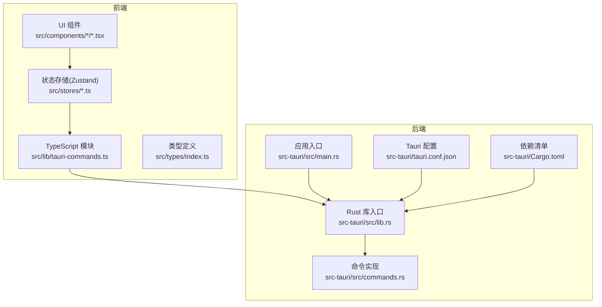
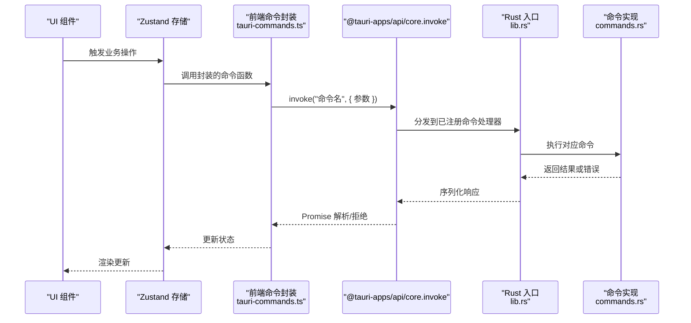
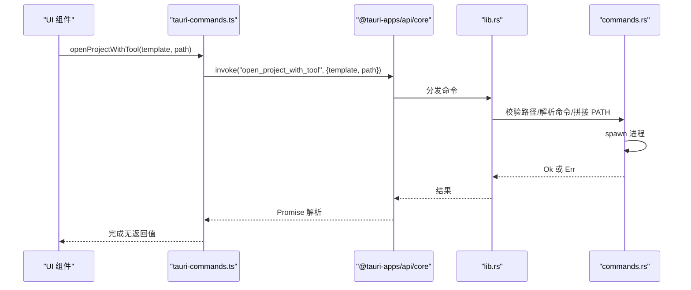
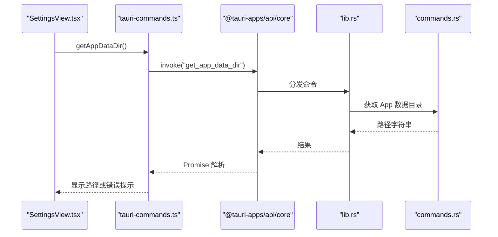
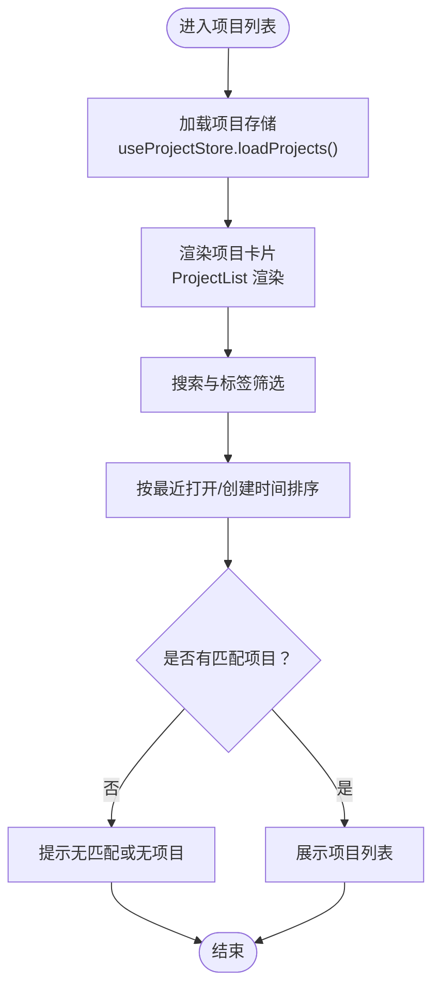
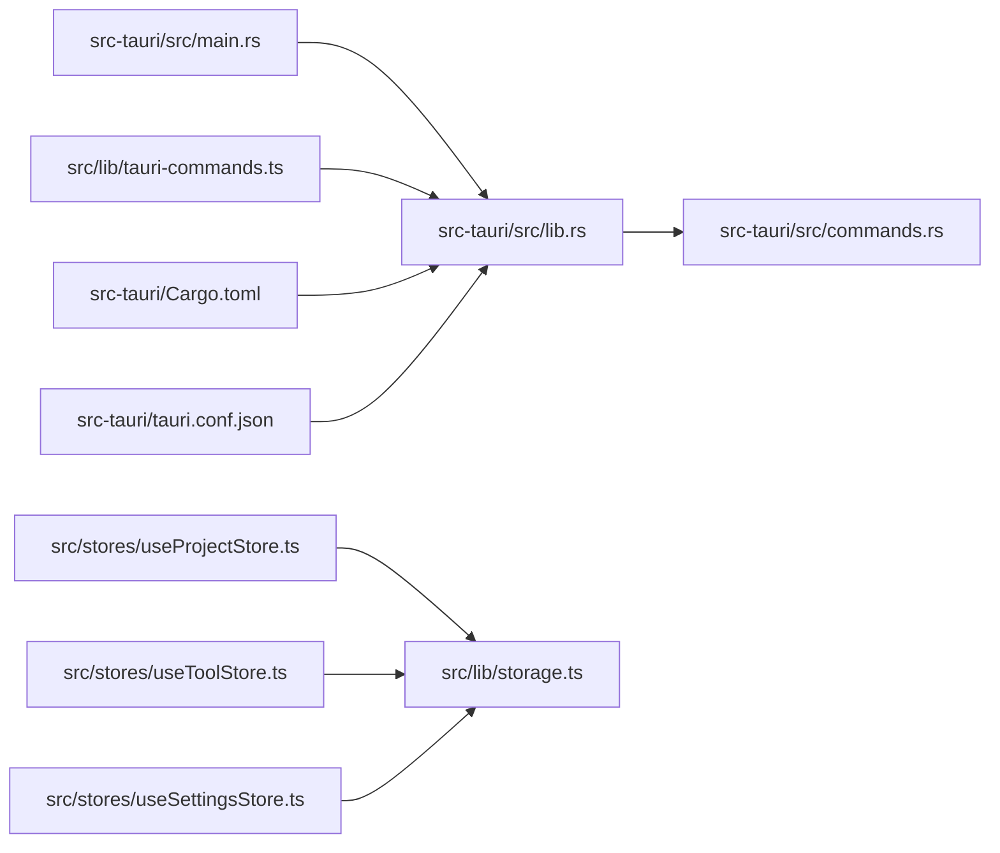

# API 参考

<cite>
**本文引用的文件**
- [src-tauri/src/commands.rs](file://src-tauri/src/commands.rs)
- [src-tauri/src/lib.rs](file://src-tauri/src/lib.rs)
- [src-tauri/src/main.rs](file://src-tauri/src/main.rs)
- [src-tauri/Cargo.toml](file://src-tauri/Cargo.toml)
- [src-tauri/tauri.conf.json](file://src-tauri/tauri.conf.json)
- [src/lib/tauri-commands.ts](file://src/lib/tauri-commands.ts)
- [src/types/index.ts](file://src/types/index.ts)
- [src/lib/storage.ts](file://src/lib/storage.ts)
- [src/lib/constants.ts](file://src/lib/constants.ts)
- [src/stores/useProjectStore.ts](file://src/stores/useProjectStore.ts)
- [src/stores/useToolStore.ts](file://src/stores/useToolStore.ts)
- [src/stores/useSettingsStore.ts](file://src/stores/useSettingsStore.ts)
- [src/components/project/ProjectList.tsx](file://src/components/project/ProjectList.tsx)
- [src/components/tool/ToolList.tsx](file://src/components/tool/ToolList.tsx)
- [src/components/settings/SettingsView.tsx](file://src/components/settings/SettingsView.tsx)
</cite>

## 目录
1. [简介](#简介)
2. [项目结构](#项目结构)
3. [核心组件](#核心组件)
4. [架构总览](#架构总览)
5. [详细组件分析](#详细组件分析)
6. [依赖关系分析](#依赖关系分析)
7. [性能考量](#性能考量)
8. [故障排除指南](#故障排除指南)
9. [结论](#结论)
10. [附录](#附录)

## 简介
本文件为 LaunchPro 的完整 API 参考文档，覆盖 Tauri 命令接口规范（参数、返回值、错误）、前端 TypeScript 接口与类型定义（项目、工具、设置等），以及命令调用的异步模式与 Promise 处理方式。文档还包含 API 使用示例、时序图与数据流图、版本管理与兼容性策略、性能优化建议、安全与权限控制说明，以及调试与故障排除指南。

## 项目结构
- 后端（Rust）：位于 src-tauri，包含命令实现、插件注册、应用入口与配置。
- 前端（TypeScript + React）：位于 src，包含类型定义、状态存储、UI 组件与 Tauri 命令封装。

图表来源
- [src-tauri/src/lib.rs:1-28](file://src-tauri/src/lib.rs#L1-L28)
- [src-tauri/src/main.rs:1-7](file://src-tauri/src/main.rs#L1-L7)
- [src-tauri/src/commands.rs:1-95](file://src-tauri/src/commands.rs#L1-L95)
- [src-tauri/tauri.conf.json:1-44](file://src-tauri/tauri.conf.json#L1-L44)
- [src-tauri/Cargo.toml:1-22](file://src-tauri/Cargo.toml#L1-L22)
- [src/lib/tauri-commands.ts:1-17](file://src/lib/tauri-commands.ts#L1-L17)
- [src/types/index.ts:1-26](file://src/types/index.ts#L1-L26)
- [src/stores/useProjectStore.ts:1-67](file://src/stores/useProjectStore.ts#L1-L67)
- [src/stores/useToolStore.ts:1-75](file://src/stores/useToolStore.ts#L1-L75)
- [src/stores/useSettingsStore.ts:1-34](file://src/stores/useSettingsStore.ts#L1-L34)

章节来源
- [src-tauri/src/lib.rs:1-28](file://src-tauri/src/lib.rs#L1-L28)
- [src-tauri/src/main.rs:1-7](file://src-tauri/src/main.rs#L1-L7)
- [src-tauri/src/commands.rs:1-95](file://src-tauri/src/commands.rs#L1-L95)
- [src-tauri/tauri.conf.json:1-44](file://src-tauri/tauri.conf.json#L1-L44)
- [src-tauri/Cargo.toml:1-22](file://src-tauri/Cargo.toml#L1-L22)
- [src/lib/tauri-commands.ts:1-17](file://src/lib/tauri-commands.ts#L1-L17)
- [src/types/index.ts:1-26](file://src/types/index.ts#L1-L26)
- [src/stores/useProjectStore.ts:1-67](file://src/stores/useProjectStore.ts#L1-L67)
- [src/stores/useToolStore.ts:1-75](file://src/stores/useToolStore.ts#L1-L75)
- [src/stores/useSettingsStore.ts:1-34](file://src/stores/useSettingsStore.ts#L1-L34)

## 核心组件
- Tauri 命令层：在 Rust 中通过 #[tauri::command] 注解声明命令，并在 lib.rs 中集中注册。
- 前端命令封装：在 TypeScript 中使用 @tauri-apps/api/core 的 invoke 调用后端命令。
- 数据模型与状态：通过 TypeScript 类型定义与 Zustand 状态存储持久化与同步。
- 插件与能力：使用 tauri-plugin-store、tauri-plugin-shell、tauri-plugin-dialog 等。

章节来源
- [src-tauri/src/commands.rs:48-95](file://src-tauri/src/commands.rs#L48-L95)
- [src-tauri/src/lib.rs:10-14](file://src-tauri/src/lib.rs#L10-L14)
- [src/lib/tauri-commands.ts:1-17](file://src/lib/tauri-commands.ts#L1-L17)
- [src/types/index.ts:1-26](file://src/types/index.ts#L1-L26)
- [src/lib/storage.ts:1-30](file://src/lib/storage.ts#L1-L30)

## 架构总览
下图展示从前端到后端的调用链路与数据流。

图表来源
- [src/lib/tauri-commands.ts:1-17](file://src/lib/tauri-commands.ts#L1-L17)
- [src-tauri/src/lib.rs:10-14](file://src-tauri/src/lib.rs#L10-L14)
- [src-tauri/src/commands.rs:48-95](file://src-tauri/src/commands.rs#L48-L95)

## 详细组件分析

### Tauri 命令接口规范

- 命令：open_project_with_tool
  - 功能：根据模板命令与项目路径打开项目。
  - 参数
    - commandTemplate: 字符串，命令模板，支持 {path} 占位符。
    - projectPath: 字符串，项目目录路径。
  - 返回值
    - 成功：无返回体（Promise<void>）。
    - 失败：字符串错误信息。
  - 错误处理
    - 当路径不存在或非目录时返回明确错误。
    - 当命令为空或无法执行时返回错误。
    - 在 macOS 上会构建系统 PATH 并注入环境变量。
  - 异步与 Promise
    - 前端以 Promise 形式等待后端执行完成；失败时捕获错误并提示。
  - 使用示例（路径）
    - 前端调用：[src/lib/tauri-commands.ts:3-8](file://src/lib/tauri-commands.ts#L3-L8)
    - 后端实现：[src-tauri/src/commands.rs:48-79](file://src-tauri/src/commands.rs#L48-L79)

- 命令：check_path_exists
  - 功能：检查路径是否存在且为目录。
  - 参数
    - path: 字符串，待检查路径。
  - 返回值
    - 成功：布尔值。
    - 失败：字符串错误信息。
  - 使用示例（路径）
    - 前端调用：[src/lib/tauri-commands.ts:10-12](file://src/lib/tauri-commands.ts#L10-L12)
    - 后端实现：[src-tauri/src/commands.rs:82-85](file://src-tauri/src/commands.rs#L82-L85)

- 命令：get_app_data_dir
  - 功能：获取应用数据目录路径。
  - 参数：无。
  - 返回值
    - 成功：字符串（路径）。
    - 失败：字符串错误信息。
  - 使用示例（路径）
    - 前端调用：[src/lib/tauri-commands.ts:14-16](file://src/lib/tauri-commands.ts#L14-L16)
    - 后端实现：[src-tauri/src/commands.rs:87-94](file://src-tauri/src/commands.rs#L87-L94)

章节来源
- [src-tauri/src/commands.rs:48-95](file://src-tauri/src/commands.rs#L48-L95)
- [src/lib/tauri-commands.ts:1-17](file://src/lib/tauri-commands.ts#L1-L17)

### 前端 TypeScript 接口与类型定义

- 类型定义
  - Project：项目实体，包含标识、名称、路径、默认工具、标签、备注、时间戳等字段。
  - Tool：工具实体，包含标识、名称、图标、命令模板、是否内置标志。
  - Settings：设置实体，包含默认工具与主题。
  - ActiveView：视图枚举。
  - 路径参考：[src/types/index.ts:1-26](file://src/types/index.ts#L1-L26)

- 状态存储与持久化
  - 项目存储：useProjectStore，负责加载、新增、更新、删除、更新最近打开时间，并通过 LazyStore 持久化到 projects.json。
  - 工具存储：useToolStore，负责加载、合并内置工具、新增、更新、删除自定义工具，并持久化到 tools.json。
  - 设置存储：useSettingsStore，负责加载与更新设置，并持久化到 settings.json。
  - 路径参考：
    - [src/stores/useProjectStore.ts:1-67](file://src/stores/useProjectStore.ts#L1-L67)
    - [src/stores/useToolStore.ts:1-75](file://src/stores/useToolStore.ts#L1-L75)
    - [src/stores/useSettingsStore.ts:1-34](file://src/stores/useSettingsStore.ts#L1-L34)
    - [src/lib/storage.ts:1-30](file://src/lib/storage.ts#L1-L30)
    - [src/lib/constants.ts:1-23](file://src/lib/constants.ts#L1-L23)

- UI 组件中的命令调用
  - 项目列表：过滤、排序、标签筛选、添加项目等。
  - 工具列表：显示内置与自定义工具、编辑与删除（内置不可删）。
  - 设置视图：切换主题、选择默认工具、查看应用数据目录。
  - 路径参考：
    - [src/components/project/ProjectList.tsx:1-168](file://src/components/project/ProjectList.tsx#L1-L168)
    - [src/components/tool/ToolList.tsx:1-129](file://src/components/tool/ToolList.tsx#L1-L129)
    - [src/components/settings/SettingsView.tsx:1-111](file://src/components/settings/SettingsView.tsx#L1-L111)

章节来源
- [src/types/index.ts:1-26](file://src/types/index.ts#L1-L26)
- [src/stores/useProjectStore.ts:1-67](file://src/stores/useProjectStore.ts#L1-L67)
- [src/stores/useToolStore.ts:1-75](file://src/stores/useToolStore.ts#L1-L75)
- [src/stores/useSettingsStore.ts:1-34](file://src/stores/useSettingsStore.ts#L1-L34)
- [src/lib/storage.ts:1-30](file://src/lib/storage.ts#L1-L30)
- [src/lib/constants.ts:1-23](file://src/lib/constants.ts#L1-L23)
- [src/components/project/ProjectList.tsx:1-168](file://src/components/project/ProjectList.tsx#L1-L168)
- [src/components/tool/ToolList.tsx:1-129](file://src/components/tool/ToolList.tsx#L1-L129)
- [src/components/settings/SettingsView.tsx:1-111](file://src/components/settings/SettingsView.tsx#L1-L111)

### 命令调用流程与时序图

- 打开项目流程（open_project_with_tool）

图表来源
- [src/lib/tauri-commands.ts:3-8](file://src/lib/tauri-commands.ts#L3-L8)
- [src-tauri/src/lib.rs:10-14](file://src-tauri/src/lib.rs#L10-L14)
- [src-tauri/src/commands.rs:48-79](file://src-tauri/src/commands.rs#L48-L79)

- 获取应用数据目录流程（get_app_data_dir）

图表来源
- [src/components/settings/SettingsView.tsx:26-33](file://src/components/settings/SettingsView.tsx#L26-L33)
- [src/lib/tauri-commands.ts:14-16](file://src/lib/tauri-commands.ts#L14-L16)
- [src-tauri/src/lib.rs:10-14](file://src-tauri/src/lib.rs#L10-L14)
- [src-tauri/src/commands.rs:87-94](file://src-tauri/src/commands.rs#L87-L94)

### 数据流图（项目列表）

图表来源
- [src/components/project/ProjectList.tsx:29-55](file://src/components/project/ProjectList.tsx#L29-L55)
- [src/stores/useProjectStore.ts:20-28](file://src/stores/useProjectStore.ts#L20-L28)

## 依赖关系分析

图表来源
- [src-tauri/src/main.rs:1-7](file://src-tauri/src/main.rs#L1-L7)
- [src-tauri/src/lib.rs:1-28](file://src-tauri/src/lib.rs#L1-L28)
- [src-tauri/src/commands.rs:1-95](file://src-tauri/src/commands.rs#L1-L95)
- [src/lib/tauri-commands.ts:1-17](file://src/lib/tauri-commands.ts#L1-L17)
- [src/lib/storage.ts:1-30](file://src/lib/storage.ts#L1-L30)
- [src/stores/useProjectStore.ts:1-67](file://src/stores/useProjectStore.ts#L1-L67)
- [src/stores/useToolStore.ts:1-75](file://src/stores/useToolStore.ts#L1-L75)
- [src/stores/useSettingsStore.ts:1-34](file://src/stores/useSettingsStore.ts#L1-L34)
- [src-tauri/Cargo.toml:1-22](file://src-tauri/Cargo.toml#L1-L22)
- [src-tauri/tauri.conf.json:1-44](file://src-tauri/tauri.conf.json#L1-L44)

章节来源
- [src-tauri/src/main.rs:1-7](file://src-tauri/src/main.rs#L1-L7)
- [src-tauri/src/lib.rs:1-28](file://src-tauri/src/lib.rs#L1-L28)
- [src-tauri/src/commands.rs:1-95](file://src-tauri/src/commands.rs#L1-L95)
- [src/lib/tauri-commands.ts:1-17](file://src/lib/tauri-commands.ts#L1-L17)
- [src/lib/storage.ts:1-30](file://src/lib/storage.ts#L1-L30)
- [src/stores/useProjectStore.ts:1-67](file://src/stores/useProjectStore.ts#L1-L67)
- [src/stores/useToolStore.ts:1-75](file://src/stores/useToolStore.ts#L1-L75)
- [src/stores/useSettingsStore.ts:1-34](file://src/stores/useSettingsStore.ts#L1-L34)
- [src-tauri/Cargo.toml:1-22](file://src-tauri/Cargo.toml#L1-L22)
- [src-tauri/tauri.conf.json:1-44](file://src-tauri/tauri.conf.json#L1-L44)

## 性能考量
- 前端渲染
  - 使用 useMemo 对项目过滤与排序进行缓存，避免重复计算。
  - 列表滚动区域使用 ScrollArea，减少重排。
- 状态与存储
  - LazyStore 自动保存，避免频繁手动写入；批量更新后再写入可降低 I/O。
  - 工具加载时先读取已有工具，再合并内置工具，避免每次启动都重写。
- 命令执行
  - open_project_with_tool 仅做轻量校验与进程派生，避免阻塞 UI。
  - macOS 下构建 PATH 仅在命令执行前一次性生成，减少重复开销。
- 最佳实践
  - 将耗时逻辑放在后台线程或异步任务中，保持 UI 流畅。
  - 对频繁查询的数据（如工具列表）进行本地缓存与去重。
  - 合理拆分组件，按需渲染，避免全量重绘。

## 故障排除指南
- 常见错误与排查
  - “路径不存在或非目录”：确认 projectPath 是否存在且为目录；可在 UI 中使用 check_path_exists 预检。
  - “命令模板为空”：确保传入的 commandTemplate 非空，且包含 {path} 占位符。
  - “无法执行程序”：检查 PATH 构建是否正确（macOS 已自动注入常见路径），确认程序是否安装。
  - “获取应用数据目录失败”：检查 AppHandle 初始化与权限；必要时在 UI 中捕获错误并提示用户。
- 调试建议
  - 在 SettingsView 中点击“显示数据目录”，验证后端返回路径是否符合预期。
  - 使用浏览器开发者工具观察 invoke 调用的 Promise 解析与拒绝分支。
  - 在 Rust 侧启用日志（如需要）或通过错误字符串定位问题。
- 相关实现参考
  - 错误返回与路径校验：[src-tauri/src/commands.rs:48-85](file://src-tauri/src/commands.rs#L48-L85)
  - 前端错误提示：[src/components/settings/SettingsView.tsx:26-33](file://src/components/settings/SettingsView.tsx#L26-L33)

章节来源
- [src-tauri/src/commands.rs:48-95](file://src-tauri/src/commands.rs#L48-L95)
- [src/components/settings/SettingsView.tsx:26-33](file://src/components/settings/SettingsView.tsx#L26-L33)

## 结论
本 API 参考文档梳理了 LaunchPro 的 Tauri 命令接口、前端封装与类型定义、状态存储与 UI 交互，提供了调用流程与时序图、数据流图、性能优化建议与故障排除方法。遵循本文档的接口规范与最佳实践，可确保前后端协作稳定、可维护性强，并具备良好的扩展性与兼容性。

## 附录

### API 版本管理与向后兼容策略
- 版本号来源
  - 应用与包版本均在 tauri.conf.json 与 Cargo.toml 中声明，当前版本为 0.1.0。
- 命令演进
  - 新增命令时，保持现有命令签名不变，避免破坏既有调用方。
  - 对于可能影响行为的变更，优先通过参数扩展而非破坏性修改。
- 配置与能力
  - 通过 tauri.conf.json 管理窗口、打包与平台最低版本要求，避免运行时动态变更导致不一致。
- 参考路径
  - [src-tauri/tauri.conf.json:1-44](file://src-tauri/tauri.conf.json#L1-L44)
  - [src-tauri/Cargo.toml:1-22](file://src-tauri/Cargo.toml#L1-L22)

### 安全与权限控制
- 权限边界
  - 命令仅暴露必要的系统能力（文件系统访问、外部进程派生），避免授予无关权限。
- 输入校验
  - 对路径与命令模板进行基本校验，防止非法输入导致的异常。
- 平台差异
  - macOS 下 PATH 注入遵循常见 IDE 安装位置，减少查找失败风险。
- 参考路径
  - [src-tauri/src/commands.rs:7-46](file://src-tauri/src/commands.rs#L7-L46)
  - [src-tauri/src/lib.rs:7-9](file://src-tauri/src/lib.rs#L7-L9)