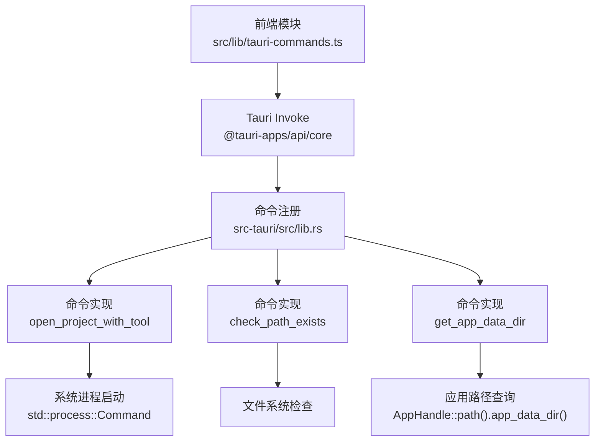
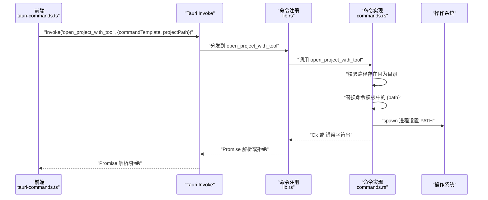
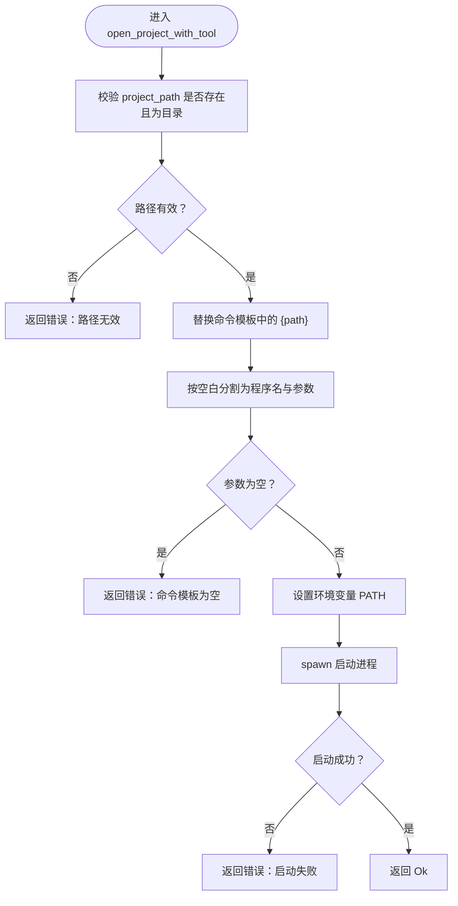
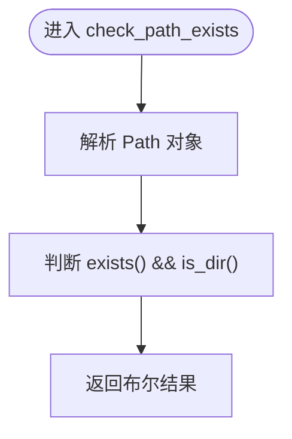
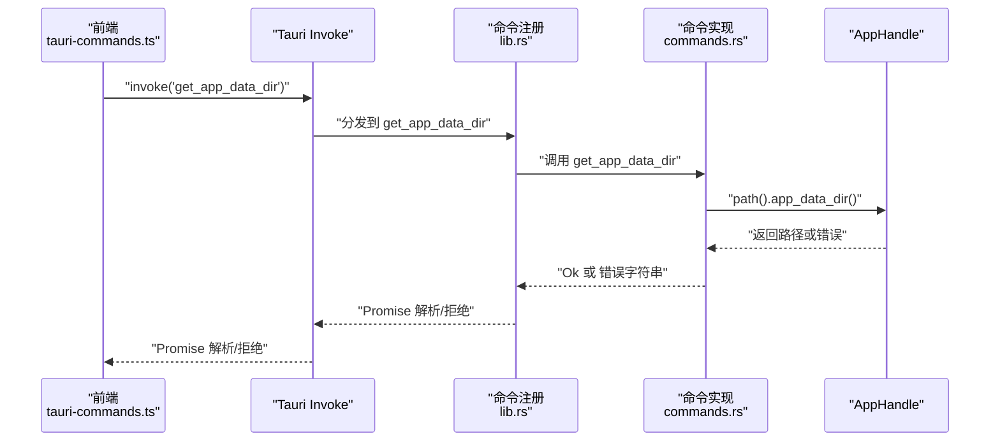
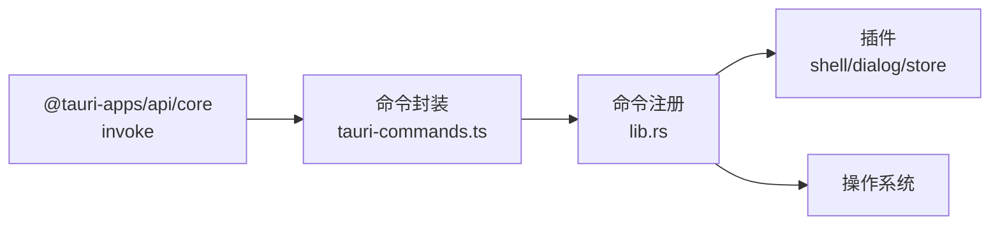

# Tauri 命令接口

<cite>
**本文引用的文件**
- [src-tauri/src/commands.rs](file://src-tauri/src/commands.rs)
- [src-tauri/src/lib.rs](file://src-tauri/src/lib.rs)
- [src-tauri/src/main.rs](file://src-tauri/src/main.rs)
- [src/lib/tauri-commands.ts](file://src/lib/tauri-commands.ts)
- [src/hooks/useOpenProject.ts](file://src/hooks/useOpenProject.ts)
- [src/types/index.ts](file://src/types/index.ts)
- [src-tauri/tauri.conf.json](file://src-tauri/tauri.conf.json)
- [src-tauri/Cargo.toml](file://src-tauri/Cargo.toml)
- [src-tauri/capabilities/default.json](file://src-tauri/capabilities/default.json)
</cite>

## 目录
1. [简介](#简介)
2. [项目结构](#项目结构)
3. [核心组件](#核心组件)
4. [架构总览](#架构总览)
5. [详细组件分析](#详细组件分析)
6. [依赖关系分析](#依赖关系分析)
7. [性能考量](#性能考量)
8. [故障排查指南](#故障排查指南)
9. [结论](#结论)
10. [附录](#附录)

## 简介
本文件为 LaunchPro 的 Tauri 命令接口提供完整的 API 规范与使用说明，覆盖以下前端调用的 Rust 命令：
- openProjectWithTool：通过工具命令模板打开项目目录
- checkPathExists：检查路径是否存在且为目录
- getAppDataDir：获取应用数据目录路径

文档内容包括参数类型、返回值格式、错误处理机制、异步调用与 Promise 处理示例、安全与权限控制、时序与数据流图、性能与调试建议等。

## 项目结构
前端通过 @tauri-apps/api 的 invoke 调用后端命令；后端在 Tauri Builder 中注册命令，并由生成的 handler 分发到具体函数实现。

**图表来源**
- [src/lib/tauri-commands.ts:1-17](file://src/lib/tauri-commands.ts#L1-L17)
- [src-tauri/src/lib.rs:10-14](file://src-tauri/src/lib.rs#L10-L14)
- [src-tauri/src/commands.rs:48-94](file://src-tauri/src/commands.rs#L48-L94)

**章节来源**
- [src/lib/tauri-commands.ts:1-17](file://src/lib/tauri-commands.ts#L1-L17)
- [src-tauri/src/lib.rs:10-14](file://src-tauri/src/lib.rs#L10-L14)
- [src-tauri/src/commands.rs:48-94](file://src-tauri/src/commands.rs#L48-L94)

## 核心组件
- 前端命令封装：位于 src/lib/tauri-commands.ts，导出三个异步函数，分别对应后端命令 open_project_with_tool、check_path_exists、get_app_data_dir。
- 后端命令实现：位于 src-tauri/src/commands.rs，包含三个 #[tauri::command] 函数，分别处理项目打开、路径校验与应用数据目录查询。
- 命令注册：在 src-tauri/src/lib.rs 的 invoke_handler 中注册上述命令，使前端可通过 invoke('...') 调用。
- 使用示例：src/hooks/useOpenProject.ts 展示了如何在 React Hook 中调用 open_project_with_tool 并处理结果与错误。

**章节来源**
- [src/lib/tauri-commands.ts:1-17](file://src/lib/tauri-commands.ts#L1-L17)
- [src-tauri/src/commands.rs:48-94](file://src-tauri/src/commands.rs#L48-L94)
- [src-tauri/src/lib.rs:10-14](file://src-tauri/src/lib.rs#L10-L14)
- [src/hooks/useOpenProject.ts:1-44](file://src/hooks/useOpenProject.ts#L1-L44)

## 架构总览
下图展示从前端调用到后端执行再到系统交互的整体流程。

**图表来源**
- [src/lib/tauri-commands.ts:3-8](file://src/lib/tauri-commands.ts#L3-L8)
- [src-tauri/src/lib.rs:10-14](file://src-tauri/src/lib.rs#L10-L14)
- [src-tauri/src/commands.rs:49-79](file://src-tauri/src/commands.rs#L49-L79)

## 详细组件分析

### openProjectWithTool 命令
- 功能：根据工具命令模板与项目路径，启动外部程序打开项目目录。
- 前端签名：async openProjectWithTool(commandTemplate: string, projectPath: string): Promise<void>
- 后端签名：#[tauri::command] fn open_project_with_tool(command_template: String, project_path: String) -> Result<(), String>
- 参数
  - commandTemplate: 字符串，命令模板，其中 {path} 将被替换为实际项目路径
  - projectPath: 字符串，目标项目目录路径
- 返回值
  - 成功：无返回值（Promise 解析）
  - 失败：返回错误字符串（Promise 拒绝）
- 错误处理
  - 若项目路径不存在或不是目录，返回错误信息
  - 若命令模板为空，返回错误信息
  - 启动进程失败时，返回包含程序名与底层错误的字符串
- 安全与权限
  - 需要 shell:allow-open 权限以允许外部程序启动
  - 建议仅允许受信任的工具命令模板
- 性能与行为
  - 异步非阻塞启动外部进程
  - 自动构建 PATH，优先读取 /etc/paths 与常见 IDE 安装路径，再回退当前 PATH
- 使用示例
  - 在 React Hook 中调用：await openProjectWithTool(tool.command, project.path)，并结合状态更新与提示

**图表来源**
- [src-tauri/src/commands.rs:49-79](file://src-tauri/src/commands.rs#L49-L79)
- [src/lib/tauri-commands.ts:3-8](file://src/lib/tauri-commands.ts#L3-L8)

**章节来源**
- [src/lib/tauri-commands.ts:3-8](file://src/lib/tauri-commands.ts#L3-L8)
- [src-tauri/src/commands.rs:49-79](file://src-tauri/src/commands.rs#L49-L79)
- [src-tauri/capabilities/default.json:13](file://src-tauri/capabilities/default.json#L13)
- [src/hooks/useOpenProject.ts:31-37](file://src/hooks/useOpenProject.ts#L31-L37)

### checkPathExists 命令
- 功能：判断给定路径是否存在且为目录
- 前端签名：async checkPathExists(path: string): Promise<boolean>
- 后端签名：#[tauri::command] fn check_path_exists(path: String) -> Result<bool, String>
- 参数
  - path: 字符串，待检查的路径
- 返回值
  - 成功：布尔值（true 表示存在且为目录，否则 false）
  - 失败：错误字符串
- 错误处理
  - 内部未显式返回错误，仅返回布尔判断结果
- 使用场景
  - UI 中启用/禁用“打开”按钮
  - 输入校验与提示

**图表来源**
- [src-tauri/src/commands.rs:82-85](file://src-tauri/src/commands.rs#L82-L85)
- [src/lib/tauri-commands.ts:10-12](file://src/lib/tauri-commands.ts#L10-L12)

**章节来源**
- [src/lib/tauri-commands.ts:10-12](file://src/lib/tauri-commands.ts#L10-L12)
- [src-tauri/src/commands.rs:82-85](file://src-tauri/src/commands.rs#L82-L85)

### getAppDataDir 命令
- 功能：获取应用数据目录路径
- 前端签名：async getAppDataDir(): Promise<string>
- 后端签名：#[tauri::command] fn get_app_data_dir(app_handle: tauri::AppHandle) -> Result<String, String>
- 参数
  - 无参数（隐式接收 AppHandle）
- 返回值
  - 成功：字符串（应用数据目录绝对路径）
  - 失败：错误字符串
- 错误处理
  - 当无法解析应用数据目录时，返回错误信息
- 使用场景
  - 存储用户偏好、缓存或日志文件

**图表来源**
- [src/lib/tauri-commands.ts:14-16](file://src/lib/tauri-commands.ts#L14-L16)
- [src-tauri/src/lib.rs:10-14](file://src-tauri/src/lib.rs#L10-L14)
- [src-tauri/src/commands.rs:88-94](file://src-tauri/src/commands.rs#L88-L94)

**章节来源**
- [src/lib/tauri-commands.ts:14-16](file://src/lib/tauri-commands.ts#L14-L16)
- [src-tauri/src/commands.rs:88-94](file://src-tauri/src/commands.rs#L88-L94)

## 依赖关系分析
- 前端依赖
  - @tauri-apps/api/core 提供 invoke 能力
  - React Hooks 与状态管理用于组织调用与反馈
- 后端依赖
  - tauri::Builder 注册命令与插件
  - tauri-plugin-shell 允许 shell 操作（如 open/spawn）
  - tauri-plugin-dialog 与 tauri-plugin-store 提供对话框与存储能力
- 能力与权限
  - capabilities/default.json 声明窗口与插件权限，包含 shell:allow-open、dialog:default、store:default 等

**图表来源**
- [src/lib/tauri-commands.ts:1](file://src/lib/tauri-commands.ts#L1-L1)
- [src-tauri/src/lib.rs:7-9](file://src-tauri/src/lib.rs#L7-L9)
- [src-tauri/Cargo.toml:16-21](file://src-tauri/Cargo.toml#L16-L21)
- [src-tauri/capabilities/default.json:13](file://src-tauri/capabilities/default.json#L13)

**章节来源**
- [src-tauri/Cargo.toml:16-21](file://src-tauri/Cargo.toml#L16-L21)
- [src-tauri/capabilities/default.json:5-16](file://src-tauri/capabilities/default.json#L5-L16)

## 性能考量
- 异步非阻塞：命令均为异步 Promise，避免阻塞 UI 线程
- 进程启动开销：openProjectWithTool 启动外部进程，建议在调用前进行路径与命令模板校验，减少失败重试
- PATH 构建：get_system_path 会读取 /etc/paths 并合并常见路径，首次调用可能有少量 IO 开销，可在应用初始化阶段复用结果
- 错误快速返回：checkPathExists 与 getAppDataDir 为轻量操作，可频繁调用

[本节为通用性能建议，不直接分析特定文件]

## 故障排查指南
- openProjectWithTool 返回“路径无效”
  - 检查 projectPath 是否存在且为目录
  - 确认命令模板中 {path} 占位符是否正确
- openProjectWithTool 返回“命令模板为空”
  - 检查传入的 commandTemplate 是否为空或仅含空白字符
- openProjectWithTool 返回“启动失败”
  - 检查程序名是否存在于 PATH，确认已设置正确的 PATH 环境变量
  - 确认 shell:allow-open 权限已启用
- checkPathExists 返回 false
  - 可能是文件而非目录，或路径不存在
- getAppDataDir 返回错误
  - 检查应用路径解析权限与平台支持

**章节来源**
- [src-tauri/src/commands.rs:51-56](file://src-tauri/src/commands.rs#L51-L56)
- [src-tauri/src/commands.rs:63-65](file://src-tauri/src/commands.rs#L63-L65)
- [src-tauri/src/commands.rs:72-76](file://src-tauri/src/commands.rs#L72-L76)
- [src-tauri/src/commands.rs:82-85](file://src-tauri/src/commands.rs#L82-L85)
- [src-tauri/src/commands.rs:89-93](file://src-tauri/src/commands.rs#L89-L93)
- [src-tauri/capabilities/default.json:13](file://src-tauri/capabilities/default.json#L13)

## 结论
本文档对 LaunchPro 的 Tauri 命令接口进行了全面梳理，明确了 openProjectWithTool、checkPathExists、getAppDataDir 三类命令的参数、返回值、错误处理、安全与权限控制、调用时序与数据流，并提供了使用示例与最佳实践。建议在生产环境中严格限制命令模板来源，确保 PATH 设置正确，并对异常情况进行统一提示与日志记录。

[本节为总结性内容，不直接分析特定文件]

## 附录

### 命令调用与 Promise 处理示例
- 打开项目
  - 前端：await openProjectWithTool(tool.command, project.path)
  - 错误处理：try/catch 包裹，toast 提示
- 路径校验
  - 前端：const exists = await checkPathExists(path)
  - UI：根据 exists 控制按钮可用性
- 获取应用数据目录
  - 前端：const dir = await getAppDataDir()

**章节来源**
- [src/lib/tauri-commands.ts:3-16](file://src/lib/tauri-commands.ts#L3-L16)
- [src/hooks/useOpenProject.ts:31-37](file://src/hooks/useOpenProject.ts#L31-L37)

### 安全与权限控制
- shell:allow-open：允许外部程序启动，需谨慎授予
- dialog:default、store:default：默认启用，便于弹窗与本地存储
- 建议最小权限原则：仅授予必要能力，避免开放高风险操作

**章节来源**
- [src-tauri/capabilities/default.json:5-16](file://src-tauri/capabilities/default.json#L5-L16)

### 关键类型定义参考
- Project：包含 id、name、path、defaultTool、tags、note、lastOpened、createdAt
- Tool：包含 id、name、icon、command、isBuiltin
- Settings：包含 defaultTool、theme

**章节来源**
- [src/types/index.ts:1-26](file://src/types/index.ts#L1-L26)