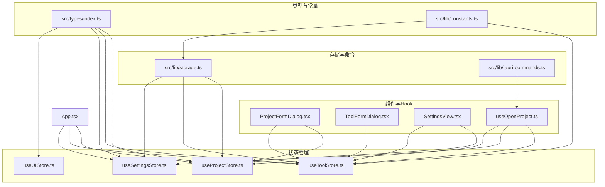
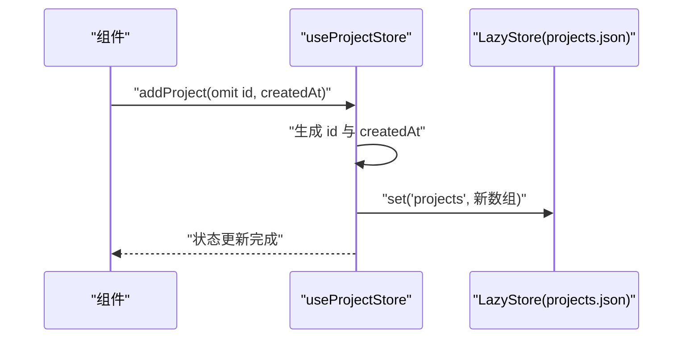
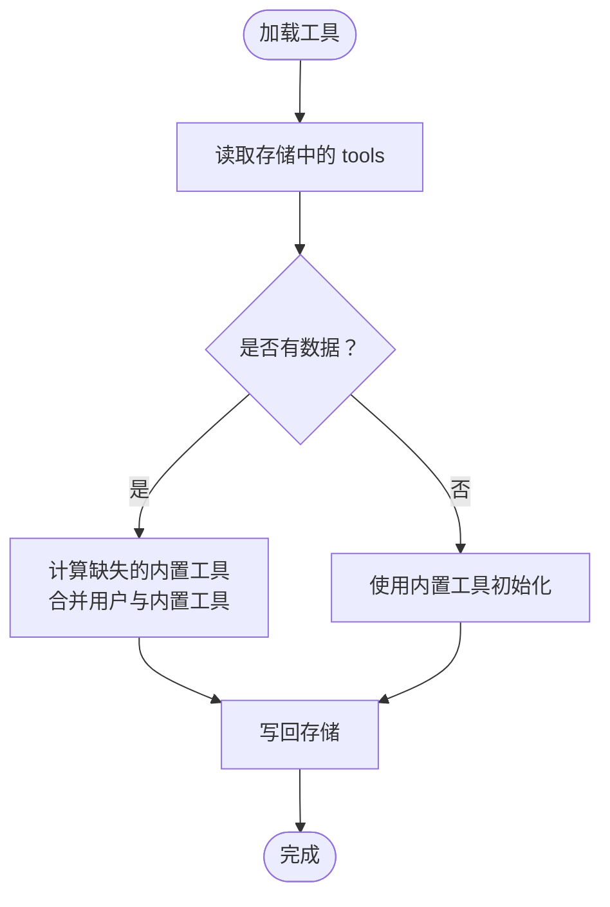
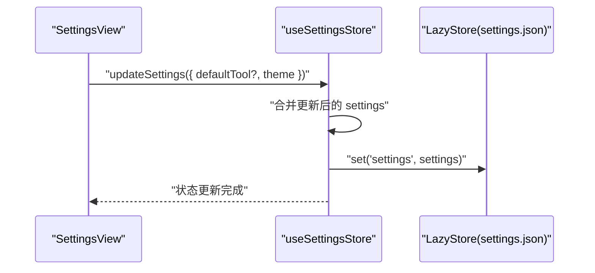
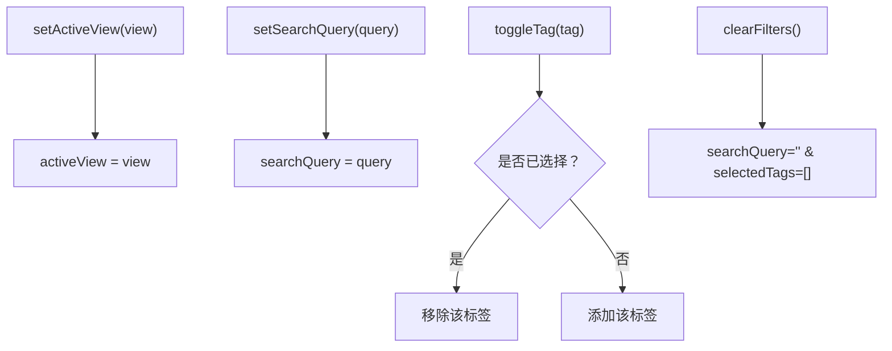
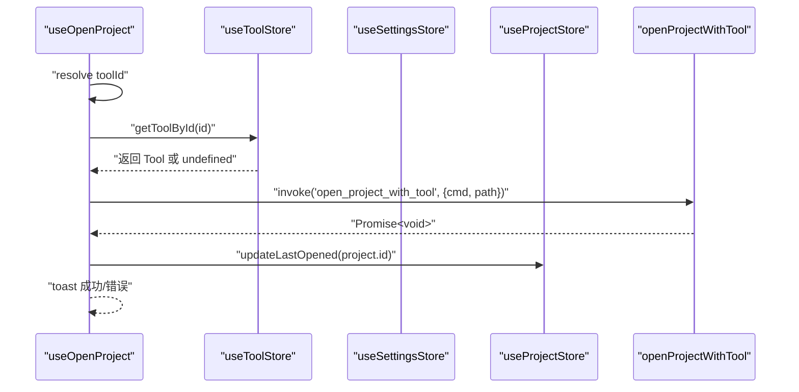
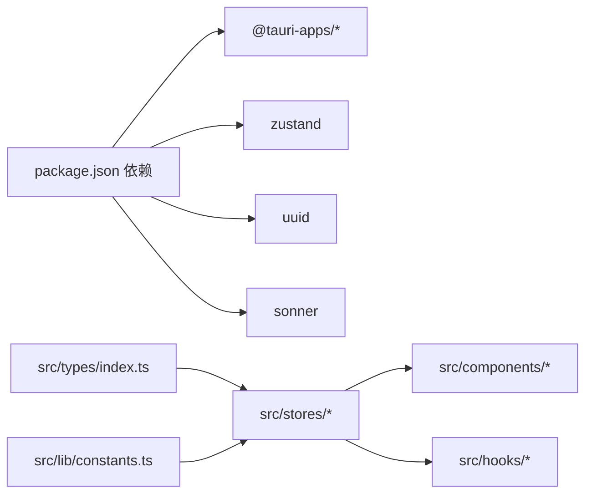

# TypeScript 接口定义

<cite>
**本文档引用的文件**
- [src/types/index.ts](file://src/types/index.ts)
- [src/lib/constants.ts](file://src/lib/constants.ts)
- [src/lib/storage.ts](file://src/lib/storage.ts)
- [src/lib/tauri-commands.ts](file://src/lib/tauri-commands.ts)
- [src/stores/useProjectStore.ts](file://src/stores/useProjectStore.ts)
- [src/stores/useToolStore.ts](file://src/stores/useToolStore.ts)
- [src/stores/useSettingsStore.ts](file://src/stores/useSettingsStore.ts)
- [src/stores/useUIStore.ts](file://src/stores/useUIStore.ts)
- [src/hooks/useOpenProject.ts](file://src/hooks/useOpenProject.ts)
- [src/components/project/ProjectFormDialog.tsx](file://src/components/project/ProjectFormDialog.tsx)
- [src/components/tool/ToolFormDialog.tsx](file://src/components/tool/ToolFormDialog.tsx)
- [src/components/settings/SettingsView.tsx](file://src/components/settings/SettingsView.tsx)
- [src/App.tsx](file://src/App.tsx)
- [package.json](file://package.json)
</cite>

## 目录
1. [简介](#简介)
2. [项目结构](#项目结构)
3. [核心组件](#核心组件)
4. [架构总览](#架构总览)
5. [详细组件分析](#详细组件分析)
6. [依赖分析](#依赖分析)
7. [性能考虑](#性能考虑)
8. [故障排除指南](#故障排除指南)
9. [结论](#结论)
10. [附录](#附录)

## 简介
本文件为 LaunchPro 的 TypeScript 接口定义与使用文档，聚焦以下内容：
- 核心数据模型接口：Project、Tool、Settings 及视图状态 ActiveView 的属性定义、类型约束与默认值
- 工具函数与实用程序接口：类型转换、验证与辅助函数
- 接口继承关系与组合模式：通过 Store 模式与 Hook 模式实现的数据流与行为组合
- 使用示例与代码片段路径：展示在组件与存储层中的实际应用
- 版本演进与向后兼容策略：基于默认值与可选字段的兼容性设计
- 扩展与自定义最佳实践：如何安全地扩展接口与保持兼容性

## 项目结构
LaunchPro 的接口与类型主要分布在以下位置：
- 类型定义：src/types/index.ts
- 常量与默认值：src/lib/constants.ts
- 存储与持久化：src/lib/storage.ts
- Tauri 命令封装：src/lib/tauri-commands.ts
- 状态管理（Zustand）：src/stores/use*.ts
- 组件与 Hook：src/components/* 与 src/hooks/*
- 应用入口与初始化：src/App.tsx
- 依赖声明：package.json



图表来源
- [src/types/index.ts:1-26](file://src/types/index.ts#L1-L26)
- [src/lib/constants.ts:1-23](file://src/lib/constants.ts#L1-L23)
- [src/lib/storage.ts:1-30](file://src/lib/storage.ts#L1-L30)
- [src/lib/tauri-commands.ts:1-17](file://src/lib/tauri-commands.ts#L1-L17)
- [src/stores/useProjectStore.ts:1-67](file://src/stores/useProjectStore.ts#L1-L67)
- [src/stores/useToolStore.ts:1-75](file://src/stores/useToolStore.ts#L1-L75)
- [src/stores/useSettingsStore.ts:1-34](file://src/stores/useSettingsStore.ts#L1-L34)
- [src/stores/useUIStore.ts:1-33](file://src/stores/useUIStore.ts#L1-L33)
- [src/components/project/ProjectFormDialog.tsx:1-229](file://src/components/project/ProjectFormDialog.tsx#L1-L229)
- [src/components/tool/ToolFormDialog.tsx:1-134](file://src/components/tool/ToolFormDialog.tsx#L1-L134)
- [src/components/settings/SettingsView.tsx:1-111](file://src/components/settings/SettingsView.tsx#L1-L111)
- [src/hooks/useOpenProject.ts:1-44](file://src/hooks/useOpenProject.ts#L1-L44)
- [src/App.tsx:1-40](file://src/App.tsx#L1-L40)

章节来源
- [src/types/index.ts:1-26](file://src/types/index.ts#L1-L26)
- [src/lib/constants.ts:1-23](file://src/lib/constants.ts#L1-L23)
- [src/lib/storage.ts:1-30](file://src/lib/storage.ts#L1-L30)
- [src/lib/tauri-commands.ts:1-17](file://src/lib/tauri-commands.ts#L1-L17)
- [src/stores/useProjectStore.ts:1-67](file://src/stores/useProjectStore.ts#L1-L67)
- [src/stores/useToolStore.ts:1-75](file://src/stores/useToolStore.ts#L1-L75)
- [src/stores/useSettingsStore.ts:1-34](file://src/stores/useSettingsStore.ts#L1-L34)
- [src/stores/useUIStore.ts:1-33](file://src/stores/useUIStore.ts#L1-L33)
- [src/components/project/ProjectFormDialog.tsx:1-229](file://src/components/project/ProjectFormDialog.tsx#L1-L229)
- [src/components/tool/ToolFormDialog.tsx:1-134](file://src/components/tool/ToolFormDialog.tsx#L1-L134)
- [src/components/settings/SettingsView.tsx:1-111](file://src/components/settings/SettingsView.tsx#L1-L111)
- [src/hooks/useOpenProject.ts:1-44](file://src/hooks/useOpenProject.ts#L1-L44)
- [src/App.tsx:1-40](file://src/App.tsx#L1-L40)

## 核心组件
本节对核心接口进行逐项解析，并结合默认值与使用场景说明。

- Project 接口
  - 属性定义与约束
    - id: string（唯一标识）
    - name: string（项目名称）
    - path: string（项目路径，必须存在）
    - defaultTool?: string（项目级默认工具 ID，可选）
    - tags: string[]（标签数组）
    - note?: string（备注，可选）
    - lastOpened?: number（最近打开时间戳，可选）
    - createdAt: number（创建时间戳）
  - 默认值与约束
    - 无硬性默认值；新增时由存储层生成 id 并填充 createdAt
    - tags 默认为空数组
    - 可选字段允许空值，便于渐进式数据填充
  - 使用示例与代码片段路径
    - 新增项目：[src/stores/useProjectStore.ts:30-40](file://src/stores/useProjectStore.ts#L30-L40)
    - 更新项目：[src/stores/useProjectStore.ts:42-49](file://src/stores/useProjectStore.ts#L42-L49)
    - 编辑对话框表单：[src/components/project/ProjectFormDialog.tsx:84-134](file://src/components/project/ProjectFormDialog.tsx#L84-L134)

- Tool 接口
  - 属性定义与约束
    - id: string（唯一标识）
    - name: string（工具名称）
    - icon?: string（图标，1-2 字符，可选）
    - command: string（命令模板，必须包含 {path} 占位符）
    - isBuiltin: boolean（是否内置）
  - 默认值与约束
    - 内置工具集合由常量提供，首次加载时写入存储
    - 自定义工具 isBuiltin 为 false
  - 使用示例与代码片段路径
    - 内置工具列表：[src/lib/constants.ts:3-18](file://src/lib/constants.ts#L3-L18)
    - 加载与合并内置工具：[src/stores/useToolStore.ts:21-39](file://src/stores/useToolStore.ts#L21-L39)
    - 添加/更新工具：[src/stores/useToolStore.ts:41-60](file://src/stores/useToolStore.ts#L41-L60)
    - 工具表单校验：[src/components/tool/ToolFormDialog.tsx:44-78](file://src/components/tool/ToolFormDialog.tsx#L44-L78)

- Settings 接口
  - 属性定义与约束
    - defaultTool?: string（全局默认工具 ID，可选）
    - theme: 'light' | 'dark' | 'system'（主题枚举）
  - 默认值与约束
    - 默认主题为 'system'
    - 通过 DEFAULT_SETTINGS 提供初始值
  - 使用示例与代码片段路径
    - 默认设置常量：[src/lib/constants.ts:20-22](file://src/lib/constants.ts#L20-L22)
    - 设置加载与更新：[src/stores/useSettingsStore.ts:17-32](file://src/stores/useSettingsStore.ts#L17-L32)

- ActiveView 枚举类型
  - 取值范围：'projects' | 'tools' | 'settings'
  - 用途：UI 当前视图状态
  - 使用示例与代码片段路径
    - 视图切换逻辑：[src/stores/useUIStore.ts:14-32](file://src/stores/useUIStore.ts#L14-L32)

章节来源
- [src/types/index.ts:1-26](file://src/types/index.ts#L1-L26)
- [src/lib/constants.ts:1-23](file://src/lib/constants.ts#L1-L23)
- [src/stores/useProjectStore.ts:1-67](file://src/stores/useProjectStore.ts#L1-L67)
- [src/stores/useToolStore.ts:1-75](file://src/stores/useToolStore.ts#L1-L75)
- [src/stores/useSettingsStore.ts:1-34](file://src/stores/useSettingsStore.ts#L1-L34)
- [src/stores/useUIStore.ts:1-33](file://src/stores/useUIStore.ts#L1-L33)
- [src/components/project/ProjectFormDialog.tsx:1-229](file://src/components/project/ProjectFormDialog.tsx#L1-L229)
- [src/components/tool/ToolFormDialog.tsx:1-134](file://src/components/tool/ToolFormDialog.tsx#L1-L134)
- [src/components/settings/SettingsView.tsx:1-111](file://src/components/settings/SettingsView.tsx#L1-L111)

## 架构总览
下图展示了接口在系统中的角色与交互关系：

```mermaid
classDiagram
class Project {
+string id
+string name
+string path
+string defaultTool?
+string[] tags
+string note?
+number lastOpened?
+number createdAt
}
class Tool {
+string id
+string name
+string icon?
+string command
+boolean isBuiltin
}
class Settings {
+string defaultTool?
+"light|dark|system" theme
}
class ProjectState {
+Project[] projects
+boolean isLoading
+loadProjects()
+addProject(data)
+updateProject(id, updates)
+deleteProject(id)
+updateLastOpened(id)
}
class ToolState {
+Tool[] tools
+boolean isLoading
+loadTools()
+addTool(data)
+updateTool(id, updates)
+deleteTool(id)
+getToolById(id)
}
class SettingsState {
+Settings settings
+boolean isLoading
+loadSettings()
+updateSettings(updates)
}
class UIState {
+"projects|tools|settings" activeView
+string searchQuery
+string[] selectedTags
+setActiveView(view)
+setSearchQuery(query)
+toggleTag(tag)
+clearFilters()
}
ProjectState --> Project : "管理"
ToolState --> Tool : "管理"
SettingsState --> Settings : "管理"
UIState --> "视图状态"
```

图表来源
- [src/types/index.ts:1-26](file://src/types/index.ts#L1-L26)
- [src/stores/useProjectStore.ts:6-14](file://src/stores/useProjectStore.ts#L6-L14)
- [src/stores/useToolStore.ts:7-15](file://src/stores/useToolStore.ts#L7-L15)
- [src/stores/useSettingsStore.ts:6-11](file://src/stores/useSettingsStore.ts#L6-L11)
- [src/stores/useUIStore.ts:4-12](file://src/stores/useUIStore.ts#L4-L12)

## 详细组件分析

### Project 数据模型与生命周期
- 新增流程
  - 生成唯一 id 与创建时间
  - 写入本地存储并同步到状态
- 更新流程
  - 部分更新，支持仅更新部分字段
- 删除流程
  - 过滤掉指定 id 的项目
- 最近打开时间
  - 打开项目成功后更新 lastOpened



图表来源
- [src/stores/useProjectStore.ts:30-40](file://src/stores/useProjectStore.ts#L30-L40)
- [src/lib/storage.ts:19-21](file://src/lib/storage.ts#L19-L21)

章节来源
- [src/stores/useProjectStore.ts:1-67](file://src/stores/useProjectStore.ts#L1-L67)
- [src/lib/storage.ts:1-30](file://src/lib/storage.ts#L1-L30)

### Tool 数据模型与内置工具合并策略
- 首次启动：使用内置工具初始化
- 后续启动：合并用户自定义工具与缺失的内置工具，保留用户定制
- 删除限制：禁止删除内置工具



图表来源
- [src/stores/useToolStore.ts:21-39](file://src/stores/useToolStore.ts#L21-L39)
- [src/lib/constants.ts:3-18](file://src/lib/constants.ts#L3-L18)

章节来源
- [src/stores/useToolStore.ts:1-75](file://src/stores/useToolStore.ts#L1-L75)
- [src/lib/constants.ts:1-23](file://src/lib/constants.ts#L1-L23)

### Settings 数据模型与主题控制
- 主题枚举：light、dark、system
- 默认主题：system
- 全局默认工具：可选，用于打开项目时的回退



图表来源
- [src/stores/useSettingsStore.ts:27-32](file://src/stores/useSettingsStore.ts#L27-L32)
- [src/lib/constants.ts:20-22](file://src/lib/constants.ts#L20-L22)

章节来源
- [src/stores/useSettingsStore.ts:1-34](file://src/stores/useSettingsStore.ts#L1-L34)
- [src/components/settings/SettingsView.tsx:19-111](file://src/components/settings/SettingsView.tsx#L19-L111)

### UI 状态与视图切换
- activeView：当前激活视图
- 搜索与筛选：searchQuery 与 selectedTags
- 切换逻辑：简单切换与清空过滤器



图表来源
- [src/stores/useUIStore.ts:14-32](file://src/stores/useUIStore.ts#L14-L32)

章节来源
- [src/stores/useUIStore.ts:1-33](file://src/stores/useUIStore.ts#L1-L33)

### 打开项目流程与工具解析
- 解析顺序：传入 toolId > 项目默认 > 全局默认 > 错误提示
- 命令模板替换：将 {path} 替换为项目路径
- 成功/失败反馈：toast 提示



图表来源
- [src/hooks/useOpenProject.ts:9-44](file://src/hooks/useOpenProject.ts#L9-L44)
- [src/lib/tauri-commands.ts:3-8](file://src/lib/tauri-commands.ts#L3-L8)
- [src/stores/useProjectStore.ts:58-65](file://src/stores/useProjectStore.ts#L58-L65)

章节来源
- [src/hooks/useOpenProject.ts:1-44](file://src/hooks/useOpenProject.ts#L1-L44)
- [src/lib/tauri-commands.ts:1-17](file://src/lib/tauri-commands.ts#L1-L17)
- [src/stores/useProjectStore.ts:1-67](file://src/stores/useProjectStore.ts#L1-L67)

### 实用程序与工具函数
- 类名合并工具
  - 功能：合并并优化类名，避免重复与冲突
  - 使用：UI 组件中动态样式拼接
  - 代码片段路径：[src/lib/utils.ts:1-7](file://src/lib/utils.ts#L1-L7)

章节来源
- [src/lib/utils.ts:1-7](file://src/lib/utils.ts#L1-L7)

## 依赖分析
- 外部依赖
  - @tauri-apps/*：跨平台命令调用与本地存储
  - zustand：轻量状态管理
  - uuid：生成唯一 ID
  - sonner：消息提示
- 内部依赖
  - 类型接口被多个存储与组件共享
  - 常量与默认值集中管理，确保一致性



图表来源
- [package.json:13-29](file://package.json#L13-L29)
- [src/types/index.ts:1-26](file://src/types/index.ts#L1-L26)
- [src/lib/constants.ts:1-23](file://src/lib/constants.ts#L1-L23)
- [src/stores/useProjectStore.ts:1-67](file://src/stores/useProjectStore.ts#L1-L67)
- [src/stores/useToolStore.ts:1-75](file://src/stores/useToolStore.ts#L1-L75)
- [src/stores/useSettingsStore.ts:1-34](file://src/stores/useSettingsStore.ts#L1-L34)

章节来源
- [package.json:1-48](file://package.json#L1-L48)

## 性能考虑
- 状态粒度：每个领域（项目/工具/设置/UI）独立存储，降低不必要的重渲染
- 异步加载：初始化阶段并行加载各模块数据
- 本地存储：LazyStore 自动保存，减少手动写入成本
- 可选字段：通过可选字段与默认值避免空检查风暴，提升开发效率

## 故障排除指南
- 路径不存在
  - 表单校验会阻止无效路径提交
  - 代码片段路径：[src/components/project/ProjectFormDialog.tsx:96-102](file://src/components/project/ProjectFormDialog.tsx#L96-L102)
- 工具命令不合法
  - 必须包含 {path} 占位符
  - 代码片段路径：[src/components/tool/ToolFormDialog.tsx:53-56](file://src/components/tool/ToolFormDialog.tsx#L53-L56)
- 打不开项目
  - 检查工具是否存在与命令模板是否正确
  - 代码片段路径：[src/hooks/useOpenProject.ts:24-29](file://src/hooks/useOpenProject.ts#L24-L29)
- 数据目录查看失败
  - Tauri 命令调用异常时会提示错误
  - 代码片段路径：[src/components/settings/SettingsView.tsx:26-33](file://src/components/settings/SettingsView.tsx#L26-L33)

章节来源
- [src/components/project/ProjectFormDialog.tsx:84-134](file://src/components/project/ProjectFormDialog.tsx#L84-L134)
- [src/components/tool/ToolFormDialog.tsx:44-78](file://src/components/tool/ToolFormDialog.tsx#L44-L78)
- [src/hooks/useOpenProject.ts:15-40](file://src/hooks/useOpenProject.ts#L15-L40)
- [src/components/settings/SettingsView.tsx:19-111](file://src/components/settings/SettingsView.tsx#L19-L111)

## 结论
本项目通过清晰的接口定义与状态管理模式，实现了项目、工具与设置的解耦管理。接口采用可选字段与默认值策略，确保了良好的向后兼容性；内置工具合并机制保证了功能的稳定性与可扩展性。通过组件与 Hook 的配合，接口在 UI 中得到一致且直观的使用体验。

## 附录

### 版本演进与向后兼容策略
- 可选字段优先：新增字段以可选形式引入，避免破坏既有数据
- 默认值兜底：通过 DEFAULT_SETTINGS 与内置工具列表提供稳定默认
- 渐进式迁移：加载时自动合并与补全，无需手动迁移

章节来源
- [src/lib/constants.ts:20-22](file://src/lib/constants.ts#L20-L22)
- [src/stores/useToolStore.ts:26-30](file://src/stores/useToolStore.ts#L26-L30)

### 接口扩展与自定义最佳实践
- 新增字段建议使用可选属性，避免影响现有数据
- 自定义工具应遵循命令模板规范（包含 {path}）
- 通过 Store 的 Partial 更新能力，按需修改字段
- UI 层通过 Hook 封装复杂逻辑，保持组件简洁

章节来源
- [src/stores/useProjectStore.ts:10-13](file://src/stores/useProjectStore.ts#L10-L13)
- [src/stores/useToolStore.ts:11-13](file://src/stores/useToolStore.ts#L11-L13)
- [src/stores/useSettingsStore.ts:10](file://src/stores/useSettingsStore.ts#L10)
- [src/components/tool/ToolFormDialog.tsx:44-78](file://src/components/tool/ToolFormDialog.tsx#L44-L78)