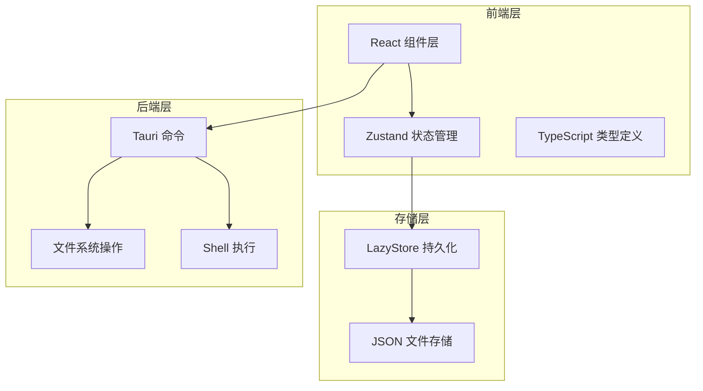
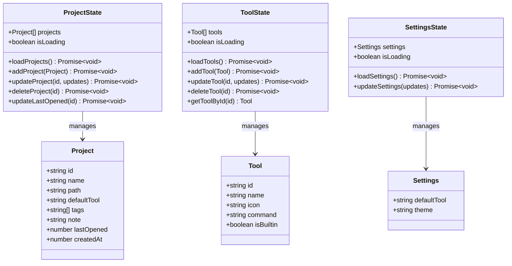
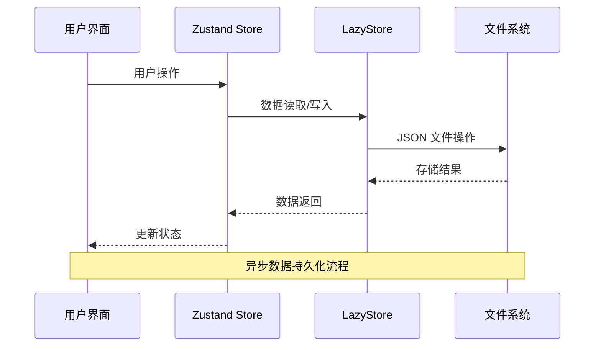
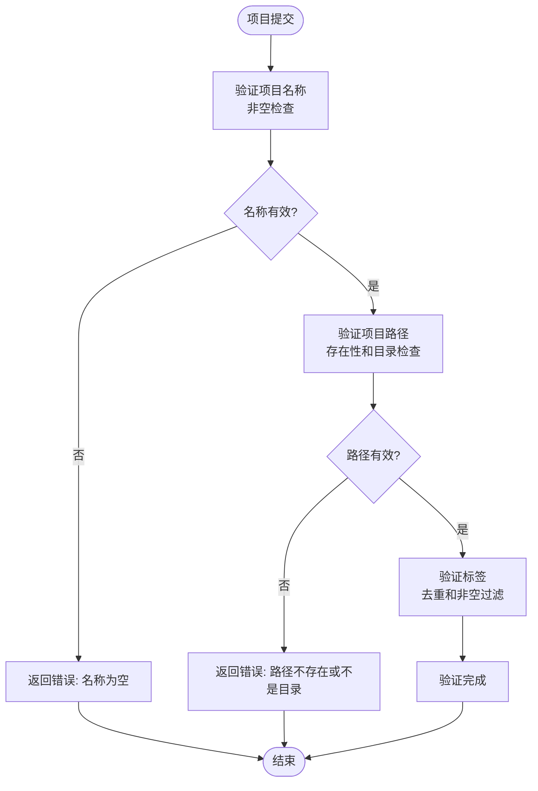
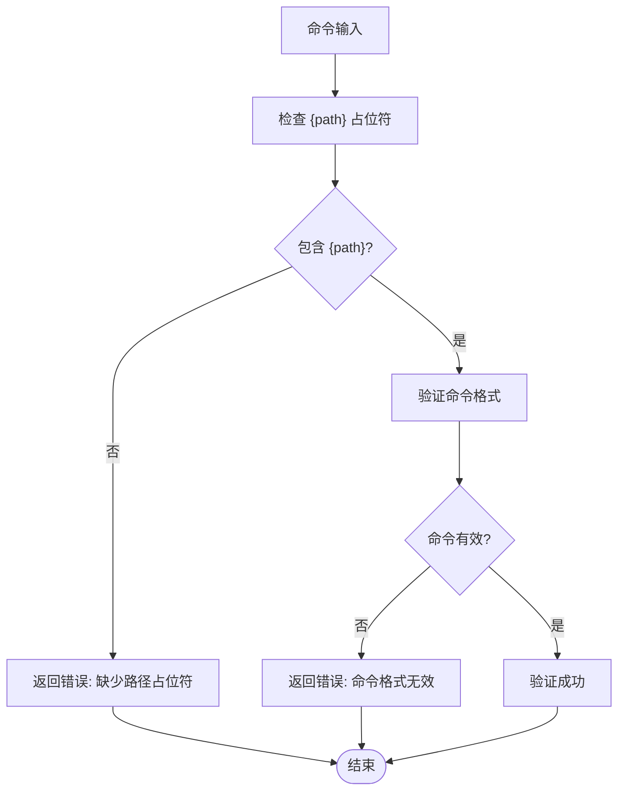
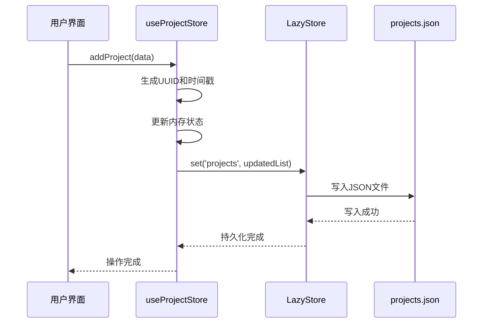
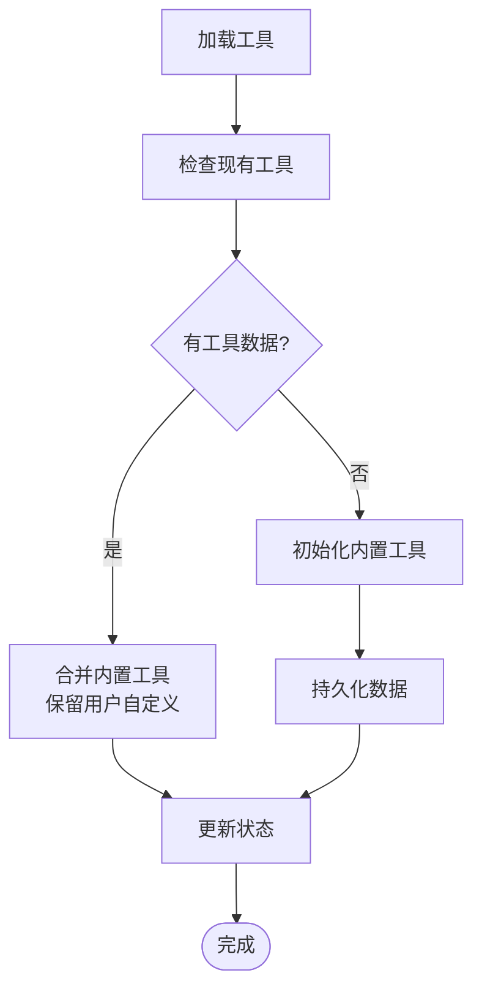
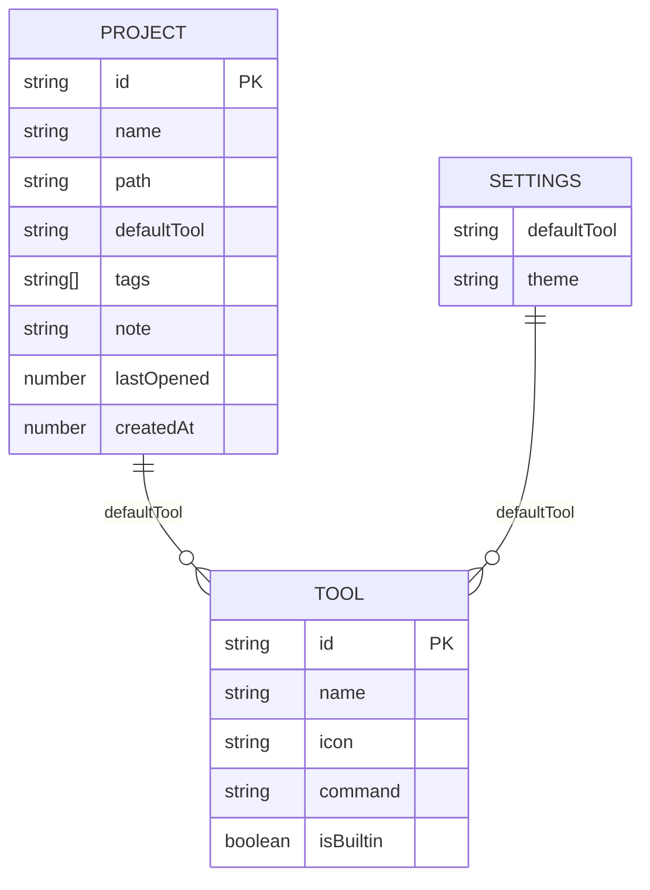
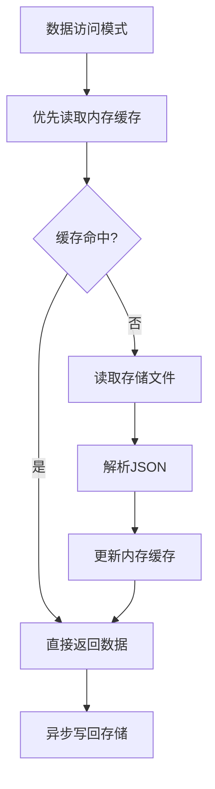

# 数据模型规范

<cite>
**本文档引用的文件**
- [src/types/index.ts](file://src/types/index.ts)
- [src/lib/storage.ts](file://src/lib/storage.ts)
- [src/lib/constants.ts](file://src/lib/constants.ts)
- [src/stores/useProjectStore.ts](file://src/stores/useProjectStore.ts)
- [src/stores/useToolStore.ts](file://src/stores/useToolStore.ts)
- [src/stores/useSettingsStore.ts](file://src/stores/useSettingsStore.ts)
- [src/components/project/ProjectFormDialog.tsx](file://src/components/project/ProjectFormDialog.tsx)
- [src/components/tool/ToolFormDialog.tsx](file://src/components/tool/ToolFormDialog.tsx)
- [src-tauri/src/commands.rs](file://src-tauri/src/commands.rs)
- [src-tauri/src/lib.rs](file://src-tauri/src/lib.rs)
- [src-tauri/Cargo.toml](file://src-tauri/Cargo.toml)
- [package.json](file://package.json)
</cite>

## 目录
1. [简介](#简介)
2. [项目结构](#项目结构)
3. [核心组件](#核心组件)
4. [架构概览](#架构概览)
5. [详细组件分析](#详细组件分析)
6. [依赖分析](#依赖分析)
7. [性能考虑](#性能考虑)
8. [故障排除指南](#故障排除指南)
9. [结论](#结论)
10. [附录](#附录)

## 简介

LaunchPro 是一个轻量级的开发者项目管理器，采用 React + Tauri 架构构建。本规范文档详细记录了项目的核心数据模型，包括项目、工具、设置等实体的数据结构定义，以及它们之间的关系和约束条件。

该应用提供了项目管理、工具配置和用户设置等功能，通过本地存储实现数据持久化，支持跨平台运行。

## 项目结构

LaunchPro 采用前后端分离的架构设计，主要分为以下层次：



**图表来源**
- [src/lib/storage.ts:1-30](file://src/lib/storage.ts#L1-L30)
- [src/stores/useProjectStore.ts:1-67](file://src/stores/useProjectStore.ts#L1-L67)
- [src-tauri/src/lib.rs:1-28](file://src-tauri/src/lib.rs#L1-L28)

**章节来源**
- [src/lib/storage.ts:1-30](file://src/lib/storage.ts#L1-L30)
- [src-tauri/src/lib.rs:1-28](file://src-tauri/src/lib.rs#L1-L28)

## 核心组件

### 数据模型概述

LaunchPro 的数据模型由三个核心实体组成：Project（项目）、Tool（工具）和 Settings（设置）。这些实体通过 TypeScript 接口进行定义，并通过 Zustand 状态管理和 LazyStore 持久化层进行操作。



**图表来源**
- [src/types/index.ts:1-26](file://src/types/index.ts#L1-L26)
- [src/stores/useProjectStore.ts:6-14](file://src/stores/useProjectStore.ts#L6-L14)
- [src/stores/useToolStore.ts:7-15](file://src/stores/useToolStore.ts#L7-L15)
- [src/stores/useSettingsStore.ts:6-11](file://src/stores/useSettingsStore.ts#L6-L11)

**章节来源**
- [src/types/index.ts:1-26](file://src/types/index.ts#L1-L26)

## 架构概览

LaunchPro 采用分层架构设计，确保数据流的清晰性和可维护性：



**图表来源**
- [src/stores/useProjectStore.ts:20-28](file://src/stores/useProjectStore.ts#L20-L28)
- [src/lib/storage.ts:19-29](file://src/lib/storage.ts#L19-L29)

## 详细组件分析

### 项目数据模型 (Project)

项目是 LaunchPro 的核心实体，用于管理开发者的项目信息。

#### 字段定义与约束

| 字段名 | 类型 | 必填 | 默认值 | 约束条件 | 描述 |
|--------|------|------|--------|----------|------|
| id | string | 是 | - | UUID 格式 | 项目唯一标识符 |
| name | string | 是 | - | 非空字符串 | 项目显示名称 |
| path | string | 是 | - | 有效目录路径 | 项目文件夹路径 |
| defaultTool | string | 否 | undefined | 工具 ID | 项目默认打开工具 |
| tags | string[] | 否 | [] | 数组元素非空 | 项目标签列表 |
| note | string | 否 | undefined | 最大长度限制 | 项目备注信息 |
| lastOpened | number | 否 | undefined | 时间戳格式 | 最后打开时间 |
| createdAt | number | 是 | 当前时间 | 时间戳格式 | 创建时间 |

#### 数据验证规则



**图表来源**
- [src/components/project/ProjectFormDialog.tsx:84-134](file://src/components/project/ProjectFormDialog.tsx#L84-L134)

**章节来源**
- [src/types/index.ts:1-10](file://src/types/index.ts#L1-L10)
- [src/components/project/ProjectFormDialog.tsx:84-134](file://src/components/project/ProjectFormDialog.tsx#L84-L134)

### 工具数据模型 (Tool)

工具模型定义了开发者可以使用的各种开发工具及其配置。

#### 字段定义与约束

| 字段名 | 类型 | 必填 | 默认值 | 约束条件 | 描述 |
|--------|------|------|--------|----------|------|
| id | string | 是 | - | UUID 格式 | 工具唯一标识符 |
| name | string | 是 | - | 非空字符串 | 工具显示名称 |
| icon | string | 否 | 工具首字母 | 1-2个字符 | 工具图标标识 |
| command | string | 是 | - | 包含 {path} 占位符 | 命令模板 |
| isBuiltin | boolean | 是 | false | 固定值 | 是否为内置工具 |

#### 命令模板验证

工具命令必须遵循特定格式，包含路径占位符：



**图表来源**
- [src/components/tool/ToolFormDialog.tsx:44-78](file://src/components/tool/ToolFormDialog.tsx#L44-L78)

**章节来源**
- [src/types/index.ts:12-18](file://src/types/index.ts#L12-L18)
- [src/components/tool/ToolFormDialog.tsx:44-78](file://src/components/tool/ToolFormDialog.tsx#L44-L78)

### 设置数据模型 (Settings)

设置模型管理应用的全局配置选项。

#### 字段定义与约束

| 字段名 | 类型 | 必填 | 默认值 | 约束条件 | 描述 |
|--------|------|------|--------|----------|------|
| defaultTool | string | 否 | undefined | 工具 ID | 全局默认工具 |
| theme | 'light' \| 'dark' \| 'system' | 是 | 'system' | 枚举值 | 主题设置 |

**章节来源**
- [src/types/index.ts:20-23](file://src/types/index.ts#L20-L23)
- [src/lib/constants.ts:20-22](file://src/lib/constants.ts#L20-L22)

### 状态管理与持久化

#### 项目状态管理

项目状态通过 Zustand 实现，提供完整的 CRUD 操作：



**图表来源**
- [src/stores/useProjectStore.ts:30-40](file://src/stores/useProjectStore.ts#L30-L40)
- [src/lib/storage.ts:19-21](file://src/lib/storage.ts#L19-L21)

#### 工具状态管理

工具状态管理具有内置工具合并逻辑：



**图表来源**
- [src/stores/useToolStore.ts:21-39](file://src/stores/useToolStore.ts#L21-L39)

**章节来源**
- [src/stores/useProjectStore.ts:1-67](file://src/stores/useProjectStore.ts#L1-L67)
- [src/stores/useToolStore.ts:1-75](file://src/stores/useToolStore.ts#L1-L75)
- [src/stores/useSettingsStore.ts:1-34](file://src/stores/useSettingsStore.ts#L1-L34)

## 依赖分析

### 外部依赖关系

LaunchPro 的数据模型依赖于多个外部库和插件：

```mermaid
graph TB
subgraph "前端依赖"
React[React 19.x]
Zustand[Zustand 5.x]
UUID[UUID 13.x]
TauriAPI[@tauri-apps/api]
end
subgraph "存储插件"
StorePlugin[@tauri-apps/plugin-store]
DialogPlugin[@tauri-apps/plugin-dialog]
ShellPlugin[@tauri-apps/plugin-shell]
end
subgraph "后端依赖"
Tauri[Tauri 2.x]
Serde[Serde 1.x]
SerdeJSON[Serde JSON 1.x]
end
React --> Zustand
Zustand --> StorePlugin
StorePlugin --> Tauri
Tauri --> Serde
Tauri --> SerdeJSON
```

**图表来源**
- [package.json:13-28](file://package.json#L13-L28)
- [src-tauri/Cargo.toml:15-22](file://src-tauri/Cargo.toml#L15-L22)

### 数据模型关系图



**图表来源**
- [src/types/index.ts:1-26](file://src/types/index.ts#L1-L26)

**章节来源**
- [package.json:13-28](file://package.json#L13-L28)
- [src-tauri/Cargo.toml:15-22](file://src-tauri/Cargo.toml#L15-L22)

## 性能考虑

### 存储优化策略

1. **懒加载存储**: 使用 LazyStore 实现按需加载，减少启动时的 I/O 操作
2. **自动保存**: 启用 autoSave 功能，确保数据一致性
3. **增量更新**: 仅更新变更的数据，避免全量重写
4. **内存缓存**: Zustand 提供本地内存缓存，减少重复读取

### 数据访问模式



## 故障排除指南

### 常见问题及解决方案

#### 项目路径验证失败

**问题描述**: 添加项目时提示路径不存在或不是目录

**解决方法**:
1. 确认路径指向有效的目录
2. 检查文件系统权限
3. 验证路径格式正确性

#### 工具命令模板错误

**问题描述**: 工具命令包含无效的占位符或格式

**解决方法**:
1. 确保命令中包含 `{path}` 占位符
2. 验证命令程序在系统 PATH 中可用
3. 检查命令语法正确性

#### 数据持久化异常

**问题描述**: 数据无法正确保存到存储文件

**解决方法**:
1. 检查存储文件权限
2. 验证磁盘空间充足
3. 确认 JSON 格式正确

**章节来源**
- [src/components/project/ProjectFormDialog.tsx:84-134](file://src/components/project/ProjectFormDialog.tsx#L84-L134)
- [src/components/tool/ToolFormDialog.tsx:44-78](file://src/components/tool/ToolFormDialog.tsx#L44-L78)

## 结论

LaunchPro 的数据模型设计简洁而功能完整，通过清晰的接口定义和严格的验证机制，确保了数据的一致性和完整性。采用分层架构和模块化设计，使得系统具有良好的可扩展性和可维护性。

数据模型的主要优势包括：
- 明确的字段约束和验证规则
- 完整的 CRUD 操作支持
- 自动化的数据持久化
- 跨平台兼容性
- 良好的错误处理机制

## 附录

### JSON 序列化格式

#### 项目数据格式
```json
{
  "projects": [
    {
      "id": "string",
      "name": "string",
      "path": "string",
      "defaultTool": "string",
      "tags": ["string"],
      "note": "string",
      "lastOpened": 0,
      "createdAt": 0
    }
  ]
}
```

#### 工具数据格式
```json
{
  "tools": [
    {
      "id": "string",
      "name": "string",
      "icon": "string",
      "command": "string",
      "isBuiltin": true
    }
  ]
}
```

#### 设置数据格式
```json
{
  "settings": {
    "defaultTool": "string",
    "theme": "light|dark|system"
  }
}
```

### 版本升级策略

由于当前版本为 0.1.0，建议采用以下升级策略：

1. **向后兼容**: 新增字段时保持向后兼容性
2. **默认值处理**: 为新增字段提供合理的默认值
3. **数据迁移**: 在应用启动时执行必要的数据迁移
4. **版本控制**: 记录数据模型版本信息

### 最佳实践

1. **数据验证**: 始终在客户端和服务端进行双重验证
2. **错误处理**: 提供清晰的错误消息和回滚机制
3. **性能优化**: 使用适当的缓存策略和批量操作
4. **安全性**: 对用户输入进行适当的清理和验证
5. **可测试性**: 为数据模型编写单元测试和集成测试