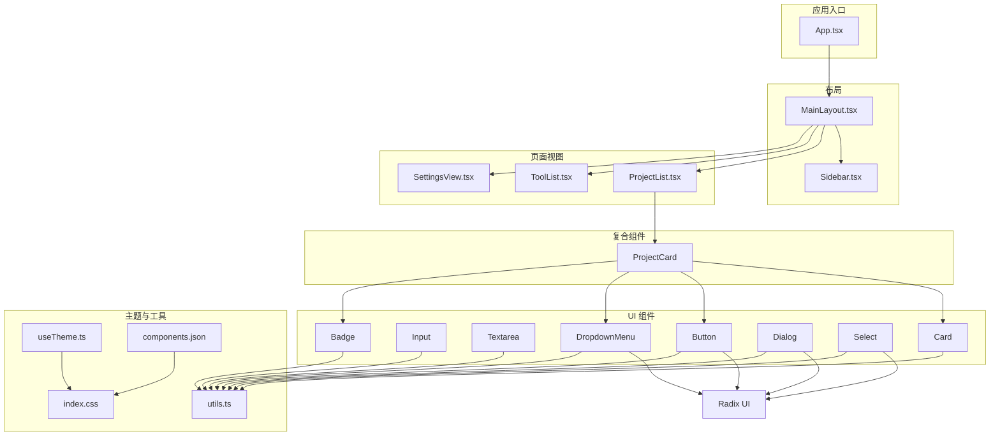
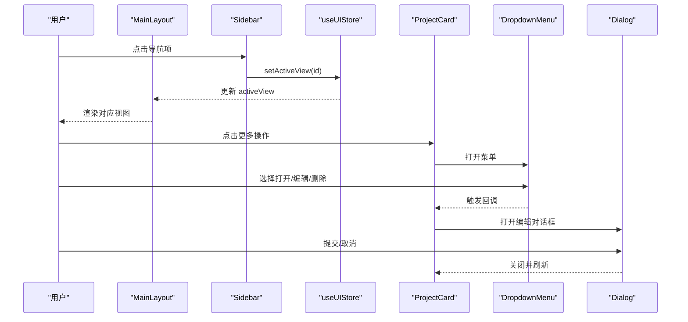
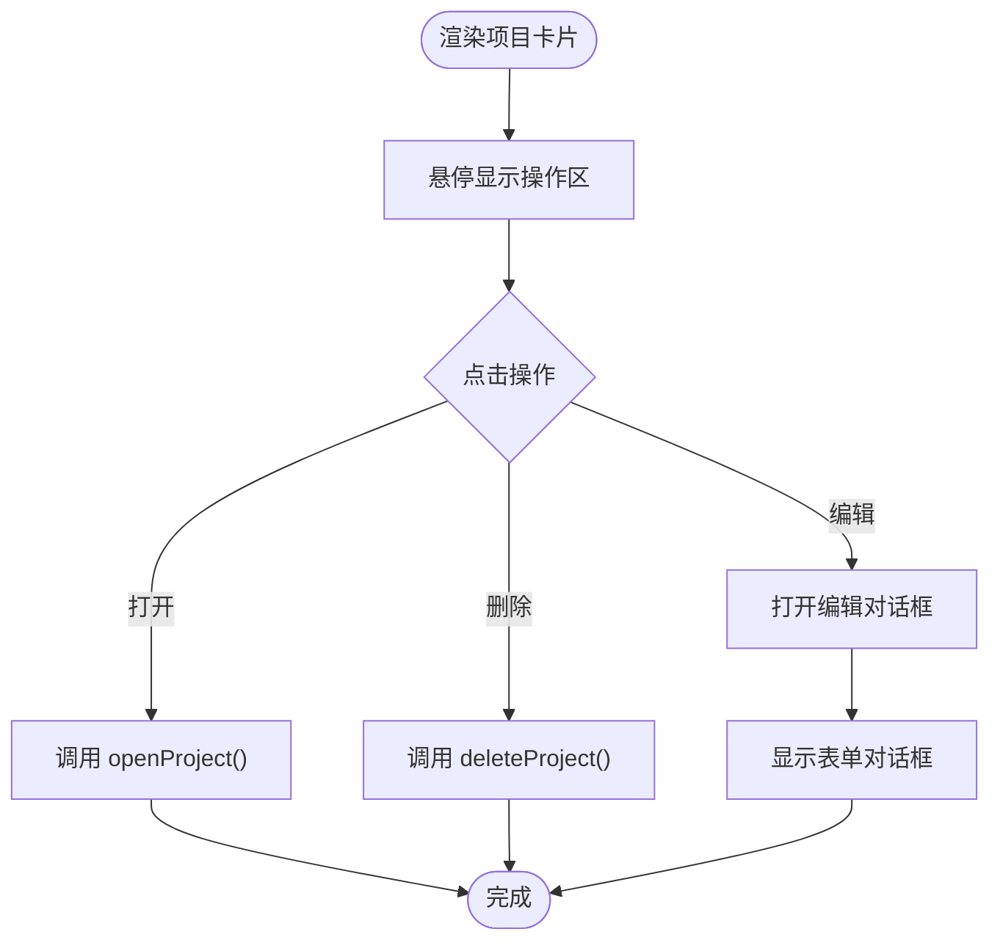
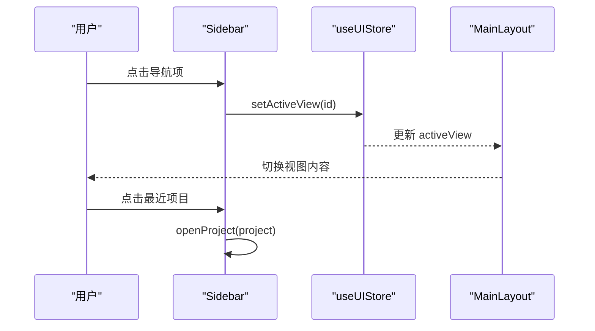
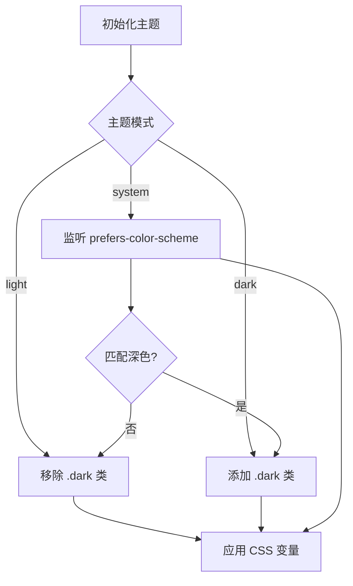
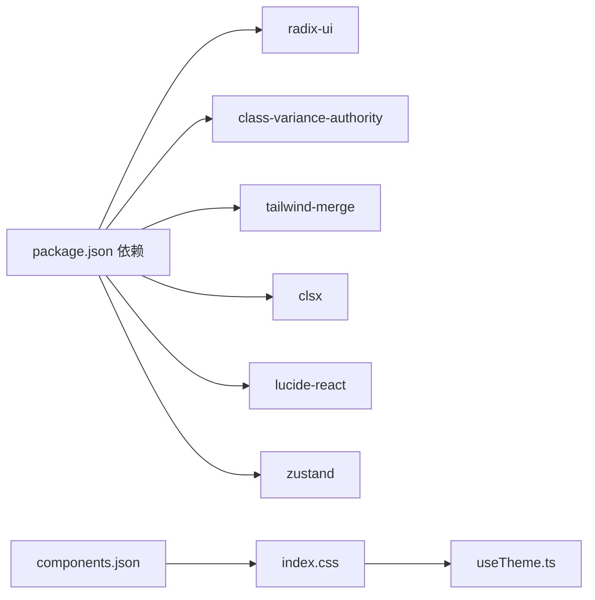

# UI 组件库

<cite>
**本文引用的文件**
- [button.tsx](file://src/components/ui/button.tsx)
- [dialog.tsx](file://src/components/ui/dialog.tsx)
- [input.tsx](file://src/components/ui/input.tsx)
- [card.tsx](file://src/components/ui/card.tsx)
- [badge.tsx](file://src/components/ui/badge.tsx)
- [select.tsx](file://src/components/ui/select.tsx)
- [dropdown-menu.tsx](file://src/components/ui/dropdown-menu.tsx)
- [textarea.tsx](file://src/components/ui/textarea.tsx)
- [ProjectCard.tsx](file://src/components/project/ProjectCard.tsx)
- [Sidebar.tsx](file://src/components/layout/Sidebar.tsx)
- [MainLayout.tsx](file://src/components/layout/MainLayout.tsx)
- [useTheme.ts](file://src/hooks/useTheme.ts)
- [utils.ts](file://src/lib/utils.ts)
- [package.json](file://package.json)
- [components.json](file://components.json)
- [index.css](file://src/index.css)
</cite>

## 目录
1. [简介](#简介)
2. [项目结构](#项目结构)
3. [核心组件](#核心组件)
4. [架构总览](#架构总览)
5. [详细组件分析](#详细组件分析)
6. [依赖关系分析](#依赖关系分析)
7. [性能考量](#性能考量)
8. [故障排查指南](#故障排查指南)
9. [结论](#结论)
10. [附录](#附录)

## 简介
本文件为 LaunchPro 的 UI 组件库文档，系统性介绍基于 Radix UI 与 shadcn/ui 的组件设计体系与实现方式。内容覆盖基础 UI 组件（按钮、输入框、对话框等）的属性、事件与样式定制；复合组件（项目卡片、工具列表、侧边栏等）的实现模式与使用方法；响应式设计与跨平台兼容性；可访问性与键盘导航；主题系统与自定义主题；组件组合模式与最佳实践；以及性能优化、动画与用户体验设计要点，并提供可直接定位到源码的路径指引。

## 项目结构
组件库采用“按功能分层 + 组件聚合”的组织方式：
- 基础 UI 组件集中于 src/components/ui，遵循 Radix UI 的语义封装与 Tailwind 样式组合。
- 复合组件位于 src/components/模块/，如项目管理、工具管理、设置视图等。
- 布局组件位于 src/components/layout，负责页面骨架与导航。
- 主题与工具函数位于 hooks 与 lib，样式变量与主题切换逻辑在 src/index.css 与 useTheme 中实现。
- 组件别名与样式配置由 components.json 管理，Tailwind v4 通过 @theme inline 注入 CSS 变量。

图表来源
- [MainLayout.tsx:1-21](file://src/components/layout/MainLayout.tsx#L1-L21)
- [Sidebar.tsx:1-80](file://src/components/layout/Sidebar.tsx#L1-L80)
- [ProjectCard.tsx:1-174](file://src/components/project/ProjectCard.tsx#L1-L174)
- [button.tsx:1-65](file://src/components/ui/button.tsx#L1-L65)
- [input.tsx:1-22](file://src/components/ui/input.tsx#L1-L22)
- [textarea.tsx:1-19](file://src/components/ui/textarea.tsx#L1-L19)
- [card.tsx:1-93](file://src/components/ui/card.tsx#L1-L93)
- [badge.tsx:1-49](file://src/components/ui/badge.tsx#L1-L49)
- [dialog.tsx:1-157](file://src/components/ui/dialog.tsx#L1-L157)
- [select.tsx:1-191](file://src/components/ui/select.tsx#L1-L191)
- [dropdown-menu.tsx:1-258](file://src/components/ui/dropdown-menu.tsx#L1-L258)
- [useTheme.ts:1-37](file://src/hooks/useTheme.ts#L1-L37)
- [utils.ts:1-7](file://src/lib/utils.ts#L1-L7)
- [index.css:1-116](file://src/index.css#L1-L116)
- [components.json:1-22](file://components.json#L1-L22)

章节来源
- [MainLayout.tsx:1-21](file://src/components/layout/MainLayout.tsx#L1-L21)
- [Sidebar.tsx:1-80](file://src/components/layout/Sidebar.tsx#L1-L80)
- [ProjectCard.tsx:1-174](file://src/components/project/ProjectCard.tsx#L1-L174)
- [button.tsx:1-65](file://src/components/ui/button.tsx#L1-L65)
- [input.tsx:1-22](file://src/components/ui/input.tsx#L1-L22)
- [textarea.tsx:1-19](file://src/components/ui/textarea.tsx#L1-L19)
- [card.tsx:1-93](file://src/components/ui/card.tsx#L1-L93)
- [badge.tsx:1-49](file://src/components/ui/badge.tsx#L1-L49)
- [dialog.tsx:1-157](file://src/components/ui/dialog.tsx#L1-L157)
- [select.tsx:1-191](file://src/components/ui/select.tsx#L1-L191)
- [dropdown-menu.tsx:1-258](file://src/components/ui/dropdown-menu.tsx#L1-L258)
- [useTheme.ts:1-37](file://src/hooks/useTheme.ts#L1-L37)
- [utils.ts:1-7](file://src/lib/utils.ts#L1-L7)
- [index.css:1-116](file://src/index.css#L1-L116)
- [components.json:1-22](file://components.json#L1-L22)

## 核心组件
本节对基础 UI 组件进行属性、事件与样式定制的系统化说明。所有组件均以 Radix UI 为基础，结合 Tailwind 与 class-variance-authority 实现变体与尺寸控制，并通过 data-slot 与 data-* 属性暴露语义化标记，便于样式覆盖与调试。

- 按钮 Button
  - 关键属性：className、variant（default/destructive/outline/secondary/ghost/link）、size（default/xs/sm/lg/icon/icon-xs/icon-sm/icon-lg）、asChild（是否渲染为子节点包装器）
  - 事件：透传原生 button 事件；支持作为子元素包装（Slot.Root）以复用容器语义
  - 样式定制：通过 variant 与 size 控制背景、边框、阴影、文字与图标尺寸；聚焦态与禁用态具备明确视觉反馈
  - 参考路径：[button.tsx:1-65](file://src/components/ui/button.tsx#L1-L65)

- 输入 Input
  - 关键属性：className、type（文本类型）
  - 事件：透传原生 input 事件
  - 样式定制：统一圆角、边框、占位符颜色与聚焦环；支持 aria-invalid 状态下的破坏性样式
  - 参考路径：[input.tsx:1-22](file://src/components/ui/input.tsx#L1-L22)

- 文本域 Textarea
  - 关键属性：className
  - 事件：透传原生 textarea 事件
  - 样式定制：与 Input 类似的焦点与禁用态；字段自适应高度能力由外部样式策略配合
  - 参考路径：[textarea.tsx:1-19](file://src/components/ui/textarea.tsx#L1-L19)

- 卡片 Card
  - 组成：Card、CardHeader、CardTitle、CardDescription、CardContent、CardFooter、CardAction
  - 样式定制：统一圆角、边框与阴影；头部区域支持动作区栅格布局；底部支持分隔线与内边距
  - 参考路径：[card.tsx:1-93](file://src/components/ui/card.tsx#L1-L93)

- 徽章 Badge
  - 关键属性：className、variant（default/secondary/destructive/outline/ghost/link）、asChild
  - 样式定制：紧凑圆角标签；支持链接态与破坏性态；聚焦态与无效态具备视觉反馈
  - 参考路径：[badge.tsx:1-49](file://src/components/ui/badge.tsx#L1-L49)

- 对话框 Dialog
  - 组成：Dialog、DialogTrigger、DialogPortal、DialogOverlay、DialogContent、DialogHeader、DialogFooter、DialogTitle、DialogDescription、DialogClose
  - 动画：打开/关闭时具备淡入/缩放与滑入/滑出动画；支持可选关闭按钮
  - 样式定制：居中网格布局、最大宽度约束、响应式尺寸；遮罩具备半透明背景
  - 参考路径：[dialog.tsx:1-157](file://src/components/ui/dialog.tsx#L1-L157)

- 选择器 Select
  - 组成：Select、SelectTrigger、SelectValue、SelectContent、SelectGroup、SelectLabel、SelectItem、SelectSeparator、SelectScrollUpButton、SelectScrollDownButton
  - 交互：支持滚动按钮、弹出位置与对齐；触发器支持尺寸变体
  - 样式定制：下拉内容具备滑入/缩放动画；选项支持选中指示器与禁用态
  - 参考路径：[select.tsx:1-191](file://src/components/ui/select.tsx#L1-L191)

- 下拉菜单 DropdownMenu
  - 组成：DropdownMenu、DropdownMenuTrigger、DropdownMenuContent、DropdownMenuGroup、DropdownMenuItem、DropdownMenuLabel、DropdownMenuSeparator、DropdownMenuShortcut、DropdownMenuSub、DropdownMenuSubTrigger、DropdownMenuSubContent、DropdownMenuCheckboxItem、DropdownMenuRadioGroup、DropdownMenuRadioItem
  - 交互：支持子菜单、复选/单选项、快捷键提示；内容具备滑入/缩放动画
  - 样式定制：统一圆角、边框与阴影；破坏性项具备强调色
  - 参考路径：[dropdown-menu.tsx:1-258](file://src/components/ui/dropdown-menu.tsx#L1-L258)

章节来源
- [button.tsx:1-65](file://src/components/ui/button.tsx#L1-L65)
- [input.tsx:1-22](file://src/components/ui/input.tsx#L1-L22)
- [textarea.tsx:1-19](file://src/components/ui/textarea.tsx#L1-L19)
- [card.tsx:1-93](file://src/components/ui/card.tsx#L1-L93)
- [badge.tsx:1-49](file://src/components/ui/badge.tsx#L1-L49)
- [dialog.tsx:1-157](file://src/components/ui/dialog.tsx#L1-L157)
- [select.tsx:1-191](file://src/components/ui/select.tsx#L1-L191)
- [dropdown-menu.tsx:1-258](file://src/components/ui/dropdown-menu.tsx#L1-L258)

## 架构总览
组件库围绕以下设计原则构建：
- 基于 Radix UI 的可访问性与无障碍语义
- 使用 class-variance-authority 与 Tailwind 组合实现变体与尺寸
- 通过 data-slot 与 data-* 属性暴露语义化标记，便于主题与样式覆盖
- 以 Store（Zustand）驱动状态，布局组件 MainLayout 根据 activeView 切换视图
- 主题系统通过 CSS 自定义属性与 useTheme 钩子实现明暗切换与系统跟随

图表来源
- [MainLayout.tsx:1-21](file://src/components/layout/MainLayout.tsx#L1-L21)
- [Sidebar.tsx:1-80](file://src/components/layout/Sidebar.tsx#L1-L80)
- [ProjectCard.tsx:1-174](file://src/components/project/ProjectCard.tsx#L1-L174)
- [dropdown-menu.tsx:1-258](file://src/components/ui/dropdown-menu.tsx#L1-L258)
- [dialog.tsx:1-157](file://src/components/ui/dialog.tsx#L1-L157)

## 详细组件分析

### 项目卡片（ProjectCard）
- 设计目标：展示项目名称、路径、默认工具、标签与最近打开时间；提供打开、编辑、删除等操作入口
- 交互模式：悬停显示操作区；使用 Tooltip 提供路径悬浮提示；DropdownMenu 支持多工具打开与子菜单
- 数据流：读取工具列表与项目信息；调用 openProject 与 deleteProject；编辑时打开表单对话框
- 样式策略：卡片悬停高亮；徽章用于默认工具与标签；图标尺寸与间距统一

图表来源
- [ProjectCard.tsx:1-174](file://src/components/project/ProjectCard.tsx#L1-L174)
- [dropdown-menu.tsx:1-258](file://src/components/ui/dropdown-menu.tsx#L1-L258)
- [dialog.tsx:1-157](file://src/components/ui/dialog.tsx#L1-L157)

章节来源
- [ProjectCard.tsx:1-174](file://src/components/project/ProjectCard.tsx#L1-L174)

### 侧边栏（Sidebar）
- 导航项：Projects、Tools、Settings；根据 activeView 设置当前项样式
- 最近项目：从项目列表筛选最近打开的前五项，支持快速打开
- 交互：点击导航项更新 activeView；点击最近项目调用 openProject

图表来源
- [Sidebar.tsx:1-80](file://src/components/layout/Sidebar.tsx#L1-L80)
- [MainLayout.tsx:1-21](file://src/components/layout/MainLayout.tsx#L1-L21)

章节来源
- [Sidebar.tsx:1-80](file://src/components/layout/Sidebar.tsx#L1-L80)
- [MainLayout.tsx:1-21](file://src/components/layout/MainLayout.tsx#L1-L21)

### 布局与路由（MainLayout）
- 根据 activeView 渲染不同视图：项目列表、工具列表、设置视图
- 左侧固定宽度侧边栏，右侧主内容区自适应

章节来源
- [MainLayout.tsx:1-21](file://src/components/layout/MainLayout.tsx#L1-L21)

### 主题系统与自定义主题
- CSS 变量：根与 .dark 伪类下定义了背景、前景、卡片、弹出层、主要/次要、破坏性、边框、输入、环形光晕与侧边栏系列变量
- 主题钩子：useTheme 根据设置值添加/移除 .dark 类；支持 light/dark/system 三种模式；监听系统配色变化
- 组件适配：各组件通过 CSS 变量与 data-* 属性实现明暗态一致的视觉反馈

图表来源
- [useTheme.ts:1-37](file://src/hooks/useTheme.ts#L1-L37)
- [index.css:1-116](file://src/index.css#L1-L116)

章节来源
- [useTheme.ts:1-37](file://src/hooks/useTheme.ts#L1-L37)
- [index.css:1-116](file://src/index.css#L1-L116)

### 组件样式与数据槽（data-slot）
- 组件普遍使用 data-slot 与 data-* 属性（如 data-variant、data-size）标注语义，便于：
  - 样式覆盖：通过父级选择器或组件内部选择器精准命中
  - 可访问性：屏幕阅读器可识别组件角色与状态
  - 调试与测试：开发者工具可快速定位组件结构

章节来源
- [button.tsx:54-61](file://src/components/ui/button.tsx#L54-L61)
- [dialog.tsx:59-78](file://src/components/ui/dialog.tsx#L59-L78)
- [select.tsx:36-50](file://src/components/ui/select.tsx#L36-L50)
- [dropdown-menu.tsx:40-51](file://src/components/ui/dropdown-menu.tsx#L40-L51)

## 依赖关系分析
- 组件依赖
  - Radix UI：提供可访问性与状态机（Dialog、Select、DropdownMenu 等）
  - class-variance-authority：为 Button、Badge 等组件提供变体与尺寸
  - Tailwind 与 tailwind-merge：统一样式拼接与冲突合并
  - lucide-react：图标库
  - Zustand：状态管理（UI 状态、项目/工具/设置）
- 样式与配置
  - components.json：定义组件别名与 Tailwind 配置
  - index.css：CSS 变量与 @theme inline 注入

图表来源
- [package.json:1-48](file://package.json#L1-L48)
- [components.json:1-22](file://components.json#L1-L22)
- [index.css:1-116](file://src/index.css#L1-L116)
- [useTheme.ts:1-37](file://src/hooks/useTheme.ts#L1-L37)

章节来源
- [package.json:1-48](file://package.json#L1-L48)
- [components.json:1-22](file://components.json#L1-L22)
- [index.css:1-116](file://src/index.css#L1-L116)
- [useTheme.ts:1-37](file://src/hooks/useTheme.ts#L1-L37)

## 性能考量
- 动画与过渡
  - 对话框与下拉菜单使用 Radix UI 的内置动画（淡入/淡出、缩放、滑入），避免复杂 JS 动画带来的卡顿
  - 建议在长列表场景（如项目列表）启用虚拟滚动或分页，减少一次性渲染节点数量
- 事件与状态
  - 将高频交互（如悬停显示操作区）的计算保持在组件内部，避免重复订阅
  - 使用 Zustand 的选择器读取最小状态片段，降低重渲染范围
- 图标与资源
  - 使用 lucide-react 的图标组件，按需引入以减小包体积
- 样式合并
  - 通过 utils.cn 合并类名，避免重复与冲突，提升样式计算效率

## 故障排查指南
- 对话框无法关闭或遮罩点击无效
  - 检查 DialogOverlay 与 DialogClose 的组合是否正确；确认 Portal 是否挂载到正确容器
  - 参考路径：[dialog.tsx:56-79](file://src/components/ui/dialog.tsx#L56-L79)
- 下拉菜单不显示或位置异常
  - 确认 DropdownMenuContent 的 Portal 是否存在；检查触发元素是否为受控元素
  - 参考路径：[dropdown-menu.tsx:39-51](file://src/components/ui/dropdown-menu.tsx#L39-L51)
- 输入框无效态样式未生效
  - 确保传入 aria-invalid 并检查 CSS 变量与暗色态覆盖
  - 参考路径：[input.tsx:10-15](file://src/components/ui/input.tsx#L10-L15)
- 主题切换无效
  - 检查 useTheme 是否正确写入设置并触发 DOM 变更；确认系统配色监听是否注册
  - 参考路径：[useTheme.ts:8-29](file://src/hooks/useTheme.ts#L8-L29)
- 样式覆盖不生效
  - 使用 data-slot 与 data-* 属性精确定位；确保自定义样式优先级高于组件默认样式
  - 参考路径：[utils.ts:4-6](file://src/lib/utils.ts#L4-L6)

章节来源
- [dialog.tsx:56-79](file://src/components/ui/dialog.tsx#L56-L79)
- [dropdown-menu.tsx:39-51](file://src/components/ui/dropdown-menu.tsx#L39-L51)
- [input.tsx:10-15](file://src/components/ui/input.tsx#L10-L15)
- [useTheme.ts:8-29](file://src/hooks/useTheme.ts#L8-L29)
- [utils.ts:4-6](file://src/lib/utils.ts#L4-L6)

## 结论
本组件库以 Radix UI 为核心，结合 class-variance-authority 与 Tailwind，形成统一、可扩展且高可访问性的 UI 设计体系。通过 data-slot 语义化标记、CSS 变量主题系统与 Zustand 状态管理，实现了清晰的组件边界与良好的跨平台体验。建议在实际使用中遵循组件属性与变体约定，配合自定义主题与样式覆盖策略，持续优化交互细节与性能表现。

## 附录
- 组件别名与样式配置
  - 组件别名：components、ui、lib、hooks
  - Tailwind 配置：css 变量开启、基础色为 zinc
  - 参考路径：[components.json:1-22](file://components.json#L1-L22)
- 样式工具函数
  - cn：合并类名并去重
  - 参考路径：[utils.ts:4-6](file://src/lib/utils.ts#L4-L6)
- 主题变量与暗色态
  - CSS 变量：背景、前景、卡片、弹出层、主要/次要、破坏性、边框、输入、环形光晕与侧边栏系列
  - 参考路径：[index.css:5-64](file://src/index.css#L5-L64)