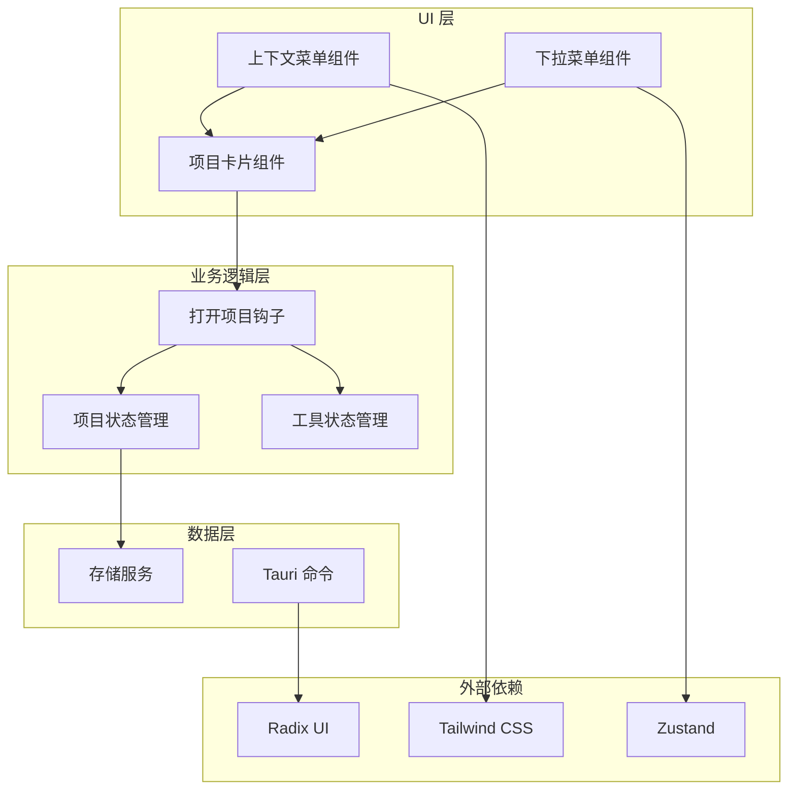
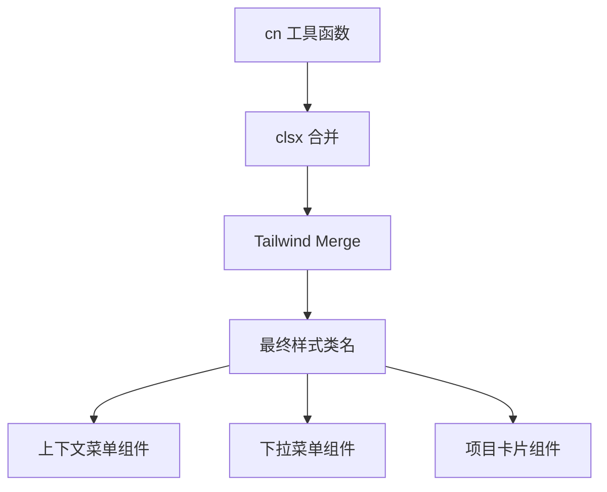
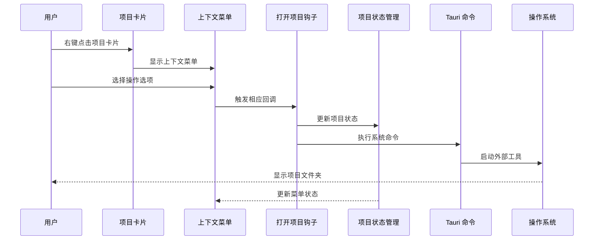
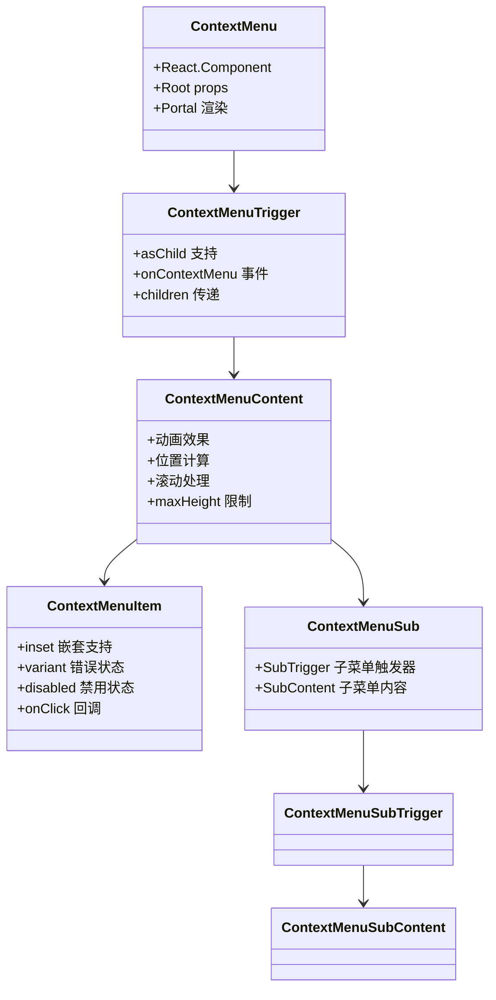
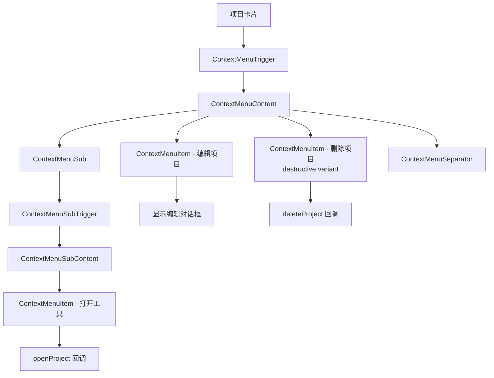
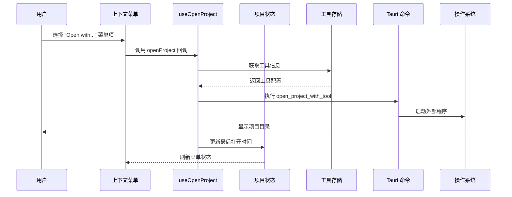
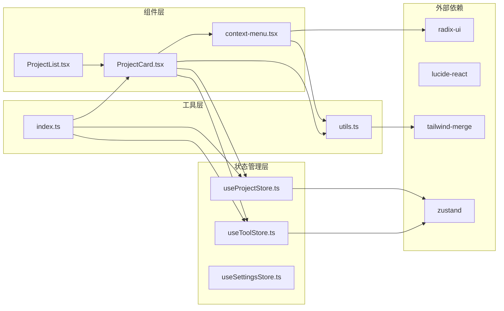

# 上下文菜单组件

<cite>
**本文档引用的文件**
- [context-menu.tsx](file://src/components/ui/context-menu.tsx)
- [ProjectCard.tsx](file://src/components/project/ProjectCard.tsx)
- [ProjectList.tsx](file://src/components/project/ProjectList.tsx)
- [utils.ts](file://src/lib/utils.ts)
- [index.ts](file://src/types/index.ts)
- [dropdown-menu.tsx](file://src/components/ui/dropdown-menu.tsx)
- [useOpenProject.ts](file://src/hooks/useOpenProject.ts)
- [tauri-commands.ts](file://src/lib/tauri-commands.ts)
- [useProjectStore.ts](file://src/stores/useProjectStore.ts)
- [package.json](file://package.json)
</cite>

## 目录
1. [简介](#简介)
2. [项目结构](#项目结构)
3. [核心组件](#核心组件)
4. [架构概览](#架构概览)
5. [详细组件分析](#详细组件分析)
6. [依赖关系分析](#依赖关系分析)
7. [性能考虑](#性能考虑)
8. [故障排除指南](#故障排除指南)
9. [结论](#结论)

## 简介

上下文菜单组件是 LaunchPro 项目管理应用中的核心交互组件之一，基于 Radix UI 构建，为用户提供丰富的右键菜单功能。该组件支持多种菜单项类型、子菜单嵌套、复选框和单选按钮等高级功能，为项目卡片提供了完整的操作入口。

LaunchPro 是一个轻量级的跨平台开发者项目管理器，允许用户在一个地方管理所有本地项目，快速浏览、组织和使用首选 IDE 或编辑器打开任何项目。该应用采用 React 19 + TypeScript 构建前端界面，使用 Tauri 2 作为桌面运行时，提供原生体验。

## 项目结构

项目采用模块化架构设计，上下文菜单组件位于 UI 组件层，与业务逻辑通过 hooks 和 stores 解耦：

**图表来源**
- [context-menu.tsx:1-247](file://src/components/ui/context-menu.tsx#L1-L247)
- [ProjectCard.tsx:1-227](file://src/components/project/ProjectCard.tsx#L1-L227)
- [useOpenProject.ts:1-44](file://src/hooks/useOpenProject.ts#L1-L44)

**章节来源**
- [context-menu.tsx:1-247](file://src/components/ui/context-menu.tsx#L1-L247)
- [ProjectCard.tsx:1-227](file://src/components/project/ProjectCard.tsx#L1-L227)
- [package.json:13-29](file://package.json#L13-L29)

## 核心组件

上下文菜单组件系统包含多个相互协作的组件，每个组件都有特定的功能职责：

### 主要组件架构

| 组件名称 | 功能描述 | 导出接口 |
|---------|---------|---------|
| ContextMenu | 菜单根容器 | Root, Portal |
| ContextMenuTrigger | 触发器元素 | Trigger, asChild 支持 |
| ContextMenuContent | 菜单内容区域 | Content, 动画效果 |
| ContextMenuItem | 菜单项 | Item, inset, variant |
| ContextMenuSub | 子菜单容器 | Sub, SubTrigger, SubContent |
| ContextMenuCheckboxItem | 复选框菜单项 | CheckboxItem, checked 状态 |
| ContextMenuRadioItem | 单选按钮菜单项 | RadioItem, 选择指示器 |

### 样式系统集成

组件使用 Tailwind CSS 类名系统和 cn 工具函数进行样式组合：

**图表来源**
- [utils.ts:4-6](file://src/lib/utils.ts#L4-L6)
- [context-menu.tsx:34-37](file://src/components/ui/context-menu.tsx#L34-L37)

**章节来源**
- [context-menu.tsx:9-247](file://src/components/ui/context-menu.tsx#L9-L247)
- [utils.ts:1-7](file://src/lib/utils.ts#L1-L7)

## 架构概览

上下文菜单在应用中的整体架构展示了从用户交互到业务逻辑的完整流程：

**图表来源**
- [ProjectCard.tsx:84-205](file://src/components/project/ProjectCard.tsx#L84-L205)
- [useOpenProject.ts:15-40](file://src/hooks/useOpenProject.ts#L15-L40)
- [tauri-commands.ts:3-8](file://src/lib/tauri-commands.ts#L3-L8)

## 详细组件分析

### 上下文菜单组件实现

上下文菜单组件基于 Radix UI 的可访问性原则构建，提供了完整的键盘导航和屏幕阅读器支持：

**图表来源**
- [context-menu.tsx:9-247](file://src/components/ui/context-menu.tsx#L9-L247)

### 项目卡片中的上下文菜单集成

项目卡片组件展示了上下文菜单的实际应用场景，集成了多种操作选项：

**图表来源**
- [ProjectCard.tsx:62-80](file://src/components/project/ProjectCard.tsx#L62-L80)
- [ProjectCard.tsx:190-204](file://src/components/project/ProjectCard.tsx#L190-L204)

### 打开项目功能实现

打开项目功能展示了上下文菜单如何与应用的核心业务逻辑集成：

**图表来源**
- [ProjectCard.tsx:70-77](file://src/components/project/ProjectCard.tsx#L70-L77)
- [useOpenProject.ts:15-40](file://src/hooks/useOpenProject.ts#L15-L40)
- [tauri-commands.ts:3-8](file://src/lib/tauri-commands.ts#L3-L8)

**章节来源**
- [ProjectCard.tsx:1-227](file://src/components/project/ProjectCard.tsx#L1-L227)
- [useOpenProject.ts:1-44](file://src/hooks/useOpenProject.ts#L1-L44)
- [tauri-commands.ts:1-21](file://src/lib/tauri-commands.ts#L1-L21)

## 依赖关系分析

上下文菜单组件的依赖关系展现了清晰的分层架构：

**图表来源**
- [context-menu.tsx:3-7](file://src/components/ui/context-menu.tsx#L3-L7)
- [ProjectCard.tsx:16-25](file://src/components/project/ProjectCard.tsx#L16-L25)
- [useProjectStore.ts:1-14](file://src/stores/useProjectStore.ts#L1-L14)

**章节来源**
- [context-menu.tsx:1-247](file://src/components/ui/context-menu.tsx#L1-L247)
- [ProjectCard.tsx:1-31](file://src/components/project/ProjectCard.tsx#L1-L31)
- [useProjectStore.ts:1-70](file://src/stores/useProjectStore.ts#L1-L70)

## 性能考虑

上下文菜单组件在设计时充分考虑了性能优化：

### 渲染优化策略

1. **Portal 渲染**: 使用 Radix UI 的 Portal 组件避免 DOM 层级过深
2. **条件渲染**: 子菜单仅在需要时渲染，减少不必要的 DOM 元素
3. **样式合并**: 使用 cn 工具函数高效合并样式类名
4. **事件委托**: 通过 React 事件系统处理菜单项点击事件

### 内存管理

- 组件卸载时自动清理事件监听器
- 避免在组件内部创建闭包导致的内存泄漏
- 使用 React.memo 优化重渲染

### 可访问性优化

- 完整的键盘导航支持
- 屏幕阅读器友好的语义化标记
- 高对比度颜色方案支持

## 故障排除指南

### 常见问题及解决方案

| 问题类型 | 症状 | 可能原因 | 解决方案 |
|---------|------|---------|---------|
| 菜单不显示 | 右键无反应 | 触发器未正确设置 | 检查 asChild 属性和事件处理 |
| 子菜单错位 | 子菜单位置异常 | Portal 渲染问题 | 验证父容器定位属性 |
| 样式冲突 | 菜单样式异常 | Tailwind 类名冲突 | 检查 cn 函数参数顺序 |
| 性能问题 | 菜单响应缓慢 | 过多的重新渲染 | 使用 React.memo 包装复杂子组件 |

### 调试技巧

1. **检查组件层次**: 确保 ContextMenuTrigger 正确包裹在 Card 组件上
2. **验证状态更新**: 确认项目状态更新后菜单能够正确反映新状态
3. **测试键盘导航**: 验证 Tab 键和方向键的导航逻辑
4. **监控内存使用**: 使用浏览器开发工具检查内存泄漏

**章节来源**
- [context-menu.tsx:30-41](file://src/components/ui/context-menu.tsx#L30-L41)
- [ProjectCard.tsx:84-89](file://src/components/project/ProjectCard.tsx#L84-L89)

## 结论

上下文菜单组件是 LaunchPro 应用中实现丰富用户交互体验的关键组件。通过基于 Radix UI 的可访问性设计和 Tailwind CSS 的现代化样式系统，该组件提供了流畅、直观的用户体验。

组件架构展现了良好的分层设计：UI 组件专注于展示逻辑，业务逻辑通过 hooks 和 stores 解耦，外部依赖通过清晰的接口抽象。这种设计使得组件既易于维护，又便于扩展新的功能。

未来可以考虑的改进方向包括：
- 添加更多的键盘快捷键支持
- 实现自定义主题适配
- 增强移动端触摸交互体验
- 扩展菜单项的动画效果

该组件系统为开发者提供了一个优秀的参考实现，展示了如何在现代前端应用中构建高质量的 UI 组件。