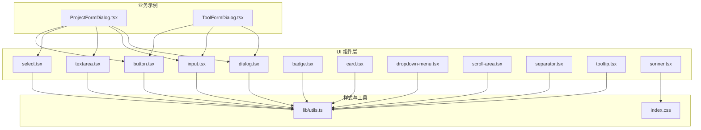
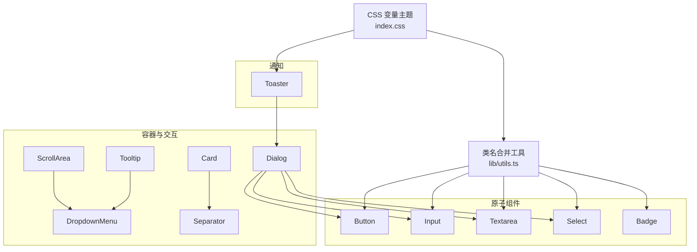
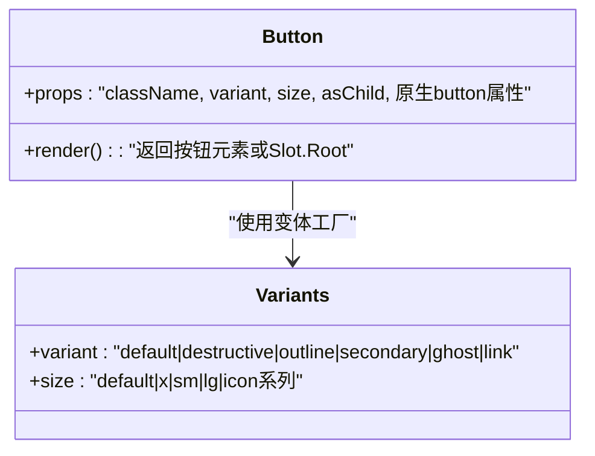
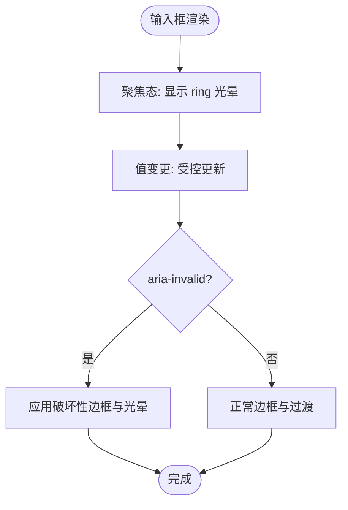
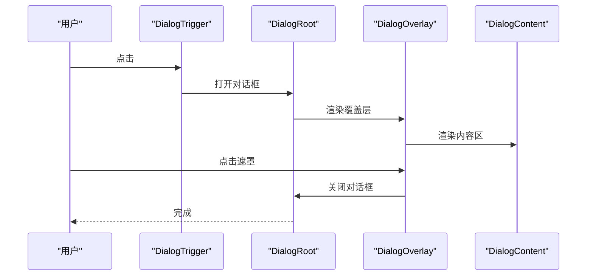
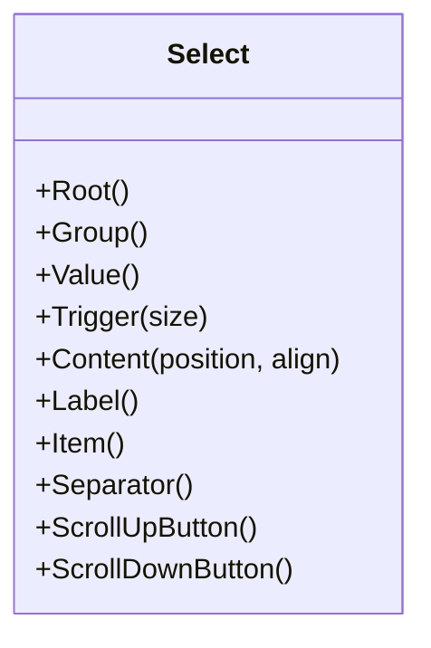
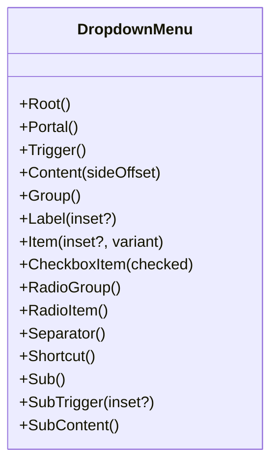
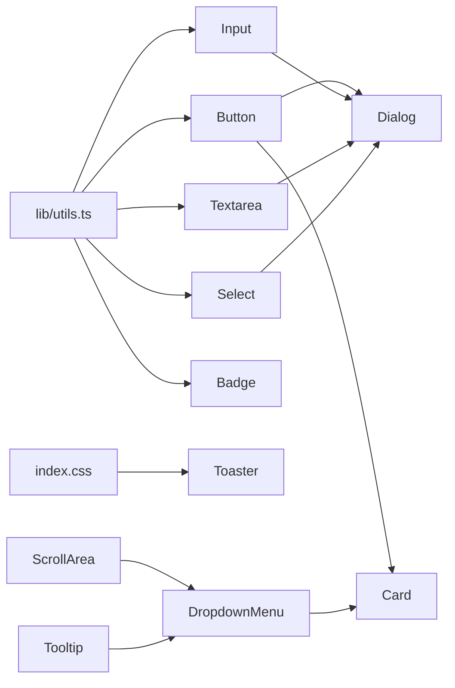

# 基础 UI 组件

<cite>
**本文引用的文件**
- [src/components/ui/button.tsx](file://src/components/ui/button.tsx)
- [src/components/ui/input.tsx](file://src/components/ui/input.tsx)
- [src/components/ui/dialog.tsx](file://src/components/ui/dialog.tsx)
- [src/components/ui/select.tsx](file://src/components/ui/select.tsx)
- [src/components/ui/textarea.tsx](file://src/components/ui/textarea.tsx)
- [src/components/ui/badge.tsx](file://src/components/ui/badge.tsx)
- [src/components/ui/card.tsx](file://src/components/ui/card.tsx)
- [src/components/ui/dropdown-menu.tsx](file://src/components/ui/dropdown-menu.tsx)
- [src/components/ui/scroll-area.tsx](file://src/components/ui/scroll-area.tsx)
- [src/components/ui/separator.tsx](file://src/components/ui/separator.tsx)
- [src/components/ui/sonner.tsx](file://src/components/ui/sonner.tsx)
- [src/components/ui/tooltip.tsx](file://src/components/ui/tooltip.tsx)
- [src/lib/utils.ts](file://src/lib/utils.ts)
- [src/index.css](file://src/index.css)
- [src/components/project/ProjectFormDialog.tsx](file://src/components/project/ProjectFormDialog.tsx)
- [src/components/tool/ToolFormDialog.tsx](file://src/components/tool/ToolFormDialog.tsx)
</cite>

## 目录
1. [简介](#简介)
2. [项目结构](#项目结构)
3. [核心组件](#核心组件)
4. [架构总览](#架构总览)
5. [详细组件分析](#详细组件分析)
6. [依赖关系分析](#依赖关系分析)
7. [性能考量](#性能考量)
8. [故障排查指南](#故障排查指南)
9. [结论](#结论)
10. [附录](#附录)

## 简介
本文件系统化梳理 LaunchPro 的基础 UI 组件，覆盖按钮、输入框、对话框、选择器、文本域、徽章、卡片、下拉菜单、滚动区域、分隔线、提示气泡与通知等组件的设计理念、属性配置、事件处理、样式定制与主题集成方式。文档同时提供可访问性、键盘导航与屏幕阅读器兼容性说明，并给出在实际业务场景中的组合使用范式与性能优化建议。

## 项目结构
LaunchPro 的基础 UI 组件集中于 src/components/ui 目录，采用“按功能拆分”的模块化组织方式；样式通过 Tailwind CSS 与 CSS 变量主题系统统一管理；工具函数 cn 负责类名合并与冲突修复；示例组件展示了组件在表单与对话框中的典型用法。

图表来源
- [src/components/ui/button.tsx:1-65](file://src/components/ui/button.tsx#L1-L65)
- [src/components/ui/input.tsx:1-22](file://src/components/ui/input.tsx#L1-L22)
- [src/components/ui/textarea.tsx:1-19](file://src/components/ui/textarea.tsx#L1-L19)
- [src/components/ui/dialog.tsx:1-157](file://src/components/ui/dialog.tsx#L1-L157)
- [src/components/ui/select.tsx:1-191](file://src/components/ui/select.tsx#L1-L191)
- [src/components/ui/badge.tsx:1-49](file://src/components/ui/badge.tsx#L1-L49)
- [src/components/ui/card.tsx:1-93](file://src/components/ui/card.tsx#L1-L93)
- [src/components/ui/dropdown-menu.tsx:1-258](file://src/components/ui/dropdown-menu.tsx#L1-L258)
- [src/components/ui/scroll-area.tsx:1-57](file://src/components/ui/scroll-area.tsx#L1-L57)
- [src/components/ui/separator.tsx:1-29](file://src/components/ui/separator.tsx#L1-L29)
- [src/components/ui/tooltip.tsx:1-56](file://src/components/ui/tooltip.tsx#L1-L56)
- [src/components/ui/sonner.tsx:1-21](file://src/components/ui/sonner.tsx#L1-L21)
- [src/lib/utils.ts:1-7](file://src/lib/utils.ts#L1-L7)
- [src/index.css:1-116](file://src/index.css#L1-L116)
- [src/components/project/ProjectFormDialog.tsx:1-229](file://src/components/project/ProjectFormDialog.tsx#L1-L229)
- [src/components/tool/ToolFormDialog.tsx:1-134](file://src/components/tool/ToolFormDialog.tsx#L1-L134)

章节来源
- [src/components/ui/button.tsx:1-65](file://src/components/ui/button.tsx#L1-L65)
- [src/components/ui/input.tsx:1-22](file://src/components/ui/input.tsx#L1-L22)
- [src/components/ui/dialog.tsx:1-157](file://src/components/ui/dialog.tsx#L1-L157)
- [src/components/ui/select.tsx:1-191](file://src/components/ui/select.tsx#L1-L191)
- [src/components/ui/textarea.tsx:1-19](file://src/components/ui/textarea.tsx#L1-L19)
- [src/components/ui/badge.tsx:1-49](file://src/components/ui/badge.tsx#L1-L49)
- [src/components/ui/card.tsx:1-93](file://src/components/ui/card.tsx#L1-L93)
- [src/components/ui/dropdown-menu.tsx:1-258](file://src/components/ui/dropdown-menu.tsx#L1-L258)
- [src/components/ui/scroll-area.tsx:1-57](file://src/components/ui/scroll-area.tsx#L1-L57)
- [src/components/ui/separator.tsx:1-29](file://src/components/ui/separator.tsx#L1-L29)
- [src/components/ui/tooltip.tsx:1-56](file://src/components/ui/tooltip.tsx#L1-L56)
- [src/components/ui/sonner.tsx:1-21](file://src/components/ui/sonner.tsx#L1-L21)
- [src/lib/utils.ts:1-7](file://src/lib/utils.ts#L1-L7)
- [src/index.css:1-116](file://src/index.css#L1-L116)
- [src/components/project/ProjectFormDialog.tsx:1-229](file://src/components/project/ProjectFormDialog.tsx#L1-L229)
- [src/components/tool/ToolFormDialog.tsx:1-134](file://src/components/tool/ToolFormDialog.tsx#L1-L134)

## 核心组件
本节概述各基础组件的职责、关键属性与行为特征，便于快速定位与组合使用。

- 按钮 Button
  - 设计理念：语义化变体（默认/破坏性/描边/次级/幽灵/链接）与尺寸（默认/xs/sm/lg/icon 系列）通过变体工厂统一管理；支持 asChild 渲染为任意元素。
  - 关键属性：className、variant、size、asChild、原生 button 属性。
  - 事件与交互：继承原生 button 行为，聚焦态带 ring 边框与阴影；禁用态透明度降低且阻止交互。
  - 样式定制：通过变体工厂与数据槽属性 data-slot/data-variant/data-size 标记，便于主题与测试选择器稳定匹配。
  - 可访问性：具备焦点可见轮廓与 aria-invalid 支持，配合错误状态样式。

- 输入框 Input
  - 设计理念：统一圆角、边框与背景色，聚焦态高亮 ring 并带环形光晕；禁用态与无效态有明确视觉反馈。
  - 关键属性：className、type、原生 input 属性。
  - 事件与交互：受控值绑定，支持 aria-invalid 错误态。
  - 样式定制：基于 CSS 变量与暗色主题适配，支持文件选择器样式微调。

- 文本域 Textarea
  - 设计理念：多行文本输入，最小高度与圆角一致化；聚焦态 ring 高亮。
  - 关键属性：className、rows、原生 textarea 属性。
  - 事件与交互：支持受控值与 aria-invalid 错误态。

- 对话框 Dialog
  - 设计理念：基于 Radix UI 的无障碍对话框，提供根容器、触发器、入口、覆盖层、内容区、标题、描述与页脚等子组件。
  - 关键属性：Root/Trigger/Portal/Overlay/Content/Close 等组件各自属性；Content 支持是否显示关闭按钮。
  - 事件与交互：打开/关闭动画、焦点陷阱、Esc 关闭、点击遮罩关闭等。
  - 可访问性：自动设置 aria-modal、role、aria-labelledby/aria-describedby；关闭按钮含 sr-only 文本。

- 选择器 Select
  - 设计理念：支持组、标签、项、分隔符与滚动按钮；触发器支持大小与图标；内容区支持 item-aligned 与 popper 两种定位策略。
  - 关键属性：Root/Group/Value/Trigger/Content/Label/Item/Separator/ScrollUp/ScrollDown 等。
  - 事件与交互：选中态指示器、禁用项、键盘导航、滚动条。
  - 可访问性：遵循 Select 规范，支持键盘操作与无障碍标签。

- 徽章 Badge
  - 设计理念：轻量标签，支持多种变体与 asChild 渲染。
  - 关键属性：className、variant、asChild。
  - 样式定制：基于变体工厂，支持链接态样式。

- 卡片 Card
  - 设计理念：卡片容器，提供头部、标题、描述、动作、内容与底部等子区域，布局与间距统一。
  - 关键属性：Card/CardHeader/CardTitle/CardDescription/CardAction/CardContent/CardFooter。
  - 样式定制：基于 CSS 变量与网格布局，支持响应式与边框分割。

- 下拉菜单 DropdownMenu
  - 设计理念：支持普通项、复选/单选项、分组、标签、快捷键、子菜单等；支持 inset 缩进与 destructive 变体。
  - 关键属性：Root/Portal/Trigger/Content/Group/Label/Item/CheckboxItem/RadioGroup/RadioItem/Separator/Shortcut/Sub/SubTrigger/SubContent。
  - 事件与交互：子菜单展开/收起、快捷键文本、指示器图标。
  - 可访问性：遵循 DropdownMenu 规范，支持键盘导航与焦点管理。

- 滚动区域 ScrollArea
  - 设计理念：提供可感知的滚动条，支持垂直/水平方向；滚动条与视口分离，便于主题化。
  - 关键属性：Root/Viewport/Corner 与 ScrollBar/Thumb。
  - 样式定制：滚动条宽度与边框根据方向切换，基于 CSS 变量。

- 分隔线 Separator
  - 设计理念：水平/垂直分隔线，支持装饰性与语义性两种角色。
  - 关键属性：className、orientation、decorative。
  - 样式定制：基于 data-orientation 切换宽高。

- 提示气泡 Tooltip
  - 设计理念：提供延迟控制、触发器与内容区；内容区带箭头与淡入/缩放动画。
  - 关键属性：Provider/Root/Trigger/Content；Content 支持 sideOffset。
  - 事件与交互：延迟时长可配置，支持多方位定位。

- 通知 Toaster
  - 设计理念：基于 Sonner 的全局通知，通过 CSS 变量与主题保持一致风格。
  - 关键属性：ToasterProps。
  - 样式定制：映射到 popover/foreground/border/radius 等变量。

章节来源
- [src/components/ui/button.tsx:1-65](file://src/components/ui/button.tsx#L1-L65)
- [src/components/ui/input.tsx:1-22](file://src/components/ui/input.tsx#L1-L22)
- [src/components/ui/textarea.tsx:1-19](file://src/components/ui/textarea.tsx#L1-L19)
- [src/components/ui/dialog.tsx:1-157](file://src/components/ui/dialog.tsx#L1-L157)
- [src/components/ui/select.tsx:1-191](file://src/components/ui/select.tsx#L1-L191)
- [src/components/ui/badge.tsx:1-49](file://src/components/ui/badge.tsx#L1-L49)
- [src/components/ui/card.tsx:1-93](file://src/components/ui/card.tsx#L1-L93)
- [src/components/ui/dropdown-menu.tsx:1-258](file://src/components/ui/dropdown-menu.tsx#L1-L258)
- [src/components/ui/scroll-area.tsx:1-57](file://src/components/ui/scroll-area.tsx#L1-L57)
- [src/components/ui/separator.tsx:1-29](file://src/components/ui/separator.tsx#L1-L29)
- [src/components/ui/tooltip.tsx:1-56](file://src/components/ui/tooltip.tsx#L1-L56)
- [src/components/ui/sonner.tsx:1-21](file://src/components/ui/sonner.tsx#L1-L21)

## 架构总览
组件体系以“原子化 + 组合”为核心：基础输入/按钮/对话框等原子组件通过变体工厂与数据槽属性实现一致的外观与可测试性；容器型组件（卡片、滚动区域、下拉菜单）提供布局与交互能力；通知组件与主题系统协同，确保全局一致性。

图表来源
- [src/index.css:1-116](file://src/index.css#L1-L116)
- [src/lib/utils.ts:1-7](file://src/lib/utils.ts#L1-L7)
- [src/components/ui/button.tsx:1-65](file://src/components/ui/button.tsx#L1-L65)
- [src/components/ui/input.tsx:1-22](file://src/components/ui/input.tsx#L1-L22)
- [src/components/ui/textarea.tsx:1-19](file://src/components/ui/textarea.tsx#L1-L19)
- [src/components/ui/select.tsx:1-191](file://src/components/ui/select.tsx#L1-L191)
- [src/components/ui/badge.tsx:1-49](file://src/components/ui/badge.tsx#L1-L49)
- [src/components/ui/dialog.tsx:1-157](file://src/components/ui/dialog.tsx#L1-L157)
- [src/components/ui/card.tsx:1-93](file://src/components/ui/card.tsx#L1-L93)
- [src/components/ui/scroll-area.tsx:1-57](file://src/components/ui/scroll-area.tsx#L1-L57)
- [src/components/ui/dropdown-menu.tsx:1-258](file://src/components/ui/dropdown-menu.tsx#L1-L258)
- [src/components/ui/tooltip.tsx:1-56](file://src/components/ui/tooltip.tsx#L1-L56)
- [src/components/ui/separator.tsx:1-29](file://src/components/ui/separator.tsx#L1-L29)
- [src/components/ui/sonner.tsx:1-21](file://src/components/ui/sonner.tsx#L1-L21)

## 详细组件分析

### 按钮 Button
- 设计要点
  - 使用变体工厂定义语义化外观与尺寸，支持 asChild 将渲染节点替换为任意元素。
  - 聚焦态带 ring 光晕与边框高亮，禁用态降低不透明度并阻止交互。
  - 支持 aria-invalid 错误态，配合破坏性变体。
- 关键属性
  - className、variant（default/destructive/outline/secondary/ghost/link）、size（default/xs/sm/lg/icon 系列）、asChild。
- 事件与交互
  - 透传原生 button 事件；支持受控禁用与加载态。
- 样式定制
  - 通过 data-slot="button"、data-variant、data-size 与类名合并工具实现稳定选择器与主题适配。
- 可访问性
  - 焦点可见轮廓、错误态视觉反馈、支持键盘激活。

图表来源
- [src/components/ui/button.tsx:1-65](file://src/components/ui/button.tsx#L1-L65)

章节来源
- [src/components/ui/button.tsx:1-65](file://src/components/ui/button.tsx#L1-L65)

### 输入框 Input
- 设计要点
  - 统一圆角、边框与背景；聚焦态 ring 高亮；禁用态与无效态有明确反馈。
- 关键属性
  - className、type、原生 input 属性。
- 事件与交互
  - 受控值绑定；支持 aria-invalid。
- 样式定制
  - 基于 CSS 变量与暗色主题；文件选择器样式微调。

图表来源
- [src/components/ui/input.tsx:1-22](file://src/components/ui/input.tsx#L1-L22)

章节来源
- [src/components/ui/input.tsx:1-22](file://src/components/ui/input.tsx#L1-L22)

### 文本域 Textarea
- 设计要点
  - 多行输入，最小高度与圆角一致化；聚焦态 ring 高亮。
- 关键属性
  - className、rows、原生 textarea 属性。
- 事件与交互
  - 受控值与 aria-invalid。

章节来源
- [src/components/ui/textarea.tsx:1-19](file://src/components/ui/textarea.tsx#L1-L19)

### 对话框 Dialog
- 设计要点
  - 基于 Radix UI 的无障碍对话框，提供完整的生命周期与动画；支持关闭按钮与页脚布局。
- 关键属性
  - Root/Trigger/Portal/Overlay/Content/Close/Title/Description/Header/Footer。
  - Content 支持 showCloseButton 控制关闭按钮显隐。
- 事件与交互
  - 打开/关闭动画、Esc 关闭、点击遮罩关闭、焦点陷阱。
- 可访问性
  - 自动设置 aria-modal、role、aria-labelledby/aria-describedby；关闭按钮含 sr-only 文本。

图表来源
- [src/components/ui/dialog.tsx:1-157](file://src/components/ui/dialog.tsx#L1-L157)

章节来源
- [src/components/ui/dialog.tsx:1-157](file://src/components/ui/dialog.tsx#L1-L157)

### 选择器 Select
- 设计要点
  - 支持组、标签、项、分隔符与滚动按钮；触发器支持大小与图标；内容区支持 item-aligned 与 popper 两种定位策略。
- 关键属性
  - Trigger 支持 size；Content 支持 position 与 align；Item 支持禁用与指示器。
- 事件与交互
  - 选中态指示器、禁用项、键盘导航、滚动条。
- 可访问性
  - 遵循 Select 规范，支持键盘操作与无障碍标签。

图表来源
- [src/components/ui/select.tsx:1-191](file://src/components/ui/select.tsx#L1-L191)

章节来源
- [src/components/ui/select.tsx:1-191](file://src/components/ui/select.tsx#L1-L191)

### 徽章 Badge
- 设计要点
  - 轻量标签，支持多种变体与 asChild 渲染。
- 关键属性
  - className、variant、asChild。
- 样式定制
  - 基于变体工厂，支持链接态样式。

章节来源
- [src/components/ui/badge.tsx:1-49](file://src/components/ui/badge.tsx#L1-L49)

### 卡片 Card
- 设计要点
  - 提供头部、标题、描述、动作、内容与底部等子区域，布局与间距统一。
- 关键属性
  - Card/CardHeader/CardTitle/CardDescription/CardAction/CardContent/CardFooter。
- 样式定制
  - 基于 CSS 变量与网格布局，支持响应式与边框分割。

章节来源
- [src/components/ui/card.tsx:1-93](file://src/components/ui/card.tsx#L1-L93)

### 下拉菜单 DropdownMenu
- 设计要点
  - 支持普通项、复选/单选项、分组、标签、快捷键、子菜单等；支持 inset 缩进与 destructive 变体。
- 关键属性
  - Item 支持 inset 与 variant；CheckboxItem/RadioItem 支持指示器；SubTrigger 带 Chevron 图标。
- 事件与交互
  - 子菜单展开/收起、快捷键文本、指示器图标。
- 可访问性
  - 遵循 DropdownMenu 规范，支持键盘导航与焦点管理。

图表来源
- [src/components/ui/dropdown-menu.tsx:1-258](file://src/components/ui/dropdown-menu.tsx#L1-L258)

章节来源
- [src/components/ui/dropdown-menu.tsx:1-258](file://src/components/ui/dropdown-menu.tsx#L1-L258)

### 滚动区域 ScrollArea
- 设计要点
  - 提供可感知的滚动条，支持垂直/水平方向；滚动条与视口分离，便于主题化。
- 关键属性
  - ScrollBar 支持 orientation；Thumb 为滚动条滑块。
- 样式定制
  - 垂直/水平方向切换宽度与边框，基于 CSS 变量。

章节来源
- [src/components/ui/scroll-area.tsx:1-57](file://src/components/ui/scroll-area.tsx#L1-L57)

### 分隔线 Separator
- 设计要点
  - 水平/垂直分隔线，支持装饰性与语义性两种角色。
- 关键属性
  - orientation、decorative。
- 样式定制
  - 基于 data-orientation 切换宽高。

章节来源
- [src/components/ui/separator.tsx:1-29](file://src/components/ui/separator.tsx#L1-L29)

### 提示气泡 Tooltip
- 设计要点
  - 提供延迟控制、触发器与内容区；内容区带箭头与淡入/缩放动画。
- 关键属性
  - Provider(delayDuration)；Content 支持 sideOffset。
- 事件与交互
  - 延迟时长可配置，支持多方位定位。

章节来源
- [src/components/ui/tooltip.tsx:1-56](file://src/components/ui/tooltip.tsx#L1-L56)

### 通知 Toaster
- 设计要点
  - 基于 Sonner 的全局通知，通过 CSS 变量与主题保持一致风格。
- 关键属性
  - ToasterProps。
- 样式定制
  - 映射到 popover/foreground/border/radius 等变量。

章节来源
- [src/components/ui/sonner.tsx:1-21](file://src/components/ui/sonner.tsx#L1-L21)

## 依赖关系分析
- 组件间耦合
  - 原子组件（Button/Input/Textarea/Select/Badge）均依赖类名合并工具与主题变量，耦合度低、内聚性强。
  - 容器组件（Dialog/Card/ScrollArea/DropdownMenu/Tooltip）依赖各自子组件与 Radix UI，形成清晰的组合关系。
  - 通知组件（Toaster）依赖主题变量，独立于业务组件。
- 外部依赖
  - 类名合并：clsx + tailwind-merge。
  - 主题系统：Tailwind CSS + CSS 变量。
  - 无障碍库：Radix UI。
  - 通知：Sonner。
- 潜在循环依赖
  - 当前文件组织避免了循环导入；如需扩展，应保持“原子组件 → 容器组件 → 业务组件”的单向依赖。

图表来源
- [src/lib/utils.ts:1-7](file://src/lib/utils.ts#L1-L7)
- [src/index.css:1-116](file://src/index.css#L1-L116)
- [src/components/ui/button.tsx:1-65](file://src/components/ui/button.tsx#L1-L65)
- [src/components/ui/input.tsx:1-22](file://src/components/ui/input.tsx#L1-L22)
- [src/components/ui/textarea.tsx:1-19](file://src/components/ui/textarea.tsx#L1-L19)
- [src/components/ui/select.tsx:1-191](file://src/components/ui/select.tsx#L1-L191)
- [src/components/ui/badge.tsx:1-49](file://src/components/ui/badge.tsx#L1-L49)
- [src/components/ui/dialog.tsx:1-157](file://src/components/ui/dialog.tsx#L1-L157)
- [src/components/ui/card.tsx:1-93](file://src/components/ui/card.tsx#L1-L93)
- [src/components/ui/dropdown-menu.tsx:1-258](file://src/components/ui/dropdown-menu.tsx#L1-L258)
- [src/components/ui/scroll-area.tsx:1-57](file://src/components/ui/scroll-area.tsx#L1-L57)
- [src/components/ui/tooltip.tsx:1-56](file://src/components/ui/tooltip.tsx#L1-L56)
- [src/components/ui/sonner.tsx:1-21](file://src/components/ui/sonner.tsx#L1-L21)

章节来源
- [src/lib/utils.ts:1-7](file://src/lib/utils.ts#L1-L7)
- [src/index.css:1-116](file://src/index.css#L1-L116)
- [src/components/ui/button.tsx:1-65](file://src/components/ui/button.tsx#L1-L65)
- [src/components/ui/input.tsx:1-22](file://src/components/ui/input.tsx#L1-L22)
- [src/components/ui/textarea.tsx:1-19](file://src/components/ui/textarea.tsx#L1-L19)
- [src/components/ui/select.tsx:1-191](file://src/components/ui/select.tsx#L1-L191)
- [src/components/ui/badge.tsx:1-49](file://src/components/ui/badge.tsx#L1-L49)
- [src/components/ui/dialog.tsx:1-157](file://src/components/ui/dialog.tsx#L1-L157)
- [src/components/ui/card.tsx:1-93](file://src/components/ui/card.tsx#L1-L93)
- [src/components/ui/dropdown-menu.tsx:1-258](file://src/components/ui/dropdown-menu.tsx#L1-L258)
- [src/components/ui/scroll-area.tsx:1-57](file://src/components/ui/scroll-area.tsx#L1-L57)
- [src/components/ui/tooltip.tsx:1-56](file://src/components/ui/tooltip.tsx#L1-L56)
- [src/components/ui/sonner.tsx:1-21](file://src/components/ui/sonner.tsx#L1-L21)

## 性能考量
- 类名合并
  - 使用类名合并工具减少重复与冲突，提升渲染效率与可维护性。
- 动画与过渡
  - 对话框与下拉菜单使用 Radix UI 的入场/出场动画，建议在低端设备上适当缩短动画时长或禁用非关键动画。
- 滚动区域
  - 滚动条仅在需要时出现，避免不必要的重排；内容过多时优先使用虚拟滚动（如需）。
- 通知
  - 合理限制通知数量与显示时长，避免频繁弹出影响性能。
- 主题变量
  - CSS 变量统一管理颜色与半径，减少重复计算与样式回流。

## 故障排查指南
- 对话框无法关闭
  - 检查是否正确使用 Close 组件与 showCloseButton；确认未阻止默认关闭事件。
- 输入框无效态无反馈
  - 确认已设置 aria-invalid；检查主题变量与暗色模式下的光晕样式。
- 选择器项不可选
  - 检查 Item 是否被禁用；确认未覆盖 pointer-events；核对选中态指示器。
- 下拉菜单项样式异常
  - 检查 inset 与 variant 属性；确认未被外部样式覆盖。
- 滚动条不可见
  - 检查 ScrollBar 的 orientation 与边框设置；确认内容超出阈值。
- 提示气泡不显示
  - 检查 TooltipProvider 的 delayDuration；确认触发器与内容区在同一 Portal 内。
- 通知样式错乱
  - 检查 CSS 变量映射；确认 Toaster 根节点位于主题上下文中。

章节来源
- [src/components/ui/dialog.tsx:1-157](file://src/components/ui/dialog.tsx#L1-L157)
- [src/components/ui/input.tsx:1-22](file://src/components/ui/input.tsx#L1-L22)
- [src/components/ui/select.tsx:1-191](file://src/components/ui/select.tsx#L1-L191)
- [src/components/ui/dropdown-menu.tsx:1-258](file://src/components/ui/dropdown-menu.tsx#L1-L258)
- [src/components/ui/scroll-area.tsx:1-57](file://src/components/ui/scroll-area.tsx#L1-L57)
- [src/components/ui/tooltip.tsx:1-56](file://src/components/ui/tooltip.tsx#L1-L56)
- [src/components/ui/sonner.tsx:1-21](file://src/components/ui/sonner.tsx#L1-L21)

## 结论
LaunchPro 的基础 UI 组件以统一的变体工厂、数据槽标记与 CSS 变量主题为基础，实现了高内聚、低耦合与强可访问性的设计目标。通过在业务组件中合理组合这些原子与容器组件，可以快速构建一致、美观且易维护的界面。建议在实际开发中遵循组件属性与样式约定，结合主题变量进行深度定制，并关注性能与可访问性细节。

## 附录
- 实战示例
  - 项目表单对话框：演示 Input、Textarea、Select、Button 与 Dialog 的组合使用。
  - 工具表单对话框：演示 Input、Button 与 Dialog 的组合使用。
- 最佳实践
  - 使用 asChild 与 data-slot 提升可测试性与主题稳定性。
  - 在复杂表单中统一使用 Dialog 作为容器，配合 Card/ScrollArea 提升可读性。
  - 为关键交互提供 Tooltip 与无障碍标签，确保键盘导航与屏幕阅读器兼容。

章节来源
- [src/components/project/ProjectFormDialog.tsx:1-229](file://src/components/project/ProjectFormDialog.tsx#L1-L229)
- [src/components/tool/ToolFormDialog.tsx:1-134](file://src/components/tool/ToolFormDialog.tsx#L1-L134)