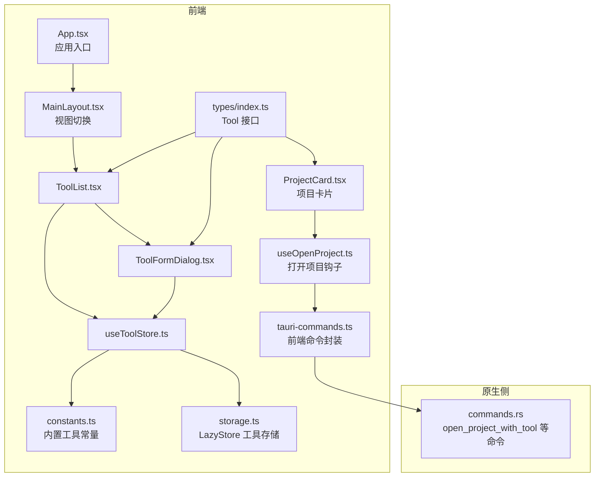
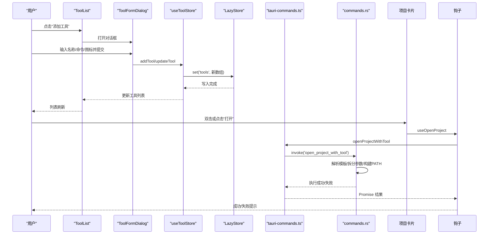
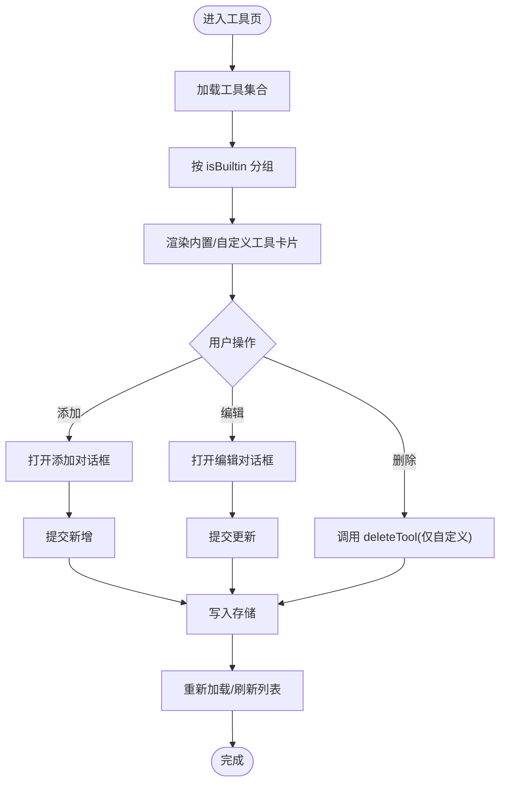
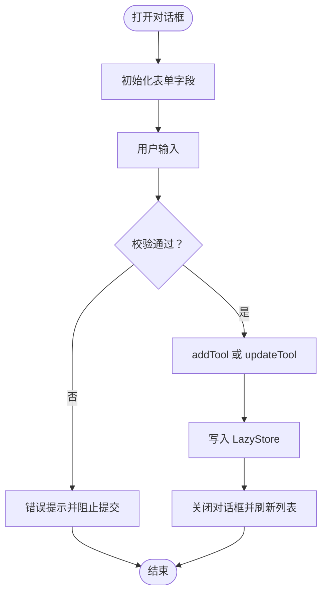
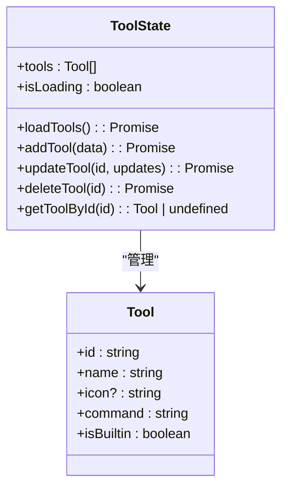
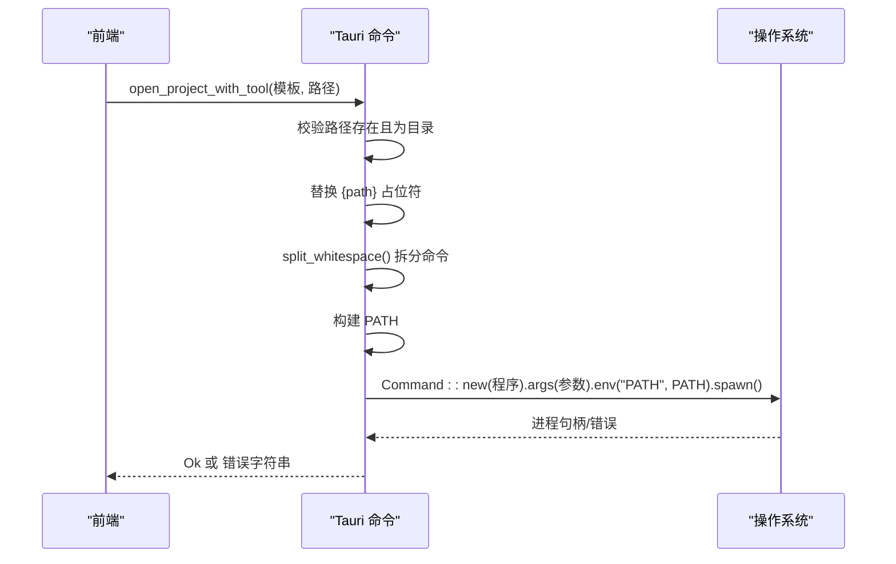
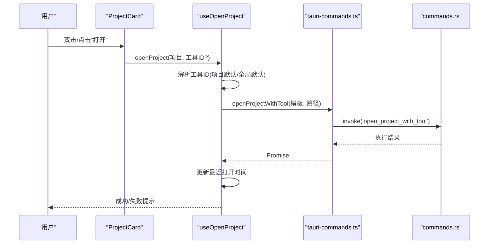
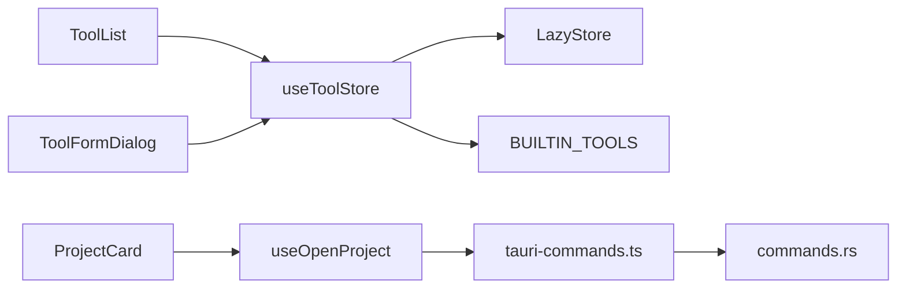

# 工具管理组件

<cite>
**本文引用的文件**
- [ToolList.tsx](file://src/components/tool/ToolList.tsx)
- [ToolFormDialog.tsx](file://src/components/tool/ToolFormDialog.tsx)
- [useToolStore.ts](file://src/stores/useToolStore.ts)
- [constants.ts](file://src/lib/constants.ts)
- [storage.ts](file://src/lib/storage.ts)
- [index.ts（类型定义）](file://src/types/index.ts)
- [App.tsx](file://src/App.tsx)
- [MainLayout.tsx](file://src/components/layout/MainLayout.tsx)
- [ProjectCard.tsx](file://src/components/project/ProjectCard.tsx)
- [useOpenProject.ts](file://src/hooks/useOpenProject.ts)
- [tauri-commands.ts](file://src/lib/tauri-commands.ts)
- [commands.rs](file://src-tauri/src/commands.rs)
</cite>

## 目录
1. [简介](#简介)
2. [项目结构](#项目结构)
3. [核心组件](#核心组件)
4. [架构总览](#架构总览)
5. [详细组件分析](#详细组件分析)
6. [依赖关系分析](#依赖关系分析)
7. [性能考量](#性能考量)
8. [故障排除指南](#故障排除指南)
9. [结论](#结论)
10. [附录](#附录)

## 简介
本文件面向 LaunchPro 的“工具管理”子系统，系统性阐述工具列表与工具表单对话框的设计架构、数据模型、状态管理、用户交互流程以及工具命令模板的解析与执行机制。文档同时覆盖工具的展示模式、排序规则、搜索过滤能力、字段配置与验证逻辑、数据提交机制、可扩展性设计（内置工具与自定义工具）、实际使用示例、配置指南与故障排除方法。

## 项目结构
工具管理相关模块位于前端 src/components/tool 与状态层 src/stores、类型定义 src/types、持久化存储 src/lib、以及 Tauri 原生侧命令 src-tauri/src。主界面通过 MainLayout 根据当前视图切换显示工具页。

图表来源
- [MainLayout.tsx:1-21](file://src/components/layout/MainLayout.tsx#L1-L21)
- [ToolList.tsx:1-129](file://src/components/tool/ToolList.tsx#L1-L129)
- [ToolFormDialog.tsx:1-134](file://src/components/tool/ToolFormDialog.tsx#L1-L134)
- [useToolStore.ts:1-75](file://src/stores/useToolStore.ts#L1-L75)
- [constants.ts:1-23](file://src/lib/constants.ts#L1-L23)
- [storage.ts:1-30](file://src/lib/storage.ts#L1-L30)
- [index.ts（类型定义）:12-18](file://src/types/index.ts#L12-L18)
- [App.tsx:21-40](file://src/App.tsx#L21-L40)
- [ProjectCard.tsx:1-177](file://src/components/project/ProjectCard.tsx#L1-L177)
- [useOpenProject.ts:1-43](file://src/hooks/useOpenProject.ts#L1-L43)
- [tauri-commands.ts:1-17](file://src/lib/tauri-commands.ts#L1-L17)
- [commands.rs:48-94](file://src-tauri/src/commands.rs#L48-L94)

章节来源
- [MainLayout.tsx:1-21](file://src/components/layout/MainLayout.tsx#L1-L21)
- [App.tsx:21-40](file://src/App.tsx#L21-L40)

## 核心组件
- 工具列表组件：负责展示内置与自定义工具，支持编辑与删除（仅自定义工具），并触发工具表单对话框。
- 工具表单对话框：提供工具名称、命令模板、图标等字段的输入与校验，并提交到状态层。
- 工具状态存储：Zustand 状态管理，负责加载、新增、更新、删除工具，并与本地存储交互。
- 类型与常量：定义 Tool 接口、内置工具集合与默认设置。
- 命令执行链路：前端调用 Tauri 命令，原生侧解析命令模板、拼接路径、构建 PATH 并执行外部程序。

章节来源
- [ToolList.tsx:12-129](file://src/components/tool/ToolList.tsx#L12-L129)
- [ToolFormDialog.tsx:21-134](file://src/components/tool/ToolFormDialog.tsx#L21-L134)
- [useToolStore.ts:17-75](file://src/stores/useToolStore.ts#L17-L75)
- [index.ts（类型定义）:12-18](file://src/types/index.ts#L12-L18)
- [constants.ts:3-18](file://src/lib/constants.ts#L3-L18)

## 架构总览
工具管理采用“组件-状态-存储-原生命令”的分层架构：
- 视图层：ToolList、ToolFormDialog 负责渲染与交互。
- 状态层：useToolStore 提供工具集合的增删改查与持久化。
- 存储层：LazyStore 将工具集合写入本地 JSON 文件。
- 原生层：Tauri 命令解析模板、构造 PATH、执行外部程序。

图表来源
- [ToolList.tsx:30-78](file://src/components/tool/ToolList.tsx#L30-L78)
- [ToolFormDialog.tsx:44-78](file://src/components/tool/ToolFormDialog.tsx#L44-L78)
- [useToolStore.ts:41-69](file://src/stores/useToolStore.ts#L41-L69)
- [storage.ts:23-25](file://src/lib/storage.ts#L23-L25)
- [ProjectCard.tsx:107-136](file://src/components/project/ProjectCard.tsx#L107-L136)
- [useOpenProject.ts:15-42](file://src/hooks/useOpenProject.ts#L15-L42)
- [tauri-commands.ts:3-8](file://src/lib/tauri-commands.ts#L3-L8)
- [commands.rs:48-79](file://src-tauri/src/commands.rs#L48-L79)

## 详细组件分析

### 工具列表组件（ToolList）
- 展示模式
  - 分组展示：内置工具与自定义工具分别列出，内置工具不可删除，自定义工具可编辑/删除。
  - 卡片样式：每条工具以卡片形式呈现，包含图标、名称、是否内置标识、命令模板预览与操作按钮。
- 排序规则
  - 当前实现未显式排序；内置工具来源于常量数组顺序，自定义工具按存储中的顺序排列。
- 搜索过滤
  - 当前未实现搜索过滤功能；如需扩展可在列表层增加输入框与过滤逻辑。
- 用户交互
  - “添加工具”按钮打开工具表单对话框。
  - 编辑按钮打开同一对话框并回填当前工具数据。
  - 删除按钮仅对自定义工具生效（内置工具不可删除）。

图表来源
- [ToolList.tsx:12-81](file://src/components/tool/ToolList.tsx#L12-L81)
- [useToolStore.ts:41-69](file://src/stores/useToolStore.ts#L41-L69)

章节来源
- [ToolList.tsx:12-129](file://src/components/tool/ToolList.tsx#L12-L129)

### 工具表单对话框（ToolFormDialog）
- 字段配置
  - 名称：必填，用于显示与识别工具。
  - 命令模板：必填，必须包含占位符 {path}，用于替换项目路径。
  - 图标：可选，最多两个字符，若为空则默认取名称首字母大写。
- 验证逻辑
  - 名称非空校验。
  - 命令模板非空校验。
  - 命令模板必须包含 {path} 占位符。
  - 提交后通过状态层进行新增或更新。
- 数据提交机制
  - 新增：生成唯一 ID，标记为非内置，写入存储。
  - 更新：根据 ID 合并更新字段，写入存储。
  - 成功/失败通过通知组件反馈给用户。

图表来源
- [ToolFormDialog.tsx:21-134](file://src/components/tool/ToolFormDialog.tsx#L21-L134)
- [useToolStore.ts:41-69](file://src/stores/useToolStore.ts#L41-L69)

章节来源
- [ToolFormDialog.tsx:21-134](file://src/components/tool/ToolFormDialog.tsx#L21-L134)

### 工具状态存储（useToolStore）
- 数据模型
  - 工具集合：Tool[]
  - 加载状态：isLoading
  - 方法：loadTools、addTool、updateTool、deleteTool、getToolById
- 初始化与合并策略
  - 首次启动：使用内置工具集合初始化并写入存储。
  - 后续启动：从存储读取，若缺失内置工具则补全，保留用户自定义项。
- 权限控制
  - 不允许删除内置工具（isBuiltin 为真时直接返回）。
- 持久化
  - 使用 LazyStore 将工具集合写入 tools.json。

图表来源
- [useToolStore.ts:7-15](file://src/stores/useToolStore.ts#L7-L15)
- [index.ts（类型定义）:12-18](file://src/types/index.ts#L12-L18)

章节来源
- [useToolStore.ts:17-75](file://src/stores/useToolStore.ts#L17-L75)

### 命令模板解析与执行
- 模板解析规则
  - 命令模板中必须包含 {path} 占位符，运行时将被项目路径替换。
  - 命令模板会被按空白分割为“程序名 + 参数列表”，第一个片段作为程序名，其余作为参数。
- PATH 构建
  - 原生侧从系统文件与常见位置读取 PATH，补充常用 IDE CLI 安装目录，并包含当前 PATH 作为回退。
- 执行结果处理
  - 成功：返回 Ok，前端收到 Promise 成功。
  - 失败：返回错误字符串，前端捕获并提示用户。

图表来源
- [tauri-commands.ts:3-8](file://src/lib/tauri-commands.ts#L3-L8)
- [commands.rs:48-79](file://src-tauri/src/commands.rs#L48-L79)

章节来源
- [tauri-commands.ts:1-17](file://src/lib/tauri-commands.ts#L1-L17)
- [commands.rs:5-46](file://src-tauri/src/commands.rs#L5-L46)
- [commands.rs:48-79](file://src-tauri/src/commands.rs#L48-L79)

### 与项目卡片的集成
- 项目卡片在“打开方式”下拉菜单中枚举所有可用工具，支持直接选择工具打开项目。
- 若项目设置了默认工具或全局默认工具，双击卡片会优先使用该工具打开。
- 打开成功后更新项目的最近打开时间并提示用户。

图表来源
- [ProjectCard.tsx:27-164](file://src/components/project/ProjectCard.tsx#L27-L164)
- [useOpenProject.ts:15-42](file://src/hooks/useOpenProject.ts#L15-L42)
- [tauri-commands.ts:3-8](file://src/lib/tauri-commands.ts#L3-L8)
- [commands.rs:48-79](file://src-tauri/src/commands.rs#L48-L79)

章节来源
- [ProjectCard.tsx:27-164](file://src/components/project/ProjectCard.tsx#L27-L164)
- [useOpenProject.ts:1-43](file://src/hooks/useOpenProject.ts#L1-L43)

## 依赖关系分析
- 组件依赖
  - ToolList 依赖 useToolStore 获取工具集合与删除方法，依赖 ToolFormDialog 打开新增/编辑。
  - ToolFormDialog 依赖 useToolStore 进行新增/更新，依赖通知组件进行反馈。
  - ProjectCard 依赖 useOpenProject 钩子与 useToolStore 获取工具集合。
- 状态与存储
  - useToolStore 依赖 LazyStore 读写 tools.json，依赖 constants 中的内置工具集合。
- 原生命令
  - 前端通过 tauri-commands.ts 调用原生命令 open_project_with_tool，原生侧实现命令解析与执行。

图表来源
- [ToolList.tsx:8-9](file://src/components/tool/ToolList.tsx#L8-L9)
- [ToolFormDialog.tsx:11-12](file://src/components/tool/ToolFormDialog.tsx#L11-L12)
- [useToolStore.ts:2-4](file://src/stores/useToolStore.ts#L2-L4)
- [storage.ts:23-25](file://src/lib/storage.ts#L23-L25)
- [constants.ts:3-18](file://src/lib/constants.ts#L3-L18)
- [ProjectCard.tsx:17-19](file://src/components/project/ProjectCard.tsx#L17-L19)
- [useOpenProject.ts:5](file://src/hooks/useOpenProject.ts#L5)
- [tauri-commands.ts:1-8](file://src/lib/tauri-commands.ts#L1-L8)
- [commands.rs:48-79](file://src-tauri/src/commands.rs#L48-L79)

章节来源
- [ToolList.tsx:1-11](file://src/components/tool/ToolList.tsx#L1-L11)
- [ToolFormDialog.tsx:1-13](file://src/components/tool/ToolFormDialog.tsx#L1-L13)
- [useToolStore.ts:1-6](file://src/stores/useToolStore.ts#L1-L6)
- [storage.ts:1-30](file://src/lib/storage.ts#L1-L30)
- [constants.ts:1-23](file://src/lib/constants.ts#L1-L23)
- [ProjectCard.tsx:1-25](file://src/components/project/ProjectCard.tsx#L1-L25)
- [useOpenProject.ts:1-8](file://src/hooks/useOpenProject.ts#L1-L8)
- [tauri-commands.ts:1-17](file://src/lib/tauri-commands.ts#L1-L17)
- [commands.rs:1-95](file://src-tauri/src/commands.rs#L1-L95)

## 性能考量
- 渲染优化
  - 工具列表使用分组渲染，避免一次性渲染大量节点；自定义工具列表在无数据时隐藏分隔线与容器，减少 DOM。
- 状态与存储
  - Zustand 状态粒度适中，每次变更只更新工具数组；LazyStore 自动保存，避免频繁手动写入。
- 命令执行
  - 原生侧构建 PATH 时去重与合并，避免重复路径导致查找缓慢；命令拆分使用 split_whitespace，避免复杂解析成本。
- 建议
  - 如需大规模工具集，可考虑虚拟滚动或分页；对命令模板可做缓存与预编译（当前未实现）。

## 故障排除指南
- 添加/编辑工具失败
  - 检查命令模板是否包含 {path} 占位符；确保名称与命令模板非空。
  - 查看通知提示的具体错误信息。
- 删除工具无效
  - 内置工具无法删除，这是预期行为；请确认工具 isBuiltin 字段。
- 打开项目失败
  - 确认项目路径存在且为目录；检查命令模板是否正确指向可执行程序。
  - 查看原生侧错误信息，确认 PATH 是否包含所需 CLI 工具所在目录。
- 应用启动后工具丢失
  - 检查 tools.json 是否损坏；首次启动会回退到内置工具集合，后续启动会合并内置与用户自定义。

章节来源
- [ToolFormDialog.tsx:44-78](file://src/components/tool/ToolFormDialog.tsx#L44-L78)
- [useToolStore.ts:62-69](file://src/stores/useToolStore.ts#L62-L69)
- [commands.rs:48-79](file://src-tauri/src/commands.rs#L48-L79)

## 结论
工具管理组件通过清晰的分层设计实现了“可视化配置 + 模板化命令 + 原生执行”的完整闭环。内置工具与自定义工具的分离保证了可扩展性与稳定性；命令模板的占位符机制提供了灵活的路径注入能力；Zustand 与 LazyStore 的组合确保了状态一致性与持久化可靠性。未来可进一步引入搜索过滤、排序规则、批量操作与命令模板语法高亮等增强功能。

## 附录

### 数据模型与接口
- Tool 接口字段
  - id: 字符串，唯一标识
  - name: 字符串，显示名称
  - icon?: 字符串，图标文本（最多两个字符）
  - command: 字符串，命令模板，必须包含 {path}
  - isBuiltin: 布尔值，是否为内置工具

章节来源
- [index.ts（类型定义）:12-18](file://src/types/index.ts#L12-L18)

### 内置工具清单
- 默认内置工具包括多个常见 IDE 与系统工具，均以 {path} 作为占位符。

章节来源
- [constants.ts:3-18](file://src/lib/constants.ts#L3-L18)

### 配置指南
- 新增自定义工具
  - 在工具页点击“添加工具”，填写名称、命令模板（必须包含 {path}）、图标（可选），提交后即可在项目卡片的“打开方式”中使用。
- 设置默认工具
  - 在项目卡片中设置默认工具，或在全局设置中指定默认工具 ID，双击项目卡片时将优先使用该工具。
- 修改内置工具
  - 内置工具不可删除，但可通过编辑对话框修改名称与图标；命令模板不可更改。

章节来源
- [ToolList.tsx:30-78](file://src/components/tool/ToolList.tsx#L30-L78)
- [ToolFormDialog.tsx:44-78](file://src/components/tool/ToolFormDialog.tsx#L44-L78)
- [ProjectCard.tsx:121-138](file://src/components/project/ProjectCard.tsx#L121-L138)