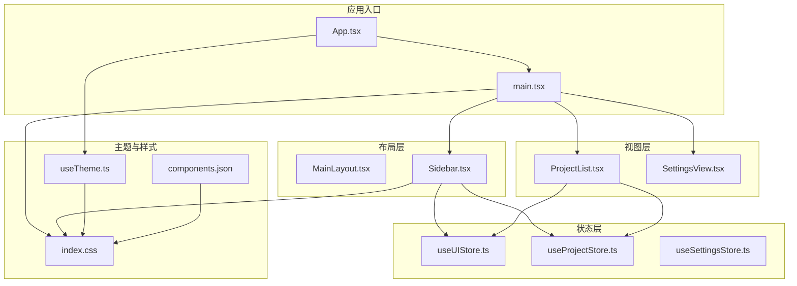
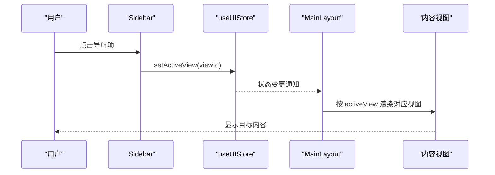
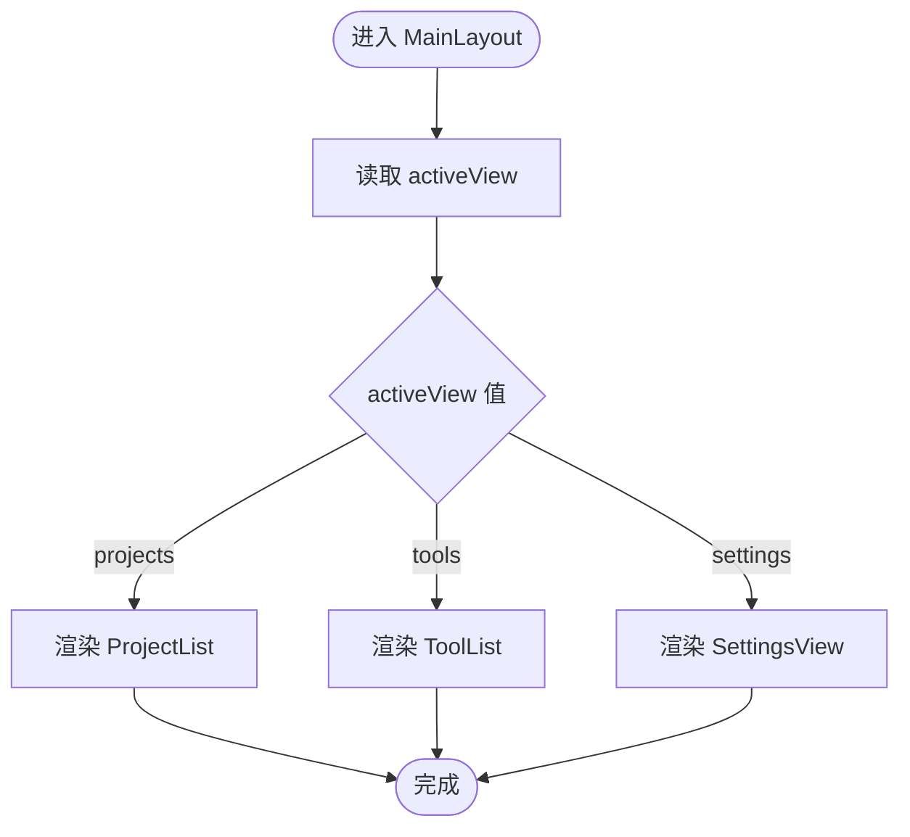
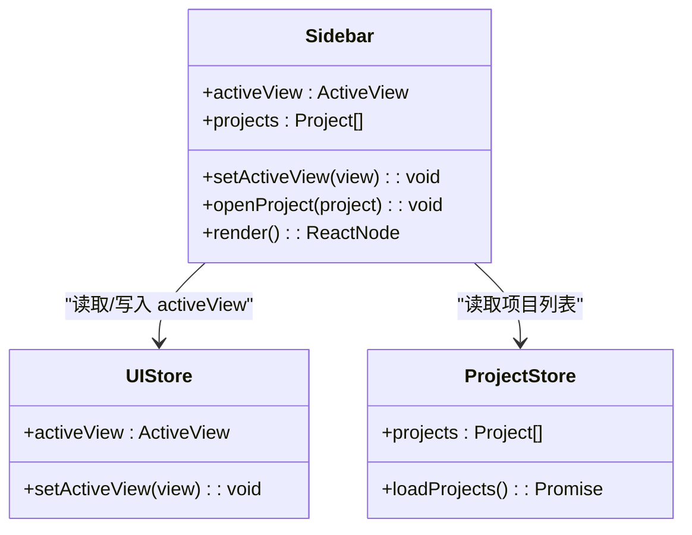
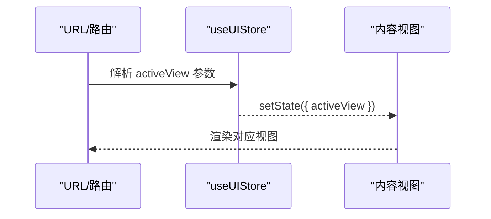
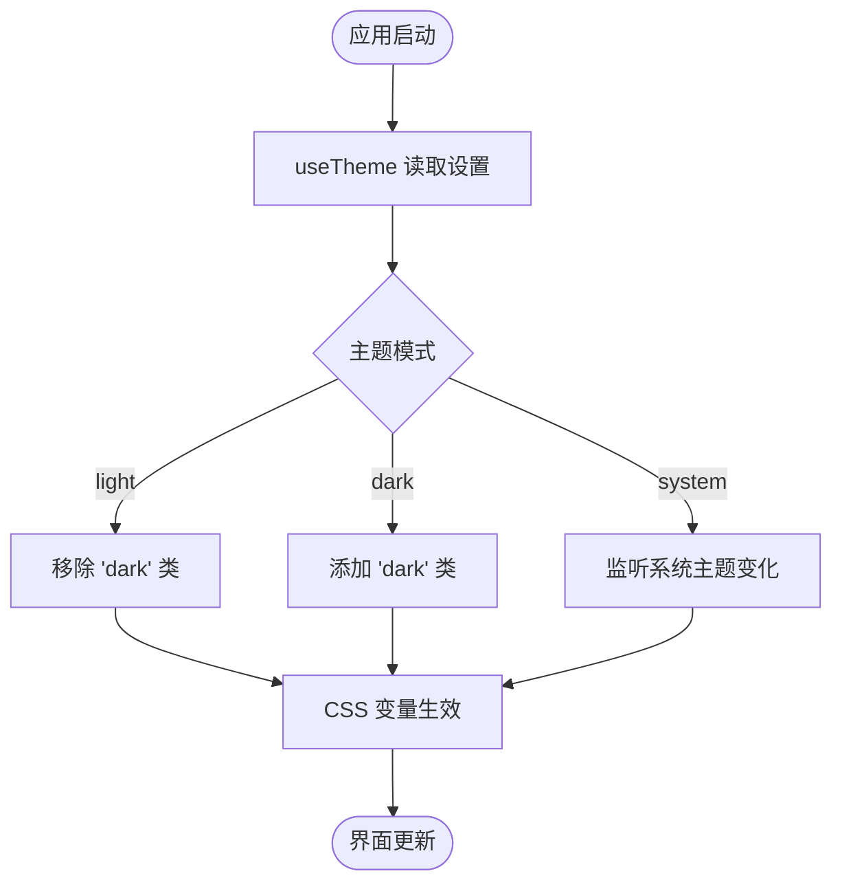
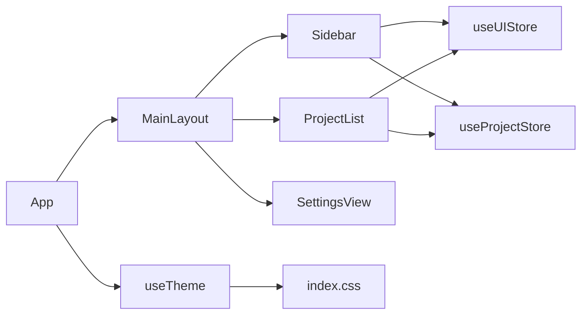

# 布局组件

<cite>
**本文引用的文件**
- [MainLayout.tsx](file://src/components/layout/MainLayout.tsx)
- [Sidebar.tsx](file://src/components/layout/Sidebar.tsx)
- [useUIStore.ts](file://src/stores/useUIStore.ts)
- [useTheme.ts](file://src/hooks/useTheme.ts)
- [index.css](file://src/index.css)
- [components.json](file://src/components.json)
- [App.tsx](file://src/App.tsx)
- [main.tsx](file://src/main.tsx)
- [ProjectList.tsx](file://src/components/project/ProjectList.tsx)
- [useProjectStore.ts](file://src/stores/useProjectStore.ts)
- [useSettingsStore.ts](file://src/stores/useSettingsStore.ts)
- [SettingsView.tsx](file://src/components/settings/SettingsView.tsx)
- [index.ts](file://src/types/index.ts)
</cite>

## 目录
1. [简介](#简介)
2. [项目结构](#项目结构)
3. [核心组件](#核心组件)
4. [架构总览](#架构总览)
5. [组件详解](#组件详解)
6. [依赖关系分析](#依赖关系分析)
7. [性能与渲染优化](#性能与渲染优化)
8. [故障排查指南](#故障排查指南)
9. [结论](#结论)
10. [附录：使用示例与最佳实践](#附录使用示例与最佳实践)

## 简介
本文件面向 LaunchPro 的布局组件，系统性阐述主布局组件与侧边栏组件的设计架构、实现原理与使用方式。重点覆盖以下方面：
- 响应式设计策略与断点配置现状
- 跨平台适配（Web/Tauri）方案
- 属性配置、插槽系统与内容区域管理
- 导航菜单的实现模式、路由集成与状态同步机制
- 自定义扩展方法与主题适配指南
- 性能优化、内存管理与渲染效率提升技巧
- 实际使用示例与常见布局场景的解决方案

## 项目结构
布局组件位于 src/components/layout 目录，采用“主布局 + 侧边栏”的双组件协作模式；全局状态通过 Zustand 管理，主题切换由自定义 Hook 驱动；Tailwind CSS 与原子化类名提供基础样式与主题变量。

图表来源
- [main.tsx:1-11](file://src/main.tsx#L1-L11)
- [App.tsx:1-40](file://src/App.tsx#L1-L40)
- [MainLayout.tsx:1-21](file://src/components/layout/MainLayout.tsx#L1-L21)
- [Sidebar.tsx:1-80](file://src/components/layout/Sidebar.tsx#L1-L80)
- [useUIStore.ts:1-33](file://src/stores/useUIStore.ts#L1-L33)
- [useProjectStore.ts:1-67](file://src/stores/useProjectStore.ts#L1-L67)
- [useSettingsStore.ts:1-34](file://src/stores/useSettingsStore.ts#L1-L34)
- [ProjectList.tsx:1-168](file://src/components/project/ProjectList.tsx#L1-L168)
- [useTheme.ts:1-37](file://src/hooks/useTheme.ts#L1-L37)
- [index.css:1-116](file://src/index.css#L1-L116)
- [components.json:1-22](file://src/components.json#L1-L22)

章节来源
- [main.tsx:1-11](file://src/main.tsx#L1-L11)
- [App.tsx:1-40](file://src/App.tsx#L1-L40)
- [MainLayout.tsx:1-21](file://src/components/layout/MainLayout.tsx#L1-L21)
- [Sidebar.tsx:1-80](file://src/components/layout/Sidebar.tsx#L1-L80)
- [index.css:1-116](file://src/index.css#L1-L116)
- [components.json:1-22](file://src/components.json#L1-L22)

## 核心组件
- 主布局组件（MainLayout）
  - 负责整体页面骨架与内容区渲染分发
  - 依据 UI 状态 activeView 渲染对应视图（项目列表、工具列表、设置）
  - 固定侧边栏宽度，内容区自适应占满剩余空间
- 侧边栏组件（Sidebar）
  - 提供导航按钮组与最近打开项目列表
  - 通过 UI 状态切换 activeView
  - 最近项目基于项目存储数据计算并展示

章节来源
- [MainLayout.tsx:7-20](file://src/components/layout/MainLayout.tsx#L7-L20)
- [Sidebar.tsx:16-79](file://src/components/layout/Sidebar.tsx#L16-L79)

## 架构总览
布局组件采用“单向数据流 + 全局状态”的模式：
- 视图层根据全局状态 activeView 决定渲染内容
- 用户交互触发 UI Store 更新，组件自动重渲染
- 主题通过 useTheme Hook 与设置存储联动，影响 CSS 变量与根元素类名

图表来源
- [Sidebar.tsx:17-44](file://src/components/layout/Sidebar.tsx#L17-L44)
- [useUIStore.ts:14-19](file://src/stores/useUIStore.ts#L14-L19)
- [MainLayout.tsx:8-17](file://src/components/layout/MainLayout.tsx#L8-L17)

## 组件详解

### 主布局组件（MainLayout）
- 结构与职责
  - 外层容器使用 Flex 布局，高度占满屏幕，溢出隐藏
  - 左侧固定宽度侧边栏，右侧内容区 flex-1 自适应
  - 依据 activeView 条件渲染项目列表、工具列表或设置视图
- 数据流
  - 从 UI Store 读取 activeView
  - 将渲染决策交给条件分支，避免额外状态管理
- 可扩展性
  - 可在内容区增加 loading 占位、错误边界或空态
  - 可引入路由集成以支持浏览器历史与分享链接

图表来源
- [MainLayout.tsx:8-17](file://src/components/layout/MainLayout.tsx#L8-L17)
- [ProjectList.tsx:12-159](file://src/components/project/ProjectList.tsx#L12-L159)

章节来源
- [MainLayout.tsx:7-20](file://src/components/layout/MainLayout.tsx#L7-L20)

### 侧边栏组件（Sidebar）
- 导航菜单
  - 定义导航项数组，包含 id、标签与图标
  - 使用按钮组件呈现，当前激活项使用 secondary 变体
  - 点击时调用 UI Store 的 setActiveView 切换视图
- 最近项目
  - 从项目存储中筛选并排序最近打开的项目
  - 使用滚动区域承载可能较多的条目
  - 点击条目触发打开项目动作（通过钩子处理）
- 样式与主题
  - 固定宽度，使用侧边栏背景色与前景色变量
  - 顶部标题与底部版本信息增强可识别性

图表来源
- [Sidebar.tsx:17-25](file://src/components/layout/Sidebar.tsx#L17-L25)
- [useUIStore.ts:4-12](file://src/stores/useUIStore.ts#L4-L12)
- [useProjectStore.ts:6-14](file://src/stores/useProjectStore.ts#L6-L14)

章节来源
- [Sidebar.tsx:10-79](file://src/components/layout/Sidebar.tsx#L10-L79)

### 状态与路由集成
- 当前状态
  - UI Store 管理 activeView、搜索查询与标签过滤等
  - 项目列表组件使用 UI Store 的搜索与标签状态进行筛选与排序
- 路由集成建议
  - 可将 activeView 映射到 URL 查询参数，实现分享与回放
  - 在浏览器前进后退时同步更新 UI Store，保持视图与地址一致
  - 为每个视图提供默认路径与 404 处理

图表来源
- [useUIStore.ts:14-19](file://src/stores/useUIStore.ts#L14-L19)
- [MainLayout.tsx:8-17](file://src/components/layout/MainLayout.tsx#L8-L17)

章节来源
- [useUIStore.ts:14-32](file://src/stores/useUIStore.ts#L14-L32)
- [ProjectList.tsx:30-55](file://src/components/project/ProjectList.tsx#L30-L55)

### 主题与跨平台适配
- 主题机制
  - useTheme Hook 读取设置存储中的主题配置
  - 根据 light/dark/system 动态切换根元素类名
  - 支持系统主题变化监听，自动同步
- 样式体系
  - index.css 定义 CSS 变量与暗色变体
  - components.json 指定 Tailwind 配置与别名
- 跨平台适配
  - Web 平台：通过 useTheme 与 CSS 变量实现主题切换
  - Tauri 平台：结合系统托盘与窗口行为，可在设置中控制是否跟随系统主题

图表来源
- [useTheme.ts:8-29](file://src/hooks/useTheme.ts#L8-L29)
- [index.css:36-64](file://src/index.css#L36-L64)
- [components.json:6-12](file://src/components.json#L6-L12)

章节来源
- [useTheme.ts:1-37](file://src/hooks/useTheme.ts#L1-L37)
- [index.css:1-116](file://src/index.css#L1-L116)
- [components.json:1-22](file://src/components.json#L1-L22)

### 插槽系统与内容区域管理
- 插槽模型
  - 当前采用“条件渲染 + 全局状态”的组合模式，未使用 React 插槽语法
  - 可通过高阶组件或自定义渲染函数扩展为更灵活的插槽接口
- 内容区域管理
  - MainLayout 的 main 区域负责承载视图组件
  - 项目列表等视图内部再细分头部、过滤器与主体区域
  - 建议为每个视图提供统一的容器与滚动区域封装

章节来源
- [MainLayout.tsx:13-17](file://src/components/layout/MainLayout.tsx#L13-L17)
- [ProjectList.tsx:66-151](file://src/components/project/ProjectList.tsx#L66-L151)

### 响应式设计与断点配置
- 现状
  - 布局采用 Flex 与固定侧边栏宽度（如 w-52），未显式声明断点
  - Tailwind 默认断点在构建产物中存在，但代码中未直接使用
- 建议
  - 为小屏设备引入折叠侧边栏或抽屉式导航
  - 使用 sm/md 断点控制侧边栏显示/隐藏与内容区布局
  - 为滚动区域与卡片容器设置合适的最小宽度与最大宽度

章节来源
- [Sidebar.tsx:28](file://src/components/layout/Sidebar.tsx#L28)
- [index.css:100-115](file://src/index.css#L100-L115)

## 依赖关系分析
- 组件间依赖
  - MainLayout 依赖 Sidebar 与三个视图组件
  - Sidebar 依赖 UI Store 与项目存储，并通过钩子打开项目
  - 项目列表组件依赖 UI Store 的搜索与标签状态
- 状态依赖
  - UI Store 作为单一事实源，被多个组件读取
  - 设置存储与主题 Hook 协同，驱动全局主题切换
- 外部依赖
  - Tailwind CSS 与 shadcn/ui 组件库
  - Radix UI 原语（如分隔线、滚动区域）

图表来源
- [MainLayout.tsx:1-5](file://src/components/layout/MainLayout.tsx#L1-L5)
- [Sidebar.tsx:1-7](file://src/components/layout/Sidebar.tsx#L1-L7)
- [ProjectList.tsx:1-10](file://src/components/project/ProjectList.tsx#L1-L10)
- [useUIStore.ts:1-12](file://src/stores/useUIStore.ts#L1-L12)
- [useProjectStore.ts:1-14](file://src/stores/useProjectStore.ts#L1-L14)
- [useTheme.ts:1-6](file://src/hooks/useTheme.ts#L1-L6)
- [index.css:1-116](file://src/index.css#L1-L116)

章节来源
- [MainLayout.tsx:1-21](file://src/components/layout/MainLayout.tsx#L1-L21)
- [Sidebar.tsx:1-80](file://src/components/layout/Sidebar.tsx#L1-L80)
- [ProjectList.tsx:1-168](file://src/components/project/ProjectList.tsx#L1-L168)
- [useUIStore.ts:1-33](file://src/stores/useUIStore.ts#L1-L33)
- [useProjectStore.ts:1-67](file://src/stores/useProjectStore.ts#L1-L67)
- [useTheme.ts:1-37](file://src/hooks/useTheme.ts#L1-L37)
- [index.css:1-116](file://src/index.css#L1-L116)

## 性能与渲染优化
- 状态粒度与订阅
  - UI Store 同时管理 activeView、搜索与标签，建议拆分为更细粒度的状态模块，降低无关重渲染
- 计算优化
  - 项目列表的过滤与排序使用 useMemo 缓存中间结果，避免每次渲染重复计算
  - 侧边栏最近项目按时间排序并限制数量，减少 DOM 节点数
- 渲染策略
  - 内容区使用滚动区域包裹，避免整页滚动
  - 条件渲染仅保留当前视图，减少不必要的组件树
- 存储与 IO
  - 项目与设置加载在应用启动阶段执行，避免阻塞主线程
  - 建议对频繁更新的操作进行节流/防抖（如搜索输入）
- 样式与主题
  - CSS 变量与根元素类名切换开销极低，无需额外优化
  - 避免在运行时频繁切换主题，尽量批量更新

章节来源
- [ProjectList.tsx:22-55](file://src/components/project/ProjectList.tsx#L22-L55)
- [Sidebar.tsx:22-25](file://src/components/layout/Sidebar.tsx#L22-L25)
- [App.tsx:26-30](file://src/App.tsx#L26-L30)

## 故障排查指南
- 视图不切换
  - 检查 UI Store 的 activeView 是否正确更新
  - 确认 Sidebar 的点击事件已绑定到 setActiveView
- 最近项目为空
  - 检查项目存储是否成功加载，lastOpened 字段是否存在
  - 确认排序逻辑与 slice 截取数量
- 主题不生效
  - 检查 useTheme 的根元素类名切换逻辑
  - 确认 CSS 变量已在 :root 与 .dark 中定义
- 滚动区域异常
  - 确保 ScrollArea 的高度约束正确（如 flex-1 与 h-full）
  - 检查容器层级与 overflow 样式

章节来源
- [useUIStore.ts:14-19](file://src/stores/useUIStore.ts#L14-L19)
- [Sidebar.tsx:22-25](file://src/components/layout/Sidebar.tsx#L22-L25)
- [useTheme.ts:8-29](file://src/hooks/useTheme.ts#L8-L29)
- [index.css:100-115](file://src/index.css#L100-L115)

## 结论
LaunchPro 的布局组件以简洁清晰的方式实现了内容区与导航区的解耦，配合全局状态与主题系统，提供了良好的可维护性与扩展性。建议后续在路由集成、响应式断点与状态拆分方面进一步完善，以支撑更复杂的业务场景与跨平台需求。

## 附录：使用示例与最佳实践
- 快速接入
  - 在应用入口渲染 MainLayout，确保主题 Hook 已初始化
  - 在 Sidebar 中新增导航项时，同步更新 UI Store 的 activeView 类型与 MainLayout 的渲染分支
- 自定义扩展
  - 新增视图：在 UI Store 中扩展状态字段，在 MainLayout 中添加渲染分支
  - 扩展侧边栏：在 Sidebar 中增加新的导航项与最近项目分组
- 主题适配
  - 通过设置视图中的按钮切换主题，useTheme 会自动更新根元素类名
  - 如需系统主题联动，确保 useTheme 的媒体查询监听正常工作
- 常见场景
  - 小屏设备：引入抽屉式侧边栏与移动端专用导航
  - 多标签过滤：在 UI Store 中扩展标签集合，项目列表中复用过滤逻辑
  - 路由集成：将 activeView 映射到 URL，实现分享与回放功能

章节来源
- [App.tsx:10-19](file://src/App.tsx#L10-L19)
- [MainLayout.tsx:8-17](file://src/components/layout/MainLayout.tsx#L8-L17)
- [Sidebar.tsx:10-14](file://src/components/layout/Sidebar.tsx#L10-L14)
- [SettingsView.tsx:41-63](file://src/components/settings/SettingsView.tsx#L41-L63)
- [index.ts:25](file://src/types/index.ts#L25)