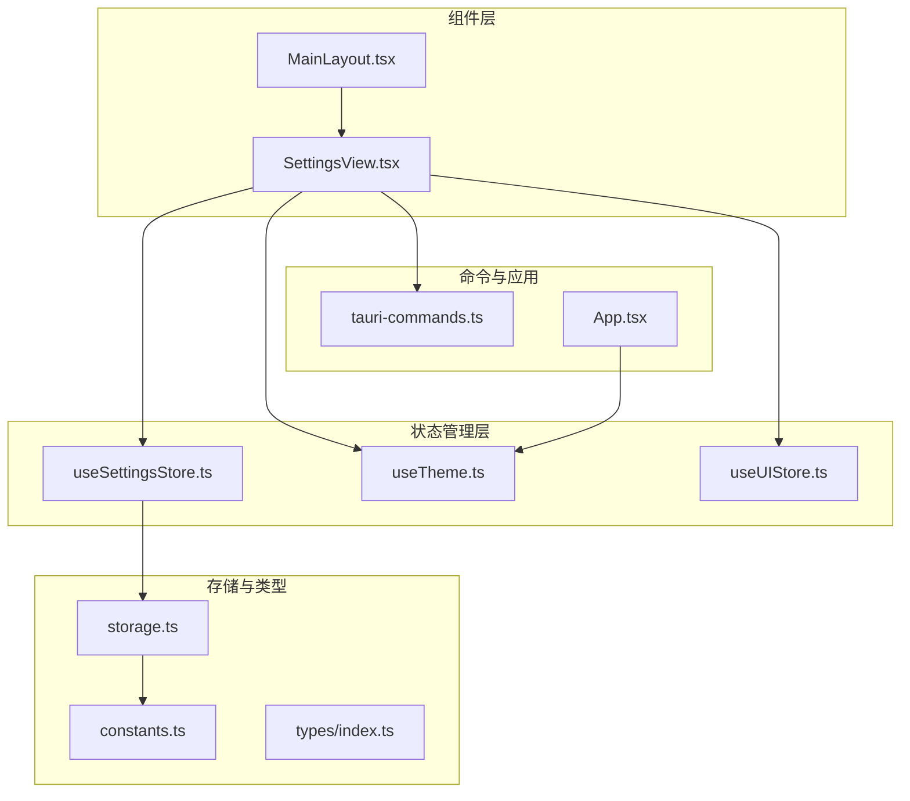
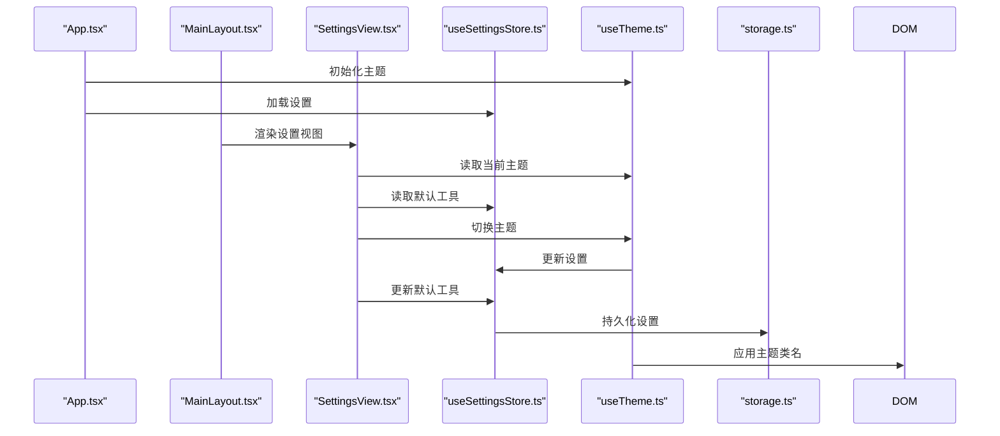
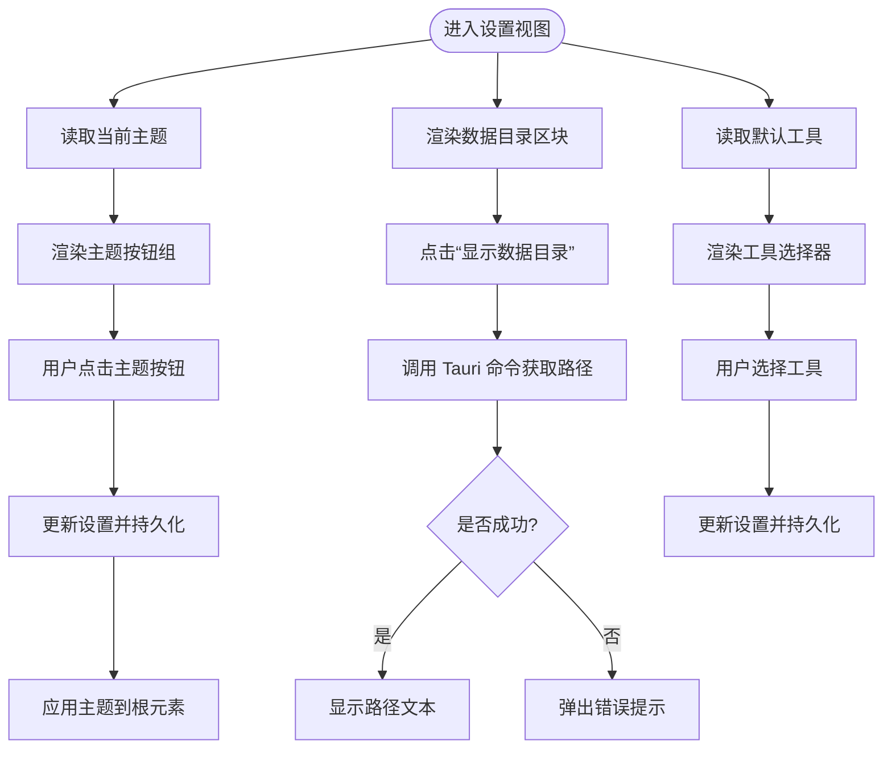
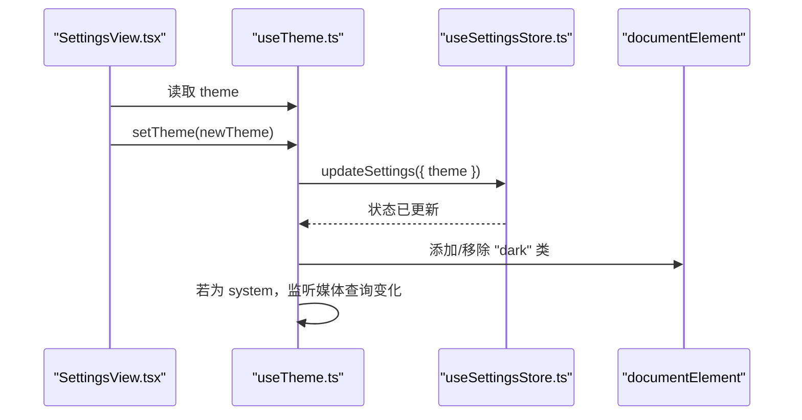
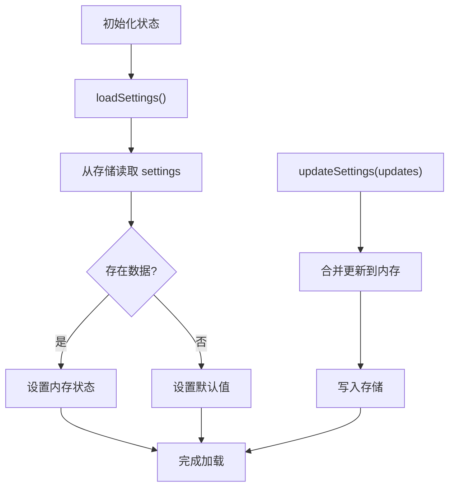
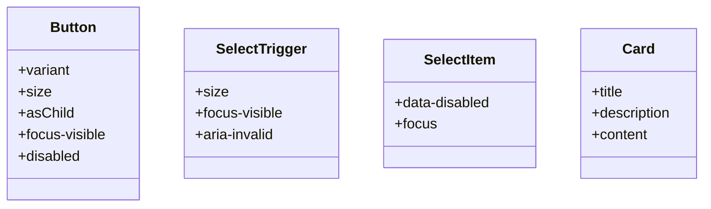
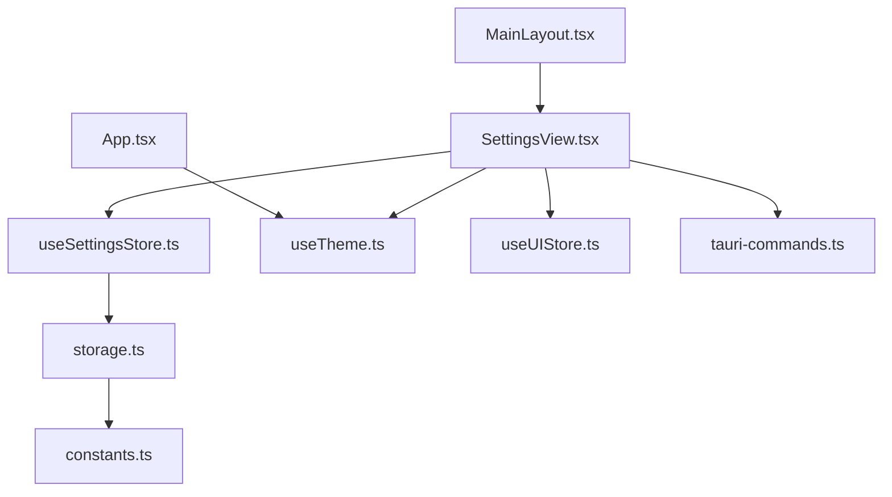

# 设置组件

<cite>
**本文引用的文件**
- [SettingsView.tsx](file://src/components/settings/SettingsView.tsx)
- [useSettingsStore.ts](file://src/stores/useSettingsStore.ts)
- [useTheme.ts](file://src/hooks/useTheme.ts)
- [storage.ts](file://src/lib/storage.ts)
- [constants.ts](file://src/lib/constants.ts)
- [index.ts](file://src/types/index.ts)
- [tauri-commands.ts](file://src/lib/tauri-commands.ts)
- [App.tsx](file://src/App.tsx)
- [MainLayout.tsx](file://src/components/layout/MainLayout.tsx)
- [useUIStore.ts](file://src/stores/useUIStore.ts)
- [button.tsx](file://src/components/ui/button.tsx)
- [select.tsx](file://src/components/ui/select.tsx)
- [card.tsx](file://src/components/ui/card.tsx)
- [desktop-schema.json](file://src-tauri/gen/schemas/desktop-schema.json)
- [macOS-schema.json](file://src-tauri/gen/schemas/macOS-schema.json)
</cite>

## 目录
1. [简介](#简介)
2. [项目结构](#项目结构)
3. [核心组件](#核心组件)
4. [架构总览](#架构总览)
5. [详细组件分析](#详细组件分析)
6. [依赖关系分析](#依赖关系分析)
7. [性能考量](#性能考量)
8. [故障排查指南](#故障排查指南)
9. [结论](#结论)
10. [附录](#附录)

## 简介
本文件系统性地记录 LaunchPro 的设置组件（SettingsView）设计与实现，覆盖以下方面：
- 设计理念：以卡片分组展示关键设置项，强调主题切换、默认工具选择与数据目录可见性
- 配置项组织：按“外观”“默认工具”“数据”三大类分组，使用卡片容器与分隔线提升可读性
- 用户界面布局：采用 Flex 布局与滚动区域，确保内容在不同窗口尺寸下可完整浏览
- 数据绑定与实时预览：通过 Zustand 状态与自定义 Hook 实现双向绑定与即时生效
- 主题切换与偏好：支持亮色、暗色与系统跟随三种模式，并自动同步到 DOM 根元素
- 语言选择与偏好：当前版本未实现语言选择功能，后续可扩展
- 导入导出与重置：基于 Tauri Store 插件能力，具备保存、加载、重置等基础能力
- 可访问性与键盘导航：UI 组件遵循可访问性规范，提供焦点可见与键盘可用性
- 扩展接口与第三方集成：通过 Store 接口与命令桥接，便于扩展新设置项与外部工具

## 项目结构
设置组件位于组件层的 settings 目录中，配合状态管理、存储与类型定义共同构成完整的设置子系统。



**图表来源**
- [SettingsView.tsx:1-111](file://src/components/settings/SettingsView.tsx#L1-L111)
- [MainLayout.tsx:1-21](file://src/components/layout/MainLayout.tsx#L1-L21)
- [useSettingsStore.ts:1-34](file://src/stores/useSettingsStore.ts#L1-L34)
- [useTheme.ts:1-37](file://src/hooks/useTheme.ts#L1-L37)
- [storage.ts:1-30](file://src/lib/storage.ts#L1-L30)
- [constants.ts:1-23](file://src/lib/constants.ts#L1-L23)
- [index.ts:1-26](file://src/types/index.ts#L1-L26)
- [tauri-commands.ts:1-17](file://src/lib/tauri-commands.ts#L1-L17)
- [App.tsx:1-40](file://src/App.tsx#L1-L40)

**章节来源**
- [SettingsView.tsx:1-111](file://src/components/settings/SettingsView.tsx#L1-L111)
- [MainLayout.tsx:1-21](file://src/components/layout/MainLayout.tsx#L1-L21)
- [App.tsx:1-40](file://src/App.tsx#L1-L40)

## 核心组件
- 设置视图组件（SettingsView）
  - 负责渲染设置页面的 UI 结构与交互
  - 提供主题切换按钮组、默认工具选择器与数据目录展示
- 设置状态存储（useSettingsStore）
  - 管理 Settings 类型的持久化状态
  - 提供加载与更新设置的方法
- 主题 Hook（useTheme）
  - 将设置中的主题值映射到 DOM 根元素的类名，实现亮/暗/系统主题切换
- 存储与常量（storage.ts、constants.ts）
  - 使用 LazyStore 对 settings.json 进行读写
  - 定义默认设置与内置工具列表
- 类型定义（types/index.ts）
  - 明确 Settings 接口字段与取值范围
- 应用入口（App.tsx）
  - 初始化主题与加载各模块数据
- 布局与路由（MainLayout.tsx、useUIStore.ts）
  - 控制设置视图在主布局中的显示与激活态

**章节来源**
- [SettingsView.tsx:19-111](file://src/components/settings/SettingsView.tsx#L19-L111)
- [useSettingsStore.ts:6-34](file://src/stores/useSettingsStore.ts#L6-L34)
- [useTheme.ts:4-37](file://src/hooks/useTheme.ts#L4-L37)
- [storage.ts:14-29](file://src/lib/storage.ts#L14-L29)
- [constants.ts:20-23](file://src/lib/constants.ts#L20-L23)
- [index.ts:20-23](file://src/types/index.ts#L20-L23)
- [App.tsx:10-37](file://src/App.tsx#L10-L37)
- [MainLayout.tsx:7-20](file://src/components/layout/MainLayout.tsx#L7-L20)
- [useUIStore.ts:4-33](file://src/stores/useUIStore.ts#L4-L33)

## 架构总览
设置组件的控制流从应用入口开始，初始化主题与加载设置；在设置视图中，用户操作触发状态更新，状态变更通过存储层持久化；主题变更通过 Hook 同步到 DOM，实现即时视觉反馈。



**图表来源**
- [App.tsx:10-37](file://src/App.tsx#L10-L37)
- [MainLayout.tsx:7-20](file://src/components/layout/MainLayout.tsx#L7-L20)
- [SettingsView.tsx:19-111](file://src/components/settings/SettingsView.tsx#L19-L111)
- [useSettingsStore.ts:17-32](file://src/stores/useSettingsStore.ts#L17-L32)
- [useTheme.ts:31-33](file://src/hooks/useTheme.ts#L31-L33)
- [storage.ts:27-29](file://src/lib/storage.ts#L27-L29)

## 详细组件分析

### 设置视图组件（SettingsView）
- 分组与布局
  - 外层采用纵向 Flex 布局，标题区与内容区分离
  - 内容区使用滚动容器，避免内容溢出
- 主题设置（外观）
  - 三个按钮分别对应 light、dark、system
  - 当前选中项以默认样式高亮
- 默认工具设置
  - 下拉选择器列出所有工具（含内置与用户自定义）
  - 支持空值（总是询问）
- 数据目录
  - 点击按钮调用 Tauri 命令获取应用数据目录路径
  - 成功后以等宽字体显示路径，失败时弹出错误提示



**图表来源**
- [SettingsView.tsx:19-111](file://src/components/settings/SettingsView.tsx#L19-L111)
- [tauri-commands.ts:14-16](file://src/lib/tauri-commands.ts#L14-L16)
- [useSettingsStore.ts:27-32](file://src/stores/useSettingsStore.ts#L27-L32)
- [useTheme.ts:31-33](file://src/hooks/useTheme.ts#L31-L33)

**章节来源**
- [SettingsView.tsx:35-106](file://src/components/settings/SettingsView.tsx#L35-L106)
- [tauri-commands.ts:14-16](file://src/lib/tauri-commands.ts#L14-L16)

### 主题切换机制（useTheme）
- 读取设置中的 theme 字段
- 根据值动态添加或移除 DOM 根元素的 dark 类
- 当为 system 模式时，监听系统配色方案变化并自动切换
- 提供 setTheme 方法用于更新设置



**图表来源**
- [useTheme.ts:4-37](file://src/hooks/useTheme.ts#L4-L37)
- [useSettingsStore.ts:27-32](file://src/stores/useSettingsStore.ts#L27-L32)

**章节来源**
- [useTheme.ts:8-29](file://src/hooks/useTheme.ts#L8-L29)
- [useTheme.ts:31-33](file://src/hooks/useTheme.ts#L31-L33)

### 设置状态管理（useSettingsStore）
- 初始状态：默认设置来自常量
- 加载流程：从 LazyStore 中读取 settings 键，若不存在则回退到默认值
- 更新流程：合并传入的更新对象，先更新内存状态，再异步写入存储



**图表来源**
- [useSettingsStore.ts:17-32](file://src/stores/useSettingsStore.ts#L17-L32)
- [storage.ts:27-29](file://src/lib/storage.ts#L27-L29)

**章节来源**
- [useSettingsStore.ts:13-33](file://src/stores/useSettingsStore.ts#L13-L33)

### 存储与权限（storage.ts、desktop-schema.json、macOS-schema.json）
- 存储层
  - settings.json 使用 LazyStore，默认值来自 DEFAULT_SETTINGS
  - 自动保存开启，保证每次更新立即落盘
- 权限模型
  - Tauri Store 插件默认允许多种操作（set、get、save、reset 等）
  - 可根据需要收紧权限，但当前配置为默认宽松策略

```mermaid
graph LR
Store["LazyStore(settings.json)"] <- --> Def["DEFAULT_SETTINGS"]
Store <- --> Perm["Tauri Store 权限"]
Perm --> AllowSet["允许 set"]
Perm --> AllowGet["允许 get"]
Perm --> AllowSave["允许 save"]
Perm --> AllowReset["允许 reset"]
```

**图表来源**
- [storage.ts:14-17](file://src/lib/storage.ts#L14-L17)
- [constants.ts:20-23](file://src/lib/constants.ts#L20-L23)
- [desktop-schema.json:2491-2570](file://src-tauri/gen/schemas/desktop-schema.json#L2491-L2570)
- [macOS-schema.json:2491-2570](file://src-tauri/gen/schemas/macOS-schema.json#L2491-L2570)

**章节来源**
- [storage.ts:14-29](file://src/lib/storage.ts#L14-L29)
- [desktop-schema.json:2491-2570](file://src-tauri/gen/schemas/desktop-schema.json#L2491-L2570)
- [macOS-schema.json:2491-2570](file://src-tauri/gen/schemas/macOS-schema.json#L2491-L2570)

### UI 组件与可访问性
- 按钮（Button）
  - 支持多种变体与尺寸，提供焦点可见边框与禁用态样式
  - 适配暗色模式与无效状态的视觉反馈
- 选择器（Select）
  - 触发器与选项均具备焦点与悬停状态
  - 支持滚动按钮与占位符文本
- 卡片（Card）
  - 提供标题、描述、内容与脚注区域，统一间距与阴影



**图表来源**
- [button.tsx:41-62](file://src/components/ui/button.tsx#L41-L62)
- [select.tsx:27-50](file://src/components/ui/select.tsx#L27-L50)
- [select.tsx:103-127](file://src/components/ui/select.tsx#L103-L127)
- [card.tsx:5-16](file://src/components/ui/card.tsx#L5-L16)

**章节来源**
- [button.tsx:7-38](file://src/components/ui/button.tsx#L7-L38)
- [select.tsx:9-88](file://src/components/ui/select.tsx#L9-L88)
- [card.tsx:5-82](file://src/components/ui/card.tsx#L5-L82)

## 依赖关系分析
设置组件的耦合与协作关系如下：



**图表来源**
- [SettingsView.tsx:12-24](file://src/components/settings/SettingsView.tsx#L12-L24)
- [useSettingsStore.ts:3-4](file://src/stores/useSettingsStore.ts#L3-L4)
- [storage.ts:27-29](file://src/lib/storage.ts#L27-L29)
- [App.tsx:11](file://src/App.tsx#L11)
- [MainLayout.tsx:16](file://src/components/layout/MainLayout.tsx#L16)

**章节来源**
- [SettingsView.tsx:12-24](file://src/components/settings/SettingsView.tsx#L12-L24)
- [useSettingsStore.ts:3-4](file://src/stores/useSettingsStore.ts#L3-L4)
- [storage.ts:27-29](file://src/lib/storage.ts#L27-L29)
- [App.tsx:11](file://src/App.tsx#L11)
- [MainLayout.tsx:16](file://src/components/layout/MainLayout.tsx#L16)

## 性能考量
- 状态粒度
  - SettingsStore 以整份设置对象进行更新与持久化，简单直接，适合小体量配置
- 存储策略
  - LazyStore 自动保存减少手动调用开销，但频繁更新仍会产生 I/O 压力
- 主题切换
  - 仅修改根元素类名，开销极低
- 建议
  - 对于高频变更的设置项，可考虑拆分键空间或节流写入
  - 在应用启动阶段批量加载设置，避免多次 I/O

[本节为通用建议，无需特定文件来源]

## 故障排查指南
- 主题不生效
  - 检查 useTheme 是否被正确初始化（应用入口）
  - 确认 DOM 根元素是否存在 dark 类
- 设置未持久化
  - 确认 LazyStore 已初始化且权限允许 set/get/save/reset
  - 查看存储文件是否存在与可写
- 数据目录按钮无响应
  - 检查 Tauri 命令注册与权限配置
  - 关注错误提示与日志输出

**章节来源**
- [useTheme.ts:8-29](file://src/hooks/useTheme.ts#L8-L29)
- [storage.ts:27-29](file://src/lib/storage.ts#L27-L29)
- [tauri-commands.ts:14-16](file://src/lib/tauri-commands.ts#L14-L16)

## 结论
设置组件以简洁的卡片分组与直观的交互实现了核心偏好管理：主题切换、默认工具选择与数据目录可见性。其状态管理与存储层结合 Tauri Store 插件，提供了可靠的持久化能力。未来可在语言选择、导入导出、设置重置与版本兼容性等方面进一步扩展，同时保持现有 UI 的可访问性与一致性。

[本节为总结，无需特定文件来源]

## 附录

### 设置项清单与说明
- 主题（theme）
  - 取值：light | dark | system
  - 影响：根元素类名切换
- 默认工具（defaultTool）
  - 取值：工具 ID 或空值
  - 影响：打开项目时的默认 IDE/工具选择

**章节来源**
- [index.ts:20-23](file://src/types/index.ts#L20-L23)
- [constants.ts:20-23](file://src/lib/constants.ts#L20-L23)

### 可访问性与键盘导航要点
- 按钮与选择器均支持键盘聚焦与交互
- 焦点可见边框与禁用态样式符合 WCAG 基本要求
- 建议后续补充 ARIA 属性与屏幕阅读器提示

**章节来源**
- [button.tsx:8](file://src/components/ui/button.tsx#L8)
- [select.tsx:40](file://src/components/ui/select.tsx#L40)

### 扩展接口与第三方集成
- 新增设置项
  - 在 Settings 接口中添加字段
  - 在 SettingsView 中增加对应的 UI 控件
  - 在 useSettingsStore.updateSettings 中处理持久化
- 第三方工具集成
  - 通过工具存储与命令桥接，扩展工具列表与打开行为
  - 注意权限与路径校验

**章节来源**
- [index.ts:20-23](file://src/types/index.ts#L20-L23)
- [SettingsView.tsx:71-88](file://src/components/settings/SettingsView.tsx#L71-L88)
- [useSettingsStore.ts:27-32](file://src/stores/useSettingsStore.ts#L27-L32)