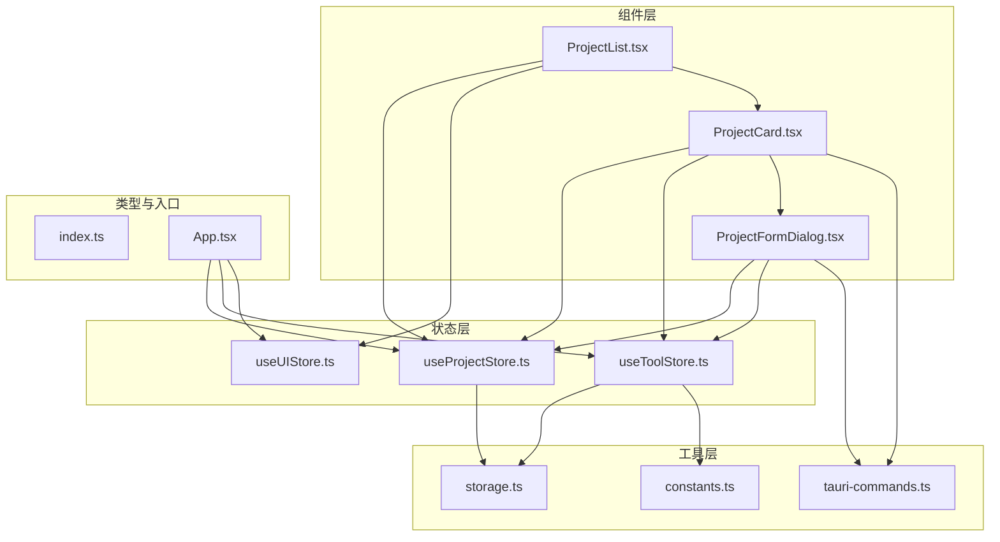
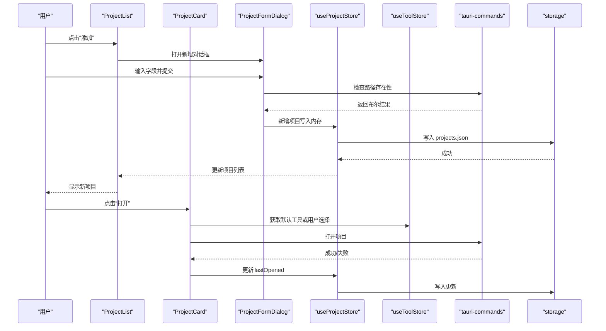
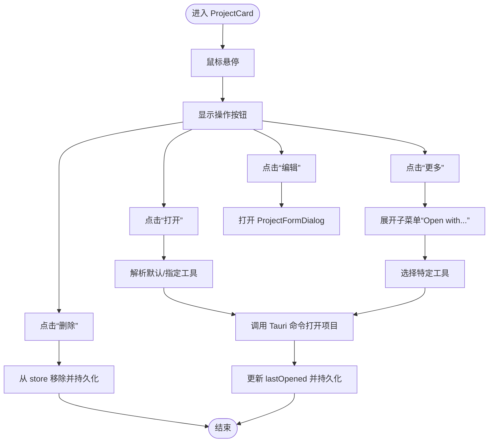
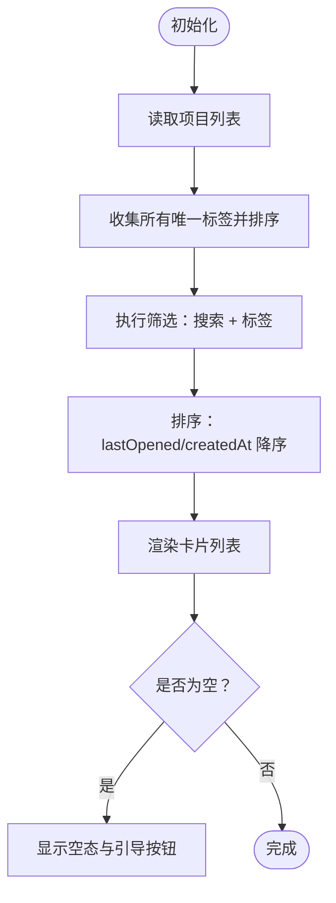
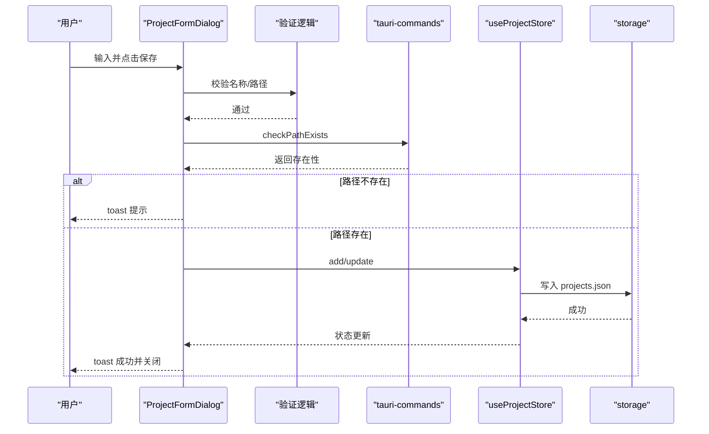
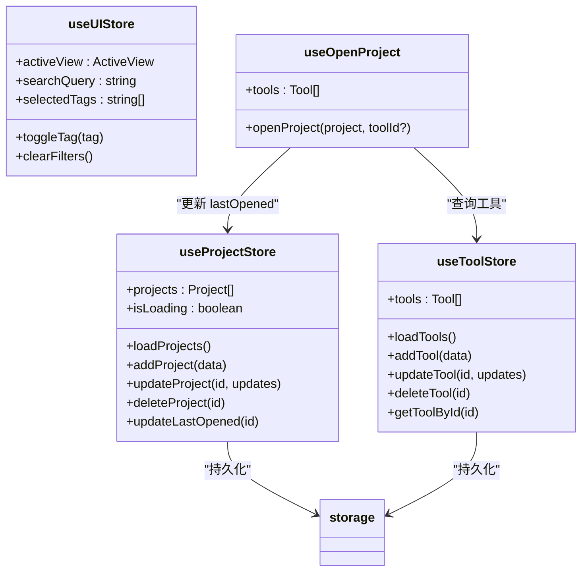
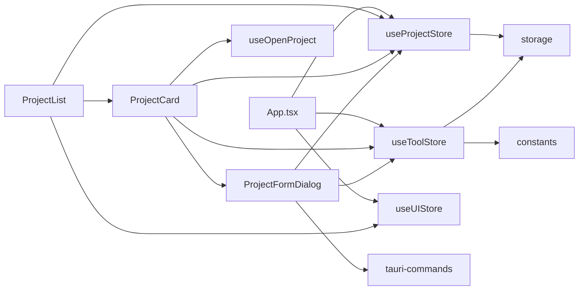

# 项目管理组件

<cite>
**本文引用的文件**
- [ProjectCard.tsx](file://src/components/project/ProjectCard.tsx)
- [ProjectList.tsx](file://src/components/project/ProjectList.tsx)
- [ProjectFormDialog.tsx](file://src/components/project/ProjectFormDialog.tsx)
- [useProjectStore.ts](file://src/stores/useProjectStore.ts)
- [useUIStore.ts](file://src/stores/useUIStore.ts)
- [useToolStore.ts](file://src/stores/useToolStore.ts)
- [useOpenProject.ts](file://src/hooks/useOpenProject.ts)
- [tauri-commands.ts](file://src/lib/tauri-commands.ts)
- [constants.ts](file://src/lib/constants.ts)
- [storage.ts](file://src/lib/storage.ts)
- [index.ts](file://src/types/index.ts)
- [card.tsx](file://src/components/ui/card.tsx)
- [dialog.tsx](file://src/components/ui/dialog.tsx)
- [App.tsx](file://src/App.tsx)
</cite>

## 目录
1. [简介](#简介)
2. [项目结构](#项目结构)
3. [核心组件](#核心组件)
4. [架构总览](#架构总览)
5. [详细组件分析](#详细组件分析)
6. [依赖关系分析](#依赖关系分析)
7. [性能考量](#性能考量)
8. [故障排查指南](#故障排查指南)
9. [结论](#结论)
10. [附录](#附录)

## 简介
本文件系统性地记录 LaunchPro 中“项目管理”组件的设计与实现，覆盖以下方面：
- 项目卡片（ProjectCard）：视觉设计、信息展示、操作按钮与交互逻辑
- 项目列表（ProjectList）：排序、筛选、分页与加载态处理
- 项目表单对话框（ProjectFormDialog）：验证规则、数据持久化与错误处理
- 数据绑定与状态管理：Zustand store、UI store、工具与设置集成
- 可访问性与键盘支持：基于 Radix UI 和 Tooltip 的无障碍能力
- 批量操作与扩展：当前未实现批量删除/编辑，但具备扩展基础

## 项目结构
项目管理组件位于 src/components/project 下，配合多个 store、hooks、lib 工具与类型定义共同工作：
- 组件层：ProjectCard、ProjectList、ProjectFormDialog
- 状态层：useProjectStore、useUIStore、useToolStore
- 工具层：tauri-commands、storage、constants
- 类型层：index.ts 定义 Project、Tool、Settings 等接口
- UI 基础：card.tsx、dialog.tsx 提供卡片与对话框基础样式

图表来源
- [ProjectCard.tsx:1-174](file://src/components/project/ProjectCard.tsx#L1-L174)
- [ProjectList.tsx:1-168](file://src/components/project/ProjectList.tsx#L1-L168)
- [ProjectFormDialog.tsx:1-229](file://src/components/project/ProjectFormDialog.tsx#L1-L229)
- [useProjectStore.ts:1-67](file://src/stores/useProjectStore.ts#L1-L67)
- [useUIStore.ts:1-33](file://src/stores/useUIStore.ts#L1-L33)
- [useToolStore.ts:1-75](file://src/stores/useToolStore.ts#L1-L75)
- [tauri-commands.ts:1-17](file://src/lib/tauri-commands.ts#L1-L17)
- [storage.ts:1-30](file://src/lib/storage.ts#L1-L30)
- [constants.ts:1-23](file://src/lib/constants.ts#L1-L23)
- [index.ts:1-26](file://src/types/index.ts#L1-L26)
- [App.tsx:1-40](file://src/App.tsx#L1-L40)

章节来源
- [ProjectCard.tsx:1-174](file://src/components/project/ProjectCard.tsx#L1-L174)
- [ProjectList.tsx:1-168](file://src/components/project/ProjectList.tsx#L1-L168)
- [ProjectFormDialog.tsx:1-229](file://src/components/project/ProjectFormDialog.tsx#L1-L229)
- [useProjectStore.ts:1-67](file://src/stores/useProjectStore.ts#L1-L67)
- [useUIStore.ts:1-33](file://src/stores/useUIStore.ts#L1-L33)
- [useToolStore.ts:1-75](file://src/stores/useToolStore.ts#L1-L75)
- [tauri-commands.ts:1-17](file://src/lib/tauri-commands.ts#L1-L17)
- [storage.ts:1-30](file://src/lib/storage.ts#L1-L30)
- [constants.ts:1-23](file://src/lib/constants.ts#L1-L23)
- [index.ts:1-26](file://src/types/index.ts#L1-L26)
- [App.tsx:1-40](file://src/App.tsx#L1-L40)

## 核心组件
- 项目卡片（ProjectCard）
  - 展示项目名称、路径、标签、最近打开时间等信息
  - 悬停显示操作按钮：打开、更多菜单（子菜单支持选择工具）
  - 支持编辑弹窗与删除操作
- 项目列表（ProjectList）
  - 提供搜索框、标签过滤器、添加按钮
  - 内置排序：按 lastOpened 或 createdAt 降序
  - 加载态与空态处理
- 项目表单对话框（ProjectFormDialog）
  - 名称、路径、标签、默认工具、备注字段
  - 路径选择器、路径存在性校验、提交流程与错误提示

章节来源
- [ProjectCard.tsx:27-161](file://src/components/project/ProjectCard.tsx#L27-L161)
- [ProjectList.tsx:12-159](file://src/components/project/ProjectList.tsx#L12-L159)
- [ProjectFormDialog.tsx:33-228](file://src/components/project/ProjectFormDialog.tsx#L33-L228)

## 架构总览
项目管理组件采用“组件 + Zustand Store + Tauri 命令”的分层架构：
- 组件负责 UI 渲染与用户交互
- Zustand Store 管理应用状态与持久化
- Tauri 命令桥接前端与后端（如路径检查、打开项目）

图表来源
- [ProjectList.tsx:20-21](file://src/components/project/ProjectList.tsx#L20-L21)
- [ProjectCard.tsx:28-32](file://src/components/project/ProjectCard.tsx#L28-L32)
- [ProjectFormDialog.tsx:84-134](file://src/components/project/ProjectFormDialog.tsx#L84-L134)
- [useProjectStore.ts:30-40](file://src/stores/useProjectStore.ts#L30-L40)
- [useToolStore.ts:17-39](file://src/stores/useToolStore.ts#L17-L39)
- [tauri-commands.ts:3-12](file://src/lib/tauri-commands.ts#L3-L12)
- [storage.ts:19-21](file://src/lib/storage.ts#L19-L21)

## 详细组件分析

### 项目卡片（ProjectCard）
- 视觉设计
  - 使用 Card 组件作为容器，悬停时背景色轻微变化
  - 左侧首字母徽标，右侧内容区包含名称、默认工具徽章、路径、标签与相对时间
  - 操作区域在组悬停时渐显，包含“打开”和“更多”按钮
- 信息展示
  - 名称：截断显示
  - 路径：短路径显示与 Tooltip 全路径提示
  - 标签：Badge 列表，支持多标签
  - 最近打开时间：相对时间格式化
- 操作按钮
  - 打开：调用 useOpenProject 打开项目
  - 更多：下拉菜单，子菜单“Open with...”列出所有工具
  - 编辑：打开 ProjectFormDialog 进行修改
  - 删除：调用 useProjectStore.deleteProject

图表来源
- [ProjectCard.tsx:27-161](file://src/components/project/ProjectCard.tsx#L27-L161)
- [useOpenProject.ts:15-42](file://src/hooks/useOpenProject.ts#L15-L42)
- [useProjectStore.ts:51-56](file://src/stores/useProjectStore.ts#L51-L56)

章节来源
- [ProjectCard.tsx:27-161](file://src/components/project/ProjectCard.tsx#L27-L161)
- [card.tsx:5-16](file://src/components/ui/card.tsx#L5-L16)

### 项目列表（ProjectList）
- 排序
  - 默认按 lastOpened 降序；若无 lastOpened，则按 createdAt 降序
- 筛选
  - 搜索查询：同时匹配名称、路径、标签
  - 标签过滤：UIStore.selectedTags 控制过滤逻辑
- 分页
  - 当前未实现分页，全部项目一次性渲染
- 加载与空态
  - isLoading 时显示加载文案
  - 无项目时提供引导添加按钮
  - 有项目但无匹配时显示“无匹配”提示

图表来源
- [ProjectList.tsx:13-55](file://src/components/project/ProjectList.tsx#L13-L55)
- [useUIStore.ts:22-31](file://src/stores/useUIStore.ts#L22-L31)

章节来源
- [ProjectList.tsx:12-159](file://src/components/project/ProjectList.tsx#L12-L159)
- [useUIStore.ts:14-32](file://src/stores/useUIStore.ts#L14-L32)

### 项目表单对话框（ProjectFormDialog）
- 字段与验证
  - 名称：必填
  - 路径：必填且需存在
  - 标签：逗号分隔字符串转数组
  - 默认工具：可选
  - 备注：可选
- 数据持久化
  - 新增：生成 id 与 createdAt，写入 projects.json
  - 修改：按 id 合并更新，写入 projects.json
- 错误处理
  - 路径不存在：toast 提示
  - Tauri 调用异常：toast 提示
  - 成功：toast 提示并关闭对话框

图表来源
- [ProjectFormDialog.tsx:84-134](file://src/components/project/ProjectFormDialog.tsx#L84-L134)
- [tauri-commands.ts:10-12](file://src/lib/tauri-commands.ts#L10-L12)
- [useProjectStore.ts:30-49](file://src/stores/useProjectStore.ts#L30-L49)
- [storage.ts:19-21](file://src/lib/storage.ts#L19-L21)

章节来源
- [ProjectFormDialog.tsx:33-228](file://src/components/project/ProjectFormDialog.tsx#L33-L228)

### 状态管理与数据绑定
- useProjectStore
  - 负责项目列表的加载、新增、更新、删除、最后打开时间更新
  - 通过 LazyStore 将 projects 写入本地 JSON 文件
- useToolStore
  - 负责工具列表的加载、合并内置工具与用户自定义工具
  - 提供 getToolById 查询工具
- useUIStore
  - 维护搜索关键词与标签过滤集合
  - 提供切换标签与清空过滤的方法
- useOpenProject
  - 解析工具优先级（传入 > 项目默认 > 设置全局默认）
  - 调用 Tauri 命令打开项目并更新 lastOpened

图表来源
- [useProjectStore.ts:16-66](file://src/stores/useProjectStore.ts#L16-L66)
- [useToolStore.ts:17-74](file://src/stores/useToolStore.ts#L17-L74)
- [useUIStore.ts:14-32](file://src/stores/useUIStore.ts#L14-L32)
- [useOpenProject.ts:9-43](file://src/hooks/useOpenProject.ts#L9-L43)
- [storage.ts:19-29](file://src/lib/storage.ts#L19-L29)

章节来源
- [useProjectStore.ts:1-67](file://src/stores/useProjectStore.ts#L1-L67)
- [useToolStore.ts:1-75](file://src/stores/useToolStore.ts#L1-L75)
- [useUIStore.ts:1-33](file://src/stores/useUIStore.ts#L1-L33)
- [useOpenProject.ts:1-44](file://src/hooks/useOpenProject.ts#L1-L44)

## 依赖关系分析
- 组件间耦合
  - ProjectList 依赖 useProjectStore、useUIStore、ProjectCard
  - ProjectCard 依赖 useOpenProject、useProjectStore、useToolStore、ProjectFormDialog
  - ProjectFormDialog 依赖 useProjectStore、useToolStore、tauri-commands
- 外部依赖
  - Tauri 插件：@tauri-apps/plugin-dialog、@tauri-apps/plugin-store
  - UI 库：Radix UI（Dialog）、Lucide 图标库
- 数据流
  - 读取：App 初始化时加载工具、项目、设置
  - 写入：表单提交与卡片操作触发 store 更新并持久化

图表来源
- [App.tsx:21-30](file://src/App.tsx#L21-L30)
- [ProjectList.tsx:13-20](file://src/components/project/ProjectList.tsx#L13-L20)
- [ProjectCard.tsx:17-32](file://src/components/project/ProjectCard.tsx#L17-L32)
- [ProjectFormDialog.tsx:20-36](file://src/components/project/ProjectFormDialog.tsx#L20-L36)
- [useProjectStore.ts:3-4](file://src/stores/useProjectStore.ts#L3-L4)
- [useToolStore.ts:3-5](file://src/stores/useToolStore.ts#L3-L5)
- [constants.ts:3-18](file://src/lib/constants.ts#L3-L18)
- [storage.ts:4-17](file://src/lib/storage.ts#L4-L17)

章节来源
- [App.tsx:1-40](file://src/App.tsx#L1-L40)
- [ProjectList.tsx:1-168](file://src/components/project/ProjectList.tsx#L1-L168)
- [ProjectCard.tsx:1-174](file://src/components/project/ProjectCard.tsx#L1-L174)
- [ProjectFormDialog.tsx:1-229](file://src/components/project/ProjectFormDialog.tsx#L1-L229)

## 性能考量
- 计算优化
  - ProjectList 使用 useMemo 对标签收集、过滤与排序进行缓存，避免重复计算
- 渲染优化
  - 使用 ScrollArea 包裹列表，仅滚动区域重绘
  - 卡片内操作按钮仅在悬停时可见，减少常驻 DOM
- I/O 优化
  - 通过 LazyStore 自动保存，减少手动写入开销
- 可扩展建议
  - 列表分页：在大数据集时引入虚拟滚动或分页
  - 搜索去抖：对搜索输入增加防抖以降低频繁过滤成本
  - 工具加载合并：确保工具列表只在必要时重新合并

## 故障排查指南
- 无法打开项目
  - 检查工具是否存在且非内置不可删除
  - 确认默认工具或用户选择的工具命令模板正确
  - 查看 toast 错误提示与 Tauri 命令返回值
- 路径不存在
  - 确认路径存在且为目录
  - 使用“浏览”按钮选择有效路径
- 项目未保存
  - 确认 projects.json 是否成功写入
  - 检查 LazyStore 初始化与权限
- UI 不响应
  - 确保 TooltipProvider 已包裹应用根节点
  - 检查对话框是否被外部遮挡

章节来源
- [useOpenProject.ts:15-42](file://src/hooks/useOpenProject.ts#L15-L42)
- [ProjectFormDialog.tsx:84-134](file://src/components/project/ProjectFormDialog.tsx#L84-L134)
- [tauri-commands.ts:3-12](file://src/lib/tauri-commands.ts#L3-L12)
- [storage.ts:19-21](file://src/lib/storage.ts#L19-L21)
- [App.tsx:33-36](file://src/App.tsx#L33-L36)

## 结论
项目管理组件以清晰的分层设计实现了完整的 CRUD 流程与良好的用户体验：
- 项目卡片聚焦信息密度与操作便捷性
- 项目列表提供强大的筛选与排序能力
- 项目表单对话框具备完善的验证与持久化策略
- 状态管理与 Tauri 命令桥接保证了数据一致性与跨平台能力
未来可在分页、批量操作、键盘快捷键等方面进一步增强可用性与可访问性。

## 附录
- 实际使用场景示例（路径指引）
  - 新建项目：点击 ProjectList 顶部“添加”，填写表单并提交
  - 打开项目：在 ProjectCard 上点击“打开”或“更多/Open with...”
  - 编辑项目：点击“更多/编辑”，修改后保存
  - 删除项目：点击“更多/删除”，确认后移除
- 最佳实践
  - 保持路径与标签的一致性，便于后续筛选
  - 为常用项目设置默认工具，提升打开效率
  - 使用标签对项目进行分类管理