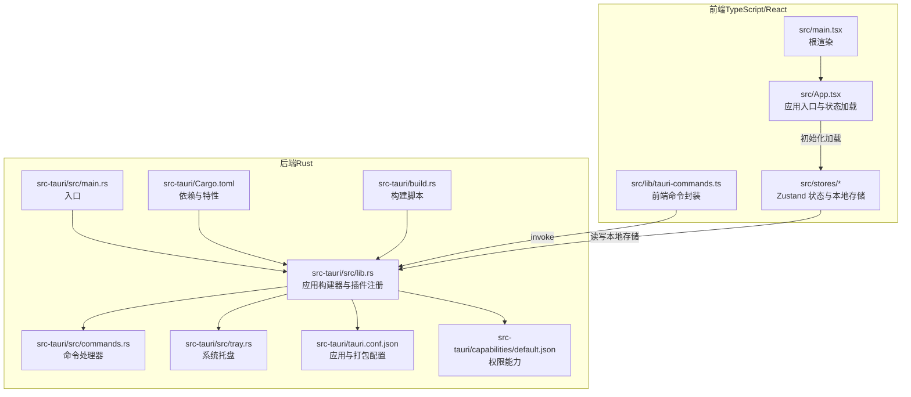
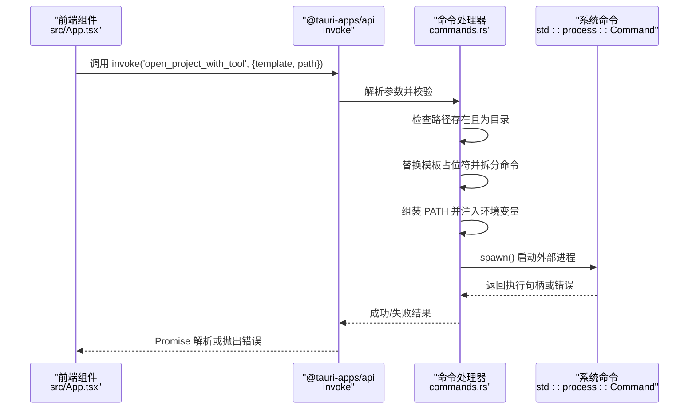
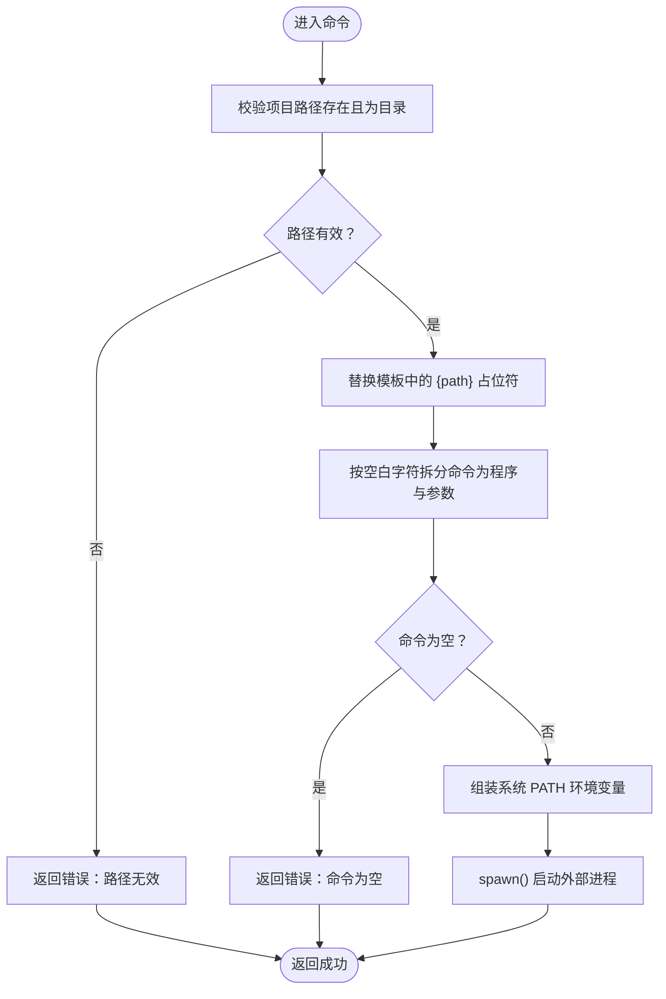
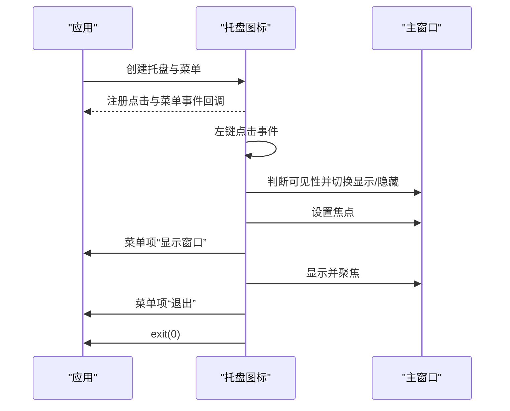
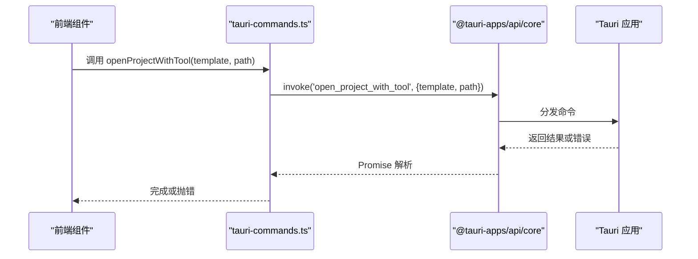
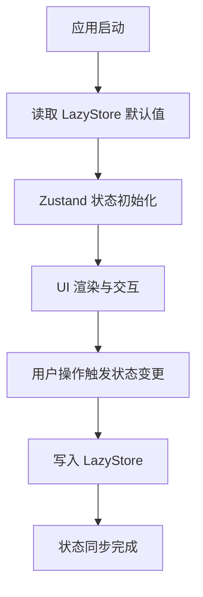
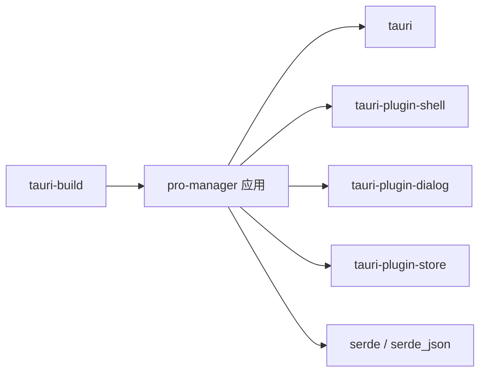

# 后端服务

<cite>
**本文引用的文件**
- [src-tauri/src/main.rs](file://src-tauri/src/main.rs)
- [src-tauri/src/lib.rs](file://src-tauri/src/lib.rs)
- [src-tauri/src/commands.rs](file://src-tauri/src/commands.rs)
- [src-tauri/src/tray.rs](file://src-tauri/src/tray.rs)
- [src-tauri/Cargo.toml](file://src-tauri/Cargo.toml)
- [src-tauri/tauri.conf.json](file://src-tauri/tauri.conf.json)
- [src-tauri/capabilities/default.json](file://src-tauri/capabilities/default.json)
- [src/lib/tauri-commands.ts](file://src/lib/tauri-commands.ts)
- [src-tauri/build.rs](file://src-tauri/build.rs)
- [src/lib/storage.ts](file://src/lib/storage.ts)
- [src/stores/useProjectStore.ts](file://src/stores/useProjectStore.ts)
- [src/stores/useToolStore.ts](file://src/stores/useToolStore.ts)
- [src/App.tsx](file://src/App.tsx)
- [src/main.tsx](file://src/main.tsx)
</cite>

## 目录
1. [简介](#简介)
2. [项目结构](#项目结构)
3. [核心组件](#核心组件)
4. [架构总览](#架构总览)
5. [详细组件分析](#详细组件分析)
6. [依赖关系分析](#依赖关系分析)
7. [性能考量](#性能考量)
8. [故障排查指南](#故障排查指南)
9. [结论](#结论)
10. [附录](#附录)

## 简介
本文件面向 LaunchPro 的后端服务（Rust + Tauri v2），系统性阐述其架构设计、命令处理器工作原理、系统托盘实现、进程启动与环境变量处理、错误处理与日志策略、前后端通信协议、性能与资源管理、以及安全与权限控制。目标是帮助开发者快速理解并扩展该桌面应用的后端能力。

## 项目结构
后端位于 src-tauri 目录，采用典型的 Tauri v2 结构：入口程序负责初始化应用、注册插件与命令、设置窗口事件与托盘；命令模块提供业务逻辑；托盘模块负责系统托盘图标、菜单与事件绑定；配置文件定义构建、打包与权限能力；前端通过 @tauri-apps/api 调用后端命令。

图表来源
- [src-tauri/src/main.rs:1-7](file://src-tauri/src/main.rs#L1-L7)
- [src-tauri/src/lib.rs:1-28](file://src-tauri/src/lib.rs#L1-L28)
- [src-tauri/src/commands.rs:1-95](file://src-tauri/src/commands.rs#L1-L95)
- [src-tauri/src/tray.rs:1-58](file://src-tauri/src/tray.rs#L1-L58)
- [src-tauri/Cargo.toml:1-22](file://src-tauri/Cargo.toml#L1-L22)
- [src-tauri/tauri.conf.json:1-44](file://src-tauri/tauri.conf.json#L1-L44)
- [src-tauri/capabilities/default.json:1-18](file://src-tauri/capabilities/default.json#L1-L18)
- [src-tauri/build.rs:1-4](file://src-tauri/build.rs#L1-L4)
- [src/App.tsx:1-40](file://src/App.tsx#L1-L40)
- [src/main.tsx:1-11](file://src/main.tsx#L1-L11)
- [src/lib/tauri-commands.ts:1-17](file://src/lib/tauri-commands.ts#L1-L17)
- [src/lib/storage.ts:1-30](file://src/lib/storage.ts#L1-L30)
- [src/stores/useProjectStore.ts:1-67](file://src/stores/useProjectStore.ts#L1-L67)
- [src/stores/useToolStore.ts:1-75](file://src/stores/useToolStore.ts#L1-L75)

章节来源
- [src-tauri/src/main.rs:1-7](file://src-tauri/src/main.rs#L1-L7)
- [src-tauri/src/lib.rs:1-28](file://src-tauri/src/lib.rs#L1-L28)
- [src-tauri/Cargo.toml:1-22](file://src-tauri/Cargo.toml#L1-L22)
- [src-tauri/tauri.conf.json:1-44](file://src-tauri/tauri.conf.json#L1-L44)
- [src-tauri/capabilities/default.json:1-18](file://src-tauri/capabilities/default.json#L1-L18)
- [src-tauri/build.rs:1-4](file://src-tauri/build.rs#L1-L4)

## 核心组件
- 应用入口与运行器：负责初始化应用、注册插件、命令处理器、托盘与窗口事件。
- 命令处理器：提供路径检查、应用数据目录查询、以工具命令打开项目等能力。
- 系统托盘：创建托盘图标、菜单项、响应点击与菜单事件。
- 插件生态：Shell 打开外部程序、对话框、本地键值存储。
- 权限与配置：通过能力文件声明窗口与 Shell/Store 权限；通过 tauri.conf.json 配置窗口、托盘图标与打包信息。
- 前后端通信：前端使用 @tauri-apps/api 的 invoke 调用后端命令，返回结果或错误。

章节来源
- [src-tauri/src/lib.rs:5-27](file://src-tauri/src/lib.rs#L5-L27)
- [src-tauri/src/commands.rs:48-95](file://src-tauri/src/commands.rs#L48-L95)
- [src-tauri/src/tray.rs:8-57](file://src-tauri/src/tray.rs#L8-L57)
- [src-tauri/Cargo.toml:15-22](file://src-tauri/Cargo.toml#L15-L22)
- [src-tauri/capabilities/default.json:5-16](file://src-tauri/capabilities/default.json#L5-L16)
- [src-tauri/tauri.conf.json:11-28](file://src-tauri/tauri.conf.json#L11-L28)
- [src/lib/tauri-commands.ts:1-17](file://src/lib/tauri-commands.ts#L1-L17)

## 架构总览
下图展示从前端到后端命令、再到系统命令执行的整体流程，以及托盘交互与窗口事件的闭环。

图表来源
- [src/lib/tauri-commands.ts:3-8](file://src/lib/tauri-commands.ts#L3-L8)
- [src-tauri/src/commands.rs:48-79](file://src-tauri/src/commands.rs#L48-L79)

章节来源
- [src/lib/tauri-commands.ts:1-17](file://src/lib/tauri-commands.ts#L1-L17)
- [src-tauri/src/commands.rs:1-95](file://src-tauri/src/commands.rs#L1-L95)

## 详细组件分析

### 命令处理器（Commands）
职责与流程
- open_project_with_tool：校验项目路径、解析命令模板、注入 PATH 环境变量、异步启动外部进程。
- check_path_exists：判断路径是否存在且为目录。
- get_app_data_dir：通过 AppHandle 获取应用数据目录路径。

实现要点
- 路径构建：在 macOS 上从 /etc/paths 读取基础 PATH，并补充常见用户二进制目录与当前 PATH，避免 Tauri 进程未继承 shell PATH 导致工具不可用。
- 错误处理：所有命令统一返回 Result，错误信息通过字符串传递给前端。
- 异步执行：spawn() 启动子进程，不阻塞主线程。

图表来源
- [src-tauri/src/commands.rs:48-79](file://src-tauri/src/commands.rs#L48-L79)
- [src-tauri/src/commands.rs:7-46](file://src-tauri/src/commands.rs#L7-L46)

章节来源
- [src-tauri/src/commands.rs:1-95](file://src-tauri/src/commands.rs#L1-L95)

### 系统托盘（Tray）
职责与行为
- 创建托盘图标与菜单：包含“显示窗口”和“退出”两项。
- 左键点击托盘图标：切换主窗口显示/隐藏与焦点。
- 菜单点击“显示窗口”：显示并聚焦主窗口。
- 菜单点击“退出”：退出应用。

生命周期与事件
- 在应用 setup 阶段创建托盘。
- 通过 on_tray_icon_event 处理图标点击事件。
- 通过 on_menu_event 处理菜单项事件。
- 图标与菜单样式由 tauri.conf.json 中 trayIcon 配置驱动。

图表来源
- [src-tauri/src/tray.rs:8-57](file://src-tauri/src/tray.rs#L8-L57)
- [src-tauri/tauri.conf.json:24-27](file://src-tauri/tauri.conf.json#L24-L27)

章节来源
- [src-tauri/src/tray.rs:1-58](file://src-tauri/src/tray.rs#L1-L58)
- [src-tauri/tauri.conf.json:24-27](file://src-tauri/tauri.conf.json#L24-L27)

### 应用入口与插件注册
- 入口函数：调用 lib.rs 中的 run()。
- 插件：注册 tauri-plugin-shell、tauri-plugin-dialog、tauri-plugin-store。
- 命令注册：将三个命令暴露给前端 invoke。
- 窗口事件：拦截关闭请求，改为隐藏窗口。
- 托盘创建：在 setup 阶段调用 tray::create_tray。

章节来源
- [src-tauri/src/main.rs:4-6](file://src-tauri/src/main.rs#L4-L6)
- [src-tauri/src/lib.rs:5-27](file://src-tauri/src/lib.rs#L5-L27)

### 前后端通信协议与数据交换
- 前端封装：src/lib/tauri-commands.ts 提供 openProjectWithTool、checkPathExists、getAppDataDir 三个方法，内部使用 @tauri-apps/api/core 的 invoke。
- 数据类型：命令参数与返回值遵循 serde 可序列化约束，支持字符串、布尔与路径字符串。
- 错误传播：后端 Result 中的错误字符串会作为异常被前端捕获，建议在前端进行友好提示。

图表来源
- [src/lib/tauri-commands.ts:1-17](file://src/lib/tauri-commands.ts#L1-L17)
- [src-tauri/src/lib.rs:10-14](file://src-tauri/src/lib.rs#L10-L14)

章节来源
- [src/lib/tauri-commands.ts:1-17](file://src/lib/tauri-commands.ts#L1-L17)
- [src-tauri/src/lib.rs:10-14](file://src-tauri/src/lib.rs#L10-L14)

### 本地存储与状态管理
- 存储层：src/lib/storage.ts 使用 tauri-plugin-store 的 LazyStore，分别维护 projects.json、tools.json、settings.json。
- 状态层：Zustand stores 负责前端状态与持久化同步，加载时从 LazyStore 读取，更新时写回。
- 初始化策略：工具列表首次启动时写入内置工具集，项目列表与设置列表有默认值。

图表来源
- [src/lib/storage.ts:1-30](file://src/lib/storage.ts#L1-L30)
- [src/stores/useProjectStore.ts:20-28](file://src/stores/useProjectStore.ts#L20-L28)
- [src/stores/useToolStore.ts:21-39](file://src/stores/useToolStore.ts#L21-L39)
- [src/App.tsx:26-30](file://src/App.tsx#L26-L30)

章节来源
- [src/lib/storage.ts:1-30](file://src/lib/storage.ts#L1-L30)
- [src/stores/useProjectStore.ts:1-67](file://src/stores/useProjectStore.ts#L1-L67)
- [src/stores/useToolStore.ts:1-75](file://src/stores/useToolStore.ts#L1-L75)
- [src/App.tsx:1-40](file://src/App.tsx#L1-L40)

## 依赖关系分析
- Rust 依赖：tauri（含 tray-icon、image-png 特性）、tauri-plugin-shell、tauri-plugin-dialog、tauri-plugin-store、serde、serde_json。
- 构建依赖：tauri-build。
- 前端依赖：@tauri-apps/api（invoke）、Zustand、UUID、Sonner 等（由 package.json 决定，此处不展开）。

图表来源
- [src-tauri/Cargo.toml:15-22](file://src-tauri/Cargo.toml#L15-L22)
- [src-tauri/build.rs:1-4](file://src-tauri/build.rs#L1-L4)

章节来源
- [src-tauri/Cargo.toml:1-22](file://src-tauri/Cargo.toml#L1-L22)
- [src-tauri/build.rs:1-4](file://src-tauri/build.rs#L1-L4)

## 性能考量
- 进程启动：spawn() 异步启动外部进程，避免阻塞 UI 线程；如需等待输出，建议使用标准输入输出管道并在完成后通知前端。
- PATH 注入：仅在需要时构建 PATH，避免重复计算；可缓存已知常用路径集合。
- 托盘事件：事件回调尽量轻量，复杂逻辑放入后台任务或延迟执行。
- 存储写入：LazyStore 自动保存，但频繁写入仍可能带来 I/O 压力；建议批量合并写入或节流。
- 窗口隐藏策略：关闭请求改为 hide()，减少销毁/重建成本。

[本节为通用性能建议，无需特定文件引用]

## 故障排查指南
常见问题与定位
- 命令执行失败：检查命令模板是否正确、路径是否存在、PATH 是否包含所需可执行文件所在目录。
- 托盘无响应：确认托盘图标与菜单创建成功，事件回调未被覆盖；检查 tauri.conf.json 中 trayIcon 配置。
- 前端无法调用命令：确认命令已在 generate_handler 中注册，前端 invoke 名称与后端 #[tauri::command] 名称一致。
- 权限不足：检查 capabilities/default.json 中是否授予 core/window 与 shell/store 权限。

章节来源
- [src-tauri/src/commands.rs:48-79](file://src-tauri/src/commands.rs#L48-L79)
- [src-tauri/src/tray.rs:8-57](file://src-tauri/src/tray.rs#L8-L57)
- [src-tauri/src/lib.rs:10-14](file://src-tauri/src/lib.rs#L10-L14)
- [src-tauri/capabilities/default.json:5-16](file://src-tauri/capabilities/default.json#L5-L16)

## 结论
LaunchPro 后端以 Tauri v2 为核心，结合 Rust 的高性能与安全性，提供了简洁可靠的命令处理、系统托盘与本地存储能力。通过清晰的命令注册与前端封装，实现了前后端稳定通信；通过 PATH 注入与异步进程启动，保障了跨平台工具链的可用性。建议后续在错误日志、性能监控与权限审计方面进一步增强，以提升可观测性与安全性。

[本节为总结性内容，无需特定文件引用]

## 附录

### 命令实现示例与最佳实践
- open_project_with_tool
  - 参数：命令模板（含 {path} 占位符）、项目路径
  - 最佳实践：在模板中显式包含工具可执行文件绝对路径或确保 PATH 包含工具目录；对空模板与非法路径进行前置校验；捕获并上报 spawn 错误。
  - 参考路径：[src-tauri/src/commands.rs:48-79](file://src-tauri/src/commands.rs#L48-L79)
- check_path_exists
  - 参数：路径字符串
  - 最佳实践：仅返回布尔值，避免在后端做过多 IO；前端根据结果决定 UI 行为。
  - 参考路径：[src-tauri/src/commands.rs:81-85](file://src-tauri/src/commands.rs#L81-L85)
- get_app_data_dir
  - 参数：无
  - 最佳实践：用于初始化本地存储目录；注意不同平台的数据目录差异。
  - 参考路径：[src-tauri/src/commands.rs:87-94](file://src-tauri/src/commands.rs#L87-L94)

### 安全与权限控制
- 权限声明：通过 capabilities/default.json 明确授予窗口、Shell 打开与 Store 默认权限。
- Shell 使用：仅允许打开外部程序，避免执行任意命令；建议限制可执行文件白名单。
- 存储安全：本地 JSON 文件存储，注意敏感信息不应明文落盘；必要时进行加密或迁移至更安全的存储方案。
- 配置安全：tauri.conf.json 中的 trayIcon 与窗口属性应保持最小权限原则。

章节来源
- [src-tauri/capabilities/default.json:5-16](file://src-tauri/capabilities/default.json#L5-L16)
- [src-tauri/tauri.conf.json:24-27](file://src-tauri/tauri.conf.json#L24-L27)