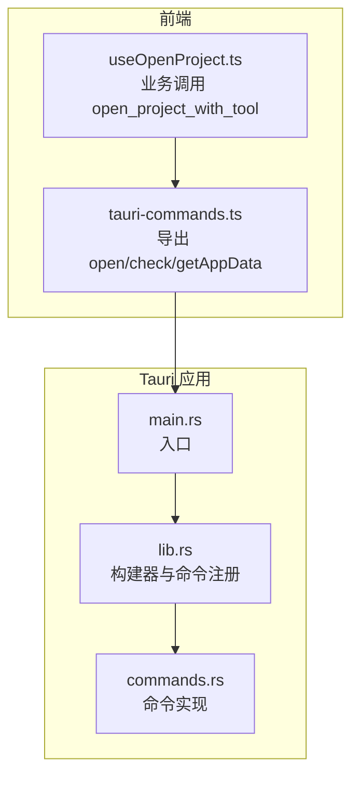
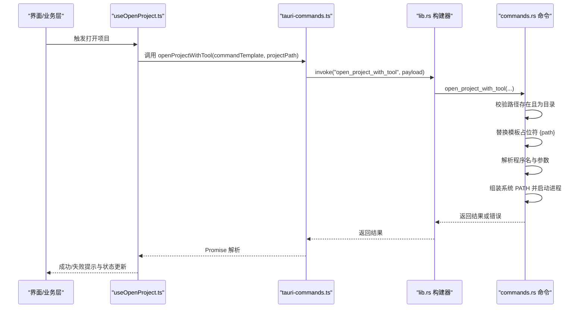
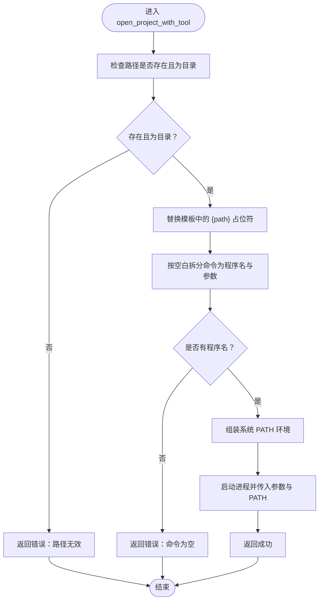
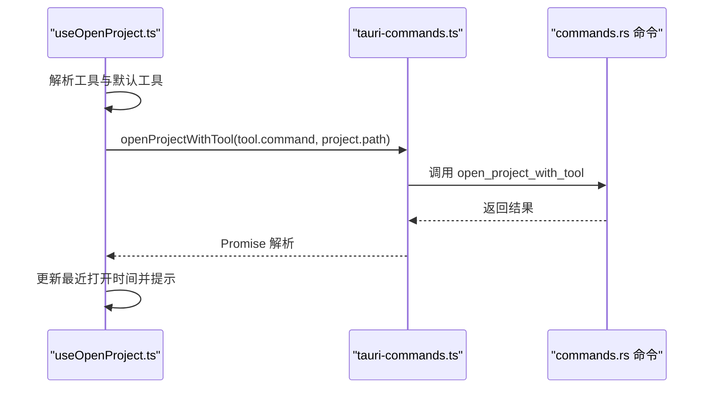
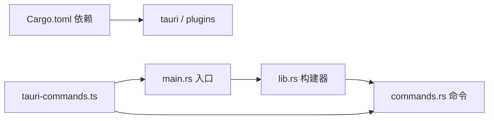
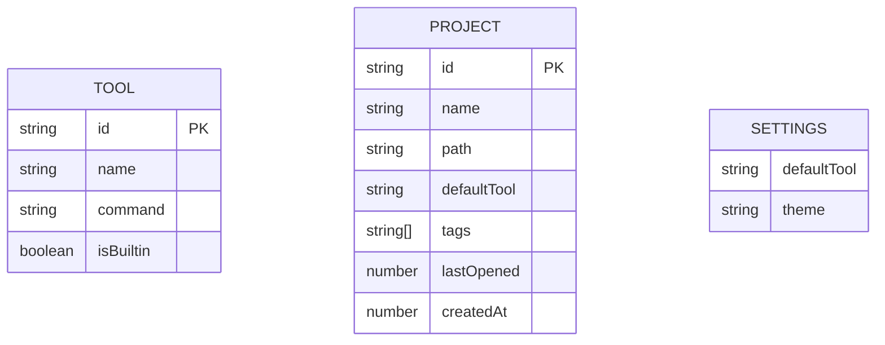

# 命令处理器

<cite>
**本文引用的文件**
- [src-tauri/src/commands.rs](file://src-tauri/src/commands.rs)
- [src/lib/tauri-commands.ts](file://src/lib/tauri-commands.ts)
- [src-tauri/src/lib.rs](file://src-tauri/src/lib.rs)
- [src-tauri/src/main.rs](file://src-tauri/src/main.rs)
- [src/hooks/useOpenProject.ts](file://src/hooks/useOpenProject.ts)
- [src/lib/constants.ts](file://src/lib/constants.ts)
- [src/lib/storage.ts](file://src/lib/storage.ts)
- [src/types/index.ts](file://src/types/index.ts)
- [src-tauri/Cargo.toml](file://src-tauri/Cargo.toml)
- [src-tauri/tauri.conf.json](file://src-tauri/tauri.conf.json)
</cite>

## 目录
1. [简介](#简介)
2. [项目结构](#项目结构)
3. [核心组件](#核心组件)
4. [架构总览](#架构总览)
5. [详细组件分析](#详细组件分析)
6. [依赖关系分析](#依赖关系分析)
7. [性能考量](#性能考量)
8. [故障排查指南](#故障排查指南)
9. [结论](#结论)
10. [附录：命令调用示例与最佳实践](#附录命令调用示例与最佳实践)

## 简介
本文件系统性地文档化 LaunchPro 的命令处理器，重点覆盖：
- Tauri 命令装饰器与命令注册机制
- open_project_with_tool 命令的实现细节（模板解析、路径校验、进程启动）
- check_path_exists 命令的路径检查逻辑与返回值处理
- get_app_data_dir 命令的应用数据目录获取机制
- 参数验证、错误处理与异常捕获策略
- 命令调用示例与最佳实践
- 安全考虑与权限控制
- 性能优化与资源管理策略

## 项目结构
命令处理器由前端 TypeScript 接口与后端 Rust 命令两部分组成，并通过 Tauri 的 invoke 机制进行桥接。命令在后端被注册到 Tauri 构建器中，前端通过统一的命令封装函数发起调用。

图表来源
- [src/lib/tauri-commands.ts:1-17](file://src/lib/tauri-commands.ts#L1-L17)
- [src/hooks/useOpenProject.ts:1-44](file://src/hooks/useOpenProject.ts#L1-L44)
- [src-tauri/src/main.rs:1-7](file://src-tauri/src/main.rs#L1-L7)
- [src-tauri/src/lib.rs:1-28](file://src-tauri/src/lib.rs#L1-L28)
- [src-tauri/src/commands.rs:1-95](file://src-tauri/src/commands.rs#L1-L95)

章节来源
- [src/lib/tauri-commands.ts:1-17](file://src/lib/tauri-commands.ts#L1-L17)
- [src-tauri/src/lib.rs:1-28](file://src-tauri/src/lib.rs#L1-L28)
- [src-tauri/src/main.rs:1-7](file://src-tauri/src/main.rs#L1-L7)

## 核心组件
- 前端命令封装：提供类型安全的命令调用接口，封装 invoke 调用。
- 后端命令实现：使用 #[tauri::command] 装饰器声明命令，实现具体逻辑。
- 命令注册：在 Tauri Builder 中通过 generate_handler! 注册命令。
- 业务集成：业务 Hook 在调用前完成工具选择与参数准备。

章节来源
- [src/lib/tauri-commands.ts:1-17](file://src/lib/tauri-commands.ts#L1-L17)
- [src-tauri/src/commands.rs:48-94](file://src-tauri/src/commands.rs#L48-L94)
- [src-tauri/src/lib.rs:10-14](file://src-tauri/src/lib.rs#L10-L14)
- [src/hooks/useOpenProject.ts:15-40](file://src/hooks/useOpenProject.ts#L15-L40)

## 架构总览
下图展示了从前端到后端的命令调用链路与关键处理点。

图表来源
- [src/hooks/useOpenProject.ts:15-40](file://src/hooks/useOpenProject.ts#L15-L40)
- [src/lib/tauri-commands.ts:3-8](file://src/lib/tauri-commands.ts#L3-L8)
- [src-tauri/src/lib.rs:10-14](file://src-tauri/src/lib.rs#L10-L14)
- [src-tauri/src/commands.rs:48-79](file://src-tauri/src/commands.rs#L48-L79)

## 详细组件分析

### Tauri 命令装饰器与注册机制
- 装饰器声明：每个命令以 #[tauri::command] 声明，自动暴露为 Tauri 可调用的命令。
- 注册方式：在 lib.rs 的 Tauri Builder 中通过 generate_handler! 将命令函数注册到应用。
- 类型安全：前端通过 invoke 按名称调用，参数与返回值遵循 Rust 函数签名。

章节来源
- [src-tauri/src/commands.rs:48-94](file://src-tauri/src/commands.rs#L48-L94)
- [src-tauri/src/lib.rs:10-14](file://src-tauri/src/lib.rs#L10-L14)

### open_project_with_tool 命令实现
该命令负责根据工具命令模板与项目路径，启动外部工具打开项目。实现要点如下：
- 路径验证：确保项目路径存在且为目录；否则返回错误。
- 模板解析：将命令模板中的 {path} 占位符替换为实际项目路径。
- 参数拆分：按空白字符拆分完整命令，首段作为程序名，其余作为参数。
- 系统 PATH 组装：读取 /etc/paths 与常见 IDE 安装路径，结合当前 PATH，生成可执行环境。
- 进程启动：设置 PATH 环境变量后异步启动进程，失败时返回错误信息。

图表来源
- [src-tauri/src/commands.rs:48-79](file://src-tauri/src/commands.rs#L48-L79)

章节来源
- [src-tauri/src/commands.rs:48-79](file://src-tauri/src/commands.rs#L48-L79)

### check_path_exists 命令
- 功能：判断给定路径是否为存在的目录。
- 实现：直接基于 Path 判断存在性与目录属性，返回布尔值。
- 返回值：Result<bool, String>，成功时返回布尔值，失败时返回错误字符串。

章节来源
- [src-tauri/src/commands.rs:81-85](file://src-tauri/src/commands.rs#L81-L85)

### get_app_data_dir 命令
- 功能：获取应用数据目录路径。
- 实现：通过 AppHandle 的 path() 接口查询 app_data_dir，失败则返回错误字符串。
- 返回值：Result<String, String>，成功时返回字符串路径，失败时返回错误信息。

章节来源
- [src-tauri/src/commands.rs:87-94](file://src-tauri/src/commands.rs#L87-L94)

### 前端命令封装与业务集成
- 前端封装：tauri-commands.ts 提供三个命令的封装函数，分别对应后端命令。
- 业务集成：useOpenProject.ts 在打开项目前解析工具、准备参数，并在调用后更新最近打开时间与显示提示。

图表来源
- [src/hooks/useOpenProject.ts:15-40](file://src/hooks/useOpenProject.ts#L15-L40)
- [src/lib/tauri-commands.ts:3-8](file://src/lib/tauri-commands.ts#L3-L8)
- [src-tauri/src/commands.rs:48-79](file://src-tauri/src/commands.rs#L48-L79)

章节来源
- [src/lib/tauri-commands.ts:1-17](file://src/lib/tauri-commands.ts#L1-L17)
- [src/hooks/useOpenProject.ts:15-40](file://src/hooks/useOpenProject.ts#L15-L40)

## 依赖关系分析
- 外部依赖：Tauri v2、shell 插件、dialog 插件、store 插件。
- 内部模块：lib.rs 负责构建器与命令注册；commands.rs 实现命令；main.rs 作为入口。
- 前后端交互：前端通过 @tauri-apps/api/core 的 invoke 发起命令调用。

图表来源
- [src-tauri/Cargo.toml:15-22](file://src-tauri/Cargo.toml#L15-L22)
- [src-tauri/src/lib.rs:6-27](file://src-tauri/src/lib.rs#L6-L27)
- [src-tauri/src/main.rs:4-6](file://src-tauri/src/main.rs#L4-L6)
- [src/lib/tauri-commands.ts:1-17](file://src/lib/tauri-commands.ts#L1-L17)

章节来源
- [src-tauri/Cargo.toml:15-22](file://src-tauri/Cargo.toml#L15-L22)
- [src-tauri/src/lib.rs:6-27](file://src-tauri/src/lib.rs#L6-L27)
- [src-tauri/src/main.rs:4-6](file://src-tauri/src/main.rs#L4-L6)

## 性能考量
- 异步启动进程：命令通过 spawn 启动外部进程，避免阻塞主线程。
- 最小化文件系统访问：仅在必要时读取 /etc/paths 与检查路径存在性。
- 环境变量复用：通过自定义 PATH 避免重复查找可执行文件，减少启动延迟。
- 建议优化：
  - 对频繁调用的命令可考虑缓存 PATH 或工具可用性检测结果。
  - 对模板解析可做预编译或缓存，减少重复字符串替换成本。
  - 对外部工具启动失败的重试策略需谨慎设计，避免无限循环。

[本节为通用性能建议，不直接分析具体文件]

## 故障排查指南
- open_project_with_tool 常见问题
  - 路径不存在或非目录：检查项目路径是否正确，确认路径存在且为目录。
  - 命令模板为空：确保模板包含至少一个可执行程序名。
  - 模板未包含 {path}：工具命令模板必须包含 {path} 占位符。
  - PATH 无法找到可执行程序：确认系统 PATH 是否包含目标工具所在目录。
  - 进程启动失败：查看错误信息中的程序名，确认可执行文件存在且有执行权限。
- check_path_exists 常见问题
  - 返回 false：路径不存在或不是目录。
- get_app_data_dir 常见问题
  - 返回错误：应用数据目录不可用或权限不足。
- 前端调用问题
  - 未收到响应：确认命令已在 lib.rs 中注册，且前端封装函数已导出。
  - 类型不匹配：确保调用时参数类型与后端签名一致。

章节来源
- [src-tauri/src/commands.rs:48-94](file://src-tauri/src/commands.rs#L48-L94)
- [src/lib/tauri-commands.ts:1-17](file://src/lib/tauri-commands.ts#L1-L17)

## 结论
LaunchPro 的命令处理器采用清晰的前后端分离架构：前端提供类型安全的命令封装，后端通过 Tauri 装饰器与注册机制暴露命令。open_project_with_tool 命令实现了模板解析、路径校验与进程启动的完整流程；check_path_exists 与 get_app_data_dir 提供了基础的路径检查与应用数据目录获取能力。整体设计简洁可靠，具备良好的扩展性与安全性。

[本节为总结性内容，不直接分析具体文件]

## 附录：命令调用示例与最佳实践

### 命令调用示例
- 打开项目（前端）
  - 使用 useOpenProject 钩子解析工具与项目路径，调用 openProjectWithTool。
  - 示例路径参考：[src/hooks/useOpenProject.ts:31-37](file://src/hooks/useOpenProject.ts#L31-L37)
- 路径检查（前端）
  - 调用 checkPathExists，用于 UI 层的输入校验或禁用按钮。
  - 示例路径参考：[src/lib/tauri-commands.ts:10-12](file://src/lib/tauri-commands.ts#L10-L12)
- 获取应用数据目录（前端）
  - 调用 getAppDataDir，用于日志或配置文件存储路径。
  - 示例路径参考：[src/lib/tauri-commands.ts:14-16](file://src/lib/tauri-commands.ts#L14-L16)

### 最佳实践
- 命令模板规范
  - 工具命令模板必须包含 {path} 占位符，确保替换后形成合法命令。
  - 参考内置工具模板定义：[src/lib/constants.ts:3-18](file://src/lib/constants.ts#L3-L18)
- 参数验证
  - 前端在调用前进行基本校验（如工具 ID 存在、项目路径有效）。
  - 参考业务钩子中的工具解析与错误提示：[src/hooks/useOpenProject.ts:15-40](file://src/hooks/useOpenProject.ts#L15-L40)
- 错误处理
  - 前端统一捕获异常并提示用户，避免未处理错误导致崩溃。
  - 参考业务钩子中的 try/catch 与 toast 提示：[src/hooks/useOpenProject.ts:31-37](file://src/hooks/useOpenProject.ts#L31-L37)
- 安全与权限
  - 仅允许调用已注册的命令，避免任意命令注入。
  - 对外部工具的 PATH 进行最小化配置，避免污染全局环境。
  - 对用户输入的路径进行严格校验，防止路径遍历等风险。
- 性能与资源
  - 异步启动外部进程，避免阻塞 UI。
  - 对频繁调用的命令进行必要的缓存与去抖处理。
  - 使用 LazyStore 等插件进行持久化，减少磁盘 IO。

### 关键数据模型

图表来源
- [src/types/index.ts:12-23](file://src/types/index.ts#L12-L23)