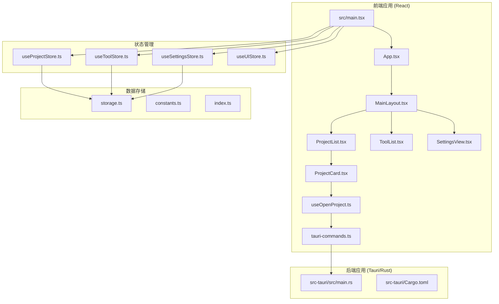
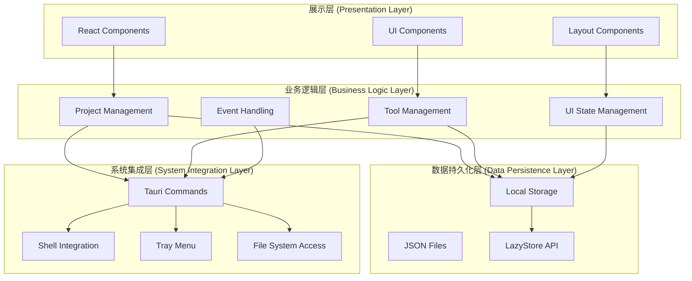
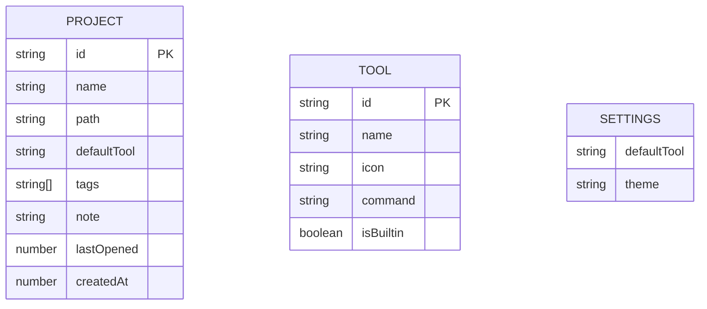
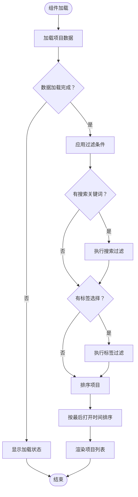
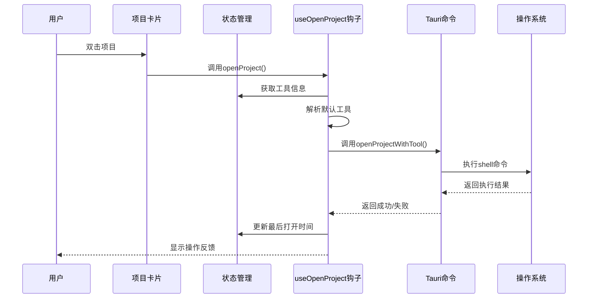
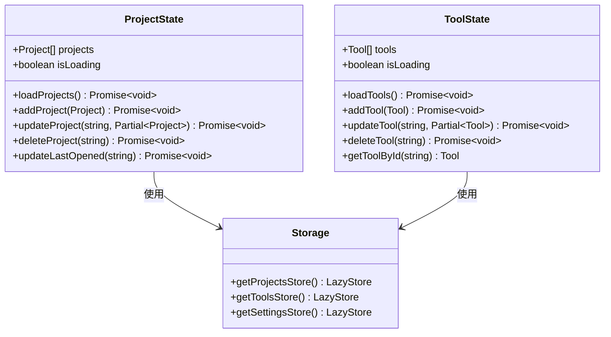

# 最近项目系统

<cite>
**本文档引用的文件**
- [src/App.tsx](file://src/App.tsx)
- [src/main.tsx](file://src/main.tsx)
- [src-tauri/src/main.rs](file://src-tauri/src/main.rs)
- [package.json](file://package.json)
- [src-tauri/Cargo.toml](file://src-tauri/Cargo.toml)
- [src/stores/useProjectStore.ts](file://src/stores/useProjectStore.ts)
- [src/stores/useToolStore.ts](file://src/stores/useToolStore.ts)
- [src/components/layout/MainLayout.tsx](file://src/components/layout/MainLayout.tsx)
- [src/lib/constants.ts](file://src/lib/constants.ts)
- [src/lib/storage.ts](file://src/lib/storage.ts)
- [src/types/index.ts](file://src/types/index.ts)
- [src/components/project/ProjectList.tsx](file://src/components/project/ProjectList.tsx)
- [src/components/project/ProjectCard.tsx](file://src/components/project/ProjectCard.tsx)
- [src/hooks/useOpenProject.ts](file://src/hooks/useOpenProject.ts)
- [src/lib/tauri-commands.ts](file://src/lib/tauri-commands.ts)
</cite>

## 目录
1. [简介](#简介)
2. [项目结构](#项目结构)
3. [核心组件](#核心组件)
4. [架构概览](#架构概览)
5. [详细组件分析](#详细组件分析)
6. [依赖关系分析](#依赖关系分析)
7. [性能考虑](#性能考虑)
8. [故障排除指南](#故障排除指南)
9. [结论](#结论)

## 简介

最近项目系统是一个基于 Tauri 和 React 构建的跨平台项目管理应用程序。该系统允许用户管理多个开发项目，配置不同的开发工具，并通过托盘菜单快速访问最近打开的项目。系统采用现代化的前端技术栈，包括 TypeScript、React 19、Zustand 状态管理、Tailwind CSS 样式框架和 Radix UI 组件库。

该应用的核心特性包括：
- 项目列表管理与搜索过滤
- 多种开发工具集成（VS Code、Cursor、Qoder 等）
- 托盘菜单的最近项目快捷访问
- 响应式用户界面设计
- 本地数据持久化存储

## 项目结构

项目采用前后端分离的架构设计，主要分为前端 React 应用和后端 Rust 应用两大部分：



**图表来源**
- [src/main.tsx:1-11](file://src/main.tsx#L1-L11)
- [src/App.tsx:1-62](file://src/App.tsx#L1-L62)
- [src-tauri/src/main.rs:1-7](file://src-tauri/src/main.rs#L1-L7)

**章节来源**
- [src/main.tsx:1-11](file://src/main.tsx#L1-L11)
- [src/App.tsx:1-62](file://src/App.tsx#L1-L62)
- [src-tauri/src/main.rs:1-7](file://src-tauri/src/main.rs#L1-L7)

## 核心组件

### 应用入口点

应用从 `src/main.tsx` 开始启动，创建 React 根节点并将 `App` 组件渲染到 DOM 中。这是整个应用的唯一入口点，确保了应用的统一初始化流程。

### 主布局组件

`MainLayout.tsx` 实现了应用的主要布局结构，包含侧边栏导航和内容区域。它根据当前激活的视图（项目、工具或设置）动态渲染相应的组件。

### 状态管理系统

应用使用 Zustand 作为状态管理解决方案，实现了四个核心状态存储：
- `useProjectStore`: 管理项目数据的增删改查操作
- `useToolStore`: 管理开发工具配置和内置工具合并逻辑
- `useSettingsStore`: 存储用户偏好设置
- `useUIStore`: 管理界面状态（搜索查询、标签过滤等）

**章节来源**
- [src/main.tsx:1-11](file://src/main.tsx#L1-L11)
- [src/components/layout/MainLayout.tsx:1-21](file://src/components/layout/MainLayout.tsx#L1-L21)
- [src/stores/useProjectStore.ts:1-70](file://src/stores/useProjectStore.ts#L1-L70)
- [src/stores/useToolStore.ts:1-75](file://src/stores/useToolStore.ts#L1-L75)

## 架构概览

系统采用分层架构设计，清晰分离了前端展示层、业务逻辑层、数据持久化层和系统集成层：



**图表来源**
- [src/App.tsx:24-59](file://src/App.tsx#L24-L59)
- [src/stores/useProjectStore.ts:16-69](file://src/stores/useProjectStore.ts#L16-L69)
- [src/stores/useToolStore.ts:17-74](file://src/stores/useToolStore.ts#L17-L74)
- [src/lib/storage.ts:1-30](file://src/lib/storage.ts#L1-L30)
- [src/lib/tauri-commands.ts:1-21](file://src/lib/tauri-commands.ts#L1-L21)

## 详细组件分析

### 项目管理系统

项目管理系统是应用的核心功能模块，负责管理用户的开发项目信息和访问历史。

#### 数据模型设计

项目数据模型包含了完整的项目信息结构：



**图表来源**
- [src/types/index.ts:1-26](file://src/types/index.ts#L1-L26)

#### 项目列表组件

`ProjectList.tsx` 实现了项目列表的完整功能，包括搜索、过滤、排序和显示：



**图表来源**
- [src/components/project/ProjectList.tsx:29-55](file://src/components/project/ProjectList.tsx#L29-L55)

#### 项目卡片组件

`ProjectCard.tsx` 提供了单个项目条目的完整交互界面，支持双击打开、右键菜单、上下文菜单等多种操作方式：



**图表来源**
- [src/components/project/ProjectCard.tsx:82-189](file://src/components/project/ProjectCard.tsx#L82-L189)
- [src/hooks/useOpenProject.ts:15-40](file://src/hooks/useOpenProject.ts#L15-L40)
- [src/lib/tauri-commands.ts:3-8](file://src/lib/tauri-commands.ts#L3-L8)

**章节来源**
- [src/components/project/ProjectList.tsx:1-168](file://src/components/project/ProjectList.tsx#L1-L168)
- [src/components/project/ProjectCard.tsx:1-227](file://src/components/project/ProjectCard.tsx#L1-L227)
- [src/hooks/useOpenProject.ts:1-44](file://src/hooks/useOpenProject.ts#L1-L44)
- [src/lib/tauri-commands.ts:1-21](file://src/lib/tauri-commands.ts#L1-L21)

### 工具管理系统

工具管理系统负责维护可用的开发工具列表，支持内置工具和用户自定义工具的混合管理。

#### 内置工具配置

系统预定义了多种常用的开发工具，包括 VS Code、Cursor、Qoder 等主流开发环境：

| 工具名称 | 命令模板 | 图标 | 平台支持 |
|---------|---------|------|----------|
| VS Code | `code {path}` | VS | 跨平台 |
| Cursor | `cursor {path}` | Cu | 跨平台 |
| Qoder | `qoder {path}` | Q | 跨平台 |
| Terminal | `open -a Terminal {path}` | T | macOS |
| Finder | `open {path}` | F | macOS |

**章节来源**
- [src/lib/constants.ts:1-23](file://src/lib/constants.ts#L1-L23)
- [src/stores/useToolStore.ts:17-74](file://src/stores/useToolStore.ts#L17-L74)

### 状态管理机制

应用使用 Zustand 实现轻量级的状态管理，每个状态存储都封装了完整的 CRUD 操作：



**图表来源**
- [src/stores/useProjectStore.ts:6-14](file://src/stores/useProjectStore.ts#L6-L14)
- [src/stores/useToolStore.ts:7-15](file://src/stores/useToolStore.ts#L7-L15)
- [src/lib/storage.ts:19-29](file://src/lib/storage.ts#L19-L29)

**章节来源**
- [src/stores/useProjectStore.ts:1-70](file://src/stores/useProjectStore.ts#L1-L70)
- [src/stores/useToolStore.ts:1-75](file://src/stores/useToolStore.ts#L1-L75)
- [src/lib/storage.ts:1-30](file://src/lib/storage.ts#L1-L30)

## 依赖关系分析

应用的依赖关系展现了清晰的技术栈分层和模块化设计：

```mermaid
graph TB
subgraph "前端依赖"
A[react@^19.2.4]
B[react-dom@^19.2.4]
C[zustand@^5.0.12]
D[tailwindcss@^4.2.2]
E[lucide-react@^1.7.0]
F[sonner@^2.0.7]
G[next-themes@^0.4.6]
end
subgraph "Tauri依赖"
H[@tauri-apps/api@^2.10.1]
I[@tauri-apps/plugin-shell@^2.3.5]
J[@tauri-apps/plugin-dialog@^2.6.0]
K[@tauri-apps/plugin-store@^2.4.2]
end
subgraph "构建工具"
L[vite@^8.0.1]
M[typescript@~5.9.3]
N[@tauri-apps/cli@^2.10.1]
end
subgraph "后端依赖"
O[tauri@2]
P[tauri-plugin-shell@2]
Q[tauri-plugin-dialog@2]
R[tauri-plugin-store@2]
S[serde@1]
T[serde_json@1]
end
A --> H
B --> H
C --> H
H --> O
I --> P
J --> Q
K --> R
O --> S
P --> S
Q --> S
R --> S
```

**图表来源**
- [package.json:13-46](file://package.json#L13-L46)
- [src-tauri/Cargo.toml:15-22](file://src-tauri/Cargo.toml#L15-L22)

**章节来源**
- [package.json:1-48](file://package.json#L1-L48)
- [src-tauri/Cargo.toml:1-22](file://src-tauri/Cargo.toml#L1-L22)

## 性能考虑

### 状态管理优化

应用采用了以下性能优化策略：
- 使用 Zustand 替代 Redux，减少不必要的重渲染
- 在项目列表中使用 `useMemo` 进行计算结果缓存
- 实现增量更新而非全量替换状态

### 数据持久化策略

- 使用 LazyStore API 实现延迟加载和自动保存
- 项目数据采用 JSON 文件格式存储，便于调试和备份
- 支持异步读写操作，避免阻塞主线程

### UI 渲染优化

- 列表项使用虚拟滚动提升大数据集渲染性能
- 条目悬停效果采用 CSS 过渡动画
- 图标和按钮使用 Lucide React 的轻量级实现

## 故障排除指南

### 常见问题及解决方案

#### 项目无法打开
1. **检查工具配置**：确认项目关联的工具是否存在且可执行
2. **验证路径权限**：确保项目路径对当前用户可访问
3. **查看系统日志**：检查 Tauri 命令调用是否成功

#### 托盘菜单不更新
1. **重新加载应用**：重启应用以刷新托盘菜单状态
2. **检查权限设置**：确保应用具有系统托盘访问权限
3. **清理缓存数据**：删除相关的 JSON 配置文件

#### 数据丢失问题
1. **检查存储位置**：确认数据文件位于正确的应用数据目录
2. **备份配置文件**：定期备份 projects.json 和 tools.json 文件
3. **恢复默认设置**：删除损坏的配置文件以恢复默认状态

**章节来源**
- [src/hooks/useOpenProject.ts:31-38](file://src/hooks/useOpenProject.ts#L31-L38)
- [src/stores/useProjectStore.ts:65-68](file://src/stores/useProjectStore.ts#L65-L68)

## 结论

最近项目系统是一个设计精良的跨平台应用，成功地将现代前端技术与系统级功能集成在一起。系统的主要优势包括：

### 技术优势
- **架构清晰**：分层设计使得代码易于维护和扩展
- **性能优秀**：合理的状态管理和渲染优化确保流畅体验
- **跨平台兼容**：基于 Tauri 的原生应用提供最佳性能

### 功能特色
- **实用性强**：解决开发者日常项目管理的实际需求
- **用户体验佳**：直观的界面设计和丰富的交互功能
- **可扩展性好**：模块化的架构便于添加新功能

### 改进建议
- 可以考虑添加项目模板功能
- 增加团队协作和项目分享功能
- 实现更高级的项目分类和标签管理

该系统为开发者提供了一个高效、可靠的项目管理解决方案，是现代桌面应用开发的优秀范例。