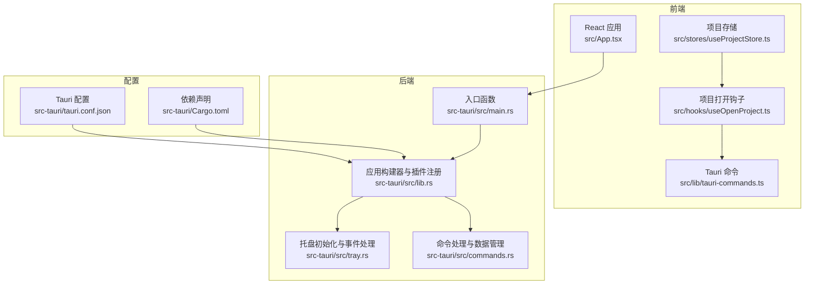
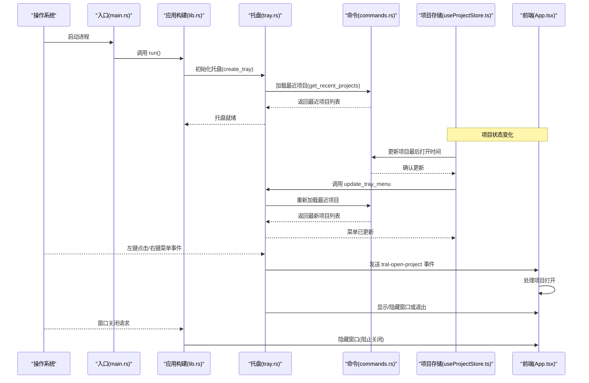
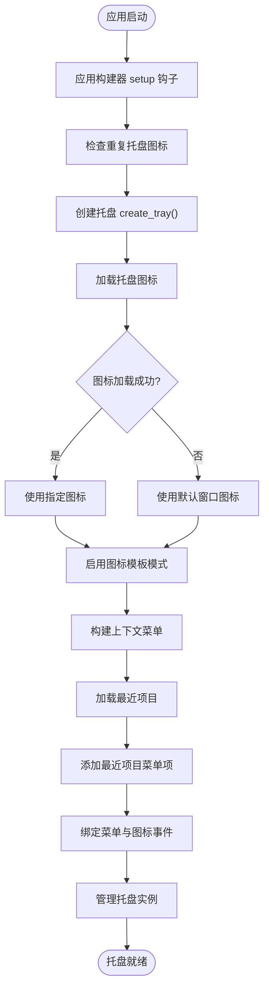
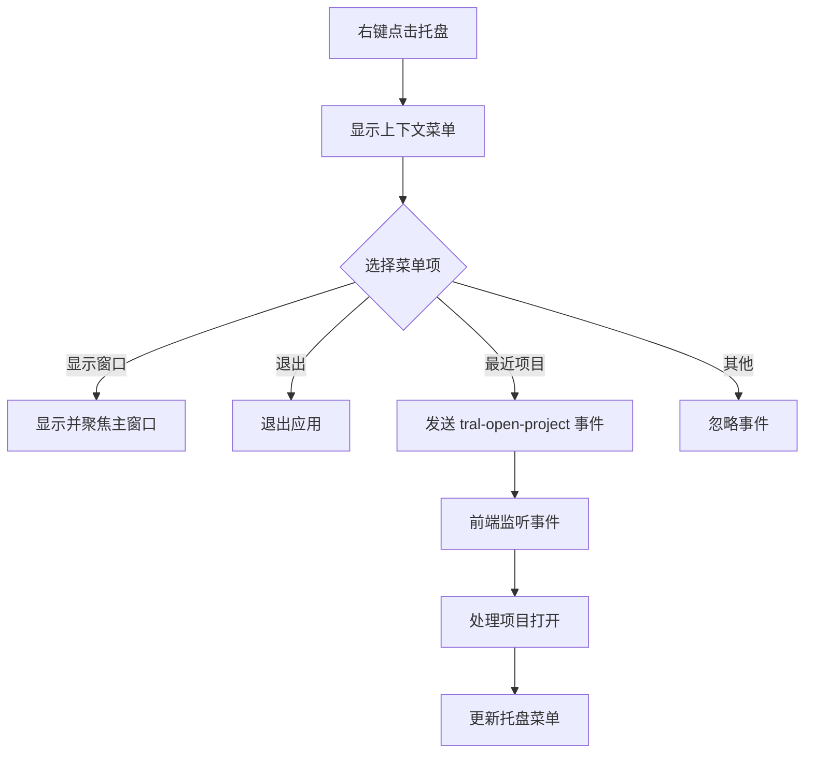
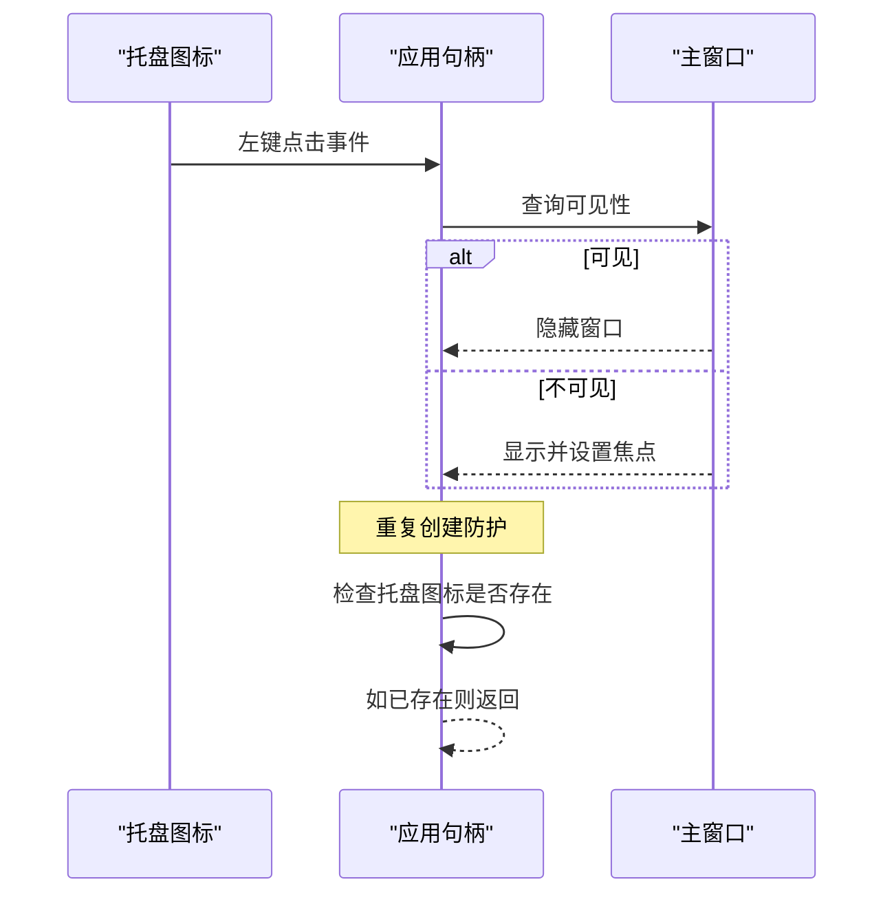
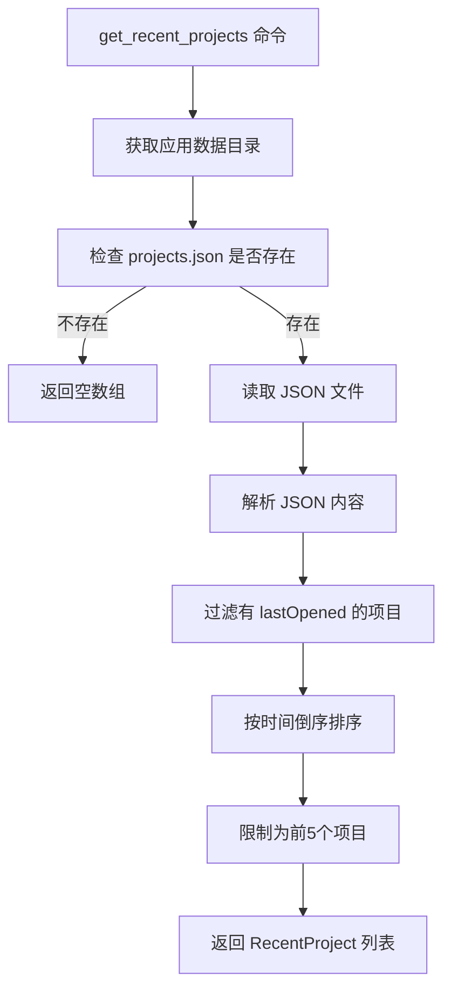
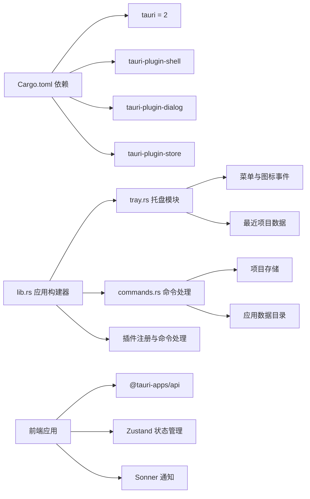

# 系统托盘

<cite>
**本文引用的文件**
- [src-tauri/src/tray.rs](file://src-tauri/src/tray.rs)
- [src-tauri/src/commands.rs](file://src-tauri/src/commands.rs)
- [src-tauri/src/lib.rs](file://src-tauri/src/lib.rs)
- [src-tauri/tauri.conf.json](file://src-tauri/tauri.conf.json)
- [src-tauri/Cargo.toml](file://src-tauri/Cargo.toml)
- [src-tauri/src/main.rs](file://src-tauri/src/main.rs)
- [src/App.tsx](file://src/App.tsx)
- [src/lib/tauri-commands.ts](file://src/lib/tauri-commands.ts)
- [src/stores/useProjectStore.ts](file://src/stores/useProjectStore.ts)
- [src/hooks/useOpenProject.ts](file://src/hooks/useOpenProject.ts)
- [src/types/index.ts](file://src/types/index.ts)
- [README.md](file://README.md)
</cite>

## 更新摘要
**变更内容**
- 新增完整的托盘集成系统，包括最近项目管理功能
- 新增动态菜单更新机制，支持实时刷新托盘菜单
- 新增自动检测重复托盘图标的防重复创建功能
- 新增 update_tray_menu 命令和 RecentProject 数据结构
- 新增托盘菜单与前端的事件通信机制
- 新增项目打开历史记录和时间戳管理

## 目录
1. [简介](#简介)
2. [项目结构](#项目结构)
3. [核心组件](#核心组件)
4. [架构总览](#架构总览)
5. [详细组件分析](#详细组件分析)
6. [依赖关系分析](#依赖关系分析)
7. [性能考量](#性能考量)
8. [故障排查指南](#故障排查指南)
9. [结论](#结论)
10. [附录](#附录)

## 简介
本节概述 LaunchPro 的系统托盘功能目标与整体设计思路。系统托盘用于在后台运行时保持应用可访问性，提供最小化的交互入口（显示/隐藏主窗口、退出应用），并支持上下文菜单与图标模板渲染。该功能基于 Tauri v2 实现，确保跨平台一致性与原生体验。**更新** 新增完整的托盘集成系统，包括最近项目管理、动态菜单更新、自动检测重复托盘图标等功能。

## 项目结构
系统托盘相关代码主要分布在后端 Rust 模块中，前端 React 应用负责启动与状态展示，配置通过 tauri.conf.json 和 Cargo.toml 定义。**更新** 新增了完整的托盘集成架构，包括数据结构定义、命令处理和前端通信。

**图表来源**
- [src-tauri/src/main.rs:1-7](file://src-tauri/src/main.rs#L1-L7)
- [src-tauri/src/lib.rs:1-29](file://src-tauri/src/lib.rs#L1-L29)
- [src-tauri/src/tray.rs:1-117](file://src-tauri/src/tray.rs#L1-L117)
- [src-tauri/src/commands.rs:1-157](file://src-tauri/src/commands.rs#L1-L157)
- [src-tauri/tauri.conf.json:1-44](file://src-tauri/tauri.conf.json#L1-L44)
- [src-tauri/Cargo.toml:1-22](file://src-tauri/Cargo.toml#L1-L22)

**章节来源**
- [src-tauri/src/main.rs:1-7](file://src-tauri/src/main.rs#L1-L7)
- [src-tauri/src/lib.rs:1-29](file://src-tauri/src/lib.rs#L1-L29)
- [src-tauri/src/tray.rs:1-117](file://src-tauri/src/tray.rs#L1-L117)
- [src-tauri/src/commands.rs:1-157](file://src-tauri/src/commands.rs#L1-L157)
- [src-tauri/tauri.conf.json:1-44](file://src-tauri/tauri.conf.json#L1-L44)
- [src-tauri/Cargo.toml:1-22](file://src-tauri/Cargo.toml#L1-L22)

## 核心组件
- **托盘初始化与图标设置**：在应用启动阶段创建托盘图标，使用指定路径的 PNG 图标作为托盘图标，并启用图标模板模式以适配系统主题。**新增** 包含重复托盘图标检测，避免多次创建。
- **上下文菜单**：创建"显示窗口"和"退出"两个基础菜单项，中间以分隔符分隔；**新增** 动态加载最近项目菜单项，最多显示5个最近打开的项目。
- **事件处理**：
  - **菜单事件**：点击"显示窗口"时，定位到主窗口并显示且聚焦；点击"退出"时，调用应用退出；**新增** 点击最近项目时，通过事件通信发送项目ID到前端处理。
  - **图标点击事件**：左键点击托盘图标切换主窗口的显示/隐藏状态，并在显示时设置焦点。
- **生命周期与窗口行为**：当窗口关闭请求触发时，阻止默认关闭并隐藏窗口，从而实现托盘化运行。
- **数据管理**：**新增** RecentProject 数据结构定义项目ID、名称和路径信息，支持序列化和克隆。
- **动态菜单更新**：**新增** update_tray_menu 命令，允许前端在项目状态变化时动态更新托盘菜单。

**章节来源**
- [src-tauri/src/tray.rs:8-117](file://src-tauri/src/tray.rs#L8-L117)
- [src-tauri/src/lib.rs:15-29](file://src-tauri/src/lib.rs#L15-L29)
- [src-tauri/src/commands.rs:6-157](file://src-tauri/src/commands.rs#L6-L157)

## 架构总览
系统托盘的控制流从应用入口开始，经由应用构建器完成插件注册与托盘初始化，随后在事件循环中响应用户操作。**更新** 新增了完整的数据流，包括项目状态变化到托盘菜单更新的完整链路。

**图表来源**
- [src-tauri/src/main.rs:4-6](file://src-tauri/src/main.rs#L4-L6)
- [src-tauri/src/lib.rs:5-29](file://src-tauri/src/lib.rs#L5-L29)
- [src-tauri/src/tray.rs:51-117](file://src-tauri/src/tray.rs#L51-L117)
- [src-tauri/src/commands.rs:105-157](file://src-tauri/src/commands.rs#L105-L157)
- [src/stores/useProjectStore.ts:58-68](file://src/stores/useProjectStore.ts#L58-L68)

## 详细组件分析

### 托盘初始化与配置
- **初始化流程**：应用启动时，应用构建器在 setup 钩子中调用托盘初始化函数，创建托盘图标、上下文菜单与事件处理器。**新增** 包含重复托盘图标检测，避免多次创建。
- **图标设置**：优先使用指定路径的图标文件；若加载失败，则回退到默认窗口图标。同时启用图标模板模式，使图标能随系统主题自动调整明暗。
- **菜单配置**：使用菜单构建器添加"显示窗口"和"退出"菜单项，并插入分隔符；设置仅在右键时显示菜单。**新增** 动态加载最近项目菜单项，最多显示5个最近打开的项目。
- **事件绑定**：分别绑定菜单事件与托盘图标点击事件，实现窗口显示/隐藏与退出逻辑。**新增** 支持最近项目点击事件，通过事件通信发送项目ID到前端。

**图表来源**
- [src-tauri/src/lib.rs:18](file://src-tauri/src/lib.rs#L18)
- [src-tauri/src/tray.rs:51-117](file://src-tauri/src/tray.rs#L51-L117)
- [src-tauri/src/commands.rs:105-157](file://src-tauri/src/commands.rs#L105-L157)

**章节来源**
- [src-tauri/src/lib.rs:18](file://src-tauri/src/lib.rs#L18)
- [src-tauri/src/tray.rs:51-117](file://src-tauri/src/tray.rs#L51-L117)
- [src-tauri/src/commands.rs:105-157](file://src-tauri/src/commands.rs#L105-L157)

### 托盘菜单与图标
- **菜单项**：
  - "显示窗口"：通过菜单事件触发，查找名为"main"的 Webview 窗口并显示与聚焦。
  - "退出"：直接调用应用退出。
  - **新增** 最近项目菜单项：动态生成，格式为"open_project:{id}"，点击时发送项目ID到前端。
- **图标模板**：启用 icon_as_template，使托盘图标在浅色/深色模式下自动适配系统外观。
- **菜单显示策略**：设置仅在右键点击时显示菜单，避免误触。
- **新增** **菜单构建优化**：使用 MenuBuilder 构建菜单，支持动态添加和移除菜单项。

**图表来源**
- [src-tauri/src/tray.rs:66-91](file://src-tauri/src/tray.rs#L66-L91)
- [src/App.tsx:38-52](file://src/App.tsx#L38-L52)

**章节来源**
- [src-tauri/src/tray.rs:66-91](file://src-tauri/src/tray.rs#L66-L91)
- [src/App.tsx:38-52](file://src/App.tsx#L38-L52)

### 图标点击事件与窗口状态同步
- **左键点击托盘图标**：
  - 若主窗口可见则隐藏；
  - 若不可见则显示并设置焦点。
- **窗口关闭请求拦截**：在窗口事件中拦截关闭请求，改为隐藏窗口，实现真正的"最小化到托盘"。
- **新增** **重复创建防护**：在 create_tray 函数中检查是否已存在托盘图标，避免重复创建导致的内存泄漏。

**图表来源**
- [src-tauri/src/tray.rs:92-110](file://src-tauri/src/tray.rs#L92-L110)
- [src-tauri/src/lib.rs:21-26](file://src-tauri/src/lib.rs#L21-L26)

**章节来源**
- [src-tauri/src/tray.rs:92-110](file://src-tauri/src/tray.rs#L92-L110)
- [src-tauri/src/lib.rs:21-26](file://src-tauri/src/lib.rs#L21-L26)

### 托盘与主窗口交互逻辑
- **主窗口命名约定**：托盘事件通过窗口名称"main"进行查找与操作，确保与主窗口建立稳定关联。
- **焦点管理**：显示窗口时主动设置焦点，提升用户体验。
- **关闭行为**：通过窗口事件拦截关闭请求，隐藏窗口而非退出进程，符合托盘化运行预期。
- **新增** **事件通信机制**：通过 window.emit 发送自定义事件"tray-open-project"到前端，实现托盘与前端的双向通信。

**章节来源**
- [src-tauri/src/tray.rs:78-87](file://src-tauri/src/tray.rs#L78-L87)
- [src-tauri/src/lib.rs:21-26](file://src-tauri/src/lib.rs#L21-L26)

### 最近项目管理系统
- **数据结构定义**：RecentProject 结构体包含 id、name 和 path 字段，支持序列化和克隆操作。
- **项目加载逻辑**：从应用数据目录的 projects.json 文件中读取项目数据，过滤有 lastOpened 时间戳的项目。
- **排序与限制**：按 lastOpened 时间戳倒序排序，最多返回5个项目。
- **新增** **动态菜单生成**：根据最近项目数量动态生成菜单项，支持实时更新。

**图表来源**
- [src-tauri/src/commands.rs:105-157](file://src-tauri/src/commands.rs#L105-L157)

**章节来源**
- [src-tauri/src/commands.rs:6-157](file://src-tauri/src/commands.rs#L6-L157)

### 动态菜单更新机制
- **update_tray_menu 命令**：允许前端在项目状态变化时动态更新托盘菜单。
- **菜单重建流程**：重新构建菜单，加载最新的最近项目列表，更新现有菜单。
- **前端集成**：项目存储在 updateLastOpened 方法中调用 updateTrayMenu，确保菜单实时更新。
- **错误处理**：包含完整的错误处理和日志记录，确保菜单更新失败时不影响应用运行。

**章节来源**
- [src-tauri/src/tray.rs:39-49](file://src-tauri/src/tray.rs#L39-L49)
- [src/stores/useProjectStore.ts:65-68](file://src/stores/useProjectStore.ts#L65-L68)

### 多平台兼容性与设计规范
- **平台支持**：项目 README 明确支持 macOS、Windows 与 Linux，打包格式覆盖主流发行渠道。
- **图标资源**：配置中声明了多尺寸图标与平台特定格式，保证在不同系统与高 DPI 场景下清晰显示。
- **图标模板**：启用图标模板模式，确保在浅色/深色模式下均具有良好可读性。
- **新增** **跨平台测试**：确保托盘功能在不同操作系统上的兼容性和一致性。

**章节来源**
- [README.md:34-43](file://README.md#L34-L43)
- [src-tauri/tauri.conf.json:24-27](file://src-tauri/tauri.conf.json#L24-L27)
- [src-tauri/tauri.conf.json:32-38](file://src-tauri/tauri.conf.json#L32-L38)

### 通知系统与消息传递
- **通知库**：前端使用 Sonner 提供轻量级通知组件，可在需要时向用户推送状态提示或错误信息。
- **消息传递**：托盘功能通过 IPC 与前端通信，包括项目打开事件和菜单更新命令。
- **新增** **事件驱动架构**：使用自定义事件"tray-open-project"实现托盘与前端的松耦合通信。
- **命令调用**：通过 tauri-commands.ts 提供统一的命令调用接口。

**章节来源**
- [src/App.tsx:38-52](file://src/App.tsx#L38-L52)
- [src/lib/tauri-commands.ts:18-20](file://src/lib/tauri-commands.ts#L18-L20)
- [src-tauri/Cargo.toml:15-22](file://src-tauri/Cargo.toml#L15-L22)

## 依赖关系分析
系统托盘功能依赖于 Tauri 的 tray-icon、image-png 等特性与相关插件，应用构建器负责注册插件与事件处理器。**更新** 新增了完整的依赖链，包括数据存储、命令处理和前端通信。

**图表来源**
- [src-tauri/Cargo.toml:15-22](file://src-tauri/Cargo.toml#L15-L22)
- [src-tauri/src/lib.rs:5-29](file://src-tauri/src/lib.rs#L5-L29)
- [src-tauri/src/tray.rs:1-8](file://src-tauri/src/tray.rs#L1-L8)
- [src-tauri/src/commands.rs:1-5](file://src-tauri/src/commands.rs#L1-L5)

**章节来源**
- [src-tauri/Cargo.toml:15-22](file://src-tauri/Cargo.toml#L15-L22)
- [src-tauri/src/lib.rs:5-29](file://src-tauri/src/lib.rs#L5-L29)
- [src-tauri/src/tray.rs:1-8](file://src-tauri/src/tray.rs#L1-L8)
- [src-tauri/src/commands.rs:1-5](file://src-tauri/src/commands.rs#L1-L5)

## 性能考量
- **图标加载**：优先使用本地 PNG 图标，失败时回退默认图标，减少异常开销。
- **事件处理**：托盘事件处理逻辑简单，仅涉及窗口可见性切换与焦点设置，开销极低。
- **插件与命令**：仅注册必要插件，避免不必要的功能引入额外内存占用。
- **新增** **菜单缓存**：避免频繁重建菜单，提高响应速度。
- **新增** **异步更新**：菜单更新采用异步方式，不影响主界面响应。
- **新增** **重复创建防护**：防止托盘图标重复创建导致的内存泄漏。

## 故障排查指南
- **托盘图标不显示或显示异常**
  - 检查图标路径是否正确，确认资源已打包进最终二进制。
  - 若加载失败，确认默认窗口图标是否存在。
  - **新增** 检查重复创建防护逻辑是否正常工作。
- **菜单无法弹出**
  - 确认未启用"仅左键显示菜单"，确保右键点击有效。
  - **新增** 检查最近项目加载是否成功。
- **左键点击无反应**
  - 检查主窗口是否存在且名称为"main"，确保事件回调能正确获取窗口句柄。
  - **新增** 检查托盘实例管理是否正常。
- **点击"退出"无效**
  - 确认菜单事件绑定正确，应用退出逻辑未被其他钩子拦截。
- **点击"显示窗口"无效**
  - **新增** 检查窗口事件处理逻辑和焦点设置。
- **新增** **最近项目菜单不显示**
  - 检查 projects.json 文件是否存在且格式正确。
  - 确认项目有 lastOpened 字段且为有效时间戳。
  - 检查 get_recent_projects 命令是否返回数据。
- **新增** **菜单更新失败**
  - 检查 update_tray_menu 命令调用是否成功。
  - 确认托盘实例仍然存在且可访问。
  - 查看错误日志获取具体失败原因。

**章节来源**
- [src-tauri/src/tray.rs:52-55](file://src-tauri/src/tray.rs#L52-L55)
- [src-tauri/src/tray.rs:66-91](file://src-tauri/src/tray.rs#L66-L91)
- [src-tauri/src/tray.rs:92-110](file://src-tauri/src/tray.rs#L92-L110)
- [src-tauri/src/commands.rs:105-157](file://src-tauri/src/commands.rs#L105-L157)

## 结论
LaunchPro 的系统托盘功能以简洁高效为核心目标：在应用启动时创建托盘图标与上下文菜单，通过左键点击切换主窗口显示状态，右键打开菜单执行"显示窗口/退出"等操作；同时在窗口关闭请求时隐藏窗口，实现真正的托盘化运行。**更新** 新增了完整的托盘集成系统，包括最近项目管理、动态菜单更新、自动检测重复托盘图标等功能。该实现充分利用 Tauri v2 的特性与插件体系，具备良好的跨平台兼容性与可维护性。通过事件驱动架构和命令模式，实现了托盘与前端的松耦合通信，支持实时的状态同步和动态菜单更新。

## 附录
- **实现示例与自定义扩展建议**
  - **自定义菜单项**：在菜单构建处新增菜单项并通过事件匹配处理。
  - **动态图标**：根据应用状态动态更新托盘图标（需在事件中调用托盘图标更新接口）。
  - **状态同步**：在窗口显示/隐藏时通过 IPC 通知前端更新 UI 状态。
  - **通知集成**：在托盘事件中触发后端命令，再由前端渲染通知。
  - **新增** **菜单项扩展**：可以添加更多类型的菜单项，如工具选择、设置选项等。
  - **新增** **菜单分组**：支持创建子菜单和分组，提高菜单组织性。
  - **新增** **快捷键支持**：为常用菜单项添加键盘快捷键支持。
- **跨平台差异与适配策略**
  - **macOS**：支持图标模板与系统深色模式；注意首次启动的安全警告处理。
  - **Windows**：关注任务栏与系统设置中的托盘图标显示；确保安装包包含图标资源。
  - **Linux**：关注桌面环境差异（GNOME/KDE 等）对托盘图标的显示影响。
  - **新增** **平台特定行为**：不同平台对托盘图标的处理可能存在差异，需要进行针对性测试。
- **新增** **最佳实践**
  - **菜单项数量控制**：避免菜单项过多影响用户体验，建议不超过10个常用项目。
  - **错误处理**：确保所有异步操作都有适当的错误处理和用户反馈。
  - **性能优化**：对于频繁更新的菜单，考虑缓存机制减少重建开销。
  - **内存管理**：确保托盘实例正确管理，避免内存泄漏。

**章节来源**
- [README.md:34-56](file://README.md#L34-L56)
- [src-tauri/tauri.conf.json:24-27](file://src-tauri/tauri.conf.json#L24-L27)
- [src-tauri/tauri.conf.json:32-38](file://src-tauri/tauri.conf.json#L32-L38)
- [src-tauri/src/tray.rs:52-55](file://src-tauri/src/tray.rs#L52-L55)
- [src-tauri/src/commands.rs:105-157](file://src-tauri/src/commands.rs#L105-L157)