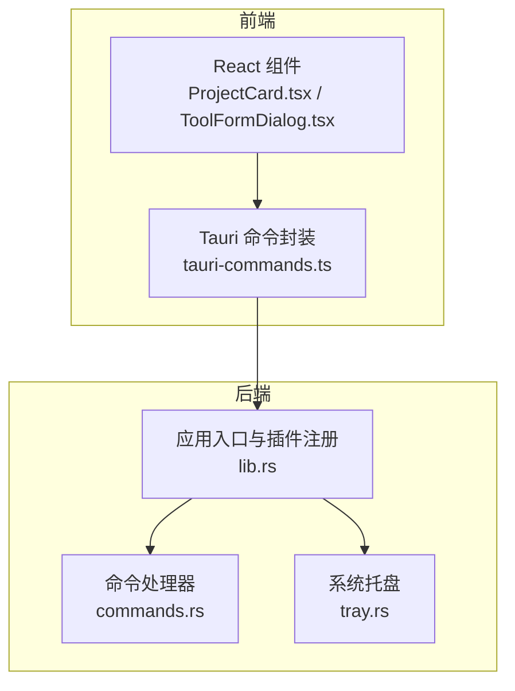
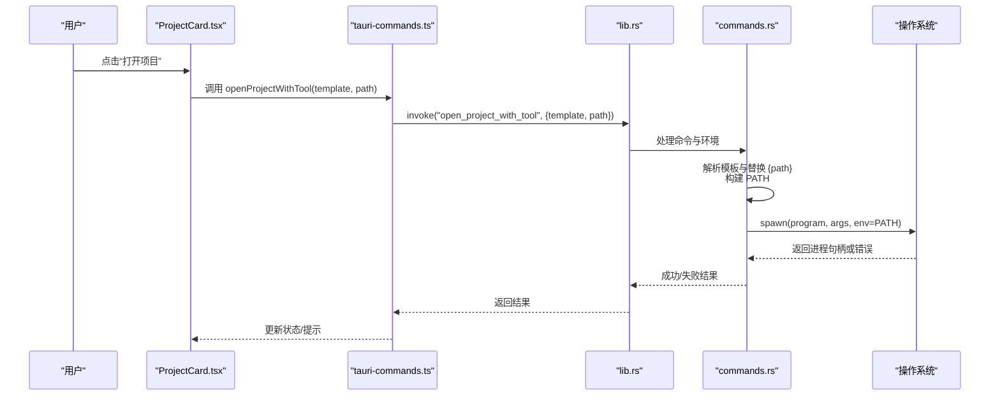
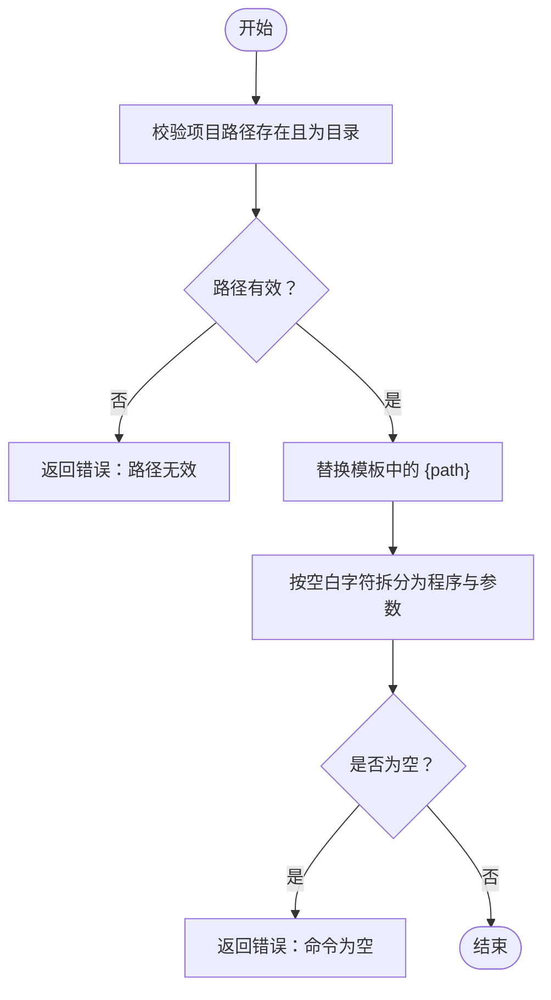
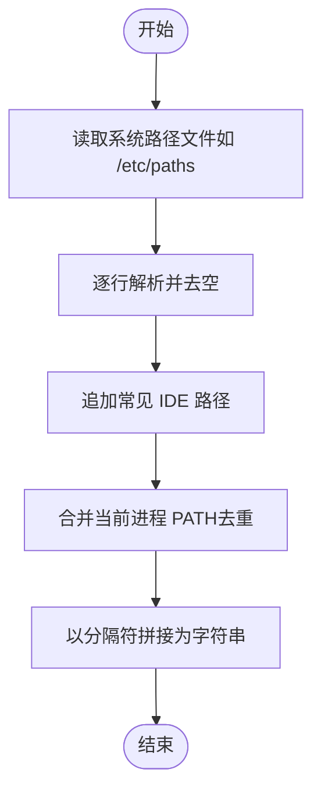
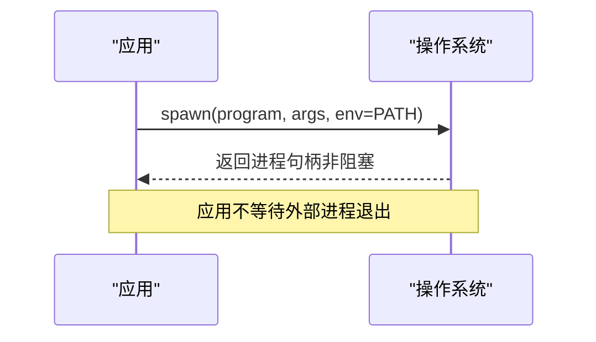
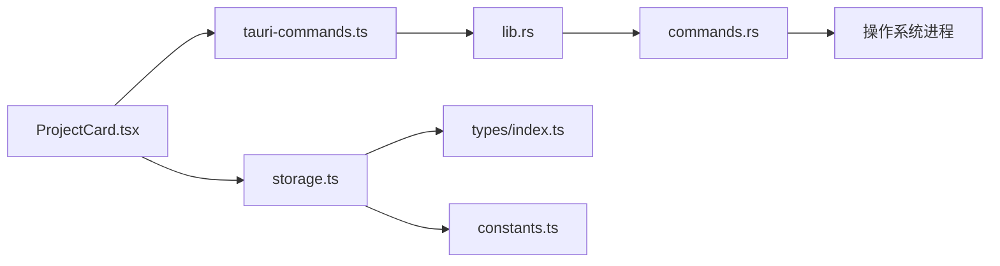
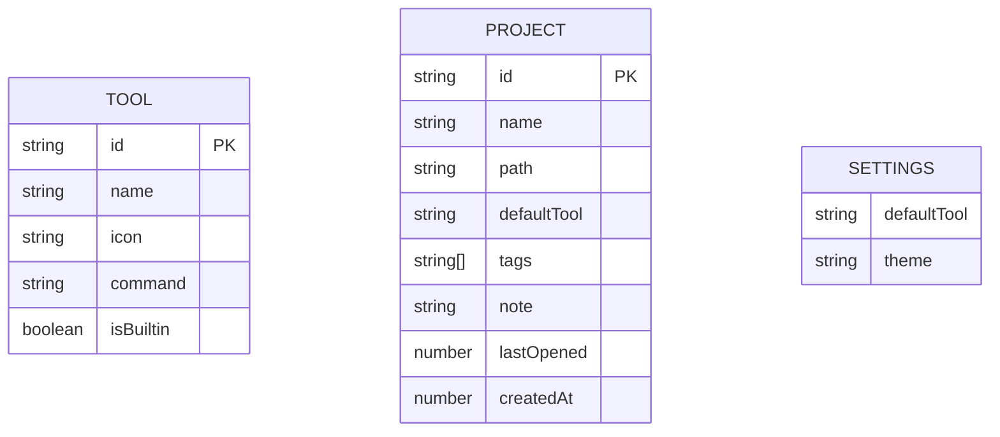

# 进程管理

<cite>
**本文引用的文件**
- [src-tauri/src/main.rs](file://src-tauri/src/main.rs)
- [src-tauri/src/lib.rs](file://src-tauri/src/lib.rs)
- [src-tauri/src/commands.rs](file://src-tauri/src/commands.rs)
- [src-tauri/src/tray.rs](file://src-tauri/src/tray.rs)
- [src/lib/tauri-commands.ts](file://src/lib/tauri-commands.ts)
- [src/components/project/ProjectCard.tsx](file://src/components/project/ProjectCard.tsx)
- [src/components/tool/ToolFormDialog.tsx](file://src/components/tool/ToolFormDialog.tsx)
- [src/lib/constants.ts](file://src/lib/constants.ts)
- [src/lib/storage.ts](file://src/lib/storage.ts)
- [src/stores/useProjectStore.ts](file://src/stores/useProjectStore.ts)
- [src/stores/useToolStore.ts](file://src/stores/useToolStore.ts)
- [src/types/index.ts](file://src/types/index.ts)
- [README.md](file://README.md)
</cite>

## 目录
1. [简介](#简介)
2. [项目结构](#项目结构)
3. [核心组件](#核心组件)
4. [架构总览](#架构总览)
5. [详细组件分析](#详细组件分析)
6. [依赖关系分析](#依赖关系分析)
7. [性能考量](#性能考量)
8. [故障排查指南](#故障排查指南)
9. [结论](#结论)
10. [附录](#附录)

## 简介
本文件聚焦 LaunchPro 的“进程管理”能力，围绕以下目标展开：外部进程启动与命令执行流程、PATH 环境变量构建与系统路径读取逻辑、命令模板解析与参数替换机制、错误处理与异常恢复策略、进程生命周期与资源清理、跨平台差异与适配、进程间通信与信号处理、监控、日志与调试支持，以及安全与权限控制策略。本文所有技术细节均基于仓库中实际代码进行分析与总结。

## 项目结构
LaunchPro 采用前端（React + TypeScript）+ 后端（Rust + Tauri v2）的双层架构。与进程管理直接相关的核心位置如下：
- 前端通过 Tauri 命令调用后端接口，发起外部进程启动请求。
- 后端在 Rust 中实现命令解析、PATH 构建与进程启动，并通过 Tauri Shell 插件与系统交互。
- 工具与项目数据通过本地存储持久化，供 UI 展示与选择使用。

图表来源
- [src-tauri/src/lib.rs:5-26](file://src-tauri/src/lib.rs#L5-L26)
- [src-tauri/src/commands.rs:48-79](file://src-tauri/src/commands.rs#L48-L79)
- [src-tauri/src/tray.rs:8-57](file://src-tauri/src/tray.rs#L8-L57)
- [src/lib/tauri-commands.ts:1-17](file://src/lib/tauri-commands.ts#L1-L17)
- [src/components/project/ProjectCard.tsx:104-134](file://src/components/project/ProjectCard.tsx#L104-L134)

章节来源
- [README.md:115-135](file://README.md#L115-L135)
- [src-tauri/src/lib.rs:5-26](file://src-tauri/src/lib.rs#L5-L26)

## 核心组件
- 命令处理器：负责解析命令模板、替换占位符、构建 PATH 并启动外部进程。
- 前端命令封装：提供统一的 JS 调用入口，屏蔽底层细节。
- 托盘与窗口事件：维持应用生命周期与用户交互。
- 工具与项目存储：提供默认工具集与用户自定义工具，支撑“打开项目”动作。

章节来源
- [src-tauri/src/commands.rs:48-79](file://src-tauri/src/commands.rs#L48-L79)
- [src/lib/tauri-commands.ts:1-17](file://src/lib/tauri-commands.ts#L1-L17)
- [src-tauri/src/tray.rs:8-57](file://src-tauri/src/tray.rs#L8-L57)
- [src/lib/constants.ts:3-18](file://src/lib/constants.ts#L3-L18)
- [src/lib/storage.ts:1-30](file://src/lib/storage.ts#L1-L30)

## 架构总览
下图展示了从 UI 触发到外部进程启动的关键调用链路与职责边界：

图表来源
- [src/components/project/ProjectCard.tsx:104-134](file://src/components/project/ProjectCard.tsx#L104-L134)
- [src/lib/tauri-commands.ts:3-8](file://src/lib/tauri-commands.ts#L3-L8)
- [src-tauri/src/lib.rs:10-14](file://src-tauri/src/lib.rs#L10-L14)
- [src-tauri/src/commands.rs:48-79](file://src-tauri/src/commands.rs#L48-L79)

## 详细组件分析

### 命令模板解析与参数替换
- 模板格式要求：命令模板必须包含占位符 {path}，用于在运行时替换为项目绝对路径。
- 解析步骤：
  1) 校验项目路径存在且为目录。
  2) 将模板中的 {path} 替换为真实路径。
  3) 使用空白字符分割命令为程序名与参数列表。
  4) 若分割后为空，返回错误。
- 参数传递：将解析后的程序名与参数列表传入系统进程启动接口。

图表来源
- [src-tauri/src/commands.rs:49-79](file://src-tauri/src/commands.rs#L49-L79)

章节来源
- [src-tauri/src/commands.rs:49-79](file://src-tauri/src/commands.rs#L49-L79)
- [src/components/tool/ToolFormDialog.tsx:53-56](file://src/components/tool/ToolFormDialog.tsx#L53-L56)

### PATH 环境变量构建与系统路径读取逻辑
- 读取系统标准路径文件：优先尝试读取系统路径配置文件，提取其中的有效路径条目。
- 补充常见 IDE 安装路径：针对 macOS 常见安装位置追加常用二进制目录，避免 IDE CLI 不在默认 PATH 中导致找不到可执行文件。
- 合并当前 PATH：将当前进程的 PATH 作为回退来源，确保兼容性。
- 去重与合并：保证最终 PATH 中无重复项，顺序合理。
- 注入到子进程：在启动外部进程时，显式设置环境变量 PATH，确保外部程序能正确解析可执行文件。

图表来源
- [src-tauri/src/commands.rs:7-46](file://src-tauri/src/commands.rs#L7-L46)

章节来源
- [src-tauri/src/commands.rs:7-46](file://src-tauri/src/commands.rs#L7-L46)

### 进程启动与生命周期管理
- 启动方式：使用系统进程启动接口，传入程序名、参数与构建好的 PATH 环境变量。
- 生命周期：
  - 启动后立即交由操作系统管理，应用不持有阻塞等待的句柄。
  - 应用本身通过托盘与窗口事件维持运行，不参与外部进程的生命周期。
- 资源清理：外部进程退出后由系统回收；应用侧不进行额外清理。

图表来源
- [src-tauri/src/commands.rs:72-76](file://src-tauri/src/commands.rs#L72-L76)

章节来源
- [src-tauri/src/commands.rs:72-76](file://src-tauri/src/commands.rs#L72-L76)
- [src-tauri/src/tray.rs:8-57](file://src-tauri/src/tray.rs#L8-L57)

### 错误处理与异常恢复策略
- 输入校验：
  - 模板必须包含 {path} 占位符，否则拒绝执行。
  - 项目路径必须存在且为目录，否则返回错误。
- 启动失败：
  - 若系统无法启动外部程序，返回可读的错误信息，包含程序名与底层错误描述。
- 前端反馈：
  - 前端通过通知组件展示错误或成功提示，提升用户体验。
- 恢复建议：
  - 检查工具命令模板是否完整；
  - 检查 PATH 构建逻辑是否覆盖到目标可执行文件所在目录；
  - 确认目标程序在当前系统上可用且具备执行权限。

章节来源
- [src-tauri/src/commands.rs:49-79](file://src-tauri/src/commands.rs#L49-L79)
- [src/components/tool/ToolFormDialog.tsx:53-56](file://src/components/tool/ToolFormDialog.tsx#L53-L56)

### 进程间通信与信号处理
- 当前实现：
  - 应用与外部进程之间无双向通信通道；应用仅负责触发启动。
  - 应用未实现对子进程的信号处理或状态轮询。
- 可扩展方向（建议）：
  - 引入子进程句柄与事件监听，实现进程状态上报与日志采集。
  - 在需要时向外部进程发送信号（如终止），需谨慎评估平台差异与权限。

章节来源
- [src-tauri/src/commands.rs:72-76](file://src-tauri/src/commands.rs#L72-L76)

### 监控、日志记录与调试支持
- 监控现状：
  - 应用未内置外部进程监控与统计。
- 日志与调试：
  - 后端启动失败会返回错误信息，前端可据此进行提示。
  - 建议在开发阶段结合系统日志与终端输出定位问题。
- 建议增强（可选）：
  - 记录最近一次启动时间与结果；
  - 提供“查看日志”能力，收集外部进程的标准输出/错误输出。

章节来源
- [src-tauri/src/commands.rs:72-76](file://src-tauri/src/commands.rs#L72-L76)

### 跨平台差异与适配方案
- 当前实现关注 macOS 特定路径文件与常见安装位置，以提升 IDE CLI 的可用性。
- 通用建议：
  - 在 Windows 上，应考虑系统 PATH 与注册表路径的读取；
  - 在 Linux 上，应考虑 /etc/profile.d/* 与 ~/.bashrc 等动态注入的 PATH。
- 适配策略：
  - 针对不同平台分别构建 PATH；
  - 允许用户在工具命令中指定完整可执行文件路径，绕过 PATH 查找；
  - 对于跨平台工具，提供多平台命令模板选项。

章节来源
- [src-tauri/src/commands.rs:7-46](file://src-tauri/src/commands.rs#L7-L46)

### 安全考虑与权限控制
- 权限最小化：
  - 仅在必要时注入 PATH 环境变量，避免扩大攻击面。
- 输入验证：
  - 严格校验模板与路径，防止注入非法命令。
- 可信来源：
  - 默认工具集合来自内置预设，用户自定义工具需自行确认安全性。
- 最佳实践：
  - 避免在模板中拼接未经转义的用户输入；
  - 对外部可执行文件进行存在性与可执行性检查（可在模板外层增加校验）。

章节来源
- [src-tauri/src/commands.rs:49-79](file://src-tauri/src/commands.rs#L49-L79)
- [src/lib/constants.ts:3-18](file://src/lib/constants.ts#L3-L18)

## 依赖关系分析
- 前端到后端：通过 Tauri 命令桥接，调用后端命令处理器。
- 后端到系统：通过进程启动接口与 PATH 环境变量完成外部程序启动。
- 数据层：工具与项目数据通过本地存储持久化，供 UI 选择与展示。

图表来源
- [src/components/project/ProjectCard.tsx:104-134](file://src/components/project/ProjectCard.tsx#L104-L134)
- [src/lib/tauri-commands.ts:1-17](file://src/lib/tauri-commands.ts#L1-L17)
- [src-tauri/src/lib.rs:10-14](file://src-tauri/src/lib.rs#L10-L14)
- [src-tauri/src/commands.rs:72-76](file://src-tauri/src/commands.rs#L72-L76)
- [src/lib/storage.ts:1-30](file://src/lib/storage.ts#L1-L30)
- [src/types/index.ts:1-26](file://src/types/index.ts#L1-L26)
- [src/lib/constants.ts:3-18](file://src/lib/constants.ts#L3-L18)

章节来源
- [src-tauri/src/lib.rs:10-14](file://src-tauri/src/lib.rs#L10-L14)
- [src-tauri/src/commands.rs:72-76](file://src-tauri/src/commands.rs#L72-L76)
- [src/lib/storage.ts:1-30](file://src/lib/storage.ts#L1-L30)

## 性能考量
- 启动延迟：命令解析与 PATH 构建开销极低，主要耗时在外部程序自身。
- 资源占用：应用不常驻等待外部进程，内存与 CPU 占用保持稳定。
- 建议：
  - 对频繁使用的工具，尽量使用短命令与精简 PATH；
  - 避免在模板中拼接大量参数，减少外部程序启动时的解析负担。

## 故障排查指南
- 常见问题与定位步骤：
  - “命令为空”：检查模板是否包含 {path}。
  - “路径不存在或不是目录”：确认项目路径正确且存在。
  - “无法执行程序”：检查 PATH 是否包含目标可执行文件所在目录；确认程序具备执行权限。
- 前端提示：
  - 使用通知组件展示错误信息，便于用户快速定位问题。
- 后续优化：
  - 增加启动前的可执行性检测；
  - 提供“查看日志”能力，帮助诊断外部程序启动失败原因。

章节来源
- [src-tauri/src/commands.rs:49-79](file://src-tauri/src/commands.rs#L49-L79)
- [src/components/tool/ToolFormDialog.tsx:53-56](file://src/components/tool/ToolFormDialog.tsx#L53-L56)

## 结论
LaunchPro 的进程管理以简洁可靠为核心：通过严格的模板校验、稳健的 PATH 构建与系统启动接口，实现了跨平台的一键打开体验。当前实现专注于“启动即走”，未引入复杂的进程监控与通信机制。未来可在不影响现有稳定性的前提下，逐步增强日志、监控与信号处理能力，进一步提升可观测性与可控性。

## 附录
- 关键数据模型与存储
  - 工具与项目的数据结构定义与默认值来源。
  - 本地存储初始化与自动保存策略。

图表来源
- [src/types/index.ts:12-23](file://src/types/index.ts#L12-L23)
- [src/lib/constants.ts:3-18](file://src/lib/constants.ts#L3-L18)
- [src/lib/storage.ts:4-17](file://src/lib/storage.ts#L4-L17)

章节来源
- [src/types/index.ts:1-26](file://src/types/index.ts#L1-L26)
- [src/lib/constants.ts:3-18](file://src/lib/constants.ts#L3-L18)
- [src/lib/storage.ts:1-30](file://src/lib/storage.ts#L1-L30)