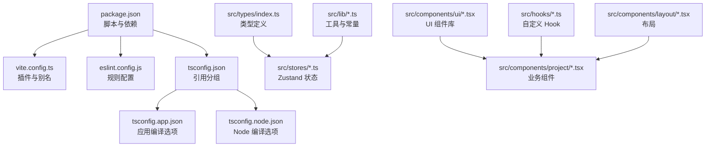
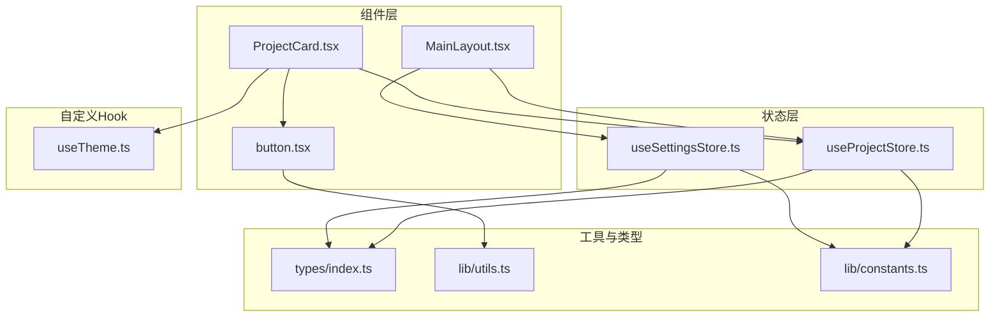
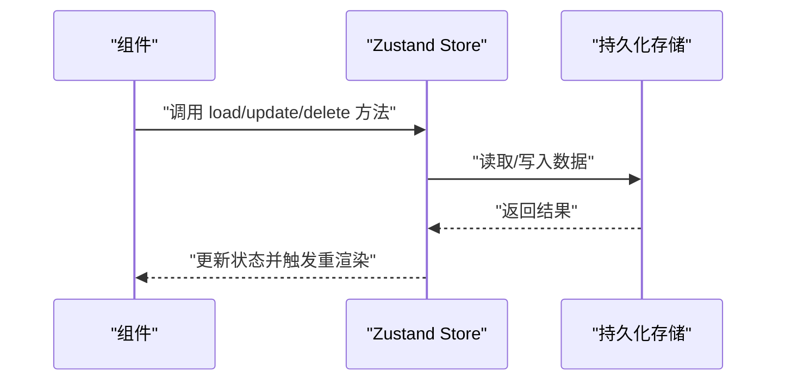
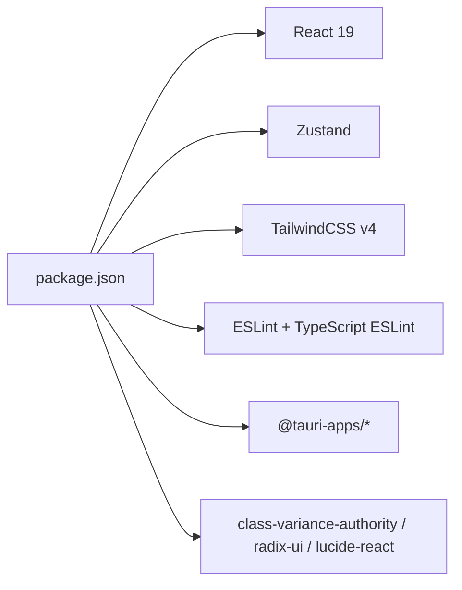

# 代码规范与质量

<cite>
**本文引用的文件**
- [eslint.config.js](file://eslint.config.js)
- [package.json](file://package.json)
- [tsconfig.json](file://tsconfig.json)
- [tsconfig.app.json](file://tsconfig.app.json)
- [tsconfig.node.json](file://tsconfig.node.json)
- [vite.config.ts](file://vite.config.ts)
- [src/types/index.ts](file://src/types/index.ts)
- [src/lib/constants.ts](file://src/lib/constants.ts)
- [src/lib/utils.ts](file://src/lib/utils.ts)
- [src/stores/useProjectStore.ts](file://src/stores/useProjectStore.ts)
- [src/stores/useSettingsStore.ts](file://src/stores/useSettingsStore.ts)
- [src/components/ui/button.tsx](file://src/components/ui/button.tsx)
- [src/components/project/ProjectCard.tsx](file://src/components/project/ProjectCard.tsx)
- [src/components/layout/MainLayout.tsx](file://src/components/layout/MainLayout.tsx)
- [src/hooks/useTheme.ts](file://src/hooks/useTheme.ts)
- [.github/workflows/release.yml](file://.github/workflows/release.yml)
</cite>

## 目录
1. 引言
2. 项目结构
3. 核心组件
4. 架构总览
5. 详细组件分析
6. 依赖分析
7. 性能考虑
8. 故障排查指南
9. 结论
10. 附录

## 引言
本文件为 LaunchPro 的代码规范与质量标准文档，覆盖 TypeScript 编码规范、命名约定、类型定义最佳实践；ESLint 规则与代码格式化现状；Git 提交规范建议；组件设计原则、状态管理规范与文件组织结构；代码审查检查清单、静态分析工具使用与持续集成配置建议；以及代码重构指南、性能优化建议与安全编码实践。本文所有技术结论均基于仓库现有配置与代码实现进行提炼与总结。

## 项目结构
项目采用前端 Vite + React + TypeScript 技术栈，结合 Zustand 状态管理与 TailwindCSS 样式体系。TypeScript 配置分应用与 Node 两类环境，Vite 提供开发服务器与构建能力，并通过别名简化路径引用。ESLint 作为统一的代码质量工具，配合脚本在本地与 CI 中执行。

图示来源
- [package.json:1-48](file://package.json#L1-L48)
- [vite.config.ts:1-32](file://vite.config.ts#L1-L32)
- [eslint.config.js:1-24](file://eslint.config.js#L1-L24)
- [tsconfig.json:1-8](file://tsconfig.json#L1-L8)
- [tsconfig.app.json:1-33](file://tsconfig.app.json#L1-L33)
- [tsconfig.node.json:1-27](file://tsconfig.node.json#L1-L27)
- [src/types/index.ts:1-26](file://src/types/index.ts#L1-L26)

章节来源
- [package.json:1-48](file://package.json#L1-L48)
- [vite.config.ts:1-32](file://vite.config.ts#L1-L32)
- [tsconfig.json:1-8](file://tsconfig.json#L1-L8)
- [tsconfig.app.json:1-33](file://tsconfig.app.json#L1-L33)
- [tsconfig.node.json:1-27](file://tsconfig.node.json#L1-L27)
- [eslint.config.js:1-24](file://eslint.config.js#L1-L24)

## 核心组件
- 类型系统：集中于 src/types/index.ts，定义了项目、工具、设置与活动视图等核心类型，确保跨模块一致的数据契约。
- 状态管理：采用 Zustand，分别在 src/stores 下维护项目、设置、工具与 UI 状态，提供加载、增删改查与持久化操作。
- UI 组件：基于 class-variance-authority 与 radix-ui，提供可变样式与语义化结构，如按钮、卡片、输入框等。
- 工具与常量：src/lib/constants.ts 定义内置工具列表与默认设置；src/lib/utils.ts 提供类名合并工具。
- 自定义 Hook：如主题切换逻辑封装在 src/hooks/useTheme.ts，便于复用与测试。
- 布局与页面：MainLayout 根据 UIStore 切换不同视图，承载项目列表、工具列表与设置页。

章节来源
- [src/types/index.ts:1-26](file://src/types/index.ts#L1-L26)
- [src/stores/useProjectStore.ts:1-67](file://src/stores/useProjectStore.ts#L1-L67)
- [src/stores/useSettingsStore.ts:1-34](file://src/stores/useSettingsStore.ts#L1-L34)
- [src/components/ui/button.tsx:1-65](file://src/components/ui/button.tsx#L1-L65)
- [src/lib/constants.ts:1-23](file://src/lib/constants.ts#L1-L23)
- [src/lib/utils.ts:1-7](file://src/lib/utils.ts#L1-L7)
- [src/hooks/useTheme.ts:1-37](file://src/hooks/useTheme.ts#L1-L37)
- [src/components/layout/MainLayout.tsx:1-21](file://src/components/layout/MainLayout.tsx#L1-L21)

## 架构总览
下图展示前端架构中关键模块的交互关系：组件层消费状态层数据，状态层通过存储工具访问持久化存储；UI 组件库提供通用能力；布局根据当前视图渲染对应页面。

图示来源
- [src/components/layout/MainLayout.tsx:1-21](file://src/components/layout/MainLayout.tsx#L1-L21)
- [src/components/project/ProjectCard.tsx:1-174](file://src/components/project/ProjectCard.tsx#L1-L174)
- [src/components/ui/button.tsx:1-65](file://src/components/ui/button.tsx#L1-L65)
- [src/stores/useProjectStore.ts:1-67](file://src/stores/useProjectStore.ts#L1-L67)
- [src/stores/useSettingsStore.ts:1-34](file://src/stores/useSettingsStore.ts#L1-L34)
- [src/types/index.ts:1-26](file://src/types/index.ts#L1-L26)
- [src/lib/utils.ts:1-7](file://src/lib/utils.ts#L1-L7)
- [src/lib/constants.ts:1-23](file://src/lib/constants.ts#L1-L23)
- [src/hooks/useTheme.ts:1-37](file://src/hooks/useTheme.ts#L1-L37)

## 详细组件分析

### TypeScript 编码规范与类型定义最佳实践
- 严格模式与无用项检查：应用与 Node 配置均启用严格模式与未使用局部变量/参数检查，减少潜在错误与冗余代码。
- 路径别名与模块解析：通过 baseUrl 与 paths 配置统一使用 @/* 路径前缀，提升可读性与可维护性。
- 类型集中管理：核心类型集中在 src/types/index.ts，避免分散重复定义，增强跨模块一致性。
- 可选字段与只读属性：对可能缺失或不应被外部修改的字段使用可选与只读策略，降低副作用风险。
- 类型推导与显式声明：在状态与工具函数中优先利用类型推导，同时对公共接口保持显式类型声明，保证 API 明确性。

章节来源
- [tsconfig.app.json:19-30](file://tsconfig.app.json#L19-L30)
- [tsconfig.node.json:17-24](file://tsconfig.node.json#L17-L24)
- [src/types/index.ts:1-26](file://src/types/index.ts#L1-L26)

### ESLint 规则与代码质量现状
- 推荐规则集：已启用官方推荐规则、React Hooks 推荐规则、React Refresh 适配与 TypeScript ESLint 推荐配置，形成基础质量保障。
- 语言环境：浏览器全局变量启用，符合前端运行时环境。
- 执行入口：通过 npm scripts 暴露 lint 脚本，可在本地与 CI 中统一执行。

章节来源
- [eslint.config.js:8-23](file://eslint.config.js#L8-L23)
- [package.json:6-12](file://package.json#L6-L12)

### 组件设计原则
- 单一职责：每个组件聚焦一个功能点（如按钮、卡片、侧边栏），便于测试与复用。
- 变体与尺寸：通过 class-variance-authority 提供统一的变体与尺寸体系，减少重复样式分支。
- 无障碍与可访问性：使用语义化标签与合适的事件处理，结合 Tooltip 等组件提升可用性。
- 可组合性：支持 asChild 模式与透传 props，增强与其他 UI 组件的组合能力。

章节来源
- [src/components/ui/button.tsx:1-65](file://src/components/ui/button.tsx#L1-L65)

### 状态管理规范（Zustand）
- 存储职责分离：项目、设置、工具与 UI 状态分别独立管理，降低耦合度。
- 异步加载与错误兜底：加载阶段设置 isLoading，异常时回退到默认值，保证界面稳定性。
- 持久化策略：通过存储工具写入/读取键值，实现本地持久化，避免刷新丢失。
- 计算与派生：在组件中按需选择状态片段，避免不必要的重渲染。

图示来源
- [src/stores/useProjectStore.ts:16-66](file://src/stores/useProjectStore.ts#L16-L66)
- [src/stores/useSettingsStore.ts:13-33](file://src/stores/useSettingsStore.ts#L13-L33)

章节来源
- [src/stores/useProjectStore.ts:1-67](file://src/stores/useProjectStore.ts#L1-L67)
- [src/stores/useSettingsStore.ts:1-34](file://src/stores/useSettingsStore.ts#L1-L34)

### 文件组织结构与命名约定
- 目录划分：components（UI 组件与业务组件）、hooks（自定义 Hook）、lib（工具与常量）、stores（状态）、types（类型）、assets（资源）。
- 组件命名：采用帕斯卡命名法（如 ProjectCard），文件名与导出组件一致。
- 路径别名：统一使用 @/ 前缀，缩短相对路径，提升可读性。
- 常量与工具：constants.ts 与 utils.ts 分离职责，常量集中定义，工具函数纯函数化。

章节来源
- [vite.config.ts:10-14](file://vite.config.ts#L10-L14)
- [src/lib/constants.ts:1-23](file://src/lib/constants.ts#L1-L23)
- [src/lib/utils.ts:1-7](file://src/lib/utils.ts#L1-L7)

### 代码审查检查清单
- 类型安全：是否使用明确的类型声明与严格的编译选项；是否存在未使用的局部变量/参数。
- 状态管理：异步操作是否有错误兜底；是否正确地进行持久化；状态选择是否最小化。
- 组件设计：是否遵循单一职责；变体与尺寸是否统一；可组合性与可访问性是否满足。
- 命名与结构：文件与组件命名是否一致；路径别名是否统一使用 @/；目录结构是否清晰。
- 质量工具：ESLint 是否通过；是否存在未修复的警告或错误；提交前是否执行了 lint。

章节来源
- [tsconfig.app.json:19-30](file://tsconfig.app.json#L19-L30)
- [tsconfig.node.json:17-24](file://tsconfig.node.json#L17-L24)
- [eslint.config.js:8-23](file://eslint.config.js#L8-L23)

### 静态分析工具使用与持续集成配置
- 本地执行：通过 npm scripts 调用 ESLint 进行静态检查。
- CI 建议：在 CI 流程中增加安装依赖、类型检查与 ESLint 步骤，确保主干分支质量。
- 发布流程：仓库包含 release.yml，建议在此工作流中集成质量门禁步骤。

章节来源
- [package.json:6-12](file://package.json#L6-L12)
- [.github/workflows/release.yml](file://.github/workflows/release.yml)

### Git 提交规范（建议）
- 规范风格：采用 feat、fix、docs、style、refactor、test、chore 等类型前缀，配合简明描述。
- 冲突解决：提交前先执行 lint 与类型检查，避免引入新问题。
- 合并与审查：在合并前确保 CI 通过，代码审查关注类型安全、状态管理与可维护性。

## 依赖分析
- 前端框架与运行时：React 19、Vite、TailwindCSS v4。
- 状态管理：Zustand。
- UI 基础：class-variance-authority、clsx、tailwind-merge、radix-ui、lucide-react。
- 平台集成：@tauri-apps/api、@tauri-apps/plugin-*。
- 开发工具：ESLint、TypeScript、TypeScript ESLint。

图示来源
- [package.json:13-29](file://package.json#L13-L29)
- [package.json:30-46](file://package.json#L30-L46)

章节来源
- [package.json:1-48](file://package.json#L1-L48)

## 性能考虑
- 渲染优化：组件按需选择状态片段，避免全量重渲染；按钮等通用组件使用变体与尺寸统一管理，减少条件分支。
- 异步加载：状态加载阶段设置 isLoading，避免空数组导致的无效渲染。
- 路径别名：统一 @/ 前缀减少层级跳转，提升构建与热更新效率。
- 严格编译选项：开启严格模式与未使用项检查，提前发现潜在性能隐患与内存泄漏点。

章节来源
- [src/stores/useProjectStore.ts:16-28](file://src/stores/useProjectStore.ts#L16-L28)
- [src/stores/useSettingsStore.ts:13-25](file://src/stores/useSettingsStore.ts#L13-L25)
- [vite.config.ts:10-14](file://vite.config.ts#L10-L14)
- [tsconfig.app.json:19-30](file://tsconfig.app.json#L19-L30)
- [tsconfig.node.json:17-24](file://tsconfig.node.json#L17-L24)

## 故障排查指南
- ESLint 失败：确认本地已安装依赖并执行 lint 脚本；检查规则配置是否与团队约定一致。
- 类型错误：启用严格模式后，优先修复未使用局部变量/参数与未覆盖的分支；核对类型定义是否与实际数据一致。
- 状态不更新：检查状态选择器是否正确；确认异步操作的错误兜底与持久化写入是否成功。
- 主题切换异常：useTheme 中根据系统偏好动态切换 dark 类，检查媒体查询事件绑定与清理逻辑。

章节来源
- [eslint.config.js:8-23](file://eslint.config.js#L8-L23)
- [package.json:6-12](file://package.json#L6-L12)
- [src/hooks/useTheme.ts:8-29](file://src/hooks/useTheme.ts#L8-L29)

## 结论
本项目在 TypeScript 严格模式、Zustand 状态管理与 UI 组件库方面具备良好基础。建议在现有基础上完善 ESLint 规则细化、补充 Git 提交规范与 CI 质量门禁，并持续优化组件与状态的可维护性与性能表现。通过统一的类型定义、清晰的文件组织与严格的代码审查流程，进一步提升整体代码质量与协作效率。

## 附录

### TypeScript 编码规范要点
- 使用严格模式与未使用项检查，减少隐式错误。
- 对外暴露的接口保持显式类型声明，内部实现可依赖推导。
- 可选字段与只读属性用于表达数据约束，降低副作用。
- 路径别名统一使用 @/ 前缀，提升可读性与可移植性。

章节来源
- [tsconfig.app.json:19-30](file://tsconfig.app.json#L19-L30)
- [tsconfig.node.json:17-24](file://tsconfig.node.json#L17-L24)
- [vite.config.ts:10-14](file://vite.config.ts#L10-L14)

### ESLint 规则配置要点
- 已启用官方推荐规则、React Hooks 推荐规则、React Refresh 适配与 TypeScript ESLint 推荐配置。
- 语言环境为浏览器，符合前端运行时需求。
- 通过 npm scripts 暴露 lint 能力，便于本地与 CI 执行。

章节来源
- [eslint.config.js:8-23](file://eslint.config.js#L8-L23)
- [package.json:6-12](file://package.json#L6-L12)

### 组件设计与 UI 最佳实践
- 使用 class-variance-authority 提供统一变体与尺寸体系。
- 支持 asChild 模式与透传 props，增强可组合性。
- 语义化标签与无障碍属性，结合 Tooltip 等组件提升可用性。

章节来源
- [src/components/ui/button.tsx:1-65](file://src/components/ui/button.tsx#L1-L65)

### 状态管理与持久化
- 加载阶段设置 isLoading，异常时回退默认值，保证界面稳定。
- 异步操作完成后同步持久化，避免刷新丢失。
- 在组件中按需选择状态片段，减少重渲染。

章节来源
- [src/stores/useProjectStore.ts:16-66](file://src/stores/useProjectStore.ts#L16-L66)
- [src/stores/useSettingsStore.ts:13-33](file://src/stores/useSettingsStore.ts#L13-L33)

### 文件组织与命名约定
- 目录划分清晰：components、hooks、lib、stores、types、assets。
- 组件采用帕斯卡命名法，文件名与导出组件一致。
- 路径别名统一使用 @/ 前缀，缩短相对路径。

章节来源
- [vite.config.ts:10-14](file://vite.config.ts#L10-L14)

### 代码审查检查清单（摘要）
- 类型安全：严格模式与未使用项检查通过。
- 状态管理：异步加载与错误兜底完善，持久化写入成功。
- 组件设计：单一职责、变体与尺寸统一、可组合性良好。
- 命名与结构：文件与组件命名一致，路径别名统一。
- 质量工具：ESLint 通过，无新增警告或错误。

章节来源
- [tsconfig.app.json:19-30](file://tsconfig.app.json#L19-L30)
- [tsconfig.node.json:17-24](file://tsconfig.node.json#L17-L24)
- [eslint.config.js:8-23](file://eslint.config.js#L8-L23)

### 静态分析与持续集成建议
- 本地：执行 npm run lint 与 tsc --noEmit。
- CI：安装依赖 → 类型检查 → ESLint → 构建产物校验。
- 发布：在 release.yml 中集成上述步骤，确保主干分支质量。

章节来源
- [package.json:6-12](file://package.json#L6-L12)
- [.github/workflows/release.yml](file://.github/workflows/release.yml)