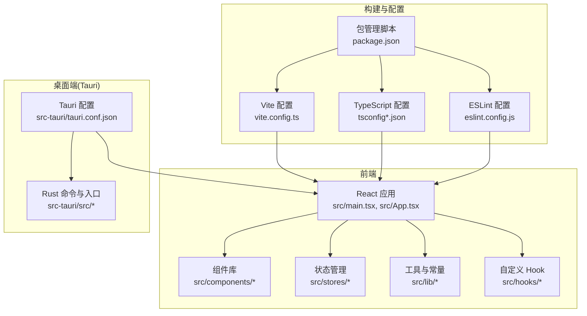
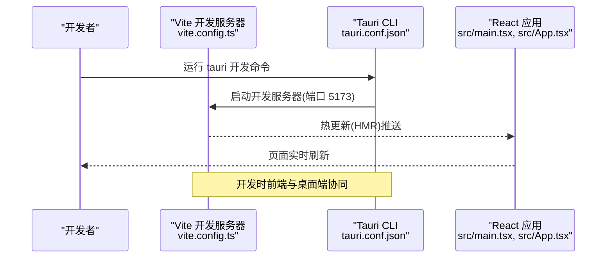
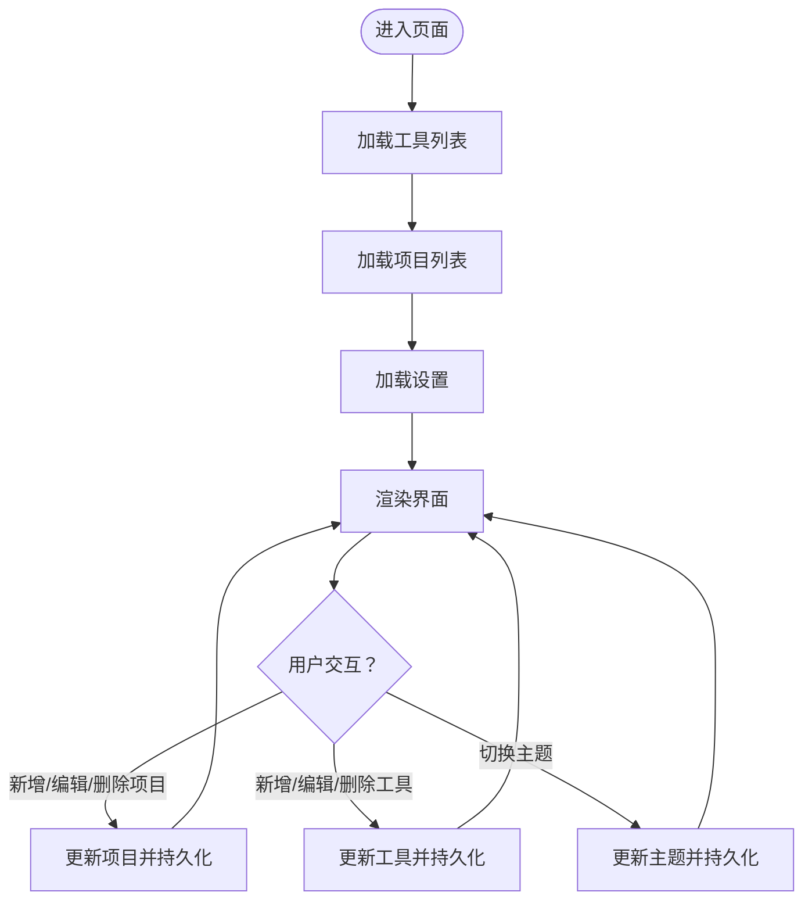
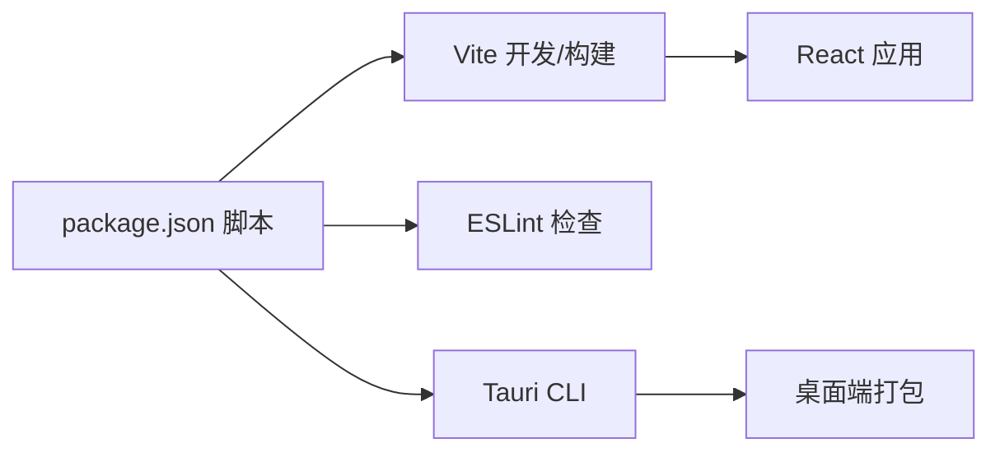

# 开发指南

<cite>
**本文引用的文件**
- [package.json](file://package.json)
- [vite.config.ts](file://vite.config.ts)
- [eslint.config.js](file://eslint.config.js)
- [tsconfig.json](file://tsconfig.json)
- [tsconfig.app.json](file://tsconfig.app.json)
- [tsconfig.node.json](file://tsconfig.node.json)
- [src-tauri/tauri.conf.json](file://src-tauri/tauri.conf.json)
- [src/main.tsx](file://src/main.tsx)
- [src/App.tsx](file://src/App.tsx)
- [src/lib/constants.ts](file://src/lib/constants.ts)
- [src/lib/utils.ts](file://src/lib/utils.ts)
- [src/stores/useProjectStore.ts](file://src/stores/useProjectStore.ts)
- [src/stores/useToolStore.ts](file://src/stores/useToolStore.ts)
- [src/hooks/useTheme.ts](file://src/hooks/useTheme.ts)
- [src/components/layout/MainLayout.tsx](file://src/components/layout/MainLayout.tsx)
- [.github/workflows/release.yml](file://.github/workflows/release.yml)
</cite>

## 目录
1. [简介](#简介)
2. [项目结构](#项目结构)
3. [核心组件](#核心组件)
4. [架构总览](#架构总览)
5. [详细组件分析](#详细组件分析)
6. [依赖分析](#依赖分析)
7. [性能考虑](#性能考虑)
8. [故障排除指南](#故障排除指南)
9. [结论](#结论)
10. [附录](#附录)

## 简介
本开发指南面向 LaunchPro 项目的开发者，提供从环境搭建、工具链配置、代码规范与项目结构最佳实践，到 TypeScript、ESLint、Vite 构建配置、调试与热重载、测试策略、代码审查与版本控制、性能分析与优化、多平台打包与发布等全栈开发流程的系统性说明。文档同时结合仓库中现有配置文件与核心源码，给出可操作的步骤与参考路径。

## 项目结构
项目采用前端与桌面端（Tauri）混合架构：React 前端通过 Vite 进行开发与构建；后端能力由 Tauri 提供，通过 Rust 实现命令与系统交互；TypeScript 负责类型安全与严格编译选项；ESLint 保障代码质量；TailwindCSS 提供样式基础。

图表来源
- [src/main.tsx:1-11](file://src/main.tsx#L1-L11)
- [src/App.tsx:1-40](file://src/App.tsx#L1-L40)
- [vite.config.ts:1-32](file://vite.config.ts#L1-L32)
- [tsconfig.app.json:1-33](file://tsconfig.app.json#L1-L33)
- [eslint.config.js:1-24](file://eslint.config.js#L1-L24)
- [package.json:1-48](file://package.json#L1-L48)
- [src-tauri/tauri.conf.json:1-44](file://src-tauri/tauri.conf.json#L1-L44)

章节来源
- [package.json:1-48](file://package.json#L1-L48)
- [vite.config.ts:1-32](file://vite.config.ts#L1-L32)
- [tsconfig.json:1-8](file://tsconfig.json#L1-L8)
- [tsconfig.app.json:1-33](file://tsconfig.app.json#L1-L33)
- [tsconfig.node.json:1-27](file://tsconfig.node.json#L1-L27)
- [eslint.config.js:1-24](file://eslint.config.js#L1-L24)
- [src-tauri/tauri.conf.json:1-44](file://src-tauri/tauri.conf.json#L1-L44)

## 核心组件
- 应用入口与初始化：React 根节点挂载与应用渲染逻辑集中在入口文件中，确保在严格模式下运行。
- 应用主组件：负责全局副作用（加载项目、工具、设置），以及主题提供器与通知组件的注入。
- 存储与状态：基于 Zustand 的轻量状态管理，分别维护项目、工具与设置数据，并通过统一的存储接口持久化。
- 主布局与视图切换：侧边栏与内容区根据 UI 状态切换不同视图（项目、工具、设置）。
- 工具与常量：内置工具列表与默认设置集中管理，便于扩展与迁移。
- 主题 Hook：根据设置与系统偏好动态切换明暗主题。
- 工具函数：类名合并与样式合并工具，统一 UI 组件的样式拼接。

章节来源
- [src/main.tsx:1-11](file://src/main.tsx#L1-L11)
- [src/App.tsx:1-40](file://src/App.tsx#L1-L40)
- [src/stores/useProjectStore.ts:1-67](file://src/stores/useProjectStore.ts#L1-L67)
- [src/stores/useToolStore.ts:1-75](file://src/stores/useToolStore.ts#L1-L75)
- [src/components/layout/MainLayout.tsx:1-21](file://src/components/layout/MainLayout.tsx#L1-L21)
- [src/lib/constants.ts:1-23](file://src/lib/constants.ts#L1-L23)
- [src/hooks/useTheme.ts:1-37](file://src/hooks/useTheme.ts#L1-L37)
- [src/lib/utils.ts:1-7](file://src/lib/utils.ts#L1-L7)

## 架构总览
前端通过 Vite 启动开发服务器，Tauri 在开发前自动启动前端服务；生产构建时先进行 TypeScript 编译，再由 Vite 打包前端资源；Tauri 配置将前端产物作为桌面端应用的静态资源。ESLint 与 TypeScript 严格配置共同保证代码质量与类型安全。

图表来源
- [vite.config.ts:16-30](file://vite.config.ts#L16-L30)
- [src-tauri/tauri.conf.json:5-10](file://src-tauri/tauri.conf.json#L5-L10)
- [src/main.tsx:1-11](file://src/main.tsx#L1-L11)
- [src/App.tsx:1-40](file://src/App.tsx#L1-L40)

## 详细组件分析

### TypeScript 配置与类型体系
- 多配置分层：根配置聚合应用与 Node 环境两套 TS 配置，分别约束应用代码与构建配置。
- 应用配置：启用严格模式、未使用变量/参数检查、不可达 switch 检查、仅可擦除语法等，提升类型安全。
- Node 配置：限定构建与 Vite 配置文件的类型支持，避免误用。
- 路径别名：统一使用 @/* 映射至 src，便于跨目录引用。

章节来源
- [tsconfig.json:1-8](file://tsconfig.json#L1-L8)
- [tsconfig.app.json:1-33](file://tsconfig.app.json#L1-L33)
- [tsconfig.node.json:1-27](file://tsconfig.node.json#L1-L27)

### ESLint 与代码规范
- 推荐规则集：启用 JS/TS 推荐规则、React Hooks 推荐规则、React Refresh 支持与浏览器全局变量。
- 文件范围：对所有 TS/TSX 文件生效，确保一致的风格与潜在问题的早期发现。
- 与 Vite 协同：ESLint 配置与 Vite 的 React 插件形成开发期校验闭环。

章节来源
- [eslint.config.js:1-24](file://eslint.config.js#L1-L24)
- [package.json:30-46](file://package.json#L30-L46)

### Vite 开发与热重载
- 别名与解析：通过 @ 指向 src，简化导入路径。
- 开发服务器：固定端口与严格端口策略，支持主机绑定与 HMR；当指定主机时启用 WebSocket HMR。
- 屏幕清理关闭：避免频繁清屏影响开发体验。
- 监视忽略：排除 Tauri 目录，减少不必要的文件监听开销。

章节来源
- [vite.config.ts:1-32](file://vite.config.ts#L1-L32)

### Tauri 集成与桌面端配置
- 开发与构建流程：开发前命令自动执行前端 dev，构建前命令执行前端 build；前端产物目录指向 dist。
- 应用窗口：默认窗口尺寸、最小尺寸、居中显示与装饰。
- 托盘图标：托盘图标路径与模板设置。
- 打包：启用打包并针对全部目标平台生成安装包，包含多尺寸图标与 macOS 最低系统版本声明。

章节来源
- [src-tauri/tauri.conf.json:1-44](file://src-tauri/tauri.conf.json#L1-L44)

### 应用入口与生命周期
- 入口挂载：在 index.html 的 root 容器中渲染 React 应用。
- 应用初始化：在 App 中触发工具、项目与设置的加载副作用，确保应用启动即具备数据。

章节来源
- [src/main.tsx:1-11](file://src/main.tsx#L1-L11)
- [src/App.tsx:21-37](file://src/App.tsx#L21-L37)

### 状态管理与数据流
- 项目存储：封装加载、新增、更新、删除与最近打开时间更新，统一写入持久化存储。
- 工具存储：首次启动初始化内置工具，后续合并用户自定义工具，禁止删除内置工具。
- 数据一致性：每次变更均同步写回持久化存储，保证重启后数据不丢失。

图表来源
- [src/App.tsx:21-37](file://src/App.tsx#L21-L37)
- [src/stores/useProjectStore.ts:20-65](file://src/stores/useProjectStore.ts#L20-L65)
- [src/stores/useToolStore.ts:21-69](file://src/stores/useToolStore.ts#L21-L69)
- [src/hooks/useTheme.ts:31-33](file://src/hooks/useTheme.ts#L31-L33)

章节来源
- [src/stores/useProjectStore.ts:1-67](file://src/stores/useProjectStore.ts#L1-L67)
- [src/stores/useToolStore.ts:1-75](file://src/stores/useToolStore.ts#L1-L75)

### 主题与 UI 提示
- 主题切换：根据设置值添加或移除 dark 类，系统模式下监听系统配色变化。
- 通知组件：底部右侾示例位置展示通知，支持丰富色彩与关闭按钮。

章节来源
- [src/hooks/useTheme.ts:1-37](file://src/hooks/useTheme.ts#L1-L37)
- [src/App.tsx:10-18](file://src/App.tsx#L10-L18)

### 布局与视图切换
- 主布局：左侧侧边栏，右侧内容区根据 UI 状态切换项目、工具或设置视图。
- 视图状态：由 UI 状态管理器维护，实现无路由的单页应用视图切换。

章节来源
- [src/components/layout/MainLayout.tsx:1-21](file://src/components/layout/MainLayout.tsx#L1-L21)

### 工具与常量
- 内置工具：预设多款常用工具及其命令模板，支持跨平台命令占位符。
- 默认设置：当前包含主题设置项，便于扩展更多配置。

章节来源
- [src/lib/constants.ts:1-23](file://src/lib/constants.ts#L1-L23)

### 工具函数与样式
- 类名合并：统一处理多个输入的类名，避免重复与冲突。
- 样式合并：与 Tailwind 合并，确保覆盖与去重。

章节来源
- [src/lib/utils.ts:1-7](file://src/lib/utils.ts#L1-L7)

## 依赖分析
- 前端依赖：React、React DOM、Zustand、Tailwind 相关工具、主题与通知组件、UUID、Tauri 前端 API 与插件。
- 开发依赖：Vite、React 插件、Tailwind Vite 插件、TypeScript、ESLint 及其插件、Tauri CLI、Node 类型等。
- 脚本命令：dev、build、lint、preview、tauri，分别对应开发、构建、代码检查、本地预览与 Tauri 命令入口。

图表来源
- [package.json:6-12](file://package.json#L6-L12)
- [vite.config.ts:1-32](file://vite.config.ts#L1-L32)
- [eslint.config.js:1-24](file://eslint.config.js#L1-L24)
- [src-tauri/tauri.conf.json:5-10](file://src-tauri/tauri.conf.json#L5-L10)

章节来源
- [package.json:1-48](file://package.json#L1-L48)

## 性能考虑
- 严格编译选项：开启严格模式与未使用项检查，降低运行时风险与冗余。
- 模块解析与打包：使用 bundler 模式与 verbatimModuleSyntax，减少打包歧义与体积膨胀。
- HMR 与监听：合理配置 HMR 协议与端口，避免不必要的文件监听，提高开发响应速度。
- 状态粒度：Zustand 精简状态拆分，按需订阅，减少无关重渲染。
- 图标与通知：按需引入 UI 组件，避免全局样式污染。

## 故障排除指南
- 开发服务器无法访问或端口占用
  - 检查开发服务器端口与严格端口策略，确认端口占用情况。
  - 若需要远程 HMR，设置主机环境变量以启用 WebSocket HMR。
  - 参考路径：[vite.config.ts:16-30](file://vite.config.ts#L16-L30)
- Tauri 开发时前端未热更新
  - 确认 Tauri 配置中的开发前置命令是否正确执行前端 dev。
  - 确认前端 dev 端口与 Tauri devUrl 一致。
  - 参考路径：[src-tauri/tauri.conf.json:5-10](file://src-tauri/tauri.conf.json#L5-L10)
- ESLint 报错或规则冲突
  - 使用推荐规则集，确保 TS/JS/React/Refresh 规则一致。
  - 参考路径：[eslint.config.js:8-23](file://eslint.config.js#L8-L23)
- 构建失败或类型错误
  - 先执行 TypeScript 构建，再执行 Vite 打包，确保类型检查通过。
  - 参考路径：[package.json:8](file://package.json#L8)、[tsconfig.app.json:19-30](file://tsconfig.app.json#L19-L30)
- 打包产物缺失或路径错误
  - 确认 Tauri 配置中前端产物目录与构建输出一致。
  - 参考路径：[src-tauri/tauri.conf.json:8-10](file://src-tauri/tauri.conf.json#L8-L10)
- 主题不生效或切换异常
  - 检查主题设置与系统配色监听逻辑，确认类名切换顺序。
  - 参考路径：[src/hooks/useTheme.ts:8-29](file://src/hooks/useTheme.ts#L8-L29)

章节来源
- [vite.config.ts:16-30](file://vite.config.ts#L16-L30)
- [src-tauri/tauri.conf.json:5-10](file://src-tauri/tauri.conf.json#L5-L10)
- [eslint.config.js:8-23](file://eslint.config.js#L8-L23)
- [package.json:8](file://package.json#L8)
- [tsconfig.app.json:19-30](file://tsconfig.app.json#L19-L30)
- [src-tauri/tauri.conf.json:8-10](file://src-tauri/tauri.conf.json#L8-L10)
- [src/hooks/useTheme.ts:8-29](file://src/hooks/useTheme.ts#L8-L29)

## 结论
本指南基于仓库现有配置与核心源码，给出了从开发环境到构建、测试、审查与发布的完整流程建议。建议在实际团队协作中补充单元测试、集成测试与端到端测试策略，并完善 CI/CD 流水线与版本控制规范，以进一步提升交付质量与效率。

## 附录
- 开发环境准备
  - 安装 Node.js 与包管理器（建议 pnpm）
  - 安装 Tauri CLI 并完成平台依赖（Windows/macOS/Linux）
  - VS Code 推荐安装 ESLint、Tailwind、TypeScript 扩展
- 常用命令
  - 启动开发：pnpm dev 或 pnpm tauri
  - 本地预览：pnpm preview
  - 代码检查：pnpm lint
  - 生产构建：pnpm build
- 提交与审查
  - 建议遵循 Conventional Commits 规范
  - 提交前执行 lint 与类型检查
  - PR 需至少一名审阅者批准
- 发布与打包
  - 使用 GitHub Actions 或本地打包工具生成多平台安装包
  - 参考 Tauri 打包配置与图标资源路径
  - 参考路径：[src-tauri/tauri.conf.json:29-42](file://src-tauri/tauri.conf.json#L29-L42)
- 版本控制策略
  - 主分支保护与 CI 校验
  - 分支命名与合并策略（如 Git Flow）
  - 参考路径：[release.yml](file://.github/workflows/release.yml)

章节来源
- [src-tauri/tauri.conf.json:29-42](file://src-tauri/tauri.conf.json#L29-L42)
- [.github/workflows/release.yml](file://.github/workflows/release.yml)