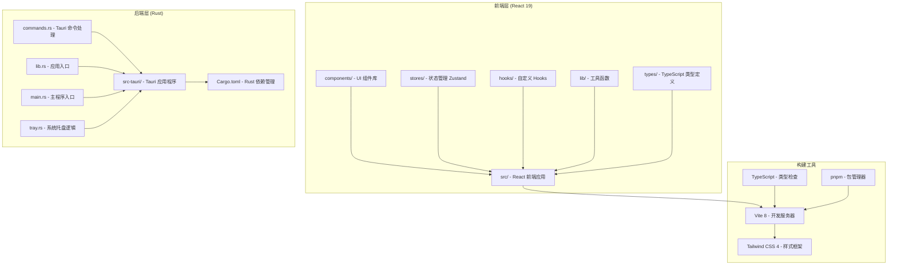
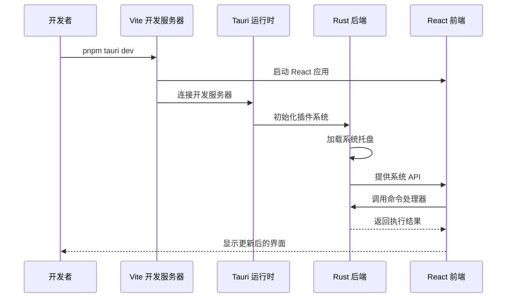
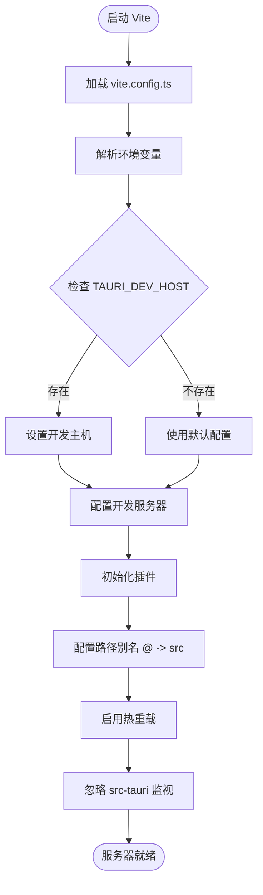
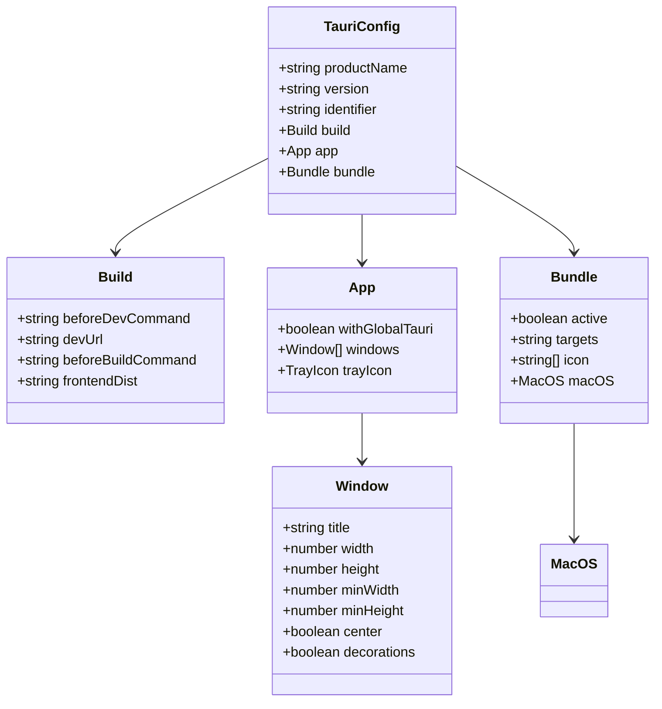
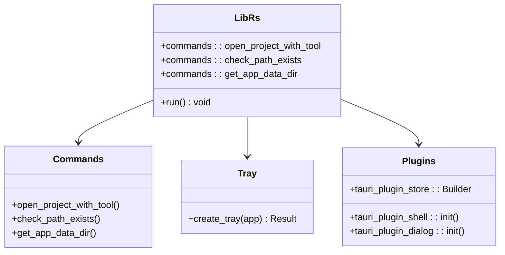
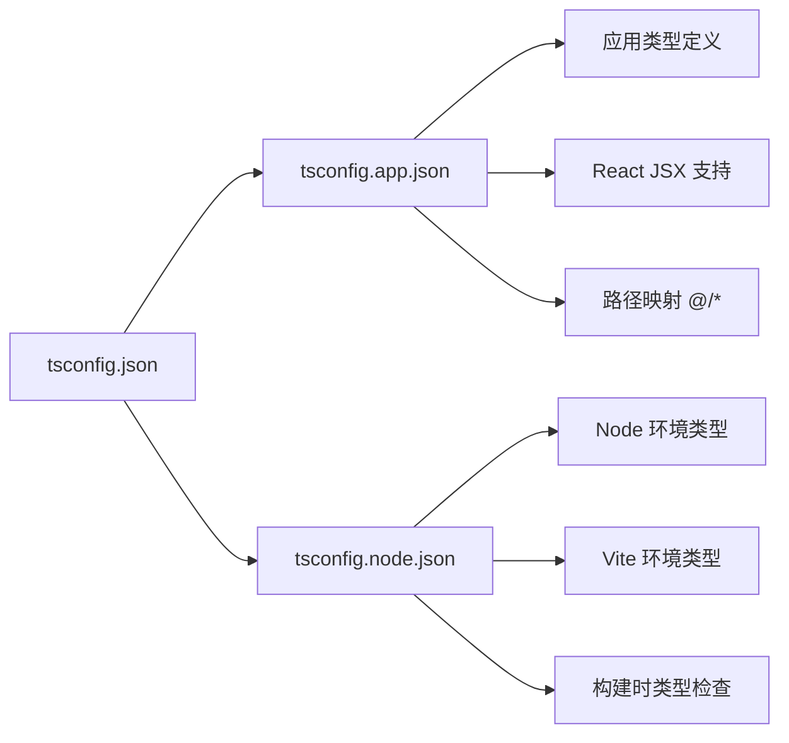

# 开发环境配置

<cite>
**本文档引用的文件**
- [package.json](file://package.json)
- [vite.config.ts](file://vite.config.ts)
- [tauri.conf.json](file://src-tauri/tauri.conf.json)
- [Cargo.toml](file://src-tauri/Cargo.toml)
- [main.rs](file://src-tauri/src/main.rs)
- [lib.rs](file://src-tauri/src/lib.rs)
- [build.rs](file://src-tauri/build.rs)
- [default.json](file://src-tauri/capabilities/default.json)
- [eslint.config.js](file://eslint.config.js)
- [tsconfig.json](file://tsconfig.json)
- [tsconfig.app.json](file://tsconfig.app.json)
- [tsconfig.node.json](file://tsconfig.node.json)
- [components.json](file://components.json)
- [README.md](file://README.md)
</cite>

## 目录
1. [简介](#简介)
2. [项目结构](#项目结构)
3. [核心组件](#核心组件)
4. [架构概览](#架构概览)
5. [详细组件分析](#详细组件分析)
6. [依赖分析](#依赖分析)
7. [性能考虑](#性能考虑)
8. [故障排除指南](#故障排除指南)
9. [结论](#结论)
10. [附录](#附录)

## 简介

LaunchPro 是一个基于 Tauri v2 的跨平台桌面应用程序，使用 React 19 + TypeScript 构建前端界面，Rust 作为后端运行时。该项目提供了轻量级的开发者项目管理功能，支持在本地环境中快速浏览、组织和打开各种项目。

## 项目结构

LaunchPro 采用前后端分离的架构设计，主要分为两个核心部分：



**图表来源**
- [package.json:1-48](file://package.json#L1-L48)
- [vite.config.ts:1-32](file://vite.config.ts#L1-L32)
- [Cargo.toml:1-22](file://src-tauri/Cargo.toml#L1-L22)

**章节来源**
- [README.md:115-135](file://README.md#L115-L135)

## 核心组件

### 技术栈概览

LaunchPro 采用了现代化的全栈技术组合：

| 层级 | 技术 |
|------|------|
| UI 框架 | React 19 + TypeScript |
| 构建工具 | Vite 8 |
| 桌面运行时 | Tauri 2 |
| 后端 | Rust |
| 样式 | Tailwind CSS 4 |
| UI 组件 | Radix UI + shadcn/ui |
| 状态管理 | Zustand 5 |
| 持久化 | tauri-plugin-store |
| 通知 | Sonner |

### 开发工具链

项目使用了完整的现代开发工具链，包括：

- **包管理器**: pnpm (版本 >= 8)
- **类型检查**: TypeScript (~5.9.3)
- **代码格式化**: ESLint + TypeScript ESLint
- **样式框架**: Tailwind CSS 4
- **构建系统**: Vite 8

**章节来源**
- [README.md:101-114](file://README.md#L101-L114)
- [package.json:30-46](file://package.json#L30-L46)

## 架构概览

LaunchPro 采用客户端-服务端分离的架构模式，通过 Tauri 提供原生桌面体验：



**图表来源**
- [tauri.conf.json:5-10](file://src-tauri/tauri.conf.json#L5-L10)
- [lib.rs:6-26](file://src-tauri/src/lib.rs#L6-L26)

**章节来源**
- [tauri.conf.json:1-44](file://src-tauri/tauri.conf.json#L1-L44)

## 详细组件分析

### Vite 开发服务器配置

Vite 作为开发服务器，提供了热重载和快速构建能力：



**图表来源**
- [vite.config.ts:6-31](file://vite.config.ts#L6-L31)

关键配置要点：
- **端口配置**: 默认 5173，严格端口模式
- **热重载**: 支持远程主机连接，协议为 WebSocket
- **路径别名**: `@` 指向 `src` 目录
- **监视配置**: 忽略 `src-tauri` 目录以避免不必要的重建

**章节来源**
- [vite.config.ts:1-32](file://vite.config.ts#L1-L32)

### Tauri 应用配置

Tauri 配置文件定义了应用程序的核心行为：



**图表来源**
- [tauri.conf.json:1-44](file://src-tauri/tauri.conf.json#L1-L44)

**章节来源**
- [tauri.conf.json:1-44](file://src-tauri/tauri.conf.json#L1-L44)

### Rust 后端架构

Rust 后端提供了系统集成和原生功能：



**图表来源**
- [lib.rs:1-28](file://src-tauri/src/lib.rs#L1-L28)

**章节来源**
- [lib.rs:1-28](file://src-tauri/src/lib.rs#L1-L28)

### TypeScript 配置体系

项目使用双配置文件体系确保类型安全：



**图表来源**
- [tsconfig.json:1-8](file://tsconfig.json#L1-L8)
- [tsconfig.app.json:1-33](file://tsconfig.app.json#L1-L33)
- [tsconfig.node.json:1-27](file://tsconfig.node.json#L1-L27)

**章节来源**
- [tsconfig.json:1-8](file://tsconfig.json#L1-L8)
- [tsconfig.app.json:1-33](file://tsconfig.app.json#L1-L33)
- [tsconfig.node.json:1-27](file://tsconfig.node.json#L1-L27)

## 依赖分析

### 前端依赖关系

```mermaid
graph TB
subgraph "React 生态系统"
A[react@^19.2.4]
B[react-dom@^19.2.4]
C[react-router-dom]
end
subgraph "UI 组件库"
D[lucide-react@^1.7.0]
E[radix-ui@^1.4.3]
F[sonner@^2.0.7]
end
subgraph "状态管理"
G[zustand@^5.0.12]
H[next-themes@^0.4.6]
end
subgraph "工具库"
I[class-variance-authority@^0.7.1]
J[clsx@^2.1.1]
K[tailwind-merge@^3.5.0]
L[uuid@^13.0.0]
end
A --> D
A --> G
A --> I
B --> A
D --> F
G --> H
```

**图表来源**
- [package.json:13-29](file://package.json#L13-L29)

### Rust 依赖关系

```mermaid
graph TB
subgraph "Tauri 核心"
A[tauri@2]
B[tauri-build@2]
end
subgraph "插件系统"
C[tauri-plugin-shell@2]
D[tauri-plugin-dialog@2]
E[tauri-plugin-store@2]
end
subgraph "序列化"
F[serde@1]
G[serde_json@1]
end
A --> C
A --> D
A --> E
B --> A
C --> F
D --> F
E --> F
```

**图表来源**
- [Cargo.toml:12-22](file://src-tauri/Cargo.toml#L12-L22)

**章节来源**
- [package.json:13-46](file://package.json#L13-L46)
- [Cargo.toml:12-22](file://src-tauri/Cargo.toml#L12-L22)

## 性能考虑

### 开发性能优化

1. **热重载机制**: Vite 提供快速的模块热替换，支持远程主机连接
2. **路径别名**: 使用 `@` 别名减少模块解析时间
3. **类型检查**: TypeScript 在开发时进行增量编译
4. **构建优化**: 双配置文件体系确保生产构建的类型安全性

### 内存管理

- **Rust 内存安全**: 通过所有权系统避免内存泄漏
- **React 优化**: 使用 Zustand 减少不必要的重新渲染
- **缓存策略**: tauri-plugin-store 提供本地持久化存储

## 故障排除指南

### 环境变量配置

常见的环境变量及其用途：

| 变量名 | 默认值 | 描述 |
|--------|--------|------|
| `TAURI_DEV_HOST` | `undefined` | 开发服务器主机地址 |
| `NODE_ENV` | `"development"` | Node.js 环境模式 |
| `PORT` | `5173` | 开发服务器端口 |

### 权限问题解决

1. **macOS 安全警告**
   - 首次运行时出现安全警告
   - 解决方案: 系统设置 → 隐私与安全 → 点击"仍要打开"

2. **文件访问权限**
   - 确保应用程序有读取项目目录的权限
   - 检查用户主目录的访问权限

### 路径配置问题

1. **模块解析失败**
   ```bash
   # 检查 tsconfig 配置
   npx tsc --noEmit
   
   # 验证路径别名配置
   cat tsconfig.app.json | grep "@/*"
   ```

2. **Vite 路径别名**
   ```javascript
   // 确保 vite.config.ts 中的别名配置正确
   alias: {
     '@': path.resolve(__dirname, './src'),
   }
   ```

### 网络代理设置

1. **开发服务器连接**
   ```bash
   # 设置开发主机
   export TAURI_DEV_HOST=your-host-ip
   
   # 启动开发服务器
   pnpm tauri dev
   ```

2. **包管理器代理**
   ```bash
   # 配置 pnpm 代理
   pnpm config set registry https://registry.npmmirror.com/
   
   # 或使用 npm 代理
   npm config set proxy http://proxy-server:port
   ```

### 常见错误诊断

1. **TypeScript 编译错误**
   ```bash
   # 运行类型检查
   pnpm tsc --noEmit
   
   # 检查 tsconfig 配置
   cat tsconfig.app.json
   ```

2. **ESLint 语法错误**
   ```bash
   # 运行代码检查
   pnpm lint
   
   # 检查 ESLint 配置
   cat eslint.config.js
   ```

3. **Vite 启动失败**
   ```bash
   # 检查端口占用
   lsof -i :5173
   
   # 清理缓存
   rm -rf node_modules/.vite
   ```

**章节来源**
- [README.md:55-81](file://README.md#L55-L81)
- [vite.config.ts:6-26](file://vite.config.ts#L6-L26)

## 结论

LaunchPro 提供了一个完整且现代化的开发环境配置方案，结合了 React 的前端生态和 Rust 的后端优势。通过合理的工具链选择和配置，实现了跨平台的原生桌面应用开发体验。

关键优势包括：
- **快速开发**: Vite 提供即时的热重载体验
- **类型安全**: TypeScript 确保代码质量
- **原生性能**: Rust 提供高性能的系统集成
- **跨平台兼容**: Tauri 支持多平台部署

建议开发者根据项目需求调整配置，并遵循最佳实践以获得最优的开发体验。

## 附录

### 推荐开发工具配置

1. **VS Code 扩展**
   - ES7+ React/Redux/React-Native snippets
   - ESLint
   - Prettier
   - Tailwind CSS IntelliSense
   - Rust (rls)

2. **调试器设置**
   ```json
   {
     "version": "0.2.0",
     "configurations": [
       {
         "type": "pwa-chrome",
         "request": "launch",
         "name": "调试 React 应用",
         "url": "http://localhost:5173",
         "webRoot": "${workspaceFolder}/src"
       }
     ]
   }
   ```

3. **终端配置**
   ```bash
   # 设置开发别名
   alias pdev='pnpm tauri dev'
   alias pbuild='pnpm tauri build'
   alias plint='pnpm lint'
   alias ptype='pnpm tsc --noEmit'
   ```