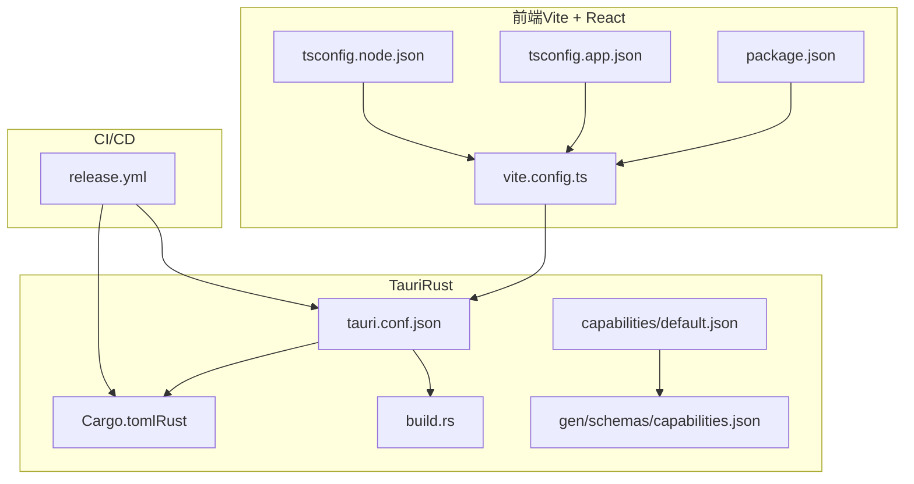
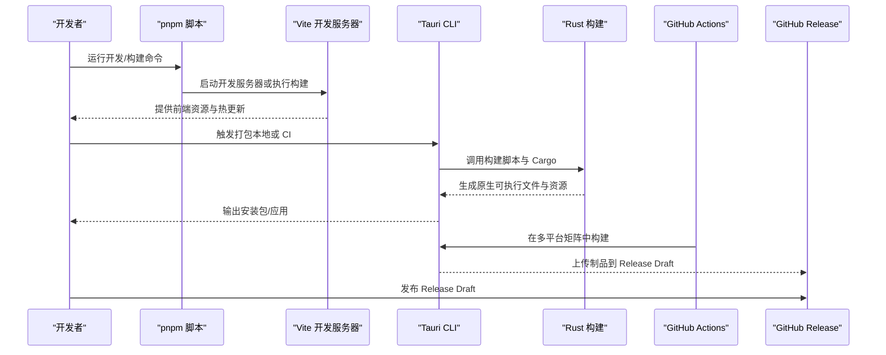
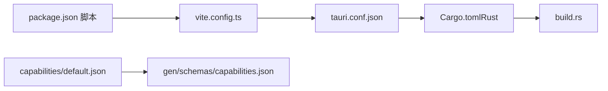

# 构建与部署

<cite>
**本文引用的文件**
- [package.json](file://package.json)
- [vite.config.ts](file://vite.config.ts)
- [tauri.conf.json](file://src-tauri/tauri.conf.json)
- [Cargo.toml（Rust）](file://src-tauri/Cargo.toml)
- [build.rs](file://src-tauri/build.rs)
- [release.yml](file://.github/workflows/release.yml)
- [default.json（能力配置）](file://src-tauri/capabilities/default.json)
- [capabilities.json（生成的能力清单）](file://src-tauri/gen/schemas/capabilities.json)
- [tsconfig.json](file://tsconfig.json)
- [tsconfig.app.json](file://tsconfig.app.json)
- [tsconfig.node.json](file://tsconfig.node.json)
</cite>

## 目录
1. [简介](#简介)
2. [项目结构](#项目结构)
3. [核心组件](#核心组件)
4. [架构总览](#架构总览)
5. [详细组件分析](#详细组件分析)
6. [依赖关系分析](#依赖关系分析)
7. [性能考虑](#性能考虑)
8. [故障排查指南](#故障排查指南)
9. [结论](#结论)
10. [附录](#附录)

## 简介
本指南面向 LaunchPro 的构建与部署，覆盖以下主题：
- Vite 前端构建配置与开发/预览模式
- Tauri 应用打包流程与多平台编译设置
- 开发构建、生产构建与调试构建的区别与配置要点
- CI/CD 流水线（GitHub Actions）配置、自动化测试与发布流程
- 图标生成、签名配置与应用商店发布准备
- 性能优化技巧、包大小分析与内存使用优化
- 不同操作系统平台的特定部署要求与注意事项

## 项目结构
该仓库采用“前端 + Tauri 后端”的混合架构：
- 前端基于 React + Vite，通过 TypeScript 编写
- Tauri 作为原生外壳，承载窗口、托盘、系统集成等能力
- 使用 pnpm 管理依赖，GitHub Actions 实现跨平台自动打包与发布

图表来源
- [vite.config.ts:1-32](file://vite.config.ts#L1-L32)
- [package.json:1-48](file://package.json#L1-L48)
- [tsconfig.app.json:1-33](file://tsconfig.app.json#L1-L33)
- [tsconfig.node.json:1-27](file://tsconfig.node.json#L1-L27)
- [tauri.conf.json:1-44](file://src-tauri/tauri.conf.json#L1-L44)
- [Cargo.toml（Rust）:1-22](file://src-tauri/Cargo.toml#L1-L22)
- [build.rs:1-4](file://src-tauri/build.rs#L1-L4)
- [default.json（能力配置）:1-18](file://src-tauri/capabilities/default.json#L1-L18)
- [capabilities.json（生成的能力清单）:1-1](file://src-tauri/gen/schemas/capabilities.json#L1-L1)
- [release.yml:1-130](file://.github/workflows/release.yml#L1-L130)

章节来源
- [package.json:1-48](file://package.json#L1-L48)
- [vite.config.ts:1-32](file://vite.config.ts#L1-L32)
- [tsconfig.json:1-8](file://tsconfig.json#L1-L8)
- [tsconfig.app.json:1-33](file://tsconfig.app.json#L1-L33)
- [tsconfig.node.json:1-27](file://tsconfig.node.json#L1-L27)
- [tauri.conf.json:1-44](file://src-tauri/tauri.conf.json#L1-L44)
- [Cargo.toml（Rust）:1-22](file://src-tauri/Cargo.toml#L1-L22)
- [build.rs:1-4](file://src-tauri/build.rs#L1-L4)
- [default.json（能力配置）:1-18](file://src-tauri/capabilities/default.json#L1-L18)
- [capabilities.json（生成的能力清单）:1-1](file://src-tauri/gen/schemas/capabilities.json#L1-L1)
- [release.yml:1-130](file://.github/workflows/release.yml#L1-L130)

## 核心组件
- 前端构建与开发服务器：由 Vite 提供，支持热更新、别名解析与 Tailwind 集成
- Tauri 配置：定义窗口、托盘、打包目标、图标集与系统最低版本
- Rust 依赖与构建：通过 Cargo 管理，构建脚本调用 Tauri 构建工具
- 能力与权限：通过 JSON 能力文件声明窗口与插件权限，自动生成清单
- CI/CD：在推送标签时触发发布，跨平台构建并上传制品到 GitHub Release

章节来源
- [vite.config.ts:1-32](file://vite.config.ts#L1-L32)
- [tauri.conf.json:1-44](file://src-tauri/tauri.conf.json#L1-L44)
- [Cargo.toml（Rust）:1-22](file://src-tauri/Cargo.toml#L1-L22)
- [build.rs:1-4](file://src-tauri/build.rs#L1-L4)
- [default.json（能力配置）:1-18](file://src-tauri/capabilities/default.json#L1-L18)
- [capabilities.json（生成的能力清单）:1-1](file://src-tauri/gen/schemas/capabilities.json#L1-L1)
- [release.yml:1-130](file://.github/workflows/release.yml#L1-L130)

## 架构总览
下图展示从开发到发布的整体流程，以及各配置文件之间的关系。

图表来源
- [package.json:6-12](file://package.json#L6-L12)
- [vite.config.ts:8-31](file://vite.config.ts#L8-L31)
- [tauri.conf.json:5-10](file://src-tauri/tauri.conf.json#L5-L10)
- [Cargo.toml（Rust）:12-22](file://src-tauri/Cargo.toml#L12-L22)
- [release.yml:39-109](file://.github/workflows/release.yml#L39-L109)

## 详细组件分析

### Vite 构建配置与开发/预览模式
- 插件与工具链
  - React 插件与 Tailwind 集成，确保样式与组件热更新正常工作
  - 别名解析 @ 指向 src，便于统一导入路径
- 开发服务器
  - 固定端口与严格端口策略，支持通过环境变量启用远程 HMR
  - 忽略对 src-tauri 的监听，避免不必要的重载
- 类型与编译配置
  - tsconfig.app.json 与 tsconfig.node.json 分离前端与工具链类型配置，提升类型检查效率

章节来源
- [vite.config.ts:1-32](file://vite.config.ts#L1-L32)
- [tsconfig.app.json:1-33](file://tsconfig.app.json#L1-L33)
- [tsconfig.node.json:1-27](file://tsconfig.node.json#L1-L27)

### Tauri 打包与多平台编译
- 构建入口与前后端联动
  - beforeDevCommand 与 beforeBuildCommand 分别指向前端开发与构建脚本
  - devUrl 指向 Vite 开发服务器地址
  - frontendDist 指向 Vite 构建输出目录
- 应用窗口与托盘
  - 定义主窗口尺寸、最小尺寸、居中与装饰
  - 托盘图标路径与模板图标设置
- 打包与图标
  - targets 设置为 all，自动为所有平台生成安装包
  - 图标集合包含多分辨率 PNG 与平台专用格式（如 .icns、.ico）
- 系统兼容性
  - macOS 最低系统版本配置

章节来源
- [tauri.conf.json:1-44](file://src-tauri/tauri.conf.json#L1-L44)

### Rust 依赖与构建脚本
- 依赖特性
  - tauri 与插件（shell、dialog、store）按需启用
  - serde 用于序列化与反序列化
- 构建脚本
  - build.rs 调用 tauri_build::build，驱动 Tauri 的代码生成与资源注入

章节来源
- [Cargo.toml（Rust）:1-22](file://src-tauri/Cargo.toml#L1-L22)
- [build.rs:1-4](file://src-tauri/build.rs#L1-L4)

### 能力与权限声明
- 能力文件
  - default.json 声明主窗口与核心权限（窗口操作、Shell 打开、对话框、数据存储）
- 自动生成清单
  - capabilities.json 展示生成后的权限清单，供运行时校验

章节来源
- [default.json（能力配置）:1-18](file://src-tauri/capabilities/default.json#L1-L18)
- [capabilities.json（生成的能力清单）:1-1](file://src-tauri/gen/schemas/capabilities.json#L1-L1)

### CI/CD 流水线（GitHub Actions）
- 触发条件
  - 推送以 v 开头的标签时触发
- 任务拆分
  - create-release：创建 Release Draft 并输出 release_id
  - build-tauri：多平台矩阵构建（macOS aarch64/x86_64、Linux、Windows），安装 Node.js、pnpm、Rust 与平台依赖，调用 tauri-action 打包
  - publish-release：将 Draft 发布为正式 Release
- 签名与密钥（可选）
  - 流水线注释中预留了 macOS 签名相关环境变量占位，可在仓库 Secrets 中配置

章节来源
- [release.yml:1-130](file://.github/workflows/release.yml#L1-L130)

## 依赖关系分析
- 前端到 Tauri
  - package.json 的脚本与 tauri.conf.json 的 beforeDevCommand/beforeBuildCommand 形成闭环
  - Vite 构建产物被 Tauri 作为前端资源加载
- Tauri 到 Rust
  - tauri.conf.json -> Cargo.toml -> build.rs，形成标准的 Tauri + Rust 构建链路
- 能力到运行时
  - default.json -> capabilities.json（生成）-> 运行时权限校验

图表来源
- [package.json:6-12](file://package.json#L6-L12)
- [vite.config.ts:8-31](file://vite.config.ts#L8-L31)
- [tauri.conf.json:5-10](file://src-tauri/tauri.conf.json#L5-L10)
- [Cargo.toml（Rust）:12-22](file://src-tauri/Cargo.toml#L12-L22)
- [build.rs:1-4](file://src-tauri/build.rs#L1-L4)
- [default.json（能力配置）:1-18](file://src-tauri/capabilities/default.json#L1-L18)
- [capabilities.json（生成的能力清单）:1-1](file://src-tauri/gen/schemas/capabilities.json#L1-L1)

章节来源
- [package.json:6-12](file://package.json#L6-L12)
- [vite.config.ts:8-31](file://vite.config.ts#L8-L31)
- [tauri.conf.json:5-10](file://src-tauri/tauri.conf.json#L5-L10)
- [Cargo.toml（Rust）:12-22](file://src-tauri/Cargo.toml#L12-L22)
- [build.rs:1-4](file://src-tauri/build.rs#L1-L4)
- [default.json（能力配置）:1-18](file://src-tauri/capabilities/default.json#L1-L18)
- [capabilities.json（生成的能力清单）:1-1](file://src-tauri/gen/schemas/capabilities.json#L1-L1)

## 性能考虑
- 构建与打包
  - 使用 Vite 的 bundler 模式与 verbatimModuleSyntax，减少运行时模块转换开销
  - 将 tsconfig.app.json 的 moduleResolution 设为 bundler，配合 Vite 提升解析效率
- 资源与图标
  - 仅保留必要的图标分辨率，避免冗余资源导致包体膨胀
- 内存与运行时
  - 合理设置窗口最小尺寸与装饰，降低渲染压力
  - 控制插件数量与权限范围，减少运行时上下文开销
- CI/CD 并行
  - 多平台矩阵构建可并行执行，缩短整体流水线时间

章节来源
- [tsconfig.app.json:10-17](file://tsconfig.app.json#L10-L17)
- [vite.config.ts:10-14](file://vite.config.ts#L10-L14)
- [tauri.conf.json:29-42](file://src-tauri/tauri.conf.json#L29-L42)

## 故障排查指南
- 开发服务器无法热更新或端口冲突
  - 检查 vite.config.ts 的 server.port、strictPort 与 host 配置
  - 若使用远程 HMR，确认环境变量与协议设置
- 前端资源未正确注入
  - 确认 tauri.conf.json 的 devUrl 与 beforeDevCommand 指向一致
  - 确认 package.json 的 dev 脚本与 tauri.conf.json 的 beforeDevCommand 一致
- 打包失败或缺少图标
  - 检查 tauri.conf.json 的 icon 路径是否与实际图标文件匹配
  - 确保各平台图标（.icns、.ico、PNG）齐全
- 权限不足导致功能异常
  - 检查 capabilities/default.json 的权限声明
  - 查看生成的 capabilities.json 是否包含所需权限
- CI/CD 失败
  - Linux 平台需安装 WebKit、GTK 等系统依赖
  - Windows/macOS 平台需正确配置签名与证书（如启用）

章节来源
- [vite.config.ts:16-30](file://vite.config.ts#L16-L30)
- [tauri.conf.json:5-10](file://src-tauri/tauri.conf.json#L5-L10)
- [tauri.conf.json:29-38](file://src-tauri/tauri.conf.json#L29-L38)
- [default.json（能力配置）:5-16](file://src-tauri/capabilities/default.json#L5-L16)
- [capabilities.json（生成的能力清单）:1-1](file://src-tauri/gen/schemas/capabilities.json#L1-L1)
- [release.yml:80-91](file://.github/workflows/release.yml#L80-L91)

## 结论
本指南梳理了 LaunchPro 的构建与部署全链路：从前端 Vite 配置、Tauri 打包到多平台 CI/CD 自动化发布。通过合理配置能力与权限、控制图标资源与模块解析策略，可在保证功能完整性的同时优化构建与运行性能。建议在本地与 CI 环境均进行充分验证，并根据平台差异补充签名与发布准备。

## 附录

### 开发构建、生产构建与调试构建的区别与配置
- 开发构建
  - 使用 Vite 开发服务器，开启热更新与严格端口策略
  - Tauri 通过 beforeDevCommand 启动前端开发服务
- 生产构建
  - 先执行 TypeScript 构建，再执行 Vite 生产打包
  - Tauri 读取 frontendDist 指向的 dist 目录
- 调试构建
  - 可结合 Tauri CLI 的调试参数与日志输出定位问题
  - 在 CI 中可启用更详细的日志与缓存清理策略

章节来源
- [package.json:7-11](file://package.json#L7-L11)
- [vite.config.ts:8-31](file://vite.config.ts#L8-L31)
- [tauri.conf.json:5-10](file://src-tauri/tauri.conf.json#L5-L10)

### CI/CD 流水线配置要点
- 触发方式：推送 v* 标签
- 多平台矩阵：macOS（aarch64/x86_64）、Linux、Windows
- 关键步骤：安装 Node.js/pnpm/Rust、安装平台依赖、构建前端与 Tauri、上传制品、发布 Release
- 签名准备：在仓库 Secrets 中配置 Apple 签名相关变量（如启用）

章节来源
- [release.yml:3-6](file://.github/workflows/release.yml#L3-L6)
- [release.yml:43-58](file://.github/workflows/release.yml#L43-L58)
- [release.yml:95-108](file://.github/workflows/release.yml#L95-L108)

### 图标生成、签名配置与应用商店发布准备
- 图标生成
  - 准备多分辨率 PNG 与平台专用图标（.icns、.ico）
  - 在 tauri.conf.json 的 icon 数组中声明
- 签名配置
  - macOS 签名相关环境变量已在流水线注释中预留，可在仓库 Secrets 中配置
- 应用商店发布准备
  - 确保最低系统版本满足目标平台要求
  - 准备应用描述、截图与变更说明（可在 Release 页面维护）

章节来源
- [tauri.conf.json:29-42](file://src-tauri/tauri.conf.json#L29-L42)
- [release.yml:99-105](file://.github/workflows/release.yml#L99-L105)

### 包大小分析与内存使用优化建议
- 包大小分析
  - 使用 Vite 的预览模式与浏览器 DevTools 的 Performance/Network 面板分析资源体积
  - 对比不同平台产物大小，识别冗余资源
- 内存使用优化
  - 合理设置窗口最小尺寸与装饰，减少 GPU/CPU 压力
  - 控制插件数量与权限范围，避免不必要的运行时上下文
  - 在 CI 中启用缓存与并行构建，缩短构建时间

章节来源
- [vite.config.ts:15-30](file://vite.config.ts#L15-L30)
- [tauri.conf.json:13-27](file://src-tauri/tauri.conf.json#L13-L27)
- [release.yml:43-58](file://.github/workflows/release.yml#L43-L58)

### 不同操作系统平台的特定部署要求
- Linux
  - 安装 WebKit、GTK、rsvg、glib 等系统依赖
- Windows
  - 确保 MSVC 工具链与 WebView2 可用
- macOS
  - 设置最低系统版本与可选签名配置
  - 支持多架构（aarch64/x86_64）并行构建

章节来源
- [release.yml:80-91](file://.github/workflows/release.yml#L80-L91)
- [tauri.conf.json:39-41](file://src-tauri/tauri.conf.json#L39-L41)
- [release.yml:47-52](file://.github/workflows/release.yml#L47-L52)