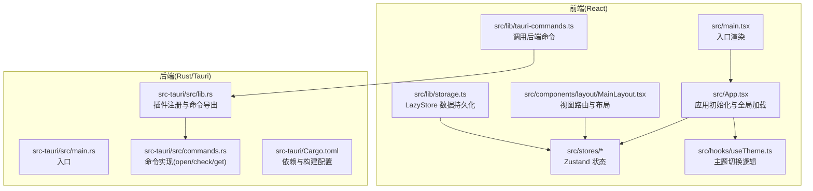
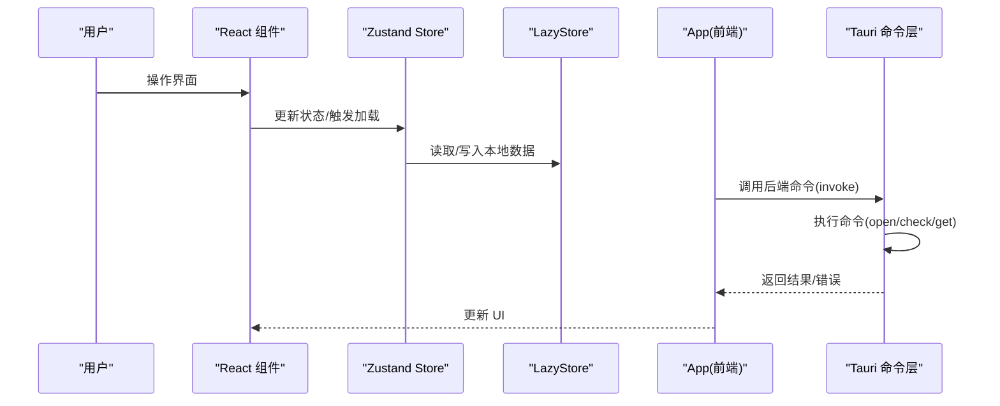
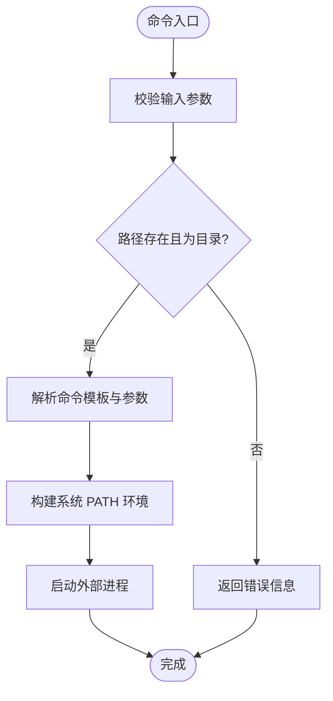
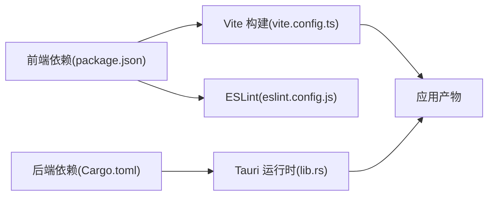

# 调试与测试

<cite>
**本文引用的文件**
- [package.json](file://package.json)
- [vite.config.ts](file://vite.config.ts)
- [src/main.tsx](file://src/main.tsx)
- [src/App.tsx](file://src/App.tsx)
- [src/lib/tauri-commands.ts](file://src/lib/tauri-commands.ts)
- [src/lib/storage.ts](file://src/lib/storage.ts)
- [src/stores/useProjectStore.ts](file://src/stores/useProjectStore.ts)
- [src/hooks/useTheme.ts](file://src/hooks/useTheme.ts)
- [src/components/layout/MainLayout.tsx](file://src/components/layout/MainLayout.tsx)
- [src-tauri/src/main.rs](file://src-tauri/src/main.rs)
- [src-tauri/src/lib.rs](file://src-tauri/src/lib.rs)
- [src-tauri/src/commands.rs](file://src-tauri/src/commands.rs)
- [src-tauri/Cargo.toml](file://src-tauri/Cargo.toml)
- [eslint.config.js](file://eslint.config.js)
</cite>

## 目录
1. [简介](#简介)
2. [项目结构](#项目结构)
3. [核心组件](#核心组件)
4. [架构总览](#架构总览)
5. [详细组件分析](#详细组件分析)
6. [依赖分析](#依赖分析)
7. [性能考虑](#性能考虑)
8. [故障排查指南](#故障排查指南)
9. [结论](#结论)
10. [附录](#附录)

## 简介
本指南面向 LaunchPro 的前端与后端开发者，提供从日常调试到系统性测试的完整方法论。内容覆盖：
- 前端 React 应用调试技巧、浏览器开发者工具使用与状态检查方法
- Rust 后端调试、日志配置与错误追踪技术
- 单元测试编写、模拟数据设置与测试覆盖率分析
- 集成测试策略、端到端测试与用户交互测试
- 性能分析工具使用、内存泄漏检测与性能瓶颈识别
- 常见错误模式、调试工具配置与问题诊断流程

## 项目结构
LaunchPro 采用 Tauri 架构：前端为 Vite + React + Zustand 状态管理，后端为 Rust（Tauri 插件生态）。开发时通过 Vite 提供热更新与 HMR；运行时由 Tauri 将前端打包为桌面应用。

图表来源
- [src/main.tsx:1-11](file://src/main.tsx#L1-L11)
- [src/App.tsx:1-40](file://src/App.tsx#L1-L40)
- [src/stores/useProjectStore.ts:1-67](file://src/stores/useProjectStore.ts#L1-L67)
- [src/lib/tauri-commands.ts:1-17](file://src/lib/tauri-commands.ts#L1-L17)
- [src/lib/storage.ts:1-30](file://src/lib/storage.ts#L1-L30)
- [src/hooks/useTheme.ts:1-37](file://src/hooks/useTheme.ts#L1-L37)
- [src/components/layout/MainLayout.tsx:1-21](file://src/components/layout/MainLayout.tsx#L1-L21)
- [src-tauri/src/main.rs:1-7](file://src-tauri/src/main.rs#L1-L7)
- [src-tauri/src/lib.rs:1-28](file://src-tauri/src/lib.rs#L1-L28)
- [src-tauri/src/commands.rs:1-95](file://src-tauri/src/commands.rs#L1-L95)
- [src-tauri/Cargo.toml:1-22](file://src-tauri/Cargo.toml#L1-L22)

章节来源
- [package.json:1-48](file://package.json#L1-L48)
- [vite.config.ts:1-32](file://vite.config.ts#L1-L32)
- [src-tauri/Cargo.toml:1-22](file://src-tauri/Cargo.toml#L1-L22)

## 核心组件
- 前端入口与初始化：应用在入口处挂载并触发全局加载逻辑，包括项目、工具与设置的初始化。
- 状态管理：使用 Zustand 管理项目列表、工具列表、设置与 UI 视图状态，并通过 LazyStore 实现本地持久化。
- 命令桥接：前端通过 @tauri-apps/api 的 invoke 调用后端命令，实现跨语言交互。
- 主题与布局：主题切换逻辑基于系统偏好或用户选择，主布局根据当前视图动态渲染不同面板。
- 后端命令：提供打开项目工具、路径存在性检查、应用数据目录查询等能力。

章节来源
- [src/main.tsx:1-11](file://src/main.tsx#L1-L11)
- [src/App.tsx:1-40](file://src/App.tsx#L1-L40)
- [src/stores/useProjectStore.ts:1-67](file://src/stores/useProjectStore.ts#L1-L67)
- [src/lib/tauri-commands.ts:1-17](file://src/lib/tauri-commands.ts#L1-L17)
- [src/lib/storage.ts:1-30](file://src/lib/storage.ts#L1-L30)
- [src/hooks/useTheme.ts:1-37](file://src/hooks/useTheme.ts#L1-L37)
- [src/components/layout/MainLayout.tsx:1-21](file://src/components/layout/MainLayout.tsx#L1-L21)
- [src-tauri/src/lib.rs:1-28](file://src-tauri/src/lib.rs#L1-L28)
- [src-tauri/src/commands.rs:1-95](file://src-tauri/src/commands.rs#L1-L95)

## 架构总览
下图展示从前端到后端的关键调用链路与数据流。

图表来源
- [src/App.tsx:21-37](file://src/App.tsx#L21-L37)
- [src/lib/tauri-commands.ts:1-17](file://src/lib/tauri-commands.ts#L1-L17)
- [src-tauri/src/lib.rs:10-14](file://src-tauri/src/lib.rs#L10-L14)
- [src-tauri/src/commands.rs:48-95](file://src-tauri/src/commands.rs#L48-L95)
- [src/lib/storage.ts:19-29](file://src/lib/storage.ts#L19-L29)

## 详细组件分析

### 前端调试与状态检查
- 入口与渲染
  - 确认根节点挂载与严格模式启用，避免副作用重复执行。
  - 参考路径：[src/main.tsx:1-11](file://src/main.tsx#L1-L11)
- 应用初始化与全局加载
  - 在应用启动时并行加载工具、项目与设置，确保首屏可用。
  - 参考路径：[src/App.tsx:21-30](file://src/App.tsx#L21-L30)
- 状态管理与持久化
  - 使用 Zustand 定义状态与异步操作，结合 LazyStore 自动保存，便于断点与日志定位。
  - 参考路径：[src/stores/useProjectStore.ts:16-66](file://src/stores/useProjectStore.ts#L16-L66)，[src/lib/storage.ts:4-17](file://src/lib/storage.ts#L4-L17)
- 命令调用与错误传播
  - invoke 调用后端命令，建议在调用前后记录参数与返回值，便于定位异常。
  - 参考路径：[src/lib/tauri-commands.ts:1-17](file://src/lib/tauri-commands.ts#L1-L17)
- 主题与响应式
  - 主题切换逻辑基于系统偏好监听，注意事件解绑防止内存泄漏。
  - 参考路径：[src/hooks/useTheme.ts:8-29](file://src/hooks/useTheme.ts#L8-L29)
- 视图路由
  - 根据 UIStore 的 activeView 渲染不同面板，便于隔离调试各模块。
  - 参考路径：[src/components/layout/MainLayout.tsx:7-20](file://src/components/layout/MainLayout.tsx#L7-L20)

章节来源
- [src/main.tsx:1-11](file://src/main.tsx#L1-L11)
- [src/App.tsx:21-30](file://src/App.tsx#L21-L30)
- [src/stores/useProjectStore.ts:16-66](file://src/stores/useProjectStore.ts#L16-L66)
- [src/lib/storage.ts:4-17](file://src/lib/storage.ts#L4-L17)
- [src/lib/tauri-commands.ts:1-17](file://src/lib/tauri-commands.ts#L1-L17)
- [src/hooks/useTheme.ts:8-29](file://src/hooks/useTheme.ts#L8-L29)
- [src/components/layout/MainLayout.tsx:7-20](file://src/components/layout/MainLayout.tsx#L7-L20)

### 后端调试与日志追踪
- 插件与命令注册
  - 默认启用 shell、dialog、store 插件，并注册 open_project_with_tool、check_path_exists、get_app_data_dir 命令。
  - 参考路径：[src-tauri/src/lib.rs:6-14](file://src-tauri/src/lib.rs#L6-L14)
- 命令实现要点
  - open_project_with_tool：校验路径存在性与目录类型，解析命令模板，注入 PATH 并异步启动进程。
  - check_path_exists：判断路径是否存在且为目录。
  - get_app_data_dir：通过 AppHandle 获取应用数据目录。
  - 参考路径：[src-tauri/src/commands.rs:48-95](file://src-tauri/src/commands.rs#L48-L95)
- 构建与运行
  - 通过 main.rs 调用 lib::run，按需隐藏控制台窗口。
  - 参考路径：[src-tauri/src/main.rs:4-6](file://src-tauri/src/main.rs#L4-L6)，[src-tauri/Cargo.toml:15-22](file://src-tauri/Cargo.toml#L15-L22)

图表来源
- [src-tauri/src/commands.rs:48-79](file://src-tauri/src/commands.rs#L48-L79)

章节来源
- [src-tauri/src/lib.rs:6-14](file://src-tauri/src/lib.rs#L6-L14)
- [src-tauri/src/commands.rs:48-95](file://src-tauri/src/commands.rs#L48-L95)
- [src-tauri/src/main.rs:4-6](file://src-tauri/src/main.rs#L4-L6)
- [src-tauri/Cargo.toml:15-22](file://src-tauri/Cargo.toml#L15-L22)

### 测试策略与覆盖率
- 单元测试
  - 建议针对以下对象编写单元测试：
    - Zustand Store 的异步操作（加载、新增、更新、删除、最近打开时间更新）
    - 命令封装函数（invoke 层）与错误分支
    - 工具函数（如路径检查、主题切换逻辑）
  - 参考路径：[src/stores/useProjectStore.ts:16-66](file://src/stores/useProjectStore.ts#L16-L66)，[src/lib/tauri-commands.ts:1-17](file://src/lib/tauri-commands.ts#L1-L17)，[src/hooks/useTheme.ts:1-37](file://src/hooks/useTheme.ts#L1-L37)
- 模拟数据与环境
  - 使用 LazyStore 的默认值与 autoSave 行为，便于在测试中注入初始数据。
  - 参考路径：[src/lib/storage.ts:4-17](file://src/lib/storage.ts#L4-L17)
- 集成测试
  - 覆盖前端与后端命令的端到端调用链，验证 invoke 到命令执行的完整流程。
  - 参考路径：[src/lib/tauri-commands.ts:1-17](file://src/lib/tauri-commands.ts#L1-L17)，[src-tauri/src/lib.rs:10-14](file://src-tauri/src/lib.rs#L10-L14)，[src-tauri/src/commands.rs:48-95](file://src-tauri/src/commands.rs#L48-L95)
- 用户交互测试
  - 基于视图路由与 UIStore 的 activeView，验证不同视图下的交互行为。
  - 参考路径：[src/components/layout/MainLayout.tsx:7-20](file://src/components/layout/MainLayout.tsx#L7-L20)

章节来源
- [src/stores/useProjectStore.ts:16-66](file://src/stores/useProjectStore.ts#L16-L66)
- [src/lib/tauri-commands.ts:1-17](file://src/lib/tauri-commands.ts#L1-L17)
- [src/hooks/useTheme.ts:1-37](file://src/hooks/useTheme.ts#L1-L37)
- [src/lib/storage.ts:4-17](file://src/lib/storage.ts#L4-L17)
- [src-tauri/src/lib.rs:10-14](file://src-tauri/src/lib.rs#L10-L14)
- [src-tauri/src/commands.rs:48-95](file://src-tauri/src/commands.rs#L48-L95)
- [src/components/layout/MainLayout.tsx:7-20](file://src/components/layout/MainLayout.tsx#L7-L20)

## 依赖分析
- 前端依赖
  - React、Zustand、@tauri-apps/api、TailwindCSS 等，构成应用基础框架。
  - 参考路径：[package.json:13-29](file://package.json#L13-L29)
- 开发与构建
  - Vite、React 插件、TailwindCSS 插件、TypeScript、ESLint。
  - 参考路径：[package.json:30-46](file://package.json#L30-L46)，[vite.config.ts:1-32](file://vite.config.ts#L1-L32)，[eslint.config.js:1-24](file://eslint.config.js#L1-L24)
- 后端依赖
  - Tauri 核心、shell/dialog/store 插件、Serde JSON。
  - 参考路径：[src-tauri/Cargo.toml:15-22](file://src-tauri/Cargo.toml#L15-L22)

图表来源
- [package.json:13-46](file://package.json#L13-L46)
- [vite.config.ts:1-32](file://vite.config.ts#L1-L32)
- [eslint.config.js:1-24](file://eslint.config.js#L1-L24)
- [src-tauri/Cargo.toml:15-22](file://src-tauri/Cargo.toml#L15-L22)
- [src-tauri/src/lib.rs:6-14](file://src-tauri/src/lib.rs#L6-L14)

章节来源
- [package.json:13-46](file://package.json#L13-L46)
- [vite.config.ts:1-32](file://vite.config.ts#L1-L32)
- [eslint.config.js:1-24](file://eslint.config.js#L1-L24)
- [src-tauri/Cargo.toml:15-22](file://src-tauri/Cargo.toml#L15-L22)
- [src-tauri/src/lib.rs:6-14](file://src-tauri/src/lib.rs#L6-L14)

## 性能考虑
- 前端性能
  - 使用 React DevTools Profiler 分析组件渲染与重渲染热点。
  - 结合浏览器性能面板观察主线程阻塞、内存增长与长任务。
  - 对频繁更新的状态进行拆分与细粒度订阅，减少无关重渲染。
- 后端性能
  - 命令执行涉及外部进程启动，应避免高频并发调用；必要时引入队列或节流。
  - 日志输出建议在开发阶段开启，生产关闭冗余日志，保留关键错误日志。
- 存储与 I/O
  - LazyStore 自动保存策略会带来磁盘写入，建议批量写入或合并变更。
- HMR 与热更新
  - Vite 的 HMR 配置支持远程主机联调，注意仅在开发环境启用，避免生产风险。

章节来源
- [vite.config.ts:16-30](file://vite.config.ts#L16-L30)
- [src-tauri/src/commands.rs:70-76](file://src-tauri/src/commands.rs#L70-L76)
- [src/lib/storage.ts:4-17](file://src/lib/storage.ts#L4-L17)

## 故障排查指南
- 常见错误模式
  - 路径不存在或非目录：命令执行前先调用路径检查，避免无效进程启动。
    - 参考路径：[src-tauri/src/commands.rs:50-56](file://src-tauri/src/commands.rs#L50-L56)，[src/lib/tauri-commands.ts:10-12](file://src/lib/tauri-commands.ts#L10-L12)
  - 命令模板为空：解析失败导致无法启动程序，需在前端校验模板格式。
    - 参考路径：[src-tauri/src/commands.rs:62-65](file://src-tauri/src/commands.rs#L62-L65)
  - 外部进程启动失败：检查 PATH 注入与权限，捕获错误并反馈给前端。
    - 参考路径：[src-tauri/src/commands.rs:70-76](file://src-tauri/src/commands.rs#L70-L76)
- 调试工具配置
  - 前端：启用 React DevTools、严格模式、日志打印；使用 Redux DevTools（Zustand 可配合中间件）。
  - 后端：在开发模式下输出命令执行详情，必要时增加更细粒度的日志级别。
- 问题诊断流程
  - 步骤一：确认前端 invoke 参数与返回值是否符合预期。
  - 步骤二：在后端命令中添加最小可复现日志，定位错误分支。
  - 步骤三：检查 PATH 注入与系统环境差异，确保命令可被正确解析。
  - 步骤四：验证 LazyStore 写入是否成功，避免状态不一致。

章节来源
- [src-tauri/src/commands.rs:50-76](file://src-tauri/src/commands.rs#L50-L76)
- [src/lib/tauri-commands.ts:10-12](file://src/lib/tauri-commands.ts#L10-L12)

## 结论
本指南提供了从开发调试到系统测试的全栈方法论。建议在日常开发中：
- 前端：以严格模式、最小日志与状态切分为原则，结合 DevTools 进行可视化调试。
- 后端：以命令边界与环境注入为核心，配合日志与错误返回完善可观测性。
- 测试：以单元与集成测试为主，逐步扩展端到端与用户交互测试，保障质量与稳定性。

## 附录
- 开发与运行脚本
  - 参考路径：[package.json:6-12](file://package.json#L6-L12)
- 构建与预览
  - 参考路径：[package.json:7-11](file://package.json#L7-L11)，[vite.config.ts:15-31](file://vite.config.ts#L15-L31)