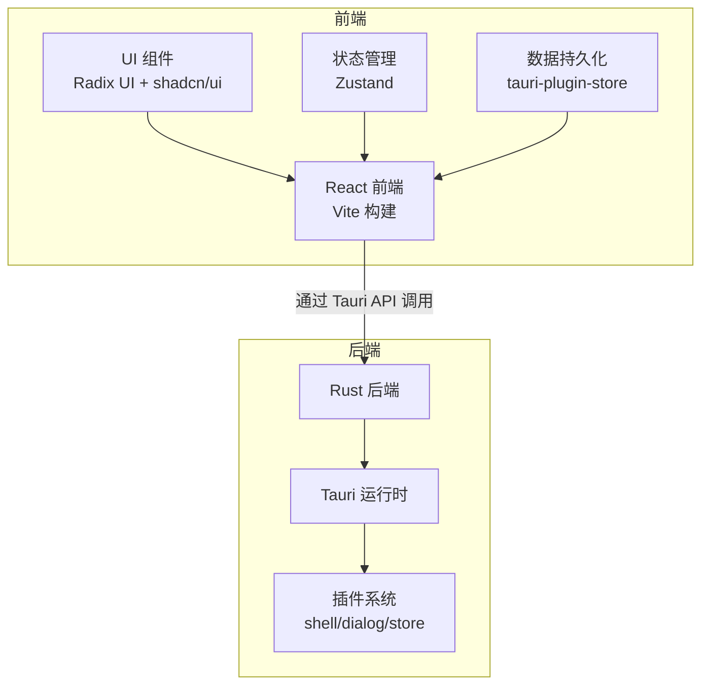
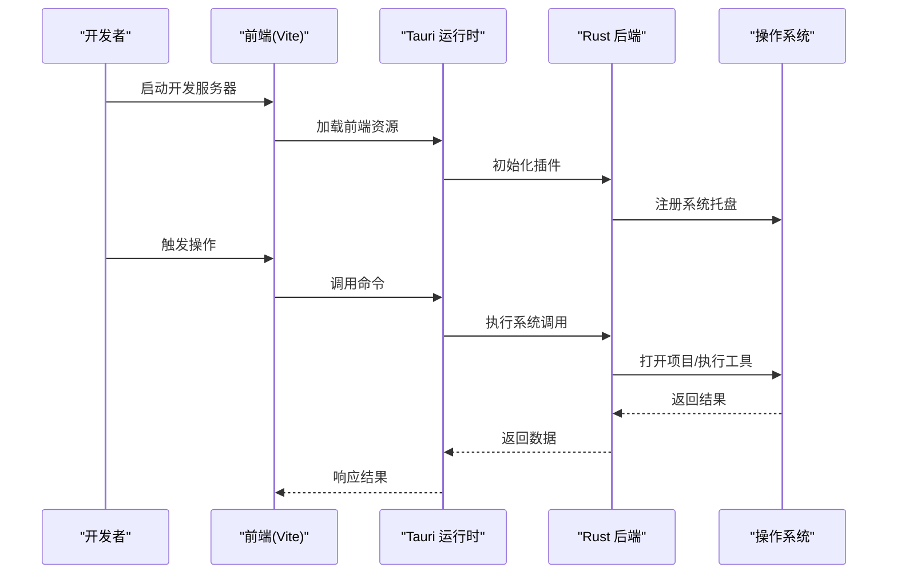
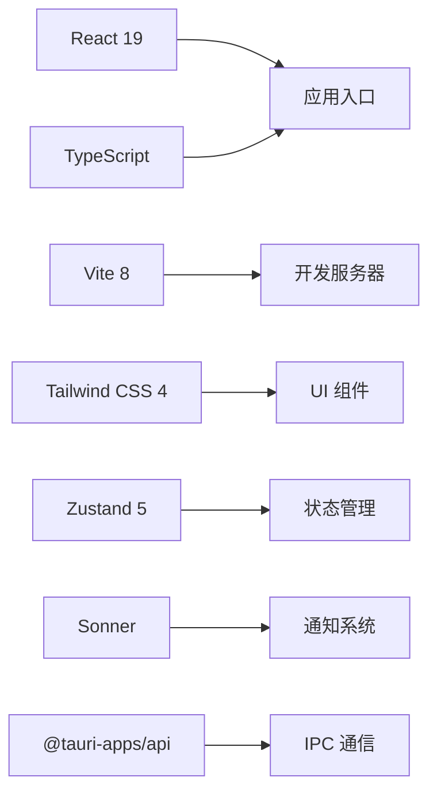
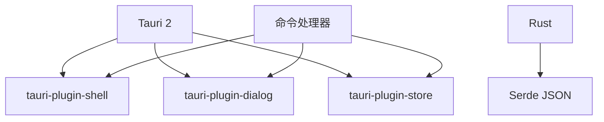

# 快速开始

<cite>
**本文引用的文件**
- [README.md](file://README.md)
- [README.zh-CN.md](file://README.zh-CN.md)
- [package.json](file://package.json)
- [vite.config.ts](file://vite.config.ts)
- [src-tauri/tauri.conf.json](file://src-tauri/tauri.conf.json)
- [src-tauri/Cargo.toml](file://src-tauri/Cargo.toml)
- [src-tauri/src/lib.rs](file://src-tauri/src/lib.rs)
- [src-tauri/src/main.rs](file://src-tauri/src/main.rs)
- [src-tauri/build.rs](file://src-tauri/build.rs)
</cite>

## 目录
1. [简介](#简介)
2. [项目结构](#项目结构)
3. [核心组件](#核心组件)
4. [架构总览](#架构总览)
5. [详细组件分析](#详细组件分析)
6. [依赖关系分析](#依赖关系分析)
7. [性能考虑](#性能考虑)
8. [故障排除指南](#故障排除指南)
9. [结论](#结论)
10. [附录](#附录)

## 简介
LaunchPro 是一款面向开发者的轻量级跨平台项目管理工具，基于 Tauri v2 构建，提供原生桌面体验。它允许你在本地统一管理所有项目，一键打开任意项目到你偏好的 IDE 或编辑器，并支持主题、系统托盘、本地存储等特性。

## 项目结构
项目采用前后端分离的架构：
- 前端：React 19 + TypeScript + Vite 8 + Tailwind CSS 4
- 后端：Rust + Tauri 2
- 状态管理：Zustand 5
- 数据持久化：tauri-plugin-store
- UI 组件：Radix UI + shadcn/ui
- 通知：Sonner



**图表来源**
- [package.json:13-29](file://package.json#L13-L29)
- [src-tauri/Cargo.toml:15-21](file://src-tauri/Cargo.toml#L15-L21)
- [src-tauri/src/lib.rs:6-26](file://src-tauri/src/lib.rs#L6-L26)

**章节来源**
- [README.md:115-135](file://README.md#L115-L135)
- [README.zh-CN.md:115-135](file://README.zh-CN.md#L115-L135)

## 核心组件
- 项目管理：添加、编辑、删除、组织项目（按标签和备注）
- 一键打开：使用偏好工具（VS Code、Cursor、WebStorm、Vim、终端等）打开项目
- 工具管理：内置预设 + 完全可定制的用户工具
- 最近历史：跟踪最后打开时间
- 主题支持：浅色/深色/系统主题
- 系统托盘：静默驻留托盘
- 本地存储：所有数据存储在本地，无需云端

**章节来源**
- [README.md:19-28](file://README.md#L19-L28)
- [README.zh-CN.md:19-28](file://README.zh-CN.md#L19-L28)

## 架构总览
LaunchPro 采用 Tauri v2 的桌面应用架构，前端通过 Vite 开发服务器提供热重载，后端通过 Rust 实现系统级能力，两者通过 Tauri 的 IPC 通信。



**图表来源**
- [vite.config.ts:16-30](file://vite.config.ts#L16-L30)
- [src-tauri/src/lib.rs:6-26](file://src-tauri/src/lib.rs#L6-L26)
- [src-tauri/tauri.conf.json:5-10](file://src-tauri/tauri.conf.json#L5-L10)

## 详细组件分析

### 安装方式

#### 方式一：下载预编译二进制文件（推荐）
1. 访问发布页面
2. 根据平台下载对应安装包：
   - macOS：Apple Silicon 或 Intel 版本
   - Windows：.exe 或 .msi 安装包
   - Linux：.deb 或 .AppImage 包
3. 安装并运行

macOS 特别提示：首次启动如遇安全警告，前往“系统设置 → 隐私与安全性”，点击“仍要打开”。

**章节来源**
- [README.md:46-55](file://README.md#L46-L55)
- [README.zh-CN.md:46-55](file://README.zh-CN.md#L46-L55)

#### 方式二：从源码构建
##### 环境依赖
- Node.js >= 18
- pnpm >= 8
- Rust（最新稳定版）
- Tauri 平台构建依赖

##### 构建步骤
```bash
# 1. 克隆仓库
git clone https://github.com/king-jingxiang/pro-manager.git
cd pro-manager

# 2. 安装前端依赖
pnpm install

# 3. 启动开发模式（热重载）
pnpm tauri dev

# 4. 构建生产包
pnpm tauri build
```

构建产物位于 `src-tauri/target/release/bundle/`。

**章节来源**
- [README.md:57-83](file://README.md#L57-L83)
- [README.zh-CN.md:57-83](file://README.zh-CN.md#L57-L83)

### 开发环境搭建

#### Node.js 和 pnpm
- Node.js：>= 18
- pnpm：>= 8

#### Rust 和 Tauri
- Rust：最新稳定版
- Tauri 平台构建依赖：参考 Tauri 官方前置条件文档

#### 开发服务器启动
```bash
# 启动开发服务器（热重载）
pnpm tauri dev

# 类型检查
pnpm tsc --noEmit

# 代码检查
pnpm lint

# 仅构建前端
pnpm build
```

**章节来源**
- [README.md:85-99](file://README.md#L85-L99)
- [README.zh-CN.md:85-99](file://README.zh-CN.md#L85-L99)

### 生产构建
```bash
# 构建生产二进制文件
pnpm tauri build
```

构建产物位于 `src-tauri/target/release/bundle/`，包含所有平台的安装包格式。

**章节来源**
- [README.md:83](file://README.md#L83)
- [README.zh-CN.md:83](file://README.zh-CN.md#L83)

## 依赖关系分析

### 技术栈概览
| 层级 | 技术 |
|------|------|
| UI 框架 | React 19 + TypeScript |
| 构建工具 | Vite 8 |
| 桌面运行时 | Tauri 2 |
| 后端 | Rust |
| 样式 | Tailwind CSS 4 |
| UI 组件 | Radix UI + shadcn/ui |
| 状态管理 | Zustand 5 |
| 数据持久化 | tauri-plugin-store |
| 通知 | Sonner |

### 前端依赖关系


**图表来源**
- [package.json:13-29](file://package.json#L13-L29)
- [package.json:30-46](file://package.json#L30-L46)

### 后端依赖关系


**图表来源**
- [src-tauri/Cargo.toml:15-21](file://src-tauri/Cargo.toml#L15-L21)
- [src-tauri/src/lib.rs:6-14](file://src-tauri/src/lib.rs#L6-L14)

**章节来源**
- [README.md:101-114](file://README.md#L101-L114)
- [README.zh-CN.md:101-114](file://README.zh-CN.md#L101-L114)

## 性能考虑
- 使用 Vite 的热重载机制提升开发效率
- Tauri 的原生二进制包减少运行时开销
- Zustand 的轻量状态管理避免不必要的重渲染
- Tailwind CSS 的原子化样式减少打包体积

## 故障排除指南

### macOS 安全设置问题
**问题**：首次启动显示安全警告
**解决方法**：前往“系统设置 → 隐私与安全性”，点击“仍要打开”

### 端口冲突
**问题**：开发服务器端口被占用
**解决方法**：修改 Vite 配置中的端口号或关闭占用进程

### Rust 编译错误
**问题**：Rust 依赖编译失败
**解决方法**：
1. 更新 Rust 到最新稳定版
2. 清理 Cargo 缓存：`cargo clean`
3. 重新安装依赖：`cargo update`

### Tauri 插件权限问题
**问题**：某些系统调用被拒绝
**解决方法**：检查 Tauri 配置中的权限设置，确保必要的插件已正确初始化

### 热重载不生效
**问题**：修改代码后页面未自动刷新
**解决方法**：
1. 确认开发服务器正在运行
2. 检查防火墙设置
3. 重启开发服务器

**章节来源**
- [README.md:55](file://README.md#L55)
- [vite.config.ts:16-30](file://vite.config.ts#L16-L30)

## 结论
LaunchPro 提供了完整的跨平台项目管理解决方案，既适合最终用户直接使用，也便于开发者进行二次开发。通过预编译二进制文件可以快速上手，而从源码构建则提供了完全的定制能力。

## 附录

### 系统要求和先决条件

#### 跨平台支持
| 平台 | 支持状态 | 安装包格式 |
|------|----------|-----------|
| macOS (10.15+) | ✅ | `.dmg`、`.app` |
| Windows (10+) | ✅ | `.msi`、`.exe` |
| Linux | ✅ | `.deb`、`.AppImage`、`.rpm` |

#### 开发环境要求
- Node.js：>= 18
- pnpm：>= 8
- Rust：最新稳定版
- Tauri 平台构建依赖：参考官方文档

### 开发命令参考
```bash
# 开发相关
pnpm tauri dev          # 启动开发服务器（热重载）
pnpm tsc --noEmit       # 类型检查
pnpm lint               # 代码检查
pnpm build              # 仅构建前端

# 构建相关
pnpm tauri build        # 构建生产包
```

**章节来源**
- [README.md:34-43](file://README.md#L34-L43)
- [README.md:59-64](file://README.md#L59-L64)
- [README.md:85-99](file://README.md#L85-L99)