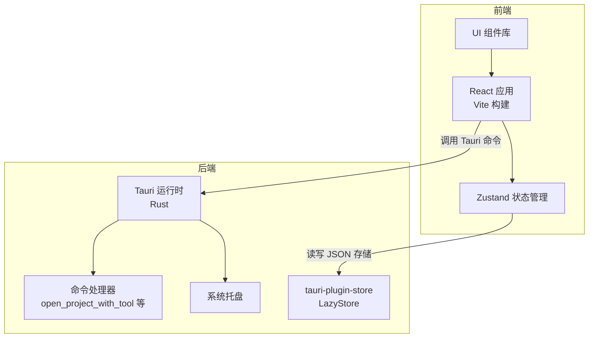
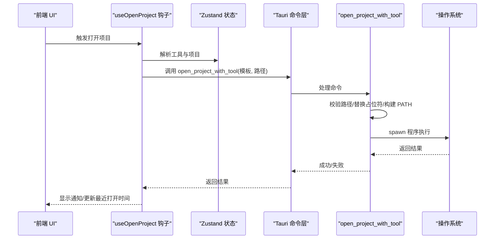
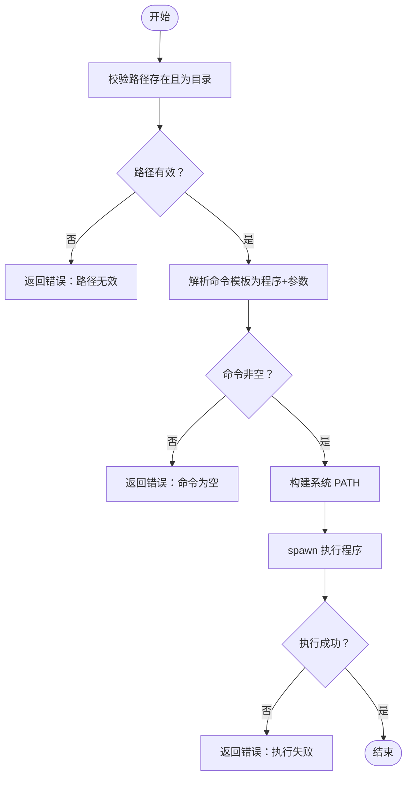
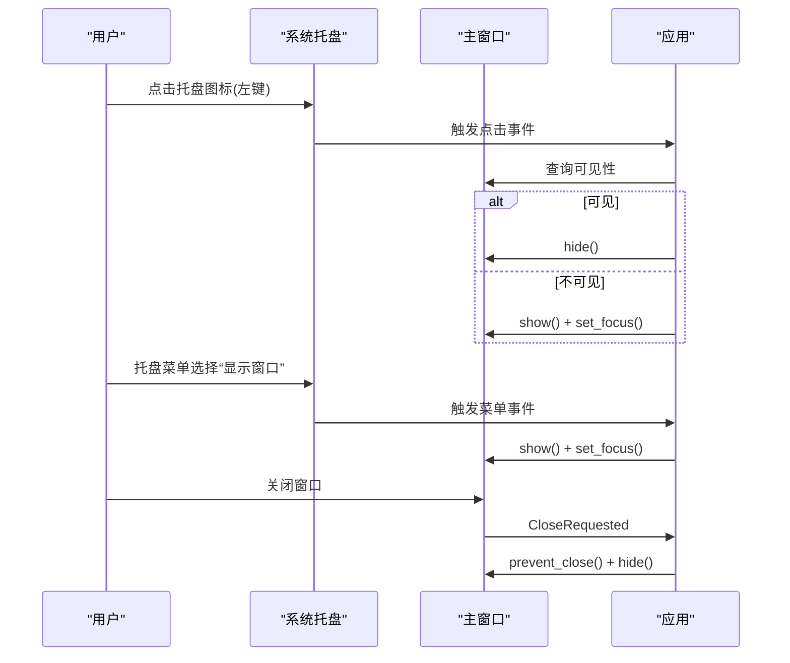
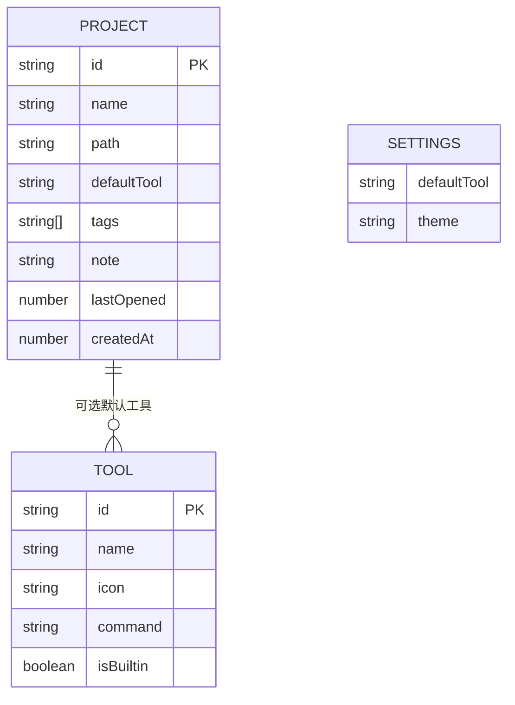
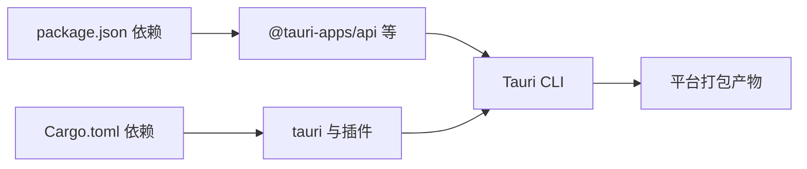

# 故障排除

<cite>
**本文引用的文件**
- [README.md](file://README.md)
- [package.json](file://package.json)
- [src-tauri/Cargo.toml](file://src-tauri/Cargo.toml)
- [src-tauri/tauri.conf.json](file://src-tauri/tauri.conf.json)
- [src-tauri/src/main.rs](file://src-tauri/src/main.rs)
- [src-tauri/src/lib.rs](file://src-tauri/src/lib.rs)
- [src-tauri/src/commands.rs](file://src-tauri/src/commands.rs)
- [src-tauri/src/tray.rs](file://src-tauri/src/tray.rs)
- [src/lib/constants.ts](file://src/lib/constants.ts)
- [src/lib/storage.ts](file://src/lib/storage.ts)
- [src/types/index.ts](file://src/types/index.ts)
- [src/hooks/useOpenProject.ts](file://src/hooks/useOpenProject.ts)
- [src/stores/useProjectStore.ts](file://src/stores/useProjectStore.ts)
- [src/components/project/ProjectList.tsx](file://src/components/project/ProjectList.tsx)
- [src/components/tool/ToolList.tsx](file://src/components/tool/ToolList.tsx)
</cite>

## 目录
1. [简介](#简介)
2. [项目结构](#项目结构)
3. [核心组件](#核心组件)
4. [架构总览](#架构总览)
5. [详细组件分析](#详细组件分析)
6. [依赖分析](#依赖分析)
7. [性能考虑](#性能考虑)
8. [故障排除指南](#故障排除指南)
9. [结论](#结论)
10. [附录](#附录)

## 简介
本指南面向 LaunchPro 用户与维护者，提供从安装到运行、从本地存储到系统集成的全链路故障排除方法。内容覆盖安装问题、运行时错误、性能问题、系统兼容性、日志与调试、数据损坏与恢复、网络与权限、平台特有问题、性能瓶颈与资源优化、社区支持与紧急恢复策略等。

## 项目结构
LaunchPro 采用 Tauri v2 前后端分离架构：前端使用 React 19 + TypeScript + Vite 构建，后端使用 Rust 提供系统能力（Shell 执行、对话框、系统托盘、本地存储）。数据持久化通过 tauri-plugin-store 的 LazyStore 实现，跨平台支持 macOS、Windows、Linux。

图表来源
- [src-tauri/src/lib.rs:5-27](file://src-tauri/src/lib.rs#L5-L27)
- [src-tauri/src/commands.rs:48-79](file://src-tauri/src/commands.rs#L48-L79)
- [src-tauri/src/tray.rs:8-57](file://src-tauri/src/tray.rs#L8-L57)
- [src/lib/storage.ts:1-30](file://src/lib/storage.ts#L1-L30)

章节来源
- [README.md:115-136](file://README.md#L115-L136)
- [package.json:1-48](file://package.json#L1-L48)
- [src-tauri/Cargo.toml:1-22](file://src-tauri/Cargo.toml#L1-L22)
- [src-tauri/tauri.conf.json:1-44](file://src-tauri/tauri.conf.json#L1-L44)

## 核心组件
- 启动入口与插件注册：应用启动在 Rust 层完成，注册 Shell、Dialog、Store 插件，并设置窗口事件与系统托盘。
- 命令层：提供打开项目工具、路径存在性检查、应用数据目录查询等命令。
- 存储层：基于 LazyStore 的 projects.json、tools.json、settings.json 三类本地存储。
- 前端状态与 UI：Zustand 管理项目列表与设置；组件负责过滤、排序、展示与交互。
- 类型系统：统一定义 Project、Tool、Settings、ActiveView 等类型。

章节来源
- [src-tauri/src/lib.rs:5-27](file://src-tauri/src/lib.rs#L5-L27)
- [src-tauri/src/commands.rs:48-95](file://src-tauri/src/commands.rs#L48-L95)
- [src/lib/storage.ts:1-30](file://src/lib/storage.ts#L1-L30)
- [src/stores/useProjectStore.ts:1-67](file://src/stores/useProjectStore.ts#L1-L67)
- [src/types/index.ts:1-26](file://src/types/index.ts#L1-L26)

## 架构总览
下图展示从前端到后端、再到系统与存储的关键交互路径。

图表来源
- [src/hooks/useOpenProject.ts:15-40](file://src/hooks/useOpenProject.ts#L15-L40)
- [src-tauri/src/commands.rs:48-79](file://src-tauri/src/commands.rs#L48-L79)
- [src/lib/storage.ts:1-30](file://src/lib/storage.ts#L1-L30)

## 详细组件分析

### 打开项目流程与错误处理
- 输入校验：路径存在且为目录；命令模板非空。
- PATH 构建：在 macOS 上从 /etc/paths 与常见位置拼接，避免 Tauri 不继承 shell PATH 的问题。
- 执行策略：按空白分割命令为程序与参数，设置 PATH 环境变量后异步启动。
- 错误返回：路径不存在、非目录、命令为空、执行失败均会返回错误字符串，前端通过通知展示。

图表来源
- [src-tauri/src/commands.rs:48-79](file://src-tauri/src/commands.rs#L48-L79)

章节来源
- [src-tauri/src/commands.rs:48-79](file://src-tauri/src/commands.rs#L48-L79)
- [src/hooks/useOpenProject.ts:15-40](file://src/hooks/useOpenProject.ts#L15-L40)

### 系统托盘与窗口行为
- 托盘菜单：显示窗口、退出。
- 左键点击托盘图标：切换主窗口显示/隐藏与焦点。
- 窗口关闭事件：阻止直接销毁，改为隐藏窗口并保持后台运行。

图表来源
- [src-tauri/src/tray.rs:24-53](file://src-tauri/src/tray.rs#L24-L53)
- [src-tauri/src/lib.rs:19-24](file://src-tauri/src/lib.rs#L19-L24)

章节来源
- [src-tauri/src/tray.rs:8-57](file://src-tauri/src/tray.rs#L8-L57)
- [src-tauri/src/lib.rs:15-24](file://src-tauri/src/lib.rs#L15-L24)

### 本地存储与数据模型
- 数据模型：Project、Tool、Settings、ActiveView。
- 存储文件：projects.json、tools.json、settings.json，LazyStore 自动保存。
- 默认值：内置工具集、默认主题等。
- 前端状态：项目列表加载、新增、更新、删除、最近打开时间更新。

图表来源
- [src/types/index.ts:1-26](file://src/types/index.ts#L1-L26)
- [src/lib/constants.ts:20-22](file://src/lib/constants.ts#L20-L22)
- [src/lib/storage.ts:4-17](file://src/lib/storage.ts#L4-L17)

章节来源
- [src/types/index.ts:1-26](file://src/types/index.ts#L1-L26)
- [src/lib/constants.ts:3-18](file://src/lib/constants.ts#L3-L18)
- [src/lib/storage.ts:1-30](file://src/lib/storage.ts#L1-L30)
- [src/stores/useProjectStore.ts:16-66](file://src/stores/useProjectStore.ts#L16-L66)

### 前端项目列表与筛选
- 功能：搜索、标签过滤、最近打开优先排序。
- 性能：使用 useMemo 缓存计算，避免重复渲染。
- 行为：无匹配时提示“无项目匹配”或“暂无项目”。

章节来源
- [src/components/project/ProjectList.tsx:22-55](file://src/components/project/ProjectList.tsx#L22-L55)

### 工具管理与自定义
- 分类：内置工具与自定义工具。
- 操作：查看、编辑、删除（仅自定义）。
- 展示：命令模板以等宽字体展示，便于核对。

章节来源
- [src/components/tool/ToolList.tsx:12-81](file://src/components/tool/ToolList.tsx#L12-L81)
- [src/lib/constants.ts:3-18](file://src/lib/constants.ts#L3-L18)

## 依赖分析
- 前端依赖：React、Zustand、Tailwind、Sonner、@tauri-apps/* 等。
- 后端依赖：tauri、tauri-plugin-shell、tauri-plugin-dialog、tauri-plugin-store、serde。
- 构建与打包：Vite、Tauri CLI、各平台包格式（.dmg/.app、.msi/.exe、.deb/.AppImage/.rpm）。

图表来源
- [package.json:13-29](file://package.json#L13-L29)
- [src-tauri/Cargo.toml:15-21](file://src-tauri/Cargo.toml#L15-L21)
- [src-tauri/tauri.conf.json:29-42](file://src-tauri/tauri.conf.json#L29-L42)

章节来源
- [package.json:1-48](file://package.json#L1-L48)
- [src-tauri/Cargo.toml:1-22](file://src-tauri/Cargo.toml#L1-L22)
- [src-tauri/tauri.conf.json:1-44](file://src-tauri/tauri.conf.json#L1-L44)

## 性能考虑
- 渲染性能
  - 使用 useMemo 缓存筛选与排序结果，减少不必要的重渲染。
  - 列表滚动区域使用 ScrollArea，避免大列表导致的布局抖动。
- 状态管理
  - Zustand 精简状态逻辑，避免过度拆分导致的同步成本。
- 存储性能
  - LazyStore 自动保存，避免频繁 IO；批量更新后一次性写入。
- 执行性能
  - 命令执行为异步 spawn，不阻塞 UI。
- 资源占用
  - 系统托盘常驻，窗口最小化时隐藏而非销毁，降低资源占用。

章节来源
- [src/components/project/ProjectList.tsx:22-55](file://src/components/project/ProjectList.tsx#L22-L55)
- [src/stores/useProjectStore.ts:16-66](file://src/stores/useProjectStore.ts#L16-L66)
- [src-tauri/src/lib.rs:19-24](file://src-tauri/src/lib.rs#L19-L24)

## 故障排除指南

### 安装与启动问题
- 下载安装包后无法启动
  - macOS：首次启动出现安全警告时，前往“系统设置 → 隐私与安全性”，点击“仍要打开”。参考 [README.md:55-55](file://README.md#L55-L55)。
  - Windows/Linux：确认安装包与系统架构匹配；必要时以管理员权限运行安装器。
- 开发模式无法热重载
  - 确认已安装 Node.js（>=18）、pnpm（>=8）、Rust（稳定版），并满足 Tauri 平台构建依赖。参考 [README.md:57-84](file://README.md#L57-L84)。
  - 前端开发服务器地址与 Tauri 配置一致：devUrl 为 http://localhost:5173。参考 [src-tauri/tauri.conf.json:5-10](file://src-tauri/tauri.conf.json#L5-L10)。
- 启动黑屏或窗口未显示
  - 系统托盘左键点击图标切换窗口显示/隐藏；若窗口被隐藏，可通过托盘菜单“显示窗口”恢复。参考 [src-tauri/src/tray.rs:36-53](file://src-tauri/src/tray.rs#L36-L53)、[src-tauri/src/lib.rs:19-24](file://src-tauri/src/lib.rs#L19-L24)。

章节来源
- [README.md:44-84](file://README.md#L44-L84)
- [src-tauri/tauri.conf.json:5-10](file://src-tauri/tauri.conf.json#L5-L10)
- [src-tauri/src/tray.rs:24-53](file://src-tauri/src/tray.rs#L24-L53)
- [src-tauri/src/lib.rs:19-24](file://src-tauri/src/lib.rs#L19-L24)

### 运行时错误与命令执行失败
- 症状：点击“打开项目”无响应或弹出错误通知。
  - 检查项目路径是否存在且为目录；命令模板是否包含 {path} 占位符；程序名是否存在于 PATH 中。
  - macOS 上 PATH 构建逻辑会从 /etc/paths 与常见位置合并，确保 IDE/CLI 工具安装路径被包含。参考 [src-tauri/src/commands.rs:7-46](file://src-tauri/src/commands.rs#L7-L46)。
- 典型错误
  - “路径不存在/非目录”：请检查项目路径是否正确。参考 [src-tauri/src/commands.rs:51-56](file://src-tauri/src/commands.rs#L51-L56)。
  - “命令为空”：请在工具设置中填写命令模板。参考 [src-tauri/src/commands.rs:63-65](file://src-tauri/src/commands.rs#L63-L65)。
  - “执行失败”：检查程序名与参数、PATH 设置、目标程序可执行权限。参考 [src-tauri/src/commands.rs:72-76](file://src-tauri/src/commands.rs#L72-L76)。
- 建议排查步骤
  - 在终端手动执行相同命令，验证 PATH 与权限。
  - 将工具命令模板简化为最小可用形式，逐步增加参数。
  - 若为内置工具，请确认命令模板与平台对应（如 macOS Finder/终端命令）。参考 [src/lib/constants.ts:3-18](file://src/lib/constants.ts#L3-L18)。

章节来源
- [src-tauri/src/commands.rs:48-79](file://src-tauri/src/commands.rs#L48-L79)
- [src/lib/constants.ts:3-18](file://src/lib/constants.ts#L3-L18)

### 系统兼容性问题
- macOS
  - 最低系统版本：10.15+。参考 [src-tauri/tauri.conf.json:39-41](file://src-tauri/tauri.conf.json#L39-L41)。
  - 首次启动安全警告：前往“系统设置 → 隐私与安全性”，点击“仍要打开”。参考 [README.md:55-55](file://README.md#L55-L55)。
  - PATH 问题：命令执行前会构建系统 PATH，包含 /etc/paths 与常见位置。参考 [src-tauri/src/commands.rs:7-46](file://src-tauri/src/commands.rs#L7-L46)。
- Windows
  - 支持 Windows 10+，安装包为 .msi 或 .exe。参考 [README.md:40-42](file://README.md#L40-L42)。
  - 若命令无法找到程序，请确认程序已加入系统 PATH，或在工具命令中使用完整路径。
- Linux
  - 支持 .deb、.AppImage、.rpm，安装包与架构需匹配。参考 [README.md:40-42](file://README.md#L40-L42)。
  - 若托盘图标缺失，确认系统托盘支持与图标路径有效。参考 [src-tauri/src/tray.rs:17-22](file://src-tauri/src/tray.rs#L17-L22)。

章节来源
- [README.md:34-56](file://README.md#L34-L56)
- [src-tauri/tauri.conf.json:39-41](file://src-tauri/tauri.conf.json#L39-L41)
- [src-tauri/src/commands.rs:7-46](file://src-tauri/src/commands.rs#L7-L46)
- [src-tauri/src/tray.rs:17-22](file://src-tauri/src/tray.rs#L17-L22)

### 日志收集、错误报告与调试信息
- 前端通知：使用 Sonner 展示成功/错误信息，便于快速定位问题。参考 [src/hooks/useOpenProject.ts:20-37](file://src/hooks/useOpenProject.ts#L20-L37)。
- 后端错误：命令执行失败返回错误字符串，可在前端 toast 中查看。建议复制错误文本用于反馈。参考 [src-tauri/src/commands.rs:51-56](file://src-tauri/src/commands.rs#L51-L56)、[src-tauri/src/commands.rs:72-76](file://src-tauri/src/commands.rs#L72-L76)。
- 应用数据目录：通过命令获取应用数据目录，便于手动检查存储文件与日志。参考 [src-tauri/src/commands.rs:87-94](file://src-tauri/src/commands.rs#L87-L94)。
- 调试建议
  - 在开发模式下使用浏览器控制台与 Tauri Devtools。
  - 临时禁用自定义工具，仅使用内置工具验证命令模板。
  - 检查系统托盘是否正常工作，避免窗口被意外隐藏。

章节来源
- [src/hooks/useOpenProject.ts:20-37](file://src/hooks/useOpenProject.ts#L20-L37)
- [src-tauri/src/commands.rs:87-94](file://src-tauri/src/commands.rs#L87-L94)

### 数据损坏、存储问题与配置错误恢复
- 存储文件位置
  - 三类 JSON 文件：projects.json、tools.json、settings.json，由 LazyStore 管理。参考 [src/lib/storage.ts:4-17](file://src/lib/storage.ts#L4-L17)。
- 常见问题
  - 项目列表为空：可能是存储损坏或初始化失败。参考 [src/stores/useProjectStore.ts:20-28](file://src/stores/useProjectStore.ts#L20-L28)。
  - 工具丢失：tools.json 内容异常，可回滚至默认内置工具集合。参考 [src/lib/constants.ts:3-18](file://src/lib/constants.ts#L3-L18)。
- 恢复流程
  - 备份：在应用数据目录中复制上述三个 JSON 文件。
  - 修复：若 tools.json 异常，将其内容替换为默认内置工具集合；若 projects.json 异常，清空数组或删除文件让其重建。
  - 验证：重启应用后检查工具与项目列表是否恢复。
- 注意事项
  - 修改前先停止应用，避免并发写入。
  - 如不确定操作，可删除对应 JSON 文件，应用会在下次启动时使用默认值重建。

章节来源
- [src/lib/storage.ts:4-17](file://src/lib/storage.ts#L4-L17)
- [src/stores/useProjectStore.ts:20-28](file://src/stores/useProjectStore.ts#L20-L28)
- [src/lib/constants.ts:3-18](file://src/lib/constants.ts#L3-L18)

### 网络连接、权限访问与系统集成
- 权限相关
  - 打开项目需要对目标路径有读取/执行权限；命令执行依赖系统 PATH。参考 [src-tauri/src/commands.rs:51-56](file://src-tauri/src/commands.rs#L51-L56)、[src-tauri/src/commands.rs:70-76](file://src-tauri/src/commands.rs#L70-L76)。
- 系统集成
  - 系统托盘：左键切换窗口，菜单项“显示窗口/退出”。参考 [src-tauri/src/tray.rs:24-35](file://src-tauri/src/tray.rs#L24-L35)。
  - 窗口行为：关闭请求改为隐藏窗口，避免进程退出导致状态丢失。参考 [src-tauri/src/lib.rs:19-24](file://src-tauri/src/lib.rs#L19-L24)。
- 网络
  - 应用为本地工具，不进行网络请求；若遇到网络相关报错，通常来自外部程序或系统代理设置。

章节来源
- [src-tauri/src/commands.rs:51-56](file://src-tauri/src/commands.rs#L51-L56)
- [src-tauri/src/commands.rs:70-76](file://src-tauri/src/commands.rs#L70-L76)
- [src-tauri/src/tray.rs:24-35](file://src-tauri/src/tray.rs#L24-L35)
- [src-tauri/src/lib.rs:19-24](file://src-tauri/src/lib.rs#L19-L24)

### 平台特有问题与解决方案
- macOS
  - Apple Silicon 与 Intel 包区分：下载对应架构安装包。参考 [README.md:50-50](file://README.md#L50-L50)。
  - PATH 与 CLI 工具：确保 IDE/CLI 工具安装在常见路径，以便自动包含。参考 [src-tauri/src/commands.rs:20-33](file://src-tauri/src/commands.rs#L20-L33)。
- Windows
  - 安装包格式：.msi 或 .exe；若安装失败，尝试以管理员身份运行。参考 [README.md:51-51](file://README.md#L51-L51)。
- Linux
  - 包格式：.deb、.AppImage、.rpm；若托盘图标不显示，检查桌面环境托盘支持。参考 [README.md:52-52](file://README.md#L52-L52)、[src-tauri/src/tray.rs:17-22](file://src-tauri/src/tray.rs#L17-L22)。

章节来源
- [README.md:48-56](file://README.md#L48-L56)
- [src-tauri/src/commands.rs:20-33](file://src-tauri/src/commands.rs#L20-L33)
- [src-tauri/src/tray.rs:17-22](file://src-tauri/src/tray.rs#L17-L22)

### 性能瓶颈分析、内存泄漏检测与资源占用优化
- 性能瓶颈
  - 大量项目列表：使用 useMemo 缓存筛选与排序，避免重复计算。参考 [src/components/project/ProjectList.tsx:22-55](file://src/components/project/ProjectList.tsx#L22-L55)。
  - 频繁状态更新：Zustand 批量更新后再写入存储，减少 IO 次数。参考 [src/stores/useProjectStore.ts:30-65](file://src/stores/useProjectStore.ts#L30-L65)。
- 内存泄漏检测
  - 确保组件卸载时取消未完成的副作用（如长耗时任务）；当前组件未见明显副作用，无需额外处理。
- 资源占用优化
  - 系统托盘常驻，窗口最小化隐藏；避免后台进程占用 CPU。参考 [src-tauri/src/lib.rs:19-24](file://src-tauri/src/lib.rs#L19-L24)、[src-tauri/src/tray.rs:36-53](file://src-tauri/src/tray.rs#L36-L53)。

章节来源
- [src/components/project/ProjectList.tsx:22-55](file://src/components/project/ProjectList.tsx#L22-L55)
- [src/stores/useProjectStore.ts:30-65](file://src/stores/useProjectStore.ts#L30-L65)
- [src-tauri/src/lib.rs:19-24](file://src-tauri/src/lib.rs#L19-L24)
- [src-tauri/src/tray.rs:36-53](file://src-tauri/src/tray.rs#L36-L53)

### 社区支持、问题反馈与功能请求
- 版本与平台信息：可在 README 中查看当前版本与平台支持矩阵。参考 [README.md:7-43](file://README.md#L7-L43)。
- 贡献与 PR：欢迎提交 Pull Request，遵循贡献流程。参考 [README.md:137-146](file://README.md#L137-L146)。
- 发布与下载：前往 Releases 页面下载预编译二进制。参考 [README.md:46-54](file://README.md#L46-L54)。

章节来源
- [README.md:7-146](file://README.md#L7-L146)

### 紧急情况下的数据备份与系统恢复策略
- 备份策略
  - 定期复制应用数据目录中的 projects.json、tools.json、settings.json。
  - 备份位置建议：云盘或外部存储，确保可离线访问。
- 恢复策略
  - 若应用启动异常：删除对应 JSON 文件，重启应用以重建默认数据。
  - 若工具异常：恢复 tools.json 至默认内置工具集合。
  - 若项目异常：清空 projects 数组或删除文件，重启应用重建。
- 获取应用数据目录
  - 通过命令获取路径，便于手动备份与恢复。参考 [src-tauri/src/commands.rs:87-94](file://src-tauri/src/commands.rs#L87-L94)。

章节来源
- [src-tauri/src/commands.rs:87-94](file://src-tauri/src/commands.rs#L87-L94)
- [src/lib/storage.ts:4-17](file://src/lib/storage.ts#L4-L17)

## 结论
本指南围绕 LaunchPro 的安装、运行、存储、系统集成与性能优化提供了系统化的故障排除方法。建议在日常使用中定期备份存储文件，遇到问题时优先检查 PATH 与命令模板、应用数据目录与托盘行为，并结合前端通知与后端错误信息定位根因。对于平台特有问题，依据 README 与平台最低版本要求进行针对性排查。

## 附录
- 快速检查清单
  - 安装包与系统匹配、首次启动安全警告处理。
  - 命令模板包含 {path}，程序名在 PATH 中。
  - 应用数据目录可访问，JSON 文件可读写。
  - 系统托盘正常，窗口未被意外隐藏。
  - 备份存储文件，必要时回滚至默认集合。