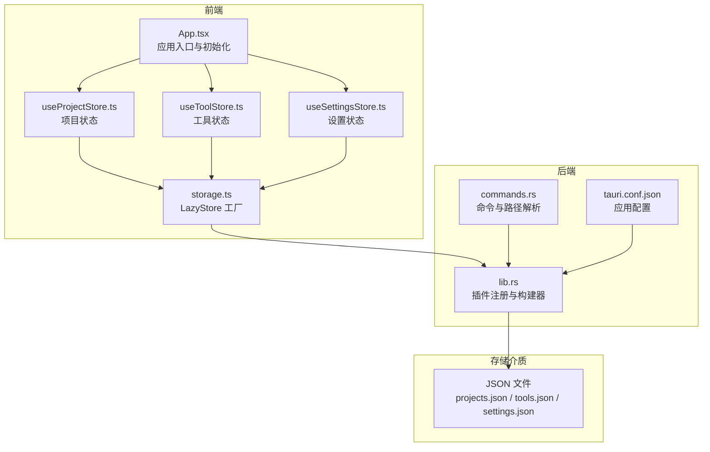
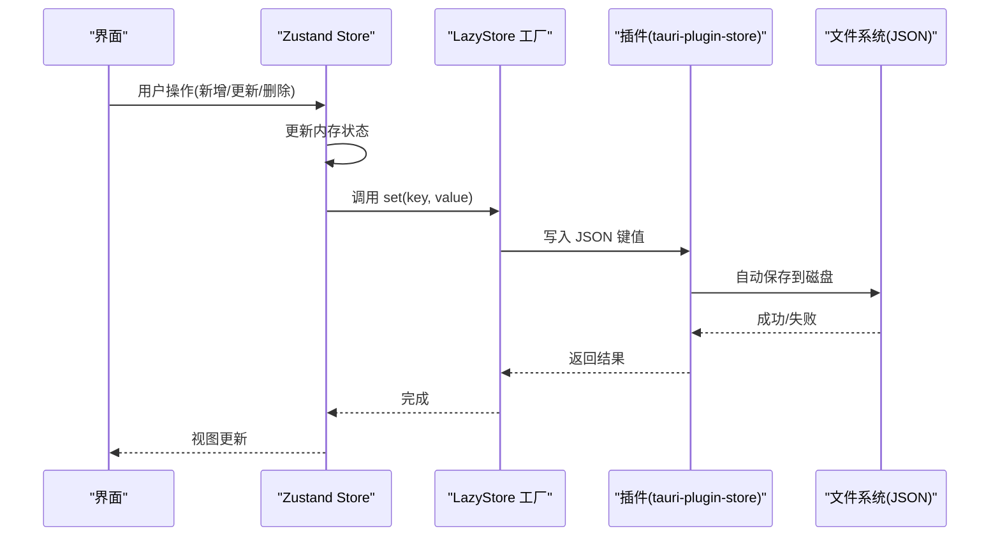
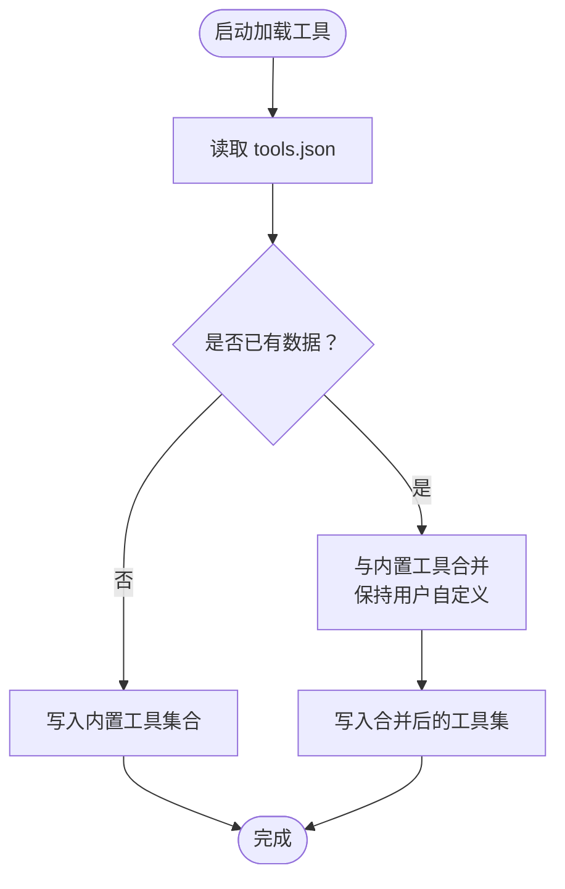
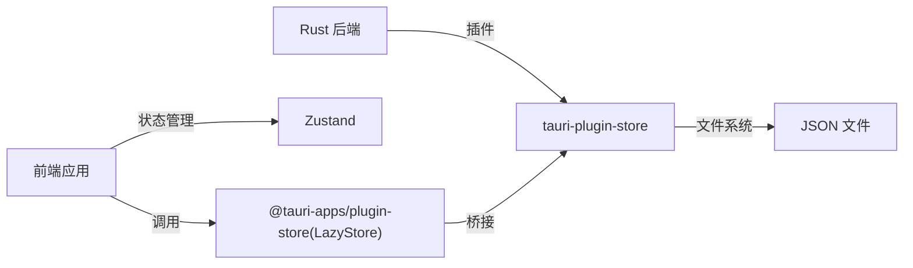

# 数据持久化

<cite>
**本文引用的文件**
- [storage.ts](file://src/lib/storage.ts)
- [useProjectStore.ts](file://src/stores/useProjectStore.ts)
- [useToolStore.ts](file://src/stores/useToolStore.ts)
- [useSettingsStore.ts](file://src/stores/useSettingsStore.ts)
- [constants.ts](file://src/lib/constants.ts)
- [index.ts](file://src/types/index.ts)
- [lib.rs](file://src-tauri/src/lib.rs)
- [Cargo.toml](file://src-tauri/Cargo.toml)
- [commands.rs](file://src-tauri/src/commands.rs)
- [tauri.conf.json](file://src-tauri/tauri.conf.json)
- [App.tsx](file://src/App.tsx)
- [main.tsx](file://src/main.tsx)
</cite>

## 目录
1. [简介](#简介)
2. [项目结构](#项目结构)
3. [核心组件](#核心组件)
4. [架构总览](#架构总览)
5. [组件详解](#组件详解)
6. [依赖关系分析](#依赖关系分析)
7. [性能与并发](#性能与并发)
8. [数据完整性与错误处理](#数据完整性与错误处理)
9. [备份、导入、导出与迁移](#备份导入导出与迁移)
10. [安全与隐私](#安全与隐私)
11. [故障排除与修复](#故障排除与修复)
12. [结论](#结论)

## 简介
本文件系统性梳理 LaunchPro 的数据持久化体系，围绕前端状态层与后端存储插件的协作展开，重点覆盖：
- tauri-plugin-store 的使用方式与配置要点
- JSON 文件格式的数据模型与结构
- 序列化/反序列化与版本迁移策略
- 完整性保障、错误处理与恢复机制
- 备份、导入/导出与迁移实践
- 安全性与隐私保护
- 性能优化、缓存策略与并发访问控制
- 常见问题排查与修复建议

## 项目结构
LaunchPro 的持久化由“前端状态层（Zustand）+ 后端存储插件（tauri-plugin-store）”构成，数据以 JSON 文件形式落地到应用数据目录。

图表来源
- [App.tsx:21-30](file://src/App.tsx#L21-L30)
- [useProjectStore.ts:16-28](file://src/stores/useProjectStore.ts#L16-L28)
- [useToolStore.ts:17-39](file://src/stores/useToolStore.ts#L17-L39)
- [useSettingsStore.ts:13-25](file://src/stores/useSettingsStore.ts#L13-L25)
- [storage.ts:4-17](file://src/lib/storage.ts#L4-L17)
- [lib.rs:9](file://src-tauri/src/lib.rs#L9)
- [commands.rs:88-94](file://src-tauri/src/commands.rs#L88-L94)
- [tauri.conf.json:1-44](file://src-tauri/tauri.conf.json#L1-L44)

章节来源
- [App.tsx:21-30](file://src/App.tsx#L21-L30)
- [storage.ts:4-17](file://src/lib/storage.ts#L4-L17)
- [lib.rs:9](file://src-tauri/src/lib.rs#L9)
- [tauri.conf.json:1-44](file://src-tauri/tauri.conf.json#L1-L44)

## 核心组件
- LazyStore 工厂：在前端通过工厂函数暴露三个 LazyStore 实例，分别对应 projects.json、tools.json、settings.json，并启用自动保存。
- Zustand 状态层：各业务 Store 负责读取/写入数据并触发 LazyStore 的 set/get 操作。
- 插件注册：后端在应用启动时注册 tauri-plugin-store，确保前端可调用存储能力。
- 类型与默认值：通过 types/index.ts 定义数据模型；constants.ts 提供内置工具与默认设置，作为首次初始化的基准。

章节来源
- [storage.ts:1-30](file://src/lib/storage.ts#L1-L30)
- [useProjectStore.ts:1-67](file://src/stores/useProjectStore.ts#L1-L67)
- [useToolStore.ts:1-75](file://src/stores/useToolStore.ts#L1-L75)
- [useSettingsStore.ts:1-34](file://src/stores/useSettingsStore.ts#L1-L34)
- [constants.ts:1-23](file://src/lib/constants.ts#L1-L23)
- [index.ts:1-26](file://src/types/index.ts#L1-L26)
- [lib.rs:9](file://src-tauri/src/lib.rs#L9)

## 架构总览
前端通过 LazyStore 读写 JSON 文件，Zustand Store 在内存中维护最新状态，自动保存确保变更即时落盘。后端负责插件初始化与应用数据目录查询等辅助能力。

图表来源
- [storage.ts:4-17](file://src/lib/storage.ts#L4-L17)
- [useProjectStore.ts:30-40](file://src/stores/useProjectStore.ts#L30-L40)
- [useToolStore.ts:41-51](file://src/stores/useToolStore.ts#L41-L51)
- [useSettingsStore.ts:27-32](file://src/stores/useSettingsStore.ts#L27-L32)
- [lib.rs:9](file://src-tauri/src/lib.rs#L9)

## 组件详解

### LazyStore 工厂与自动保存
- 三个 LazyStore 实例分别管理三类数据：
  - projects.json：键为 projects，初始默认值为空数组
  - tools.json：键为 tools，初始默认值为内置工具集合
  - settings.json：键为 settings，初始默认值为默认设置对象
- autoSave: true 表示每次 set 操作后立即持久化，降低丢失风险
- 默认值在首次创建文件时写入，确保新用户也能获得可用的初始数据

章节来源
- [storage.ts:4-17](file://src/lib/storage.ts#L4-L17)
- [constants.ts:3-18](file://src/lib/constants.ts#L3-L18)
- [constants.ts:20-22](file://src/lib/constants.ts#L20-L22)

### 项目数据模型与序列化
- 数据模型来自 types/index.ts，包含 Project、Tool、Settings 三类实体
- 序列化/反序列化：LazyStore 使用 JSON 进行键值序列化，无需额外转换
- 写入时机：Zustand Store 在每次增删改后调用 store.set，配合 autoSave 实现即时落盘

章节来源
- [index.ts:1-26](file://src/types/index.ts#L1-L26)
- [storage.ts:4-17](file://src/lib/storage.ts#L4-L17)

### 工具数据的合并与初始化策略
- 首次启动：若 tools.json 中无数据，则写入内置工具集合
- 后续启动：若存在用户自定义工具，会与内置工具进行去重合并，保留用户自定义项
- 禁止删除内置工具：删除逻辑对 isBuiltin=true 的条目直接返回，避免破坏基础能力

图表来源
- [useToolStore.ts:21-39](file://src/stores/useToolStore.ts#L21-L39)
- [constants.ts:3-18](file://src/lib/constants.ts#L3-L18)

章节来源
- [useToolStore.ts:17-39](file://src/stores/useToolStore.ts#L17-L39)
- [constants.ts:3-18](file://src/lib/constants.ts#L3-L18)

### 设置数据的默认值与回退
- 初始化：从 DEFAULT_SETTINGS 读取默认值
- 加载：优先从 settings.json 读取，若异常或缺失则回退到默认值
- 写入：每次更新均写回 settings.json 并自动保存

章节来源
- [useSettingsStore.ts:13-25](file://src/stores/useSettingsStore.ts#L13-L25)
- [constants.ts:20-22](file://src/lib/constants.ts#L20-L22)

### 应用初始化与数据加载顺序
- App.tsx 在挂载后并行触发工具、项目、设置的加载流程
- 通过并行初始化减少首屏等待时间，提升用户体验

章节来源
- [App.tsx:21-30](file://src/App.tsx#L21-L30)

## 依赖关系分析
- 前端依赖
  - @tauri-apps/plugin-store：提供 LazyStore 能力
  - zustand：状态管理
  - uuid：生成唯一标识
- 后端依赖
  - tauri-plugin-store：Rust 插件，负责 JSON 存储实现
  - serde/serde_json：序列化支持
- 配置
  - 插件在 lib.rs 中注册
  - tauri.conf.json 控制应用窗口、托盘、打包等元信息

图表来源
- [Cargo.toml:19](file://src-tauri/Cargo.toml#L19)
- [lib.rs:9](file://src-tauri/src/lib.rs#L9)
- [storage.ts:1](file://src/lib/storage.ts#L1)

章节来源
- [Cargo.toml:15-22](file://src-tauri/Cargo.toml#L15-L22)
- [lib.rs:9](file://src-tauri/src/lib.rs#L9)
- [storage.ts:1](file://src/lib/storage.ts#L1)

## 性能与并发
- 自动保存策略：autoSave: true 使每次 set 即时落盘，降低崩溃丢失风险，但可能带来频繁 IO。如需进一步优化，可在高频写场景下引入节流/批量写入策略。
- 内存优先：Zustand 将当前状态保留在内存，读取优先从内存返回，减少重复 IO。
- 并发访问：LazyStore 未暴露显式锁，建议在 UI 层避免同时发起大量并发写入；可通过状态层串行化写入或合并更新来规避竞态。
- 首屏加载：App.tsx 并行加载三大模块，缩短冷启动时间。

章节来源
- [storage.ts:6](file://src/lib/storage.ts#L6)
- [storage.ts:11](file://src/lib/storage.ts#L11)
- [storage.ts:16](file://src/lib/storage.ts#L16)
- [App.tsx:26-30](file://src/App.tsx#L26-L30)

## 数据完整性与错误处理
- 异常回退：Store 的 load 方法在读取失败时回退到空/默认值，保证应用稳定启动
- 写入确认：每次 set 后由插件自动保存，结合异常捕获可实现“写入失败”的上层提示
- 结构校验：当前未实现运行时模式校验，建议在后续版本增加类型校验与默认值补全逻辑

章节来源
- [useProjectStore.ts:20-28](file://src/stores/useProjectStore.ts#L20-L28)
- [useSettingsStore.ts:17-25](file://src/stores/useSettingsStore.ts#L17-L25)
- [useToolStore.ts:21-39](file://src/stores/useToolStore.ts#L21-L39)

## 备份、导入、导出与迁移

### 备份与导出
- JSON 文件位置：通过命令获取应用数据目录，定位 projects.json、tools.json、settings.json
- 导出：可直接复制上述 JSON 文件作为备份
- 导入：将备份文件替换到同一目录，重启应用即可生效

章节来源
- [commands.rs:88-94](file://src-tauri/src/commands.rs#L88-L94)
- [lib.rs:9](file://src-tauri/src/lib.rs#L9)

### 版本迁移策略
- 当前实现：未发现显式的版本字段与迁移逻辑
- 建议方案：
  - 在 settings.json 中加入 version 字段
  - 在应用启动时检查 version，若低于当前版本则执行迁移脚本
  - 迁移步骤包括：字段补齐、默认值注入、结构升级、索引重建等
  - 迁移前后保留旧数据副本，失败时回滚

[本节为通用实践建议，不直接对应具体源码，故不附“章节来源”]

## 安全与隐私
- 访问控制：桌面端与 macOS schema 中包含 store 相关的 ACL 条目，表明可按需限制存储命令的访问范围
- 数据最小化：仅存储必要字段（如项目路径、工具命令模板、主题偏好），避免敏感信息
- 传输与存储：数据以本地 JSON 文件形式存储，未见网络传输逻辑；建议在企业版中考虑加密存储

章节来源
- [lib.rs:9](file://src-tauri/src/lib.rs#L9)
- [tauri.conf.json:1-44](file://src-tauri/tauri.conf.json#L1-L44)

## 故障排除与修复
- 症状：应用启动后数据为空
  - 排查：检查 JSON 文件是否存在、权限是否正确
  - 修复：删除对应 JSON 文件以触发默认值回填；或手动恢复备份
- 症状：工具列表缺失内置项
  - 排查：确认 tools.json 是否被清空或损坏
  - 修复：删除 tools.json 或从备份恢复；应用会在下次启动时重新写入内置工具
- 症状：设置未生效
  - 排查：确认 settings.json 是否被意外修改
  - 修复：删除 settings.json 以回退到默认设置
- 症状：写入失败或卡顿
  - 排查：检查磁盘空间与文件锁定
  - 修复：关闭占用文件的进程，释放锁；必要时重启应用

章节来源
- [useToolStore.ts:21-39](file://src/stores/useToolStore.ts#L21-L39)
- [useSettingsStore.ts:17-25](file://src/stores/useSettingsStore.ts#L17-L25)
- [storage.ts:4-17](file://src/lib/storage.ts#L4-L17)

## 结论
LaunchPro 的数据持久化采用“Zustand 内存状态 + LazyStore JSON 文件”的轻量方案，具备以下特点：
- 易于部署：无需数据库，纯 JSON 文件
- 可靠性强：自动保存与异常回退保障基本可用性
- 扩展空间大：内置工具合并、默认值注入、ACL 控制等为后续增强提供基础

建议在后续迭代中补充：
- 版本字段与迁移框架
- 写入节流/批量策略
- 运行时类型校验与默认值补全
- 可选的加密存储与更细粒度的 ACL 配置