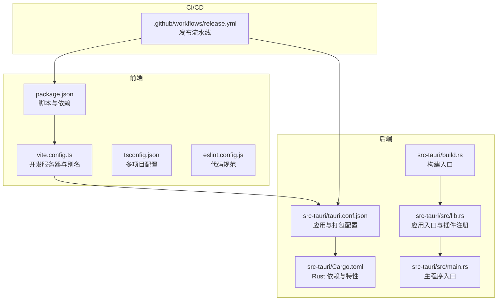
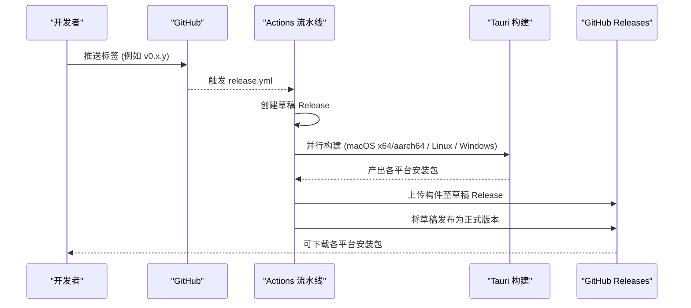
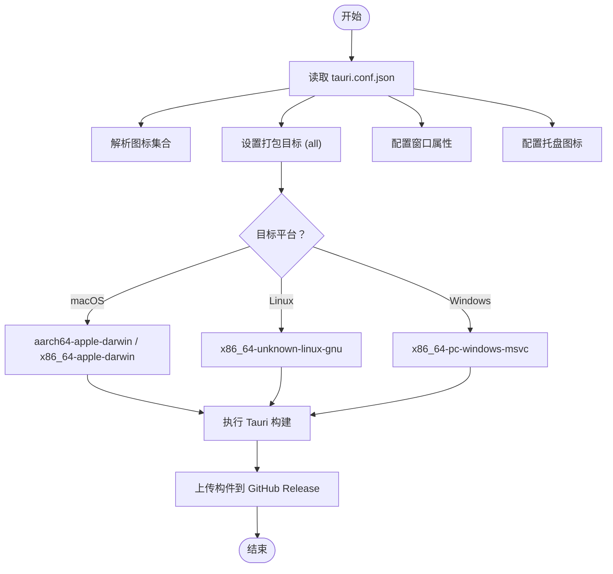
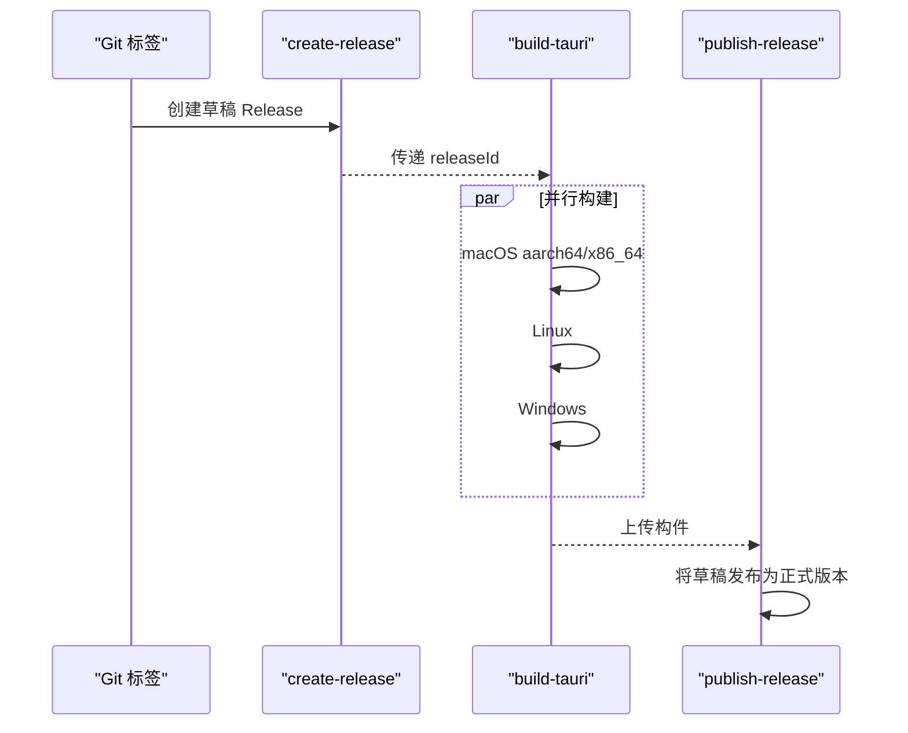
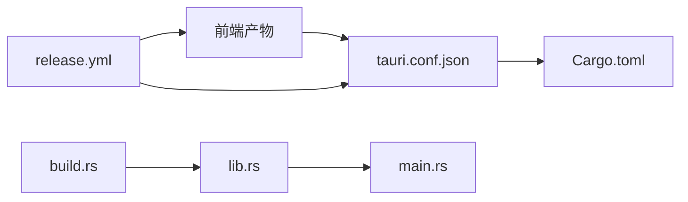

# 构建与部署

<cite>
**本文引用的文件**
- [package.json](file://package.json)
- [vite.config.ts](file://vite.config.ts)
- [.github/workflows/release.yml](file://.github/workflows/release.yml)
- [src-tauri/tauri.conf.json](file://src-tauri/tauri.conf.json)
- [src-tauri/Cargo.toml](file://src-tauri/Cargo.toml)
- [src-tauri/build.rs](file://src-tauri/build.rs)
- [src-tauri/src/lib.rs](file://src-tauri/src/lib.rs)
- [src-tauri/src/main.rs](file://src-tauri/src/main.rs)
- [eslint.config.js](file://eslint.config.js)
- [tsconfig.json](file://tsconfig.json)
- [README.md](file://README.md)
</cite>

## 目录
1. [简介](#简介)
2. [项目结构](#项目结构)
3. [核心组件](#核心组件)
4. [架构总览](#架构总览)
5. [详细组件分析](#详细组件分析)
6. [依赖关系分析](#依赖关系分析)
7. [性能考虑](#性能考虑)
8. [故障排查指南](#故障排查指南)
9. [结论](#结论)
10. [附录](#附录)

## 简介
本文件面向 LaunchPro 的构建与部署，覆盖多平台构建流程、打包配置、GitHub Actions CI/CD 流水线、图标与签名要求、构建优化与资源压缩、依赖管理策略、发布前质量检查清单、版本与变更日志规范、回滚与紧急修复流程、分发渠道与安装包验证、以及部署监控与问题诊断建议。内容基于仓库现有配置文件进行归纳与提炼，确保可操作性与可追溯性。

## 项目结构
LaunchPro 采用前端（React + Vite + TypeScript）+ 后端（Rust + Tauri v2）的混合架构，通过 Tauri 将前端资源打包为原生桌面应用。关键目录与职责如下：
- src/：React 前端源码，包含组件、状态管理、工具函数与类型定义
- src-tauri/：Rust 后端与 Tauri 配置，包含应用入口、命令处理、托盘逻辑与打包配置
- .github/workflows/：CI/CD 流水线定义，负责自动化构建与发布
- 根目录：包管理与构建脚本、ESLint 配置、TypeScript 多项目配置等

图表来源
- [package.json:1-48](file://package.json#L1-L48)
- [vite.config.ts:1-32](file://vite.config.ts#L1-L32)
- [tsconfig.json:1-8](file://tsconfig.json#L1-L8)
- [eslint.config.js:1-24](file://eslint.config.js#L1-L24)
- [src-tauri/tauri.conf.json:1-44](file://src-tauri/tauri.conf.json#L1-L44)
- [src-tauri/Cargo.toml:1-22](file://src-tauri/Cargo.toml#L1-L22)
- [src-tauri/build.rs:1-4](file://src-tauri/build.rs#L1-L4)
- [src-tauri/src/lib.rs:1-28](file://src-tauri/src/lib.rs#L1-L28)
- [src-tauri/src/main.rs:1-7](file://src-tauri/src/main.rs#L1-L7)
- [.github/workflows/release.yml:1-130](file://.github/workflows/release.yml#L1-L130)

章节来源
- [README.md:115-135](file://README.md#L115-L135)

## 核心组件
- 前端构建与开发环境
  - 使用 Vite 作为构建工具与开发服务器，启用 React 插件与 Tailwind CSS 插件；配置路径别名与 HMR 主机参数，便于多设备联调
  - TypeScript 通过多项目配置组织应用与 Node 工具链
  - ESLint 配置遵循推荐规则集，结合 React Hooks 与 React Refresh 规则
- 后端与打包配置
  - Tauri v2 应用配置集中于 tauri.conf.json，定义产品名称、版本、标识符、开发前/构建前命令、前端产物目录、窗口属性、托盘图标与打包目标
  - Rust 侧 Cargo.toml 声明 Tauri 与插件依赖、特性开关与 crate 类型
  - 构建入口 build.rs 调用 tauri_build，lib.rs 注册插件与命令，main.rs 控制控制台窗口行为并在发布时隐藏额外控制台
- CI/CD 流水线
  - 基于 Git 标签触发，自动创建 GitHub Release（草稿），随后在多平台矩阵中并行构建 Tauri 应用，最终发布草稿为正式版本

章节来源
- [vite.config.ts:1-32](file://vite.config.ts#L1-L32)
- [tsconfig.json:1-8](file://tsconfig.json#L1-L8)
- [eslint.config.js:1-24](file://eslint.config.js#L1-L24)
- [src-tauri/tauri.conf.json:1-44](file://src-tauri/tauri.conf.json#L1-L44)
- [src-tauri/Cargo.toml:1-22](file://src-tauri/Cargo.toml#L1-L22)
- [src-tauri/build.rs:1-4](file://src-tauri/build.rs#L1-L4)
- [src-tauri/src/lib.rs:1-28](file://src-tauri/src/lib.rs#L1-L28)
- [src-tauri/src/main.rs:1-7](file://src-tauri/src/main.rs#L1-L7)
- [.github/workflows/release.yml:1-130](file://.github/workflows/release.yml#L1-L130)

## 架构总览
下图展示从代码提交到多平台发布的关键节点与交互：

图表来源
- [.github/workflows/release.yml:1-130](file://.github/workflows/release.yml#L1-L130)

## 详细组件分析

### 前端构建与开发环境
- Vite 配置要点
  - 插件：React 与 Tailwind CSS 插件
  - 别名：@ 指向 src，提升导入便捷性
  - 服务器：固定端口与严格端口，支持通过环境变量配置 HMR 主机，避免监听 src-tauri 目录
- TypeScript 配置
  - 通过 references 引入应用与 Node 工具链两套 tsconfig，实现清晰的边界与增量编译
- ESLint 配置
  - 组合推荐规则集，启用 React Hooks 与 React Refresh 规则，忽略 dist 输出目录

章节来源
- [vite.config.ts:1-32](file://vite.config.ts#L1-L32)
- [tsconfig.json:1-8](file://tsconfig.json#L1-L8)
- [eslint.config.js:1-24](file://eslint.config.js#L1-L24)

### 后端与打包配置
- 应用与窗口
  - 产品名称、版本、标识符与开发/构建前命令明确，前端产物目录指向根 dist
  - 窗口尺寸与最小尺寸、居中显示与装饰开启
- 托盘与图标
  - 托盘图标路径与模板图标设置
  - 打包阶段指定多尺寸 PNG 与 macOS/iOS 图标文件
- 平台与系统版本
  - macOS 最低系统版本设置
- Rust 依赖与特性
  - Tauri 与插件依赖声明，启用 tray-icon 与 image-png 特性
  - 构建入口调用 tauri_build

图表来源
- [src-tauri/tauri.conf.json:1-44](file://src-tauri/tauri.conf.json#L1-L44)
- [src-tauri/Cargo.toml:1-22](file://src-tauri/Cargo.toml#L1-L22)
- [src-tauri/build.rs:1-4](file://src-tauri/build.rs#L1-L4)

章节来源
- [src-tauri/tauri.conf.json:1-44](file://src-tauri/tauri.conf.json#L1-L44)
- [src-tauri/Cargo.toml:1-22](file://src-tauri/Cargo.toml#L1-L22)
- [src-tauri/build.rs:1-4](file://src-tauri/build.rs#L1-L4)

### CI/CD 流水线与自动化发布
- 触发条件
  - 仅当推送以 v 前缀的标签时触发
- 任务分解
  - 创建草稿 Release：提取版本号，创建带下载说明的草稿
  - 并行构建：macOS（两种架构）、Linux、Windows，按需安装平台依赖与 Rust 目标
  - 发布：将草稿置为正式版本
- 关键注意点
  - macOS 签名与 Apple ID 凭据在仓库 Secrets 中预留位置，当前未启用
  - Linux 依赖通过 apt 安装，包含 WebKit、AppIndicator、GTK 等

图表来源
- [.github/workflows/release.yml:1-130](file://.github/workflows/release.yml#L1-L130)

章节来源
- [.github/workflows/release.yml:1-130](file://.github/workflows/release.yml#L1-L130)

### 多平台构建与打包配置
- 平台矩阵
  - macOS：双架构并行构建
  - Linux：Ubuntu 22.04，安装 GTK/WebKit/AppIndicator 等依赖
  - Windows：Windows Latest
- 打包目标
  - tauri.conf.json 中 targets 设为 all，将生成多平台安装包
- 图标与托盘
  - 托盘图标路径与模板设置
  - 打包图标清单包含多尺寸 PNG 与 macOS/iOS 图标文件
- 系统版本
  - macOS 最低系统版本设置为 10.15

章节来源
- [.github/workflows/release.yml:43-58](file://.github/workflows/release.yml#L43-L58)
- [src-tauri/tauri.conf.json:29-42](file://src-tauri/tauri.conf.json#L29-L42)

### 构建优化、资源压缩与依赖管理
- 构建优化
  - 前端：Vite 默认启用生产模式下的代码分割与 Tree Shaking；可通过插件扩展压缩策略
  - 后端：Rust 在 release 构建中默认优化，Tauri 打包时进一步裁剪
- 资源压缩
  - 建议在 Vite 中引入压缩插件（如 esbuild 或 Terser）以减少产物体积
  - Tailwind CSS 按需引入与 Purge 配置可降低样式体积
- 依赖管理
  - 前端依赖集中在 package.json，使用 pnpm 管理；保持版本锁定与定期更新
  - Rust 依赖集中在 Cargo.toml，启用所需特性，避免不必要的 crate

章节来源
- [package.json:13-29](file://package.json#L13-L29)
- [package.json:30-46](file://package.json#L30-L46)
- [src-tauri/Cargo.toml:15-21](file://src-tauri/Cargo.toml#L15-L21)

### 版本管理、变更日志与发布说明
- 版本来源
  - 前端与后端分别维护版本字段；建议统一由标签版本驱动
- 变更日志与发布说明
  - 流水线在草稿中引用 CHANGELOG.md；建议在仓库中维护 CHANGELOG.md 并按语义化版本维护条目
- 标签规范
  - 使用 v<主>.<次>.<修订> 形式的标签触发发布

章节来源
- [.github/workflows/release.yml:19-37](file://.github/workflows/release.yml#L19-L37)
- [README.md:40-52](file://README.md#L40-L52)

### 回滚策略、紧急修复与热修补丁
- 回滚策略
  - 通过 GitHub Releases 回退到上一稳定版本；保留历史构件以便快速恢复
- 紧急修复
  - 在新标签上快速修复并重新发布；必要时在同一天内发布多个补丁版本
- 热修补丁
  - Tauri 应用为独立二进制，不支持传统热修补丁；建议通过版本升级引导用户更新

章节来源
- [.github/workflows/release.yml:110-129](file://.github/workflows/release.yml#L110-L129)

### 分发渠道、安装包验证与用户反馈
- 分发渠道
  - GitHub Releases 为主要分发渠道；根据平台提供 .dmg、.msi、.exe、.deb、.AppImage、.rpm 等安装包
- 安装包验证
  - 建议在发布前进行手动验证（不同架构与系统版本），并提供校验摘要（如 SHA256）
- 用户反馈
  - 通过 Issues 收集问题；在 README 中提供反馈入口与常见问题指引

章节来源
- [README.md:34-56](file://README.md#L34-L56)
- [.github/workflows/release.yml:23-37](file://.github/workflows/release.yml#L23-L37)

### 部署监控、性能跟踪与问题诊断
- 部署监控
  - 可在 CI 中集成发布统计与下载量监控（如外部服务）
- 性能跟踪
  - 建议在应用内埋点关键事件（启动、打开项目、工具调用等），结合日志与崩溃报告
- 问题诊断
  - 提供最小复现步骤与系统信息收集模板；在 README 中提供常见问题与解决指引

章节来源
- [README.md:55-56](file://README.md#L55-L56)

## 依赖关系分析
- 前端到后端
  - 前端构建产物由 tauri.conf.json 指定的前端产物目录提供给 Tauri 打包
- 后端到打包
  - tauri.conf.json 决定图标、托盘、打包目标与平台最低版本
  - Cargo.toml 决定 Rust 依赖与特性
  - build.rs 调用 tauri_build 完成构建入口
- CI/CD 到发布
  - release.yml 通过 GitHub Scripts 与 tauri-action 完成构件上传与发布

图表来源
- [src-tauri/tauri.conf.json:1-44](file://src-tauri/tauri.conf.json#L1-L44)
- [src-tauri/Cargo.toml:1-22](file://src-tauri/Cargo.toml#L1-L22)
- [src-tauri/build.rs:1-4](file://src-tauri/build.rs#L1-L4)
- [src-tauri/src/lib.rs:1-28](file://src-tauri/src/lib.rs#L1-L28)
- [src-tauri/src/main.rs:1-7](file://src-tauri/src/main.rs#L1-L7)
- [.github/workflows/release.yml:1-130](file://.github/workflows/release.yml#L1-L130)

章节来源
- [src-tauri/tauri.conf.json:5-10](file://src-tauri/tauri.conf.json#L5-L10)
- [src-tauri/Cargo.toml:12-21](file://src-tauri/Cargo.toml#L12-L21)

## 性能考虑
- 前端体积
  - 使用按需引入与 Tree Shaking；在 Vite 中启用压缩插件
  - Tailwind CSS 按需输出，避免未使用类名进入产物
- 后端体积
  - Rust release 构建默认优化；仅启用必要特性，减少链接体积
- 打包体积
  - Tauri 打包时裁剪无关资源；确保图标与托盘资源精简且尺寸合理

## 故障排查指南
- 开发与构建常见问题
  - 端口冲突：调整 Vite server.port 或关闭占用进程
  - HMR 不生效：确认 host 与 strictPort 配置，避免监听 src-tauri 目录
  - 依赖安装失败：使用 pnpm 并确保 Node.js 与 Rust 版本满足前置条件
- CI/CD 常见问题
  - Linux 依赖缺失：检查 apt 安装步骤是否执行
  - macOS 签名失败：若启用签名，检查仓库 Secrets 是否正确配置
  - 构件上传失败：确认 releaseId 传递与 GITHUB_TOKEN 权限
- 发布后验证
  - 不同平台与架构的安装包均需验证；记录系统版本与用户反馈

章节来源
- [vite.config.ts:16-30](file://vite.config.ts#L16-L30)
- [.github/workflows/release.yml:80-91](file://.github/workflows/release.yml#L80-L91)
- [.github/workflows/release.yml:99-108](file://.github/workflows/release.yml#L99-L108)

## 结论
本文件基于仓库现有配置，梳理了 LaunchPro 的构建与部署体系：从前端开发环境、后端打包配置，到 CI/CD 自动化发布与多平台产物生成。建议后续补充变更日志与发布说明规范、完善 macOS 签名与签名凭据管理、增加安装包校验与用户反馈流程，并在应用内加入基础遥测与错误上报机制，以持续提升发布质量与用户体验。

## 附录
- 快速参考
  - 开发：pnpm tauri dev
  - 构建：pnpm tauri build
  - 预览：pnpm preview
  - 类型检查：pnpm tsc --noEmit
  - 代码检查：pnpm lint
- 平台与安装包
  - macOS：.dmg、.app
  - Windows：.msi、.exe
  - Linux：.deb、.AppImage、.rpm

章节来源
- [README.md:66-84](file://README.md#L66-L84)
- [README.md:40-52](file://README.md#L40-L52)