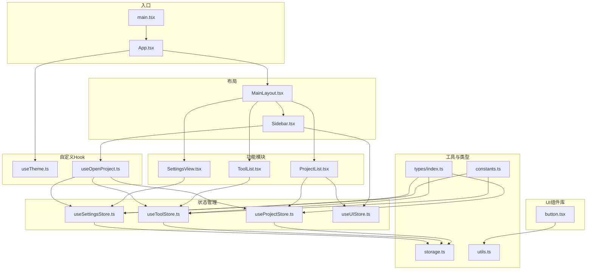
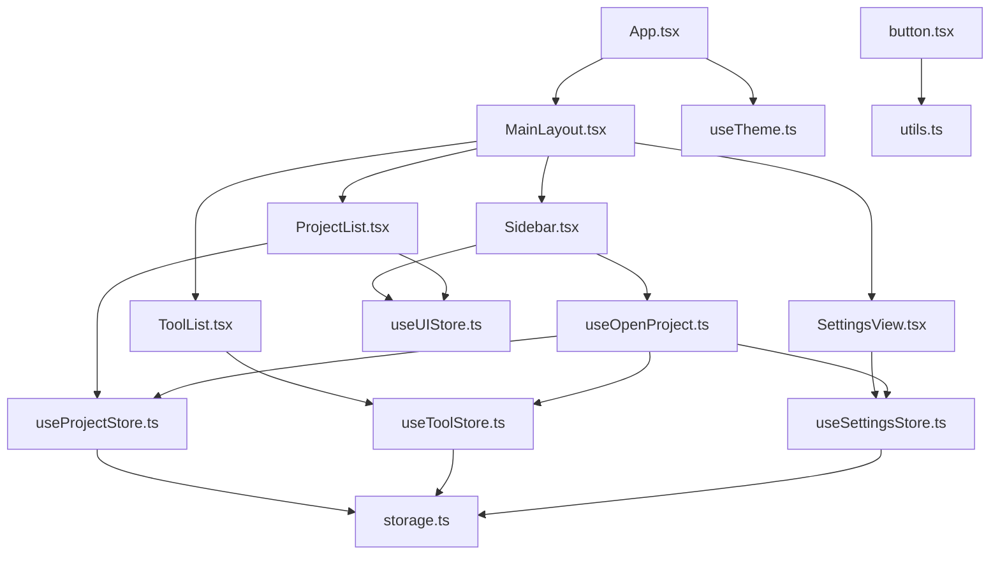
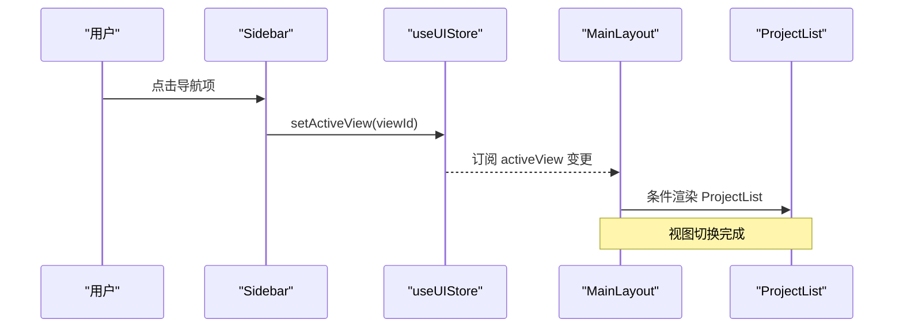
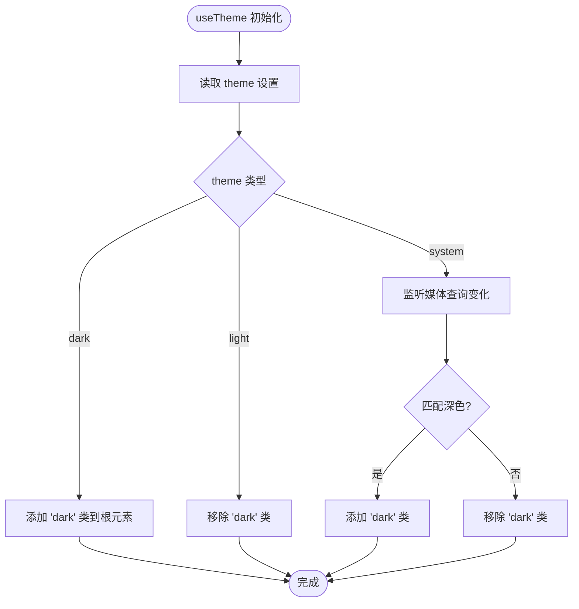
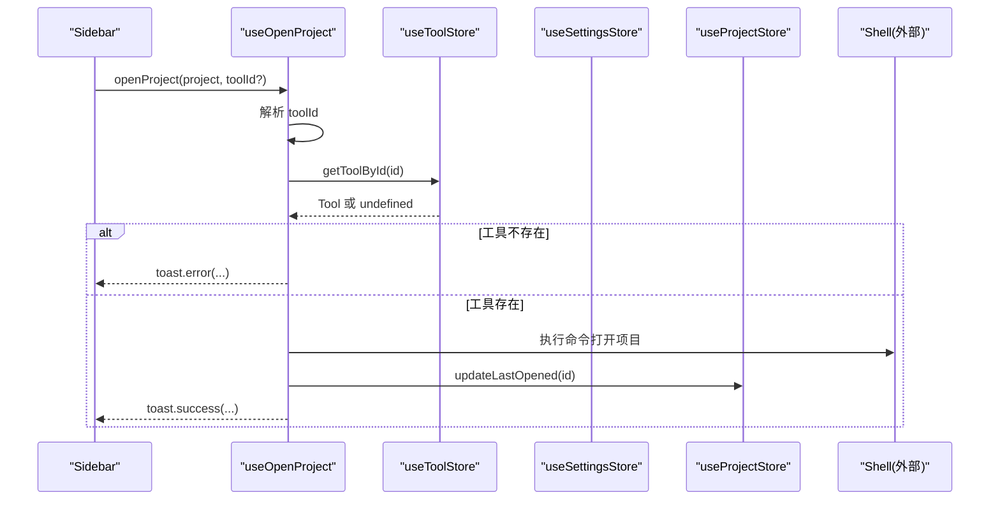
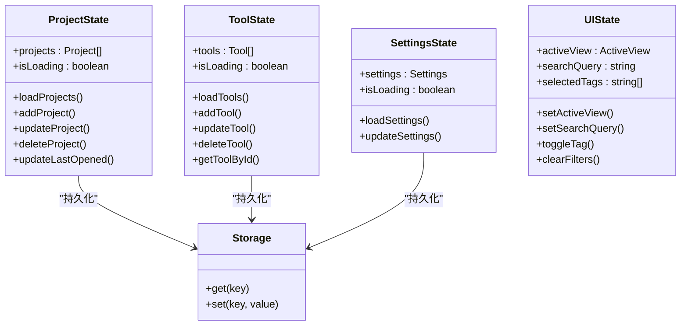
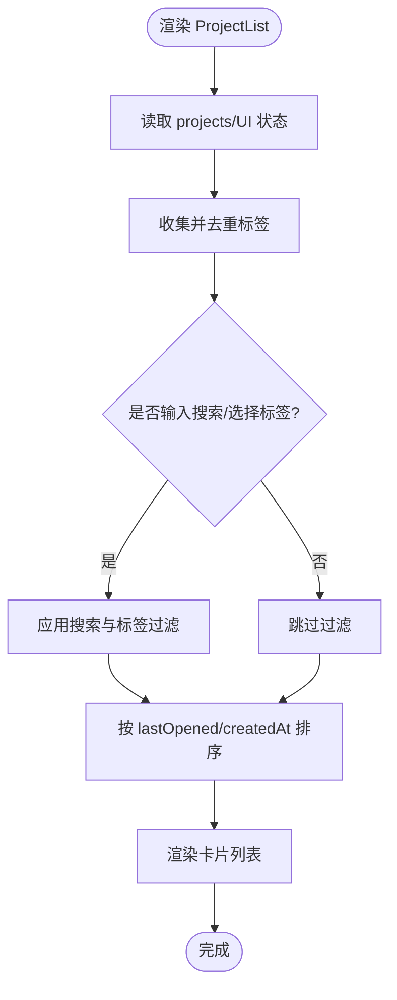
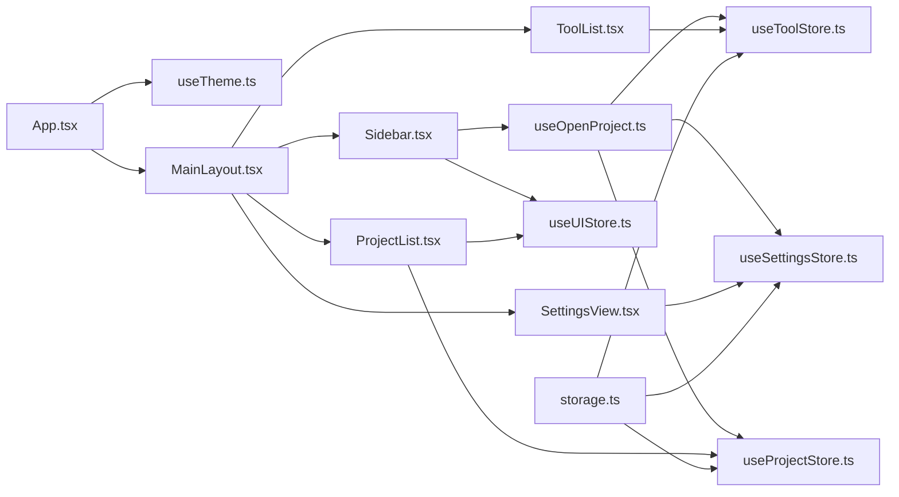

# 前端架构

<cite>
**本文引用的文件**
- [src/main.tsx](file://src/main.tsx)
- [src/App.tsx](file://src/App.tsx)
- [src/components/layout/MainLayout.tsx](file://src/components/layout/MainLayout.tsx)
- [src/components/layout/Sidebar.tsx](file://src/components/layout/Sidebar.tsx)
- [src/hooks/useTheme.ts](file://src/hooks/useTheme.ts)
- [src/hooks/useOpenProject.ts](file://src/hooks/useOpenProject.ts)
- [src/stores/useProjectStore.ts](file://src/stores/useProjectStore.ts)
- [src/stores/useToolStore.ts](file://src/stores/useToolStore.ts)
- [src/stores/useSettingsStore.ts](file://src/stores/useSettingsStore.ts)
- [src/stores/useUIStore.ts](file://src/stores/useUIStore.ts)
- [src/types/index.ts](file://src/types/index.ts)
- [src/lib/constants.ts](file://src/lib/constants.ts)
- [src/lib/storage.ts](file://src/lib/storage.ts)
- [src/lib/utils.ts](file://src/lib/utils.ts)
- [src/components/ui/button.tsx](file://src/components/ui/button.tsx)
- [src/components/project/ProjectList.tsx](file://src/components/project/ProjectList.tsx)
- [src/components/tool/ToolList.tsx](file://src/components/tool/ToolList.tsx)
- [package.json](file://package.json)
</cite>

## 目录
1. [引言](#引言)
2. [项目结构](#项目结构)
3. [核心组件](#核心组件)
4. [架构总览](#架构总览)
5. [详细组件分析](#详细组件分析)
6. [依赖关系分析](#依赖关系分析)
7. [性能考虑](#性能考虑)
8. [故障排查指南](#故障排查指南)
9. [结论](#结论)
10. [附录](#附录)

## 引言
本文件面向 LaunchPro 前端（基于 React 19）的架构与实现进行系统化文档化，重点覆盖以下方面：
- 组件层次结构与布局系统：主布局 MainLayout 与侧边栏 Sidebar 的职责分离与交互模式
- 主题管理：useTheme Hook 的实现原理与系统级样式切换
- 自定义 Hook：useOpenProject 的工具选择、项目打开流程与错误处理
- 状态管理：Zustand Store 的组织方式与跨模块协作
- UI 组件库：设计原则、变体系统与复用策略
- 路由与视图切换：基于 UI Store 的视图状态驱动
- 错误边界与性能优化：Toast 提示、懒加载存储与计算优化
- 组件间通信与数据流：单向数据流与事件回调链路

## 项目结构
项目采用按功能域分层的目录组织方式：
- 根入口与应用壳层：main.tsx、App.tsx
- 布局与页面：components/layout 下的 MainLayout 与 Sidebar
- 功能模块：project、tool、settings
- UI 组件库：components/ui 下的通用组件
- 自定义 Hook：hooks 下的 useTheme、useOpenProject
- 状态管理：stores 下的 useProjectStore、useToolStore、useSettingsStore、useUIStore
- 类型定义：types 下的接口与枚举
- 工具与常量：lib 下的 constants、storage、utils
- 依赖声明：package.json

图表来源
- [src/main.tsx:1-11](file://src/main.tsx#L1-L11)
- [src/App.tsx:1-40](file://src/App.tsx#L1-L40)
- [src/components/layout/MainLayout.tsx:1-21](file://src/components/layout/MainLayout.tsx#L1-L21)
- [src/components/layout/Sidebar.tsx:1-80](file://src/components/layout/Sidebar.tsx#L1-L80)
- [src/components/project/ProjectList.tsx:1-168](file://src/components/project/ProjectList.tsx#L1-L168)
- [src/components/tool/ToolList.tsx:1-129](file://src/components/tool/ToolList.tsx#L1-L129)
- [src/stores/useProjectStore.ts:1-67](file://src/stores/useProjectStore.ts#L1-L67)
- [src/stores/useToolStore.ts:1-75](file://src/stores/useToolStore.ts#L1-L75)
- [src/stores/useSettingsStore.ts:1-34](file://src/stores/useSettingsStore.ts#L1-L34)
- [src/stores/useUIStore.ts:1-33](file://src/stores/useUIStore.ts#L1-L33)
- [src/hooks/useTheme.ts:1-37](file://src/hooks/useTheme.ts#L1-L37)
- [src/hooks/useOpenProject.ts:1-44](file://src/hooks/useOpenProject.ts#L1-L44)
- [src/lib/storage.ts:1-30](file://src/lib/storage.ts#L1-L30)
- [src/lib/constants.ts:1-23](file://src/lib/constants.ts#L1-L23)
- [src/lib/utils.ts:1-7](file://src/lib/utils.ts#L1-L7)
- [src/components/ui/button.tsx:1-65](file://src/components/ui/button.tsx#L1-L65)
- [src/types/index.ts:1-26](file://src/types/index.ts#L1-L26)

章节来源
- [src/main.tsx:1-11](file://src/main.tsx#L1-L11)
- [src/App.tsx:1-40](file://src/App.tsx#L1-L40)

## 核心组件
- 应用入口与壳层
  - main.tsx：创建根节点并渲染 App
  - App.tsx：初始化各 Store 的加载逻辑，注入全局 Provider，并挂载主题与通知组件
- 布局系统
  - MainLayout：根据 UI Store 的 activeView 渲染不同视图容器
  - Sidebar：导航按钮与最近项目列表，负责视图切换与项目打开
- 功能视图
  - ProjectList：项目搜索、标签过滤、排序与卡片展示
  - ToolList：内置与自定义工具展示、编辑与删除
  - SettingsView：设置页（当前未在 MainLayout 中渲染，但已预留）
- UI 组件库
  - button.tsx：基于 class-variance-authority 的变体系统，支持多种尺寸与外观
- 自定义 Hook
  - useTheme：读取设置并动态切换根元素的 dark 类名，支持跟随系统
  - useOpenProject：解析工具、调用 Tauri 命令打开项目并更新最近使用时间
- 状态管理
  - useProjectStore：项目 CRUD、最近打开时间更新、本地持久化
  - useToolStore：工具 CRUD、内置工具合并、本地持久化
  - useSettingsStore：主题与默认工具等设置的加载与更新
  - useUIStore：当前视图、搜索关键词、标签筛选、清空筛选
- 工具与类型
  - constants.ts：内置工具清单与默认设置
  - storage.ts：基于 @tauri-apps/plugin-store 的 LazyStore 封装
  - utils.ts：Tailwind 合并类名工具
  - types/index.ts：Project、Tool、Settings、ActiveView 接口与类型

章节来源
- [src/main.tsx:1-11](file://src/main.tsx#L1-L11)
- [src/App.tsx:1-40](file://src/App.tsx#L1-L40)
- [src/components/layout/MainLayout.tsx:1-21](file://src/components/layout/MainLayout.tsx#L1-L21)
- [src/components/layout/Sidebar.tsx:1-80](file://src/components/layout/Sidebar.tsx#L1-L80)
- [src/components/project/ProjectList.tsx:1-168](file://src/components/project/ProjectList.tsx#L1-L168)
- [src/components/tool/ToolList.tsx:1-129](file://src/components/tool/ToolList.tsx#L1-L129)
- [src/components/ui/button.tsx:1-65](file://src/components/ui/button.tsx#L1-L65)
- [src/hooks/useTheme.ts:1-37](file://src/hooks/useTheme.ts#L1-L37)
- [src/hooks/useOpenProject.ts:1-44](file://src/hooks/useOpenProject.ts#L1-L44)
- [src/stores/useProjectStore.ts:1-67](file://src/stores/useProjectStore.ts#L1-L67)
- [src/stores/useToolStore.ts:1-75](file://src/stores/useToolStore.ts#L1-L75)
- [src/stores/useSettingsStore.ts:1-34](file://src/stores/useSettingsStore.ts#L1-L34)
- [src/stores/useUIStore.ts:1-33](file://src/stores/useUIStore.ts#L1-L33)
- [src/lib/constants.ts:1-23](file://src/lib/constants.ts#L1-L23)
- [src/lib/storage.ts:1-30](file://src/lib/storage.ts#L1-L30)
- [src/lib/utils.ts:1-7](file://src/lib/utils.ts#L1-L7)
- [src/types/index.ts:1-26](file://src/types/index.ts#L1-L26)

## 架构总览
前端采用“布局-模块-组件-状态”的分层架构：
- 布局层：MainLayout 作为容器，Sidebar 作为导航与上下文入口
- 模块层：ProjectList、ToolList、SettingsView 分别承载业务功能
- 组件层：UI 组件库提供一致的视觉与交互语义
- 状态层：Zustand Store 实现模块内状态隔离与共享
- 外部集成：@tauri-apps 插件用于文件对话框、Shell 执行与本地存储

图表来源
- [src/App.tsx:1-40](file://src/App.tsx#L1-L40)
- [src/components/layout/MainLayout.tsx:1-21](file://src/components/layout/MainLayout.tsx#L1-L21)
- [src/components/layout/Sidebar.tsx:1-80](file://src/components/layout/Sidebar.tsx#L1-L80)
- [src/components/project/ProjectList.tsx:1-168](file://src/components/project/ProjectList.tsx#L1-L168)
- [src/components/tool/ToolList.tsx:1-129](file://src/components/tool/ToolList.tsx#L1-L129)
- [src/stores/useProjectStore.ts:1-67](file://src/stores/useProjectStore.ts#L1-L67)
- [src/stores/useToolStore.ts:1-75](file://src/stores/useToolStore.ts#L1-L75)
- [src/stores/useSettingsStore.ts:1-34](file://src/stores/useSettingsStore.ts#L1-L34)
- [src/stores/useUIStore.ts:1-33](file://src/stores/useUIStore.ts#L1-L33)
- [src/hooks/useTheme.ts:1-37](file://src/hooks/useTheme.ts#L1-L37)
- [src/hooks/useOpenProject.ts:1-44](file://src/hooks/useOpenProject.ts#L1-L44)
- [src/lib/storage.ts:1-30](file://src/lib/storage.ts#L1-L30)
- [src/components/ui/button.tsx:1-65](file://src/components/ui/button.tsx#L1-L65)
- [src/lib/utils.ts:1-7](file://src/lib/utils.ts#L1-L7)

## 详细组件分析

### 主布局 MainLayout 与侧边栏 Sidebar 的设计模式与职责分离
- MainLayout
  - 负责：容器布局与视图切换；通过 useUIStore 获取 activeView 并渲染对应视图
  - 视图映射：projects → ProjectList；tools → ToolList；settings → SettingsView
- Sidebar
  - 导航职责：根据 NAV_ITEMS 列表渲染导航按钮，点击时通过 useUIStore.setActiveView 切换视图
  - 最近项目职责：从 useProjectStore 读取项目列表，筛选最近打开的前 N 个项目，点击后委托 useOpenProject 打开
  - 集成职责：依赖 useOpenProject 解耦“打开项目”逻辑，避免在 Sidebar 内直接处理工具解析与命令执行

图表来源
- [src/components/layout/Sidebar.tsx:16-45](file://src/components/layout/Sidebar.tsx#L16-L45)
- [src/stores/useUIStore.ts:19](file://src/stores/useUIStore.ts#L19)
- [src/components/layout/MainLayout.tsx:7-19](file://src/components/layout/MainLayout.tsx#L7-L19)

章节来源
- [src/components/layout/MainLayout.tsx:1-21](file://src/components/layout/MainLayout.tsx#L1-L21)
- [src/components/layout/Sidebar.tsx:1-80](file://src/components/layout/Sidebar.tsx#L1-L80)
- [src/stores/useUIStore.ts:1-33](file://src/stores/useUIStore.ts#L1-L33)

### 自定义 Hook：useTheme 的实现原理
- 数据来源：从 useSettingsStore 读取 settings.theme
- 行为逻辑：
  - 当 theme 为 'dark'/'light' 时，直接在 documentElement 上添加/移除 'dark' 类
  - 当 theme 为 'system' 时，监听 prefers-color-scheme 媒体查询变化，动态切换
  - 提供 setTheme 方法以更新设置
- 作用范围：全局生效，影响所有受 Tailwind dark: 前缀控制的组件

图表来源
- [src/hooks/useTheme.ts:4-36](file://src/hooks/useTheme.ts#L4-L36)
- [src/stores/useSettingsStore.ts:17-25](file://src/stores/useSettingsStore.ts#L17-L25)

章节来源
- [src/hooks/useTheme.ts:1-37](file://src/hooks/useTheme.ts#L1-L37)
- [src/stores/useSettingsStore.ts:1-34](file://src/stores/useSettingsStore.ts#L1-L34)

### 自定义 Hook：useOpenProject 的实现原理
- 输入：可选 toolId 或从 Project.defaultTool 与 Settings.defaultTool 解析出的工具 ID
- 流程：
  - 解析工具 ID，若缺失则提示并返回
  - 通过 useToolStore.getToolById 查找工具，不存在则回退到第一个可用工具或提示
  - 调用 openProjectWithTool 执行 Tauri Shell 命令打开项目
  - 成功后调用 useProjectStore.updateLastOpened 更新最近打开时间
  - 使用 sonner 发送成功/失败提示
- 关键点：解耦工具解析与命令执行，便于扩展与测试

图表来源
- [src/hooks/useOpenProject.ts:9-43](file://src/hooks/useOpenProject.ts#L9-L43)
- [src/stores/useToolStore.ts:71-73](file://src/stores/useToolStore.ts#L71-L73)
- [src/stores/useSettingsStore.ts:17-25](file://src/stores/useSettingsStore.ts#L17-L25)
- [src/stores/useProjectStore.ts:58-65](file://src/stores/useProjectStore.ts#L58-L65)

章节来源
- [src/hooks/useOpenProject.ts:1-44](file://src/hooks/useOpenProject.ts#L1-L44)
- [src/stores/useToolStore.ts:1-75](file://src/stores/useToolStore.ts#L1-L75)
- [src/stores/useSettingsStore.ts:1-34](file://src/stores/useSettingsStore.ts#L1-L34)
- [src/stores/useProjectStore.ts:1-67](file://src/stores/useProjectStore.ts#L1-L67)

### 前端状态管理组织方式（Zustand）
- Store 设计原则
  - 单一职责：每个 Store 聚焦一个领域（项目、工具、设置、UI）
  - 读写分离：通过 selector 仅订阅所需字段，降低重渲染
  - 异步加载：统一在 load* 方法中处理初始化与错误兜底
  - 持久化：通过 storage.ts 的 LazyStore 将数据写入本地 JSON 文件
- 数据流
  - 初始化：App 在 mount 时调用各 Store 的 load* 方法
  - 更新：组件通过 action 更新状态，同时写入 LazyStore
  - 订阅：组件通过 selector 订阅 Store，触发局部重渲染
- 典型 Store
  - useProjectStore：项目列表、加载状态、增删改查、最近打开时间更新
  - useToolStore：工具列表、加载与合并内置工具、增删改查、按 ID 查询
  - useSettingsStore：主题与默认工具、加载与更新
  - useUIStore：当前视图、搜索关键词、标签筛选、清空筛选

图表来源
- [src/stores/useProjectStore.ts:6-14](file://src/stores/useProjectStore.ts#L6-L14)
- [src/stores/useToolStore.ts:7-15](file://src/stores/useToolStore.ts#L7-L15)
- [src/stores/useSettingsStore.ts:6-11](file://src/stores/useSettingsStore.ts#L6-L11)
- [src/stores/useUIStore.ts:4-12](file://src/stores/useUIStore.ts#L4-L12)
- [src/lib/storage.ts:19-29](file://src/lib/storage.ts#L19-L29)

章节来源
- [src/stores/useProjectStore.ts:1-67](file://src/stores/useProjectStore.ts#L1-L67)
- [src/stores/useToolStore.ts:1-75](file://src/stores/useToolStore.ts#L1-L75)
- [src/stores/useSettingsStore.ts:1-34](file://src/stores/useSettingsStore.ts#L1-L34)
- [src/stores/useUIStore.ts:1-33](file://src/stores/useUIStore.ts#L1-L33)
- [src/lib/storage.ts:1-30](file://src/lib/storage.ts#L1-L30)

### UI 组件库的设计原则与复用策略
- 设计原则
  - 变体系统：button.tsx 使用 class-variance-authority 定义 variant 与 size，统一风格与交互
  - 语义化：通过 data-* 属性暴露语义槽位，便于主题与测试
  - 可组合性：支持 asChild（Slot.Root）以适配不同 HTML 结构
- 复用策略
  - 通过 props 控制外观与尺寸，减少重复样式代码
  - 与 cn 工具结合，确保类名合并与冲突最小化
  - 与 Radix UI、Tailwind 生态协同，保证一致性与可维护性

章节来源
- [src/components/ui/button.tsx:1-65](file://src/components/ui/button.tsx#L1-L65)
- [src/lib/utils.ts:1-7](file://src/lib/utils.ts#L1-L7)

### 项目模块：ProjectList 的搜索、过滤与排序
- 数据来源：useProjectStore 读取 projects；useUIStore 读取 searchQuery 与 selectedTags
- 过滤逻辑：
  - 支持名称、路径、标签三维度模糊匹配
  - 标签多选过滤，任一匹配即保留
- 排序逻辑：
  - 优先按 lastOpened 降序，其次按 createdAt 降序
- 性能优化：
  - 使用 useMemo 缓存 allTags 与 filteredProjects，避免重复计算
  - 仅在依赖变更时重新计算

图表来源
- [src/components/project/ProjectList.tsx:12-55](file://src/components/project/ProjectList.tsx#L12-L55)

章节来源
- [src/components/project/ProjectList.tsx:1-168](file://src/components/project/ProjectList.tsx#L1-L168)

### 工具模块：ToolList 的分类与操作
- 分类：内置工具与自定义工具分别展示
- 操作：编辑、删除（内置不可删除）、新增
- 交互：ToolCard 组合 UI 组件，统一展示工具图标、名称、命令与操作按钮

章节来源
- [src/components/tool/ToolList.tsx:1-129](file://src/components/tool/ToolList.tsx#L1-L129)

### 类型与常量
- 类型定义：Project、Tool、Settings、ActiveView 明确数据结构与取值范围
- 常量：BUILTIN_TOOLS 与 DEFAULT_SETTINGS 作为初始数据源，保障首次启动体验

章节来源
- [src/types/index.ts:1-26](file://src/types/index.ts#L1-L26)
- [src/lib/constants.ts:1-23](file://src/lib/constants.ts#L1-L23)

## 依赖关系分析
- 组件依赖
  - App.tsx 依赖 TooltipProvider、Toaster、MainLayout、各 Store 初始化
  - MainLayout 依赖 Sidebar 与三大视图组件
  - Sidebar 依赖 UI Store、Project Store、OpenProject Hook
  - ProjectList 依赖 Project Store 与 UI Store
  - ToolList 依赖 Tool Store
- 状态依赖
  - 视图切换依赖 UI Store 的 activeView
  - 项目打开依赖 Tool Store、Settings Store、Project Store
- 外部依赖
  - @tauri-apps/plugin-store：LazyStore 封装
  - @tauri-apps/plugin-shell：执行命令打开项目
  - class-variance-authority、tailwind-merge：UI 组件样式与类名合并
  - zustand：状态管理

图表来源
- [src/App.tsx:1-40](file://src/App.tsx#L1-L40)
- [src/components/layout/MainLayout.tsx:1-21](file://src/components/layout/MainLayout.tsx#L1-L21)
- [src/components/layout/Sidebar.tsx:1-80](file://src/components/layout/Sidebar.tsx#L1-L80)
- [src/components/project/ProjectList.tsx:1-168](file://src/components/project/ProjectList.tsx#L1-L168)
- [src/components/tool/ToolList.tsx:1-129](file://src/components/tool/ToolList.tsx#L1-L129)
- [src/hooks/useOpenProject.ts:1-44](file://src/hooks/useOpenProject.ts#L1-L44)
- [src/stores/useProjectStore.ts:1-67](file://src/stores/useProjectStore.ts#L1-L67)
- [src/stores/useToolStore.ts:1-75](file://src/stores/useToolStore.ts#L1-L75)
- [src/stores/useSettingsStore.ts:1-34](file://src/stores/useSettingsStore.ts#L1-L34)
- [src/stores/useUIStore.ts:1-33](file://src/stores/useUIStore.ts#L1-L33)
- [src/lib/storage.ts:1-30](file://src/lib/storage.ts#L1-L30)

章节来源
- [package.json:13-28](file://package.json#L13-L28)

## 性能考虑
- 渲染优化
  - 使用 selector 精准订阅状态，避免无关重渲染
  - useMemo 缓存标签集合与过滤结果，降低大列表场景下的计算压力
- I/O 优化
  - LazyStore 自动保存，减少手动写入开销
  - Store 初始化时进行错误兜底，避免异常阻塞首屏
- 交互反馈
  - sonner 提示在异步操作中提供即时反馈，改善用户体验
- 可访问性与可维护性
  - 统一的 UI 组件变体系统与类名合并工具，降低样式碎片化

## 故障排查指南
- 主题不生效
  - 检查 useTheme 是否正确读取 settings.theme 并在 documentElement 上添加/移除 'dark'
  - 若为 'system'，确认系统深色模式切换事件是否被监听
- 无法打开项目
  - 确认 useOpenProject 是否解析到有效 toolId
  - 检查 useToolStore.getToolById 返回是否为空
  - 查看 Shell 命令执行日志与权限
- 项目/工具/设置未显示
  - 确认 App 初始化时是否调用了 loadProjects/loadTools/loadSettings
  - 检查 storage.ts 对应 JSON 文件是否存在且可读写
- Toast 不显示
  - 确认 App.tsx 已包裹 TooltipProvider 且 Toaster 已渲染

章节来源
- [src/hooks/useTheme.ts:8-29](file://src/hooks/useTheme.ts#L8-L29)
- [src/hooks/useOpenProject.ts:15-40](file://src/hooks/useOpenProject.ts#L15-L40)
- [src/App.tsx:21-37](file://src/App.tsx#L21-L37)
- [src/lib/storage.ts:19-29](file://src/lib/storage.ts#L19-L29)

## 结论
本前端架构以 React 19 为基础，结合 Zustand 实现清晰的状态分层与模块化设计。通过 MainLayout 与 Sidebar 的职责分离、useTheme 与 useOpenProject 的 Hook 化封装、以及 UI 组件库的变体系统，实现了高内聚、低耦合的可维护体系。配合 @tauri-apps 的插件生态与 LazyStore 持久化，满足桌面端应用的性能与可靠性要求。

## 附录
- 路由与视图切换
  - 采用 UI Store 的 activeView 驱动视图切换，无需额外路由库，简化部署与维护
- 错误边界
  - 通过 sonner 提示与 Store 错误兜底，提升健壮性
- 性能优化建议
  - 对大型列表进一步引入虚拟滚动
  - 对频繁变更的 UI 状态拆分为更细粒度的 Store
  - 对 Shell 命令执行增加超时与取消机制