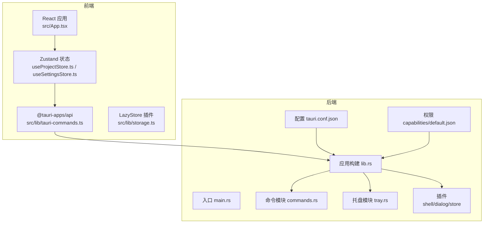
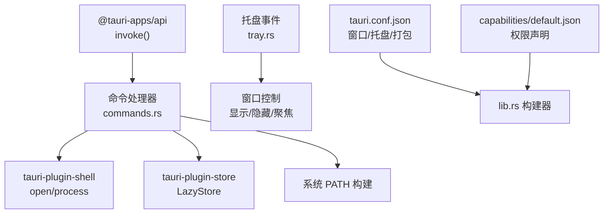
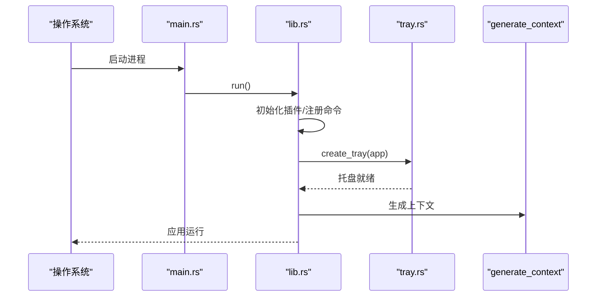
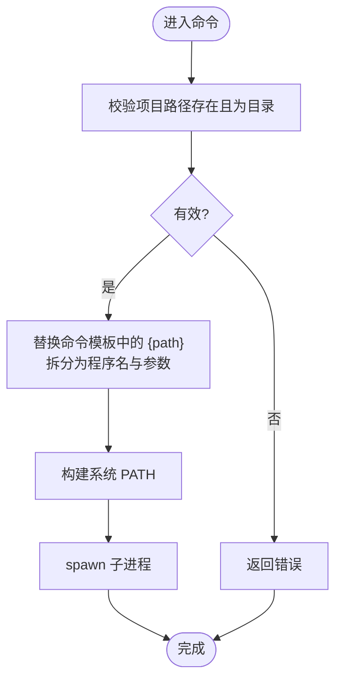
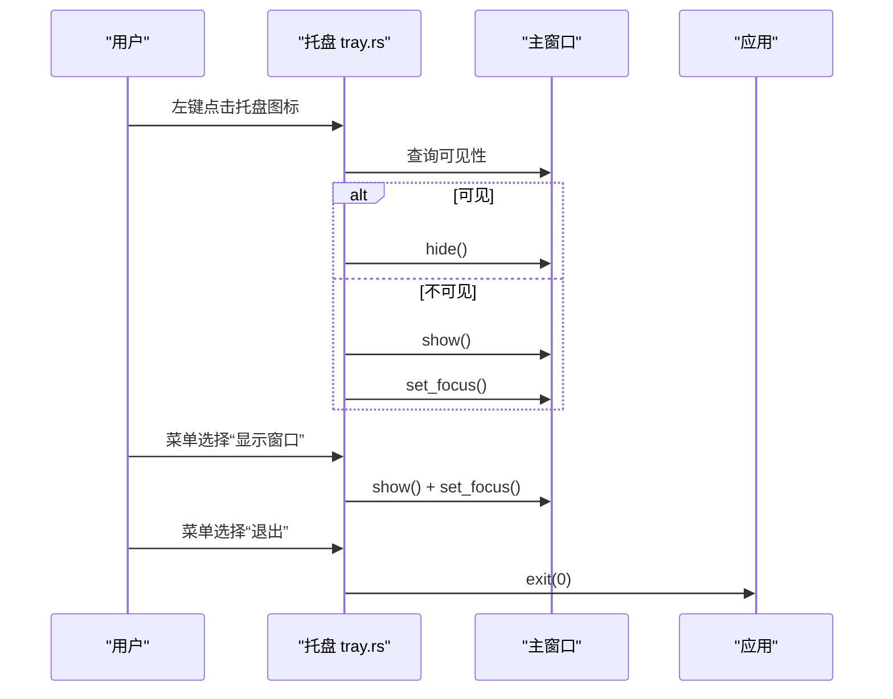
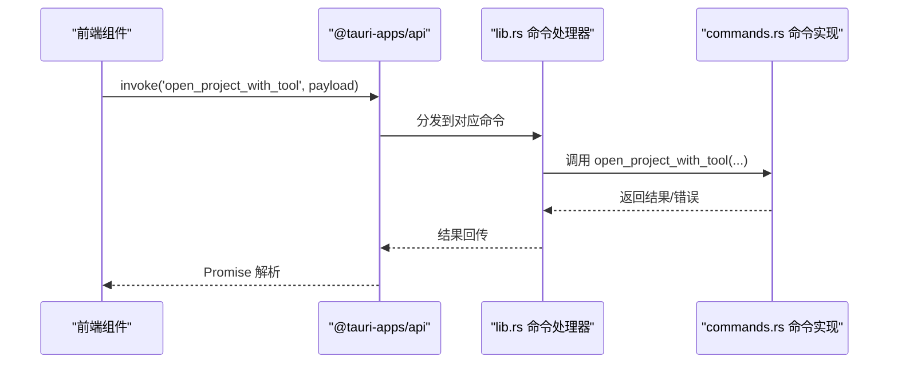
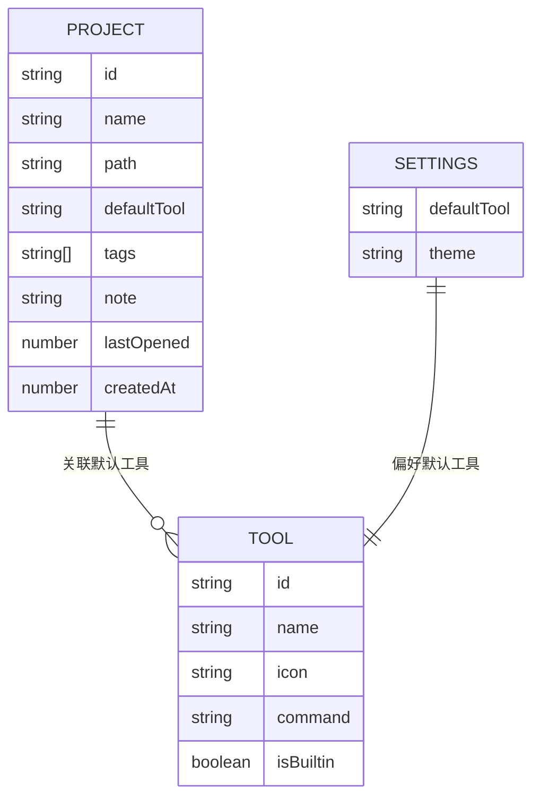
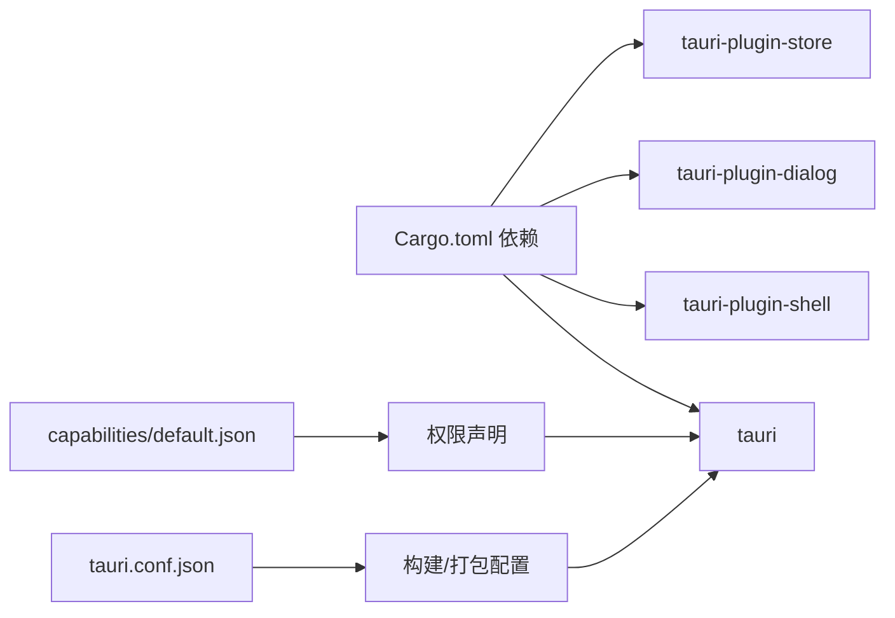

# 后端架构

<cite>
**本文引用的文件**
- [src-tauri/src/main.rs](file://src-tauri/src/main.rs)
- [src-tauri/src/lib.rs](file://src-tauri/src/lib.rs)
- [src-tauri/src/commands.rs](file://src-tauri/src/commands.rs)
- [src-tauri/src/tray.rs](file://src-tauri/src/tray.rs)
- [src-tauri/Cargo.toml](file://src-tauri/Cargo.toml)
- [src-tauri/tauri.conf.json](file://src-tauri/tauri.conf.json)
- [src-tauri/capabilities/default.json](file://src-tauri/capabilities/default.json)
- [src-tauri/build.rs](file://src-tauri/build.rs)
- [src/lib/tauri-commands.ts](file://src/lib/tauri-commands.ts)
- [src/lib/storage.ts](file://src/lib/storage.ts)
- [src/lib/constants.ts](file://src/lib/constants.ts)
- [src/stores/useProjectStore.ts](file://src/stores/useProjectStore.ts)
- [src/stores/useSettingsStore.ts](file://src/stores/useSettingsStore.ts)
- [src/App.tsx](file://src/App.tsx)
- [src/types/index.ts](file://src/types/index.ts)
</cite>

## 目录
1. [引言](#引言)
2. [项目结构](#项目结构)
3. [核心组件](#核心组件)
4. [架构总览](#架构总览)
5. [详细组件分析](#详细组件分析)
6. [依赖关系分析](#依赖关系分析)
7. [性能考量](#性能考量)
8. [故障排查指南](#故障排查指南)
9. [结论](#结论)
10. [附录](#附录)

## 引言
本文件面向 LaunchPro 后端架构，聚焦基于 Rust 的 Tauri 2 应用实现，涵盖桌面托盘、命令桥接、进程启动与安全、文件系统与本地存储、生命周期与资源清理等主题。文档以“可读性优先”的方式组织内容，既适合非专业读者快速理解，也提供深入的技术细节与图示。

## 项目结构
后端以 Tauri 2 为核心，Rust 负责应用构建、系统能力与原生交互；前端使用 React + TypeScript 管理 UI 与状态，并通过 @tauri-apps/api 与后端进行命令调用与事件通信。关键目录与职责如下：
- src-tauri：Rust 后端，包含入口、命令、托盘、插件与配置
- src：前端应用，包含组件、状态管理、工具函数与类型定义
- 配置文件：Cargo.toml、tauri.conf.json、capabilities/default.json 等

图表来源
- [src-tauri/src/main.rs:1-7](file://src-tauri/src/main.rs#L1-L7)
- [src-tauri/src/lib.rs:1-28](file://src-tauri/src/lib.rs#L1-L28)
- [src-tauri/src/commands.rs:1-95](file://src-tauri/src/commands.rs#L1-L95)
- [src-tauri/src/tray.rs:1-58](file://src-tauri/src/tray.rs#L1-L58)
- [src-tauri/tauri.conf.json:1-44](file://src-tauri/tauri.conf.json#L1-L44)
- [src-tauri/capabilities/default.json:1-18](file://src-tauri/capabilities/default.json#L1-L18)
- [src/lib/tauri-commands.ts:1-17](file://src/lib/tauri-commands.ts#L1-L17)
- [src/lib/storage.ts:1-30](file://src/lib/storage.ts#L1-L30)

章节来源
- [src-tauri/src/main.rs:1-7](file://src-tauri/src/main.rs#L1-L7)
- [src-tauri/src/lib.rs:1-28](file://src-tauri/src/lib.rs#L1-L28)
- [src-tauri/tauri.conf.json:1-44](file://src-tauri/tauri.conf.json#L1-L44)

## 核心组件
- 应用入口与构建器：Rust 入口调用 lib.run 构建应用、注册命令、插件与托盘，并设置窗口关闭行为（隐藏而非退出）。
- 命令模块：提供路径检查、应用数据目录查询、以及以工具命令模板打开项目的进程启动能力。
- 托盘模块：创建系统托盘图标、上下文菜单、点击事件处理（显示/隐藏主窗口、退出应用）。
- 前端命令桥接：通过 @tauri-apps/api 的 invoke 调用后端命令，返回 Promise。
- 本地存储：基于 tauri-plugin-store 的 LazyStore 实现项目、工具、设置的持久化。
- 权限与配置：tauri.conf.json 定义窗口、托盘图标、打包信息；capabilities/default.json 声明所需权限。

章节来源
- [src-tauri/src/lib.rs:1-28](file://src-tauri/src/lib.rs#L1-L28)
- [src-tauri/src/commands.rs:1-95](file://src-tauri/src/commands.rs#L1-L95)
- [src-tauri/src/tray.rs:1-58](file://src-tauri/src/tray.rs#L1-L58)
- [src/lib/tauri-commands.ts:1-17](file://src/lib/tauri-commands.ts#L1-L17)
- [src/lib/storage.ts:1-30](file://src/lib/storage.ts#L1-L30)
- [src-tauri/capabilities/default.json:1-18](file://src-tauri/capabilities/default.json#L1-L18)

## 架构总览
下图展示前后端交互与系统能力的总体关系：前端通过命令通道调用后端命令，后端利用插件访问系统能力（Shell、Dialog、Store），托盘作为系统级入口提供窗口控制。

图表来源
- [src-tauri/src/lib.rs:1-28](file://src-tauri/src/lib.rs#L1-L28)
- [src-tauri/src/commands.rs:1-95](file://src-tauri/src/commands.rs#L1-L95)
- [src-tauri/src/tray.rs:1-58](file://src-tauri/src/tray.rs#L1-L58)
- [src-tauri/tauri.conf.json:1-44](file://src-tauri/tauri.conf.json#L1-L44)
- [src-tauri/capabilities/default.json:1-18](file://src-tauri/capabilities/default.json#L1-L18)

## 详细组件分析

### Rust 入口与应用构建
- 入口文件负责在发布版本隐藏额外控制台窗口，并调用 lib.run 启动应用。
- lib.run 中：
  - 初始化 shell、dialog、store 插件
  - 注册命令处理器（open_project_with_tool、check_path_exists、get_app_data_dir）
  - setup 阶段创建托盘
  - on_window_event 将关闭请求转换为隐藏窗口
  - 使用 generate_context!() 运行应用

图表来源
- [src-tauri/src/main.rs:1-7](file://src-tauri/src/main.rs#L1-L7)
- [src-tauri/src/lib.rs:1-28](file://src-tauri/src/lib.rs#L1-L28)
- [src-tauri/src/tray.rs:1-58](file://src-tauri/src/tray.rs#L1-L58)

章节来源
- [src-tauri/src/main.rs:1-7](file://src-tauri/src/main.rs#L1-L7)
- [src-tauri/src/lib.rs:1-28](file://src-tauri/src/lib.rs#L1-L28)

### 命令处理与进程启动
- open_project_with_tool：校验项目路径存在且为目录，替换命令模板中的占位符，解析程序名与参数，构造系统 PATH 并以子进程方式启动。
- check_path_exists：判断路径是否存在且为目录。
- get_app_data_dir：通过 AppHandle 获取应用数据目录路径。

图表来源
- [src-tauri/src/commands.rs:48-79](file://src-tauri/src/commands.rs#L48-L79)

章节来源
- [src-tauri/src/commands.rs:1-95](file://src-tauri/src/commands.rs#L1-L95)

### 托盘功能与事件处理
- 创建托盘图标与菜单项（显示窗口、退出）
- 左键点击托盘图标切换主窗口显示/隐藏与焦点
- 菜单项“显示窗口”时对主窗口执行 show 与 set_focus
- 菜单项“退出”时调用 app.exit(0)

图表来源
- [src-tauri/src/tray.rs:8-57](file://src-tauri/src/tray.rs#L8-L57)

章节来源
- [src-tauri/src/tray.rs:1-58](file://src-tauri/src/tray.rs#L1-L58)

### 前端命令桥接与事件传递
- 前端通过 @tauri-apps/api 的 invoke 调用后端命令，返回 Promise
- 提供三个方法：openProjectWithTool、checkPathExists、getAppDataDir
- 前端应用在启动时加载工具、项目与设置，确保状态一致性

图表来源
- [src/lib/tauri-commands.ts:1-17](file://src/lib/tauri-commands.ts#L1-L17)
- [src-tauri/src/lib.rs:10-14](file://src-tauri/src/lib.rs#L10-L14)
- [src-tauri/src/commands.rs:48-79](file://src-tauri/src/commands.rs#L48-L79)

章节来源
- [src/lib/tauri-commands.ts:1-17](file://src/lib/tauri-commands.ts#L1-L17)
- [src/App.tsx:1-40](file://src/App.tsx#L1-L40)

### 文件系统与本地存储
- LazyStore：封装 projects.json、tools.json、settings.json 的读写，默认值来自 constants.ts，自动保存
- Zustand 状态：useProjectStore 与 useSettingsStore 在内存中维护状态并在变更时同步到 LazyStore
- 类型系统：types/index.ts 定义 Project、Tool、Settings 等接口，保证数据结构一致

图表来源
- [src/types/index.ts:1-26](file://src/types/index.ts#L1-L26)
- [src/lib/constants.ts:1-23](file://src/lib/constants.ts#L1-L23)
- [src/lib/storage.ts:1-30](file://src/lib/storage.ts#L1-L30)
- [src/stores/useProjectStore.ts:1-67](file://src/stores/useProjectStore.ts#L1-L67)
- [src/stores/useSettingsStore.ts:1-34](file://src/stores/useSettingsStore.ts#L1-L34)

章节来源
- [src/lib/storage.ts:1-30](file://src/lib/storage.ts#L1-L30)
- [src/stores/useProjectStore.ts:1-67](file://src/stores/useProjectStore.ts#L1-L67)
- [src/stores/useSettingsStore.ts:1-34](file://src/stores/useSettingsStore.ts#L1-L34)
- [src/lib/constants.ts:1-23](file://src/lib/constants.ts#L1-L23)
- [src/types/index.ts:1-26](file://src/types/index.ts#L1-L26)

### 生命周期管理与资源清理
- 窗口关闭行为：拦截 CloseRequested 事件，阻止默认关闭，改为隐藏窗口，避免资源释放导致的用户体验问题
- 应用退出：托盘菜单“退出”触发 app.exit(0)，确保插件与窗口资源有序释放
- 插件初始化：在 lib.run 中统一初始化 shell、dialog、store 插件，确保生命周期内可用

章节来源
- [src-tauri/src/lib.rs:19-24](file://src-tauri/src/lib.rs#L19-L24)
- [src-tauri/src/tray.rs:31-33](file://src-tauri/src/tray.rs#L31-L33)
- [src-tauri/src/lib.rs:7-9](file://src-tauri/src/lib.rs#L7-L9)

## 依赖关系分析
- Cargo.toml 声明了 tauri、tauri-plugin-shell、tauri-plugin-dialog、tauri-plugin-store 等依赖
- tauri.conf.json 定义构建流程（dev/build）、窗口属性、托盘图标与打包目标
- capabilities/default.json 声明窗口控制、shell 打开、对话框与 store 权限
- build.rs 用于 tauri-build 的编译期生成

图表来源
- [src-tauri/Cargo.toml:1-22](file://src-tauri/Cargo.toml#L1-L22)
- [src-tauri/tauri.conf.json:1-44](file://src-tauri/tauri.conf.json#L1-L44)
- [src-tauri/capabilities/default.json:1-18](file://src-tauri/capabilities/default.json#L1-L18)
- [src-tauri/build.rs:1-4](file://src-tauri/build.rs#L1-L4)

章节来源
- [src-tauri/Cargo.toml:1-22](file://src-tauri/Cargo.toml#L1-L22)
- [src-tauri/tauri.conf.json:1-44](file://src-tauri/tauri.conf.json#L1-L44)
- [src-tauri/capabilities/default.json:1-18](file://src-tauri/capabilities/default.json#L1-L18)
- [src-tauri/build.rs:1-4](file://src-tauri/build.rs#L1-L4)

## 性能考量
- 命令调用采用异步 Promise 模式，避免阻塞 UI 线程
- LazyStore 自动保存减少频繁 I/O，但需注意磁盘写入频率与数据一致性
- 进程启动使用 spawn，避免阻塞主线程；建议在前端对长耗时操作提供进度反馈
- PATH 构建仅在命令执行前计算一次，降低重复开销

## 故障排查指南
- 命令调用失败
  - 检查命令是否在 capabilities/default.json 中被授权
  - 确认 tauri.conf.json 的 build 前置命令与 devUrl 正确
  - 查看 @tauri-apps/api 的 invoke 返回错误信息
- 托盘不显示或无响应
  - 确认 icons/icon.png 存在且可读
  - 检查 on_menu_event 与 on_tray_icon_event 的事件绑定
- 进程无法启动
  - 校验项目路径存在且为目录
  - 检查命令模板是否包含 {path} 占位符
  - 确认系统 PATH 是否包含目标可执行文件所在目录
- 数据未持久化
  - 检查 LazyStore 的文件路径与默认值
  - 确认 autoSave 开启且 store.set 已调用

章节来源
- [src-tauri/capabilities/default.json:1-18](file://src-tauri/capabilities/default.json#L1-L18)
- [src-tauri/tauri.conf.json:5-10](file://src-tauri/tauri.conf.json#L5-L10)
- [src/lib/tauri-commands.ts:1-17](file://src/lib/tauri-commands.ts#L1-L17)
- [src-tauri/src/tray.rs:17-54](file://src-tauri/src/tray.rs#L17-L54)
- [src-tauri/src/commands.rs:48-79](file://src-tauri/src/commands.rs#L48-L79)
- [src/lib/storage.ts:1-30](file://src/lib/storage.ts#L1-L30)

## 结论
LaunchPro 后端以 Tauri 2 为基础，结合 Rust 的强类型与安全模型，实现了稳定的桌面应用体验。通过命令桥接与插件体系，系统在保持轻量的同时提供了进程启动、托盘控制与本地存储等关键能力。建议后续关注日志记录与更细粒度的错误恢复策略，以进一步提升可观测性与稳定性。

## 附录
- 关键命令与用途
  - open_project_with_tool：根据工具命令模板与项目路径启动外部程序
  - check_path_exists：校验路径有效性
  - get_app_data_dir：获取应用数据目录
- 前端常用方法
  - openProjectWithTool、checkPathExists、getAppDataDir
- 数据模型
  - Project、Tool、Settings 接口定义于 types/index.ts
  - 默认工具集与默认设置来源于 constants.ts