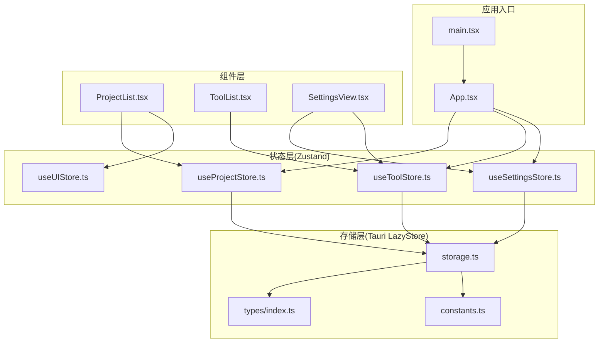
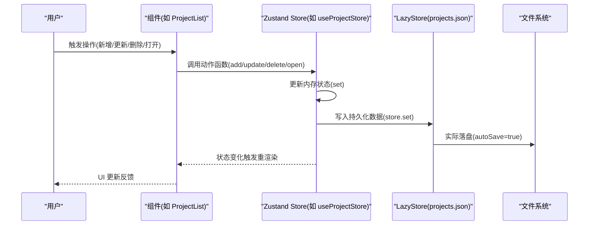
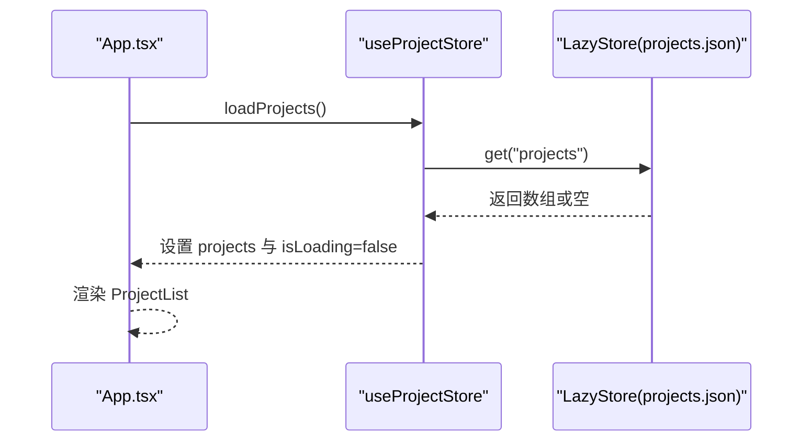
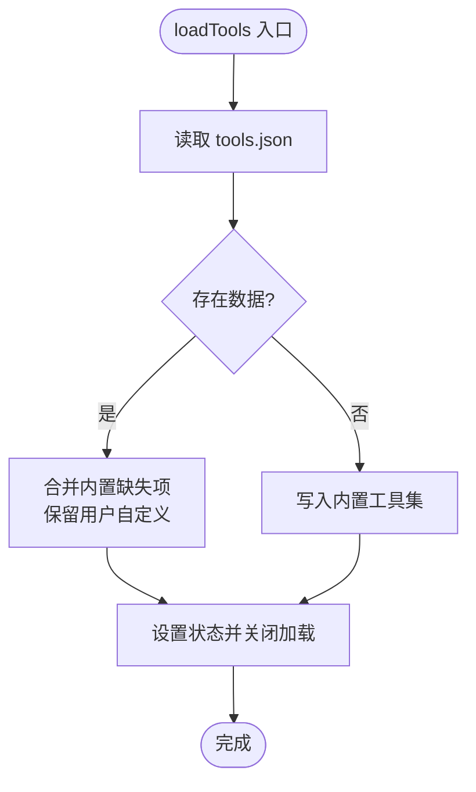
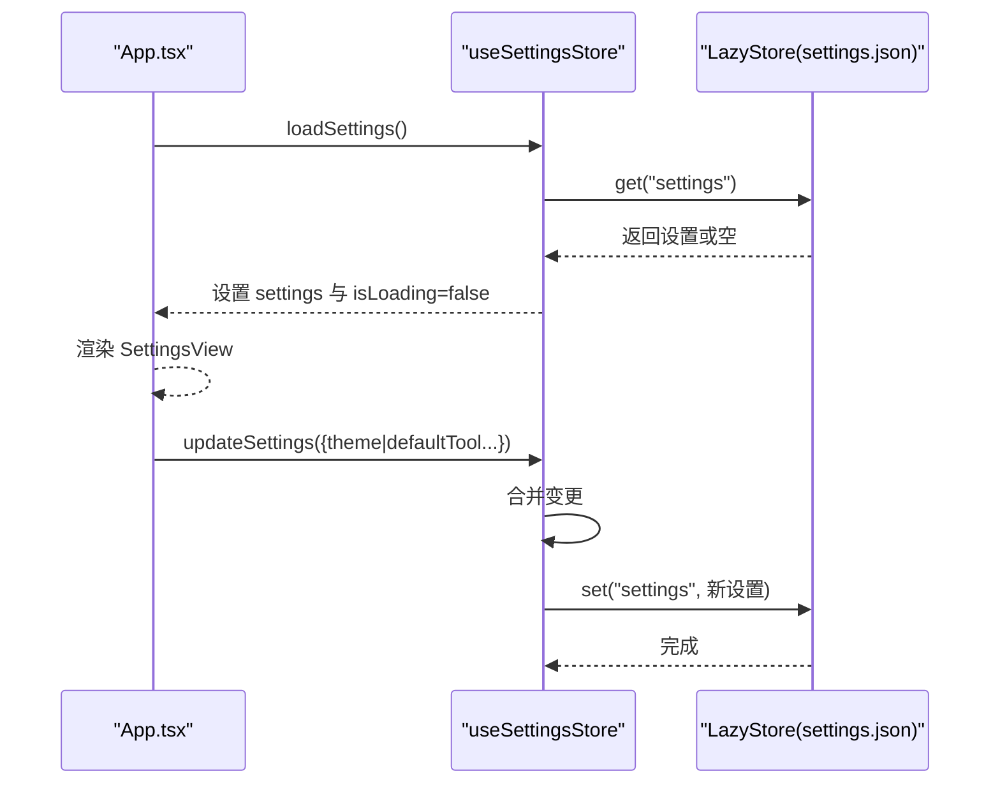
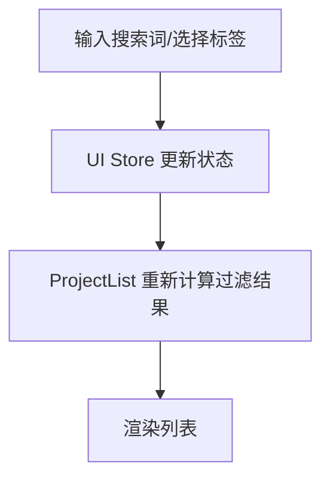
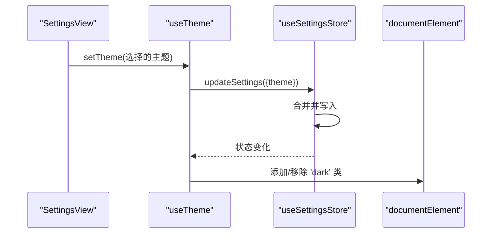
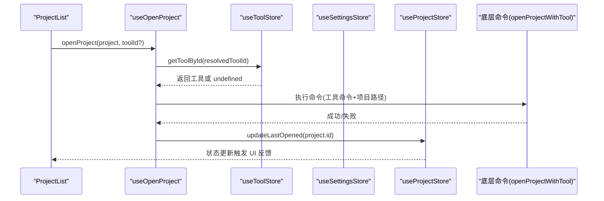
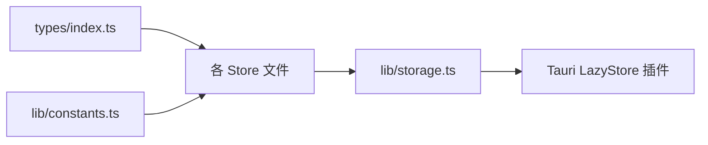
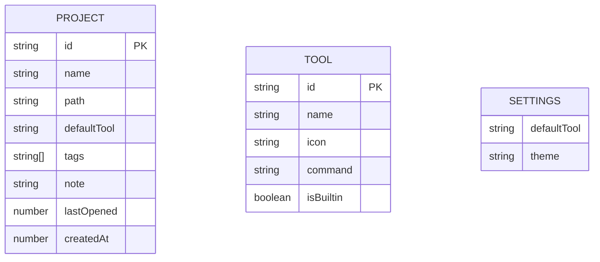

# 数据流设计

<cite>
**本文引用的文件**
- [src/stores/useProjectStore.ts](file://src/stores/useProjectStore.ts)
- [src/stores/useToolStore.ts](file://src/stores/useToolStore.ts)
- [src/stores/useSettingsStore.ts](file://src/stores/useSettingsStore.ts)
- [src/stores/useUIStore.ts](file://src/stores/useUIStore.ts)
- [src/lib/storage.ts](file://src/lib/storage.ts)
- [src/types/index.ts](file://src/types/index.ts)
- [src/lib/constants.ts](file://src/lib/constants.ts)
- [src/App.tsx](file://src/App.tsx)
- [src/main.tsx](file://src/main.tsx)
- [src/components/project/ProjectList.tsx](file://src/components/project/ProjectList.tsx)
- [src/components/tool/ToolList.tsx](file://src/components/tool/ToolList.tsx)
- [src/components/settings/SettingsView.tsx](file://src/components/settings/SettingsView.tsx)
- [src/hooks/useTheme.ts](file://src/hooks/useTheme.ts)
- [src/hooks/useOpenProject.ts](file://src/hooks/useOpenProject.ts)
</cite>

## 目录
1. [引言](#引言)
2. [项目结构](#项目结构)
3. [核心组件](#核心组件)
4. [架构总览](#架构总览)
5. [详细组件分析](#详细组件分析)
6. [依赖关系分析](#依赖关系分析)
7. [性能考虑](#性能考虑)
8. [故障排查指南](#故障排查指南)
9. [结论](#结论)
10. [附录](#附录)

## 引言
本文件系统性阐述 LaunchPro 的数据流设计，覆盖从用户操作到数据持久化的完整路径，包括状态更新、数据同步与持久化触发机制；详解 Zustand Store 的设计模式（状态定义、动作函数、订阅机制）；文档化项目数据、工具数据与设置数据的存储策略与访问模式；说明数据加载、更新与删除的生命周期管理；解释数据验证、错误处理与一致性保障；并给出数据迁移、版本兼容与备份恢复策略建议，以及数据流监控、调试与性能优化的最佳实践。

## 项目结构
应用采用前端 React + Zustand 状态管理 + Tauri 插件存储的分层架构：
- 应用入口负责初始化与全局副作用（主题、通知等）
- 组件层通过 Zustand 订阅状态并触发动作
- Store 层封装业务动作与持久化逻辑
- 存储层基于 Tauri 插件 LazyStore 提供键值持久化

图表来源
- [src/main.tsx:1-11](file://src/main.tsx#L1-L11)
- [src/App.tsx:1-40](file://src/App.tsx#L1-L40)
- [src/stores/useProjectStore.ts:1-67](file://src/stores/useProjectStore.ts#L1-L67)
- [src/stores/useToolStore.ts:1-75](file://src/stores/useToolStore.ts#L1-L75)
- [src/stores/useSettingsStore.ts:1-34](file://src/stores/useSettingsStore.ts#L1-L34)
- [src/stores/useUIStore.ts:1-33](file://src/stores/useUIStore.ts#L1-L33)
- [src/lib/storage.ts:1-30](file://src/lib/storage.ts#L1-L30)
- [src/types/index.ts:1-26](file://src/types/index.ts#L1-L26)
- [src/lib/constants.ts:1-23](file://src/lib/constants.ts#L1-L23)

章节来源
- [src/main.tsx:1-11](file://src/main.tsx#L1-L11)
- [src/App.tsx:1-40](file://src/App.tsx#L1-L40)

## 核心组件
- 项目数据（Project）
  - 状态：项目列表、加载中标志
  - 动作：加载、新增、更新、删除、更新最近打开时间
  - 持久化：每次变更后写入 projects.json
- 工具数据（Tool）
  - 状态：工具列表、加载中标志
  - 动作：加载、新增、更新、删除、按 ID 查询
  - 初始化策略：首次启动写入内置工具；后续合并内置与用户自定义
  - 删除限制：内置工具不可删除
- 设置数据（Settings）
  - 状态：当前设置、加载中标志
  - 动作：加载、更新
  - 默认值：来自常量 DEFAULT_SETTINGS
- UI 数据（UI）
  - 状态：活动视图、搜索关键词、选中标签集合
  - 动作：切换视图、设置搜索词、切换标签过滤、清空过滤器

章节来源
- [src/stores/useProjectStore.ts:1-67](file://src/stores/useProjectStore.ts#L1-L67)
- [src/stores/useToolStore.ts:1-75](file://src/stores/useToolStore.ts#L1-L75)
- [src/stores/useSettingsStore.ts:1-34](file://src/stores/useSettingsStore.ts#L1-L34)
- [src/stores/useUIStore.ts:1-33](file://src/stores/useUIStore.ts#L1-L33)
- [src/types/index.ts:1-26](file://src/types/index.ts#L1-L26)
- [src/lib/constants.ts:1-23](file://src/lib/constants.ts#L1-L23)

## 架构总览
下图展示从用户交互到持久化的端到端数据流：

图表来源
- [src/stores/useProjectStore.ts:30-65](file://src/stores/useProjectStore.ts#L30-L65)
- [src/stores/useToolStore.ts:41-69](file://src/stores/useToolStore.ts#L41-L69)
- [src/stores/useSettingsStore.ts:27-32](file://src/stores/useSettingsStore.ts#L27-L32)
- [src/lib/storage.ts:4-17](file://src/lib/storage.ts#L4-L17)

## 详细组件分析

### 项目数据流（Project）
- 加载流程
  - 应用启动时在根组件中并发调用各 Store 的 load 方法
  - Store 读取 projects.json 并回填状态
- 新增/更新/删除
  - 每次变更先在内存中生成新数组并 set，再异步写入 LazyStore
  - 写入成功即持久化完成（autoSave=true）
- 最近打开时间
  - 打开项目后更新 lastOpened 字段并持久化

图表来源
- [src/App.tsx:26-30](file://src/App.tsx#L26-L30)
- [src/stores/useProjectStore.ts:20-28](file://src/stores/useProjectStore.ts#L20-L28)
- [src/lib/storage.ts:19-21](file://src/lib/storage.ts#L19-L21)

章节来源
- [src/stores/useProjectStore.ts:1-67](file://src/stores/useProjectStore.ts#L1-L67)
- [src/App.tsx:1-40](file://src/App.tsx#L1-L40)

### 工具数据流（Tool）
- 首次启动初始化
  - 若 tools.json 为空或缺失，写入内置工具集 BUILTIN_TOOLS
- 后续加载合并
  - 读取用户自定义工具，若缺少内置项则补齐，确保内置能力不丢失
- 新增/更新/删除
  - 新增：生成唯一 ID，标记非内置，写入
  - 更新：映射替换对应项，写入
  - 删除：禁止删除内置工具，仅允许删除用户自定义工具
- 查询
  - 提供按 ID 快速查询工具的能力

图表来源
- [src/stores/useToolStore.ts:21-39](file://src/stores/useToolStore.ts#L21-L39)
- [src/lib/constants.ts:3-18](file://src/lib/constants.ts#L3-L18)

章节来源
- [src/stores/useToolStore.ts:1-75](file://src/stores/useToolStore.ts#L1-L75)
- [src/lib/constants.ts:1-23](file://src/lib/constants.ts#L1-L23)

### 设置数据流（Settings）
- 默认值
  - 使用 DEFAULT_SETTINGS 作为初始值
- 加载与更新
  - 加载：读取 settings.json 或回退默认值
  - 更新：深合并传入的变更，立即写入并持久化

图表来源
- [src/App.tsx:26-30](file://src/App.tsx#L26-L30)
- [src/stores/useSettingsStore.ts:17-32](file://src/stores/useSettingsStore.ts#L17-L32)
- [src/lib/storage.ts:27-29](file://src/lib/storage.ts#L27-L29)
- [src/lib/constants.ts:20-22](file://src/lib/constants.ts#L20-L22)

章节来源
- [src/stores/useSettingsStore.ts:1-34](file://src/stores/useSettingsStore.ts#L1-L34)
- [src/lib/constants.ts:1-23](file://src/lib/constants.ts#L1-L23)

### UI 状态（UI）
- 负责筛选条件与视图切换
- 与项目列表组件配合实现本地过滤与排序
- 不涉及持久化，仅影响 UI 行为

图表来源
- [src/stores/useUIStore.ts:14-32](file://src/stores/useUIStore.ts#L14-L32)
- [src/components/project/ProjectList.tsx:29-55](file://src/components/project/ProjectList.tsx#L29-L55)

章节来源
- [src/stores/useUIStore.ts:1-33](file://src/stores/useUIStore.ts#L1-L33)
- [src/components/project/ProjectList.tsx:1-168](file://src/components/project/ProjectList.tsx#L1-L168)

### 主题与设置联动（Theme）
- 通过 Hook 订阅设置中的 theme 字段
- 根据 light/dark/system 切换 DOM 根节点类名
- 支持系统配色监听与动态切换

图表来源
- [src/components/settings/SettingsView.tsx:20-33](file://src/components/settings/SettingsView.tsx#L20-L33)
- [src/hooks/useTheme.ts:31-36](file://src/hooks/useTheme.ts#L31-L36)
- [src/stores/useSettingsStore.ts:27-32](file://src/stores/useSettingsStore.ts#L27-L32)

章节来源
- [src/hooks/useTheme.ts:1-37](file://src/hooks/useTheme.ts#L1-L37)
- [src/components/settings/SettingsView.tsx:1-111](file://src/components/settings/SettingsView.tsx#L1-L111)

### 项目打开流程（Open Project）
- 解析工具：优先使用显式传入的 toolId，其次项目默认，最后全局默认
- 校验工具是否存在，不存在则提示并回退
- 调用底层命令打开项目，并在成功后更新最近打开时间

图表来源
- [src/hooks/useOpenProject.ts:15-40](file://src/hooks/useOpenProject.ts#L15-L40)
- [src/stores/useToolStore.ts:71-73](file://src/stores/useToolStore.ts#L71-L73)
- [src/stores/useProjectStore.ts:58-65](file://src/stores/useProjectStore.ts#L58-L65)

章节来源
- [src/hooks/useOpenProject.ts:1-44](file://src/hooks/useOpenProject.ts#L1-L44)

## 依赖关系分析
- 组件对 Store 的订阅
  - 组件通过选择器订阅所需字段，减少不必要的重渲染
- Store 对存储的依赖
  - 每个 Store 通过工厂函数获取对应的 LazyStore 实例
  - LazyStore 自动保存，避免手动 save 调用
- 类型与常量
  - 类型定义统一约束数据结构
  - 常量提供默认值与内置工具集，保证初始化一致性

图表来源
- [src/types/index.ts:1-26](file://src/types/index.ts#L1-L26)
- [src/lib/constants.ts:1-23](file://src/lib/constants.ts#L1-L23)
- [src/stores/useProjectStore.ts:1-67](file://src/stores/useProjectStore.ts#L1-L67)
- [src/stores/useToolStore.ts:1-75](file://src/stores/useToolStore.ts#L1-L75)
- [src/stores/useSettingsStore.ts:1-34](file://src/stores/useSettingsStore.ts#L1-L34)
- [src/lib/storage.ts:1-30](file://src/lib/storage.ts#L1-L30)

章节来源
- [src/types/index.ts:1-26](file://src/types/index.ts#L1-L26)
- [src/lib/constants.ts:1-23](file://src/lib/constants.ts#L1-L23)
- [src/lib/storage.ts:1-30](file://src/lib/storage.ts#L1-L30)

## 性能考虑
- 订阅粒度
  - 使用选择器订阅最小必要字段，降低重渲染频率
- 过滤与排序
  - 在组件内使用 useMemo 缓存过滤与排序结果，避免重复计算
- 并发加载
  - 应用启动时并发加载多个 Store，缩短首屏等待
- 持久化策略
  - LazyStore autoSave=true，减少显式 save 调用带来的阻塞
- 大列表优化
  - 使用滚动区域组件，避免一次性渲染大量节点

章节来源
- [src/components/project/ProjectList.tsx:22-55](file://src/components/project/ProjectList.tsx#L22-L55)
- [src/App.tsx:26-30](file://src/App.tsx#L26-L30)
- [src/lib/storage.ts:6](file://src/lib/storage.ts#L6)

## 故障排查指南
- 加载失败
  - Store 的 load 方法均包含 try/catch，失败时会回退到安全状态（空数组或默认值），并保持 isLoading=false
- 持久化异常
  - LazyStore 写入失败不会阻断 UI 更新，但可能造成下次启动数据不同步；建议检查应用数据目录权限
- 内置工具缺失
  - loadTools 会在合并阶段补齐缺失的内置工具，若仍缺失，请检查 tools.json 是否被意外修改
- 删除受限
  - 删除内置工具会被忽略；请通过更新方式调整而非删除
- 打开项目失败
  - 若工具不存在或命令执行失败，会弹出错误提示；请检查工具命令与项目路径

章节来源
- [src/stores/useProjectStore.ts:20-28](file://src/stores/useProjectStore.ts#L20-L28)
- [src/stores/useToolStore.ts:21-39](file://src/stores/useToolStore.ts#L21-L39)
- [src/stores/useSettingsStore.ts:17-25](file://src/stores/useSettingsStore.ts#L17-L25)
- [src/stores/useToolStore.ts:62-69](file://src/stores/useToolStore.ts#L62-L69)
- [src/hooks/useOpenProject.ts:15-40](file://src/hooks/useOpenProject.ts#L15-L40)

## 结论
本项目采用轻量、直观的 Zustand + LazyStore 方案实现前端数据流：组件通过选择器订阅状态，Store 将业务动作与持久化绑定，LazyStore 提供自动保存与默认值支持。该设计在保证一致性的同时，具备良好的可维护性与扩展性。对于复杂场景，可在现有模式上引入中间件或集中式日志记录以增强可观测性。

## 附录

### 数据模型与存储策略

图表来源
- [src/types/index.ts:1-26](file://src/types/index.ts#L1-L26)

### 生命周期管理
- 加载：应用启动时并发加载三类数据
- 更新：组件触发动作 → Store 同步内存状态 → LazyStore 自动持久化
- 删除：仅允许删除用户自定义工具；项目与设置删除同理遵循“先内存后持久化”
- 打开：解析工具 → 执行命令 → 更新最近打开时间

章节来源
- [src/App.tsx:26-30](file://src/App.tsx#L26-L30)
- [src/stores/useProjectStore.ts:30-65](file://src/stores/useProjectStore.ts#L30-L65)
- [src/stores/useToolStore.ts:41-69](file://src/stores/useToolStore.ts#L41-L69)
- [src/stores/useSettingsStore.ts:17-32](file://src/stores/useSettingsStore.ts#L17-L32)
- [src/hooks/useOpenProject.ts:15-40](file://src/hooks/useOpenProject.ts#L15-L40)

### 数据验证、错误处理与一致性
- 验证
  - 新增/更新时由类型系统约束字段完整性
  - 工具删除前校验 isBuiltin，防止破坏内置能力
- 错误处理
  - Store 加载失败回退到安全状态
  - 打开项目失败通过 toast 提示
- 一致性
  - 每次状态变更均持久化，保证重启后状态一致
  - 工具加载时的合并策略确保内置能力始终可用

章节来源
- [src/stores/useToolStore.ts:62-69](file://src/stores/useToolStore.ts#L62-L69)
- [src/stores/useProjectStore.ts:20-28](file://src/stores/useProjectStore.ts#L20-L28)
- [src/stores/useSettingsStore.ts:17-25](file://src/stores/useSettingsStore.ts#L17-L25)
- [src/hooks/useOpenProject.ts:15-40](file://src/hooks/useOpenProject.ts#L15-L40)

### 数据迁移、版本兼容与备份恢复
- 迁移与兼容
  - 通过 Store 的加载逻辑进行“就地修复”：如工具加载时补齐内置项
  - 设置加载时以默认值兜底，避免因字段缺失导致崩溃
- 版本控制
  - 通过常量 DEFAULT_SETTINGS 与 BUILTIN_TOOLS 统一管理默认行为
- 备份与恢复
  - 数据位于应用数据目录下的 JSON 文件；可通过系统文件管理器备份相应文件
  - 恢复时替换对应文件即可；注意应用需处于关闭状态以避免写入冲突

章节来源
- [src/stores/useToolStore.ts:21-39](file://src/stores/useToolStore.ts#L21-L39)
- [src/stores/useSettingsStore.ts:17-25](file://src/stores/useSettingsStore.ts#L17-L25)
- [src/lib/constants.ts:3-18](file://src/lib/constants.ts#L3-L18)
- [src/lib/constants.ts:20-22](file://src/lib/constants.ts#L20-L22)

### 监控、调试与性能优化最佳实践
- 监控
  - 在 Store 动作前后记录事件（如 addProject、updateProject），便于追踪数据变更
  - 使用浏览器开发者工具的 Redux DevTools（结合 Zustand 中间件）观察状态变化
- 调试
  - 为每个 Store 的动作添加日志输出，定位持久化失败或数据不一致问题
  - 在组件侧打印订阅字段变化，确认渲染触发点
- 性能
  - 使用选择器订阅与 useMemo 缓存，避免大列表全量重渲染
  - 合理拆分 Store，避免单一 Store 过大导致频繁重渲染
  - 对高频更新的 UI 状态（如搜索框）单独抽离至 UI Store，减少主业务 Store 的压力

章节来源
- [src/stores/useProjectStore.ts:30-65](file://src/stores/useProjectStore.ts#L30-L65)
- [src/stores/useToolStore.ts:41-69](file://src/stores/useToolStore.ts#L41-L69)
- [src/stores/useSettingsStore.ts:17-32](file://src/stores/useSettingsStore.ts#L17-L32)
- [src/stores/useUIStore.ts:14-32](file://src/stores/useUIStore.ts#L14-L32)
- [src/components/project/ProjectList.tsx:22-55](file://src/components/project/ProjectList.tsx#L22-L55)