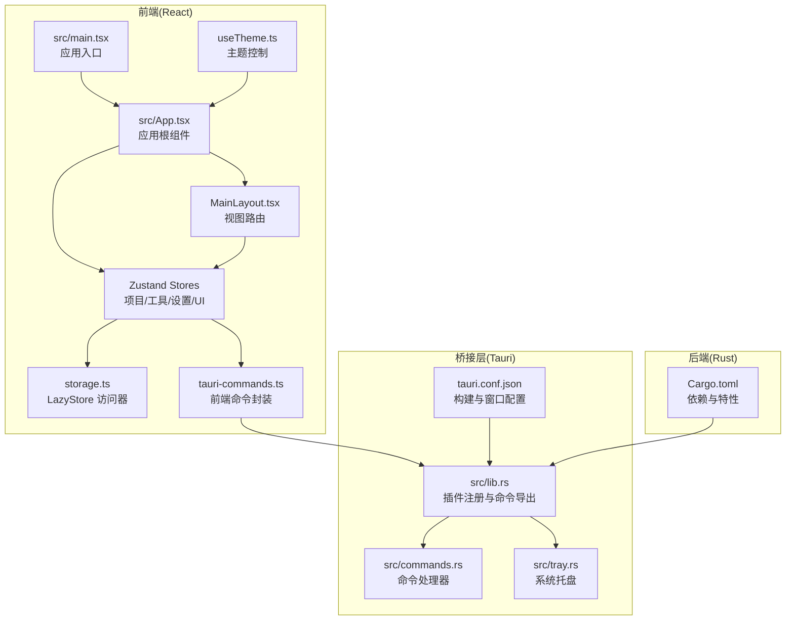
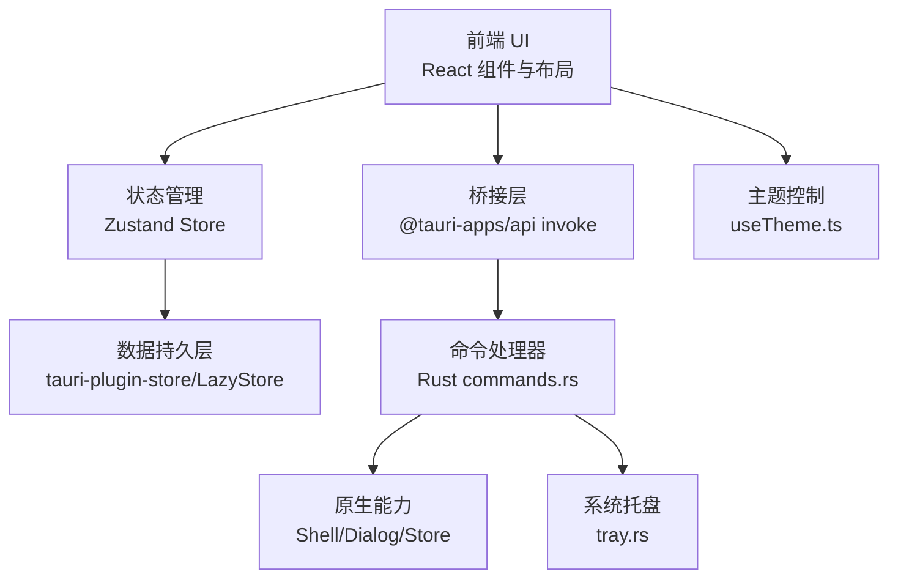
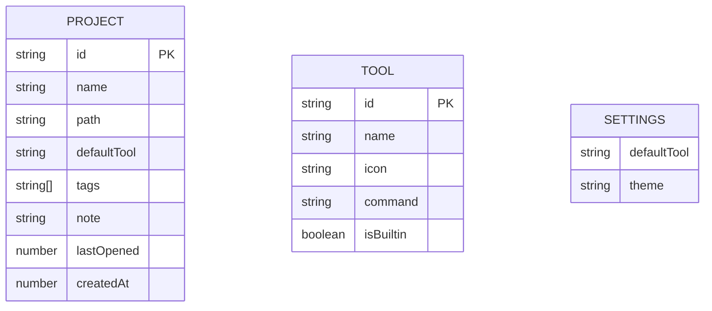
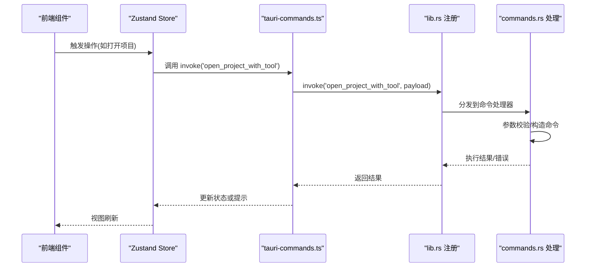
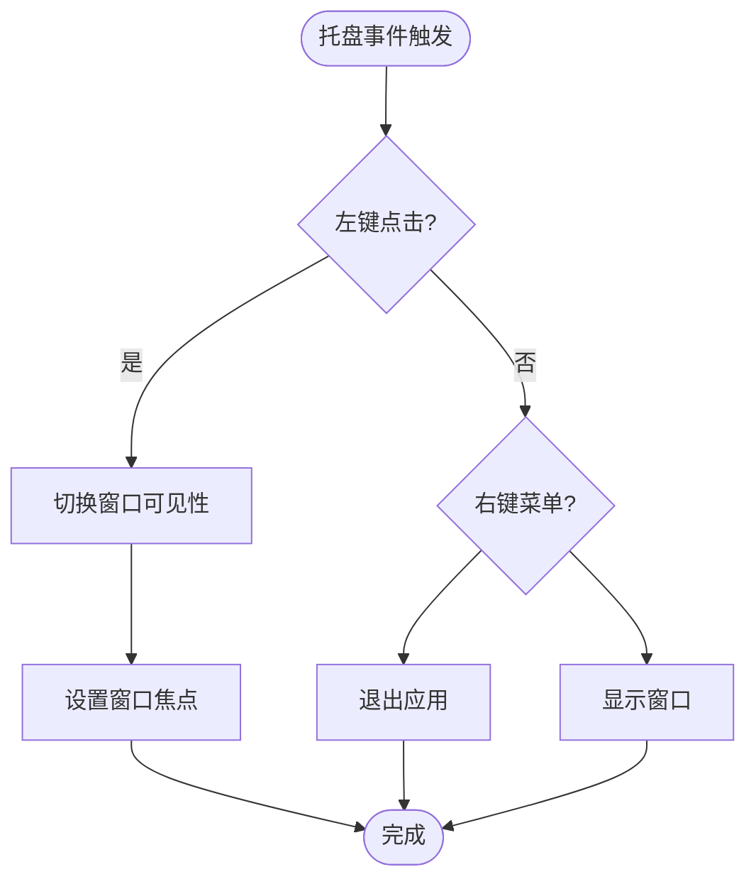
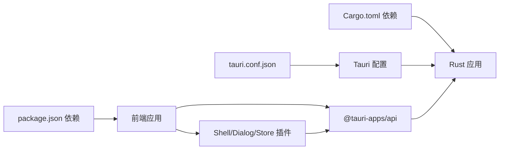

# 架构设计

<cite>
**本文引用的文件**
- [README.md](file://README.md)
- [package.json](file://package.json)
- [src/main.tsx](file://src/main.tsx)
- [src/App.tsx](file://src/App.tsx)
- [src/components/layout/MainLayout.tsx](file://src/components/layout/MainLayout.tsx)
- [src/hooks/useTheme.ts](file://src/hooks/useTheme.ts)
- [src/lib/constants.ts](file://src/lib/constants.ts)
- [src/lib/storage.ts](file://src/lib/storage.ts)
- [src/lib/tauri-commands.ts](file://src/lib/tauri-commands.ts)
- [src/stores/useProjectStore.ts](file://src/stores/useProjectStore.ts)
- [src/stores/useToolStore.ts](file://src/stores/useToolStore.ts)
- [src/stores/useSettingsStore.ts](file://src/stores/useSettingsStore.ts)
- [src/types/index.ts](file://src/types/index.ts)
- [src-tauri/Cargo.toml](file://src-tauri/Cargo.toml)
- [src-tauri/tauri.conf.json](file://src-tauri/tauri.conf.json)
- [src-tauri/src/lib.rs](file://src-tauri/src/lib.rs)
- [src-tauri/src/commands.rs](file://src-tauri/src/commands.rs)
- [src-tauri/src/tray.rs](file://src-tauri/src/tray.rs)
</cite>

## 目录
1. [引言](#引言)
2. [项目结构](#项目结构)
3. [核心组件](#核心组件)
4. [架构总览](#架构总览)
5. [详细组件分析](#详细组件分析)
6. [依赖关系分析](#依赖关系分析)
7. [性能考量](#性能考量)
8. [故障排查指南](#故障排查指南)
9. [结论](#结论)
10. [附录](#附录)

## 引言
本文件为 LaunchPro 的架构设计文档，聚焦于整体架构模式与分层职责，覆盖前端 React 应用、后端 Rust 服务与 Tauri 桥接层之间的协作方式。文档解释了 UI 层、状态管理层、数据持久层的职责分离，阐述前后端分离的设计决策与技术选型，并给出组件交互模式、数据流向与集成模式。同时说明 Tauri 框架的选择原因、原生桌面集成优势、跨平台兼容性、性能优化与安全注意事项。

## 项目结构
项目采用“前端 React 应用 + 后端 Rust 服务 + Tauri 桥接层”的三层架构：
- 前端：React 19 + TypeScript，使用 Vite 构建，Tailwind CSS 4 + Radix UI + shadcn/ui 组件体系，Zustand 状态管理，本地存储通过 tauri-plugin-store 实现。
- 后端：Rust 语言实现的 Tauri v2 应用，提供系统级能力（Shell、Dialog、Store 插件）与托盘功能。
- 桥接层：Tauri 将前端与后端连接，暴露命令接口供前端调用，实现跨平台原生能力。



**图表来源**
- [src/main.tsx:1-11](file://src/main.tsx#L1-L11)
- [src/App.tsx:1-40](file://src/App.tsx#L1-L40)
- [src/components/layout/MainLayout.tsx:1-21](file://src/components/layout/MainLayout.tsx#L1-L21)
- [src/hooks/useTheme.ts:1-37](file://src/hooks/useTheme.ts#L1-L37)
- [src/lib/storage.ts:1-30](file://src/lib/storage.ts#L1-L30)
- [src/lib/tauri-commands.ts:1-17](file://src/lib/tauri-commands.ts#L1-L17)
- [src/stores/useProjectStore.ts:1-67](file://src/stores/useProjectStore.ts#L1-L67)
- [src/stores/useToolStore.ts:1-75](file://src/stores/useToolStore.ts#L1-L75)
- [src/stores/useSettingsStore.ts:1-34](file://src/stores/useSettingsStore.ts#L1-L34)
- [src-tauri/tauri.conf.json:1-44](file://src-tauri/tauri.conf.json#L1-L44)
- [src-tauri/src/lib.rs:1-28](file://src-tauri/src/lib.rs#L1-L28)
- [src-tauri/src/commands.rs:1-95](file://src-tauri/src/commands.rs#L1-L95)
- [src-tauri/src/tray.rs:1-58](file://src-tauri/src/tray.rs#L1-L58)
- [src-tauri/Cargo.toml:1-22](file://src-tauri/Cargo.toml#L1-L22)

**章节来源**
- [README.md:101-135](file://README.md#L101-L135)
- [package.json:1-48](file://package.json#L1-L48)
- [src-tauri/tauri.conf.json:1-44](file://src-tauri/tauri.conf.json#L1-L44)
- [src-tauri/Cargo.toml:1-22](file://src-tauri/Cargo.toml#L1-L22)

## 核心组件
- 应用入口与根组件
  - 入口文件负责挂载 React 根节点，根组件负责初始化主题、加载初始数据并渲染主布局与全局通知组件。
- 状态管理层（Zustand）
  - 项目状态：加载、增删改查、最近打开时间更新。
  - 工具状态：加载内置工具与用户自定义工具，合并策略确保内置工具存在且保留用户定制。
  - 设置状态：默认主题等设置的读取与更新。
- 数据持久层（tauri-plugin-store + LazyStore）
  - 使用 LazyStore 对项目、工具、设置分别进行本地持久化，自动保存，提供默认值。
- 命令封装与桥接
  - 前端通过 @tauri-apps/api 的 invoke 调用后端命令，后端在 lib.rs 中注册命令处理函数。
- 系统托盘与窗口事件
  - 托盘菜单支持显示/隐藏窗口与退出；窗口关闭事件改为隐藏到托盘而非退出进程。

**章节来源**
- [src/main.tsx:1-11](file://src/main.tsx#L1-L11)
- [src/App.tsx:1-40](file://src/App.tsx#L1-L40)
- [src/stores/useProjectStore.ts:1-67](file://src/stores/useProjectStore.ts#L1-L67)
- [src/stores/useToolStore.ts:1-75](file://src/stores/useToolStore.ts#L1-L75)
- [src/stores/useSettingsStore.ts:1-34](file://src/stores/useSettingsStore.ts#L1-L34)
- [src/lib/storage.ts:1-30](file://src/lib/storage.ts#L1-L30)
- [src/lib/tauri-commands.ts:1-17](file://src/lib/tauri-commands.ts#L1-L17)
- [src-tauri/src/lib.rs:1-28](file://src-tauri/src/lib.rs#L1-L28)
- [src-tauri/src/tray.rs:1-58](file://src-tauri/src/tray.rs#L1-L58)

## 架构总览
该系统采用“前端 UI + 状态管理 + 本地存储”与“Rust 后端 + Tauri 插件 + 原生能力”的分层设计。前端负责展示与交互，状态管理负责数据一致性，本地存储负责数据持久化；后端负责系统级能力（Shell、Dialog、Store）与托盘，通过命令桥接与前端通信。



**图表来源**
- [src/App.tsx:1-40](file://src/App.tsx#L1-L40)
- [src/stores/useProjectStore.ts:1-67](file://src/stores/useProjectStore.ts#L1-L67)
- [src/stores/useToolStore.ts:1-75](file://src/stores/useToolStore.ts#L1-L75)
- [src/stores/useSettingsStore.ts:1-34](file://src/stores/useSettingsStore.ts#L1-L34)
- [src/lib/storage.ts:1-30](file://src/lib/storage.ts#L1-L30)
- [src/lib/tauri-commands.ts:1-17](file://src/lib/tauri-commands.ts#L1-L17)
- [src-tauri/src/commands.rs:1-95](file://src-tauri/src/commands.rs#L1-L95)
- [src-tauri/src/tray.rs:1-58](file://src-tauri/src/tray.rs#L1-L58)
- [src/hooks/useTheme.ts:1-37](file://src/hooks/useTheme.ts#L1-L37)

## 详细组件分析

### 前端应用与状态管理
- 应用入口与根组件
  - 入口文件负责创建根节点并渲染应用。
  - 根组件初始化主题钩子，加载项目、工具、设置三类初始数据。
- 状态管理（Zustand）
  - 项目状态：提供加载、新增、更新、删除、最近打开时间更新等方法，内部通过 LazyStore 写入持久化。
  - 工具状态：首次启动时写入内置工具集，后续合并内置与用户自定义工具，禁止删除内置工具。
  - 设置状态：提供默认设置与主题设置的读取与更新。
- 主题控制
  - 根据设置选择 light/dark/system，动态切换 html 根元素的 dark 类名，监听系统配色变化。

```mermaid
classDiagram
class ProjectStore {
+projects : Project[]
+isLoading : boolean
+loadProjects()
+addProject(data)
+updateProject(id, updates)
+deleteProject(id)
+updateLastOpened(id)
}
class ToolStore {
+tools : Tool[]
+isLoading : boolean
+loadTools()
+addTool(tool)
+updateTool(id, updates)
+deleteTool(id)
+getToolById(id)
}
class SettingsStore {
+settings : Settings
+isLoading : boolean
+loadSettings()
+updateSettings(updates)
}
class ThemeHook {
+theme : string
+setTheme(theme)
}
ProjectStore --> Storage["LazyStore"]
ToolStore --> Storage
SettingsStore --> Storage
ThemeHook --> SettingsStore
```

**图表来源**
- [src/stores/useProjectStore.ts:1-67](file://src/stores/useProjectStore.ts#L1-L67)
- [src/stores/useToolStore.ts:1-75](file://src/stores/useToolStore.ts#L1-L75)
- [src/stores/useSettingsStore.ts:1-34](file://src/stores/useSettingsStore.ts#L1-L34)
- [src/hooks/useTheme.ts:1-37](file://src/hooks/useTheme.ts#L1-L37)
- [src/lib/storage.ts:1-30](file://src/lib/storage.ts#L1-L30)

**章节来源**
- [src/main.tsx:1-11](file://src/main.tsx#L1-L11)
- [src/App.tsx:1-40](file://src/App.tsx#L1-L40)
- [src/stores/useProjectStore.ts:1-67](file://src/stores/useProjectStore.ts#L1-L67)
- [src/stores/useToolStore.ts:1-75](file://src/stores/useToolStore.ts#L1-L75)
- [src/stores/useSettingsStore.ts:1-34](file://src/stores/useSettingsStore.ts#L1-L34)
- [src/hooks/useTheme.ts:1-37](file://src/hooks/useTheme.ts#L1-L37)

### 数据持久层与类型模型
- 类型模型
  - 定义项目、工具、设置与活动视图的接口，保证状态与存储的数据结构一致。
- 存储访问器
  - 提供项目、工具、设置对应的 LazyStore 访问器，统一默认值与自动保存行为。
- 内置工具与默认设置
  - 内置工具集合与默认设置作为存储默认值，保障首次启动体验。



**图表来源**
- [src/types/index.ts:1-26](file://src/types/index.ts#L1-L26)
- [src/lib/constants.ts:1-23](file://src/lib/constants.ts#L1-L23)
- [src/lib/storage.ts:1-30](file://src/lib/storage.ts#L1-L30)

**章节来源**
- [src/types/index.ts:1-26](file://src/types/index.ts#L1-L26)
- [src/lib/constants.ts:1-23](file://src/lib/constants.ts#L1-L23)
- [src/lib/storage.ts:1-30](file://src/lib/storage.ts#L1-L30)

### 命令桥接与系统能力
- 命令封装
  - 前端通过 invoke 调用后端命令，如打开项目工具、检查路径存在性、获取应用数据目录。
- 命令处理器
  - 后端命令对输入参数进行校验，执行系统命令或返回系统路径信息；错误以字符串形式返回。
- 系统能力
  - Shell 插件用于执行外部命令；Dialog 插件用于对话框；Store 插件用于本地键值存储。



**图表来源**
- [src/lib/tauri-commands.ts:1-17](file://src/lib/tauri-commands.ts#L1-L17)
- [src-tauri/src/lib.rs:1-28](file://src-tauri/src/lib.rs#L1-L28)
- [src-tauri/src/commands.rs:1-95](file://src-tauri/src/commands.rs#L1-L95)

**章节来源**
- [src/lib/tauri-commands.ts:1-17](file://src/lib/tauri-commands.ts#L1-L17)
- [src-tauri/src/lib.rs:1-28](file://src-tauri/src/lib.rs#L1-L28)
- [src-tauri/src/commands.rs:1-95](file://src-tauri/src/commands.rs#L1-L95)

### 系统托盘与窗口生命周期
- 托盘菜单
  - 提供“显示窗口”和“退出”菜单项，左键点击托盘图标切换窗口可见性并聚焦。
- 窗口事件
  - 关闭请求事件改为隐藏窗口，避免直接退出导致状态丢失。



**图表来源**
- [src-tauri/src/tray.rs:1-58](file://src-tauri/src/tray.rs#L1-L58)
- [src-tauri/src/lib.rs:19-24](file://src-tauri/src/lib.rs#L19-L24)

**章节来源**
- [src-tauri/src/tray.rs:1-58](file://src-tauri/src/tray.rs#L1-L58)
- [src-tauri/src/lib.rs:19-24](file://src-tauri/src/lib.rs#L19-L24)

## 依赖关系分析
- 前端依赖
  - React 19、TypeScript、Vite、Tailwind CSS 4、Radix UI + shadcn/ui、Zustand、@tauri-apps/api 及相关插件。
- 后端依赖
  - Tauri v2、tauri-plugin-shell、tauri-plugin-dialog、tauri-plugin-store、Serde。
- 配置与构建
  - tauri.conf.json 指定开发/生产构建流程、窗口尺寸与托盘图标；Cargo.toml 定义 crate 类型与插件依赖。



**图表来源**
- [package.json:1-48](file://package.json#L1-L48)
- [src-tauri/tauri.conf.json:1-44](file://src-tauri/tauri.conf.json#L1-L44)
- [src-tauri/Cargo.toml:1-22](file://src-tauri/Cargo.toml#L1-L22)

**章节来源**
- [package.json:1-48](file://package.json#L1-L48)
- [src-tauri/tauri.conf.json:1-44](file://src-tauri/tauri.conf.json#L1-L44)
- [src-tauri/Cargo.toml:1-22](file://src-tauri/Cargo.toml#L1-L22)

## 性能考量
- 前端性能
  - 使用 Zustand 减少不必要的重渲染，按需订阅状态片段；组件按需加载与懒加载策略可进一步优化。
- 本地存储
  - LazyStore 自动保存减少手动写入开销，但应避免频繁小粒度写入；批量更新后再持久化更高效。
- 命令执行
  - 在命令处理器中尽早进行参数校验与边界检查，避免无效系统调用；合理设置 PATH 以减少命令查找失败。
- 跨平台打包
  - 利用 Tauri 的多目标打包能力，针对不同平台优化二进制体积与启动时间。

## 故障排查指南
- 命令执行失败
  - 检查命令模板是否包含占位符替换逻辑，确认路径存在且为目录；查看后端返回的错误信息定位问题。
- 托盘无法显示或菜单无响应
  - 确认托盘图标路径正确，检查托盘事件绑定与窗口句柄获取；验证系统托盘权限。
- 窗口关闭即退出
  - 确认窗口事件处理器已将关闭请求改为隐藏窗口；避免在开发模式下误以为退出。
- 主题不生效
  - 检查主题设置是否正确写入存储；确认 html 根元素的 dark 类名切换逻辑。

**章节来源**
- [src-tauri/src/commands.rs:48-95](file://src-tauri/src/commands.rs#L48-L95)
- [src-tauri/src/tray.rs:1-58](file://src-tauri/src/tray.rs#L1-L58)
- [src-tauri/src/lib.rs:19-24](file://src-tauri/src/lib.rs#L19-L24)
- [src/hooks/useTheme.ts:1-37](file://src/hooks/useTheme.ts#L1-L37)

## 结论
LaunchPro 采用清晰的三层架构：前端 React 负责 UI 与交互，Zustand 管理状态，LazyStore 实现本地持久化；后端 Rust 通过 Tauri 提供系统级能力与托盘集成。该设计实现了前后端分离、职责清晰、易于扩展与跨平台部署。通过命令桥接与插件机制，系统在保持轻量的同时具备强大的原生能力与良好的用户体验。

## 附录
- 技术栈与版本
  - UI 框架：React 19 + TypeScript
  - 构建工具：Vite 8
  - 桌面运行时：Tauri 2
  - 后端语言：Rust
  - 状态管理：Zustand 5
  - 持久化：tauri-plugin-store
  - 通知：Sonner
- 平台支持
  - macOS、Windows、Linux，支持多包格式与最低系统版本要求。

**章节来源**
- [README.md:101-114](file://README.md#L101-L114)
- [src-tauri/tauri.conf.json:39-42](file://src-tauri/tauri.conf.json#L39-L42)