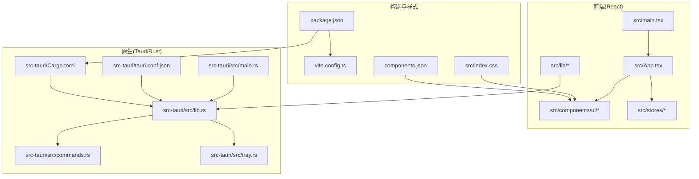
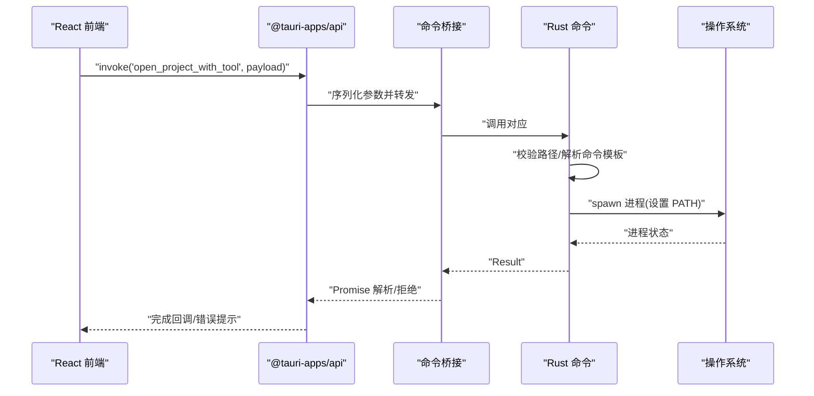
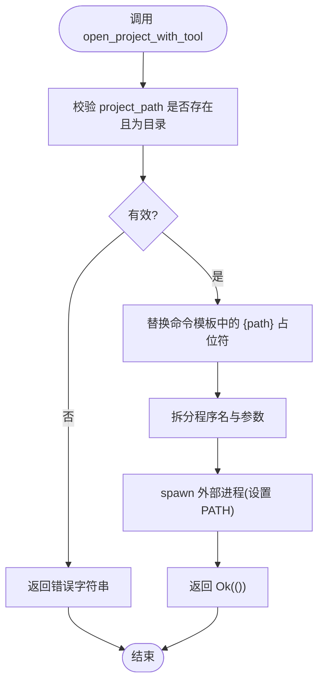
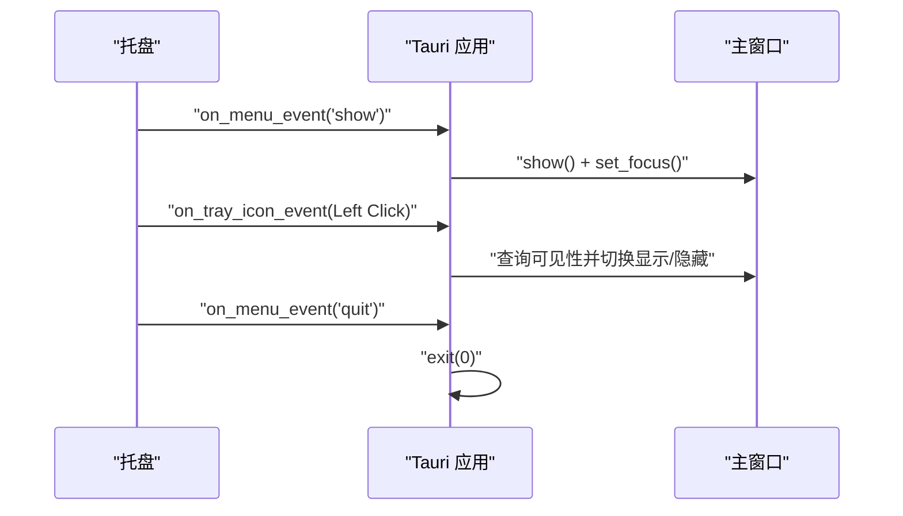
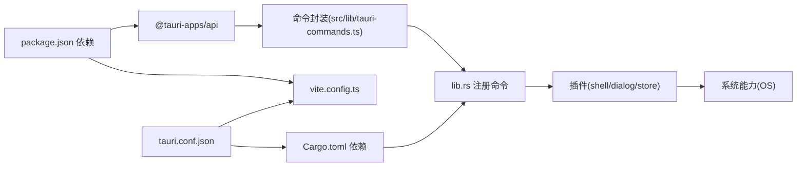

# 集成模式

<cite>
**本文引用的文件**
- [src-tauri/tauri.conf.json](file://src-tauri/tauri.conf.json)
- [src-tauri/Cargo.toml](file://src-tauri/Cargo.toml)
- [package.json](file://package.json)
- [vite.config.ts](file://vite.config.ts)
- [src/main.tsx](file://src/main.tsx)
- [src-tauri/src/main.rs](file://src-tauri/src/main.rs)
- [src-tauri/src/lib.rs](file://src-tauri/src/lib.rs)
- [src-tauri/src/commands.rs](file://src-tauri/src/commands.rs)
- [src-tauri/src/tray.rs](file://src-tauri/src/tray.rs)
- [src/lib/tauri-commands.ts](file://src/lib/tauri-commands.ts)
- [src/lib/storage.ts](file://src/lib/storage.ts)
- [components.json](file://components.json)
- [src/index.css](file://src/index.css)
- [src/App.tsx](file://src/App.tsx)
- [src/lib/constants.ts](file://src/lib/constants.ts)
</cite>

## 目录
1. [简介](#简介)
2. [项目结构](#项目结构)
3. [核心组件](#核心组件)
4. [架构总览](#架构总览)
5. [详细组件分析](#详细组件分析)
6. [依赖关系分析](#依赖关系分析)
7. [性能考量](#性能考量)
8. [故障排除指南](#故障排除指南)
9. [结论](#结论)
10. [附录](#附录)

## 简介
本文件面向 LaunchPro 的“集成模式”，系统性阐述 Tauri 框架与 React 前端的集成方式，涵盖命令桥接、事件通信与数据传输；系统级集成（系统托盘、窗口管理、原生能力调用）；第三方库（Radix UI、shadcn/ui、Tailwind CSS）的配置与使用；构建系统（Vite、Rust 编译、打包）；跨平台兼容策略与平台适配；以及安全集成（权限、沙箱与数据保护）等主题。文档同时提供集成测试、调试工具与故障排除建议，帮助开发者快速上手并稳定交付。

## 项目结构
项目采用前后端分离的混合架构：前端基于 React + Vite，后端基于 Tauri（Rust），通过命令桥接与插件体系实现系统级能力访问。核心目录与职责如下：
- 前端源码：src 下包含 React 组件、UI 组件库封装、状态管理、工具函数与类型定义。
- 原生层：src-tauri 下包含 Tauri 配置、Rust 入口与模块（命令、托盘、窗口事件处理）。
- 构建与脚本：package.json 定义前端脚本与依赖；vite.config.ts 提供开发服务器与别名；Cargo.toml 管理 Rust 依赖与插件；tauri.conf.json 配置应用元信息、窗口与打包参数。

图表来源
- [src/main.tsx:1-11](file://src/main.tsx#L1-L11)
- [src/App.tsx:1-40](file://src/App.tsx#L1-L40)
- [src-tauri/src/main.rs:1-7](file://src-tauri/src/main.rs#L1-L7)
- [src-tauri/src/lib.rs:1-28](file://src-tauri/src/lib.rs#L1-L28)
- [src-tauri/src/commands.rs:1-95](file://src-tauri/src/commands.rs#L1-L95)
- [src-tauri/src/tray.rs:1-58](file://src-tauri/src/tray.rs#L1-L58)
- [src-tauri/tauri.conf.json:1-44](file://src-tauri/tauri.conf.json#L1-L44)
- [src-tauri/Cargo.toml:1-22](file://src-tauri/Cargo.toml#L1-L22)
- [package.json:1-48](file://package.json#L1-L48)
- [vite.config.ts:1-32](file://vite.config.ts#L1-L32)
- [src/index.css:1-116](file://src/index.css#L1-L116)
- [components.json:1-22](file://components.json#L1-L22)

章节来源
- [src/main.tsx:1-11](file://src/main.tsx#L1-L11)
- [src/App.tsx:1-40](file://src/App.tsx#L1-L40)
- [src-tauri/src/main.rs:1-7](file://src-tauri/src/main.rs#L1-L7)
- [src-tauri/src/lib.rs:1-28](file://src-tauri/src/lib.rs#L1-L28)
- [src-tauri/tauri.conf.json:1-44](file://src-tauri/tauri.conf.json#L1-L44)
- [src-tauri/Cargo.toml:1-22](file://src-tauri/Cargo.toml#L1-L22)
- [package.json:1-48](file://package.json#L1-L48)
- [vite.config.ts:1-32](file://vite.config.ts#L1-L32)
- [src/index.css:1-116](file://src/index.css#L1-L116)
- [components.json:1-22](file://components.json#L1-L22)

## 核心组件
- 命令桥接与数据传输
  - 前端通过 @tauri-apps/api 的 invoke 调用后端命令，返回值在 Rust 中以 Result 形式传递，错误会抛到前端。
  - 示例命令：打开项目、检查路径存在性、获取应用数据目录。
- 事件通信
  - 窗口关闭事件拦截并隐藏窗口；托盘菜单事件响应显示/隐藏主窗体与退出应用。
- 存储与状态
  - 使用 @tauri-apps/plugin-store 的 LazyStore 实现本地持久化，自动保存默认数据。
- UI 组件与主题
  - 基于 shadcn/ui 与 Tailwind CSS，配合 Radix UI 原子组件，提供统一的设计语言与暗色支持。
- 构建与运行
  - 前端使用 Vite + React + Tailwind；后端使用 Tauri CLI 与 Rust 工具链；开发时由 tauri.conf.json 指定 devUrl 与构建产物目录。

章节来源
- [src/lib/tauri-commands.ts:1-17](file://src/lib/tauri-commands.ts#L1-L17)
- [src-tauri/src/commands.rs:48-95](file://src-tauri/src/commands.rs#L48-L95)
- [src-tauri/src/lib.rs:19-26](file://src-tauri/src/lib.rs#L19-L26)
- [src-tauri/src/tray.rs:8-58](file://src-tauri/src/tray.rs#L8-L58)
- [src/lib/storage.ts:1-30](file://src/lib/storage.ts#L1-L30)
- [src/index.css:1-116](file://src/index.css#L1-L116)
- [components.json:1-22](file://components.json#L1-L22)
- [src-tauri/tauri.conf.json:5-10](file://src-tauri/tauri.conf.json#L5-L10)
- [package.json:6-12](file://package.json#L6-L12)

## 架构总览
下图展示从 React 前端发起命令到 Rust 后端执行再到系统交互的整体流程，以及托盘与窗口事件的联动。

图表来源
- [src/lib/tauri-commands.ts:1-17](file://src/lib/tauri-commands.ts#L1-L17)
- [src-tauri/src/lib.rs:10-14](file://src-tauri/src/lib.rs#L10-L14)
- [src-tauri/src/commands.rs:48-79](file://src-tauri/src/commands.rs#L48-L79)

章节来源
- [src/lib/tauri-commands.ts:1-17](file://src/lib/tauri-commands.ts#L1-L17)
- [src-tauri/src/lib.rs:10-14](file://src-tauri/src/lib.rs#L10-L14)
- [src-tauri/src/commands.rs:48-79](file://src-tauri/src/commands.rs#L48-L79)

## 详细组件分析

### 命令桥接与数据传输
- 前端命令封装
  - 封装 openProjectWithTool、checkPathExists、getAppDataDir 三个命令，分别用于打开项目、检查路径与获取应用数据目录。
- 后端命令实现
  - open_project_with_tool：校验路径存在且为目录，替换命令模板中的占位符，按系统 PATH 执行外部程序。
  - check_path_exists：判断路径是否存在且为目录。
  - get_app_data_dir：通过 AppHandle 获取应用数据目录。
- 错误处理
  - 所有命令以 Result 返回，失败时将错误字符串传递给前端，便于统一提示。

图表来源
- [src-tauri/src/commands.rs:48-79](file://src-tauri/src/commands.rs#L48-L79)

章节来源
- [src/lib/tauri-commands.ts:1-17](file://src/lib/tauri-commands.ts#L1-L17)
- [src-tauri/src/commands.rs:48-95](file://src-tauri/src/commands.rs#L48-L95)

### 系统托盘与窗口管理
- 托盘创建
  - 创建带菜单的托盘图标，包含“显示窗口”和“退出”项；左键点击托盘切换主窗口显示/隐藏。
- 窗口事件
  - 拦截关闭请求，阻止直接销毁窗口，改为隐藏；通过托盘菜单可再次显示并聚焦。

图表来源
- [src-tauri/src/tray.rs:8-58](file://src-tauri/src/tray.rs#L8-L58)
- [src-tauri/src/lib.rs:19-24](file://src-tauri/src/lib.rs#L19-L24)

章节来源
- [src-tauri/src/tray.rs:8-58](file://src-tauri/src/tray.rs#L8-L58)
- [src-tauri/src/lib.rs:19-24](file://src-tauri/src/lib.rs#L19-L24)

### 第三方库集成：Radix UI、shadcn/ui 与 Tailwind CSS
- shadcn/ui 配置
  - components.json 指定风格、TSX、Tailwind 配置与别名，确保组件生成与样式一致。
- Tailwind CSS
  - 在 src/index.css 中引入 Tailwind 并自定义变量，支持暗色主题与组件基类。
- Radix UI
  - 作为基础原子组件库，提供语义化与无障碍支持，与 shadcn/ui 组件协同工作。

章节来源
- [components.json:1-22](file://components.json#L1-L22)
- [src/index.css:1-116](file://src/index.css#L1-L116)
- [package.json:22-22](file://package.json#L22-L22)

### 构建系统与打包流程
- 前端构建
  - Vite 配置启用 React 插件与 Tailwind Vite 插件，设置别名与开发服务器端口；忽略 src-tauri 目录监听。
  - package.json 定义 dev/build/preview/tauri 脚本，先 TypeScript 编译再进行 Vite 构建。
- 原生构建
  - Cargo.toml 指定 tauri 与相关插件依赖；tauri.conf.json 指定构建前命令与前端产物目录。
- 打包与平台
  - tauri.conf.json 开启打包并指定多目标；macOS 最低系统版本配置。

章节来源
- [vite.config.ts:1-32](file://vite.config.ts#L1-L32)
- [package.json:6-12](file://package.json#L6-L12)
- [src-tauri/Cargo.toml:15-22](file://src-tauri/Cargo.toml#L15-L22)
- [src-tauri/tauri.conf.json:5-10](file://src-tauri/tauri.conf.json#L5-L10)
- [src-tauri/tauri.conf.json:29-42](file://src-tauri/tauri.conf.json#L29-L42)

### 跨平台兼容性与平台适配
- 系统 PATH 处理
  - 在 macOS 上读取 /etc/paths 并合并常见 IDE CLI 安装路径，避免 Tauri 默认不继承 shell PATH 的问题。
- 平台特定命令
  - 示例中包含 macOS 的 open 命令用于打开 Finder 或终端，体现平台差异。
- 窗口与托盘
  - 窗口最小尺寸与居中显示；托盘图标与菜单在各平台保持一致行为。

章节来源
- [src-tauri/src/commands.rs:5-46](file://src-tauri/src/commands.rs#L5-L46)
- [src/lib/constants.ts:10-17](file://src/lib/constants.ts#L10-L17)

### 安全集成考虑
- 权限与能力
  - 通过 tauri.conf.json 的 capabilities 与插件白名单限制能力暴露范围；当前启用 shell、dialog、store 插件。
- 沙箱与最小权限
  - 建议仅授予必要插件与命令，避免开放任意系统调用；对用户输入进行严格校验与转义。
- 数据保护
  - 使用 LazyStore 自动保存敏感数据前进行加密或最小化存储；避免在日志中输出敏感路径。
- 输入验证
  - 命令执行前对路径与命令模板进行校验，防止路径穿越与注入攻击。

章节来源
- [src-tauri/tauri.conf.json:1-44](file://src-tauri/tauri.conf.json#L1-L44)
- [src-tauri/Cargo.toml:15-22](file://src-tauri/Cargo.toml#L15-L22)
- [src-tauri/src/commands.rs:48-79](file://src-tauri/src/commands.rs#L48-L79)

## 依赖关系分析
- 前端依赖
  - @tauri-apps/api 提供命令桥接；@tauri-apps/plugin-* 提供插件能力；React 生态与 UI 组件库。
- 原生依赖
  - tauri 与插件（shell、dialog、store）；serde 用于序列化；构建期 tauri-build。
- 构建依赖
  - @tauri-apps/cli、vite、tailwindcss、@tailwindcss/vite 等。

图表来源
- [package.json:13-29](file://package.json#L13-L29)
- [src-tauri/Cargo.toml:12-22](file://src-tauri/Cargo.toml#L12-L22)
- [src-tauri/src/lib.rs:7-9](file://src-tauri/src/lib.rs#L7-L9)
- [src-tauri/tauri.conf.json:5-10](file://src-tauri/tauri.conf.json#L5-L10)
- [vite.config.ts:1-32](file://vite.config.ts#L1-L32)

章节来源
- [package.json:13-29](file://package.json#L13-L29)
- [src-tauri/Cargo.toml:12-22](file://src-tauri/Cargo.toml#L12-L22)
- [src-tauri/src/lib.rs:7-9](file://src-tauri/src/lib.rs#L7-L9)
- [src-tauri/tauri.conf.json:5-10](file://src-tauri/tauri.conf.json#L5-L10)
- [vite.config.ts:1-32](file://vite.config.ts#L1-L32)

## 性能考量
- 前端
  - 使用 React 19 与 Vite 快速热更新；Tailwind 按需生成减少体积；避免不必要的重渲染。
- 原生
  - 命令执行尽量轻量；LazyStore 自动保存减少频繁 I/O；窗口最小化尺寸与居中提升用户体验。
- 构建
  - 分离开发与生产环境配置；合理设置 HMR 与监听忽略规则，降低资源占用。

## 故障排除指南
- 开发联调
  - 确认前端 devUrl 与 tauri.conf.json 一致；检查 Vite 别名与 HMR 配置是否生效。
- 命令调用失败
  - 检查命令注册是否正确；确认参数类型与命名一致；查看后端日志定位错误。
- 托盘/窗口异常
  - 确认托盘图标路径与权限；检查窗口事件拦截逻辑；验证最小尺寸与居中配置。
- 存储问题
  - 检查 LazyStore 初始化与默认值；确认 JSON 文件写入权限与路径。
- 打包与平台
  - 根据 tauri.conf.json 的最低系统版本与图标清单进行平台适配；核对签名与权限配置。

章节来源
- [src-tauri/tauri.conf.json:5-10](file://src-tauri/tauri.conf.json#L5-L10)
- [vite.config.ts:16-30](file://vite.config.ts#L16-L30)
- [src-tauri/src/lib.rs:19-24](file://src-tauri/src/lib.rs#L19-L24)
- [src/lib/storage.ts:1-30](file://src/lib/storage.ts#L1-L30)

## 结论
LaunchPro 的集成模式以 Tauri 为核心，结合 React 前端与 Rust 原生能力，实现了命令桥接、事件通信与系统级功能的无缝整合。通过合理的第三方库集成、构建配置与安全策略，项目在跨平台兼容性与开发体验之间取得平衡。建议在后续迭代中持续完善权限模型、增强错误监控与日志审计，并扩展自动化测试覆盖。

## 附录
- 关键入口与配置
  - 前端入口：src/main.tsx
  - 应用入口：src-tauri/src/main.rs
  - 原生运行：src-tauri/src/lib.rs
  - 命令注册：src-tauri/src/lib.rs
  - 命令实现：src-tauri/src/commands.rs
  - 托盘实现：src-tauri/src/tray.rs
  - 前端命令封装：src/lib/tauri-commands.ts
  - 存储封装：src/lib/storage.ts
  - UI 主题与样式：src/index.css
  - 组件库配置：components.json
  - 构建脚本：package.json
  - Vite 配置：vite.config.ts
  - Tauri 配置：src-tauri/tauri.conf.json
  - 原生依赖：src-tauri/Cargo.toml