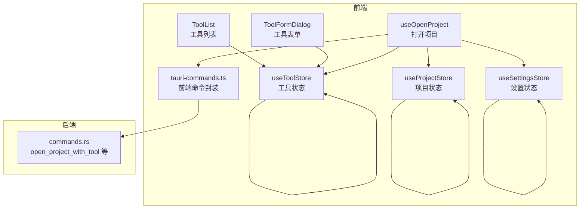
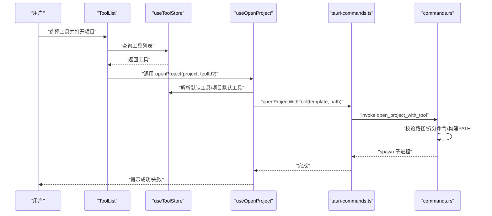
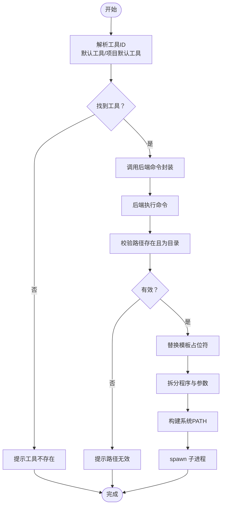
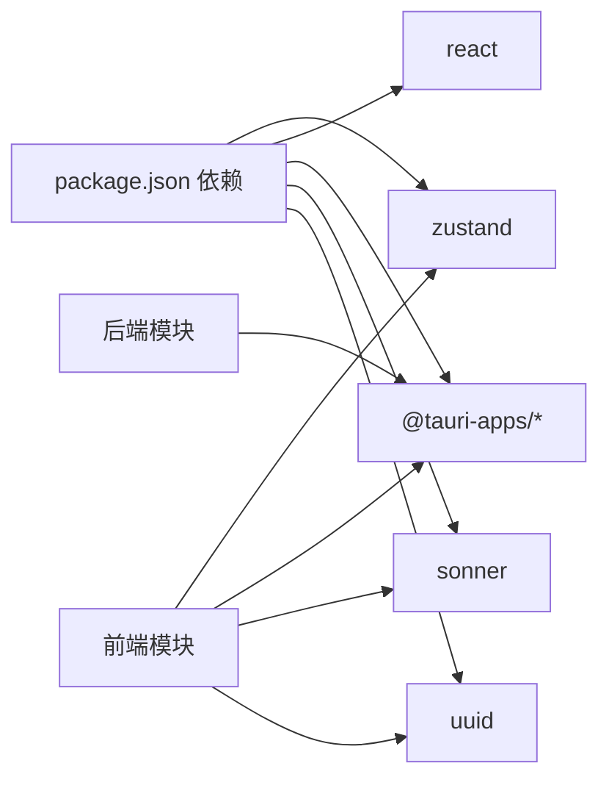

# 内置工具集

<cite>
**本文引用的文件**
- [src/lib/constants.ts](file://src/lib/constants.ts)
- [src/stores/useToolStore.ts](file://src/stores/useToolStore.ts)
- [src/lib/storage.ts](file://src/lib/storage.ts)
- [src/components/tool/ToolFormDialog.tsx](file://src/components/tool/ToolFormDialog.tsx)
- [src/components/tool/ToolList.tsx](file://src/components/tool/ToolList.tsx)
- [src/hooks/useOpenProject.ts](file://src/hooks/useOpenProject.ts)
- [src/lib/tauri-commands.ts](file://src/lib/tauri-commands.ts)
- [src-tauri/src/commands.rs](file://src-tauri/src/commands.rs)
- [src/App.tsx](file://src/App.tsx)
- [package.json](file://package.json)
</cite>

## 目录
1. [简介](#简介)
2. [项目结构](#项目结构)
3. [核心组件](#核心组件)
4. [架构总览](#架构总览)
5. [详细组件分析](#详细组件分析)
6. [依赖关系分析](#依赖关系分析)
7. [性能考虑](#性能考虑)
8. [故障排除指南](#故障排除指南)
9. [结论](#结论)
10. [附录](#附录)

## 简介
本文件为“内置工具集”的全面文档，面向使用者与开发者，系统阐述项目中已内置的开发工具配置、命令模板与参数占位符系统；解释工具模板的通用格式与参数占位符；说明内置工具的自动发现与初始化机制；给出工具兼容性与平台特性；提供自定义内置工具的扩展指南与最佳实践，并明确内置工具与用户自定义工具的优先级与合并策略。

## 项目结构
该功能围绕前端状态管理（Zustand）、类型定义（TypeScript）、对话框与列表 UI 组件、以及 Tauri 后端命令展开，形成“前端配置 + 后端执行”的完整链路。

图表来源
- [src/components/tool/ToolList.tsx:1-129](file://src/components/tool/ToolList.tsx#L1-L129)
- [src/components/tool/ToolFormDialog.tsx:1-134](file://src/components/tool/ToolFormDialog.tsx#L1-L134)
- [src/stores/useToolStore.ts:1-75](file://src/stores/useToolStore.ts#L1-L75)
- [src/hooks/useOpenProject.ts:1-44](file://src/hooks/useOpenProject.ts#L1-L44)
- [src/lib/tauri-commands.ts:1-17](file://src/lib/tauri-commands.ts#L1-L17)
- [src-tauri/src/commands.rs:57-88](file://src-tauri/src/commands.rs#L57-L88)

章节来源
- [src/App.tsx:24-35](file://src/App.tsx#L24-L35)
- [package.json:13-29](file://package.json#L13-L29)

## 核心组件
- 工具类型与内置工具集合
  - 工具类型包含名称、图标、命令模板与是否内置标记等字段。
  - 内置工具集合在常量文件中集中定义，包含多种常见 IDE 与终端工具的命令模板，统一使用占位符替换项目路径。
- 工具状态管理
  - 使用 Zustand 管理工具列表，支持加载、新增、更新、删除与按 ID 查询。
  - 首次启动时以内置工具初始化；后续启动会合并用户自定义工具与缺失的内置工具，确保内置工具始终存在。
- 工具表单与列表
  - 表单用于添加或编辑工具，强制要求命令模板包含占位符，且名称非空。
  - 列表区分内置与自定义工具，内置工具不可删除，自定义工具可编辑与删除。
- 打开项目流程
  - 通过设置中的默认工具或项目默认工具解析目标工具，调用前端命令封装，最终由后端执行命令并传入项目路径。

章节来源
- [src/types/index.ts:12-18](file://src/types/index.ts#L12-L18)
- [src/lib/constants.ts:3-18](file://src/lib/constants.ts#L3-L18)
- [src/stores/useToolStore.ts:17-75](file://src/stores/useToolStore.ts#L17-L75)
- [src/components/tool/ToolFormDialog.tsx:21-78](file://src/components/tool/ToolFormDialog.tsx#L21-L78)
- [src/components/tool/ToolList.tsx:12-81](file://src/components/tool/ToolList.tsx#L12-L81)
- [src/hooks/useOpenProject.ts:9-43](file://src/hooks/useOpenProject.ts#L9-L43)

## 架构总览
下图展示从用户选择工具到后端执行命令的完整序列：

图表来源
- [src/components/tool/ToolList.tsx:12-81](file://src/components/tool/ToolList.tsx#L12-L81)
- [src/stores/useToolStore.ts:17-75](file://src/stores/useToolStore.ts#L17-L75)
- [src/hooks/useOpenProject.ts:15-40](file://src/hooks/useOpenProject.ts#L15-L40)
- [src/lib/tauri-commands.ts:3-8](file://src/lib/tauri-commands.ts#L3-L8)
- [src-tauri/src/commands.rs:57-88](file://src-tauri/src/commands.rs#L57-L88)

## 详细组件分析

### 内置工具集合与模板系统
- 定义位置：内置工具集合在常量文件中集中声明，包含多个常用 IDE 与终端工具的命令模板。
- 模板格式：所有内置工具均采用统一的命令模板格式，使用占位符替换项目路径。
- 占位符系统：命令模板必须包含占位符，用于在运行时替换为实际项目路径。
- 平台特性：部分命令针对 macOS 平台（如打开 Finder 或 Terminal），体现了平台特定配置。

章节来源
- [src/lib/constants.ts:3-18](file://src/lib/constants.ts#L3-L18)
- [src/components/tool/ToolFormDialog.tsx:53-56](file://src/components/tool/ToolFormDialog.tsx#L53-L56)

### 工具状态管理与持久化
- 初始化与合并策略：首次启动时以内置工具初始化；后续启动若本地存储存在用户自定义工具，则保留用户自定义项，并补充缺失的内置工具，确保内置工具始终可用。
- 新增/更新/删除：支持新增自定义工具（非内置），更新工具属性，删除自定义工具（内置工具不可删除）。
- 持久化：工具列表通过本地存储模块进行读写，默认值即内置工具集合。

章节来源
- [src/stores/useToolStore.ts:21-39](file://src/stores/useToolStore.ts#L21-L39)
- [src/stores/useToolStore.ts:41-69](file://src/stores/useToolStore.ts#L41-L69)
- [src/lib/storage.ts:9-12](file://src/lib/storage.ts#L9-L12)

### 工具表单与校验
- 必填项与校验：名称非空；命令模板非空；命令模板必须包含占位符；图标长度限制。
- 提示与反馈：通过消息通知提示错误与成功信息。
- 模板占位符说明：表单内明确提示使用占位符作为项目路径的占位符。

章节来源
- [src/components/tool/ToolFormDialog.tsx:44-78](file://src/components/tool/ToolFormDialog.tsx#L44-L78)
- [src/components/tool/ToolFormDialog.tsx:105-107](file://src/components/tool/ToolFormDialog.tsx#L105-L107)

### 工具列表与分类展示
- 分类显示：内置工具与自定义工具分别展示，内置工具带有标识，且不可删除。
- 模板展示：列表中以等宽字体展示命令模板，便于核对占位符与参数。

章节来源
- [src/components/tool/ToolList.tsx:38-71](file://src/components/tool/ToolList.tsx#L38-L71)
- [src/components/tool/ToolList.tsx:83-129](file://src/components/tool/ToolList.tsx#L83-L129)

### 打开项目流程与后端执行
- 解析工具：根据传入工具 ID、项目默认工具或全局默认工具解析目标工具。
- 前端命令封装：调用后端命令，传入命令模板与项目路径。
- 后端执行：校验路径存在且为目录；替换模板中的占位符；拆分程序名与参数；构建系统 PATH；以子进程方式启动程序。

图表来源
- [src/hooks/useOpenProject.ts:15-40](file://src/hooks/useOpenProject.ts#L15-L40)
- [src/lib/tauri-commands.ts:3-8](file://src/lib/tauri-commands.ts#L3-L8)
- [src-tauri/src/commands.rs:57-88](file://src-tauri/src/commands.rs#L57-L88)

章节来源
- [src/hooks/useOpenProject.ts:15-40](file://src/hooks/useOpenProject.ts#L15-L40)
- [src/lib/tauri-commands.ts:3-8](file://src/lib/tauri-commands.ts#L3-L8)
- [src-tauri/src/commands.rs:57-88](file://src-tauri/src/commands.rs#L57-L88)

### 自动发现与初始化机制
- 首次启动：从本地存储读取工具列表；若为空则以内置工具集合初始化并写入存储。
- 后续启动：若本地存在用户自定义工具，则保留用户自定义项，并补充缺失的内置工具，保证内置工具始终可用。
- 设置与项目数据：应用启动时同时加载工具、项目与设置，确保打开项目流程所需上下文完备。

章节来源
- [src/stores/useToolStore.ts:21-39](file://src/stores/useToolStore.ts#L21-L39)
- [src/lib/storage.ts:9-12](file://src/lib/storage.ts#L9-L12)
- [src/App.tsx:24-35](file://src/App.tsx#L24-L35)

### 兼容性与平台特性
- 跨平台能力：前端逻辑与状态管理跨平台；后端命令通过 Tauri 调用系统进程。
- 平台特定命令：内置工具中包含 macOS 特定命令（如打开 Finder/Terminal），体现平台差异。
- PATH 构建：后端在 macOS 上从系统路径文件与常见安装目录构建 PATH，提升 CLI 工具识别率。

章节来源
- [src/lib/constants.ts:10-11](file://src/lib/constants.ts#L10-L11)
- [src-tauri/src/commands.rs:14-55](file://src-tauri/src/commands.rs#L14-L55)

### 扩展指南与最佳实践
- 新增内置工具
  - 在常量文件中添加新的工具条目，确保命令模板包含占位符。
  - 保持工具 ID 唯一，避免与现有内置工具冲突。
- 自定义工具
  - 通过工具表单添加自定义工具，注意命令模板必须包含占位符。
  - 图标建议使用 1-2 个字符，简洁易识别。
- 合并与优先级
  - 用户自定义工具优先于内置工具的显示与操作；内置工具不会被删除。
  - 合并策略：首次启动或本地无自定义工具时以内置工具初始化；后续启动保留用户自定义并补充缺失的内置工具。
- 参数与工作目录
  - 当前实现仅支持命令模板中的占位符替换，不涉及工作目录设置与复杂启动参数解析。
  - 若需更复杂的参数处理，可在命令模板中直接拼接参数，或在后端扩展命令解析逻辑。

章节来源
- [src/lib/constants.ts:3-18](file://src/lib/constants.ts#L3-L18)
- [src/components/tool/ToolFormDialog.tsx:44-78](file://src/components/tool/ToolFormDialog.tsx#L44-L78)
- [src/stores/useToolStore.ts:26-30](file://src/stores/useToolStore.ts#L26-L30)

## 依赖关系分析
- 前端依赖
  - 状态管理：Zustand 用于工具、项目与设置的状态管理。
  - UI 组件：基于 Radix UI 与 TailwindCSS 的组件库。
  - 消息通知：Sonner 提供轻量提示。
  - UUID：生成唯一 ID。
- 后端依赖
  - Tauri 插件：store、shell、dialog 等插件提供本地存储、系统交互与对话框能力。
- 关键命令
  - open_project_with_tool：执行命令模板并传入项目路径。
  - check_path_exists：校验路径是否存在且为目录。
  - get_app_data_dir：获取应用数据目录。

图表来源
- [package.json:13-29](file://package.json#L13-L29)

章节来源
- [package.json:13-29](file://package.json#L13-L29)

## 性能考虑
- 状态与渲染
  - 工具列表与项目列表均使用轻量状态管理，渲染开销较低。
  - 列表采用滚动区域组件，避免长列表导致的布局抖动。
- 命令执行
  - 后端 spawn 子进程异步执行，避免阻塞主线程。
  - PATH 构建在启动时完成，减少每次执行的重复计算。
- 存储与初始化
  - 首次启动写入内置工具集合，后续启动仅做合并与读取，IO 开销可控。

## 故障排除指南
- 工具未找到
  - 检查工具 ID 是否正确；若工具被删除或变更，将触发错误提示。
- 命令模板无效
  - 确保命令模板包含占位符；表单会阻止提交不含占位符的模板。
- 路径无效
  - 后端会校验路径存在且为目录；若路径不存在或不是目录，将提示错误。
- 自定义工具无法删除
  - 内置工具不可删除；仅可删除自定义工具。
- PATH 问题（macOS）
  - 若 CLI 工具无法识别，确认其安装路径已被加入 PATH；后端会从系统路径文件与常见目录构建 PATH。

章节来源
- [src/hooks/useOpenProject.ts:24-29](file://src/hooks/useOpenProject.ts#L24-L29)
- [src/components/tool/ToolFormDialog.tsx:53-56](file://src/components/tool/ToolFormDialog.tsx#L53-L56)
- [src-tauri/src/commands.rs:59-65](file://src-tauri/src/commands.rs#L59-L65)
- [src/stores/useToolStore.ts:62-64](file://src/stores/useToolStore.ts#L62-L64)
- [src-tauri/src/commands.rs:14-55](file://src-tauri/src/commands.rs#L14-L55)

## 结论
内置工具集通过统一的命令模板与占位符系统，结合前端状态管理与后端命令执行，实现了对多类 IDE 与终端工具的开箱即用支持。内置工具在首次启动与后续启动中均得到妥善维护，用户自定义工具与内置工具共存并互补。当前实现聚焦于简单可靠的模板替换与执行，未来可在此基础上扩展更丰富的参数与工作目录支持。

## 附录

### 内置工具清单与模板
以下为内置工具清单及其命令模板占位符说明（占位符统一为项目路径）：
- Qoder、Cursor、VS Code、Kiro、CodeBuddy、Trae、OpenCode、Claude Code、Gemini CLI、Codex、Antigravity、Kimi CLI
- Finder、Terminal：macOS 平台特定命令，用于打开资源管理器与终端

章节来源
- [src/lib/constants.ts:3-18](file://src/lib/constants.ts#L3-L18)

### 工具模板通用格式与参数占位符
- 通用格式：工具命令模板由“程序名 + 参数”组成，其中参数中包含占位符用于替换项目路径。
- 占位符系统：命令模板必须包含占位符，用于在运行时替换为实际项目路径。
- 参数解析：后端将命令按空白分割为程序名与参数数组，再执行。

章节来源
- [src/components/tool/ToolFormDialog.tsx:53-56](file://src/components/tool/ToolFormDialog.tsx#L53-L56)
- [src-tauri/src/commands.rs:70-77](file://src-tauri/src/commands.rs#L70-L77)

### 自动发现与配置机制
- 首次启动：若本地存储为空，则以内置工具集合初始化。
- 后续启动：若存在用户自定义工具，则保留并补充缺失的内置工具。
- 启动加载：应用启动时同步加载工具、项目与设置，确保上下文完备。

章节来源
- [src/stores/useToolStore.ts:21-39](file://src/stores/useToolStore.ts#L21-L39)
- [src/App.tsx:24-35](file://src/App.tsx#L24-L35)

### 工具兼容性矩阵（基于内置清单）
- Windows：当前内置工具主要面向 macOS；Windows 用户可参考模板自行添加对应命令。
- macOS：支持 Finder、Terminal 等原生工具；IDE 类工具需确保 CLI 工具已安装并可被 PATH 识别。
- Linux：IDE 类工具需确保 CLI 工具已安装并可被 PATH 识别。

章节来源
- [src/lib/constants.ts:10-11](file://src/lib/constants.ts#L10-L11)
- [src-tauri/src/commands.rs:14-55](file://src-tauri/src/commands.rs#L14-L55)