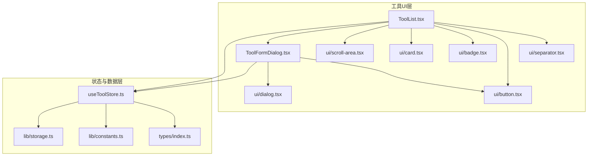
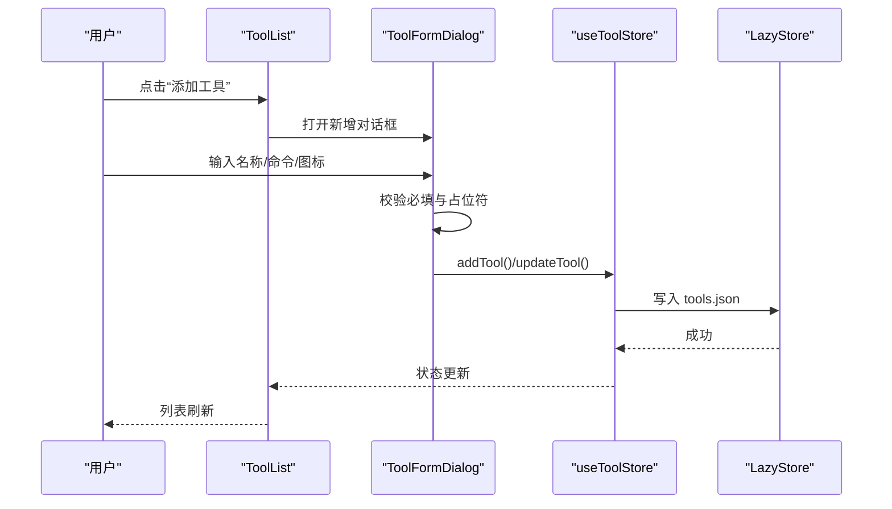
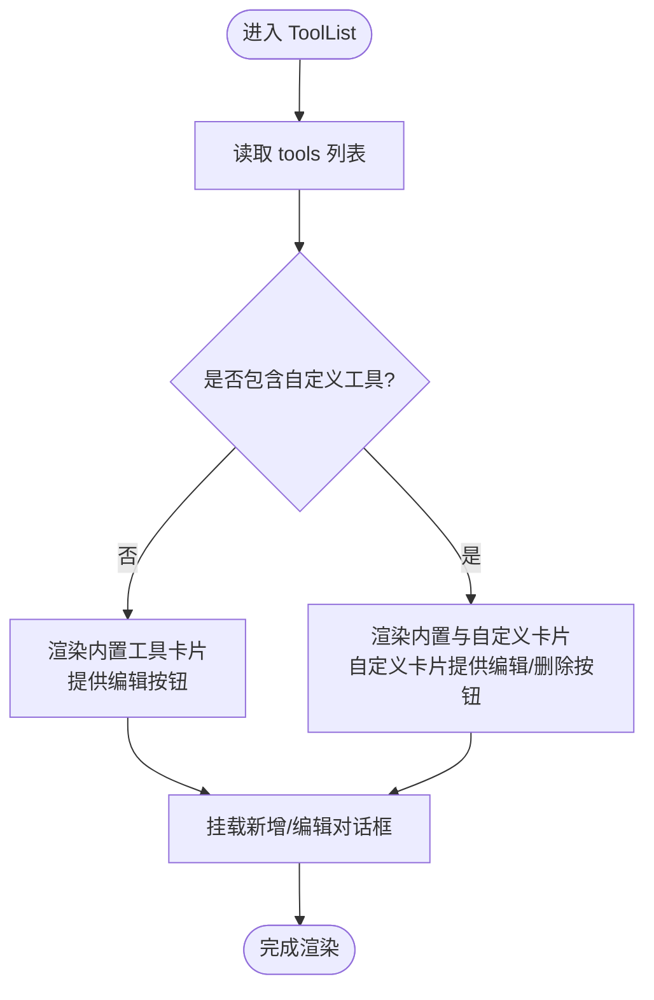
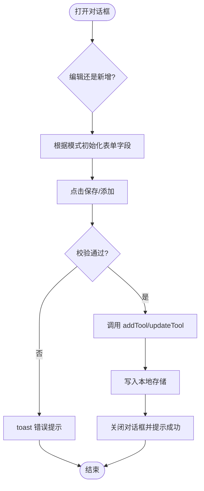
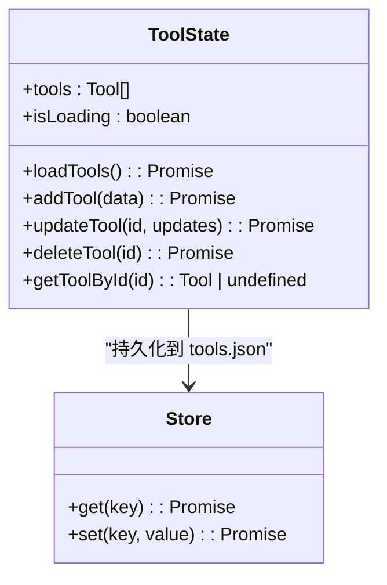
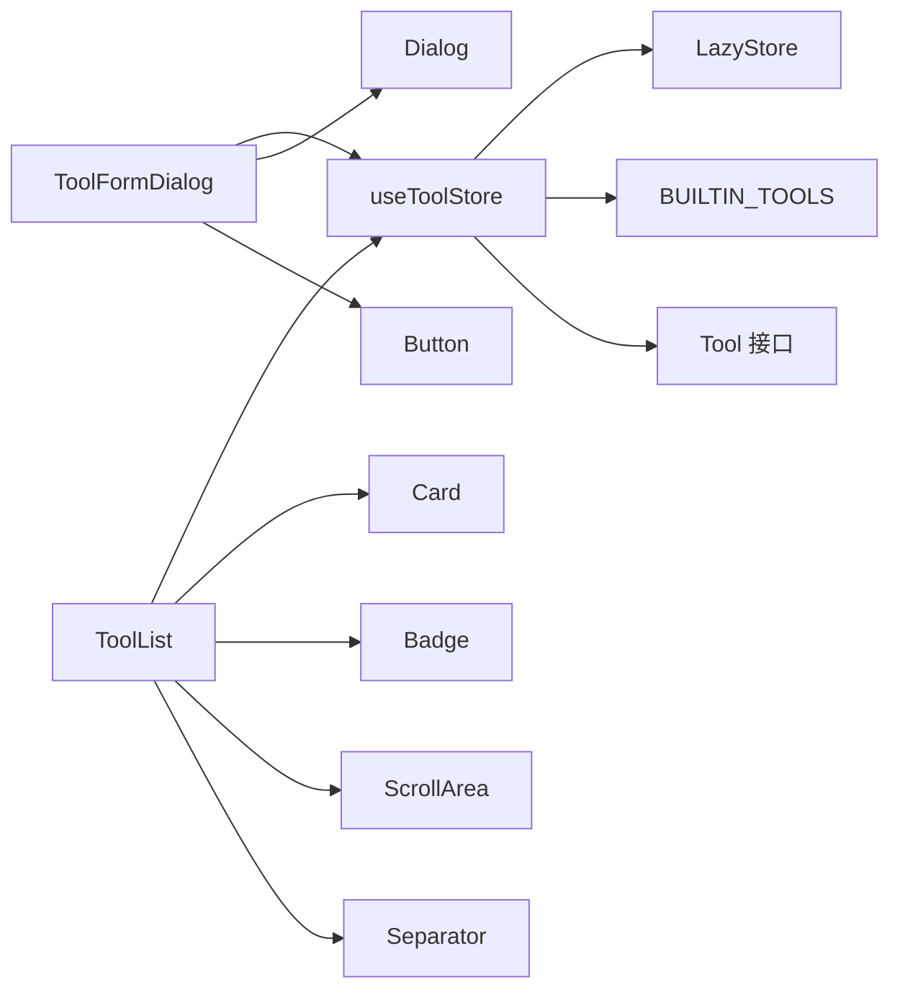

# 工具UI组件

<cite>
**本文引用的文件**
- [src/components/tool/ToolList.tsx](file://src/components/tool/ToolList.tsx)
- [src/components/tool/ToolFormDialog.tsx](file://src/components/tool/ToolFormDialog.tsx)
- [src/stores/useToolStore.ts](file://src/stores/useToolStore.ts)
- [src/types/index.ts](file://src/types/index.ts)
- [src/lib/constants.ts](file://src/lib/constants.ts)
- [src/lib/storage.ts](file://src/lib/storage.ts)
- [src/components/ui/dialog.tsx](file://src/components/ui/dialog.tsx)
- [src/components/ui/button.tsx](file://src/components/ui/button.tsx)
- [src/components/ui/badge.tsx](file://src/components/ui/badge.tsx)
- [src/components/ui/card.tsx](file://src/components/ui/card.tsx)
- [src/components/ui/scroll-area.tsx](file://src/components/ui/scroll-area.tsx)
- [src/components/ui/separator.tsx](file://src/components/ui/separator.tsx)
- [src/components/ui/sonner.tsx](file://src/components/ui/sonner.tsx)
- [src/lib/utils.ts](file://src/lib/utils.ts)
- [src/hooks/useTheme.ts](file://src/hooks/useTheme.ts)
- [src/App.tsx](file://src/App.tsx)
</cite>

## 目录
1. [简介](#简介)
2. [项目结构](#项目结构)
3. [核心组件](#核心组件)
4. [架构总览](#架构总览)
5. [详细组件分析](#详细组件分析)
6. [依赖关系分析](#依赖关系分析)
7. [性能考量](#性能考量)
8. [故障排查指南](#故障排查指南)
9. [结论](#结论)
10. [附录](#附录)

## 简介
本文件聚焦于“工具”相关的UI组件，系统性地文档化以下能力：
- 工具列表组件：工具项渲染、内置与自定义工具分组、状态标识与交互行为
- 工具表单对话框：表单验证、输入处理与提交流程
- 工具列表的排序、过滤与搜索能力现状与扩展建议
- 工具操作按钮组（编辑、删除）的交互逻辑与限制
- 响应式设计与无障碍访问的实现细节
- 组件复用与定制化的最佳实践
- 组件间通信模式与状态同步机制

## 项目结构
工具UI组件位于 src/components/tool 目录，配合 src/stores/useToolStore.ts 使用 Zustand 管理状态，并通过 LazyStore 将数据持久化到本地文件。UI层使用自研的轻量组件库（如 Button、Dialog、Card 等），并由 App.tsx 在应用入口统一初始化加载。

图表来源
- [src/components/tool/ToolList.tsx:1-129](file://src/components/tool/ToolList.tsx#L1-L129)
- [src/components/tool/ToolFormDialog.tsx:1-134](file://src/components/tool/ToolFormDialog.tsx#L1-L134)
- [src/stores/useToolStore.ts:1-75](file://src/stores/useToolStore.ts#L1-L75)
- [src/lib/storage.ts:1-30](file://src/lib/storage.ts#L1-L30)
- [src/lib/constants.ts:1-23](file://src/lib/constants.ts#L1-L23)
- [src/types/index.ts:1-26](file://src/types/index.ts#L1-L26)
- [src/components/ui/dialog.tsx:1-157](file://src/components/ui/dialog.tsx#L1-L157)
- [src/components/ui/button.tsx:1-65](file://src/components/ui/button.tsx#L1-L65)
- [src/components/ui/badge.tsx:1-49](file://src/components/ui/badge.tsx#L1-L49)
- [src/components/ui/card.tsx:1-93](file://src/components/ui/card.tsx#L1-L93)
- [src/components/ui/scroll-area.tsx:1-57](file://src/components/ui/scroll-area.tsx#L1-L57)
- [src/components/ui/separator.tsx:1-29](file://src/components/ui/separator.tsx#L1-L29)

章节来源
- [src/components/tool/ToolList.tsx:1-129](file://src/components/tool/ToolList.tsx#L1-L129)
- [src/components/tool/ToolFormDialog.tsx:1-134](file://src/components/tool/ToolFormDialog.tsx#L1-L134)
- [src/stores/useToolStore.ts:1-75](file://src/stores/useToolStore.ts#L1-L75)
- [src/lib/storage.ts:1-30](file://src/lib/storage.ts#L1-L30)
- [src/lib/constants.ts:1-23](file://src/lib/constants.ts#L1-L23)
- [src/types/index.ts:1-26](file://src/types/index.ts#L1-L26)

## 核心组件
- 工具列表容器：负责渲染内置与自定义工具分组、提供新增按钮、承载表单对话框实例
- 工具卡片：展示工具图标、名称、命令模板与操作按钮；内置工具显示“内置”徽标
- 工具表单对话框：支持新增与编辑两种模式，包含名称、命令模板、图标等字段的校验与提交
- 状态存储：Zustand 状态管理，封装加载、增删改查与持久化逻辑
- UI基础组件：Button、Dialog、Card、Badge、ScrollArea、Separator 等

章节来源
- [src/components/tool/ToolList.tsx:12-129](file://src/components/tool/ToolList.tsx#L12-L129)
- [src/components/tool/ToolFormDialog.tsx:21-134](file://src/components/tool/ToolFormDialog.tsx#L21-L134)
- [src/stores/useToolStore.ts:17-75](file://src/stores/useToolStore.ts#L17-L75)
- [src/types/index.ts:12-18](file://src/types/index.ts#L12-L18)

## 架构总览
工具UI组件采用“容器组件 + 对话框 + 状态存储 + 持久化”的分层架构：
- 容器组件（ToolList）负责视图组织与交互编排
- 表单对话框（ToolFormDialog）负责输入与校验
- 状态存储（useToolStore）负责内存态与持久化同步
- 类型与常量（types、constants）提供契约与默认值
- UI组件库提供可复用的基础控件

图表来源
- [src/components/tool/ToolList.tsx:15-80](file://src/components/tool/ToolList.tsx#L15-L80)
- [src/components/tool/ToolFormDialog.tsx:44-78](file://src/components/tool/ToolFormDialog.tsx#L44-L78)
- [src/stores/useToolStore.ts:41-69](file://src/stores/useToolStore.ts#L41-L69)
- [src/lib/storage.ts:9-17](file://src/lib/storage.ts#L9-L17)

## 详细组件分析

### 工具列表组件（ToolList）
- 渲染策略
  - 从状态存储读取工具数组，按 isBuiltin 分为“内置”和“自定义”两组
  - 自定义工具组存在时才渲染分隔线与标题
- 视图结构
  - 头部区域包含标题、说明与“添加工具”按钮
  - 使用 ScrollArea 提供纵向滚动
  - 内置与自定义工具分别以卡片列表呈现
- 卡片交互
  - 编辑：调用上层传入的 onEdit 回调，打开编辑对话框
  - 删除：仅对自定义工具开放，调用 deleteTool(id)
- 状态与通信
  - 通过 useToolStore 订阅 tools、deleteTool
  - 通过局部状态控制新增/编辑对话框的 open 状态

图表来源
- [src/components/tool/ToolList.tsx:18-79](file://src/components/tool/ToolList.tsx#L18-L79)

章节来源
- [src/components/tool/ToolList.tsx:12-129](file://src/components/tool/ToolList.tsx#L12-L129)
- [src/stores/useToolStore.ts:13-14](file://src/stores/useToolStore.ts#L13-L14)

### 工具卡片（ToolCard）
- 展示信息
  - 左侧图标块：显示 icon 或首字母
  - 中间区域：名称（内置工具显示“内置”徽标）、命令模板（终端图标+等宽字体）
  - 右侧按钮：编辑、删除（仅自定义工具）
- 交互行为
  - 编辑按钮触发父级回调
  - 删除按钮仅在 onDelete 存在时渲染，避免误删内置工具

章节来源
- [src/components/tool/ToolList.tsx:83-128](file://src/components/tool/ToolList.tsx#L83-L128)
- [src/components/ui/badge.tsx:29-49](file://src/components/ui/badge.tsx#L29-L49)
- [src/components/ui/button.tsx:41-65](file://src/components/ui/button.tsx#L41-L65)
- [src/components/ui/card.tsx:5-16](file://src/components/ui/card.tsx#L5-L16)

### 工具表单对话框（ToolFormDialog）
- 模式切换
  - 新增：根据 props.tool 不存在判断
  - 编辑：根据 props.tool 存在判断
- 字段与校验
  - 名称：必填
  - 命令模板：必填且必须包含 {path} 占位符
  - 图标：最多两个字符，为空则回退为名称首字母大写
- 提交流程
  - 调用 useToolStore 的 addTool 或 updateTool
  - 成功后关闭对话框并提示成功
  - 异常时弹出错误提示
- UI与可访问性
  - 使用自研 Dialog 组件，包含标题、描述、底部按钮区
  - 关闭按钮具备屏幕阅读器友好的“关闭”文本

图表来源
- [src/components/tool/ToolFormDialog.tsx:21-134](file://src/components/tool/ToolFormDialog.tsx#L21-L134)
- [src/stores/useToolStore.ts:41-69](file://src/stores/useToolStore.ts#L41-L69)
- [src/components/ui/dialog.tsx:48-80](file://src/components/ui/dialog.tsx#L48-L80)

章节来源
- [src/components/tool/ToolFormDialog.tsx:15-134](file://src/components/tool/ToolFormDialog.tsx#L15-L134)
- [src/components/ui/dialog.tsx:1-157](file://src/components/ui/dialog.tsx#L1-L157)

### 状态存储与持久化（useToolStore）
- 初始化与合并
  - 首次启动或空数据时，使用 BUILTIN_TOOLS 初始化
  - 后续加载用户数据并与内置工具合并，确保内置工具始终存在
- 增删改查
  - addTool：生成唯一 id，标记非内置，追加到列表并持久化
  - updateTool：按 id 替换对应工具并持久化
  - deleteTool：禁止删除内置工具，仅允许删除自定义工具
- 数据源
  - 通过 getToolsStore 获取 LazyStore 实例，自动保存

图表来源
- [src/stores/useToolStore.ts:7-75](file://src/stores/useToolStore.ts#L7-L75)
- [src/lib/storage.ts:23-25](file://src/lib/storage.ts#L23-L25)
- [src/lib/constants.ts:3-18](file://src/lib/constants.ts#L3-L18)

章节来源
- [src/stores/useToolStore.ts:17-75](file://src/stores/useToolStore.ts#L17-L75)
- [src/lib/storage.ts:9-17](file://src/lib/storage.ts#L9-L17)
- [src/lib/constants.ts:3-18](file://src/lib/constants.ts#L3-L18)

### 类型与常量
- Tool 接口：id、name、icon、command、isBuiltin
- BUILTIN_TOOLS：内置工具清单，作为默认值与合并基准

章节来源
- [src/types/index.ts:12-18](file://src/types/index.ts#L12-L18)
- [src/lib/constants.ts:3-18](file://src/lib/constants.ts#L3-L18)

## 依赖关系分析
- 组件耦合
  - ToolList 依赖 useToolStore 与 ToolFormDialog
  - ToolFormDialog 依赖 useToolStore 与 Dialog/Button
  - UI组件（Button、Dialog、Card 等）彼此独立，通过 props 组合使用
- 状态同步
  - useToolStore 内部维护 tools 数组，所有变更均触发订阅者重渲染
  - LazyStore 自动保存，保证应用重启后状态一致
- 外部依赖
  - @tauri-apps/plugin-store 提供 LazyStore
  - lucide-react 提供图标
  - radix-ui 提供基础组件语义与可访问性

图表来源
- [src/components/tool/ToolList.tsx:1-11](file://src/components/tool/ToolList.tsx#L1-L11)
- [src/components/tool/ToolFormDialog.tsx:1-13](file://src/components/tool/ToolFormDialog.tsx#L1-L13)
- [src/stores/useToolStore.ts:1-6](file://src/stores/useToolStore.ts#L1-L6)
- [src/lib/storage.ts:1-30](file://src/lib/storage.ts#L1-L30)
- [src/lib/constants.ts:1-23](file://src/lib/constants.ts#L1-L23)
- [src/types/index.ts:1-26](file://src/types/index.ts#L1-L26)
- [src/components/ui/dialog.tsx:1-157](file://src/components/ui/dialog.tsx#L1-L157)
- [src/components/ui/button.tsx:1-65](file://src/components/ui/button.tsx#L1-L65)
- [src/components/ui/card.tsx:1-93](file://src/components/ui/card.tsx#L1-L93)
- [src/components/ui/badge.tsx:1-49](file://src/components/ui/badge.tsx#L1-L49)
- [src/components/ui/scroll-area.tsx:1-57](file://src/components/ui/scroll-area.tsx#L1-L57)
- [src/components/ui/separator.tsx:1-29](file://src/components/ui/separator.tsx#L1-L29)

## 性能考量
- 渲染优化
  - ToolList 通过局部状态控制对话框 open，避免无关重渲染
  - 工具分组渲染，减少不必要的 DOM 结构
- 状态粒度
  - useToolStore 将 tools 作为单一状态源，便于批量更新与持久化
- I/O 优化
  - LazyStore 自动保存，减少手动调用次数
- 可选优化建议
  - 对工具列表进行虚拟滚动（当工具数量增长时）
  - 对命令模板进行缓存解析（若后续引入复杂占位符替换）

## 故障排查指南
- 新增/编辑失败
  - 检查命令模板是否包含 {path} 占位符
  - 查看 toast 是否提示错误信息
- 删除无效
  - 内置工具不可删除，确认 isBuiltin 标记
- 数据未持久化
  - 确认 LazyStore 初始化与 autoSave 设置
- 对话框无法关闭
  - 检查 onOpenChange 回调是否正确传递给 ToolFormDialog

章节来源
- [src/components/tool/ToolFormDialog.tsx:44-78](file://src/components/tool/ToolFormDialog.tsx#L44-L78)
- [src/stores/useToolStore.ts:62-69](file://src/stores/useToolStore.ts#L62-L69)
- [src/lib/storage.ts:9-17](file://src/lib/storage.ts#L9-L17)

## 结论
工具UI组件通过清晰的分层与职责划分，实现了稳定的工具管理体验。列表渲染、表单校验与状态持久化均围绕 useToolStore 展开，具备良好的可维护性与扩展性。后续可在搜索/过滤、排序与虚拟滚动等方面进一步增强用户体验。

## 附录

### 响应式设计与无障碍访问
- 响应式
  - 使用 Flex 布局与相对尺寸，适配不同窗口大小
  - ScrollArea 提供滚动条与触控支持
- 无障碍
  - Dialog 内置关闭按钮的“关闭”文本，提升屏幕阅读器可用性
  - Button 组件提供多种尺寸与变体，满足不同交互场景
  - Card、Badge 等组件保持语义化结构

章节来源
- [src/components/ui/dialog.tsx:68-76](file://src/components/ui/dialog.tsx#L68-L76)
- [src/components/ui/button.tsx:41-65](file://src/components/ui/button.tsx#L41-L65)
- [src/components/ui/card.tsx:5-16](file://src/components/ui/card.tsx#L5-L16)
- [src/components/ui/badge.tsx:29-49](file://src/components/ui/badge.tsx#L29-L49)
- [src/components/ui/scroll-area.tsx:6-27](file://src/components/ui/scroll-area.tsx#L6-L27)

### 组件复用与定制化最佳实践
- 复用
  - 将通用 UI 组件（Button、Dialog、Card）集中于 ui 目录，统一风格与行为
  - 通过 props 控制可见性与交互（如 onDelete 条件渲染）
- 定制化
  - 通过 variants/size 组合 Button 以适配不同按钮组
  - 通过 Badge 标注工具类型（内置/自定义）
  - 通过 ScrollArea 适配长列表

章节来源
- [src/components/ui/button.tsx:7-39](file://src/components/ui/button.tsx#L7-L39)
- [src/components/ui/badge.tsx:7-27](file://src/components/ui/badge.tsx#L7-L27)
- [src/components/ui/scroll-area.tsx:6-27](file://src/components/ui/scroll-area.tsx#L6-L27)

### 组件间通信与状态同步
- 通信模式
  - ToolList 通过 props 向 ToolCard 传递 onEdit/onDelete 回调
  - ToolList 通过 props 向 ToolFormDialog 传递 open/onOpenChange/tool
  - ToolFormDialog 通过 useToolStore 触发状态变更
- 状态同步
  - useToolStore 内部 set 更新 tools 并持久化
  - LazyStore 自动保存，保证跨会话一致性

章节来源
- [src/components/tool/ToolList.tsx:15-79](file://src/components/tool/ToolList.tsx#L15-L79)
- [src/components/tool/ToolFormDialog.tsx:21-78](file://src/components/tool/ToolFormDialog.tsx#L21-L78)
- [src/stores/useToolStore.ts:41-69](file://src/stores/useToolStore.ts#L41-L69)
- [src/lib/storage.ts:9-17](file://src/lib/storage.ts#L9-L17)

### 排序、过滤与搜索（现状与扩展建议）
- 现状
  - 当前未实现显式的排序、过滤或搜索功能
- 建议
  - 排序：按 name/command/isBuiltin 排序，提供 UI 控件切换
  - 过滤：区分内置/自定义，或按名称关键字过滤
  - 搜索：基于名称与命令模板的模糊匹配
  - 实现方式：在 ToolList 中增加 filter/search 状态，计算派生结果后再渲染

[本节为概念性建议，不直接分析具体文件，故无章节来源]