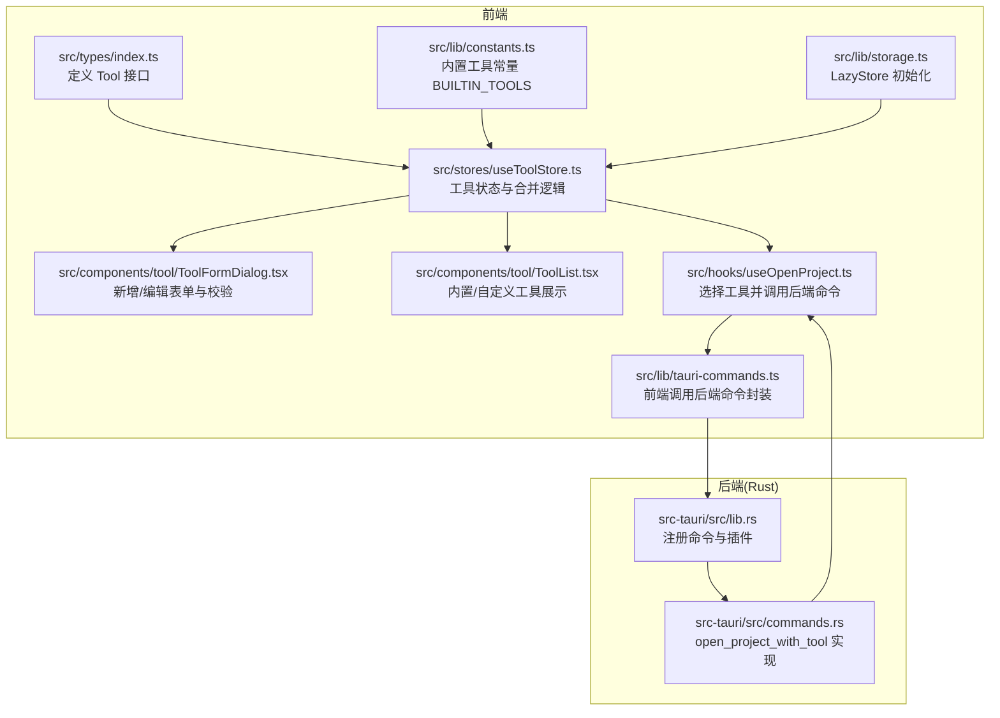
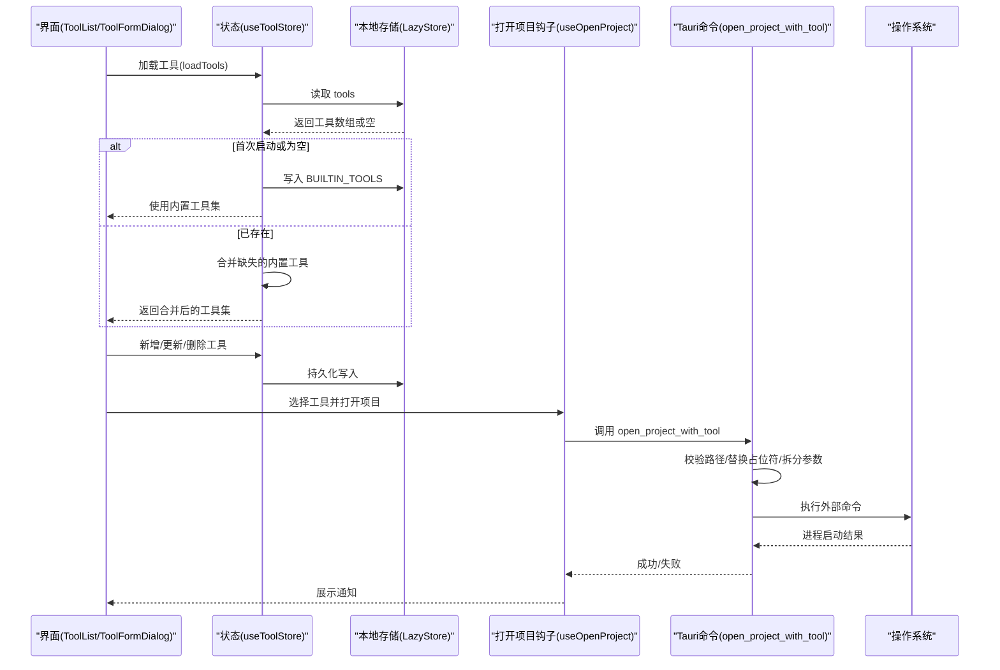
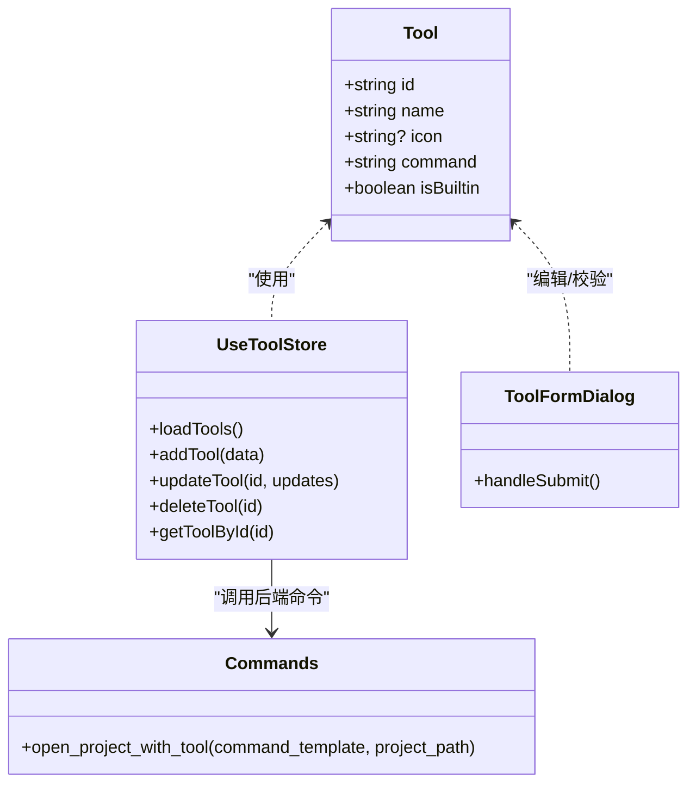

# 工具数据模型

<cite>
**本文引用的文件**
- [src/types/index.ts](file://src/types/index.ts)
- [src/lib/constants.ts](file://src/lib/constants.ts)
- [src/lib/storage.ts](file://src/lib/storage.ts)
- [src/stores/useToolStore.ts](file://src/stores/useToolStore.ts)
- [src/components/tool/ToolFormDialog.tsx](file://src/components/tool/ToolFormDialog.tsx)
- [src/components/tool/ToolList.tsx](file://src/components/tool/ToolList.tsx)
- [src/lib/tauri-commands.ts](file://src/lib/tauri-commands.ts)
- [src/hooks/useOpenProject.ts](file://src/hooks/useOpenProject.ts)
- [src-tauri/src/lib.rs](file://src-tauri/src/lib.rs)
- [src-tauri/src/commands.rs](file://src-tauri/src/commands.rs)
</cite>

## 目录
1. [简介](#简介)
2. [项目结构](#项目结构)
3. [核心组件](#核心组件)
4. [架构总览](#架构总览)
5. [详细组件分析](#详细组件分析)
6. [依赖关系分析](#依赖关系分析)
7. [性能考量](#性能考量)
8. [故障排查指南](#故障排查指南)
9. [结论](#结论)
10. [附录](#附录)

## 简介
本文件系统性地文档化“工具数据模型”，围绕前端 TypeScript 类型定义、内置工具常量、状态存储与合并策略、表单校验、以及后端命令执行与安全边界进行深入说明。重点覆盖以下主题：
- Tool 接口字段语义与约束
- 内置工具常量 BUILTIN_TOOLS 的配置格式与默认值
- 工具配置的序列化与反序列化（本地持久化）
- 工具生命周期管理与版本兼容处理
- 安全最佳实践（命令注入防护、路径验证）

## 项目结构
工具数据模型涉及前端类型、常量、存储、状态管理、表单校验、以及后端命令执行等模块。下图展示与工具数据模型直接相关的文件与交互关系。

图表来源
- [src/types/index.ts:12-18](file://src/types/index.ts#L12-L18)
- [src/lib/constants.ts:3-18](file://src/lib/constants.ts#L3-L18)
- [src/lib/storage.ts:9-12](file://src/lib/storage.ts#L9-L12)
- [src/stores/useToolStore.ts:17-74](file://src/stores/useToolStore.ts#L17-L74)
- [src/components/tool/ToolFormDialog.tsx:44-78](file://src/components/tool/ToolFormDialog.tsx#L44-L78)
- [src/components/tool/ToolList.tsx:12-79](file://src/components/tool/ToolList.tsx#L12-L79)
- [src/hooks/useOpenProject.ts:15-42](file://src/hooks/useOpenProject.ts#L15-L42)
- [src/lib/tauri-commands.ts:3-8](file://src/lib/tauri-commands.ts#L3-L8)
- [src-tauri/src/lib.rs:6-18](file://src-tauri/src/lib.rs#L6-L18)
- [src-tauri/src/commands.rs:49-79](file://src-tauri/src/commands.rs#L49-L79)

章节来源
- [src/types/index.ts:12-18](file://src/types/index.ts#L12-L18)
- [src/lib/constants.ts:3-18](file://src/lib/constants.ts#L3-L18)
- [src/lib/storage.ts:9-12](file://src/lib/storage.ts#L9-L12)
- [src/stores/useToolStore.ts:17-74](file://src/stores/useToolStore.ts#L17-L74)
- [src/components/tool/ToolFormDialog.tsx:44-78](file://src/components/tool/ToolFormDialog.tsx#L44-L78)
- [src/components/tool/ToolList.tsx:12-79](file://src/components/tool/ToolList.tsx#L12-L79)
- [src/hooks/useOpenProject.ts:15-42](file://src/hooks/useOpenProject.ts#L15-L42)
- [src/lib/tauri-commands.ts:3-8](file://src/lib/tauri-commands.ts#L3-L8)
- [src-tauri/src/lib.rs:6-18](file://src-tauri/src/lib.rs#L6-L18)
- [src-tauri/src/commands.rs:49-79](file://src-tauri/src/commands.rs#L49-L79)

## 核心组件
- Tool 接口：定义工具的标识、名称、图标、命令模板与内置标记。
- BUILTIN_TOOLS 常量：内置工具集合，作为首次初始化与后续合并的基础。
- LazyStore：基于 tauri-plugin-store 的本地存储，负责工具配置的序列化与反序列化。
- useToolStore：Zustand 状态管理，负责加载、合并、增删改查工具，并持久化到存储。
- ToolFormDialog：表单校验与提交，确保命令模板包含占位符且名称非空。
- 后端命令 open_project_with_tool：解析命令模板、校验路径、拼接参数并执行外部进程。

章节来源
- [src/types/index.ts:12-18](file://src/types/index.ts#L12-L18)
- [src/lib/constants.ts:3-18](file://src/lib/constants.ts#L3-L18)
- [src/lib/storage.ts:9-12](file://src/lib/storage.ts#L9-L12)
- [src/stores/useToolStore.ts:17-74](file://src/stores/useToolStore.ts#L17-L74)
- [src/components/tool/ToolFormDialog.tsx:44-78](file://src/components/tool/ToolFormDialog.tsx#L44-L78)
- [src-tauri/src/commands.rs:49-79](file://src-tauri/src/commands.rs#L49-L79)

## 架构总览
工具数据从“内置预设”到“用户自定义”的完整生命周期如下：

图表来源
- [src/stores/useToolStore.ts:21-38](file://src/stores/useToolStore.ts#L21-L38)
- [src/lib/storage.ts:9-12](file://src/lib/storage.ts#L9-L12)
- [src/lib/constants.ts:3-18](file://src/lib/constants.ts#L3-L18)
- [src/components/tool/ToolFormDialog.tsx:44-78](file://src/components/tool/ToolFormDialog.tsx#L44-L78)
- [src/hooks/useOpenProject.ts:15-42](file://src/hooks/useOpenProject.ts#L15-L42)
- [src/lib/tauri-commands.ts:3-8](file://src/lib/tauri-commands.ts#L3-L8)
- [src-tauri/src/commands.rs:49-79](file://src-tauri/src/commands.rs#L49-L79)

## 详细组件分析

### Tool 接口与字段约束
- 字段定义与职责
  - id: 工具唯一标识，用于状态匹配与持久化键值。
  - name: 工具显示名称，必填且不能为空字符串。
  - icon: 可选图标文本，长度限制为 1-2 个字符；若未提供则回退为首字母大写。
  - command: 命令模板，必须包含占位符 {path}，用于替换为项目路径。
  - isBuiltin: 布尔标记，指示是否为内置工具；内置工具不可被删除。

- 约束与默认行为
  - 表单校验在前端完成：名称非空、命令模板非空、必须包含 {path} 占位符。
  - 图标未提供时，自动使用名称首字母大写作为默认图标。
  - 删除操作对内置工具无效，防止误删。

章节来源
- [src/types/index.ts:12-18](file://src/types/index.ts#L12-L18)
- [src/components/tool/ToolFormDialog.tsx:44-78](file://src/components/tool/ToolFormDialog.tsx#L44-L78)
- [src/stores/useToolStore.ts:62-69](file://src/stores/useToolStore.ts#L62-L69)

### 内置工具常量 BUILTIN_TOOLS
- 配置格式
  - 数组元素为 Tool 对象，包含 id、name、command、icon、isBuiltin。
  - isBuiltin 固定为 true，便于状态层识别与过滤。
- 默认值
  - 首次启动或存储为空时，使用 BUILTIN_TOOLS 初始化本地存储。
  - 后续每次加载会检查缺失的内置工具并进行合并，保证内置工具始终存在。

章节来源
- [src/lib/constants.ts:3-18](file://src/lib/constants.ts#L3-L18)
- [src/lib/storage.ts:9-12](file://src/lib/storage.ts#L9-L12)
- [src/stores/useToolStore.ts:21-38](file://src/stores/useToolStore.ts#L21-L38)

### 工具类型与验证规则
- 类型层面
  - Tool 接口由 TypeScript 强类型约束，确保字段存在与类型正确。
- 前端表单验证
  - 名称非空校验。
  - 命令模板非空校验。
  - 必须包含 {path} 占位符校验。
  - 图标长度限制为 1-2 字符。
- 后端执行前验证
  - 路径存在性与目录合法性校验。
  - 命令模板替换 {path} 后拆分为程序名与参数列表。
  - 若拆分为空或仅含空白，返回错误。

章节来源
- [src/components/tool/ToolFormDialog.tsx:44-78](file://src/components/tool/ToolFormDialog.tsx#L44-L78)
- [src-tauri/src/commands.rs:49-79](file://src-tauri/src/commands.rs#L49-L79)

### 序列化与反序列化
- 存储介质
  - 使用 LazyStore 将工具数组序列化为 JSON 并保存至 tools.json。
- 初始化策略
  - 首次启动或存储为空时，写入 BUILTIN_TOOLS。
- 合并策略
  - 加载已有工具后，若发现缺失的内置工具 ID，则追加这些内置项，保留用户自定义项不变。
- 写入时机
  - 新增、更新、删除工具均会同步写回存储，确保一致性。

章节来源
- [src/lib/storage.ts:9-12](file://src/lib/storage.ts#L9-L12)
- [src/stores/useToolStore.ts:21-38](file://src/stores/useToolStore.ts#L21-L38)
- [src/stores/useToolStore.ts:41-69](file://src/stores/useToolStore.ts#L41-L69)

### 工具生命周期管理
- 加载阶段
  - 从存储读取工具数组；若为空则初始化为 BUILTIN_TOOLS。
  - 合并缺失的内置工具，保证内置项始终存在。
- 编辑阶段
  - 新增：生成新 id，设置 isBuiltin=false，写入存储。
  - 更新：按 id 匹配更新，写入存储。
  - 删除：禁止删除 isBuiltin=true 的内置工具。
- 使用阶段
  - 通过 useOpenProject 钩子解析工具与项目路径，调用后端命令执行。

章节来源
- [src/stores/useToolStore.ts:21-38](file://src/stores/useToolStore.ts#L21-L38)
- [src/stores/useToolStore.ts:41-69](file://src/stores/useToolStore.ts#L41-L69)
- [src/hooks/useOpenProject.ts:15-42](file://src/hooks/useOpenProject.ts#L15-L42)

### 版本兼容性处理
- 向后兼容策略
  - 合并缺失的内置工具：当用户升级应用后，若存储中缺少某些内置工具，系统会自动补全，避免功能缺失。
- 数据迁移建议
  - 若未来引入新的内置工具字段，可在合并逻辑中提供默认值，保持旧配置可用。
  - 对于字段变更，可通过版本号或迁移脚本在加载时进行转换。

章节来源
- [src/stores/useToolStore.ts:21-38](file://src/stores/useToolStore.ts#L21-L38)

### 安全考虑与最佳实践
- 命令注入防护
  - 前端强制要求命令模板包含 {path} 占位符，避免直接拼接用户输入导致的注入风险。
  - 后端将命令拆分为程序名与参数列表，避免整串命令字符串执行带来的注入风险。
- 路径验证
  - 后端在执行前校验路径是否存在且为目录，防止传入非法路径导致的异常。
- 权限与能力
  - 后端通过 Tauri 插件启用 shell 能力，但仅暴露必要的命令（spawn、stdin_write 等），避免过度授权。
- 最佳实践
  - 始终使用 {path} 占位符，不要硬编码绝对路径。
  - 自定义工具尽量使用可执行程序的短命令名（例如 code、cursor），以便跨平台兼容。
  - 不要允许用户直接编辑 isBuiltin 字段，该字段应由系统控制。

章节来源
- [src/components/tool/ToolFormDialog.tsx:44-78](file://src/components/tool/ToolFormDialog.tsx#L44-L78)
- [src-tauri/src/commands.rs:49-79](file://src-tauri/src/commands.rs#L49-L79)
- [src-tauri/src/lib.rs:6-18](file://src-tauri/src/lib.rs#L6-L18)

## 依赖关系分析
- 类型依赖
  - Tool 接口被 useToolStore、ToolFormDialog、ToolList 等组件引用。
- 常量依赖
  - BUILTIN_TOOLS 被 useToolStore 用于初始化与合并。
- 存储依赖
  - LazyStore 提供 tools.json 的读写能力，useToolStore 通过 getToolsStore 访问。
- 前后端通信
  - 前端通过 tauri-commands.ts 调用后端 open_project_with_tool，后端在 lib.rs 中注册命令并在 commands.rs 中实现。

图表来源
- [src/types/index.ts:12-18](file://src/types/index.ts#L12-L18)
- [src/stores/useToolStore.ts:17-74](file://src/stores/useToolStore.ts#L17-L74)
- [src/components/tool/ToolFormDialog.tsx:44-78](file://src/components/tool/ToolFormDialog.tsx#L44-L78)
- [src-tauri/src/commands.rs:49-79](file://src-tauri/src/commands.rs#L49-L79)

章节来源
- [src/types/index.ts:12-18](file://src/types/index.ts#L12-L18)
- [src/stores/useToolStore.ts:17-74](file://src/stores/useToolStore.ts#L17-L74)
- [src/components/tool/ToolFormDialog.tsx:44-78](file://src/components/tool/ToolFormDialog.tsx#L44-L78)
- [src-tauri/src/commands.rs:49-79](file://src-tauri/src/commands.rs#L49-L79)

## 性能考量
- 状态与存储分离
  - 使用 LazyStore 自动保存，减少手动写入开销。
- 合并策略
  - 合并内置工具时仅做一次遍历，复杂度为 O(n)，对小规模工具集影响可忽略。
- 前端渲染
  - 工具列表按 isBuiltin 分组渲染，避免不必要的重排。
- 后端执行
  - 命令拆分与 PATH 注入在后台线程执行，避免阻塞 UI。

[本节为通用性能讨论，不直接分析具体文件]

## 故障排查指南
- 常见问题与定位
  - 工具无法打开：检查命令模板是否包含 {path}，确认 isBuiltin 字段未被修改。
  - 路径不存在：后端会返回“路径不存在/不是目录”的错误，请确认项目路径有效。
  - 自定义工具被删除：内置工具不可删除，若误删请重新初始化或从存储中恢复。
- 日志与提示
  - 前端使用通知组件展示成功/失败消息，便于快速定位问题。
  - 后端命令执行失败会返回错误信息，前端统一捕获并提示。

章节来源
- [src/components/tool/ToolFormDialog.tsx:44-78](file://src/components/tool/ToolFormDialog.tsx#L44-L78)
- [src-tauri/src/commands.rs:49-79](file://src-tauri/src/commands.rs#L49-L79)
- [src/stores/useToolStore.ts:62-69](file://src/stores/useToolStore.ts#L62-L69)

## 结论
工具数据模型通过强类型接口、内置常量、状态合并与严格的前后端校验，实现了稳定、可扩展且安全的工具配置体系。内置工具与用户自定义工具共存，既保证了开箱即用，又提供了灵活的定制能力。配合合理的序列化与权限控制，整体具备良好的可维护性与安全性。

[本节为总结性内容，不直接分析具体文件]

## 附录

### 工具配置字段说明
- id: 唯一标识，用于状态匹配与持久化。
- name: 显示名称，必填。
- icon: 图标文本，长度 1-2；未提供时回退为首字母大写。
- command: 命令模板，必须包含 {path} 占位符。
- isBuiltin: 是否为内置工具，内置工具不可删除。

章节来源
- [src/types/index.ts:12-18](file://src/types/index.ts#L12-L18)
- [src/components/tool/ToolFormDialog.tsx:44-78](file://src/components/tool/ToolFormDialog.tsx#L44-L78)

### 内置工具清单（节选）
- Qoder、Cursor、VS Code、Kiro、CodeBuddy、Trae、Terminal、Finder、OpenCode、Claude Code、Gemini CLI、Codex、Antigravity、Kimi CLI。
- 每个内置工具的 isBuiltin 固定为 true，command 中包含 {path} 占位符。

章节来源
- [src/lib/constants.ts:3-18](file://src/lib/constants.ts#L3-L18)