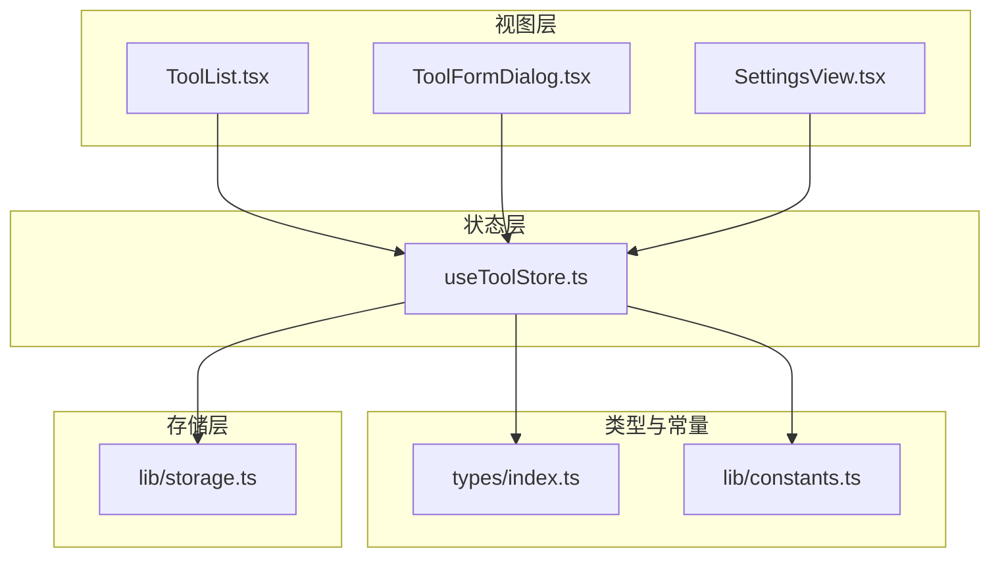
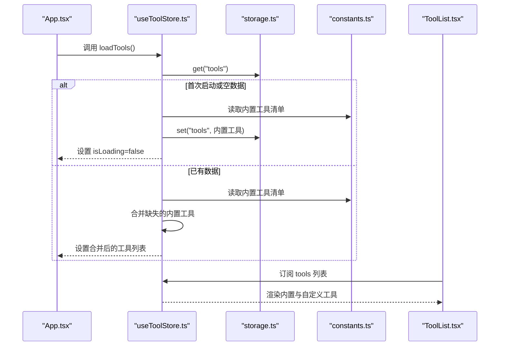
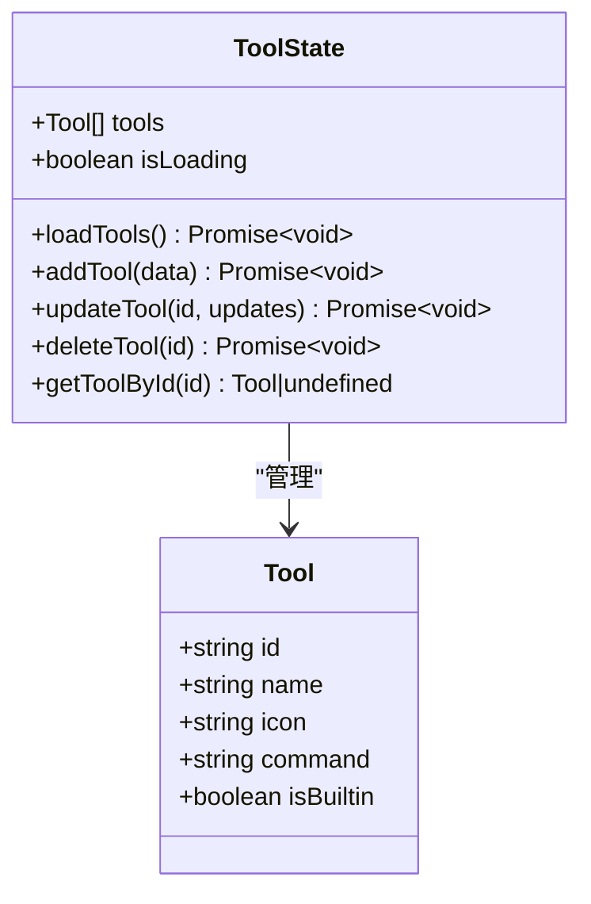
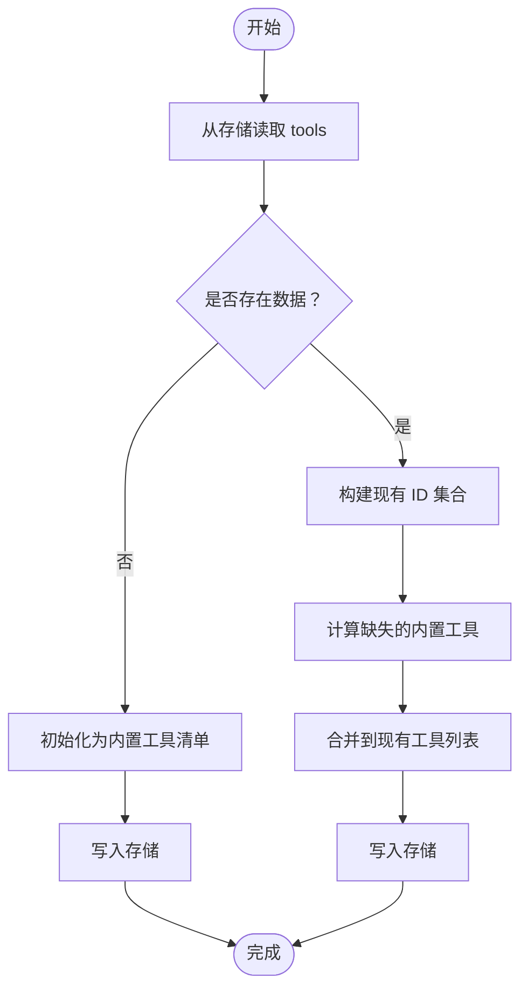
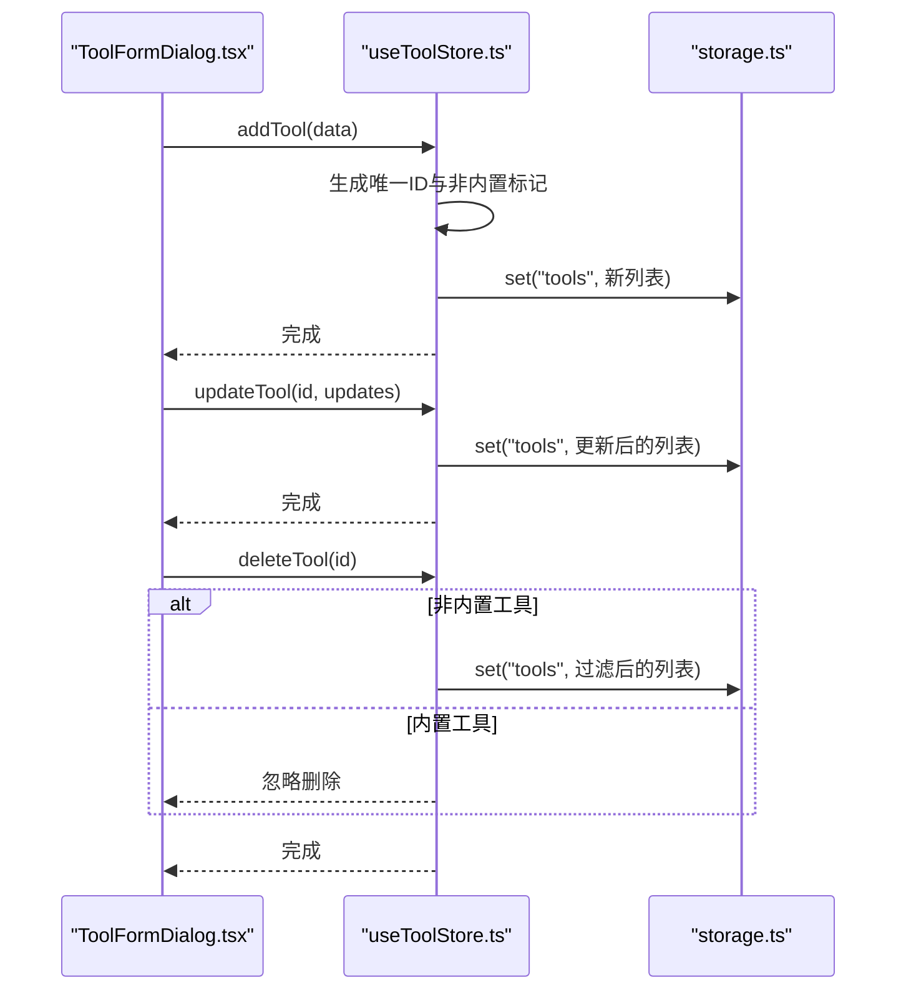
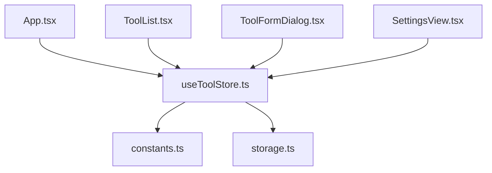

# 工具状态管理

<cite>
**本文引用的文件**
- [useToolStore.ts](file://src/stores/useToolStore.ts)
- [storage.ts](file://src/lib/storage.ts)
- [constants.ts](file://src/lib/constants.ts)
- [index.ts](file://src/types/index.ts)
- [ToolList.tsx](file://src/components/tool/ToolList.tsx)
- [ToolFormDialog.tsx](file://src/components/tool/ToolFormDialog.tsx)
- [App.tsx](file://src/App.tsx)
- [MainLayout.tsx](file://src/components/layout/MainLayout.tsx)
- [SettingsView.tsx](file://src/components/settings/SettingsView.tsx)
</cite>

## 目录
1. [简介](#简介)
2. [项目结构](#项目结构)
3. [核心组件](#核心组件)
4. [架构总览](#架构总览)
5. [详细组件分析](#详细组件分析)
6. [依赖关系分析](#依赖关系分析)
7. [性能考虑](#性能考虑)
8. [故障排查指南](#故障排查指南)
9. [结论](#结论)
10. [附录](#附录)

## 简介
本文件系统性阐述工具状态管理的设计与实现，围绕 Zustand store 的设计模式、状态结构、异步操作流程、工具合并逻辑、状态持久化与本地存储交互、错误处理与加载状态管理、工具获取与查询方法，以及最佳实践与性能优化建议展开。目标是帮助开发者快速理解并高效维护工具状态管理模块。

## 项目结构
工具状态管理位于前端 Zustand store 层，配合类型定义、常量与 UI 组件协同工作：
- 状态层：Zustand store 定义工具状态与操作
- 类型层：统一的工具数据模型
- 常量层：内置工具清单
- 存储层：基于 Tauri Store 的懒加载持久化
- 视图层：工具列表、表单对话框等 UI 组件

图表来源
- [useToolStore.ts:1-75](file://src/stores/useToolStore.ts#L1-L75)
- [storage.ts:1-30](file://src/lib/storage.ts#L1-L30)
- [constants.ts:1-23](file://src/lib/constants.ts#L1-L23)
- [index.ts:12-18](file://src/types/index.ts#L12-L18)
- [ToolList.tsx:1-129](file://src/components/tool/ToolList.tsx#L1-L129)
- [ToolFormDialog.tsx:1-134](file://src/components/tool/ToolFormDialog.tsx#L1-L134)
- [SettingsView.tsx:1-111](file://src/components/settings/SettingsView.tsx#L1-L111)

章节来源
- [useToolStore.ts:1-75](file://src/stores/useToolStore.ts#L1-L75)
- [storage.ts:1-30](file://src/lib/storage.ts#L1-L30)
- [constants.ts:1-23](file://src/lib/constants.ts#L1-L23)
- [index.ts:12-18](file://src/types/index.ts#L12-L18)
- [ToolList.tsx:1-129](file://src/components/tool/ToolList.tsx#L1-L129)
- [ToolFormDialog.tsx:1-134](file://src/components/tool/ToolFormDialog.tsx#L1-L134)
- [SettingsView.tsx:1-111](file://src/components/settings/SettingsView.tsx#L1-L111)

## 核心组件
- Zustand 工具 store：集中管理工具列表、加载状态与 CRUD 操作，并提供工具查询方法
- 类型定义：统一的工具接口，包含标识、名称、图标、命令模板与是否内置标记
- 内置工具常量：预置一组常用工具，作为默认初始化与合并的基础
- 存储封装：基于 Tauri LazyStore 的懒加载持久化，自动保存工具数据
- UI 组件：工具列表展示、表单对话框增改工具、设置页选择默认工具

章节来源
- [useToolStore.ts:7-15](file://src/stores/useToolStore.ts#L7-L15)
- [index.ts:12-18](file://src/types/index.ts#L12-L18)
- [constants.ts:3-18](file://src/lib/constants.ts#L3-L18)
- [storage.ts:9-12](file://src/lib/storage.ts#L9-L12)
- [ToolList.tsx:12-81](file://src/components/tool/ToolList.tsx#L12-L81)
- [ToolFormDialog.tsx:21-78](file://src/components/tool/ToolFormDialog.tsx#L21-L78)
- [SettingsView.tsx:19-89](file://src/components/settings/SettingsView.tsx#L19-L89)

## 架构总览
Zustand store 通过异步加载与持久化，确保工具数据在应用启动时可用；UI 组件通过 store 订阅状态变化，实现响应式渲染；内置工具与用户自定义工具在合并后共同呈现。

图表来源
- [App.tsx:21-30](file://src/App.tsx#L21-L30)
- [useToolStore.ts:21-39](file://src/stores/useToolStore.ts#L21-L39)
- [storage.ts:23-25](file://src/lib/storage.ts#L23-L25)
- [constants.ts:3-18](file://src/lib/constants.ts#L3-L18)
- [ToolList.tsx:12-81](file://src/components/tool/ToolList.tsx#L12-L81)

## 详细组件分析

### Zustand 工具 store 设计与状态结构
- 状态字段
  - tools：工具数组，包含内置与自定义工具
  - isLoading：加载状态，用于控制首次渲染与加载指示
- 异步操作
  - loadTools：从持久化存储读取工具列表，若为空则初始化内置工具；否则进行“缺失内置工具”的合并，保证内置工具始终存在且不重复
  - addTool：生成唯一 ID 与非内置标记，追加到列表并持久化
  - updateTool：按 ID 映射更新，保持其他字段不变，随后持久化
  - deleteTool：仅允许删除非内置工具，过滤后持久化
  - getToolById：按 ID 查询工具
- 错误处理
  - loadTools 在异常情况下回退到内置工具并停止加载错误
  - 其他操作未显式捕获异常，但 UI 层使用通知组件提示错误

图表来源
- [useToolStore.ts:7-15](file://src/stores/useToolStore.ts#L7-L15)
- [index.ts:12-18](file://src/types/index.ts#L12-L18)

章节来源
- [useToolStore.ts:7-15](file://src/stores/useToolStore.ts#L7-L15)
- [index.ts:12-18](file://src/types/index.ts#L12-L18)

### 工具加载与合并逻辑
- 加载流程
  - 从存储读取工具列表
  - 若列表为空：初始化为内置工具清单，并写入存储
  - 若列表存在：计算现有 ID 集合，筛选缺失的内置工具并合并，避免重复
- 合并策略
  - 以“内置工具 ID”为键，确保所有内置工具都存在
  - 用户自定义工具保留原样，避免覆盖
  - 通过集合查找与数组拼接实现高效合并
- 异常回退
  - 任何读取异常均回退到内置工具，保证应用可用性

图表来源
- [useToolStore.ts:21-39](file://src/stores/useToolStore.ts#L21-L39)
- [constants.ts:3-18](file://src/lib/constants.ts#L3-L18)
- [storage.ts:23-25](file://src/lib/storage.ts#L23-L25)

章节来源
- [useToolStore.ts:21-39](file://src/stores/useToolStore.ts#L21-L39)
- [constants.ts:3-18](file://src/lib/constants.ts#L3-L18)

### 工具增删改查与 UI 协同
- 新增工具
  - 表单校验：名称与命令模板必填，命令必须包含路径占位符
  - 添加后持久化并提示成功
- 更新工具
  - 编辑模式下按 ID 更新名称、命令与图标
  - 更新后持久化并提示成功
- 删除工具
  - 仅允许删除非内置工具
  - 删除后持久化并提示成功
- 查询工具
  - 提供按 ID 查询方法，供设置页选择默认工具使用

图表来源
- [ToolFormDialog.tsx:44-78](file://src/components/tool/ToolFormDialog.tsx#L44-L78)
- [useToolStore.ts:41-69](file://src/stores/useToolStore.ts#L41-L69)
- [storage.ts:23-25](file://src/lib/storage.ts#L23-L25)

章节来源
- [ToolFormDialog.tsx:21-78](file://src/components/tool/ToolFormDialog.tsx#L21-L78)
- [useToolStore.ts:41-69](file://src/stores/useToolStore.ts#L41-L69)

### 状态持久化与本地存储交互
- 存储封装
  - 使用 LazyStore 对工具数据进行懒加载与自动保存
  - 默认值为内置工具清单，确保首次启动即有数据
- 读写策略
  - 读取：直接从存储获取工具数组
  - 写入：每次变更后立即持久化，保证数据一致性
- 数据模型
  - 工具数组直接存储，无需额外序列化/反序列化

图表来源
- [storage.ts:9-12](file://src/lib/storage.ts#L9-L12)
- [storage.ts:23-25](file://src/lib/storage.ts#L23-L25)
- [useToolStore.ts:24-50](file://src/stores/useToolStore.ts#L24-L50)

章节来源
- [storage.ts:9-12](file://src/lib/storage.ts#L9-L12)
- [storage.ts:23-25](file://src/lib/storage.ts#L23-L25)
- [useToolStore.ts:24-50](file://src/stores/useToolStore.ts#L24-L50)

### 错误处理策略与加载状态管理
- 加载阶段
  - isLoading 初始化为 true，加载完成后置为 false
  - loadTools 在异常时回退到内置工具，避免 UI 长时间处于加载态
- 操作阶段
  - UI 层通过通知组件反馈错误信息
  - 删除内置工具被静默忽略，防止破坏系统默认行为
- 建议
  - 可在 store 中增加更细粒度的错误状态字段，便于 UI 展示具体错误原因

章节来源
- [useToolStore.ts:18-19](file://src/stores/useToolStore.ts#L18-L19)
- [useToolStore.ts:36-38](file://src/stores/useToolStore.ts#L36-L38)
- [ToolFormDialog.tsx:75-77](file://src/components/tool/ToolFormDialog.tsx#L75-L77)

### 工具获取与查询方法
- getToolById：按 ID 查找工具，用于设置页选择默认工具
- UI 协同：设置页通过订阅 store 获取工具列表，动态渲染可选项

章节来源
- [useToolStore.ts:71-73](file://src/stores/useToolStore.ts#L71-L73)
- [SettingsView.tsx:71-88](file://src/components/settings/SettingsView.tsx#L71-L88)

## 依赖关系分析
- 组件依赖
  - ToolList 依赖 useToolStore 的 tools 与 deleteTool
  - ToolFormDialog 依赖 useToolStore 的 addTool 与 updateTool
  - SettingsView 依赖 useToolStore 的 tools 与 getToolById
- 状态依赖
  - useToolStore 依赖 constants 的内置工具清单与 storage 的 LazyStore
- 应用入口
  - App 在挂载时调用 loadTools，确保工具数据在 UI 渲染前就绪

图表来源
- [App.tsx:21-30](file://src/App.tsx#L21-L30)
- [ToolList.tsx:12-14](file://src/components/tool/ToolList.tsx#L12-L14)
- [ToolFormDialog.tsx:22-23](file://src/components/tool/ToolFormDialog.tsx#L22-L23)
- [SettingsView.tsx:21-23](file://src/components/settings/SettingsView.tsx#L21-L23)
- [useToolStore.ts:3-4](file://src/stores/useToolStore.ts#L3-L4)
- [storage.ts:23-25](file://src/lib/storage.ts#L23-L25)
- [constants.ts:3-18](file://src/lib/constants.ts#L3-L18)

章节来源
- [App.tsx:21-30](file://src/App.tsx#L21-L30)
- [ToolList.tsx:12-14](file://src/components/tool/ToolList.tsx#L12-L14)
- [ToolFormDialog.tsx:22-23](file://src/components/tool/ToolFormDialog.tsx#L22-L23)
- [SettingsView.tsx:21-23](file://src/components/settings/SettingsView.tsx#L21-L23)
- [useToolStore.ts:3-4](file://src/stores/useToolStore.ts#L3-L4)
- [storage.ts:23-25](file://src/lib/storage.ts#L23-L25)
- [constants.ts:3-18](file://src/lib/constants.ts#L3-L18)

## 性能考虑
- 合并算法复杂度
  - 构建现有 ID 集合：O(n)
  - 计算缺失内置工具：O(m)，m 为内置工具数量
  - 合并数组：O(n+m)
  - 整体：O(n+m)，适合中等规模工具集
- 持久化策略
  - LazyStore 自动保存，减少手动调用开销
  - 建议在高频变更场景下考虑批量写入或节流
- UI 渲染
  - 通过分组渲染内置与自定义工具，降低列表重排成本
  - 建议在工具数量较多时引入虚拟滚动

[本节为通用性能讨论，不直接分析具体文件]

## 故障排查指南
- 工具列表为空
  - 检查存储初始化是否成功，确认 LazyStore 默认值是否生效
  - 确认 loadTools 是否被正确调用
- 合并后缺少内置工具
  - 检查内置工具 ID 是否与存储中的 ID 匹配
  - 确认合并逻辑未被意外覆盖
- 删除失败
  - 确认删除对象 isBuiltin 标记是否为 true
  - 检查 UI 传参是否正确
- 命令模板无效
  - 确保命令包含路径占位符
  - 检查表单校验逻辑

章节来源
- [useToolStore.ts:36-38](file://src/stores/useToolStore.ts#L36-L38)
- [useToolStore.ts:62-69](file://src/stores/useToolStore.ts#L62-L69)
- [ToolFormDialog.tsx:44-56](file://src/components/tool/ToolFormDialog.tsx#L44-L56)

## 结论
该工具状态管理模块采用简洁高效的 Zustand 设计，结合 LazyStore 实现可靠持久化。通过内置工具与用户自定义工具的智能合并，既保证功能完整性又尊重用户偏好。建议在后续迭代中增强错误状态细化与批量写入优化，进一步提升稳定性与性能。

[本节为总结性内容，不直接分析具体文件]

## 附录
- 最佳实践
  - 在 store 中增加错误状态字段，便于 UI 展示
  - 对高频变更操作进行节流或批处理
  - 在工具数量较大时引入虚拟滚动
- 性能优化建议
  - 合并算法已具备线性复杂度，可继续优化为哈希查找
  - LazyStore 已自动保存，可减少手动调用
  - UI 渲染层面引入分页或虚拟列表

[本节为通用建议，不直接分析具体文件]