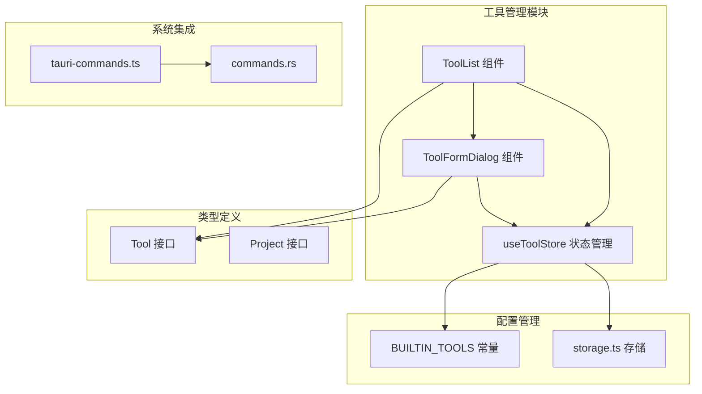
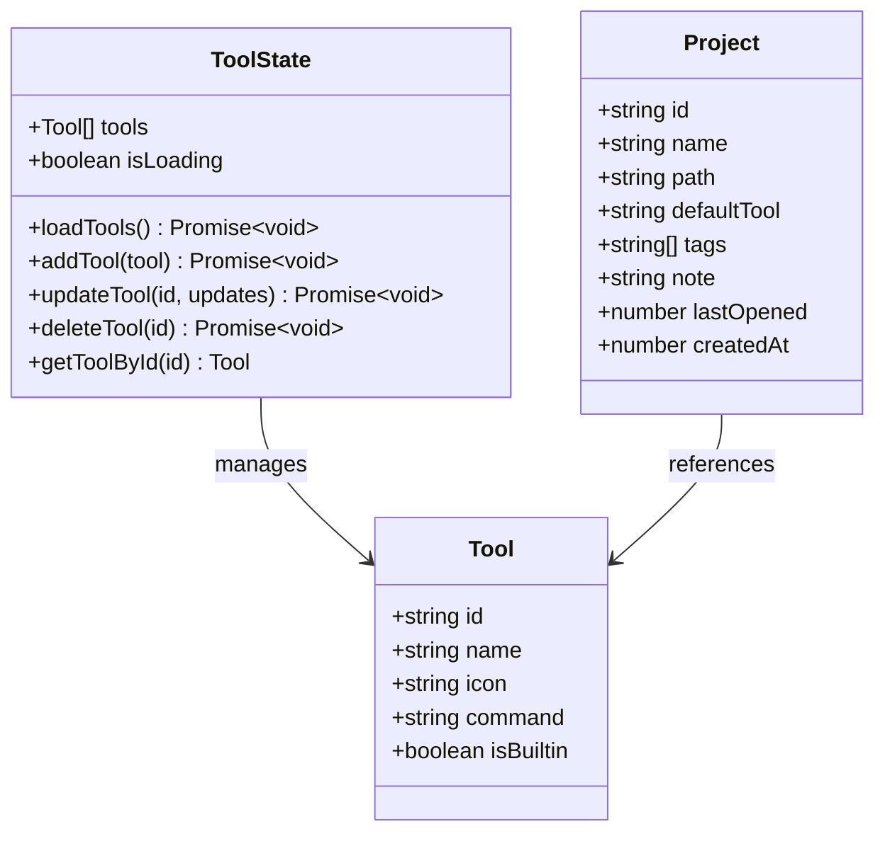
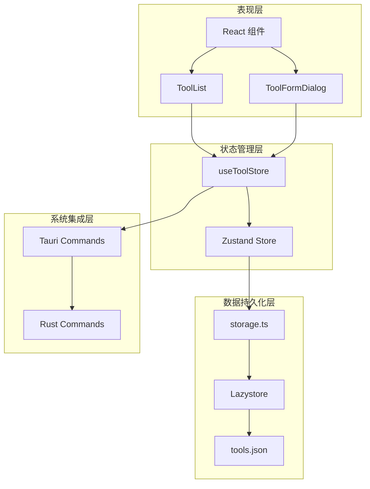
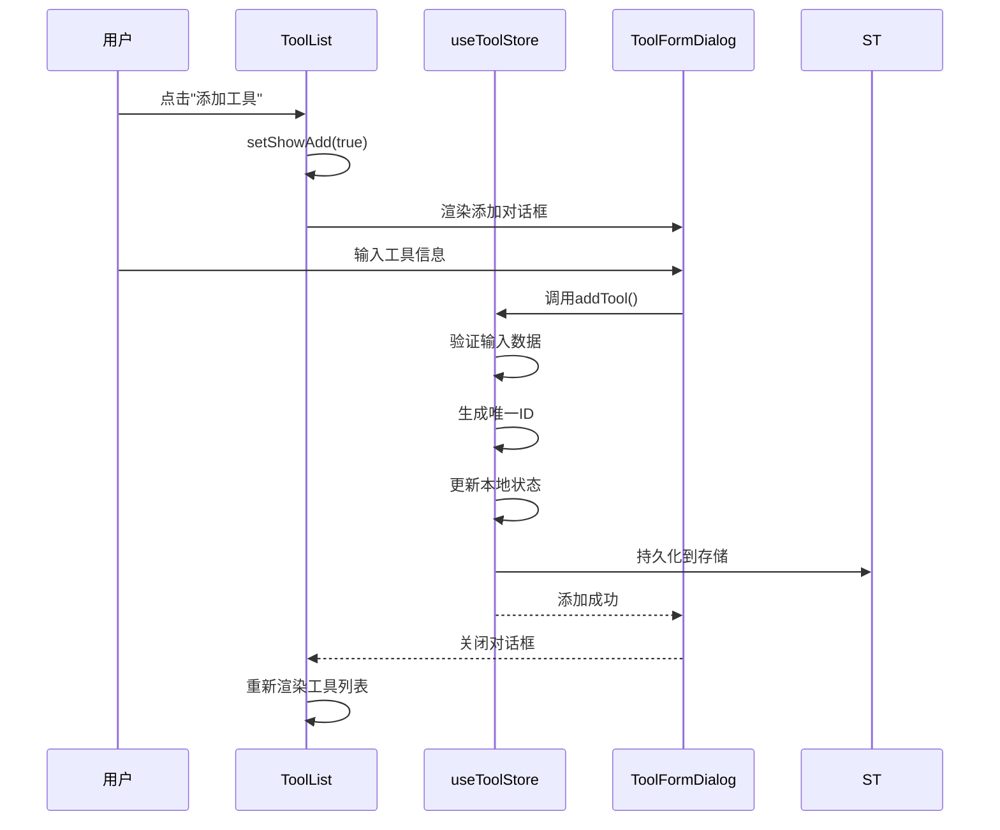
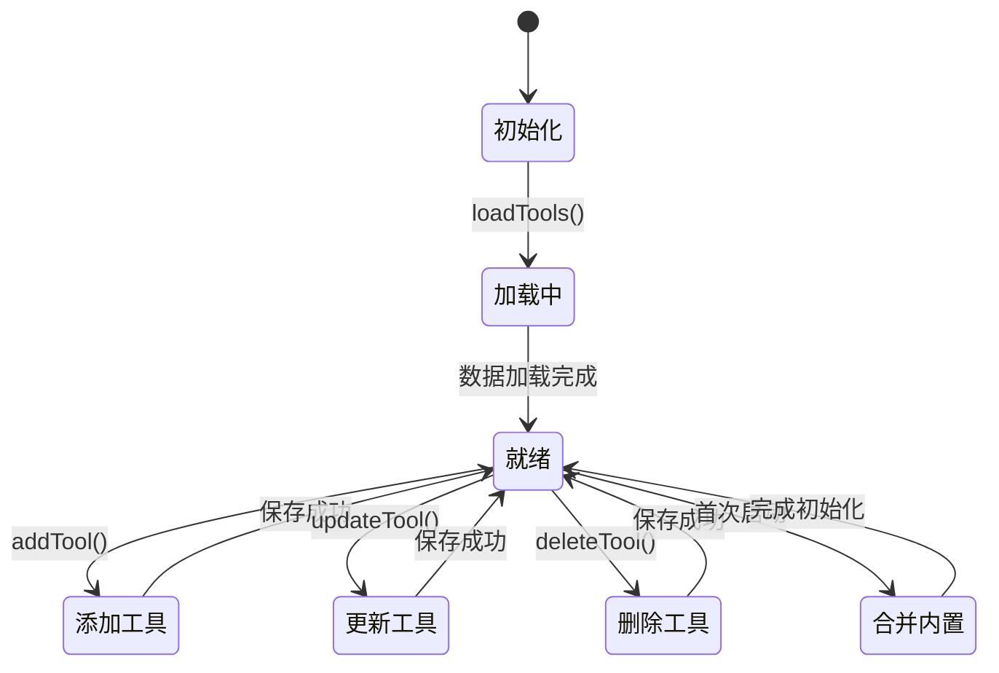
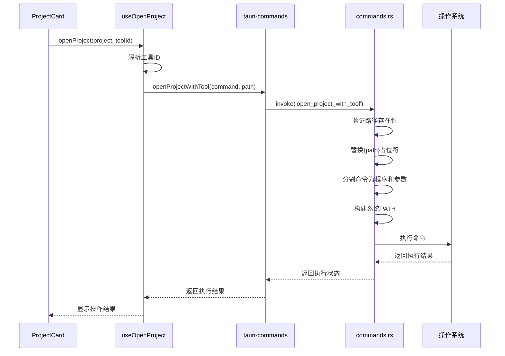
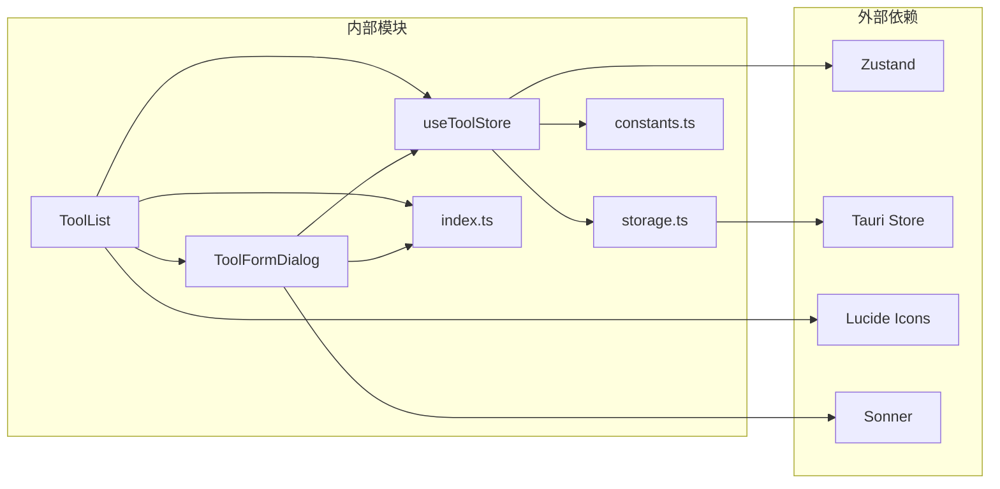
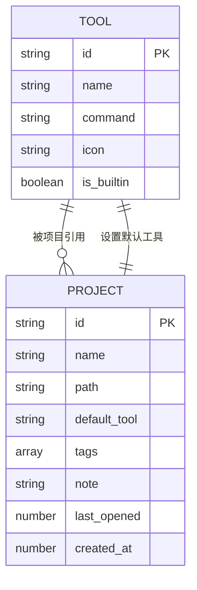

# 工具管理模块

<cite>
**本文档引用的文件**
- [src/components/tool/ToolList.tsx](file://src/components/tool/ToolList.tsx)
- [src/components/tool/ToolFormDialog.tsx](file://src/components/tool/ToolFormDialog.tsx)
- [src/stores/useToolStore.ts](file://src/stores/useToolStore.ts)
- [src/types/index.ts](file://src/types/index.ts)
- [src/lib/constants.ts](file://src/lib/constants.ts)
- [src/lib/storage.ts](file://src/lib/storage.ts)
- [src/lib/tauri-commands.ts](file://src/lib/tauri-commands.ts)
- [src-tauri/src/commands.rs](file://src-tauri/src/commands.rs)
- [src/hooks/useOpenProject.ts](file://src/hooks/useOpenProject.ts)
- [src/components/project/ProjectCard.tsx](file://src/components/project/ProjectCard.tsx)
- [src/components/project/ProjectList.tsx](file://src/components/project/ProjectList.tsx)
</cite>

## 目录
1. [简介](#简介)
2. [项目结构](#项目结构)
3. [核心组件](#核心组件)
4. [架构概览](#架构概览)
5. [详细组件分析](#详细组件分析)
6. [依赖分析](#依赖分析)
7. [性能考虑](#性能考虑)
8. [故障排除指南](#故障排除指南)
9. [结论](#结论)
10. [附录](#附录)

## 简介

工具管理模块是项目管理应用中的核心功能组件，负责管理开发工具的配置和使用。该模块提供了完整的工具生命周期管理，包括内置工具集配置、自定义工具添加、编辑、删除和启用禁用操作。

本模块采用分层架构设计，通过状态管理(store)、UI组件(component)和数据持久化(storage)的分离，实现了工具配置的可扩展性和持久化存储。系统支持多种开发工具，包括IDE、终端和其他开发辅助工具，并提供了灵活的命令模板系统。

## 项目结构

工具管理模块在项目中的组织结构如下：



**图表来源**
- [src/components/tool/ToolList.tsx:1-129](file://src/components/tool/ToolList.tsx#L1-L129)
- [src/components/tool/ToolFormDialog.tsx:1-134](file://src/components/tool/ToolFormDialog.tsx#L1-L134)
- [src/stores/useToolStore.ts:1-75](file://src/stores/useToolStore.ts#L1-L75)

**章节来源**
- [src/components/tool/ToolList.tsx:1-129](file://src/components/tool/ToolList.tsx#L1-L129)
- [src/components/tool/ToolFormDialog.tsx:1-134](file://src/components/tool/ToolFormDialog.tsx#L1-L134)
- [src/stores/useToolStore.ts:1-75](file://src/stores/useToolStore.ts#L1-L75)

## 核心组件

### 数据模型设计

工具管理模块的核心数据模型基于TypeScript接口定义，确保类型安全和开发体验：



**图表来源**
- [src/types/index.ts:12-18](file://src/types/index.ts#L12-L18)
- [src/types/index.ts:1-10](file://src/types/index.ts#L1-L10)
- [src/stores/useToolStore.ts:7-15](file://src/stores/useToolStore.ts#L7-L15)

### 内置工具集配置

系统预置了丰富的开发工具集合，涵盖了主流IDE和开发工具：

| 工具标识 | 名称 | 命令模板 | 图标 |
|---------|------|----------|------|
| qoder | Qoder | qoder {path} | Q |
| vscode | VS Code | code {path} | VS |
| cursor | Cursor | cursor {path} | Cu |
| kiro | Kiro | kiro {path} | Ki |
| codebuddy | CodeBuddy | codebuddy {path} | CB |
| trae | Trae | trae {path} | Tr |
| terminal | Terminal | open -a Terminal {path} | T |
| finder | Finder | open {path} | F |
| opencode | OpenCode | opencode {path} | OC |
| claudecode | Claude Code | claude {path} | CC |
| gemini-cli | Gemini CLI | gemini {path} | GC |
| codex | Codex | codex {path} | CX |
| antigravity | Antigravity | antigravity {path} | AG |
| kimi-cli | Kimi CLI | kimi {path} | KC |

**章节来源**
- [src/lib/constants.ts:3-18](file://src/lib/constants.ts#L3-L18)

## 架构概览

工具管理模块采用分层架构，各层职责明确，耦合度低：



**图表来源**
- [src/components/tool/ToolList.tsx:8-10](file://src/components/tool/ToolList.tsx#L8-L10)
- [src/stores/useToolStore.ts:1-6](file://src/stores/useToolStore.ts#L1-L6)
- [src/lib/storage.ts:9-12](file://src/lib/storage.ts#L9-L12)
- [src/lib/tauri-commands.ts:1-8](file://src/lib/tauri-commands.ts#L1-L8)

## 详细组件分析

### 工具列表组件

ToolList组件负责展示所有已配置的工具，支持内置工具和自定义工具的分类显示：



**图表来源**
- [src/components/tool/ToolList.tsx:12-81](file://src/components/tool/ToolList.tsx#L12-L81)
- [src/components/tool/ToolFormDialog.tsx:44-78](file://src/components/tool/ToolFormDialog.tsx#L44-L78)
- [src/stores/useToolStore.ts:41-51](file://src/stores/useToolStore.ts#L41-L51)

### 工具表单对话框

ToolFormDialog组件提供工具配置的完整界面，包含验证逻辑和用户反馈：

```mermaid
flowchart TD
Start([打开表单]) --> LoadData[加载现有数据]
LoadData --> ValidateName{验证名称}
ValidateName --> |为空| ShowNameError[显示名称错误]
ValidateName --> |有效| ValidateCommand{验证命令模板}
ValidateCommand --> |为空| ShowCommandError[显示命令错误]
ValidateCommand --> |无{path}| ShowPathError[显示占位符错误]
ValidateCommand --> |有效| Submit[提交数据]
ShowNameError --> WaitInput[等待用户修正]
ShowCommandError --> WaitInput
ShowPathError --> WaitInput
WaitInput --> ValidateName
Submit --> SaveData[保存到状态管理]
SaveData --> PersistStorage[持久化到存储]
PersistStorage --> CloseDialog[关闭对话框]
CloseDialog --> End([完成])
```

**图表来源**
- [src/components/tool/ToolFormDialog.tsx:21-78](file://src/components/tool/ToolFormDialog.tsx#L21-L78)
- [src/stores/useToolStore.ts:41-69](file://src/stores/useToolStore.ts#L41-L69)

**章节来源**
- [src/components/tool/ToolList.tsx:1-129](file://src/components/tool/ToolList.tsx#L1-L129)
- [src/components/tool/ToolFormDialog.tsx:1-134](file://src/components/tool/ToolFormDialog.tsx#L1-L134)

### 状态管理机制

useToolStore实现了完整的CRUD操作和数据同步：



**图表来源**
- [src/stores/useToolStore.ts:17-74](file://src/stores/useToolStore.ts#L17-L74)

**章节来源**
- [src/stores/useToolStore.ts:1-75](file://src/stores/useToolStore.ts#L1-L75)

### 工具命令模板系统

系统采用灵活的命令模板机制，支持参数替换和环境变量处理：



**图表来源**
- [src/hooks/useOpenProject.ts:15-42](file://src/hooks/useOpenProject.ts#L15-L42)
- [src/lib/tauri-commands.ts:3-8](file://src/lib/tauri-commands.ts#L3-L8)
- [src-tauri/src/commands.rs:48-79](file://src-tauri/src/commands.rs#L48-L79)

**章节来源**
- [src/hooks/useOpenProject.ts:1-44](file://src/hooks/useOpenProject.ts#L1-L44)
- [src/lib/tauri-commands.ts:1-17](file://src/lib/tauri-commands.ts#L1-L17)
- [src-tauri/src/commands.rs:1-94](file://src-tauri/src/commands.rs#L1-L94)

## 依赖分析

工具管理模块的依赖关系清晰，层次分明：



**图表来源**
- [src/components/tool/ToolList.tsx:1-10](file://src/components/tool/ToolList.tsx#L1-L10)
- [src/stores/useToolStore.ts:1-5](file://src/stores/useToolStore.ts#L1-L5)
- [src/lib/storage.ts:1-2](file://src/lib/storage.ts#L1-L2)

**章节来源**
- [src/components/tool/ToolList.tsx:1-10](file://src/components/tool/ToolList.tsx#L1-L10)
- [src/stores/useToolStore.ts:1-6](file://src/stores/useToolStore.ts#L1-L6)

## 性能考虑

工具管理模块在性能方面采用了多项优化策略：

### 状态管理优化
- 使用Zustand替代Redux，减少不必要的重渲染
- 采用选择器模式，只订阅需要的状态变化
- 实现批量更新，避免频繁的存储写入

### 数据持久化优化
- LazyStore自动保存机制，避免手动管理
- 首次启动时智能合并内置工具和用户自定义工具
- 异步加载机制，不阻塞应用启动

### UI渲染优化
- React.memo化组件，减少重复渲染
- 虚拟滚动用于大量工具列表
- 条件渲染，仅渲染必要的工具卡片

## 故障排除指南

### 常见问题及解决方案

#### 工具无法启动
1. **检查命令模板**：确保命令包含`{path}`占位符
2. **验证路径存在性**：确认项目路径有效且可访问
3. **检查权限设置**：确保应用程序有执行权限

#### 工具配置丢失
1. **检查存储文件**：验证`tools.json`文件是否存在
2. **重启应用**：重新启动应用以重新加载配置
3. **恢复默认设置**：删除配置文件后重启应用

#### 工具列表显示异常
1. **清理缓存**：清除应用缓存后重启
2. **检查网络连接**：确保能够访问本地存储
3. **更新应用版本**：安装最新版本修复已知问题

**章节来源**
- [src-tauri/src/commands.rs:48-79](file://src-tauri/src/commands.rs#L48-L79)
- [src/lib/storage.ts:9-12](file://src/lib/storage.ts#L9-L12)

## 结论

工具管理模块通过精心设计的架构和实现，为项目管理应用提供了强大而灵活的工具配置能力。模块具有以下特点：

### 技术优势
- **模块化设计**：清晰的分层架构便于维护和扩展
- **类型安全**：完整的TypeScript类型定义确保开发质量
- **持久化存储**：基于Tauri Store的可靠数据管理
- **跨平台兼容**：Rust后端确保在不同操作系统上的一致性

### 功能特性
- **内置工具集**：预配置的13种常用开发工具
- **自定义工具**：灵活的工具添加和编辑功能
- **命令模板系统**：支持参数替换和环境变量处理
- **状态管理**：完整的CRUD操作和数据同步

### 最佳实践建议
1. **工具命名规范**：使用简洁明了的工具名称
2. **命令模板验证**：确保命令模板的有效性和安全性
3. **图标设计**：选择易于识别的单字符或双字符图标
4. **定期备份**：定期备份工具配置以防数据丢失

## 附录

### 工具配置最佳实践

#### 命令模板设计原则
- 使用`{path}`占位符表示项目路径
- 避免硬编码绝对路径
- 考虑跨平台兼容性
- 包含适当的错误处理

#### 安全考虑
- 验证用户输入的命令模板
- 限制可执行命令的范围
- 实施路径验证机制
- 提供沙箱执行环境

#### 性能优化建议
- 合理使用工具数量
- 定期清理无效工具配置
- 优化命令执行时间
- 实施缓存机制

### 工具与项目的关联关系

工具与项目之间建立了灵活的关联机制：



**图表来源**
- [src/types/index.ts:1-18](file://src/types/index.ts#L1-L18)