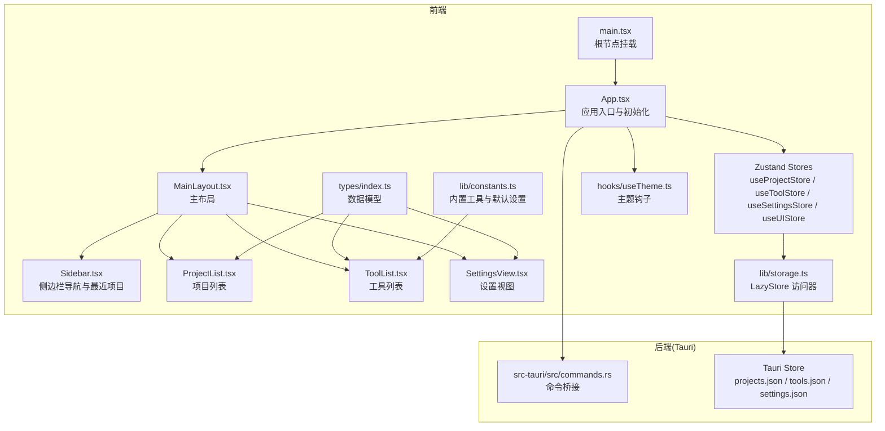
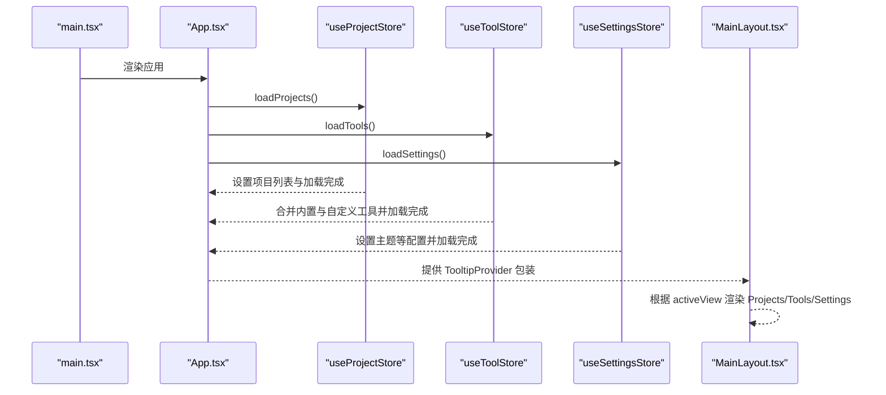
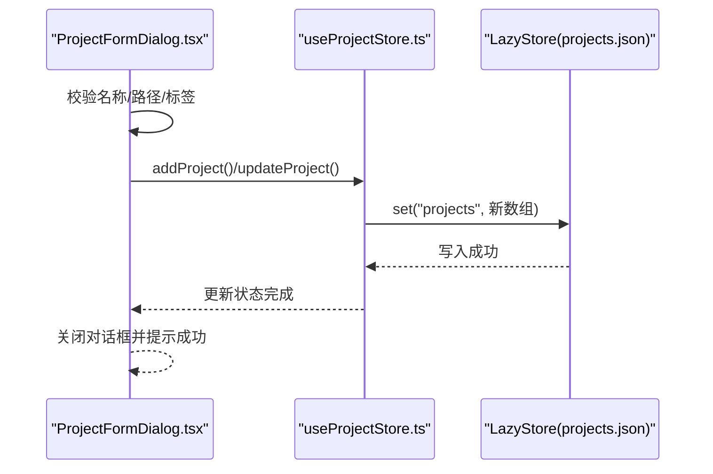
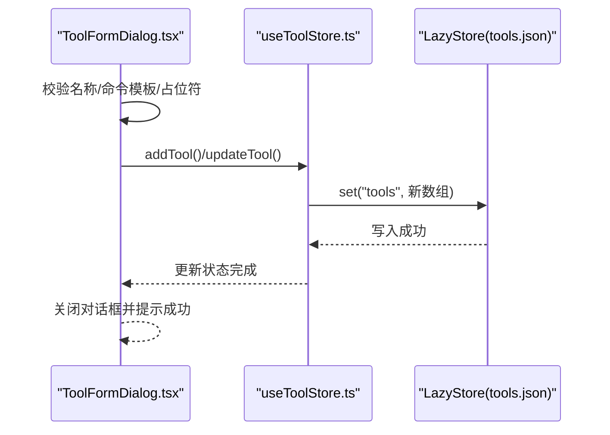
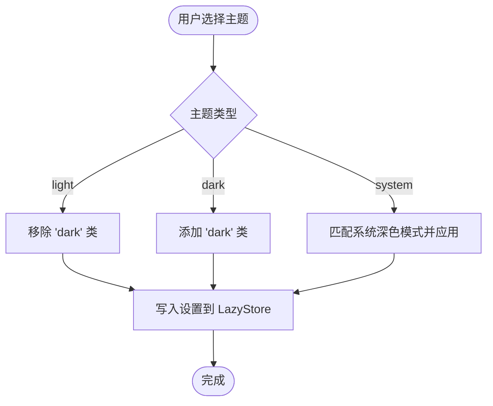
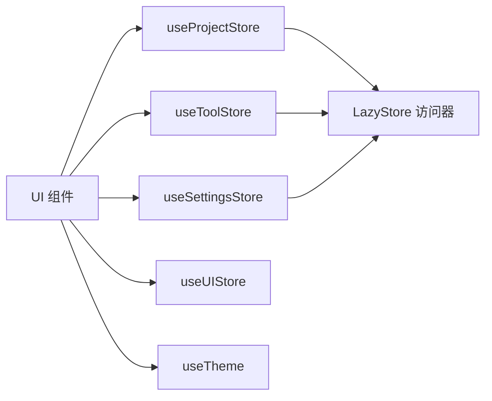
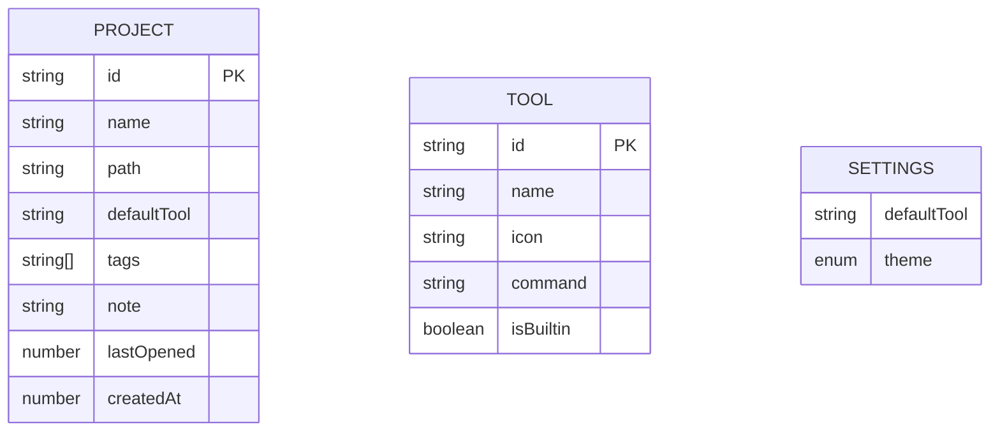

# 核心功能模块

<cite>
**本文档引用的文件**
- [src/App.tsx](file://src/App.tsx)
- [src/main.tsx](file://src/main.tsx)
- [src/stores/useProjectStore.ts](file://src/stores/useProjectStore.ts)
- [src/stores/useToolStore.ts](file://src/stores/useToolStore.ts)
- [src/stores/useSettingsStore.ts](file://src/stores/useSettingsStore.ts)
- [src/stores/useUIStore.ts](file://src/stores/useUIStore.ts)
- [src/types/index.ts](file://src/types/index.ts)
- [src/lib/constants.ts](file://src/lib/constants.ts)
- [src/lib/storage.ts](file://src/lib/storage.ts)
- [src/components/layout/MainLayout.tsx](file://src/components/layout/MainLayout.tsx)
- [src/components/layout/Sidebar.tsx](file://src/components/layout/Sidebar.tsx)
- [src/components/project/ProjectList.tsx](file://src/components/project/ProjectList.tsx)
- [src/components/project/ProjectCard.tsx](file://src/components/project/ProjectCard.tsx)
- [src/components/project/ProjectFormDialog.tsx](file://src/components/project/ProjectFormDialog.tsx)
- [src/components/tool/ToolList.tsx](file://src/components/tool/ToolList.tsx)
- [src/components/tool/ToolFormDialog.tsx](file://src/components/tool/ToolFormDialog.tsx)
- [src/components/settings/SettingsView.tsx](file://src/components/settings/SettingsView.tsx)
- [src/hooks/useTheme.ts](file://src/hooks/useTheme.ts)
</cite>

## 目录
1. [简介](#简介)
2. [项目结构](#项目结构)
3. [核心组件](#核心组件)
4. [架构总览](#架构总览)
5. [详细组件分析](#详细组件分析)
6. [依赖分析](#依赖分析)
7. [性能考虑](#性能考虑)
8. [故障排除指南](#故障排除指南)
9. [结论](#结论)
10. [附录](#附录)

## 简介
本文件面向 LaunchPro 的核心功能模块，系统性阐述项目管理、工具管理和用户界面三大领域。文档覆盖以下要点：
- 设计目标：以简洁直观的方式管理项目与工具，提供一致的跨平台体验。
- 实现原理：基于 Zustand 状态管理、Tauri Store 持久化、React 组件化与组合式 UI。
- 使用场景：新增/编辑/删除项目；配置工具命令模板；切换主题与默认工具；快速打开最近项目。
- 功能协作：项目列表与工具列表通过状态共享与对话框联动；UI 状态驱动主布局视图切换。
- 数据持久化：使用 Tauri LazyStore 将项目、工具与设置分别存储在独立 JSON 文件中。
- 用户体验：响应式布局、搜索与标签筛选、最近项目快捷入口、轻量提示与错误反馈。

## 项目结构
应用采用“按功能域分层”的组织方式：
- 前端（React + TypeScript）：组件、Hooks、Stores、类型定义与工具函数
- 后端（Tauri）：命令桥接与系统能力（如文件对话框、数据目录查询）

**图表来源**
- [src/main.tsx:1-11](file://src/main.tsx#L1-L11)
- [src/App.tsx:1-40](file://src/App.tsx#L1-L40)
- [src/components/layout/MainLayout.tsx:1-21](file://src/components/layout/MainLayout.tsx#L1-L21)
- [src/components/layout/Sidebar.tsx:1-80](file://src/components/layout/Sidebar.tsx#L1-L80)
- [src/components/project/ProjectList.tsx:1-168](file://src/components/project/ProjectList.tsx#L1-L168)
- [src/components/tool/ToolList.tsx:1-129](file://src/components/tool/ToolList.tsx#L1-L129)
- [src/components/settings/SettingsView.tsx:1-111](file://src/components/settings/SettingsView.tsx#L1-L111)
- [src/stores/useProjectStore.ts:1-67](file://src/stores/useProjectStore.ts#L1-L67)
- [src/stores/useToolStore.ts:1-75](file://src/stores/useToolStore.ts#L1-L75)
- [src/stores/useSettingsStore.ts:1-34](file://src/stores/useSettingsStore.ts#L1-L34)
- [src/stores/useUIStore.ts:1-33](file://src/stores/useUIStore.ts#L1-L33)
- [src/types/index.ts:1-26](file://src/types/index.ts#L1-L26)
- [src/lib/constants.ts:1-23](file://src/lib/constants.ts#L1-L23)
- [src/lib/storage.ts:1-30](file://src/lib/storage.ts#L1-L30)
- [src/hooks/useTheme.ts:1-37](file://src/hooks/useTheme.ts#L1-L37)

**章节来源**
- [src/main.tsx:1-11](file://src/main.tsx#L1-L11)
- [src/App.tsx:1-40](file://src/App.tsx#L1-L40)

## 核心组件
本节聚焦三大核心功能域及其关键组件与职责：

- 项目管理（Project Management）
  - 负责项目增删改查、最近打开时间更新、搜索与标签筛选、默认工具关联
  - 关键文件：[ProjectList.tsx:1-168](file://src/components/project/ProjectList.tsx#L1-L168)、[ProjectCard.tsx:1-174](file://src/components/project/ProjectCard.tsx#L1-L174)、[ProjectFormDialog.tsx:1-229](file://src/components/project/ProjectFormDialog.tsx#L1-L229)、[useProjectStore.ts:1-67](file://src/stores/useProjectStore.ts#L1-L67)

- 工具管理（Tool Management）
  - 负责工具的加载、合并内置与自定义、增删改、命令模板校验与执行
  - 关键文件：[ToolList.tsx:1-129](file://src/components/tool/ToolList.tsx#L1-L129)、[ToolFormDialog.tsx:1-134](file://src/components/tool/ToolFormDialog.tsx#L1-L134)、[useToolStore.ts:1-75](file://src/stores/useToolStore.ts#L1-L75)、[constants.ts:1-23](file://src/lib/constants.ts#L1-L23)

- 用户界面（UI）
  - 负责视图切换、搜索过滤、标签过滤、最近项目快捷入口、主题切换
  - 关键文件：[MainLayout.tsx:1-21](file://src/components/layout/MainLayout.tsx#L1-L21)、[Sidebar.tsx:1-80](file://src/components/layout/Sidebar.tsx#L1-L80)、[useUIStore.ts:1-33](file://src/stores/useUIStore.ts#L1-L33)、[useTheme.ts:1-37](file://src/hooks/useTheme.ts#L1-L37)

**章节来源**
- [src/components/project/ProjectList.tsx:1-168](file://src/components/project/ProjectList.tsx#L1-L168)
- [src/components/project/ProjectCard.tsx:1-174](file://src/components/project/ProjectCard.tsx#L1-L174)
- [src/components/project/ProjectFormDialog.tsx:1-229](file://src/components/project/ProjectFormDialog.tsx#L1-L229)
- [src/stores/useProjectStore.ts:1-67](file://src/stores/useProjectStore.ts#L1-L67)
- [src/components/tool/ToolList.tsx:1-129](file://src/components/tool/ToolList.tsx#L1-L129)
- [src/components/tool/ToolFormDialog.tsx:1-134](file://src/components/tool/ToolFormDialog.tsx#L1-L134)
- [src/stores/useToolStore.ts:1-75](file://src/stores/useToolStore.ts#L1-L75)
- [src/lib/constants.ts:1-23](file://src/lib/constants.ts#L1-L23)
- [src/components/layout/MainLayout.tsx:1-21](file://src/components/layout/MainLayout.tsx#L1-L21)
- [src/components/layout/Sidebar.tsx:1-80](file://src/components/layout/Sidebar.tsx#L1-L80)
- [src/stores/useUIStore.ts:1-33](file://src/stores/useUIStore.ts#L1-L33)
- [src/hooks/useTheme.ts:1-37](file://src/hooks/useTheme.ts#L1-L37)

## 架构总览
下图展示应用启动、状态加载与视图渲染的整体流程：

**图表来源**
- [src/main.tsx:1-11](file://src/main.tsx#L1-L11)
- [src/App.tsx:1-40](file://src/App.tsx#L1-L40)
- [src/stores/useProjectStore.ts:1-28](file://src/stores/useProjectStore.ts#L1-L28)
- [src/stores/useToolStore.ts:1-39](file://src/stores/useToolStore.ts#L1-L39)
- [src/stores/useSettingsStore.ts:1-25](file://src/stores/useSettingsStore.ts#L1-L25)
- [src/components/layout/MainLayout.tsx:1-21](file://src/components/layout/MainLayout.tsx#L1-L21)

## 详细组件分析

### 项目管理模块（Project Management）
- 设计目标
  - 提供项目清单的增删改查与排序，支持按名称、路径、标签搜索与多标签筛选，记录最近打开时间用于排序。
- 实现要点
  - 列表组件负责收集所有标签、构建过滤器、排序与空态处理，并通过对话框进行新增/编辑。
  - 卡片组件提供打开、选择工具、编辑、删除等操作，支持默认工具徽章与相对时间显示。
  - 表单对话框负责输入校验（名称/路径必填、路径存在性检查）、默认工具选择与提交。
  - 状态管理通过项目存储实现本地持久化，每次变更同步写入 LazyStore。
- 关键流程（新增/编辑项目）

**图表来源**
- [src/components/project/ProjectFormDialog.tsx:84-134](file://src/components/project/ProjectFormDialog.tsx#L84-L134)
- [src/stores/useProjectStore.ts:30-49](file://src/stores/useProjectStore.ts#L30-L49)
- [src/lib/storage.ts:19-21](file://src/lib/storage.ts#L19-L21)

- 数据模型与复杂度
  - 项目列表过滤与排序：O(n) 收集标签，O(n·(1+|tags|)) 过滤，O(k log k) 排序（k 为过滤结果数），整体近似 O(n + k log k)。
  - 最近打开时间更新：O(n) 遍历匹配并写回存储。

- 交互与可用性
  - 搜索框支持清空与实时过滤；标签云点击切换；空态引导新增。
  - 卡片悬停显示操作按钮，右键菜单提供“打开方式”子菜单。

**章节来源**
- [src/components/project/ProjectList.tsx:1-168](file://src/components/project/ProjectList.tsx#L1-L168)
- [src/components/project/ProjectCard.tsx:1-174](file://src/components/project/ProjectCard.tsx#L1-L174)
- [src/components/project/ProjectFormDialog.tsx:1-229](file://src/components/project/ProjectFormDialog.tsx#L1-L229)
- [src/stores/useProjectStore.ts:1-67](file://src/stores/useProjectStore.ts#L1-L67)
- [src/types/index.ts:1-10](file://src/types/index.ts#L1-L10)

### 工具管理模块（Tool Management）
- 设计目标
  - 提供内置工具集合与自定义工具扩展，统一命令模板格式，支持编辑与删除（内置不可删）。
- 实现要点
  - 首次启动自动注入内置工具；后续启动合并缺失内置项，保留用户自定义项。
  - 表单校验命令模板必须包含路径占位符；图标限制长度；区分内置与自定义。
  - 列表按内置/自定义分组展示，支持编辑与删除（内置禁删）。
- 关键流程（添加/编辑工具）

**图表来源**
- [src/components/tool/ToolFormDialog.tsx:44-78](file://src/components/tool/ToolFormDialog.tsx#L44-L78)
- [src/stores/useToolStore.ts:41-69](file://src/stores/useToolStore.ts#L41-L69)
- [src/lib/storage.ts:23-25](file://src/lib/storage.ts#L23-L25)

- 数据模型与复杂度
  - 加载时去重与合并内置工具：O(n) 遍历现有工具，O(m) 过滤缺失内置项，m 为内置数量，整体 O(n + m)。
  - 删除内置工具保护：O(n) 查找并判断 isBuiltin。

**章节来源**
- [src/components/tool/ToolList.tsx:1-129](file://src/components/tool/ToolList.tsx#L1-L129)
- [src/components/tool/ToolFormDialog.tsx:1-134](file://src/components/tool/ToolFormDialog.tsx#L1-L134)
- [src/stores/useToolStore.ts:1-75](file://src/stores/useToolStore.ts#L1-L75)
- [src/lib/constants.ts:1-23](file://src/lib/constants.ts#L1-L23)
- [src/types/index.ts:12-18](file://src/types/index.ts#L12-L18)

### 用户界面模块（UI）
- 设计目标
  - 提供清晰的导航、视图切换、搜索与标签过滤、最近项目快捷入口、主题切换与全局提示。
- 实现要点
  - 主布局根据 activeView 条件渲染不同区域；侧边栏包含导航与最近项目列表。
  - UI 状态管理负责活动视图、搜索关键词、选中标签与一键清空。
  - 主题钩子监听系统偏好或手动切换，动态更新根元素类名。
- 关键流程（主题切换）

**图表来源**
- [src/hooks/useTheme.ts:8-29](file://src/hooks/useTheme.ts#L8-L29)
- [src/stores/useSettingsStore.ts:27-32](file://src/stores/useSettingsStore.ts#L27-L32)
- [src/lib/storage.ts:27-29](file://src/lib/storage.ts#L27-L29)

**章节来源**
- [src/components/layout/MainLayout.tsx:1-21](file://src/components/layout/MainLayout.tsx#L1-L21)
- [src/components/layout/Sidebar.tsx:1-80](file://src/components/layout/Sidebar.tsx#L1-L80)
- [src/stores/useUIStore.ts:1-33](file://src/stores/useUIStore.ts#L1-L33)
- [src/hooks/useTheme.ts:1-37](file://src/hooks/useTheme.ts#L1-L37)

## 依赖分析
- 组件耦合
  - 项目/工具/设置视图均依赖对应 Store；项目卡片依赖工具 Store 获取默认工具；侧边栏依赖项目 Store 获取最近项目。
- 外部依赖
  - Zustand：集中式状态管理
  - Tauri Store：本地持久化
  - Tauri 插件：对话框、托盘、命令桥接（在后端实现）
- 可能的循环依赖
  - 当前未发现直接循环导入；各 Store 仅被 UI 组件消费，无反向依赖。

**图表来源**
- [src/stores/useProjectStore.ts:1-67](file://src/stores/useProjectStore.ts#L1-L67)
- [src/stores/useToolStore.ts:1-75](file://src/stores/useToolStore.ts#L1-L75)
- [src/stores/useSettingsStore.ts:1-34](file://src/stores/useSettingsStore.ts#L1-L34)
- [src/stores/useUIStore.ts:1-33](file://src/stores/useUIStore.ts#L1-L33)
- [src/lib/storage.ts:1-30](file://src/lib/storage.ts#L1-L30)
- [src/hooks/useTheme.ts:1-37](file://src/hooks/useTheme.ts#L1-L37)

**章节来源**
- [src/stores/useProjectStore.ts:1-67](file://src/stores/useProjectStore.ts#L1-L67)
- [src/stores/useToolStore.ts:1-75](file://src/stores/useToolStore.ts#L1-L75)
- [src/stores/useSettingsStore.ts:1-34](file://src/stores/useSettingsStore.ts#L1-L34)
- [src/stores/useUIStore.ts:1-33](file://src/stores/useUIStore.ts#L1-L33)
- [src/lib/storage.ts:1-30](file://src/lib/storage.ts#L1-L30)

## 性能考虑
- 列表渲染
  - 使用 useMemo 缓存标签集合与过滤结果，避免重复计算；对过滤后的结果进行稳定排序，减少不必要的重排。
- 存储写入
  - LazyStore 自动保存，避免频繁写入；批量更新后一次性写入，降低 I/O 开销。
- 图标与命令
  - 工具命令模板在表单阶段校验占位符，减少运行时错误与无效调用。
- 主题切换
  - 系统主题监听仅在“system”模式下注册事件，避免常驻监听带来的性能损耗。

[本节为通用指导，无需特定文件来源]

## 故障排除指南
- 无法打开项目路径
  - 现象：新增/编辑项目时报错“路径不存在”
  - 处理：确认路径存在且为目录；使用“浏览”按钮选择有效目录；确保路径权限正确
  - 参考：[ProjectFormDialog.tsx:96-102](file://src/components/project/ProjectFormDialog.tsx#L96-L102)
- 工具命令模板不合法
  - 现象：保存工具时报错“命令必须包含 {path} 占位符”
  - 处理：在命令模板中包含 {path} 占位符；确保命令可由系统识别
  - 参考：[ToolFormDialog.tsx:53-56](file://src/components/tool/ToolFormDialog.tsx#L53-L56)
- 内置工具被误删
  - 现象：删除工具无效果或报错
  - 处理：内置工具不可删除；请通过编辑修改属性而非删除
  - 参考：[useToolStore.ts:62-69](file://src/stores/useToolStore.ts#L62-L69)
- 主题未生效
  - 现象：切换主题后外观未变化
  - 处理：确认当前主题设置；若为“system”，检查系统深色模式设置
  - 参考：[useTheme.ts:8-29](file://src/hooks/useTheme.ts#L8-L29)
- 数据未持久化
  - 现象：重启后数据丢失
  - 处理：确认 LazyStore 文件存在且可读写；检查应用数据目录权限
  - 参考：[storage.ts:4-17](file://src/lib/storage.ts#L4-L17)

**章节来源**
- [src/components/project/ProjectFormDialog.tsx:84-134](file://src/components/project/ProjectFormDialog.tsx#L84-L134)
- [src/components/tool/ToolFormDialog.tsx:44-78](file://src/components/tool/ToolFormDialog.tsx#L44-L78)
- [src/stores/useToolStore.ts:62-69](file://src/stores/useToolStore.ts#L62-L69)
- [src/hooks/useTheme.ts:8-29](file://src/hooks/useTheme.ts#L8-L29)
- [src/lib/storage.ts:4-17](file://src/lib/storage.ts#L4-L17)

## 结论
LaunchPro 通过清晰的功能域划分与轻量的状态管理，实现了项目与工具的高效管理。其核心优势在于：
- 易用的 CRUD 流程与即时反馈
- 可扩展的工具模板与内置工具基线
- 响应式的 UI 与一致的主题策略
建议后续增强方向：引入导入导出备份、批量操作、工具模板变量扩展与快捷键支持。

[本节为总结性内容，无需特定文件来源]

## 附录

### 数据模型与持久化

**图表来源**
- [src/types/index.ts:1-26](file://src/types/index.ts#L1-L26)

### 配置选项与自定义能力
- 项目
  - 字段：名称、路径、默认工具、标签、备注、最近打开时间、创建时间
  - 自定义：标签与备注自由填写；默认工具可在项目级覆盖全局设置
  - 参考：[ProjectFormDialog.tsx:33-134](file://src/components/project/ProjectFormDialog.tsx#L33-L134)
- 工具
  - 字段：名称、图标、命令模板、是否内置
  - 自定义：新增/编辑/删除（内置不可删）；命令模板需包含 {path}
  - 参考：[ToolFormDialog.tsx:21-78](file://src/components/tool/ToolFormDialog.tsx#L21-L78)
- 设置
  - 字段：默认工具、主题
  - 自定义：主题切换（亮/暗/系统）；查看应用数据目录
  - 参考：[SettingsView.tsx:19-111](file://src/components/settings/SettingsView.tsx#L19-L111)

**章节来源**
- [src/types/index.ts:1-26](file://src/types/index.ts#L1-L26)
- [src/components/project/ProjectFormDialog.tsx:33-134](file://src/components/project/ProjectFormDialog.tsx#L33-L134)
- [src/components/tool/ToolFormDialog.tsx:21-78](file://src/components/tool/ToolFormDialog.tsx#L21-L78)
- [src/components/settings/SettingsView.tsx:19-111](file://src/components/settings/SettingsView.tsx#L19-L111)