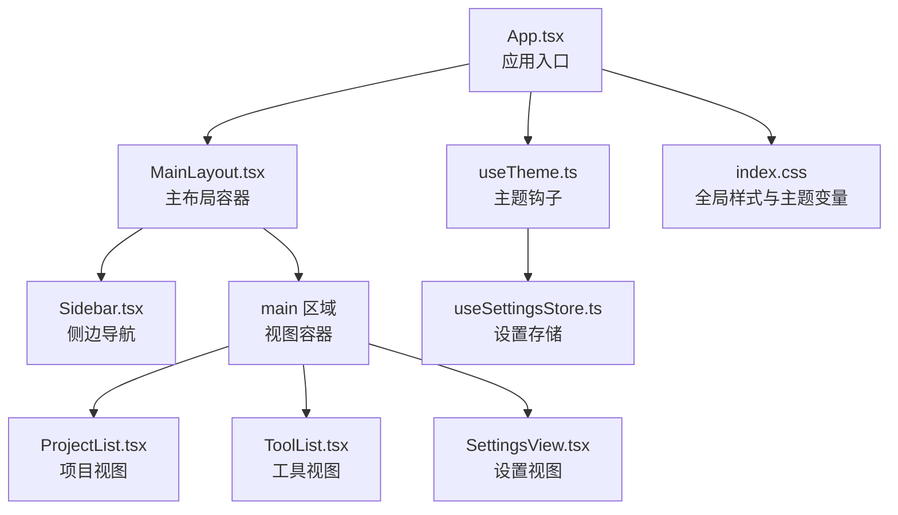
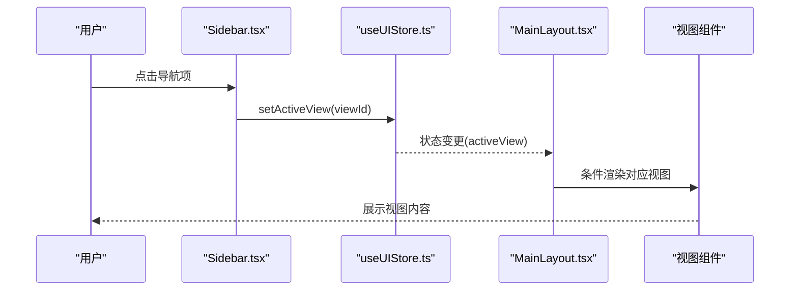
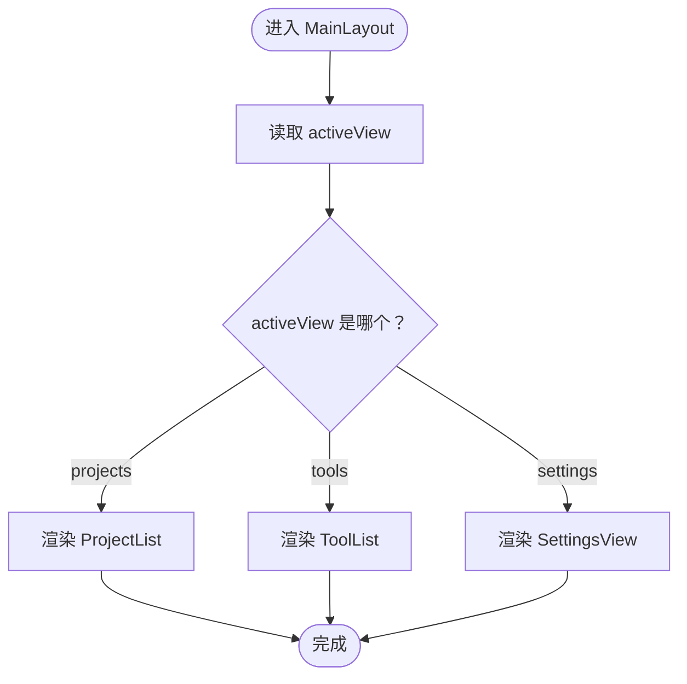
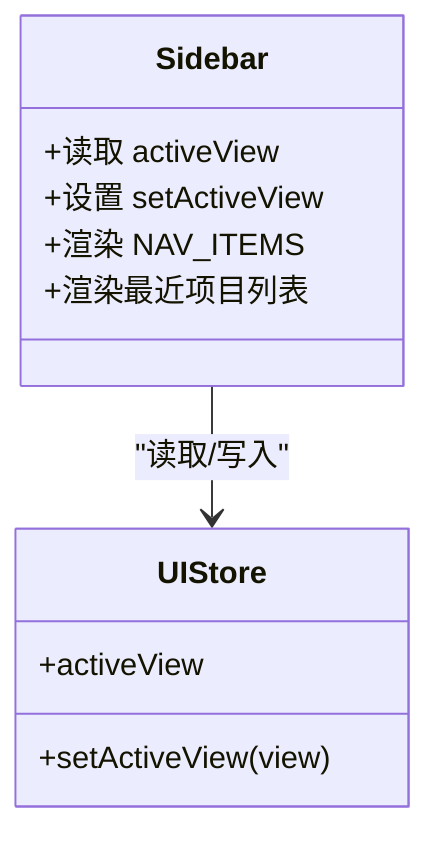
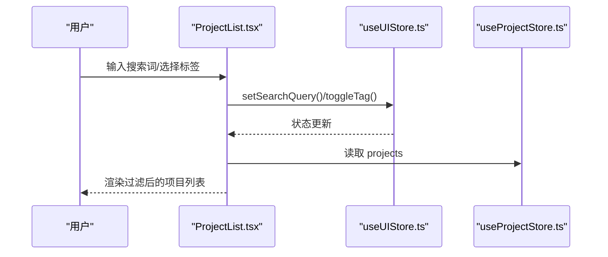
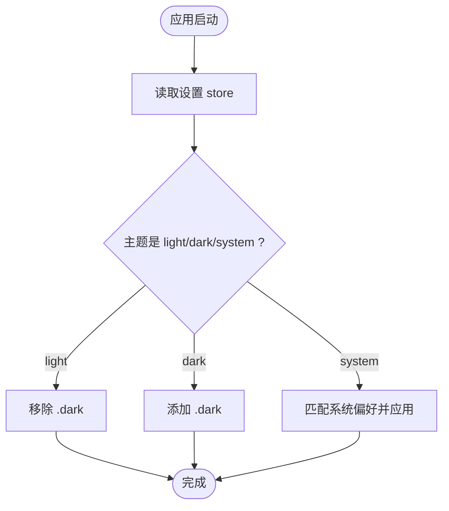
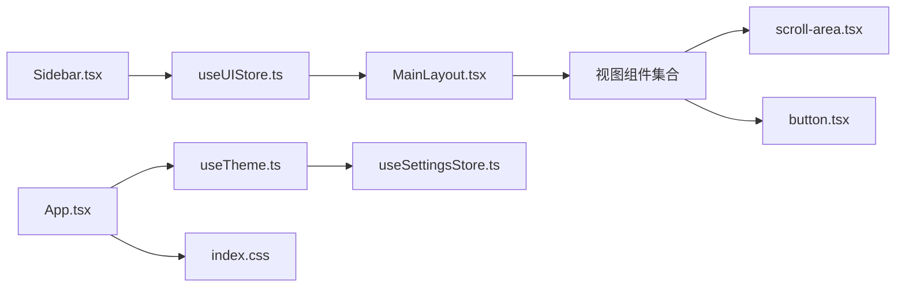

# 主布局设计

<cite>
**本文档引用的文件**
- [src/components/layout/MainLayout.tsx](file://src/components/layout/MainLayout.tsx)
- [src/components/layout/Sidebar.tsx](file://src/components/layout/Sidebar.tsx)
- [src/stores/useUIStore.ts](file://src/stores/useUIStore.ts)
- [src/stores/useSettingsStore.ts](file://src/stores/useSettingsStore.ts)
- [src/hooks/useTheme.ts](file://src/hooks/useTheme.ts)
- [src/types/index.ts](file://src/types/index.ts)
- [src/index.css](file://src/index.css)
- [src/App.tsx](file://src/App.tsx)
- [src/main.tsx](file://src/main.tsx)
- [src/components/project/ProjectList.tsx](file://src/components/project/ProjectList.tsx)
- [src/components/tool/ToolList.tsx](file://src/components/tool/ToolList.tsx)
- [src/components/settings/SettingsView.tsx](file://src/components/settings/SettingsView.tsx)
- [src/components/ui/scroll-area.tsx](file://src/components/ui/scroll-area.tsx)
- [src/components/ui/button.tsx](file://src/components/ui/button.tsx)
</cite>

## 目录
1. [简介](#简介)
2. [项目结构](#项目结构)
3. [核心组件](#核心组件)
4. [架构总览](#架构总览)
5. [详细组件分析](#详细组件分析)
6. [依赖关系分析](#依赖关系分析)
7. [性能考量](#性能考量)
8. [故障排查指南](#故障排查指南)
9. [结论](#结论)
10. [附录](#附录)

## 简介
本文件围绕主布局设计进行系统化文档化，重点阐述 MainLayout 组件的架构与布局策略，包括 Flexbox 布局系统、响应式设计与视图切换机制；同时覆盖布局容器的样式类名、高度计算与溢出处理策略；详细说明 activeView 状态管理、条件渲染逻辑与组件懒加载机制；并给出布局断点、移动端适配与屏幕尺寸兼容性建议；最后提供布局定制化的 CSS 变量与主题适配方案，以及性能优化与重绘重排避免技巧。

## 项目结构
主布局位于 layout 目录，配合 UI Store 管理视图状态，通过 Sidebar 导航切换视图，右侧区域根据 activeView 条件渲染不同视图组件（项目列表、工具列表、设置页）。全局样式通过 Tailwind 与 CSS 变量实现主题系统，根节点采用固定视口高度以确保全屏布局。

**图表来源**
- [src/App.tsx:1-40](file://src/App.tsx#L1-L40)
- [src/components/layout/MainLayout.tsx:1-21](file://src/components/layout/MainLayout.tsx#L1-L21)
- [src/components/layout/Sidebar.tsx:1-80](file://src/components/layout/Sidebar.tsx#L1-L80)
- [src/components/project/ProjectList.tsx:1-168](file://src/components/project/ProjectList.tsx#L1-L168)
- [src/components/tool/ToolList.tsx:1-129](file://src/components/tool/ToolList.tsx#L1-L129)
- [src/components/settings/SettingsView.tsx:1-111](file://src/components/settings/SettingsView.tsx#L1-L111)
- [src/hooks/useTheme.ts:1-37](file://src/hooks/useTheme.ts#L1-L37)
- [src/stores/useSettingsStore.ts:1-34](file://src/stores/useSettingsStore.ts#L1-L34)
- [src/index.css:1-116](file://src/index.css#L1-L116)

**章节来源**
- [src/App.tsx:1-40](file://src/App.tsx#L1-L40)
- [src/main.tsx:1-11](file://src/main.tsx#L1-L11)
- [src/index.css:1-116](file://src/index.css#L1-L116)

## 核心组件
- MainLayout：负责整体布局容器与视图切换，使用 Flexbox 实现横向布局，左侧固定宽度侧栏，右侧内容区按需渲染当前视图。
- Sidebar：提供导航项与最近项目列表，基于 UI Store 的 activeView 控制按钮高亮，并通过点击事件更新 activeView。
- UI Store：集中管理 activeView、搜索查询、标签筛选等 UI 状态，提供 setActiveView 等方法。
- 视图组件：ProjectList、ToolList、SettingsView 分别承载对应功能区域，均采用 Flexbox 列布局与 ScrollArea 滚动容器，保证内容在固定高度下可滚动。

**章节来源**
- [src/components/layout/MainLayout.tsx:1-21](file://src/components/layout/MainLayout.tsx#L1-L21)
- [src/components/layout/Sidebar.tsx:1-80](file://src/components/layout/Sidebar.tsx#L1-L80)
- [src/stores/useUIStore.ts:1-33](file://src/stores/useUIStore.ts#L1-L33)
- [src/components/project/ProjectList.tsx:1-168](file://src/components/project/ProjectList.tsx#L1-L168)
- [src/components/tool/ToolList.tsx:1-129](file://src/components/tool/ToolList.tsx#L1-L129)
- [src/components/settings/SettingsView.tsx:1-111](file://src/components/settings/SettingsView.tsx#L1-L111)

## 架构总览
主布局采用“容器 + 视图”的分层架构：容器层负责布局与状态桥接，视图层专注各自业务展示与交互。Sidebar 作为状态消费者与触发者，统一驱动 UI Store 中的 activeView；MainLayout 仅负责布局与条件渲染；各视图内部再细分子布局与滚动处理。

**图表来源**
- [src/components/layout/Sidebar.tsx:17-44](file://src/components/layout/Sidebar.tsx#L17-L44)
- [src/stores/useUIStore.ts:19](file://src/stores/useUIStore.ts#L19)
- [src/components/layout/MainLayout.tsx:10-19](file://src/components/layout/MainLayout.tsx#L10-L19)

## 详细组件分析

### MainLayout 组件分析
- 布局策略
  - 使用 Flexbox 容器实现横向布局，左侧固定宽度侧栏，右侧内容区通过 flex-1 占满剩余空间。
  - 容器高度使用 h-screen，结合全局样式中的 #root 高度与溢出控制，确保全屏布局。
  - 内容区 main 使用 overflow-hidden 防止外部滚动穿透，内部滚动由各视图内的 ScrollArea 负责。
- 视图切换机制
  - 通过 useUIStore 获取 activeView，使用三元表达式进行条件渲染，分别挂载 ProjectList、ToolList、SettingsView。
- 样式类名与高度计算
  - 外层容器类名："flex h-screen overflow-hidden"，确保全屏且无外层滚动。
  - 内容区类名："flex-1 overflow-hidden"，内部滚动由视图组件自行处理。
- 溢出处理策略
  - 外层禁用滚动，内部使用 ScrollArea 提供平滑滚动条与自适应滚动行为。

**图表来源**
- [src/components/layout/MainLayout.tsx:7-20](file://src/components/layout/MainLayout.tsx#L7-L20)
- [src/stores/useUIStore.ts:14-19](file://src/stores/useUIStore.ts#L14-L19)

**章节来源**
- [src/components/layout/MainLayout.tsx:1-21](file://src/components/layout/MainLayout.tsx#L1-L21)
- [src/index.css:111-115](file://src/index.css#L111-L115)

### Sidebar 组件分析
- 导航项配置
  - NAV_ITEMS 定义了三个导航项（projects、tools、settings），每个项包含 id、label 与图标。
- 活跃态控制
  - 通过 useUIStore 读取 activeView 并在按钮变体中体现当前活跃项。
  - 点击导航项调用 setActiveView 更新状态，驱动 MainLayout 条件渲染。
- 最近项目列表
  - 从项目存储中筛选并排序最近打开的项目，使用 ScrollArea 提供滚动区域。
- 样式与布局
  - 固定宽度类名："w-52"，边框与背景使用语义化变量，采用 Flex column 布局。
  - 按钮尺寸与间距通过组件库变体与内边距控制，保持一致的视觉节奏。

**图表来源**
- [src/components/layout/Sidebar.tsx:16-79](file://src/components/layout/Sidebar.tsx#L16-L79)
- [src/stores/useUIStore.ts:4-12](file://src/stores/useUIStore.ts#L4-L12)

**章节来源**
- [src/components/layout/Sidebar.tsx:1-80](file://src/components/layout/Sidebar.tsx#L1-L80)
- [src/stores/useUIStore.ts:1-33](file://src/stores/useUIStore.ts#L1-L33)

### 视图组件（ProjectList、ToolList、SettingsView）
- ProjectList
  - 顶部搜索与标签过滤：通过 UI Store 的 searchQuery 与 selectedTags 进行过滤与排序。
  - 内容区使用 ScrollArea，支持大量项目时的滚动体验。
- ToolList
  - 分类展示内置与自定义工具，使用卡片与操作按钮组织信息。
  - 内容区同样使用 ScrollArea，保证在小屏设备上的可读性。
- SettingsView
  - 主题选择：通过 useTheme 钩子与 useSettingsStore 协作，支持 light、dark、system 三种模式。
  - 默认工具选择：下拉选择默认打开项目的工具。
  - 数据目录查看：调用 Tauri 命令展示应用数据目录路径。

**图表来源**
- [src/components/project/ProjectList.tsx:12-55](file://src/components/project/ProjectList.tsx#L12-L55)
- [src/stores/useUIStore.ts:19-31](file://src/stores/useUIStore.ts#L19-L31)

**章节来源**
- [src/components/project/ProjectList.tsx:1-168](file://src/components/project/ProjectList.tsx#L1-L168)
- [src/components/tool/ToolList.tsx:1-129](file://src/components/tool/ToolList.tsx#L1-L129)
- [src/components/settings/SettingsView.tsx:1-111](file://src/components/settings/SettingsView.tsx#L1-L111)

### 主题与样式系统
- CSS 变量与主题
  - :root 定义基础颜色变量，.dark 类在暗色模式下覆盖这些变量，实现主题切换。
  - 通过 useTheme 钩子监听设置变化，动态添加/移除 .dark 类到 documentElement。
- 全局样式
  - #root 设置为 100vh 且隐藏溢出，确保主布局全屏且不出现外层滚动。
  - base 层应用边框、字体与滚动条等基础样式。

**图表来源**
- [src/hooks/useTheme.ts:8-29](file://src/hooks/useTheme.ts#L8-L29)
- [src/stores/useSettingsStore.ts:17-32](file://src/stores/useSettingsStore.ts#L17-L32)
- [src/index.css:5-64](file://src/index.css#L5-L64)

**章节来源**
- [src/hooks/useTheme.ts:1-37](file://src/hooks/useTheme.ts#L1-L37)
- [src/stores/useSettingsStore.ts:1-34](file://src/stores/useSettingsStore.ts#L1-L34)
- [src/index.css:1-116](file://src/index.css#L1-L116)

## 依赖关系分析
- 组件耦合
  - MainLayout 仅依赖 Sidebar 与 UI Store 的 activeView，耦合度低，职责清晰。
  - Sidebar 依赖 UI Store 与项目存储，用于导航与最近项目展示。
  - 视图组件各自依赖自身存储与 UI Store 的筛选状态，互不干扰。
- 状态流
  - Sidebar -> UI Store -> MainLayout -> 视图组件，形成单向数据流。
- 外部依赖
  - ScrollArea 提供滚动能力，Button 提供交互态样式，Tailwind 提供原子化样式。

**图表来源**
- [src/components/layout/Sidebar.tsx:16-44](file://src/components/layout/Sidebar.tsx#L16-L44)
- [src/stores/useUIStore.ts:14-19](file://src/stores/useUIStore.ts#L14-L19)
- [src/components/layout/MainLayout.tsx:10-19](file://src/components/layout/MainLayout.tsx#L10-L19)
- [src/components/ui/scroll-area.tsx:1-57](file://src/components/ui/scroll-area.tsx#L1-L57)
- [src/components/ui/button.tsx:1-65](file://src/components/ui/button.tsx#L1-L65)
- [src/App.tsx:10-19](file://src/App.tsx#L10-L19)
- [src/hooks/useTheme.ts:4-35](file://src/hooks/useTheme.ts#L4-L35)
- [src/stores/useSettingsStore.ts:13-33](file://src/stores/useSettingsStore.ts#L13-L33)
- [src/index.css:100-115](file://src/index.css#L100-L115)

**章节来源**
- [src/App.tsx:1-40](file://src/App.tsx#L1-L40)
- [src/components/layout/MainLayout.tsx:1-21](file://src/components/layout/MainLayout.tsx#L1-L21)
- [src/components/layout/Sidebar.tsx:1-80](file://src/components/layout/Sidebar.tsx#L1-L80)

## 性能考量
- 重绘与重排避免
  - 使用 Flexbox 替代绝对定位，减少布局抖动；容器层使用 overflow-hidden，内部滚动由 ScrollArea 承担，避免根级滚动引发的全局重排。
  - 视图组件内部使用 ScrollArea，配合最小化 DOM 结构，降低滚动时的重绘范围。
- 状态更新与渲染
  - UI Store 将 activeView 与筛选状态集中管理，避免在多个组件中重复订阅导致的重复渲染。
  - 视图内部使用 useMemo 对过滤与排序结果进行缓存，减少不必要的渲染。
- 懒加载与资源占用
  - 当前实现为条件渲染而非动态 import 懒加载，适合小型应用体量；若未来视图组件体积增大，可考虑路由级懒加载以降低首屏负担。
- 主题切换性能
  - 通过 CSS 变量与类名切换实现主题，避免运行时样式计算开销；系统主题监听使用媒体查询事件，性能稳定。

[本节为通用性能指导，无需特定文件引用]

## 故障排查指南
- 视图不显示或空白
  - 检查 UI Store 的 activeView 是否正确设置；确认 Sidebar 的导航点击是否触发 setActiveView。
  - 确认 MainLayout 的条件渲染分支是否覆盖当前 activeView。
- 滚动异常
  - 确保 ScrollArea 在视图内部使用，且父容器设置了 overflow-hidden 以避免双层滚动。
  - 检查视图容器是否具备足够的高度（如 h-full 或 flex-1）。
- 主题未生效
  - 检查 useTheme 是否在 AppContent 中被调用；确认 useSettingsStore 已加载设置；验证 documentElement 上是否存在 .dark 类。
- 样式冲突
  - 确认 Tailwind 与 CSS 变量的优先级顺序；避免在局部组件中覆盖全局样式变量。

**章节来源**
- [src/stores/useUIStore.ts:14-19](file://src/stores/useUIStore.ts#L14-L19)
- [src/components/layout/MainLayout.tsx:10-19](file://src/components/layout/MainLayout.tsx#L10-L19)
- [src/components/ui/scroll-area.tsx:10-27](file://src/components/ui/scroll-area.tsx#L10-L27)
- [src/hooks/useTheme.ts:8-29](file://src/hooks/useTheme.ts#L8-L29)
- [src/stores/useSettingsStore.ts:17-32](file://src/stores/useSettingsStore.ts#L17-L32)

## 结论
该主布局设计以简洁的 Flexbox 容器为核心，通过 UI Store 驱动的 activeView 实现清晰的视图切换；Sidebar 作为状态中枢，连接导航与内容区；各视图内部采用 ScrollArea 与合理的布局结构，确保在不同屏幕尺寸下的可用性与性能。主题系统通过 CSS 变量与类名切换实现高效切换。未来可在视图组件体积增大时引入懒加载策略，进一步优化首屏性能。

[本节为总结性内容，无需特定文件引用]

## 附录

### 布局断点与移动端适配建议
- 断点策略
  - 当前布局以固定侧栏宽度与内容区自适应为主，未使用媒体查询断点。建议在小屏设备上：
    - 将侧栏改为抽屉式（侧滑）并在激活时覆盖主内容区。
    - 在窄屏下将导航项改为图标按钮，减少文字占用。
- 屏幕尺寸兼容性
  - 确保 #root 高度为 100vh，避免浏览器地址栏遮挡导致的可视高度差异。
  - 在移动端测试时关注触摸滚动与键盘弹起对布局的影响。

[本节为通用建议，无需特定文件引用]

### 布局定制化与主题适配方案
- CSS 变量
  - 基础变量位于 :root，暗色变量位于 .dark；可通过修改变量值调整整体配色与圆角半径。
- 主题适配
  - 使用 useTheme 钩子与 useSettingsStore 协作，支持 light、dark、system 三种模式；系统模式通过媒体查询自动切换。
- 组件级定制
  - 按钮、卡片等组件通过变体与尺寸属性实现风格统一；如需扩展，可在组件库层面增加新的变体。

**章节来源**
- [src/index.css:5-64](file://src/index.css#L5-L64)
- [src/hooks/useTheme.ts:8-29](file://src/hooks/useTheme.ts#L8-L29)
- [src/stores/useSettingsStore.ts:17-32](file://src/stores/useSettingsStore.ts#L17-L32)