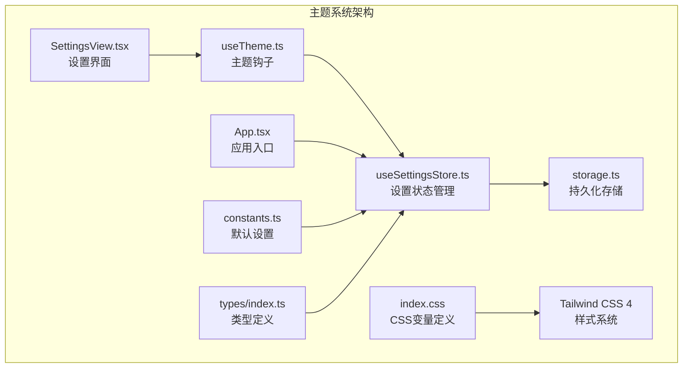
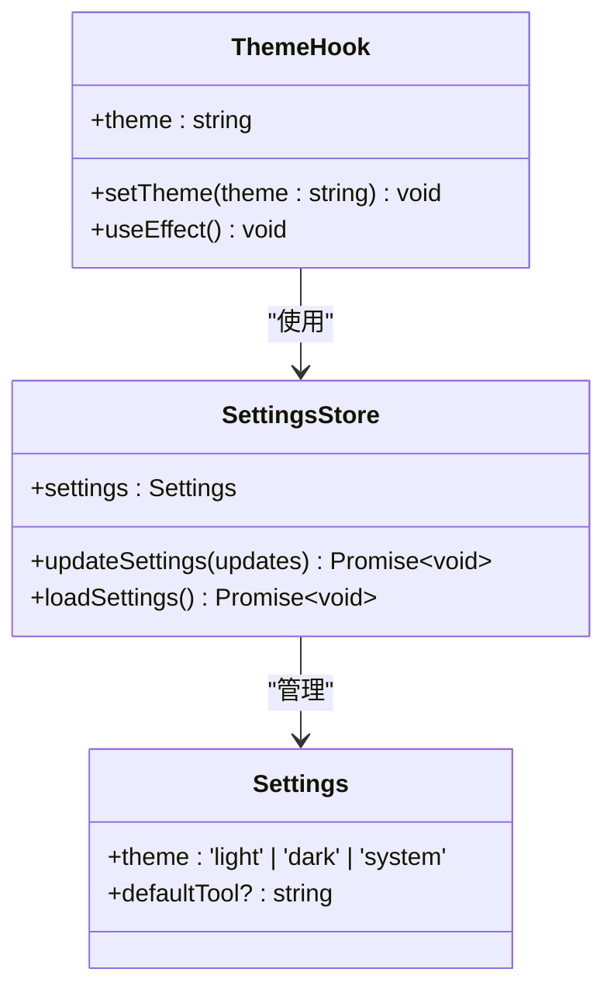
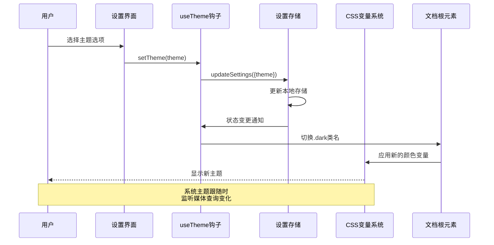
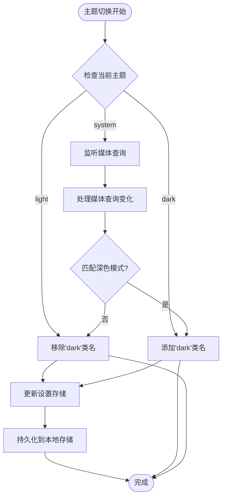
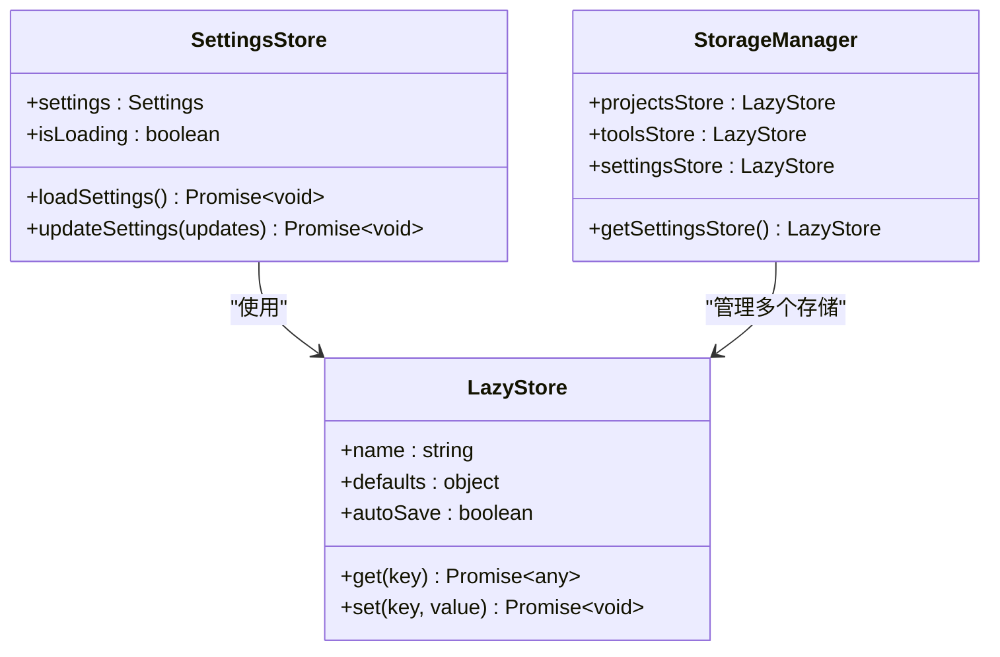
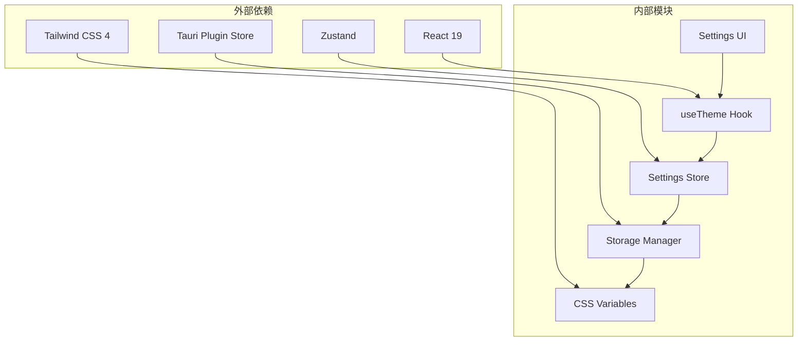

# 主题系统

<cite>
**本文档引用的文件**
- [useTheme.ts](file://src/hooks/useTheme.ts)
- [useSettingsStore.ts](file://src/stores/useSettingsStore.ts)
- [storage.ts](file://src/lib/storage.ts)
- [index.css](file://src/index.css)
- [constants.ts](file://src/lib/constants.ts)
- [SettingsView.tsx](file://src/components/settings/SettingsView.tsx)
- [App.tsx](file://src/App.tsx)
- [types/index.ts](file://src/types/index.ts)
</cite>

## 目录
1. [简介](#简介)
2. [项目结构](#项目结构)
3. [核心组件](#核心组件)
4. [架构概览](#架构概览)
5. [详细组件分析](#详细组件分析)
6. [依赖关系分析](#依赖关系分析)
7. [性能考虑](#性能考虑)
8. [故障排除指南](#故障排除指南)
9. [结论](#结论)

## 简介

LaunchPro 的主题系统是一个基于 CSS 自定义属性和 React 钩子的现代化主题管理解决方案。该系统支持明暗主题切换、系统主题跟随、颜色变量管理和持久化存储。通过使用 OKLCH 颜色空间和 Tailwind CSS 4，实现了高质量的颜色渐变和主题一致性。

## 项目结构

主题系统主要分布在以下文件中：



**图表来源**
- [useTheme.ts:1-37](file://src/hooks/useTheme.ts#L1-L37)
- [useSettingsStore.ts:1-34](file://src/stores/useSettingsStore.ts#L1-L34)
- [storage.ts:1-30](file://src/lib/storage.ts#L1-L30)
- [index.css:1-116](file://src/index.css#L1-L116)

**章节来源**
- [useTheme.ts:1-37](file://src/hooks/useTheme.ts#L1-L37)
- [useSettingsStore.ts:1-34](file://src/stores/useSettingsStore.ts#L1-L34)
- [storage.ts:1-30](file://src/lib/storage.ts#L1-L30)
- [index.css:1-116](file://src/index.css#L1-L116)

## 核心组件

### 主题钩子 (useTheme)

useTheme 是主题系统的核心钩子，负责管理主题状态和切换逻辑：



**图表来源**
- [useTheme.ts:4-36](file://src/hooks/useTheme.ts#L4-L36)
- [useSettingsStore.ts:6-11](file://src/stores/useSettingsStore.ts#L6-L11)
- [types/index.ts:20-23](file://src/types/index.ts#L20-L23)

### CSS 变量系统

系统使用 OKLCH 颜色空间定义完整的颜色变量系统：

| 组件类别 | 变量前缀 | 深色模式变量 | 浅色模式变量 |
|---------|---------|-------------|-------------|
| 基础颜色 | --background, --foreground | oklch(0.145 0 0) | oklch(1 0 0) |
| 主要颜色 | --primary, --primary-foreground | oklch(0.985 0 0) | oklch(0.205 0 0) |
| 次要颜色 | --secondary, --secondary-foreground | oklch(0.269 0 0) | oklch(0.97 0 0) |
| 边框颜色 | --border, --input, --ring | oklch(0.269 0 0) | oklch(0.922 0 0) |
| 侧边栏颜色 | --sidebar-* | 完整的深色变体 | 完整的浅色变体 |

**章节来源**
- [index.css:5-64](file://src/index.css#L5-L64)
- [index.css:66-98](file://src/index.css#L66-L98)

## 架构概览

主题系统的整体架构采用分层设计，确保了良好的可维护性和扩展性：



**图表来源**
- [SettingsView.tsx:46-62](file://src/components/settings/SettingsView.tsx#L46-L62)
- [useTheme.ts:31-33](file://src/hooks/useTheme.ts#L31-L33)
- [useSettingsStore.ts:27-32](file://src/stores/useSettingsStore.ts#L27-L32)

## 详细组件分析

### 主题切换机制

主题切换机制通过 CSS 类名切换实现，支持三种模式：

1. **浅色主题 (light)**: 移除 `.dark` 类名
2. **深色主题 (dark)**: 添加 `.dark` 类名  
3. **系统主题 (system)**: 监听 `prefers-color-scheme` 媒体查询



**图表来源**
- [useTheme.ts:8-29](file://src/hooks/useTheme.ts#L8-L29)
- [useSettingsStore.ts:27-32](file://src/stores/useSettingsStore.ts#L27-L32)

### 设置存储系统

设置存储系统基于 tauri-plugin-store 实现，提供自动持久化功能：



**图表来源**
- [storage.ts:4-17](file://src/lib/storage.ts#L4-L17)
- [useSettingsStore.ts:13-33](file://src/stores/useSettingsStore.ts#L13-L33)

### 设置界面集成

设置界面提供了直观的主题切换控制：

```mermaid
graph LR
subgraph "设置界面"
A[主题卡片] --> B[浅色按钮]
A --> C[深色按钮]
A --> D[系统按钮]
end
subgraph "交互流程"
B --> E[setTheme('light')]
C --> F[setTheme('dark')]
D --> G[setTheme('system')]
end
E --> H[更新设置存储]
F --> H
G --> H
```

**图表来源**
- [SettingsView.tsx:46-62](file://src/components/settings/SettingsView.tsx#L46-L62)
- [useTheme.ts:31-33](file://src/hooks/useTheme.ts#L31-L33)

**章节来源**
- [SettingsView.tsx:41-63](file://src/components/settings/SettingsView.tsx#L41-L63)
- [useTheme.ts:1-37](file://src/hooks/useTheme.ts#L1-L37)

## 依赖关系分析

主题系统的依赖关系清晰且模块化：



**图表来源**
- [package.json](file://package.json)
- [useTheme.ts:1-2](file://src/hooks/useTheme.ts#L1-L2)
- [useSettingsStore.ts:1-4](file://src/stores/useSettingsStore.ts#L1-L4)

**章节来源**
- [package.json](file://package.json)
- [useTheme.ts:1-37](file://src/hooks/useTheme.ts#L1-L37)
- [useSettingsStore.ts:1-34](file://src/stores/useSettingsStore.ts#L1-L34)

## 性能考虑

### 内存管理最佳实践

1. **媒体查询监听器清理**: 系统主题模式下会自动清理媒体查询监听器，防止内存泄漏
2. **状态更新优化**: 使用 Zustand 的选择器模式避免不必要的重渲染
3. **CSS 变量缓存**: 浏览器原生支持 CSS 变量缓存，无需额外优化

### 缓存策略

1. **本地存储缓存**: tauri-plugin-store 提供自动缓存机制
2. **应用启动加载**: 在应用启动时一次性加载所有设置
3. **增量更新**: 仅更新发生变化的设置项

### 主题切换性能

1. **类名切换**: 使用 CSS 类名切换比直接修改内联样式更高效
2. **批量更新**: 设置变更会批量持久化，减少磁盘写入次数
3. **媒体查询优化**: 系统主题跟随使用原生媒体查询，性能最优

## 故障排除指南

### 常见问题及解决方案

1. **主题切换不生效**
   - 检查根元素是否正确添加/移除 `.dark` 类名
   - 验证 CSS 变量是否正确加载
   - 确认设置存储是否正常工作

2. **系统主题跟随失效**
   - 检查媒体查询监听器是否正确绑定
   - 验证浏览器兼容性
   - 确认系统主题设置

3. **主题设置未保存**
   - 检查 tauri-plugin-store 是否正常初始化
   - 验证文件权限
   - 确认自动保存功能启用

**章节来源**
- [useTheme.ts:8-29](file://src/hooks/useTheme.ts#L8-L29)
- [useSettingsStore.ts:17-25](file://src/stores/useSettingsStore.ts#L17-L25)
- [storage.ts:14-17](file://src/lib/storage.ts#L14-L17)

## 结论

LaunchPro 的主题系统通过精心设计的架构实现了高性能、易扩展的主题管理功能。系统采用现代技术栈，包括 OKLCH 颜色空间、CSS 自定义属性和 Zustand 状态管理，为用户提供了流畅的主题切换体验。

### 主要优势

1. **高质量颜色系统**: 使用 OKLCH 颜色空间确保颜色在不同设备上的一致性
2. **完整的主题覆盖**: 支持明暗主题切换和系统主题跟随
3. **持久化存储**: 基于 tauri-plugin-store 的可靠数据持久化
4. **性能优化**: 采用类名切换和原生媒体查询优化性能
5. **易于扩展**: 清晰的架构设计便于添加新主题或自定义颜色

### 未来改进方向

1. **主题预设系统**: 可以添加更多预设主题选项
2. **颜色调色板管理**: 实现用户自定义颜色方案
3. **主题动画过渡**: 添加平滑的主题切换动画效果
4. **第三方主题集成**: 支持从外部导入主题包