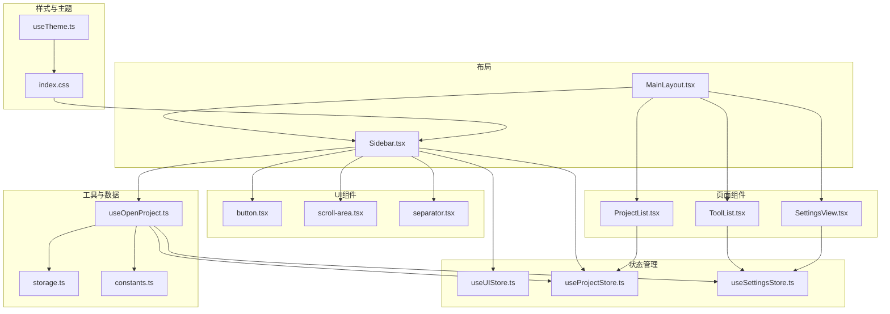
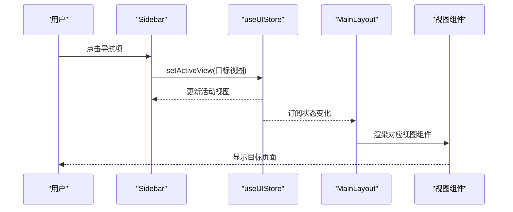
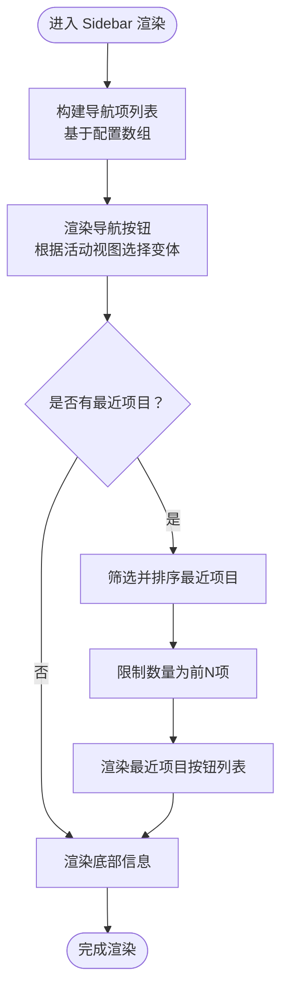
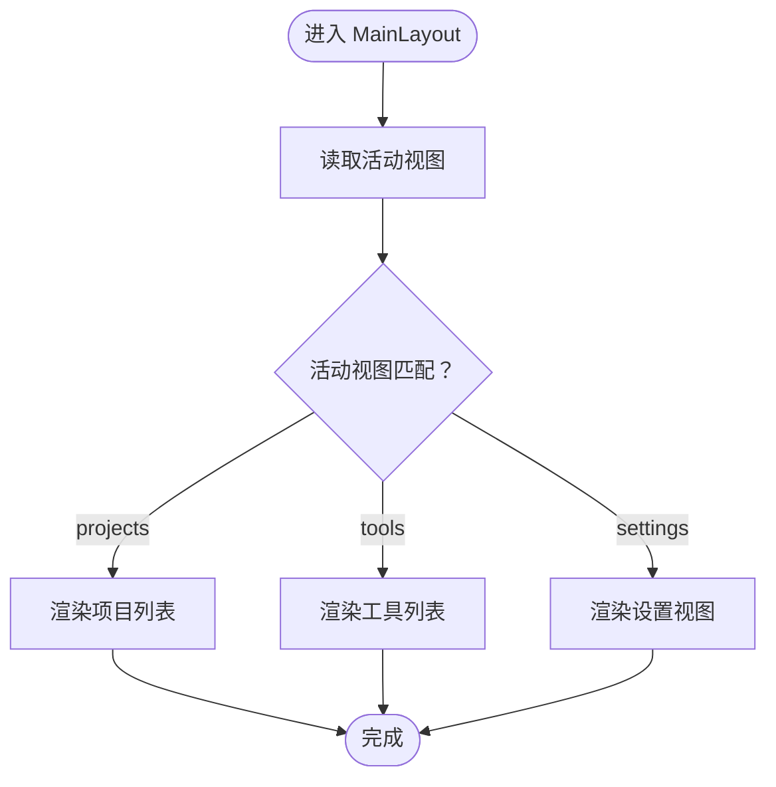
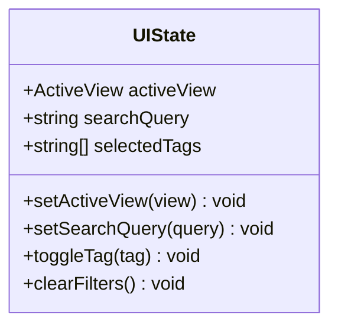
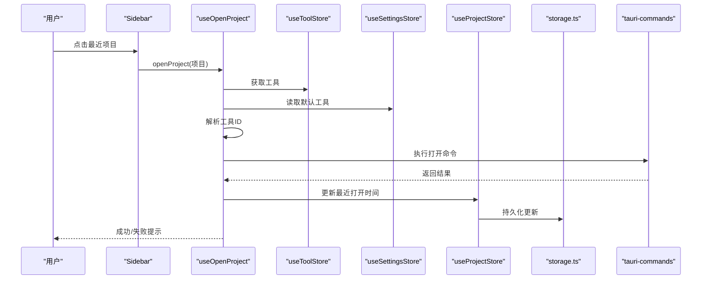
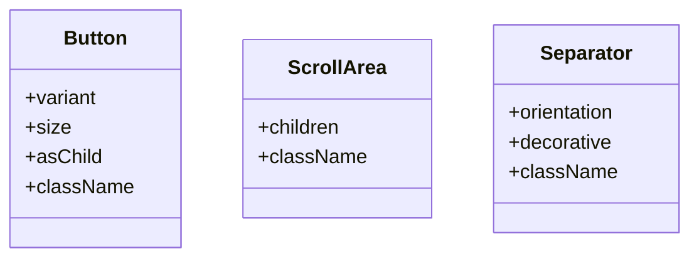
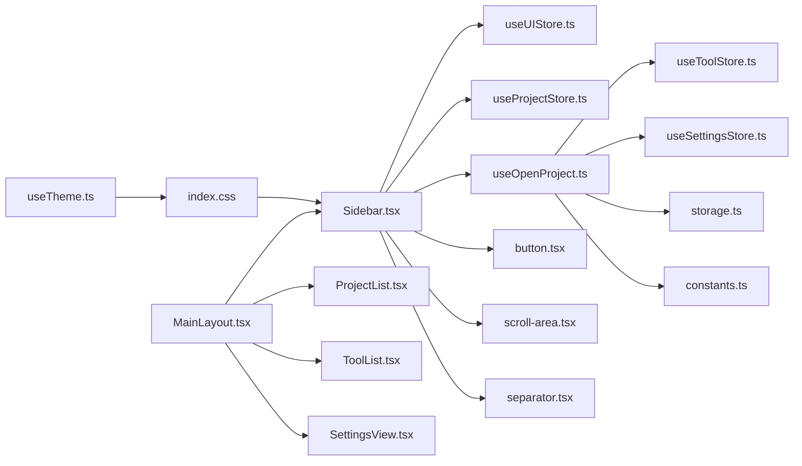

# 侧边栏导航

<cite>
**本文档引用的文件**
- [Sidebar.tsx](file://src/components/layout/Sidebar.tsx)
- [MainLayout.tsx](file://src/components/layout/MainLayout.tsx)
- [useUIStore.ts](file://src/stores/useUIStore.ts)
- [index.ts](file://src/types/index.ts)
- [useOpenProject.ts](file://src/hooks/useOpenProject.ts)
- [useProjectStore.ts](file://src/stores/useProjectStore.ts)
- [button.tsx](file://src/components/ui/button.tsx)
- [scroll-area.tsx](file://src/components/ui/scroll-area.tsx)
- [separator.tsx](file://src/components/ui/separator.tsx)
- [index.css](file://src/index.css)
- [useTheme.ts](file://src/hooks/useTheme.ts)
- [storage.ts](file://src/lib/storage.ts)
- [constants.ts](file://src/lib/constants.ts)
- [App.tsx](file://src/App.tsx)
</cite>

## 目录
1. [简介](#简介)
2. [项目结构](#项目结构)
3. [核心组件](#核心组件)
4. [架构总览](#架构总览)
5. [详细组件分析](#详细组件分析)
6. [依赖关系分析](#依赖关系分析)
7. [性能考虑](#性能考虑)
8. [故障排除指南](#故障排除指南)
9. [结论](#结论)
10. [附录](#附录)

## 简介
本文件针对应用中的侧边栏导航进行系统性文档化，重点覆盖以下方面：
- 导航架构与交互设计：导航项状态管理、图标系统与文本显示逻辑
- 路由切换机制：活动状态高亮与点击切换流程
- 配置化设计：导航项的可配置结构与动态生成
- 权限控制机制：当前实现未包含权限校验，但具备扩展点
- 折叠展开与键盘导航：当前未实现折叠展开与键盘导航，但具备扩展空间
- 无障碍访问：当前未实现ARIA标签与键盘可达性，具备改进空间
- 样式定制与主题适配：基于CSS变量的主题系统与Tailwind层叠
- 响应式行为：容器尺寸与滚动区域的响应式布局
- 性能优化与内存管理：状态存储、渲染优化与事件监听清理

## 项目结构
侧边栏导航位于布局模块中，通过全局UI状态驱动视图切换，并与项目列表、工具列表、设置视图等页面组合使用。

**图表来源**
- [MainLayout.tsx:1-21](file://src/components/layout/MainLayout.tsx#L1-L21)
- [Sidebar.tsx:1-80](file://src/components/layout/Sidebar.tsx#L1-L80)
- [useUIStore.ts:1-33](file://src/stores/useUIStore.ts#L1-L33)
- [useProjectStore.ts:1-67](file://src/stores/useProjectStore.ts#L1-L67)
- [useOpenProject.ts:1-44](file://src/hooks/useOpenProject.ts#L1-L44)
- [button.tsx:1-65](file://src/components/ui/button.tsx#L1-L65)
- [scroll-area.tsx:1-57](file://src/components/ui/scroll-area.tsx#L1-L57)
- [separator.tsx:1-29](file://src/components/ui/separator.tsx#L1-L29)
- [index.css:1-116](file://src/index.css#L1-L116)
- [useTheme.ts:1-37](file://src/hooks/useTheme.ts#L1-L37)
- [storage.ts:1-30](file://src/lib/storage.ts#L1-L30)
- [constants.ts:1-23](file://src/lib/constants.ts#L1-L23)

**章节来源**
- [MainLayout.tsx:1-21](file://src/components/layout/MainLayout.tsx#L1-L21)
- [Sidebar.tsx:1-80](file://src/components/layout/Sidebar.tsx#L1-L80)

## 核心组件
- 侧边栏组件（Sidebar）：负责导航项渲染、活动状态高亮、最近项目展示与打开操作。
- 主布局组件（MainLayout）：承载侧边栏与主内容区，根据活动视图渲染对应页面。
- UI状态存储（useUIStore）：维护当前活动视图（projects/tools/settings），提供切换方法。
- 项目状态存储（useProjectStore）：管理项目列表与最近打开时间更新。
- 打开项目钩子（useOpenProject）：解析默认工具、执行命令并更新最近打开时间。
- UI基础组件：按钮（Button）、滚动区域（ScrollArea）、分隔线（Separator）。
- 样式与主题：基于CSS变量的主题系统与Tailwind层叠。

**章节来源**
- [Sidebar.tsx:16-80](file://src/components/layout/Sidebar.tsx#L16-L80)
- [MainLayout.tsx:7-20](file://src/components/layout/MainLayout.tsx#L7-L20)
- [useUIStore.ts:14-32](file://src/stores/useUIStore.ts#L14-L32)
- [useProjectStore.ts:16-66](file://src/stores/useProjectStore.ts#L16-L66)
- [useOpenProject.ts:9-43](file://src/hooks/useOpenProject.ts#L9-L43)
- [button.tsx:41-62](file://src/components/ui/button.tsx#L41-L62)
- [scroll-area.tsx:6-27](file://src/components/ui/scroll-area.tsx#L6-L27)
- [separator.tsx:8-25](file://src/components/ui/separator.tsx#L8-L25)
- [index.css:26-64](file://src/index.css#L26-L64)

## 架构总览
侧边栏导航采用“配置化导航项 + 全局状态驱动”的架构模式：
- 导航项通过常量数组配置，包含标识、标签与图标。
- 点击导航项触发UI状态变更，主布局根据活动视图选择性渲染对应页面。
- 最近项目区域基于项目存储的数据动态生成，支持点击打开项目。
- 样式系统通过CSS变量与Tailwind层叠，支持明暗主题切换。

**图表来源**
- [Sidebar.tsx:34-44](file://src/components/layout/Sidebar.tsx#L34-L44)
- [useUIStore.ts:19](file://src/stores/useUIStore.ts#L19)
- [MainLayout.tsx:10-18](file://src/components/layout/MainLayout.tsx#L10-L18)

## 详细组件分析

### Sidebar 组件分析
- 导航项配置：通过常量数组定义导航项，包含唯一标识、显示标签与图标节点。
- 活动状态高亮：根据当前活动视图决定按钮变体（secondary/ghost），实现视觉高亮。
- 最近项目展示：从项目存储中筛选并排序最近打开的项目，限制数量后渲染为列表。
- 打开项目流程：点击最近项目项调用打开项目钩子，解析工具并执行命令，成功后更新最近打开时间。
- 可访问性：当前未添加ARIA属性或键盘导航支持，建议后续增强。

**图表来源**
- [Sidebar.tsx:10-14](file://src/components/layout/Sidebar.tsx#L10-L14)
- [Sidebar.tsx:33-44](file://src/components/layout/Sidebar.tsx#L33-L44)
- [Sidebar.tsx:22-25](file://src/components/layout/Sidebar.tsx#L22-L25)
- [Sidebar.tsx:47-72](file://src/components/layout/Sidebar.tsx#L47-L72)

**章节来源**
- [Sidebar.tsx:16-80](file://src/components/layout/Sidebar.tsx#L16-L80)

### MainLayout 组件分析
- 视图渲染：依据活动视图条件渲染项目列表、工具列表或设置视图。
- 容器布局：侧边栏固定宽度，主内容区自适应填充剩余空间。

**图表来源**
- [MainLayout.tsx:7-20](file://src/components/layout/MainLayout.tsx#L7-L20)

**章节来源**
- [MainLayout.tsx:1-21](file://src/components/layout/MainLayout.tsx#L1-L21)

### UI 状态管理分析
- 状态结构：包含活动视图、搜索查询、选中标签集合及对应的setter与辅助方法。
- 切换机制：通过setter直接更新活动视图，触发订阅组件重新渲染。
- 过滤器管理：支持切换标签、清空过滤器等操作。

**图表来源**
- [useUIStore.ts:4-12](file://src/stores/useUIStore.ts#L4-L12)
- [useUIStore.ts:14-32](file://src/stores/useUIStore.ts#L14-L32)

**章节来源**
- [useUIStore.ts:1-33](file://src/stores/useUIStore.ts#L1-L33)

### 项目状态与打开项目流程
- 最近项目生成：从项目列表中筛选具有最近打开时间的条目，按时间降序取前N项。
- 打开项目逻辑：解析默认工具（项目默认、设置默认、无默认时提示），执行命令并更新最近打开时间；异常时通过消息提示反馈。

**图表来源**
- [Sidebar.tsx:58-68](file://src/components/layout/Sidebar.tsx#L58-L68)
- [useOpenProject.ts:15-42](file://src/hooks/useOpenProject.ts#L15-L42)
- [useProjectStore.ts:58-65](file://src/stores/useProjectStore.ts#L58-L65)
- [storage.ts:19-29](file://src/lib/storage.ts#L19-L29)
- [constants.ts:3-18](file://src/lib/constants.ts#L3-L18)

**章节来源**
- [Sidebar.tsx:22-25](file://src/components/layout/Sidebar.tsx#L22-L25)
- [useOpenProject.ts:1-44](file://src/hooks/useOpenProject.ts#L1-L44)
- [useProjectStore.ts:1-67](file://src/stores/useProjectStore.ts#L1-L67)
- [storage.ts:1-30](file://src/lib/storage.ts#L1-L30)
- [constants.ts:1-23](file://src/lib/constants.ts#L1-L23)

### UI 组件与样式系统
- 按钮组件：支持多种变体与尺寸，用于导航项与最近项目项的统一渲染。
- 滚动区域：为最近项目列表提供滚动能力，避免溢出。
- 分隔线：用于最近项目标题与内容之间的视觉分隔。
- 样式系统：通过CSS变量定义主题色值，Tailwind层叠提供原子类，支持明/暗/系统主题。

**图表来源**
- [button.tsx:41-62](file://src/components/ui/button.tsx#L41-L62)
- [scroll-area.tsx:6-27](file://src/components/ui/scroll-area.tsx#L6-L27)
- [separator.tsx:8-25](file://src/components/ui/separator.tsx#L8-L25)

**章节来源**
- [button.tsx:1-65](file://src/components/ui/button.tsx#L1-L65)
- [scroll-area.tsx:1-57](file://src/components/ui/scroll-area.tsx#L1-L57)
- [separator.tsx:1-29](file://src/components/ui/separator.tsx#L1-L29)
- [index.css:1-116](file://src/index.css#L1-L116)

## 依赖关系分析
- 组件耦合：Sidebar依赖UI状态、项目存储与打开项目钩子；MainLayout依赖Sidebar与各视图组件。
- 外部依赖：使用Zustand进行状态管理，Radix UI组件提供可访问性基础，Tailwind与CSS变量提供样式系统。
- 数据流：状态变更 → 组件重渲染 → 页面切换；项目更新 → 存储持久化。

**图表来源**
- [Sidebar.tsx:1-80](file://src/components/layout/Sidebar.tsx#L1-L80)
- [MainLayout.tsx:1-21](file://src/components/layout/MainLayout.tsx#L1-L21)
- [useUIStore.ts:1-33](file://src/stores/useUIStore.ts#L1-L33)
- [useProjectStore.ts:1-67](file://src/stores/useProjectStore.ts#L1-L67)
- [useOpenProject.ts:1-44](file://src/hooks/useOpenProject.ts#L1-L44)
- [button.tsx:1-65](file://src/components/ui/button.tsx#L1-L65)
- [scroll-area.tsx:1-57](file://src/components/ui/scroll-area.tsx#L1-L57)
- [separator.tsx:1-29](file://src/components/ui/separator.tsx#L1-L29)
- [index.css:1-116](file://src/index.css#L1-L116)
- [useTheme.ts:1-37](file://src/hooks/useTheme.ts#L1-L37)
- [storage.ts:1-30](file://src/lib/storage.ts#L1-L30)
- [constants.ts:1-23](file://src/lib/constants.ts#L1-L23)

**章节来源**
- [Sidebar.tsx:1-80](file://src/components/layout/Sidebar.tsx#L1-L80)
- [MainLayout.tsx:1-21](file://src/components/layout/MainLayout.tsx#L1-L21)

## 性能考虑
- 渲染优化
  - 导航项与最近项目列表均使用稳定键（id）进行映射，减少不必要的重渲染。
  - 最近项目在组件内部进行筛选与排序，避免在渲染外重复计算。
- 状态管理
  - 使用Zustand进行细粒度状态订阅，仅在相关状态变化时触发重渲染。
- I/O 与持久化
  - 项目与设置存储使用延迟加载与自动保存，降低I/O开销。
- 可访问性与键盘导航
  - 当前未实现键盘可达性与ARIA标签，建议后续补充以提升可用性。
- 折叠展开
  - 当前未实现折叠展开功能，建议通过状态位控制宽度与内容显隐，并保持动画流畅。

[本节为通用指导，无需具体文件来源]

## 故障排除指南
- 导航项无高亮
  - 检查活动视图是否正确设置，确认UI状态中的当前视图与导航项标识一致。
  - 参考路径：[useUIStore.ts:19](file://src/stores/useUIStore.ts#L19)，[Sidebar.tsx:37](file://src/components/layout/Sidebar.tsx#L37)
- 最近项目不显示
  - 确认项目列表存在且包含最近打开时间字段，检查筛选与排序逻辑。
  - 参考路径：[Sidebar.tsx:22-25](file://src/components/layout/Sidebar.tsx#L22-L25)
- 打不开项目
  - 检查工具解析逻辑与命令执行，确认默认工具配置与存储状态。
  - 参考路径：[useOpenProject.ts:15-42](file://src/hooks/useOpenProject.ts#L15-L42)，[storage.ts:19-29](file://src/lib/storage.ts#L19-L29)
- 主题切换无效
  - 确认主题设置已更新并触发DOM类名变更，检查媒体查询监听。
  - 参考路径：[useTheme.ts:8-29](file://src/hooks/useTheme.ts#L8-L29)，[index.css:36-64](file://src/index.css#L36-L64)

**章节来源**
- [useUIStore.ts:19](file://src/stores/useUIStore.ts#L19)
- [Sidebar.tsx:22-25](file://src/components/layout/Sidebar.tsx#L22-L25)
- [useOpenProject.ts:15-42](file://src/hooks/useOpenProject.ts#L15-L42)
- [storage.ts:19-29](file://src/lib/storage.ts#L19-L29)
- [useTheme.ts:8-29](file://src/hooks/useTheme.ts#L8-L29)
- [index.css:36-64](file://src/index.css#L36-L64)

## 结论
侧边栏导航采用简洁清晰的配置化与状态驱动架构，具备良好的可扩展性与可维护性。当前实现聚焦于核心导航与最近项目功能，主题系统完善，样式体系完整。后续可在以下方面进一步增强：
- 可访问性：增加ARIA角色与键盘导航支持
- 功能扩展：实现导航折叠展开与快捷键绑定
- 权限控制：在导航项层面增加权限校验与条件渲染
- 性能优化：对频繁更新的列表进行虚拟化与懒加载

[本节为总结性内容，无需具体文件来源]

## 附录
- 类型定义概览：项目、工具、设置与活动视图类型定义，支撑导航与状态管理。
- 默认工具与设置：内置工具清单与默认设置，作为工具解析与主题初始化的基础。

**章节来源**
- [index.ts:1-26](file://src/types/index.ts#L1-L26)
- [constants.ts:3-18](file://src/lib/constants.ts#L3-L18)
- [constants.ts:20-22](file://src/lib/constants.ts#L20-L22)