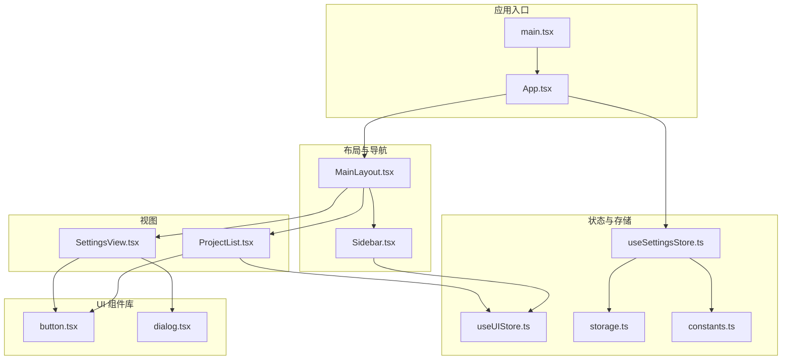
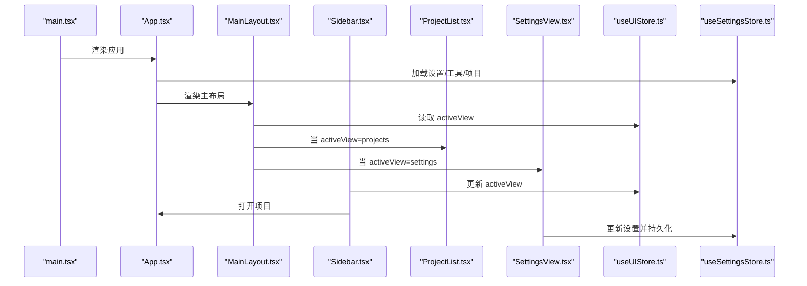
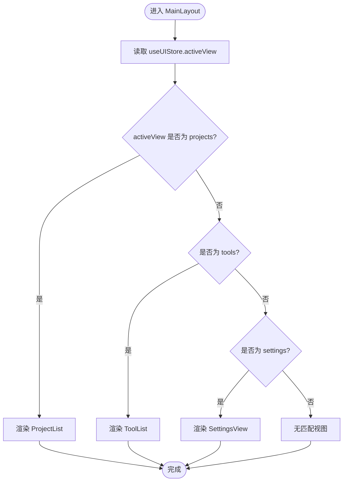
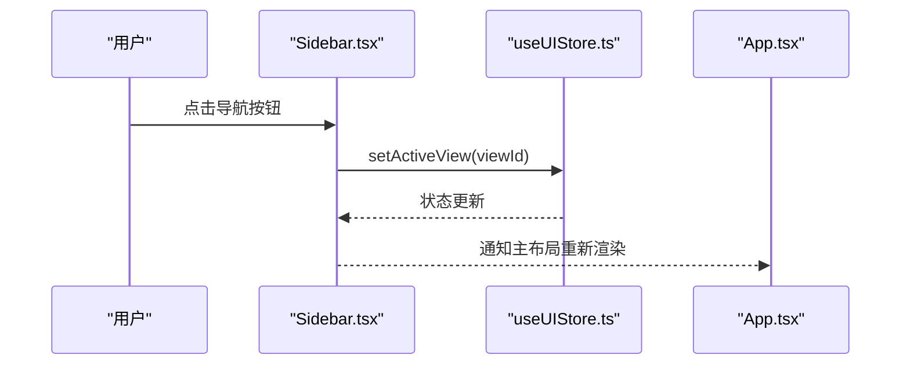
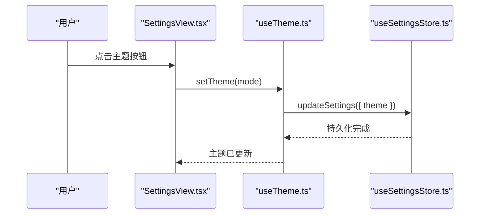
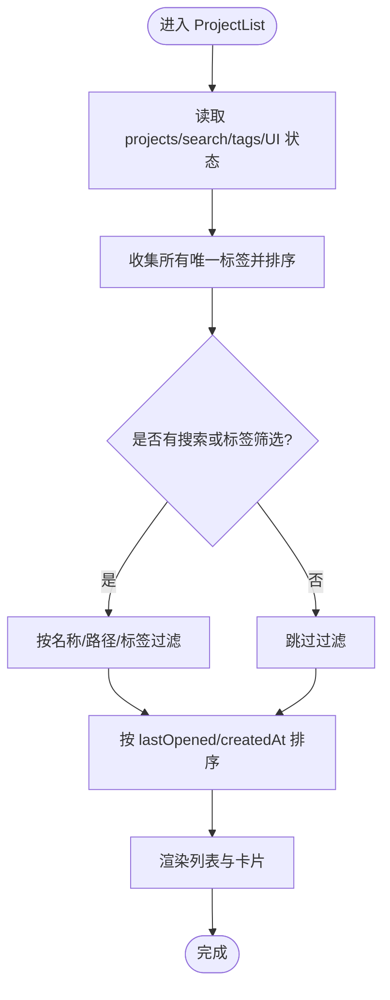
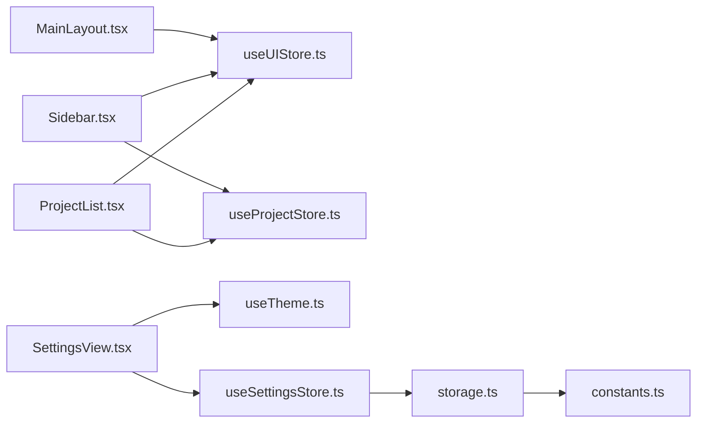

# 用户界面模块

<cite>
**本文引用的文件**
- [src/App.tsx](file://src/App.tsx)
- [src/main.tsx](file://src/main.tsx)
- [src/components/layout/MainLayout.tsx](file://src/components/layout/MainLayout.tsx)
- [src/components/layout/Sidebar.tsx](file://src/components/layout/Sidebar.tsx)
- [src/components/settings/SettingsView.tsx](file://src/components/settings/SettingsView.tsx)
- [src/components/project/ProjectList.tsx](file://src/components/project/ProjectList.tsx)
- [src/components/ui/button.tsx](file://src/components/ui/button.tsx)
- [src/components/ui/dialog.tsx](file://src/components/ui/dialog.tsx)
- [src/hooks/useTheme.ts](file://src/hooks/useTheme.ts)
- [src/stores/useUIStore.ts](file://src/stores/useUIStore.ts)
- [src/stores/useSettingsStore.ts](file://src/stores/useSettingsStore.ts)
- [src/lib/storage.ts](file://src/lib/storage.ts)
- [src/lib/constants.ts](file://src/lib/constants.ts)
- [src/types/index.ts](file://src/types/index.ts)
</cite>

## 目录
1. [简介](#简介)
2. [项目结构](#项目结构)
3. [核心组件](#核心组件)
4. [架构总览](#架构总览)
5. [详细组件分析](#详细组件分析)
6. [依赖关系分析](#依赖关系分析)
7. [性能考量](#性能考量)
8. [故障排除指南](#故障排除指南)
9. [结论](#结论)
10. [附录](#附录)

## 简介
本文件系统性梳理用户界面模块的设计与实现，重点覆盖主布局、侧边栏导航、设置面板、主题切换机制、窗口管理与响应式策略、布局组件组合与状态传递、导航路由与页面标题管理、界面定制化配置与扩展点、无障碍与跨平台兼容性、动画与过渡体验优化，以及设置项的数据绑定与实时预览机制。目标是帮助开发者与产品人员快速理解并高效扩展界面层。

## 项目结构
界面模块采用“布局组件 + 功能视图 + UI 组件库 + 状态存储 + 工具函数”的分层组织方式：
- 布局层：MainLayout 负责整体布局与视图切换；Sidebar 提供导航与最近项目列表。
- 视图层：ProjectList 展示项目列表与筛选；SettingsView 提供设置与主题切换。
- UI 组件库：button、dialog 等通用组件，统一风格与交互行为。
- 状态层：useUIStore 管理 UI 状态（当前视图、搜索、标签过滤）；useSettingsStore 管理设置持久化与更新。
- 工具与常量：storage 提供 Tauri Store 持久化；constants 定义默认工具与默认设置；utils 提供样式合并工具。

图表来源
- [src/main.tsx:1-11](file://src/main.tsx#L1-L11)
- [src/App.tsx:1-40](file://src/App.tsx#L1-L40)
- [src/components/layout/MainLayout.tsx:1-21](file://src/components/layout/MainLayout.tsx#L1-L21)
- [src/components/layout/Sidebar.tsx:1-80](file://src/components/layout/Sidebar.tsx#L1-L80)
- [src/components/project/ProjectList.tsx:1-168](file://src/components/project/ProjectList.tsx#L1-L168)
- [src/components/settings/SettingsView.tsx:1-111](file://src/components/settings/SettingsView.tsx#L1-L111)
- [src/components/ui/button.tsx:1-65](file://src/components/ui/button.tsx#L1-L65)
- [src/components/ui/dialog.tsx:1-157](file://src/components/ui/dialog.tsx#L1-L157)
- [src/stores/useUIStore.ts:1-33](file://src/stores/useUIStore.ts#L1-L33)
- [src/stores/useSettingsStore.ts:1-34](file://src/stores/useSettingsStore.ts#L1-L34)
- [src/lib/storage.ts:1-30](file://src/lib/storage.ts#L1-L30)
- [src/lib/constants.ts:1-23](file://src/lib/constants.ts#L1-L23)

章节来源
- [src/main.tsx:1-11](file://src/main.tsx#L1-L11)
- [src/App.tsx:1-40](file://src/App.tsx#L1-L40)

## 核心组件
- 主布局 MainLayout：负责容器布局与根据 UI 状态 activeView 切换渲染不同视图。
- 侧边栏 Sidebar：提供导航按钮与最近项目列表，支持打开项目与切换视图。
- 设置视图 SettingsView：提供主题切换（亮/暗/跟随系统）、默认工具选择、数据目录查看等设置项。
- 项目列表 ProjectList：提供搜索、标签筛选、排序与新增项目对话框。
- UI 组件库：button、dialog 等，统一交互与视觉风格。
- 状态存储：useUIStore 管理 UI 状态；useSettingsStore 管理设置加载与更新，并通过 LazyStore 持久化。

章节来源
- [src/components/layout/MainLayout.tsx:1-21](file://src/components/layout/MainLayout.tsx#L1-L21)
- [src/components/layout/Sidebar.tsx:1-80](file://src/components/layout/Sidebar.tsx#L1-L80)
- [src/components/settings/SettingsView.tsx:1-111](file://src/components/settings/SettingsView.tsx#L1-L111)
- [src/components/project/ProjectList.tsx:1-168](file://src/components/project/ProjectList.tsx#L1-L168)
- [src/components/ui/button.tsx:1-65](file://src/components/ui/button.tsx#L1-L65)
- [src/components/ui/dialog.tsx:1-157](file://src/components/ui/dialog.tsx#L1-L157)
- [src/stores/useUIStore.ts:1-33](file://src/stores/useUIStore.ts#L1-L33)
- [src/stores/useSettingsStore.ts:1-34](file://src/stores/useSettingsStore.ts#L1-L34)

## 架构总览
界面模块遵循“单向数据流 + 组合组件”模式：
- 应用入口初始化 TooltipProvider 与全局通知，挂载 MainLayout。
- MainLayout 读取 useUIStore 的 activeView 并渲染对应视图。
- Sidebar 通过 useUIStore 切换视图，并使用 useProjectStore 获取最近项目，结合 useOpenProject 打开项目。
- SettingsView 通过 useTheme 与 useSettingsStore 实现主题切换与设置更新，同时调用 Tauri 命令查询数据目录。
- ProjectList 使用 useUIStore 进行搜索与标签过滤，使用 useProjectStore 获取项目数据，并通过 ProjectFormDialog 新增项目。

图表来源
- [src/main.tsx:1-11](file://src/main.tsx#L1-L11)
- [src/App.tsx:1-40](file://src/App.tsx#L1-L40)
- [src/components/layout/MainLayout.tsx:1-21](file://src/components/layout/MainLayout.tsx#L1-L21)
- [src/components/layout/Sidebar.tsx:1-80](file://src/components/layout/Sidebar.tsx#L1-L80)
- [src/components/project/ProjectList.tsx:1-168](file://src/components/project/ProjectList.tsx#L1-L168)
- [src/components/settings/SettingsView.tsx:1-111](file://src/components/settings/SettingsView.tsx#L1-L111)
- [src/stores/useUIStore.ts:1-33](file://src/stores/useUIStore.ts#L1-L33)
- [src/stores/useSettingsStore.ts:1-34](file://src/stores/useSettingsStore.ts#L1-L34)

## 详细组件分析

### 主布局 MainLayout
- 职责：容器布局与视图切换。通过 useUIStore 的 activeView 决定渲染 ProjectList、ToolList 或 SettingsView。
- 关键点：使用 flex 布局，左侧固定宽度侧边栏，右侧主区域自适应填充；容器高度设为全屏并隐藏溢出以配合滚动区域。

图表来源
- [src/components/layout/MainLayout.tsx:1-21](file://src/components/layout/MainLayout.tsx#L1-L21)
- [src/stores/useUIStore.ts:1-33](file://src/stores/useUIStore.ts#L1-L33)

章节来源
- [src/components/layout/MainLayout.tsx:1-21](file://src/components/layout/MainLayout.tsx#L1-L21)

### 侧边栏 Sidebar
- 导航项：项目、工具、设置三类视图，点击后通过 useUIStore.setActiveView 切换。
- 最近项目：从 useProjectStore 读取项目列表，按最后打开时间倒序取前五条，点击后触发打开项目逻辑。
- 结构：顶部品牌区、导航按钮区、分隔线、最近项目标题与滚动区域、底部版本信息。

图表来源
- [src/components/layout/Sidebar.tsx:1-80](file://src/components/layout/Sidebar.tsx#L1-L80)
- [src/stores/useUIStore.ts:1-33](file://src/stores/useUIStore.ts#L1-L33)
- [src/App.tsx:1-40](file://src/App.tsx#L1-L40)

章节来源
- [src/components/layout/Sidebar.tsx:1-80](file://src/components/layout/Sidebar.tsx#L1-L80)

### 设置视图 SettingsView
- 主题切换：通过 useTheme 返回的 setTheme 更新设置，useTheme 在 useEffect 中根据 light/dark/system 切换根元素 class，并监听系统配色变化。
- 默认工具：使用 Select 下拉选择默认工具，变更时调用 useSettingsStore.updateSettings 持久化。
- 数据目录：调用 Tauri 命令获取应用数据目录并在界面上展示。
- UI 组件：使用 Card、Select、Button、Separator 等组件构建设置项。

图表来源
- [src/components/settings/SettingsView.tsx:1-111](file://src/components/settings/SettingsView.tsx#L1-L111)
- [src/hooks/useTheme.ts:1-37](file://src/hooks/useTheme.ts#L1-L37)
- [src/stores/useSettingsStore.ts:1-34](file://src/stores/useSettingsStore.ts#L1-L34)

章节来源
- [src/components/settings/SettingsView.tsx:1-111](file://src/components/settings/SettingsView.tsx#L1-L111)
- [src/hooks/useTheme.ts:1-37](file://src/hooks/useTheme.ts#L1-L37)
- [src/stores/useSettingsStore.ts:1-34](file://src/stores/useSettingsStore.ts#L1-L34)

### 项目列表 ProjectList
- 搜索与筛选：通过 useUIStore 的 searchQuery 与 selectedTags 过滤项目；支持清空筛选。
- 排序：优先按 lastOpened 倒序，其次按 createdAt 倒序。
- 新增项目：通过 ProjectFormDialog 弹窗进行表单提交。
- UI：顶部搜索输入与清空按钮、标签徽章筛选、滚动区域展示卡片列表。

图表来源
- [src/components/project/ProjectList.tsx:1-168](file://src/components/project/ProjectList.tsx#L1-L168)
- [src/stores/useUIStore.ts:1-33](file://src/stores/useUIStore.ts#L1-L33)

章节来源
- [src/components/project/ProjectList.tsx:1-168](file://src/components/project/ProjectList.tsx#L1-L168)

### UI 组件库
- Button：基于变体与尺寸的样式变体，支持 asChild、SVG 图标、焦点可见轮廓等。
- Dialog：基于 Radix Dialog 的封装，内置动画入场/出场与关闭按钮，支持可选关闭按钮。

章节来源
- [src/components/ui/button.tsx:1-65](file://src/components/ui/button.tsx#L1-L65)
- [src/components/ui/dialog.tsx:1-157](file://src/components/ui/dialog.tsx#L1-L157)

### 状态与存储
- useUIStore：维护 activeView、searchQuery、selectedTags，并提供切换视图、设置搜索、切换标签、清空筛选等方法。
- useSettingsStore：维护 settings 与加载状态，提供加载与更新设置的方法，内部通过 LazyStore 持久化到 JSON 文件。
- storage：封装 LazyStore，分别管理 projects.json、tools.json、settings.json。
- constants：定义内置工具列表与默认设置。

章节来源
- [src/stores/useUIStore.ts:1-33](file://src/stores/useUIStore.ts#L1-L33)
- [src/stores/useSettingsStore.ts:1-34](file://src/stores/useSettingsStore.ts#L1-L34)
- [src/lib/storage.ts:1-30](file://src/lib/storage.ts#L1-L30)
- [src/lib/constants.ts:1-23](file://src/lib/constants.ts#L1-L23)

## 依赖关系分析
- 组件耦合：MainLayout 仅依赖 useUIStore 的 activeView；Sidebar 依赖 useUIStore 与 useProjectStore；SettingsView 依赖 useTheme 与 useSettingsStore；ProjectList 依赖 useProjectStore 与 useUIStore。
- 外部依赖：Tauri LazyStore 用于本地持久化；Radix UI 用于无障碍与可访问性；Lucide React 图标库。
- 可能的循环依赖：当前未发现直接循环导入；各 store 通过独立文件导出，避免相互引用。

图表来源
- [src/components/layout/MainLayout.tsx:1-21](file://src/components/layout/MainLayout.tsx#L1-L21)
- [src/components/layout/Sidebar.tsx:1-80](file://src/components/layout/Sidebar.tsx#L1-L80)
- [src/components/project/ProjectList.tsx:1-168](file://src/components/project/ProjectList.tsx#L1-L168)
- [src/components/settings/SettingsView.tsx:1-111](file://src/components/settings/SettingsView.tsx#L1-L111)
- [src/hooks/useTheme.ts:1-37](file://src/hooks/useTheme.ts#L1-L37)
- [src/stores/useUIStore.ts:1-33](file://src/stores/useUIStore.ts#L1-L33)
- [src/stores/useSettingsStore.ts:1-34](file://src/stores/useSettingsStore.ts#L1-L34)
- [src/lib/storage.ts:1-30](file://src/lib/storage.ts#L1-L30)
- [src/lib/constants.ts:1-23](file://src/lib/constants.ts#L1-L23)

章节来源
- [src/types/index.ts:1-26](file://src/types/index.ts#L1-L26)

## 性能考量
- 计算优化：ProjectList 使用 useMemo 对标签集合与过滤结果进行缓存，减少重复计算。
- 渲染优化：MainLayout 仅在 activeView 变更时切换渲染内容；Sidebar 使用固定宽度与滚动区域，避免布局抖动。
- 存储优化：LazyStore 自动保存，避免频繁写入；设置与工具初始值来自 constants，减少首次读取失败概率。
- 动画与过渡：Dialog 组件内置入场/出场动画，提升交互感知；Button 支持平滑过渡与焦点可见轮廓，改善可用性。

章节来源
- [src/components/project/ProjectList.tsx:1-168](file://src/components/project/ProjectList.tsx#L1-L168)
- [src/components/ui/dialog.tsx:1-157](file://src/components/ui/dialog.tsx#L1-L157)
- [src/components/ui/button.tsx:1-65](file://src/components/ui/button.tsx#L1-L65)
- [src/lib/storage.ts:1-30](file://src/lib/storage.ts#L1-L30)
- [src/lib/constants.ts:1-23](file://src/lib/constants.ts#L1-L23)

## 故障排除指南
- 主题不生效：检查 useTheme 是否正确设置根元素 class，确认系统配色监听是否正常注册与清理。
- 设置未持久化：确认 useSettingsStore.updateSettings 是否被调用，LazyStore 是否成功写入 JSON 文件。
- 项目列表为空：检查 useProjectStore 是否成功加载数据，确认过滤条件是否过于严格。
- 对话框无法关闭：确认 Dialog 组件的 Portal 与 Overlay 是否正确渲染，关闭按钮事件是否绑定。
- 最近项目不显示：检查 useProjectStore 的 projects 数据结构与 lastOpened 字段是否存在。

章节来源
- [src/hooks/useTheme.ts:1-37](file://src/hooks/useTheme.ts#L1-L37)
- [src/stores/useSettingsStore.ts:1-34](file://src/stores/useSettingsStore.ts#L1-L34)
- [src/components/ui/dialog.tsx:1-157](file://src/components/ui/dialog.tsx#L1-L157)

## 结论
用户界面模块以清晰的分层与组合模式实现了主布局、侧边导航、设置面板与项目列表等功能。通过 Zustand 管理 UI 与设置状态，结合 Tauri LazyStore 实现本地持久化，确保了良好的性能与可维护性。主题切换、搜索与标签筛选、对话框交互等均具备良好的可访问性与用户体验。后续可在路由与面包屑、页面标题管理、无障碍增强与跨平台一致性方面进一步完善。

## 附录

### 主题切换机制
- 模式：light、dark、system。
- 行为：light/dark 直接设置根元素 class；system 监听系统配色变化并动态切换。
- 触发：SettingsView 的按钮调用 setTheme，useSettingsStore.updateSettings 持久化。

章节来源
- [src/hooks/useTheme.ts:1-37](file://src/hooks/useTheme.ts#L1-L37)
- [src/components/settings/SettingsView.tsx:1-111](file://src/components/settings/SettingsView.tsx#L1-L111)
- [src/stores/useSettingsStore.ts:1-34](file://src/stores/useSettingsStore.ts#L1-L34)

### 窗口管理与响应式设计
- 全屏布局：MainLayout 使用 h-screen 与 flex 布局，确保主区域自适应窗口大小。
- 滚动区域：Sidebar 与 ProjectList 使用 ScrollArea，避免内容溢出影响布局。
- 尺寸与间距：Button 与 Dialog 组件提供多种尺寸与间距，适配不同屏幕密度。

章节来源
- [src/components/layout/MainLayout.tsx:1-21](file://src/components/layout/MainLayout.tsx#L1-L21)
- [src/components/layout/Sidebar.tsx:1-80](file://src/components/layout/Sidebar.tsx#L1-L80)
- [src/components/project/ProjectList.tsx:1-168](file://src/components/project/ProjectList.tsx#L1-L168)
- [src/components/ui/button.tsx:1-65](file://src/components/ui/button.tsx#L1-L65)
- [src/components/ui/dialog.tsx:1-157](file://src/components/ui/dialog.tsx#L1-L157)

### 布局组件组合与状态传递
- 组合模式：MainLayout 作为容器，内部组合 Sidebar 与多个视图组件；Sidebar 与视图组件各自管理自身状态并通过 store 通信。
- 状态传递：useUIStore 管理 activeView、搜索与标签；useSettingsStore 管理设置；二者通过各自的 selector 在组件中订阅所需字段。

章节来源
- [src/components/layout/MainLayout.tsx:1-21](file://src/components/layout/MainLayout.tsx#L1-L21)
- [src/stores/useUIStore.ts:1-33](file://src/stores/useUIStore.ts#L1-L33)
- [src/stores/useSettingsStore.ts:1-34](file://src/stores/useSettingsStore.ts#L1-L34)

### 导航路由、面包屑与页面标题
- 当前实现：通过 useUIStore.activeView 控制视图切换，未引入集中式路由与面包屑导航。
- 建议：引入路由库（如 react-router）以支持 URL 同步与浏览器前进后退；在每个视图组件内设置页面标题；在导航组件中集成面包屑。

章节来源
- [src/stores/useUIStore.ts:1-33](file://src/stores/useUIStore.ts#L1-L33)

### 界面定制化配置与扩展点
- 主题：支持 light/dark/system 三种模式。
- 默认工具：通过 Select 下拉选择，便于扩展更多工具。
- 配置扩展：SettingsView 可增加更多设置项（如语言、快捷键、外观细节），通过 useSettingsStore.updateSettings 持久化。

章节来源
- [src/components/settings/SettingsView.tsx:1-111](file://src/components/settings/SettingsView.tsx#L1-L111)
- [src/stores/useSettingsStore.ts:1-34](file://src/stores/useSettingsStore.ts#L1-L34)
- [src/lib/constants.ts:1-23](file://src/lib/constants.ts#L1-L23)

### 无障碍设计与跨平台兼容性
- 无障碍：Button 与 Dialog 组件提供焦点可见轮廓与键盘可达性；使用语义化标签与屏幕阅读器友好的文案。
- 跨平台：Tauri LazyStore 在桌面端提供一致的本地存储；图标与组件样式在不同系统上保持一致。

章节来源
- [src/components/ui/button.tsx:1-65](file://src/components/ui/button.tsx#L1-L65)
- [src/components/ui/dialog.tsx:1-157](file://src/components/ui/dialog.tsx#L1-L157)
- [src/lib/storage.ts:1-30](file://src/lib/storage.ts#L1-L30)

### 动画效果、过渡与用户体验
- 动画：Dialog 内置入场/出场动画与缩放效果；Button 支持过渡与悬停反馈。
- 体验：TooltipProvider 提供延迟提示；Sonner 通知在右下角显示；搜索输入支持一键清空。

章节来源
- [src/components/ui/dialog.tsx:1-157](file://src/components/ui/dialog.tsx#L1-L157)
- [src/components/ui/button.tsx:1-65](file://src/components/ui/button.tsx#L1-L65)
- [src/App.tsx:1-40](file://src/App.tsx#L1-L40)

### 设置项的数据绑定与实时预览
- 数据绑定：SettingsView 通过 useTheme 与 useSettingsStore 的 selector 订阅主题与设置；Select 绑定默认工具 ID。
- 实时预览：主题切换即时更新根元素 class；设置更新通过 LazyStore 立即持久化；数据目录按钮调用命令后即时显示结果。

章节来源
- [src/components/settings/SettingsView.tsx:1-111](file://src/components/settings/SettingsView.tsx#L1-L111)
- [src/hooks/useTheme.ts:1-37](file://src/hooks/useTheme.ts#L1-L37)
- [src/stores/useSettingsStore.ts:1-34](file://src/stores/useSettingsStore.ts#L1-L34)
- [src/lib/storage.ts:1-30](file://src/lib/storage.ts#L1-L30)