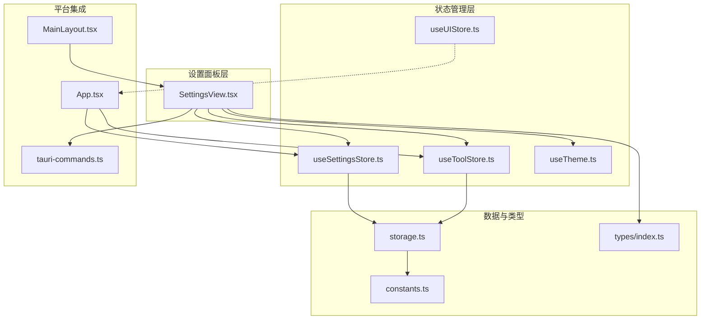
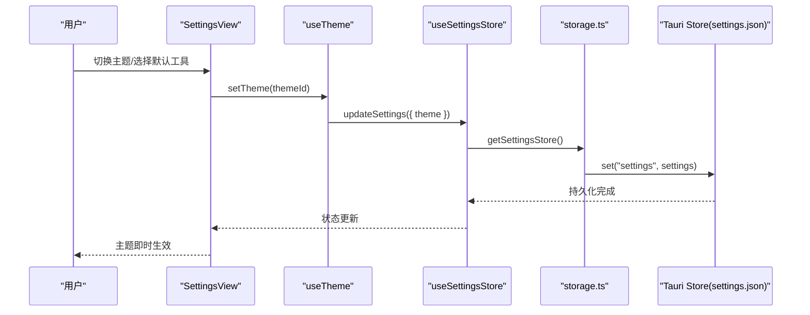
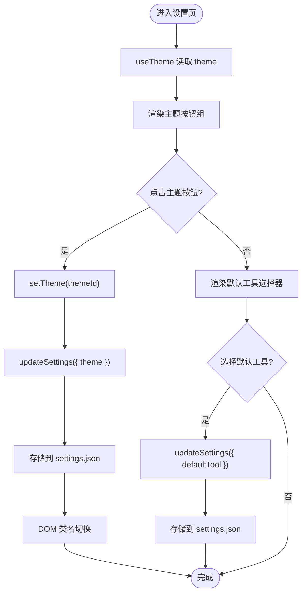
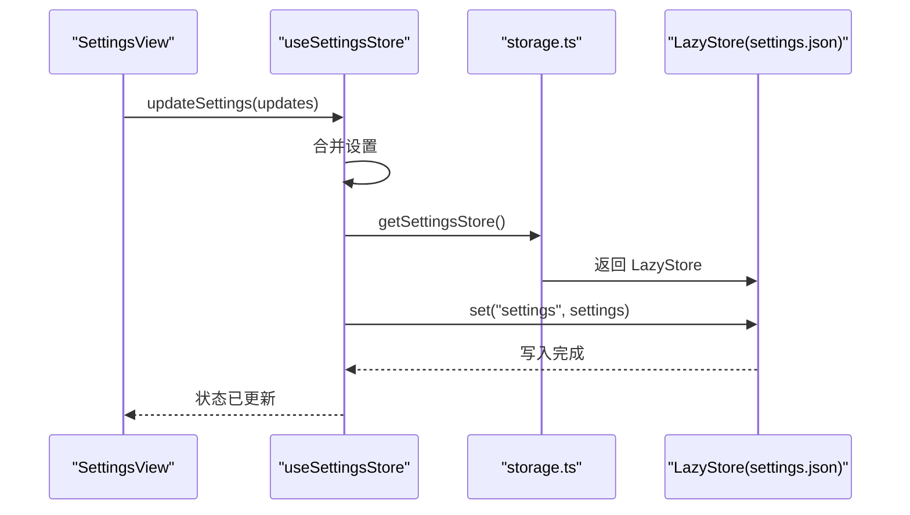
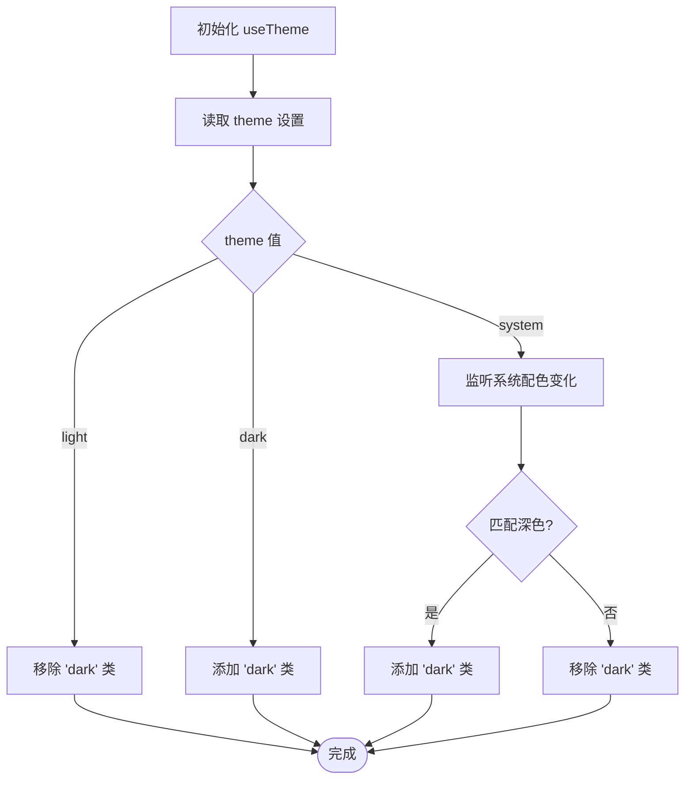
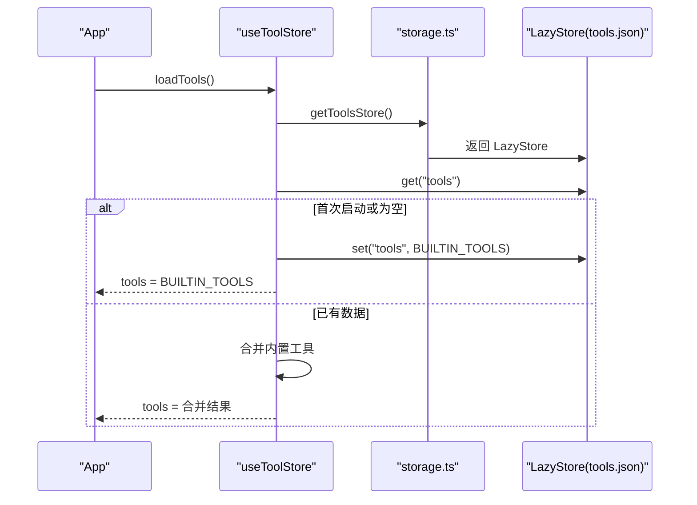
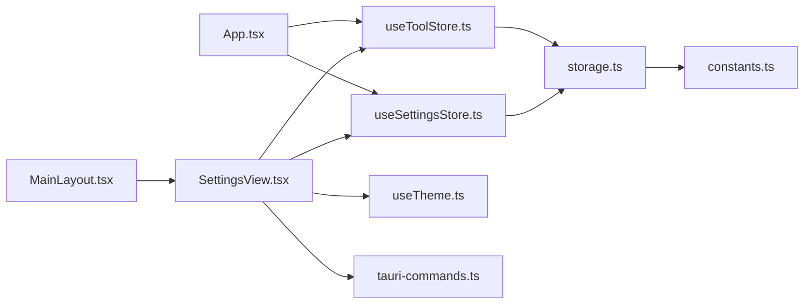

# 设置面板

<cite>
**本文引用的文件**
- [SettingsView.tsx](file://src/components/settings/SettingsView.tsx)
- [useSettingsStore.ts](file://src/stores/useSettingsStore.ts)
- [storage.ts](file://src/lib/storage.ts)
- [constants.ts](file://src/lib/constants.ts)
- [types/index.ts](file://src/types/index.ts)
- [useTheme.ts](file://src/hooks/useTheme.ts)
- [useToolStore.ts](file://src/stores/useToolStore.ts)
- [tauri-commands.ts](file://src/lib/tauri-commands.ts)
- [MainLayout.tsx](file://src/components/layout/MainLayout.tsx)
- [App.tsx](file://src/App.tsx)
- [useUIStore.ts](file://src/stores/useUIStore.ts)
</cite>

## 目录
1. [简介](#简介)
2. [项目结构](#项目结构)
3. [核心组件](#核心组件)
4. [架构总览](#架构总览)
5. [详细组件分析](#详细组件分析)
6. [依赖关系分析](#依赖关系分析)
7. [性能考量](#性能考量)
8. [故障排查指南](#故障排查指南)
9. [结论](#结论)
10. [附录](#附录)

## 简介
本文件面向“设置面板”的完整技术文档，聚焦 SettingsView 组件的设置管理架构与配置系统，涵盖：
- 设置项的数据绑定与状态管理
- 表单交互与实时预览（主题切换）
- 设置分类、分组展示与搜索过滤机制
- 设置项类型系统、默认值管理与配置持久化策略
- 导入导出、重置恢复与批量操作能力现状与扩展建议
- 响应式设计、主题适配与无障碍访问支持
- 设置变更的副作用处理与配置热重载机制

## 项目结构
设置面板位于前端组件层，通过 Zustand 状态管理与 Tauri Store 持久化存储实现配置读写；主题逻辑由自定义 Hook 驱动，工具列表来自独立工具存储。

图表来源
- [SettingsView.tsx:1-111](file://src/components/settings/SettingsView.tsx#L1-L111)
- [useSettingsStore.ts:1-34](file://src/stores/useSettingsStore.ts#L1-L34)
- [useToolStore.ts:1-75](file://src/stores/useToolStore.ts#L1-L75)
- [useTheme.ts:1-37](file://src/hooks/useTheme.ts#L1-L37)
- [storage.ts:1-30](file://src/lib/storage.ts#L1-L30)
- [constants.ts:1-23](file://src/lib/constants.ts#L1-L23)
- [types/index.ts:1-26](file://src/types/index.ts#L1-L26)
- [tauri-commands.ts:1-17](file://src/lib/tauri-commands.ts#L1-L17)
- [App.tsx:1-62](file://src/App.tsx#L1-L62)
- [MainLayout.tsx:1-21](file://src/components/layout/MainLayout.tsx#L1-L21)
- [useUIStore.ts:1-33](file://src/stores/useUIStore.ts#L1-L33)

章节来源
- [SettingsView.tsx:1-111](file://src/components/settings/SettingsView.tsx#L1-L111)
- [useSettingsStore.ts:1-34](file://src/stores/useSettingsStore.ts#L1-L34)
- [storage.ts:1-30](file://src/lib/storage.ts#L1-L30)
- [constants.ts:1-23](file://src/lib/constants.ts#L1-L23)
- [types/index.ts:1-26](file://src/types/index.ts#L1-L26)
- [useTheme.ts:1-37](file://src/hooks/useTheme.ts#L1-L37)
- [useToolStore.ts:1-75](file://src/stores/useToolStore.ts#L1-L75)
- [tauri-commands.ts:1-17](file://src/lib/tauri-commands.ts#L1-L17)
- [App.tsx:1-62](file://src/App.tsx#L1-L62)
- [MainLayout.tsx:1-21](file://src/components/layout/MainLayout.tsx#L1-L21)
- [useUIStore.ts:1-33](file://src/stores/useUIStore.ts#L1-L33)

## 核心组件
- SettingsView：设置面板视图，负责渲染主题选择、默认工具选择、数据目录展示等设置项，并提供即时交互反馈。
- useSettingsStore：设置状态容器，负责加载、合并默认值、更新并持久化设置。
- useTheme：主题 Hook，根据设置驱动 DOM 类名变化，实现亮/暗/系统主题切换。
- useToolStore：工具列表状态容器，提供工具增删改查与内置工具合并逻辑。
- storage.ts：基于 Tauri Store 的懒加载存储封装，统一管理 settings.json、tools.json、projects.json。
- tauri-commands.ts：与后端通信的命令封装，如获取应用数据目录。
- types/index.ts：定义 Settings、Tool、Project 等类型。
- constants.ts：内置工具清单与默认设置常量。
- App.tsx/MainLayout.tsx：应用入口与布局，挂载设置视图并初始化各存储。

章节来源
- [SettingsView.tsx:19-111](file://src/components/settings/SettingsView.tsx#L19-L111)
- [useSettingsStore.ts:13-33](file://src/stores/useSettingsStore.ts#L13-L33)
- [useTheme.ts:4-36](file://src/hooks/useTheme.ts#L4-L36)
- [useToolStore.ts:17-74](file://src/stores/useToolStore.ts#L17-L74)
- [storage.ts:14-29](file://src/lib/storage.ts#L14-L29)
- [tauri-commands.ts:14-16](file://src/lib/tauri-commands.ts#L14-L16)
- [types/index.ts:20-23](file://src/types/index.ts#L20-L23)
- [constants.ts:20-22](file://src/lib/constants.ts#L20-L22)
- [App.tsx:24-35](file://src/App.tsx#L24-L35)
- [MainLayout.tsx:7-16](file://src/components/layout/MainLayout.tsx#L7-L16)

## 架构总览
设置系统采用“组件-状态-存储-类型-平台命令”五层架构：
- 视图层：SettingsView 负责渲染与用户交互
- 状态层：Zustand stores 提供集中式状态与副作用
- 存储层：Tauri LazyStore 实现 JSON 文件持久化
- 类型层：强类型定义 Settings/Tool/Project
- 平台层：Tauri 命令桥接系统能力（如获取数据目录）

图表来源
- [SettingsView.tsx:20-33](file://src/components/settings/SettingsView.tsx#L20-L33)
- [useTheme.ts:31-33](file://src/hooks/useTheme.ts#L31-L33)
- [useSettingsStore.ts:27-32](file://src/stores/useSettingsStore.ts#L27-L32)
- [storage.ts:27-29](file://src/lib/storage.ts#L27-L29)

## 详细组件分析

### SettingsView 组件
- 功能职责
  - 渲染“外观”区域（主题选择）、默认工具选择、数据目录展示
  - 使用 useTheme 获取当前主题并触发 setTheme
  - 从 useSettingsStore 读取 defaultTool 并调用 updateSettings 更新
  - 从 useToolStore 获取工具列表用于下拉选择
  - 通过 tauri-commands 获取应用数据目录并展示
- 数据绑定与实时预览
  - 主题切换通过 DOM 类名即时生效，无需刷新页面
  - 默认工具变更立即更新状态并持久化
- 表单交互
  - Select 组件双向绑定 defaultTool
  - Button 触发数据目录查询
- 可访问性与样式
  - 使用 Card/Select/Button/Tooltip 等 UI 组件，具备基础可访问性语义
  - 支持键盘导航与屏幕阅读器识别

图表来源
- [SettingsView.tsx:19-111](file://src/components/settings/SettingsView.tsx#L19-L111)
- [useTheme.ts:4-36](file://src/hooks/useTheme.ts#L4-L36)
- [useSettingsStore.ts:17-32](file://src/stores/useSettingsStore.ts#L17-L32)
- [storage.ts:14-17](file://src/lib/storage.ts#L14-L17)

章节来源
- [SettingsView.tsx:19-111](file://src/components/settings/SettingsView.tsx#L19-L111)

### 设置状态与持久化（useSettingsStore）
- 初始化与默认值
  - 初始状态使用 DEFAULT_SETTINGS
  - loadSettings 从 settings.json 读取，若不存在则回退到默认值
- 更新流程
  - updateSettings 合并传入更新与当前设置，先更新内存状态，再异步写入存储
- 持久化策略
  - 通过 getSettingsStore 返回 LazyStore 实例，自动保存（autoSave: true）
  - settings.json 中键为 settings，值为 Settings 对象

图表来源
- [useSettingsStore.ts:17-32](file://src/stores/useSettingsStore.ts#L17-L32)
- [storage.ts:27-29](file://src/lib/storage.ts#L27-L29)

章节来源
- [useSettingsStore.ts:13-33](file://src/stores/useSettingsStore.ts#L13-L33)
- [storage.ts:14-17](file://src/lib/storage.ts#L14-L17)
- [constants.ts:20-22](file://src/lib/constants.ts#L20-L22)

### 主题系统（useTheme）
- 主题来源
  - 从 useSettingsStore 读取 theme 字段
- 应用策略
  - light/dark：直接设置/移除 documentElement 的 dark 类
  - system：监听系统配色变化，动态切换
- 副作用处理
  - 在组件卸载时移除媒体查询监听，避免内存泄漏

图表来源
- [useTheme.ts:8-29](file://src/hooks/useTheme.ts#L8-L29)

章节来源
- [useTheme.ts:4-36](file://src/hooks/useTheme.ts#L4-L36)

### 工具列表与默认工具（useToolStore）
- 加载策略
  - 首次启动：使用 BUILTIN_TOOLS 初始化并写入 tools.json
  - 后续启动：从 tools.json 读取，若存在则与内置工具合并，确保内置工具不被删除
- 更新与删除
  - add/update/delete 支持用户自定义工具，删除内置工具会被阻止
- 与设置面板联动
  - SettingsView 的默认工具选择器来源于 tools 列表

图表来源
- [useToolStore.ts:21-39](file://src/stores/useToolStore.ts#L21-L39)
- [storage.ts:9-12](file://src/lib/storage.ts#L9-L12)
- [constants.ts:3-18](file://src/lib/constants.ts#L3-L18)

章节来源
- [useToolStore.ts:17-74](file://src/stores/useToolStore.ts#L17-L74)
- [constants.ts:3-18](file://src/lib/constants.ts#L3-L18)

### 类型系统与默认值管理
- Settings 类型
  - 包含 theme（'light'|'dark'|'system'）与可选 defaultTool
- Tool 类型
  - 包含 id/name/icon/command/isBuiltin
- 默认值
  - DEFAULT_SETTINGS：theme 默认为 'system'
  - BUILTIN_TOOLS：内置工具集合，首次启动写入 tools.json

章节来源
- [types/index.ts:20-23](file://src/types/index.ts#L20-L23)
- [types/index.ts:12-18](file://src/types/index.ts#L12-L18)
- [constants.ts:20-22](file://src/lib/constants.ts#L20-L22)
- [constants.ts:3-18](file://src/lib/constants.ts#L3-L18)

### 搜索过滤机制
- 当前实现
  - UI 层具备 searchQuery 与 selectedTags 状态，但未在设置面板中直接使用
- 建议
  - 在 SettingsView 中增加搜索框与标签过滤器，按类别/名称筛选设置项
  - 结合 useUIStore 的状态进行联动

章节来源
- [useUIStore.ts:14-32](file://src/stores/useUIStore.ts#L14-L32)
- [SettingsView.tsx:19-111](file://src/components/settings/SettingsView.tsx#L19-L111)

### 设置导入/导出与重置恢复
- 现状
  - 未实现导入/导出与重置恢复功能
- 扩展建议
  - 导出：将 settings.json 的内容序列化为 JSON 文件下载
  - 导入：解析上传的 JSON 文件，校验结构后调用 updateSettings 批量更新
  - 重置：提供“恢复默认值”按钮，调用 updateSettings({ ...DEFAULT_SETTINGS })

章节来源
- [storage.ts:14-17](file://src/lib/storage.ts#L14-L17)
- [constants.ts:20-22](file://src/lib/constants.ts#L20-L22)

### 批量操作
- 现状
  - SettingsView 未提供批量修改设置项的功能
- 扩展建议
  - 在设置面板顶部添加“批量编辑”模式，允许一次更新多个设置项
  - 通过 updateSettings 接收部分设置对象，内部合并并一次性持久化

章节来源
- [useSettingsStore.ts:27-32](file://src/stores/useSettingsStore.ts#L27-L32)

### 响应式设计、主题适配与无障碍访问
- 响应式设计
  - 使用 Tailwind CSS 类控制布局与间距，适合不同窗口尺寸
- 主题适配
  - 通过 useTheme 将主题映射到根元素类名，全局影响组件样式
- 无障碍访问
  - 使用原生语义标签与 UI 组件，具备基本键盘可达性
  - 建议：为 Select/按钮添加 aria-label 或描述文本，提升屏幕阅读器体验

章节来源
- [SettingsView.tsx:35-109](file://src/components/settings/SettingsView.tsx#L35-L109)
- [useTheme.ts:8-29](file://src/hooks/useTheme.ts#L8-L29)

### 设置变更的副作用与热重载
- 副作用
  - 主题切换：通过 DOM 类名切换，立即生效
  - 默认工具变更：影响项目打开行为（结合工具命令模板）
- 热重载
  - 当前未实现热重载机制；可在 updateSettings 成功后触发事件或重新加载相关模块
  - 建议：在 App 层监听设置变更事件，按需刷新 UI 或重新计算默认工具

章节来源
- [useTheme.ts:8-29](file://src/hooks/useTheme.ts#L8-L29)
- [App.tsx:24-35](file://src/App.tsx#L24-L35)

## 依赖关系分析
- 组件耦合
  - SettingsView 依赖 useTheme、useSettingsStore、useToolStore、tauri-commands
  - useSettingsStore 依赖 storage.ts 与 constants.ts
  - useTheme 依赖 useSettingsStore
- 外部依赖
  - Tauri Store：提供 JSON 文件持久化
  - Zustand：轻量状态管理
  - Lucide 图标与 shadcn/ui 组件库

图表来源
- [SettingsView.tsx:13-15](file://src/components/settings/SettingsView.tsx#L13-L15)
- [useSettingsStore.ts:2-4](file://src/stores/useSettingsStore.ts#L2-L4)
- [useToolStore.ts:2-3](file://src/stores/useToolStore.ts#L2-L3)
- [storage.ts:14-17](file://src/lib/storage.ts#L14-L17)
- [constants.ts:20-22](file://src/lib/constants.ts#L20-L22)
- [App.tsx:24-35](file://src/App.tsx#L24-L35)
- [MainLayout.tsx:7-16](file://src/components/layout/MainLayout.tsx#L7-L16)

章节来源
- [SettingsView.tsx:13-15](file://src/components/settings/SettingsView.tsx#L13-L15)
- [useSettingsStore.ts:2-4](file://src/stores/useSettingsStore.ts#L2-L4)
- [useToolStore.ts:2-3](file://src/stores/useToolStore.ts#L2-L3)
- [storage.ts:14-17](file://src/lib/storage.ts#L14-L17)
- [constants.ts:20-22](file://src/lib/constants.ts#L20-L22)
- [App.tsx:24-35](file://src/App.tsx#L24-L35)
- [MainLayout.tsx:7-16](file://src/components/layout/MainLayout.tsx#L7-L16)

## 性能考量
- 状态粒度
  - SettingsView 仅订阅所需字段（theme/defaultTool），避免不必要的重渲染
- 存储写入
  - LazyStore 自动保存，减少手动调用次数；建议在高频更新场景下合并多次更新
- 主题切换
  - 仅操作根元素类名，开销极低
- 工具列表
  - 首次加载时进行内置工具合并，后续仅读取 JSON，性能稳定

## 故障排查指南
- 设置未持久化
  - 检查 LazyStore 是否正常返回，确认 settings.json 是否存在
  - 章节来源: [storage.ts:27-29](file://src/lib/storage.ts#L27-L29)
- 主题不生效
  - 确认 useTheme 正常执行，检查 documentElement 上的 dark 类是否正确切换
  - 章节来源: [useTheme.ts:8-29](file://src/hooks/useTheme.ts#L8-L29)
- 默认工具无效
  - 确认 tools.json 中存在对应工具，且 defaultTool 与工具 id 一致
  - 章节来源: [useToolStore.ts:21-39](file://src/stores/useToolStore.ts#L21-L39)
- 数据目录无法获取
  - 检查 tauri-commands 的 getAppDataDir 是否可用，确认后端命令注册
  - 章节来源: [tauri-commands.ts:14-16](file://src/lib/tauri-commands.ts#L14-L16)

## 结论
设置面板以简洁的组件与状态模型实现了主题与默认工具的核心配置，配合 Tauri Store 提供可靠的本地持久化。当前版本侧重于基础交互与实时预览，建议后续增强搜索过滤、导入导出、重置恢复与批量操作能力，并完善无障碍与热重载机制，以进一步提升用户体验与可维护性。

## 附录
- 设置项类型定义参考：[types/index.ts:20-23](file://src/types/index.ts#L20-L23)
- 默认设置与内置工具参考：[constants.ts:20-22](file://src/lib/constants.ts#L20-L22)、[constants.ts:3-18](file://src/lib/constants.ts#L3-L18)
- 设置存储位置与接口：[storage.ts:14-17](file://src/lib/storage.ts#L14-L17)
- 主题切换实现：[useTheme.ts:8-29](file://src/hooks/useTheme.ts#L8-L29)
- 设置面板入口与布局：[MainLayout.tsx:7-16](file://src/components/layout/MainLayout.tsx#L7-L16)、[App.tsx:24-35](file://src/App.tsx#L24-L35)