# 项目 CRUD 操作

<cite>
**本文档引用的文件**
- [useProjectStore.ts](file://src/stores/useProjectStore.ts)
- [storage.ts](file://src/lib/storage.ts)
- [index.ts](file://src/types/index.ts)
- [commands.rs](file://src-tauri/src/commands.rs)
- [lib.rs](file://src-tauri/src/lib.rs)
- [ProjectFormDialog.tsx](file://src/components/project/ProjectFormDialog.tsx)
- [ProjectList.tsx](file://src/components/project/ProjectList.tsx)
- [useOpenProject.ts](file://src/hooks/useOpenProject.ts)
- [tauri-commands.ts](file://src/lib/tauri-commands.ts)
- [App.tsx](file://src/App.tsx)
- [constants.ts](file://src/lib/constants.ts)
- [Cargo.toml](file://src-tauri/Cargo.toml)
</cite>

## 目录
1. [简介](#简介)
2. [项目结构](#项目结构)
3. [核心组件](#核心组件)
4. [架构概览](#架构概览)
5. [详细组件分析](#详细组件分析)
6. [依赖关系分析](#依赖关系分析)
7. [性能考虑](#性能考虑)
8. [故障排除指南](#故障排除指南)
9. [结论](#结论)

## 简介

LaunchPro 是一个轻量级的跨平台开发者项目管理器，基于 Tauri v2 构建，提供本地存储的项目管理功能。本文件专注于项目 CRUD（创建、读取、更新、删除）操作的详细实现文档，深入解释项目存储钩子的实现机制，包括 `loadProjects`、`addProject`、`updateProject`、`deleteProject`、`updateLastOpened` 等方法的具体实现逻辑。

该系统采用前端状态管理与后端持久化相结合的设计模式，通过 Zustand 实现前端状态管理，通过 tauri-plugin-store 实现本地数据持久化，确保数据的一致性和可靠性。

## 项目结构

项目采用模块化的组织结构，主要分为前端和后端两个部分：

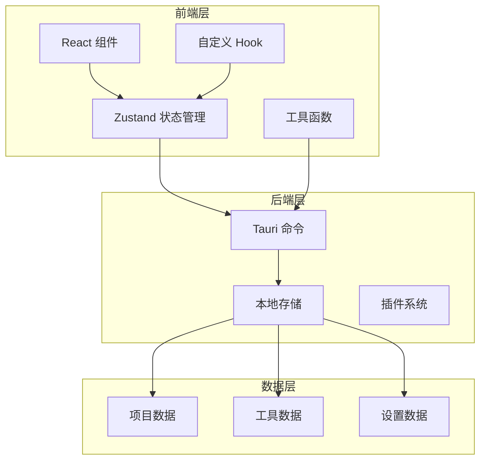

**图表来源**
- [useProjectStore.ts:1-67](file://src/stores/useProjectStore.ts#L1-L67)
- [storage.ts:1-30](file://src/lib/storage.ts#L1-L30)
- [lib.rs:1-29](file://src-tauri/src/lib.rs#L1-L29)

**章节来源**
- [useProjectStore.ts:1-67](file://src/stores/useProjectStore.ts#L1-L67)
- [storage.ts:1-30](file://src/lib/storage.ts#L1-L30)
- [lib.rs:1-29](file://src-tauri/src/lib.rs#L1-L29)

## 核心组件

### 项目存储状态管理

项目状态管理通过 Zustand 实现，提供了完整的 CRUD 操作接口：

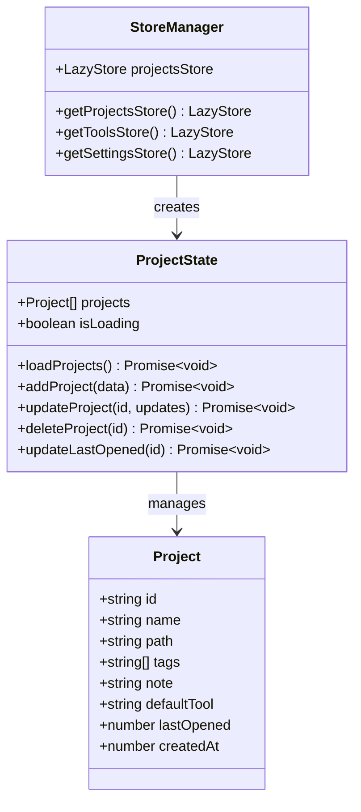

**图表来源**
- [useProjectStore.ts:6-14](file://src/stores/useProjectStore.ts#L6-L14)
- [index.ts:1-10](file://src/types/index.ts#L1-L10)
- [storage.ts:19-29](file://src/lib/storage.ts#L19-L29)

### 数据模型定义

项目数据模型包含了所有必要的字段和类型定义：

| 字段名 | 类型 | 必填 | 描述 | 默认值 |
|--------|------|------|------|--------|
| id | string | 是 | 项目唯一标识符 | 自动生成 |
| name | string | 是 | 项目名称 | - |
| path | string | 是 | 项目路径 | - |
| tags | string[] | 否 | 项目标签数组 | [] |
| note | string | 否 | 项目备注 | undefined |
| defaultTool | string | 否 | 默认工具 ID | undefined |
| lastOpened | number | 否 | 最后打开时间戳 | undefined |
| createdAt | number | 是 | 创建时间戳 | 自动生成 |

**章节来源**
- [index.ts:1-10](file://src/types/index.ts#L1-L10)
- [useProjectStore.ts:30-35](file://src/stores/useProjectStore.ts#L30-L35)

## 架构概览

系统采用分层架构设计，实现了清晰的关注点分离：

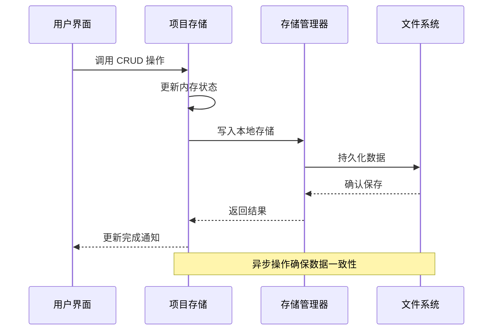

**图表来源**
- [useProjectStore.ts:20-65](file://src/stores/useProjectStore.ts#L20-L65)
- [storage.ts:4-7](file://src/lib/storage.ts#L4-L7)

## 详细组件分析

### 项目存储钩子实现

#### 加载项目 (loadProjects)

加载项目操作负责从本地存储中读取项目数据并初始化应用状态：

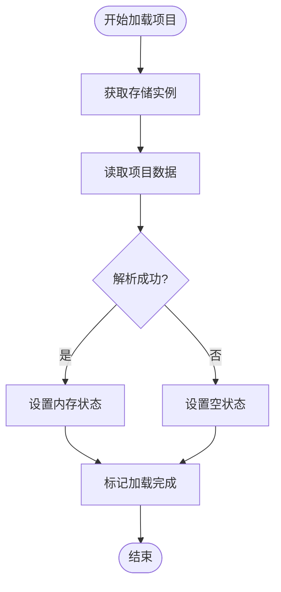

**图表来源**
- [useProjectStore.ts:20-28](file://src/stores/useProjectStore.ts#L20-L28)

实现特点：
- 使用 try-catch 机制处理存储读取异常
- 自动设置加载状态标志
- 支持默认值回退机制

**章节来源**
- [useProjectStore.ts:20-28](file://src/stores/useProjectStore.ts#L20-L28)

#### 添加项目 (addProject)

添加项目操作实现了完整的数据创建流程：

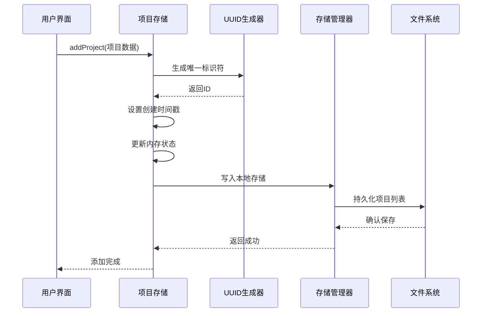

**图表来源**
- [useProjectStore.ts:30-40](file://src/stores/useProjectStore.ts#L30-L40)

实现特点：
- 自动生成 UUID 和创建时间戳
- 即时更新内存状态以提供响应式体验
- 异步持久化确保数据安全

**章节来源**
- [useProjectStore.ts:30-40](file://src/stores/useProjectStore.ts#L30-L40)

#### 更新项目 (updateProject)

更新项目操作支持部分字段更新：

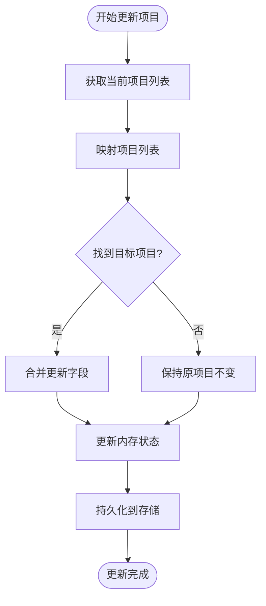

**图表来源**
- [useProjectStore.ts:42-49](file://src/stores/useProjectStore.ts#L42-L49)

实现特点：
- 使用对象展开运算符进行深拷贝
- 支持部分字段更新
- 保持其他项目数据不变

**章节来源**
- [useProjectStore.ts:42-49](file://src/stores/useProjectStore.ts#L42-L49)

#### 删除项目 (deleteProject)

删除项目操作实现了安全的数据移除：

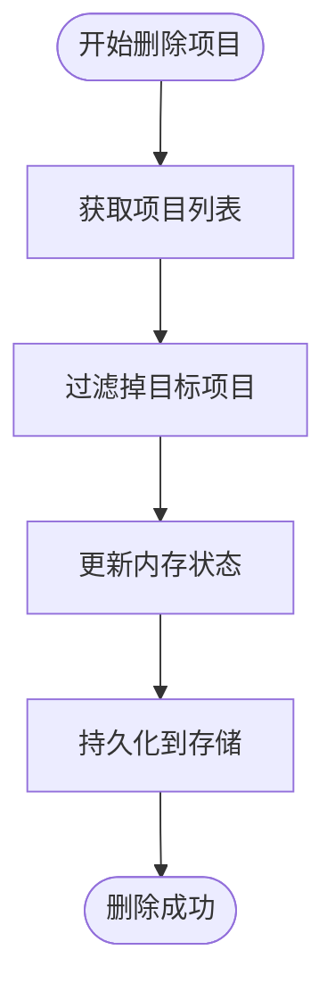

**图表来源**
- [useProjectStore.ts:51-56](file://src/stores/useProjectStore.ts#L51-L56)

实现特点：
- 使用过滤操作创建新数组
- 避免直接修改原数组引用
- 确保内存状态与存储状态一致

**章节来源**
- [useProjectStore.ts:51-56](file://src/stores/useProjectStore.ts#L51-L56)

#### 更新最后打开时间 (updateLastOpened)

最后打开时间更新操作专门用于追踪项目使用历史：

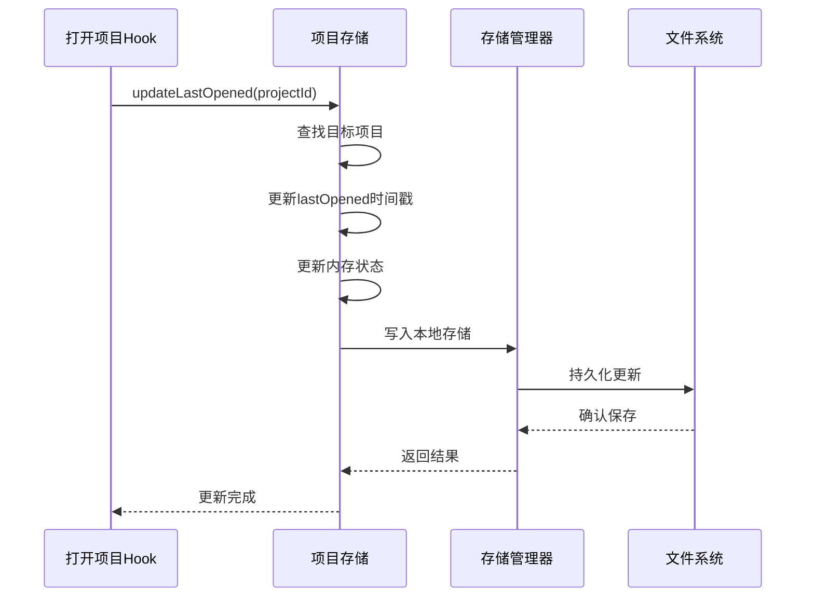

**图表来源**
- [useProjectStore.ts:58-65](file://src/stores/useProjectStore.ts#L58-L65)

实现特点：
- 仅更新特定字段，避免不必要的数据变更
- 支持项目历史追踪功能
- 与工具打开流程集成

**章节来源**
- [useProjectStore.ts:58-65](file://src/stores/useProjectStore.ts#L58-L65)

### 存储管理器实现

#### LazyStore 配置

存储管理器基于 tauri-plugin-store 的 LazyStore 实现：

```mermaid
classDiagram
class LazyStore {
+string filename
+Object defaults
+boolean autoSave
+get(key) Promise~any~
+set(key, value) Promise~void~
+has(key) Promise~boolean~
+delete(key) Promise~void~
}
class ProjectsStore {
+defaults : { projects : [] }
+autoSave : true
}
class ToolsStore {
+defaults : { tools : BUILTIN_TOOLS }
+autoSave : true
}
class SettingsStore {
+defaults : { settings : DEFAULT_SETTINGS }
+autoSave : true
}
LazyStore <|-- ProjectsStore
LazyStore <|-- ToolsStore
LazyStore <|-- SettingsStore
```

**图表来源**
- [storage.ts:4-17](file://src/lib/storage.ts#L4-L17)

实现特点：
- 自动保存机制确保数据持久化
- 默认值配置提供初始状态
- 异步 API 设计支持现代 JavaScript 特性

**章节来源**
- [storage.ts:4-17](file://src/lib/storage.ts#L4-L17)

### 错误处理机制

系统实现了多层次的错误处理机制：

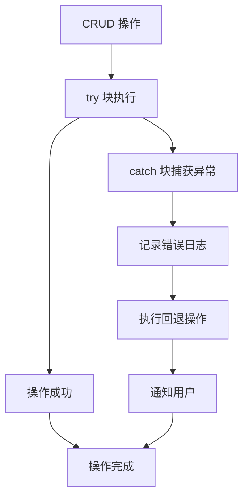

**图表来源**
- [useProjectStore.ts:20-28](file://src/stores/useProjectStore.ts#L20-L28)

错误处理策略：
- 加载失败时返回空数组而非抛出异常
- 更新操作中的异常通过 try-catch 包装
- 用户界面层提供友好的错误提示

**章节来源**
- [useProjectStore.ts:20-28](file://src/stores/useProjectStore.ts#L20-L28)

### 数据验证实现

数据验证在多个层面实现：

#### 前端验证

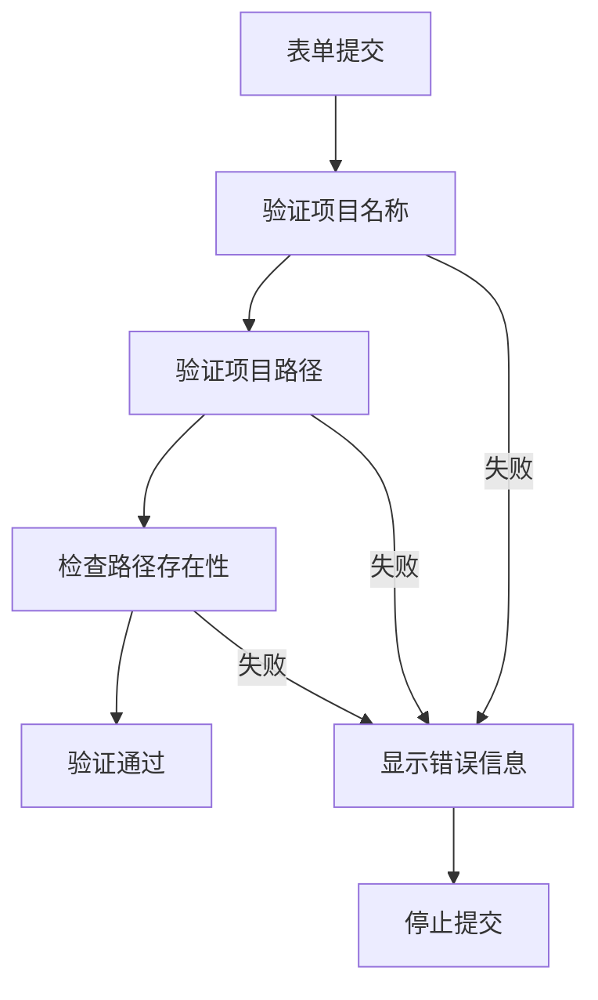

**图表来源**
- [ProjectFormDialog.tsx:84-134](file://src/components/project/ProjectFormDialog.tsx#L84-L134)

验证规则：
- 项目名称不能为空
- 项目路径必须存在且为目录
- 支持逗号分隔的标签输入
- 提供实时验证反馈

**章节来源**
- [ProjectFormDialog.tsx:84-134](file://src/components/project/ProjectFormDialog.tsx#L84-L134)

#### 后端验证

后端命令处理器提供额外的安全验证：

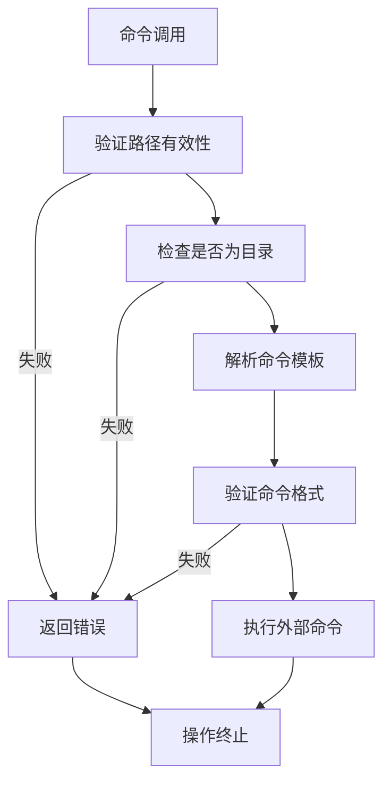

**图表来源**
- [commands.rs:57-88](file://src-tauri/src/commands.rs#L57-L88)

**章节来源**
- [commands.rs:57-88](file://src-tauri/src/commands.rs#L57-L88)

### 并发操作处理

系统通过以下机制处理并发操作：

#### 状态一致性保证

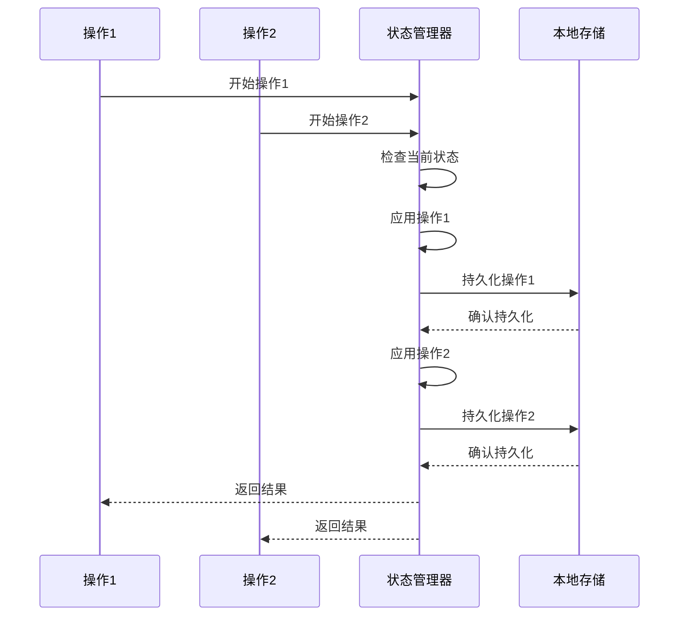

**图表来源**
- [useProjectStore.ts:30-65](file://src/stores/useProjectStore.ts#L30-L65)

#### 并发控制策略

- **原子性操作**：每个 CRUD 操作都是原子性的
- **状态隔离**：不同操作之间不会相互干扰
- **最终一致性**：内存状态和存储状态最终保持一致
- **错误隔离**：单个操作失败不影响其他操作

**章节来源**
- [useProjectStore.ts:30-65](file://src/stores/useProjectStore.ts#L30-L65)

## 依赖关系分析

系统依赖关系图展示了各组件之间的交互：

```mermaid
graph TB
subgraph "前端依赖"
React[React 19]
Zustand[Zustand 5]
TauriAPI[@tauri-apps/api]
UUID[uuid]
Sonner[Sonner]
end
subgraph "后端依赖"
Tauri[Tauri 2]
StorePlugin[tauri-plugin-store]
ShellPlugin[tauri-plugin-shell]
DialogPlugin[tauri-plugin-dialog]
end
subgraph "应用组件"
ProjectStore[项目存储]
ToolStore[工具存储]
SettingsStore[设置存储]
ProjectForm[项目表单]
ProjectList[项目列表]
end
React --> ProjectStore
React --> ToolStore
React --> SettingsStore
ProjectStore --> TauriAPI
ProjectForm --> ProjectStore
ProjectList --> ProjectStore
TauriAPI --> Tauri
Tauri --> StorePlugin
Tauri --> ShellPlugin
Tauri --> DialogPlugin
```

**图表来源**
- [Cargo.toml:15-22](file://src-tauri/Cargo.toml#L15-L22)
- [useProjectStore.ts:1-5](file://src/stores/useProjectStore.ts#L1-L5)

**章节来源**
- [Cargo.toml:15-22](file://src-tauri/Cargo.toml#L15-L22)
- [useProjectStore.ts:1-5](file://src/stores/useProjectStore.ts#L1-L5)

## 性能考虑

### 内存优化策略

1. **增量更新**：只更新发生变化的项目，避免全量重渲染
2. **状态缓存**：利用 Zustand 的高效状态管理减少不必要的重计算
3. **懒加载**：项目数据按需加载，减少启动时间

### 存储优化策略

1. **批量写入**：自动保存机制避免频繁磁盘 I/O
2. **数据压缩**：JSON 序列化确保数据体积最小化
3. **索引优化**：通过 ID 字段实现快速查找

### 网络和异步处理

1. **异步操作**：所有存储操作都是异步的，避免阻塞主线程
2. **错误恢复**：操作失败时自动回退到上一个已知状态
3. **进度反馈**：长时间操作提供用户反馈

## 故障排除指南

### 常见问题及解决方案

#### 项目加载失败

**症状**：应用启动时项目列表为空

**可能原因**：
- 存储文件损坏
- 权限问题
- 文件路径错误

**解决步骤**：
1. 检查存储文件是否存在
2. 验证文件权限
3. 重新初始化存储

#### 项目保存失败

**症状**：添加或更新项目后数据丢失

**可能原因**：
- 磁盘空间不足
- 文件锁定
- 权限问题

**解决步骤**：
1. 检查磁盘空间
2. 关闭占用文件的应用
3. 重新启动应用

#### 数据不一致

**症状**：内存状态与存储状态不匹配

**可能原因**：
- 并发操作冲突
- 异常中断
- 缓存问题

**解决步骤**：
1. 重启应用强制刷新
2. 清理应用缓存
3. 检查系统资源

**章节来源**
- [useProjectStore.ts:20-28](file://src/stores/useProjectStore.ts#L20-L28)

### 调试技巧

1. **启用开发模式**：使用 `pnpm tauri dev` 启动开发模式
2. **查看控制台日志**：检查浏览器控制台和应用日志
3. **监控存储状态**：使用浏览器开发者工具查看存储文件内容
4. **测试边界条件**：验证空数据、特殊字符、超长字符串等边界情况

## 结论

LaunchPro 的项目 CRUD 操作系统通过精心设计的状态管理和存储机制，实现了可靠、高效的项目数据管理。系统的主要优势包括：

1. **简洁的 API 设计**：直观的 CRUD 方法接口
2. **强一致性的数据模型**：通过内存状态和存储状态的双重保障
3. **完善的错误处理**：多层次的异常处理和回退机制
4. **良好的性能表现**：异步操作和状态优化确保流畅用户体验
5. **可扩展的架构**：模块化设计便于功能扩展和维护

该系统为开发者提供了一个可靠的本地项目管理解决方案，通过 Tauri 技术栈实现了跨平台兼容性和原生性能。未来可以考虑添加更多高级功能，如数据导入导出、多用户支持、云同步等特性。