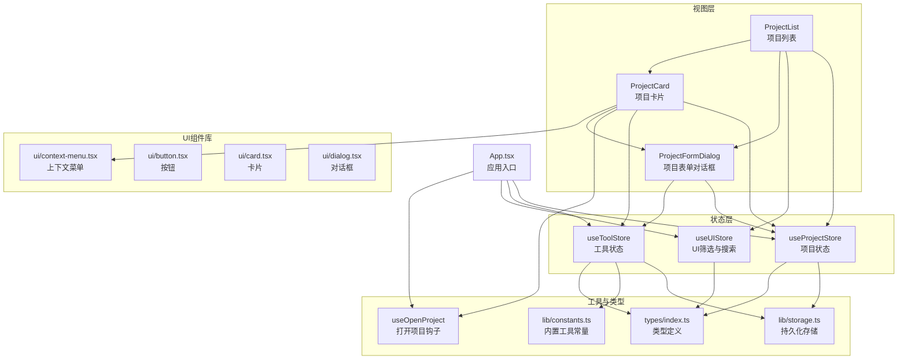
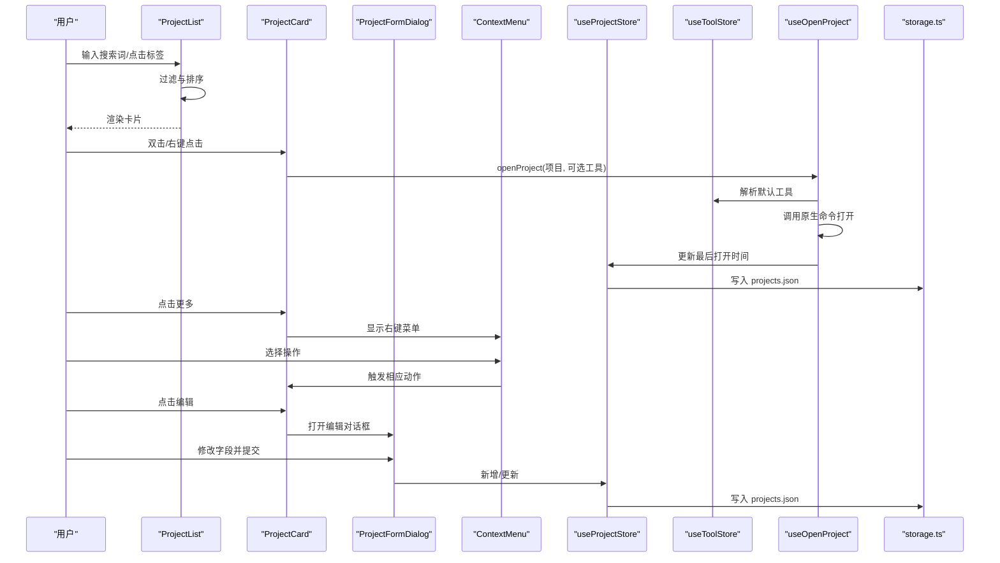
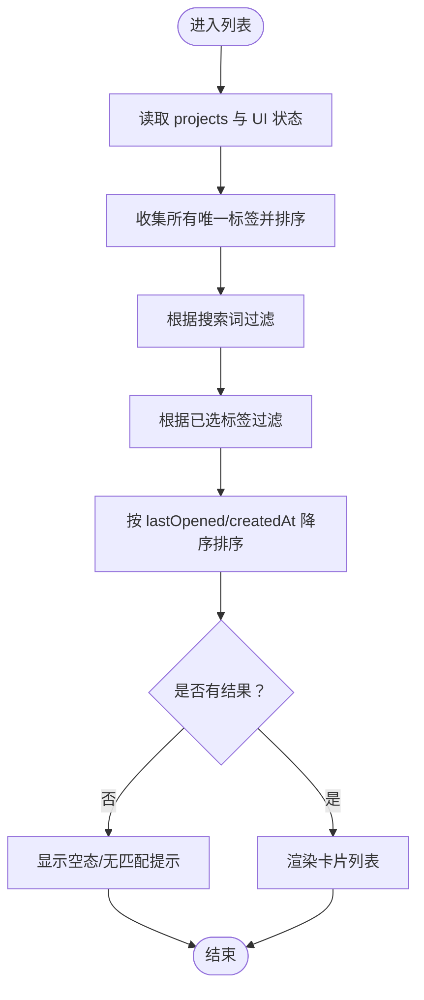
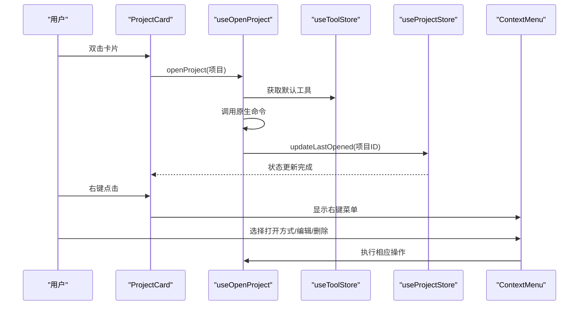
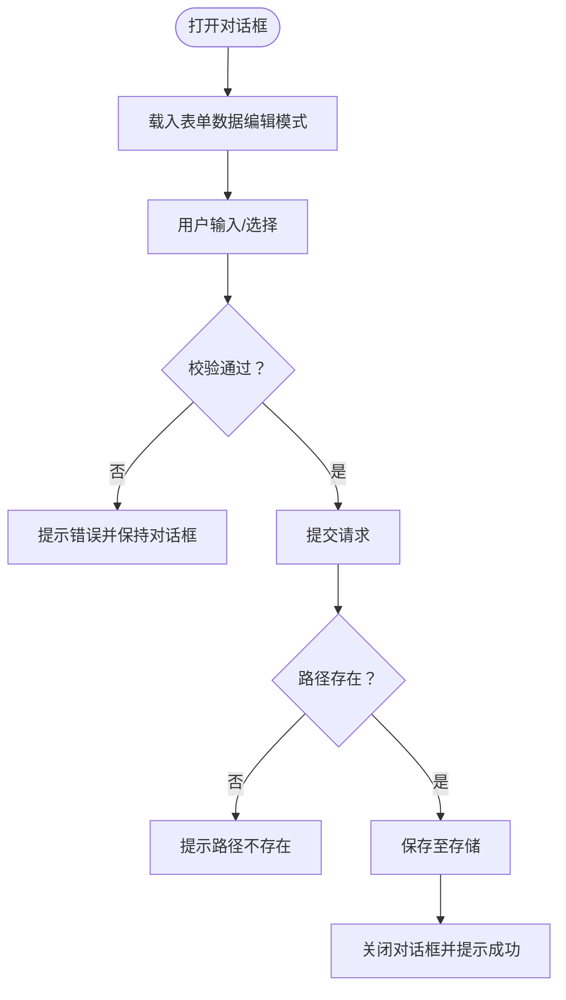
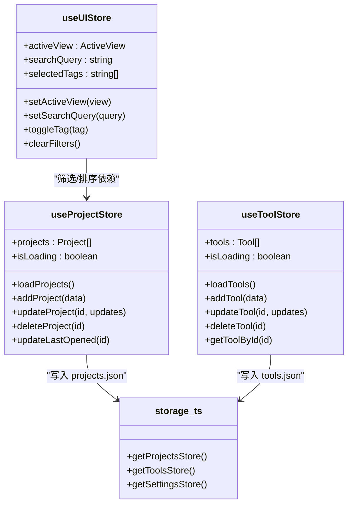
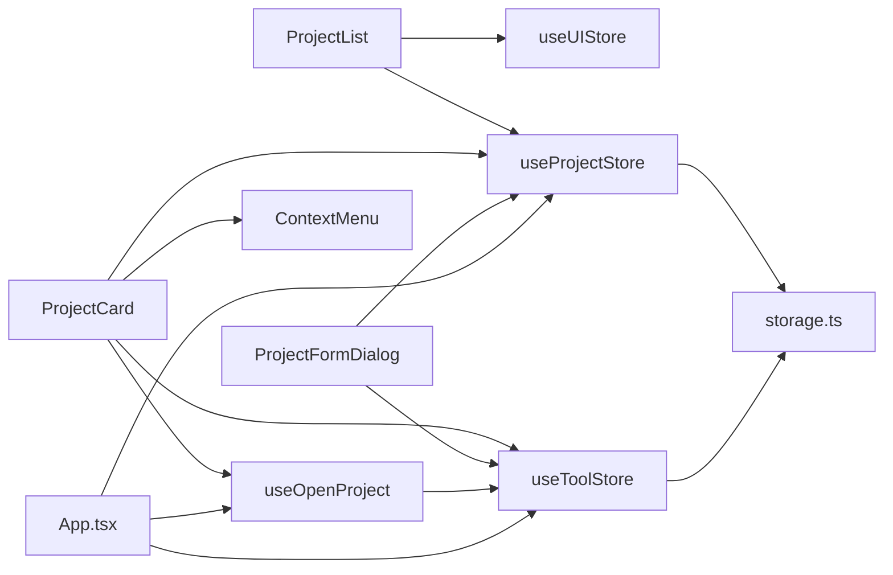

# 项目 UI 组件

<cite>
**本文引用的文件**
- [src/components/project/ProjectList.tsx](file://src/components/project/ProjectList.tsx)
- [src/components/project/ProjectCard.tsx](file://src/components/project/ProjectCard.tsx)
- [src/components/project/ProjectFormDialog.tsx](file://src/components/project/ProjectFormDialog.tsx)
- [src/stores/useProjectStore.ts](file://src/stores/useProjectStore.ts)
- [src/stores/useUIStore.ts](file://src/stores/useUIStore.ts)
- [src/stores/useToolStore.ts](file://src/stores/useToolStore.ts)
- [src/hooks/useOpenProject.ts](file://src/hooks/useOpenProject.ts)
- [src/types/index.ts](file://src/types/index.ts)
- [src/lib/storage.ts](file://src/lib/storage.ts)
- [src/lib/constants.ts](file://src/lib/constants.ts)
- [src/App.tsx](file://src/App.tsx)
- [src/components/ui/button.tsx](file://src/components/ui/button.tsx)
- [src/components/ui/card.tsx](file://src/components/ui/card.tsx)
- [src/components/ui/dialog.tsx](file://src/components/ui/dialog.tsx)
- [src/components/ui/context-menu.tsx](file://src/components/ui/context-menu.tsx)
</cite>

## 目录
1. [引言](#引言)
2. [项目结构](#项目结构)
3. [核心组件](#核心组件)
4. [架构总览](#架构总览)
5. [详细组件分析](#详细组件分析)
6. [依赖关系分析](#依赖关系分析)
7. [性能考量](#性能考量)
8. [故障排查指南](#故障排查指南)
9. [结论](#结论)
10. [附录：使用示例与最佳实践](#附录使用示例与最佳实践)

## 引言
本文件聚焦于项目管理模块的 UI 组件，系统性阐述"项目列表""项目卡片""项目表单对话框"的实现与交互，并说明组件间通信、状态同步、排序与过滤逻辑、响应式布局与无障碍设计。目标是帮助开发者快速理解与复用这些组件，同时提供可扩展的实践建议。

## 项目结构
项目 UI 组件位于 src/components/project 下，配合跨组件的状态存储（Zustand）与通用 UI 组件库（Button、Card、Dialog、ContextMenu 等），形成清晰的分层：
- 视图层：ProjectList、ProjectCard、ProjectFormDialog
- 状态层：useProjectStore、useUIStore、useToolStore
- 工具与类型：useOpenProject 钩子、类型定义、存储与常量
- 应用入口：App 初始化加载与事件监听

**图表来源**
- [src/components/project/ProjectList.tsx:12-159](file://src/components/project/ProjectList.tsx#L12-L159)
- [src/components/project/ProjectCard.tsx:27-163](file://src/components/project/ProjectCard.tsx#L27-L163)
- [src/components/project/ProjectFormDialog.tsx:33-227](file://src/components/project/ProjectFormDialog.tsx#L33-L227)
- [src/stores/useProjectStore.ts:16-66](file://src/stores/useProjectStore.ts#L16-L66)
- [src/stores/useToolStore.ts:17-74](file://src/stores/useToolStore.ts#L17-L74)
- [src/stores/useUIStore.ts:14-32](file://src/stores/useUIStore.ts#L14-L32)
- [src/hooks/useOpenProject.ts:9-43](file://src/hooks/useOpenProject.ts#L9-L43)
- [src/types/index.ts:1-26](file://src/types/index.ts#L1-L26)
- [src/lib/storage.ts:1-30](file://src/lib/storage.ts#L1-L30)
- [src/lib/constants.ts:3-18](file://src/lib/constants.ts#L3-L18)
- [src/App.tsx:24-58](file://src/App.tsx#L24-L58)
- [src/components/ui/context-menu.tsx:1-247](file://src/components/ui/context-menu.tsx#L1-L247)

**章节来源**
- [src/components/project/ProjectList.tsx:12-159](file://src/components/project/ProjectList.tsx#L12-L159)
- [src/components/project/ProjectCard.tsx:27-163](file://src/components/project/ProjectCard.tsx#L27-L163)
- [src/components/project/ProjectFormDialog.tsx:33-227](file://src/components/project/ProjectFormDialog.tsx#L33-L227)
- [src/stores/useProjectStore.ts:16-66](file://src/stores/useProjectStore.ts#L16-L66)
- [src/stores/useToolStore.ts:17-74](file://src/stores/useToolStore.ts#L17-L74)
- [src/stores/useUIStore.ts:14-32](file://src/stores/useUIStore.ts#L14-L32)
- [src/hooks/useOpenProject.ts:9-43](file://src/hooks/useOpenProject.ts#L9-L43)
- [src/types/index.ts:1-26](file://src/types/index.ts#L1-L26)
- [src/lib/storage.ts:1-30](file://src/lib/storage.ts#L1-L30)
- [src/lib/constants.ts:3-18](file://src/lib/constants.ts#L3-L18)
- [src/App.tsx:24-58](file://src/App.tsx#L24-L58)

## 核心组件
- 项目列表（ProjectList）
  - 负责：渲染项目卡片、搜索过滤、标签筛选、排序、空态与滚动区域。
  - 关键点：使用 useMemo 做搜索与标签过滤；按最后打开时间或创建时间降序排序；通过 useUIStore 管理搜索词与标签集合。
- 项目卡片（ProjectCard）
  - 负责：展示项目名称、路径、标签、相对打开时间、默认工具徽标；双击打开、右键上下文菜单（打开方式、编辑、删除）。
  - 关键点：悬停显示操作区；Tooltip 提示完整路径；DropdownMenu 支持子菜单"打开方式..."；ContextMenu 提供完整的右键菜单。
- 项目表单对话框（ProjectFormDialog）
  - 负责：新增/编辑项目对话框，字段校验（名称、路径存在性）、选择默认工具、保存并持久化。
  - 关键点：异步路径存在性检查；逗号分隔标签解析；提交后关闭并提示成功/错误。

**章节来源**
- [src/components/project/ProjectList.tsx:12-159](file://src/components/project/ProjectList.tsx#L12-L159)
- [src/components/project/ProjectCard.tsx:27-163](file://src/components/project/ProjectCard.tsx#L27-L163)
- [src/components/project/ProjectFormDialog.tsx:33-227](file://src/components/project/ProjectFormDialog.tsx#L33-L227)

## 架构总览
组件间通过 Zustand 状态进行解耦，App 在启动时加载数据并监听系统事件；打开项目流程贯穿 UI、工具与设置状态，最终调用原生命令打开项目目录。

**图表来源**
- [src/components/project/ProjectList.tsx:29-55](file://src/components/project/ProjectList.tsx#L29-L55)
- [src/components/project/ProjectCard.tsx:27-163](file://src/components/project/ProjectCard.tsx#L27-L163)
- [src/components/project/ProjectFormDialog.tsx:84-134](file://src/components/project/ProjectFormDialog.tsx#L84-L134)
- [src/stores/useProjectStore.ts:30-65](file://src/stores/useProjectStore.ts#L30-L65)
- [src/stores/useToolStore.ts:71-73](file://src/stores/useToolStore.ts#L71-L73)
- [src/hooks/useOpenProject.ts:15-39](file://src/hooks/useOpenProject.ts#L15-L39)
- [src/lib/storage.ts:19-29](file://src/lib/storage.ts#L19-L29)

## 详细组件分析

### 项目列表（ProjectList）
- 渲染与布局
  - 使用 ScrollArea 包裹卡片列表，支持纵向滚动；顶部区域包含搜索输入与"添加"按钮；标签云用于二次筛选。
- 过滤与排序
  - 搜索：对名称、路径、标签进行不区分大小写包含匹配。
  - 标签：多选标签交集过滤。
  - 排序：优先按 lastOpened 或 createdAt 的降序排列。
- 状态与交互
  - 读取 useProjectStore 的 projects 与 isLoading；通过 useUIStore 管理 searchQuery、selectedTags 并触发重渲染。
  - 空态：无项目时引导添加；有项目但无匹配时提示"无匹配"。

**图表来源**
- [src/components/project/ProjectList.tsx:23-55](file://src/components/project/ProjectList.tsx#L23-L55)

**章节来源**
- [src/components/project/ProjectList.tsx:12-159](file://src/components/project/ProjectList.tsx#L12-L159)
- [src/stores/useUIStore.ts:14-32](file://src/stores/useUIStore.ts#L14-L32)
- [src/stores/useProjectStore.ts:16-28](file://src/stores/useProjectStore.ts#L16-L28)

### 项目卡片（ProjectCard）
- 信息展示
  - 名称、路径（带 Tooltip）、标签徽标、相对打开时间、默认工具徽标。
- 交互行为
  - **双击卡片**：调用 useOpenProject 打开项目；若未指定工具则回退到项目默认或全局默认。
  - **右键上下文菜单**：显示完整的上下文菜单，包含"打开方式..."子菜单、编辑、删除选项。
  - **悬停显示操作区**：打开、更多菜单。
  - **更多菜单**：子菜单"打开方式..."列出可用工具；编辑、删除。
- 路径显示优化
  - 将用户主目录简化为波浪号前缀，提升可读性。

**图表来源**
- [src/components/project/ProjectCard.tsx:27-163](file://src/components/project/ProjectCard.tsx#L27-L163)
- [src/hooks/useOpenProject.ts:15-39](file://src/hooks/useOpenProject.ts#L15-L39)
- [src/stores/useToolStore.ts:71-73](file://src/stores/useToolStore.ts#L71-L73)
- [src/stores/useProjectStore.ts:58-65](file://src/stores/useProjectStore.ts#L58-L65)

**章节来源**
- [src/components/project/ProjectCard.tsx:27-163](file://src/components/project/ProjectCard.tsx#L27-L163)
- [src/hooks/useOpenProject.ts:9-43](file://src/hooks/useOpenProject.ts#L9-L43)

### 项目表单对话框（ProjectFormDialog）
- 字段与验证
  - 名称与路径必填；路径存在性通过原生命令检查；标签以逗号分隔解析为数组；默认工具可选。
- 提交流程
  - 编辑模式：updateProject；新增模式：addProject；提交后关闭并提示成功/错误。
- 文件选择
  - 通过原生对话框选择目录，自动填充名称为目录名（若为空）。

**图表来源**
- [src/components/project/ProjectFormDialog.tsx:84-134](file://src/components/project/ProjectFormDialog.tsx#L84-L134)

**章节来源**
- [src/components/project/ProjectFormDialog.tsx:33-227](file://src/components/project/ProjectFormDialog.tsx#L33-L227)
- [src/stores/useProjectStore.ts:30-65](file://src/stores/useProjectStore.ts#L30-L65)
- [src/stores/useToolStore.ts:17-39](file://src/stores/useToolStore.ts#L17-L39)

### 状态与存储
- useProjectStore
  - 负责项目列表的加载、新增、更新、删除、最后打开时间更新；持久化到 projects.json。
- useToolStore
  - 负责工具列表的加载、合并内置工具与用户自定义、新增、更新、删除（不可删除内置）、按 ID 查询。
- useUIStore
  - 负责活动视图、搜索词、标签筛选集合的管理与清空。
- App 初始化
  - 启动时加载工具、项目、设置；监听托盘事件打开指定项目。

**图表来源**
- [src/stores/useProjectStore.ts:16-66](file://src/stores/useProjectStore.ts#L16-L66)
- [src/stores/useToolStore.ts:17-74](file://src/stores/useToolStore.ts#L17-L74)
- [src/stores/useUIStore.ts:14-32](file://src/stores/useUIStore.ts#L14-L32)
- [src/lib/storage.ts:19-29](file://src/lib/storage.ts#L19-L29)

**章节来源**
- [src/stores/useProjectStore.ts:16-66](file://src/stores/useProjectStore.ts#L16-L66)
- [src/stores/useToolStore.ts:17-74](file://src/stores/useToolStore.ts#L17-L74)
- [src/stores/useUIStore.ts:14-32](file://src/stores/useUIStore.ts#L14-L32)
- [src/lib/storage.ts:1-30](file://src/lib/storage.ts#L1-L30)
- [src/App.tsx:24-58](file://src/App.tsx#L24-L58)

## 依赖关系分析
- 组件耦合
  - ProjectList 与 useUIStore、useProjectStore 强耦合；ProjectCard 与 useOpenProject、useToolStore、useProjectStore 强耦合；ProjectFormDialog 与 useProjectStore、useToolStore 强耦合。
- 外部依赖
  - @tauri-apps/plugin-dialog 用于文件夹选择；@tauri-apps/plugin-store 用于本地存储；@tauri-apps/api/event 用于托盘事件监听。
- 可能的循环依赖
  - 当前未发现直接循环依赖；各组件通过状态存储间接通信，避免了直接互相导入。

**图表来源**
- [src/components/project/ProjectList.tsx:12-19](file://src/components/project/ProjectList.tsx#L12-L19)
- [src/components/project/ProjectCard.tsx:17-32](file://src/components/project/ProjectCard.tsx#L17-L32)
- [src/components/project/ProjectFormDialog.tsx:20-36](file://src/components/project/ProjectFormDialog.tsx#L20-L36)
- [src/hooks/useOpenProject.ts:9-13](file://src/hooks/useOpenProject.ts#L9-L13)
- [src/App.tsx:24-35](file://src/App.tsx#L24-L35)
- [src/lib/storage.ts:1-30](file://src/lib/storage.ts#L1-L30)

**章节来源**
- [src/components/project/ProjectList.tsx:12-19](file://src/components/project/ProjectList.tsx#L12-L19)
- [src/components/project/ProjectCard.tsx:17-32](file://src/components/project/ProjectCard.tsx#L17-L32)
- [src/components/project/ProjectFormDialog.tsx:20-36](file://src/components/project/ProjectFormDialog.tsx#L20-L36)
- [src/hooks/useOpenProject.ts:9-13](file://src/hooks/useOpenProject.ts#L9-L13)
- [src/App.tsx:24-35](file://src/App.tsx#L24-L35)
- [src/lib/storage.ts:1-30](file://src/lib/storage.ts#L1-L30)

## 性能考量
- 计算优化
  - 使用 useMemo 缓存 allTags、filteredProjects，避免每次渲染重复计算。
- 渲染优化
  - 列表容器使用 ScrollArea，仅在内容超出时滚动，减少重排。
  - 卡片操作区采用 hover 显隐，降低非必要 DOM 结构。
- 存储与 IO
  - 所有变更写入 LazyStore 自动保存，减少手动写入开销；路径存在性检查在提交阶段进行，避免频繁 IO。
- 可扩展建议
  - 对超大项目集建议引入虚拟列表；对复杂过滤条件可考虑索引化或服务端缓存。

## 故障排查指南
- 无法打开项目
  - 检查工具是否配置且存在；查看错误提示与日志；确认路径存在性。
- 表单提交失败
  - 校验名称与路径是否为空；确认路径存在且为目录；查看错误提示。
- 托盘事件无效
  - 确认 App 已监听 tray-open-project 事件；确认项目 ID 存在且对应项目存在。
- 右键菜单不显示
  - 检查 ContextMenu 组件是否正确导入；确认浏览器支持右键菜单功能。

**章节来源**
- [src/hooks/useOpenProject.ts:15-39](file://src/hooks/useOpenProject.ts#L15-L39)
- [src/components/project/ProjectFormDialog.tsx:84-134](file://src/components/project/ProjectFormDialog.tsx#L84-L134)
- [src/App.tsx:37-52](file://src/App.tsx#L37-L52)

## 结论
本项目 UI 组件围绕"项目列表—卡片—表单对话框"形成清晰的职责边界，通过 Zustand 状态与 Tauri 原生能力实现高效的数据持久化与系统集成。组件具备良好的可复用性与扩展性，适合在多场景下复用与定制。新的双交互模式（双击打开 + 右键上下文菜单）提供了更丰富的用户操作体验，同时保留了原有的下拉菜单功能，满足不同用户的操作习惯。

## 附录：使用示例与最佳实践
- 使用示例
  - 在页面中直接渲染 ProjectList 即可展示项目列表与交互。
  - 通过 ProjectCard 的双击与右键菜单实现打开、编辑、删除等操作。
  - 通过 ProjectFormDialog 的 open/onOpenChange 控制新增/编辑弹窗。
- 最佳实践
  - 保持状态单一入口：所有项目 CRUD 通过 useProjectStore 完成。
  - 严格表单校验：在提交前完成必填与存在性检查。
  - 优化交互反馈：使用 toast 提示成功/错误；禁用提交按钮防止重复提交。
  - 可访问性与 UX
    - 对话框内使用语义化标签与键盘导航；按钮与图标提供 Tooltip；长文本使用 Tooltip 展示完整内容。
    - 右键菜单提供完整的操作选项，确保与双击操作的一致性。
  - 可复用性与扩展
    - 将 UI 组件与业务逻辑解耦；通过 props 传入回调与数据；对外暴露最小接口，内部通过状态存储统一管理。
  - 交互模式设计
    - 双击作为主要的快速操作方式，右键提供完整的上下文菜单，下拉菜单作为补充操作入口，形成多层次的操作体系。

**章节来源**
- [src/components/project/ProjectList.tsx:12-159](file://src/components/project/ProjectList.tsx#L12-L159)
- [src/components/project/ProjectCard.tsx:27-163](file://src/components/project/ProjectCard.tsx#L27-L163)
- [src/components/project/ProjectFormDialog.tsx:33-227](file://src/components/project/ProjectFormDialog.tsx#L33-L227)
- [src/components/ui/button.tsx:41-62](file://src/components/ui/button.tsx#L41-L62)
- [src/components/ui/card.tsx:5-16](file://src/components/ui/card.tsx#L5-L16)
- [src/components/ui/dialog.tsx:8-80](file://src/components/ui/dialog.tsx#L8-L80)
- [src/components/ui/context-menu.tsx:1-247](file://src/components/ui/context-menu.tsx#L1-L247)