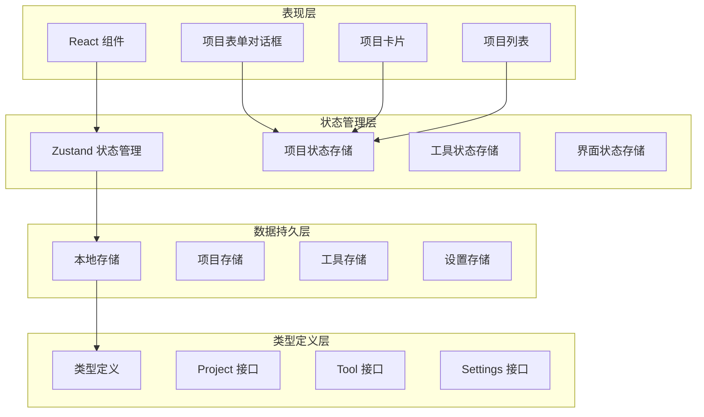
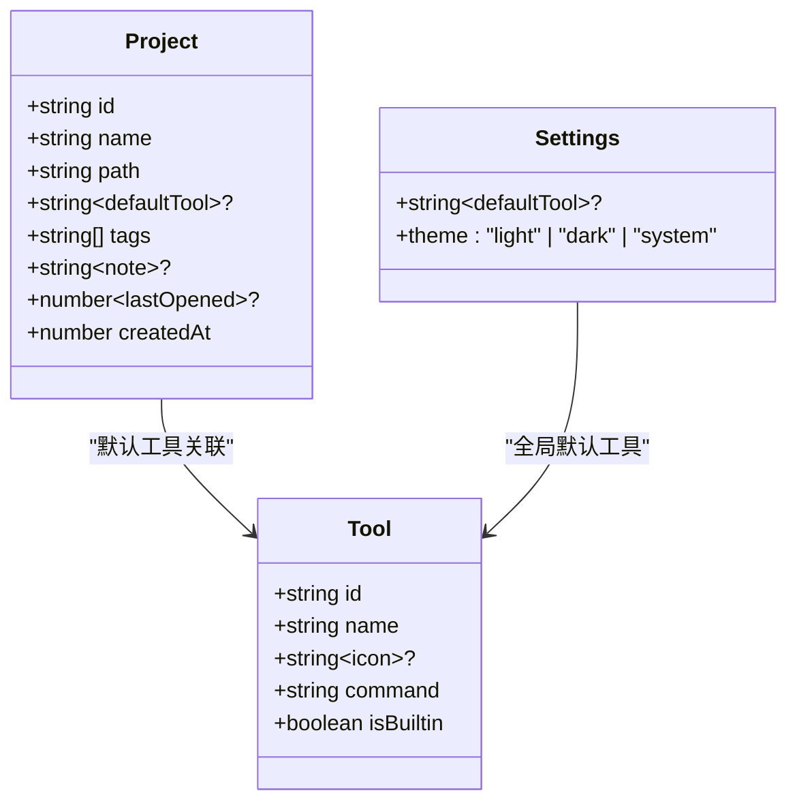
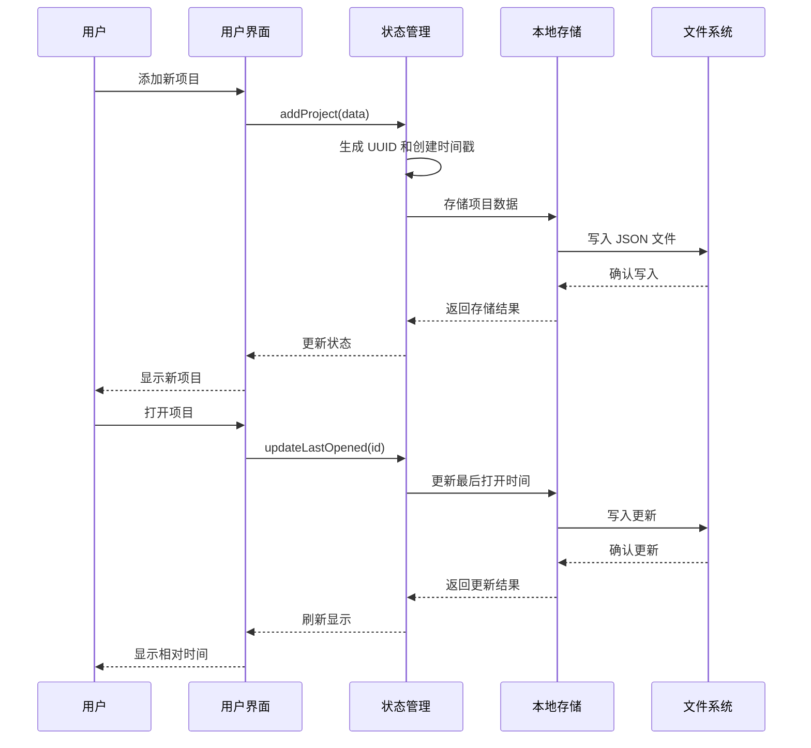
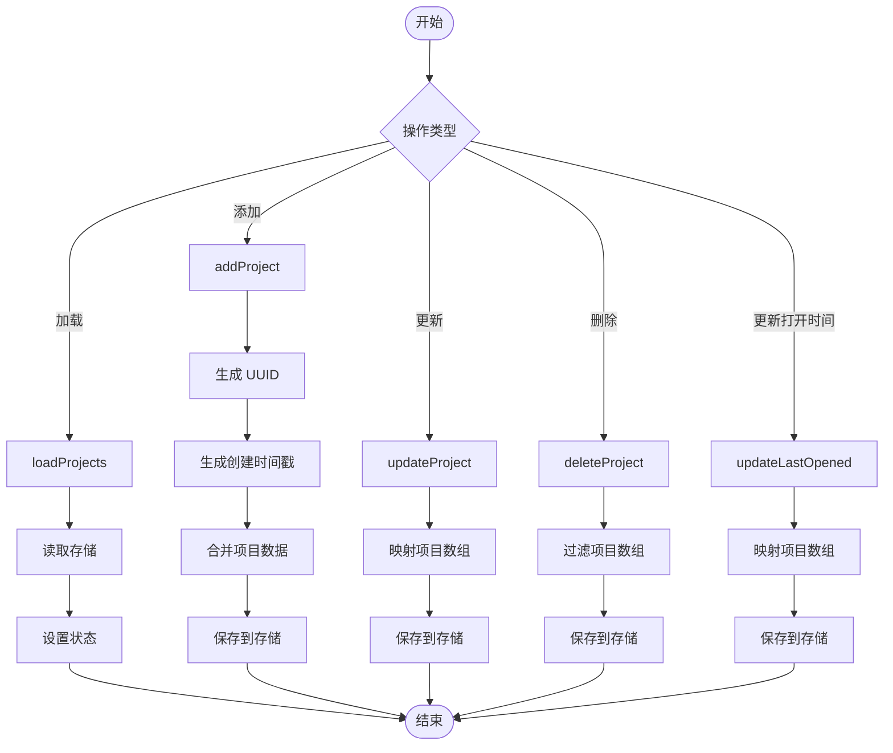
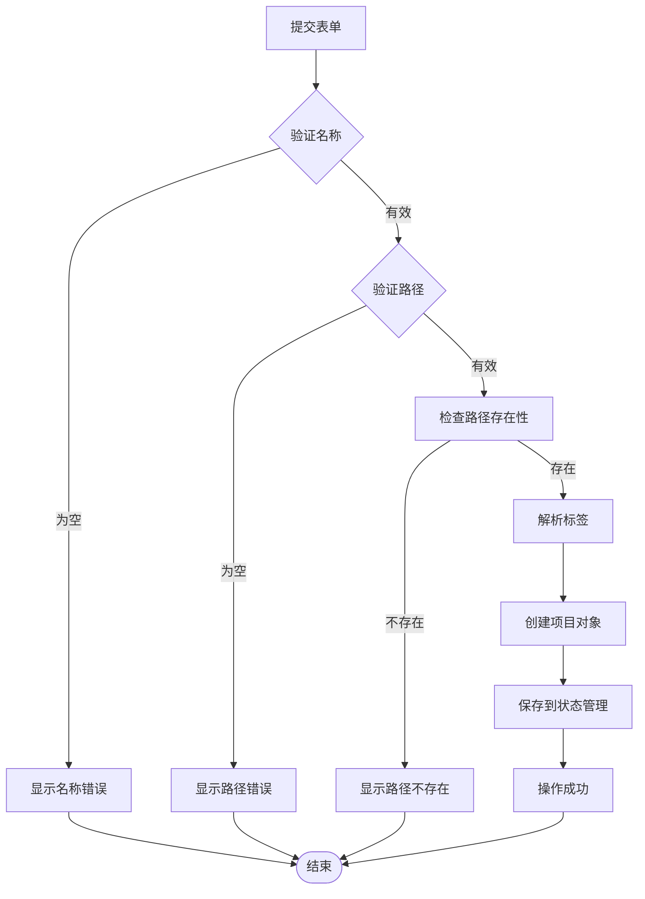
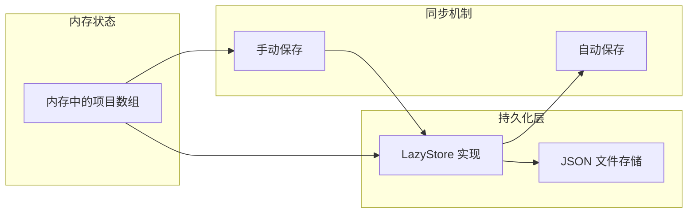
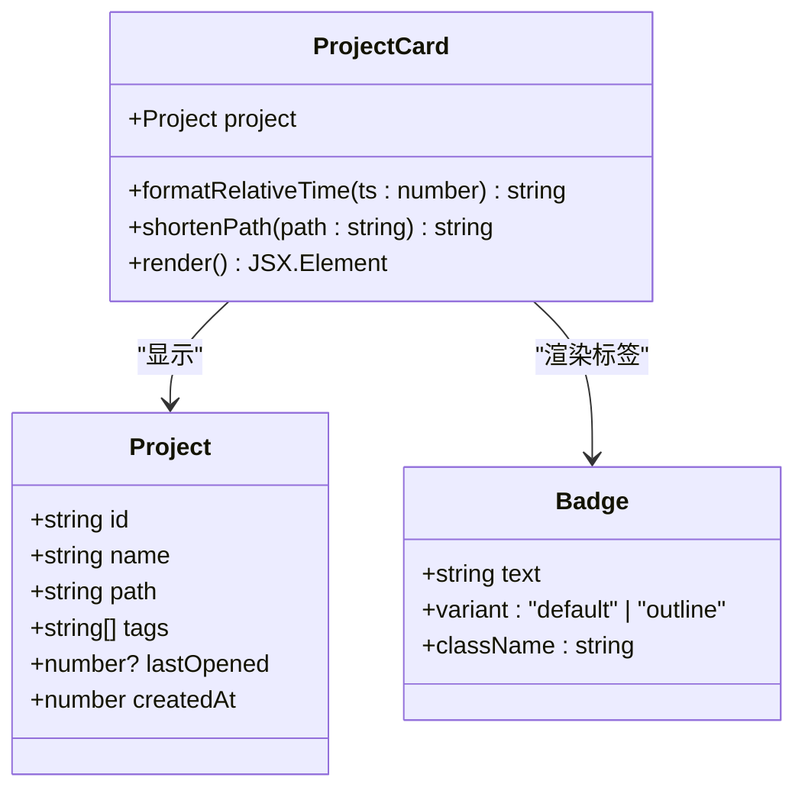
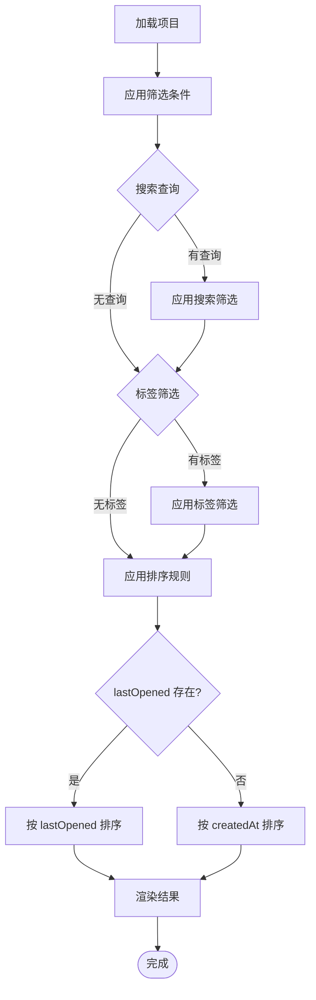
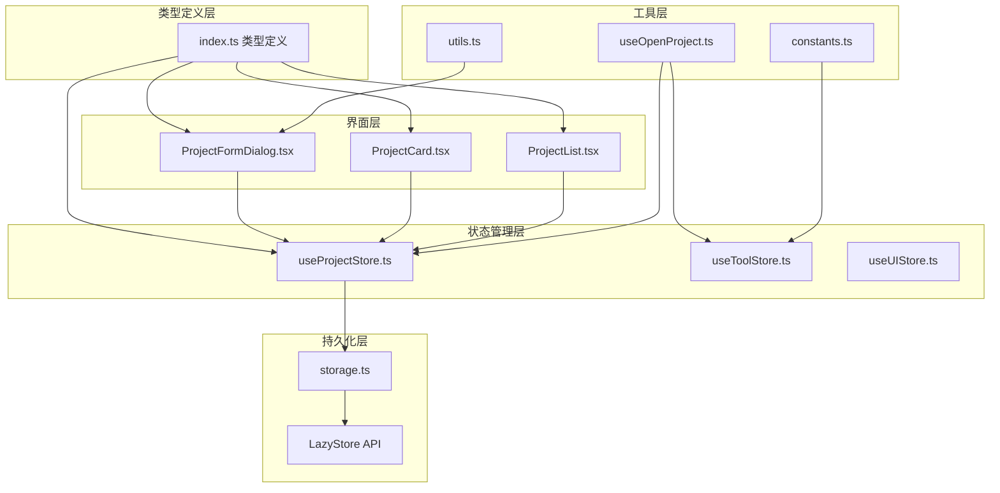

# 项目数据模型

<cite>
**本文档引用的文件**
- [src/types/index.ts](file://src/types/index.ts)
- [src/stores/useProjectStore.ts](file://src/stores/useProjectStore.ts)
- [src/lib/storage.ts](file://src/lib/storage.ts)
- [src/components/project/ProjectFormDialog.tsx](file://src/components/project/ProjectFormDialog.tsx)
- [src/components/project/ProjectCard.tsx](file://src/components/project/ProjectCard.tsx)
- [src/components/project/ProjectList.tsx](file://src/components/project/ProjectList.tsx)
- [src/hooks/useOpenProject.ts](file://src/hooks/useOpenProject.ts)
- [src/lib/constants.ts](file://src/lib/constants.ts)
</cite>

## 目录
1. [简介](#简介)
2. [项目结构概览](#项目结构概览)
3. [核心数据模型](#核心数据模型)
4. [架构总览](#架构总览)
5. [详细组件分析](#详细组件分析)
6. [依赖关系分析](#依赖关系分析)
7. [性能考虑](#性能考虑)
8. [故障排除指南](#故障排除指南)
9. [结论](#结论)

## 简介

本文件详细阐述了项目数据模型的设计与实现，重点分析 Project 接口的结构、字段定义、数据验证规则以及在系统中的流转过程。项目采用基于 Tauri 的桌面应用架构，通过 Zustand 状态管理、本地存储持久化和 React 组件化开发模式，实现了完整的项目生命周期管理。

## 项目结构概览

项目采用分层架构设计，主要分为以下层次：

**图表来源**
- [src/components/project/ProjectFormDialog.tsx:1-183](file://src/components/project/ProjectFormDialog.tsx#L1-L183)
- [src/stores/useProjectStore.ts:1-67](file://src/stores/useProjectStore.ts#L1-L67)
- [src/lib/storage.ts:1-30](file://src/lib/storage.ts#L1-L30)
- [src/types/index.ts:1-26](file://src/types/index.ts#L1-L26)

**章节来源**
- [src/types/index.ts:1-26](file://src/types/index.ts#L1-L26)
- [src/stores/useProjectStore.ts:1-67](file://src/stores/useProjectStore.ts#L1-L67)
- [src/lib/storage.ts:1-30](file://src/lib/storage.ts#L1-L30)

## 核心数据模型

### Project 接口定义

Project 接口是项目数据模型的核心定义，包含了项目的所有元数据信息：

**图表来源**
- [src/types/index.ts:1-26](file://src/types/index.ts#L1-L26)

### 字段详细说明

#### 基础标识字段
- **id** (`string`): 项目的唯一标识符，采用 UUID v4 生成策略
- **name** (`string`): 项目名称，必填字段，用于用户界面显示
- **path** (`string`): 项目文件路径，必填字段，指向实际的文件系统位置

#### 元数据字段
- **tags** (`string[]`): 项目标签数组，用于分类和过滤
- **note** (`string?`): 项目备注信息，可选字段
- **defaultTool** (`string?`): 默认打开工具，可选字段，关联到 Tool.id

#### 时间戳字段
- **lastOpened** (`number?`): 最近打开时间戳，可选字段，用于排序和统计
- **createdAt** (`number`): 创建时间戳，必填字段，采用 Unix 时间毫秒值

**章节来源**
- [src/types/index.ts:1-10](file://src/types/index.ts#L1-L10)

## 架构总览

项目数据流从用户交互到持久化的完整流程如下：

**图表来源**
- [src/stores/useProjectStore.ts:30-65](file://src/stores/useProjectStore.ts#L30-L65)
- [src/lib/storage.ts:19-29](file://src/lib/storage.ts#L19-L29)
- [src/hooks/useOpenProject.ts:31-38](file://src/hooks/useOpenProject.ts#L31-L38)

## 详细组件分析

### 状态管理组件

#### useProjectStore 实现

useProjectStore 是项目状态管理的核心，负责所有项目相关的 CRUD 操作：

**图表来源**
- [src/stores/useProjectStore.ts:16-66](file://src/stores/useProjectStore.ts#L16-L66)

#### 数据验证规则

项目表单组件实现了完整的前端验证逻辑：

**图表来源**
- [src/components/project/ProjectFormDialog.tsx:84-134](file://src/components/project/ProjectFormDialog.tsx#L84-L134)

**章节来源**
- [src/stores/useProjectStore.ts:1-67](file://src/stores/useProjectStore.ts#L1-L67)
- [src/components/project/ProjectFormDialog.tsx:1-183](file://src/components/project/ProjectFormDialog.tsx#L1-L183)

### 数据持久化层

#### 本地存储实现

项目使用 Tauri 的 LazyStore 实现本地数据持久化：

| 存储文件 | 数据类型 | 默认值 | 自动保存 |
|---------|---------|--------|----------|
| projects.json | Project[] | [] | 是 |
| tools.json | Tool[] | BUILTIN_TOOLS | 是 |
| settings.json | Settings | DEFAULT_SETTINGS | 是 |

#### 存储策略

**图表来源**
- [src/lib/storage.ts:4-17](file://src/lib/storage.ts#L4-L17)

**章节来源**
- [src/lib/storage.ts:1-30](file://src/lib/storage.ts#L1-L30)

### 用户界面组件

#### 项目卡片组件

项目卡片组件展示了项目的核心信息，并提供了交互功能：

**图表来源**
- [src/components/project/ProjectCard.tsx:27-164](file://src/components/project/ProjectCard.tsx#L27-L164)

#### 项目列表组件

项目列表组件实现了高级的筛选和排序功能：

**图表来源**
- [src/components/project/ProjectList.tsx:29-55](file://src/components/project/ProjectList.tsx#L29-L55)

**章节来源**
- [src/components/project/ProjectCard.tsx:1-176](file://src/components/project/ProjectCard.tsx#L1-L176)
- [src/components/project/ProjectList.tsx:1-168](file://src/components/project/ProjectList.tsx#L1-L168)

## 依赖关系分析

项目数据模型的依赖关系呈现清晰的分层结构：

**图表来源**
- [src/types/index.ts:1-26](file://src/types/index.ts#L1-L26)
- [src/stores/useProjectStore.ts:1-67](file://src/stores/useProjectStore.ts#L1-L67)
- [src/lib/storage.ts:1-30](file://src/lib/storage.ts#L1-L30)

**章节来源**
- [src/types/index.ts:1-26](file://src/types/index.ts#L1-L26)
- [src/stores/useProjectStore.ts:1-67](file://src/stores/useProjectStore.ts#L1-L67)

## 性能考虑

### 时间复杂度分析

| 操作 | 时间复杂度 | 空间复杂度 | 说明 |
|------|------------|------------|------|
| 加载项目 | O(n) | O(n) | n 为项目数量 |
| 添加项目 | O(n) | O(n) | 包含数组复制 |
| 更新项目 | O(n) | O(n) | 需要遍历查找 |
| 删除项目 | O(n) | O(n) | 过滤操作 |
| 搜索项目 | O(n*m) | O(k) | n 为项目数，m 为平均匹配数，k 为结果数 |
| 排序项目 | O(n log n) | O(n) | 按时间戳排序 |

### 优化建议

1. **索引优化**: 为常用查询字段建立索引
2. **批量操作**: 合并多个状态更新操作
3. **缓存策略**: 对频繁访问的数据进行缓存
4. **虚拟化**: 对大量项目列表使用虚拟滚动

## 故障排除指南

### 常见问题及解决方案

#### 项目无法保存
- **症状**: 添加或更新项目后重启应用丢失
- **原因**: 存储权限问题或文件损坏
- **解决**: 检查应用存储权限，清理损坏的 JSON 文件

#### 时间戳显示异常
- **症状**: 项目时间显示为未来时间或错误格式
- **原因**: 系统时钟不正确或时间戳格式错误
- **解决**: 同步系统时间，确保使用 Unix 毫秒时间戳

#### 路径验证失败
- **症状**: 提示路径不存在但实际存在
- **原因**: 权限问题或路径格式不正确
- **解决**: 检查文件夹权限，使用绝对路径

**章节来源**
- [src/components/project/ProjectFormDialog.tsx:84-102](file://src/components/project/ProjectFormDialog.tsx#L84-L102)
- [src/hooks/useOpenProject.ts:31-38](file://src/hooks/useOpenProject.ts#L31-L38)

## 结论

项目数据模型设计合理，实现了清晰的职责分离和良好的扩展性。通过 UUID 生成策略确保了数据唯一性，通过时间戳管理实现了完整的项目生命周期追踪。状态管理与持久化层的分离设计使得系统具有良好的可维护性和性能表现。

关键优势：
- **类型安全**: 完整的 TypeScript 类型定义
- **数据一致性**: 严格的验证规则和约束条件
- **用户体验**: 直观的时间显示和相对时间计算
- **扩展性**: 清晰的架构便于功能扩展

未来可以考虑的改进方向：
- 添加数据迁移机制
- 实现更复杂的时间戳管理策略
- 增强数据备份和恢复功能
- 优化大数据量下的性能表现