# 项目管理模块

<cite>
**本文档引用的文件**
- [useProjectStore.ts](file://src/stores/useProjectStore.ts)
- [index.ts](file://src/types/index.ts)
- [storage.ts](file://src/lib/storage.ts)
- [ProjectList.tsx](file://src/components/project/ProjectList.tsx)
- [ProjectCard.tsx](file://src/components/project/ProjectCard.tsx)
- [ProjectFormDialog.tsx](file://src/components/project/ProjectFormDialog.tsx)
- [useOpenProject.ts](file://src/hooks/useOpenProject.ts)
- [constants.ts](file://src/lib/constants.ts)
- [useUIStore.ts](file://src/stores/useUIStore.ts)
- [tauri-commands.ts](file://src/lib/tauri-commands.ts)
- [App.tsx](file://src/App.tsx)
</cite>

## 目录
1. [简介](#简介)
2. [项目结构](#项目结构)
3. [核心组件](#核心组件)
4. [架构概览](#架构概览)
5. [详细组件分析](#详细组件分析)
6. [依赖关系分析](#依赖关系分析)
7. [性能考虑](#性能考虑)
8. [故障排除指南](#故障排除指南)
9. [结论](#结论)

## 简介

项目管理模块是 Pro-Manager 应用的核心功能之一，负责管理用户的所有项目信息。该模块实现了完整的 CRUD（创建、读取、更新、删除）操作，提供了直观的项目列表展示、项目卡片组件和项目表单对话框。系统采用 Tauri 技术栈，结合 Zustand 状态管理和 LazyStore 持久化存储，确保了高性能和可靠的用户体验。

## 项目结构

项目管理模块采用清晰的分层架构设计，主要包含以下层次：

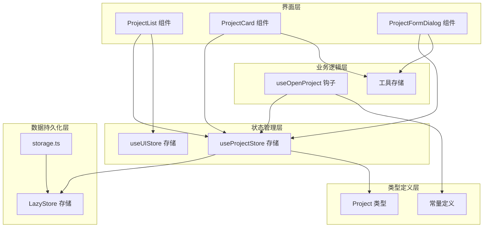

**图表来源**
- [ProjectList.tsx:12-159](file://src/components/project/ProjectList.tsx#L12-L159)
- [useProjectStore.ts:16-66](file://src/stores/useProjectStore.ts#L16-L66)
- [storage.ts:4-29](file://src/lib/storage.ts#L4-L29)

**章节来源**
- [ProjectList.tsx:1-168](file://src/components/project/ProjectList.tsx#L1-L168)
- [useProjectStore.ts:1-67](file://src/stores/useProjectStore.ts#L1-L67)
- [storage.ts:1-30](file://src/lib/storage.ts#L1-L30)

## 核心组件

### 数据模型设计

项目数据模型采用简洁而实用的设计，支持项目的基本信息、标签管理和时间戳记录：

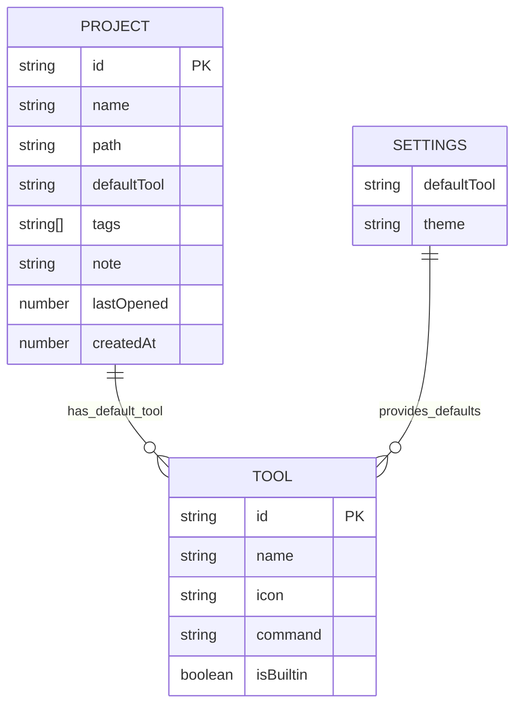

**图表来源**
- [index.ts:1-26](file://src/types/index.ts#L1-L26)

项目模型的关键特性：
- **唯一标识符**: 使用 UUID v4 生成全局唯一的项目 ID
- **路径验证**: 支持绝对路径和相对路径，自动格式化显示
- **标签系统**: 多标签支持，便于分类和筛选
- **时间戳管理**: 同时跟踪创建时间和最后打开时间
- **默认工具**: 支持为特定项目设置默认开发工具

**章节来源**
- [index.ts:1-10](file://src/types/index.ts#L1-L10)

### 状态管理策略

系统采用 Zustand 实现轻量级状态管理，提供响应式的数据流和高效的性能表现：

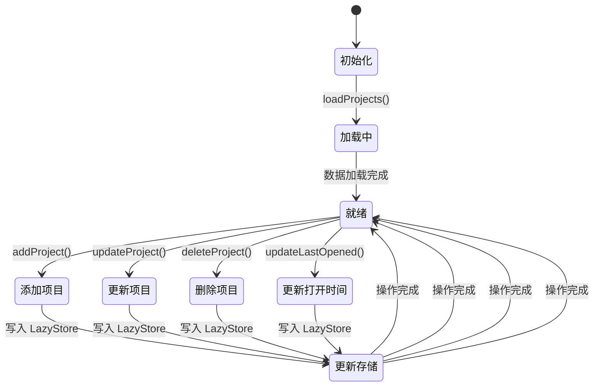

**图表来源**
- [useProjectStore.ts:16-66](file://src/stores/useProjectStore.ts#L16-L66)

**章节来源**
- [useProjectStore.ts:6-14](file://src/stores/useProjectStore.ts#L6-L14)

## 架构概览

项目管理模块的整体架构体现了清晰的关注点分离和职责划分：

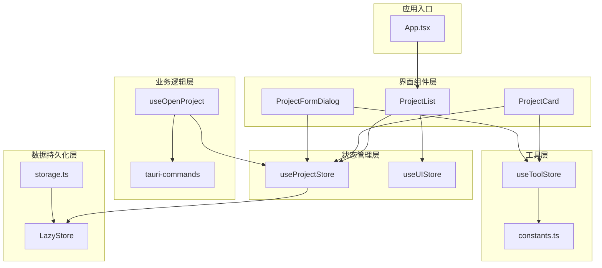

**图表来源**
- [App.tsx:21-30](file://src/App.tsx#L21-L30)
- [useProjectStore.ts:16-66](file://src/stores/useProjectStore.ts#L16-L66)
- [storage.ts:19-29](file://src/lib/storage.ts#L19-L29)

## 详细组件分析

### 项目列表组件 (ProjectList)

项目列表组件是用户与项目数据交互的主要界面，提供了丰富的搜索、筛选和排序功能：

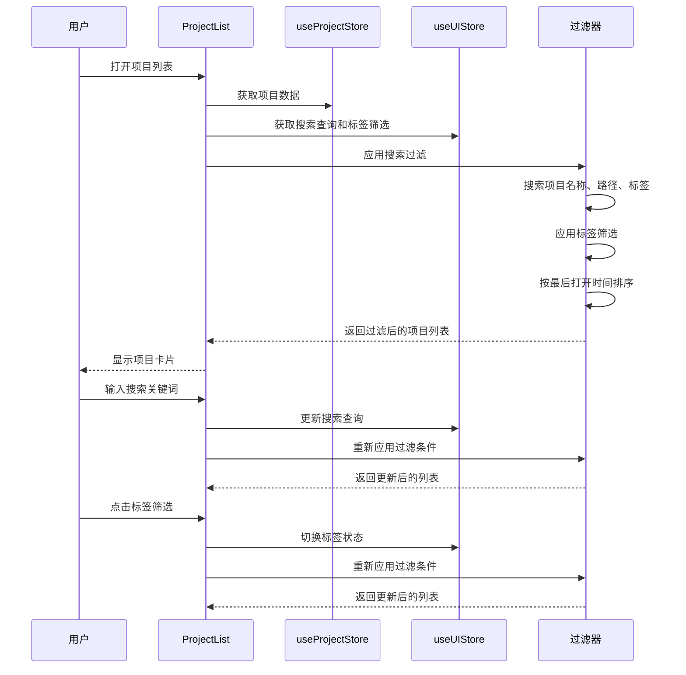

**图表来源**
- [ProjectList.tsx:12-55](file://src/components/project/ProjectList.tsx#L12-L55)
- [useUIStore.ts:14-32](file://src/stores/useUIStore.ts#L14-L32)

**章节来源**
- [ProjectList.tsx:12-159](file://src/components/project/ProjectList.tsx#L12-L159)

#### 搜索和过滤算法

项目搜索和过滤功能采用多条件组合的方式，确保用户能够快速找到目标项目：

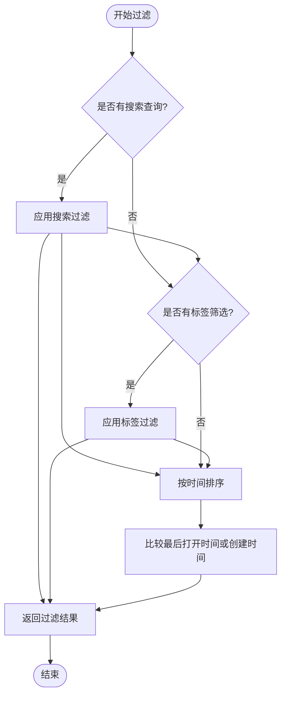

**图表来源**
- [ProjectList.tsx:29-55](file://src/components/project/ProjectList.tsx#L29-L55)

### 项目卡片组件 (ProjectCard)

项目卡片组件提供了项目的详细信息展示和快捷操作功能：

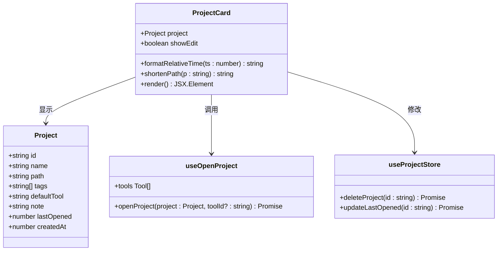

**图表来源**
- [ProjectCard.tsx:23-25](file://src/components/project/ProjectCard.tsx#L23-L25)
- [index.ts:1-10](file://src/types/index.ts#L1-L10)
- [useOpenProject.ts:9-43](file://src/hooks/useOpenProject.ts#L9-L43)

**章节来源**
- [ProjectCard.tsx:27-160](file://src/components/project/ProjectCard.tsx#L27-L160)

#### 时间格式化逻辑

项目卡片中的时间显示采用了智能的时间格式化策略：

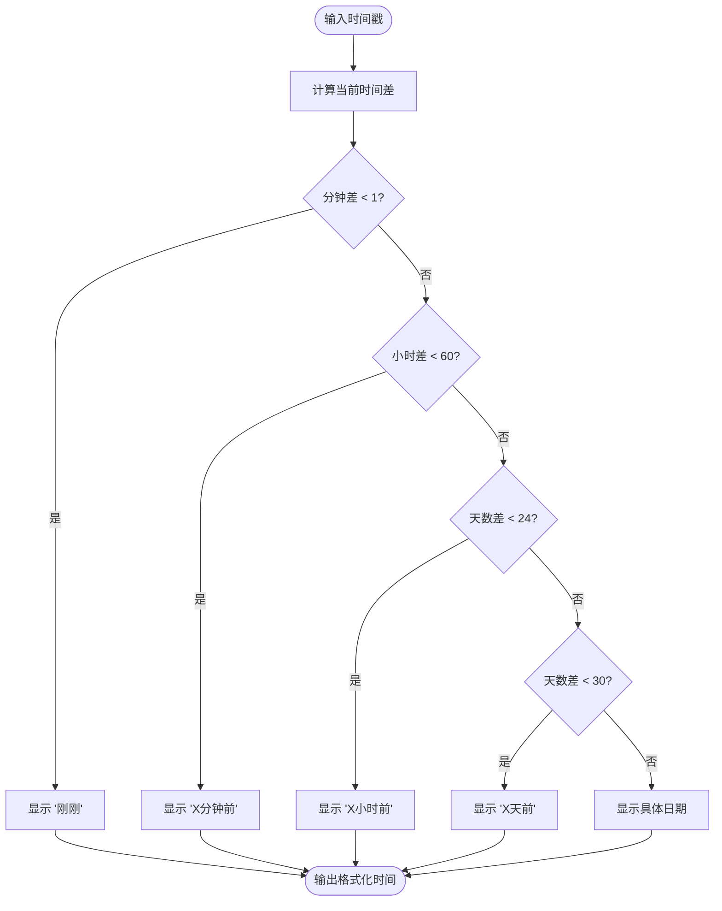

**图表来源**
- [ProjectCard.tsx:163-173](file://src/components/project/ProjectCard.tsx#L163-L173)

### 项目表单对话框 (ProjectFormDialog)

项目表单对话框提供了完整的项目创建和编辑功能：

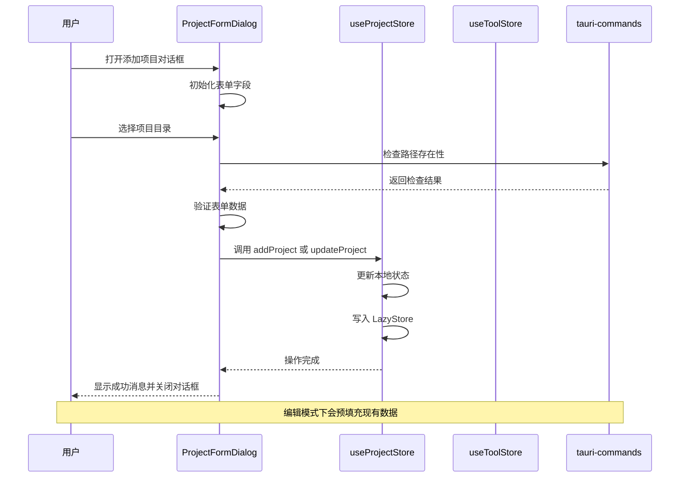

**图表来源**
- [ProjectFormDialog.tsx:33-134](file://src/components/project/ProjectFormDialog.tsx#L33-L134)
- [useProjectStore.ts:30-49](file://src/stores/useProjectStore.ts#L30-L49)

**章节来源**
- [ProjectFormDialog.tsx:33-228](file://src/components/project/ProjectFormDialog.tsx#L33-L228)

#### 表单验证和错误处理

表单组件实现了多层次的验证机制：

1. **必填字段验证**: 项目名称和路径不能为空
2. **路径存在性验证**: 通过 Tauri 命令检查目录是否存在
3. **标签解析**: 自动解析逗号分隔的标签字符串
4. **异步错误处理**: 使用 toast 提供用户友好的错误反馈

### 开放项目钩子 (useOpenProject)

开放项目钩子封装了项目打开的复杂逻辑，包括工具解析、命令执行和状态更新：

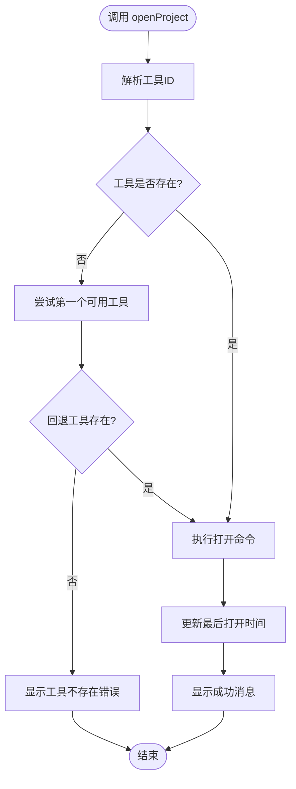

**图表来源**
- [useOpenProject.ts:15-40](file://src/hooks/useOpenProject.ts#L15-L40)

**章节来源**
- [useOpenProject.ts:9-43](file://src/hooks/useOpenProject.ts#L9-L43)

## 依赖关系分析

项目管理模块的依赖关系体现了清晰的分层设计和最小耦合原则：

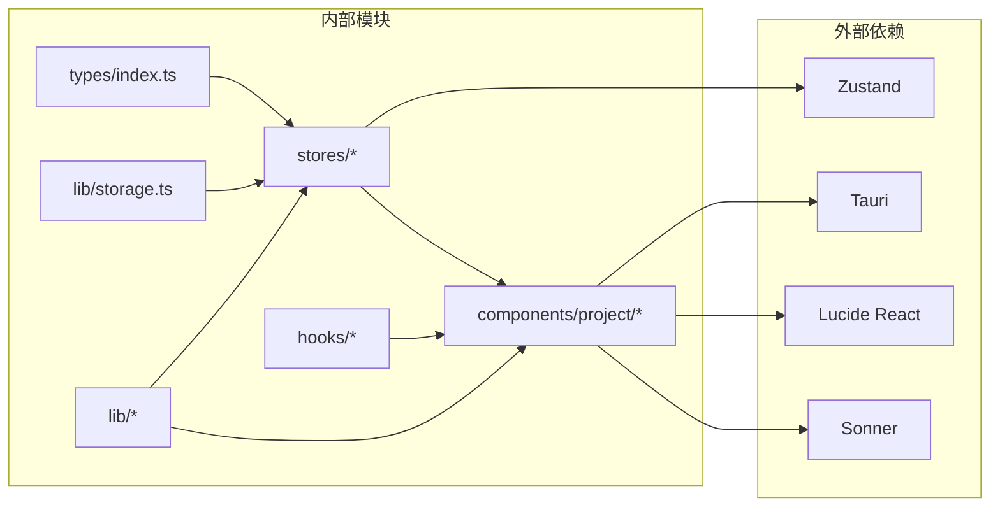

**图表来源**
- [useProjectStore.ts:1-4](file://src/stores/useProjectStore.ts#L1-L4)
- [storage.ts:1](file://src/lib/storage.ts#L1)

**章节来源**
- [useProjectStore.ts:1-67](file://src/stores/useProjectStore.ts#L1-L67)
- [storage.ts:1-30](file://src/lib/storage.ts#L1-L30)

### 数据流分析

项目管理模块的数据流遵循单向数据流原则，确保了状态的一致性和可预测性：

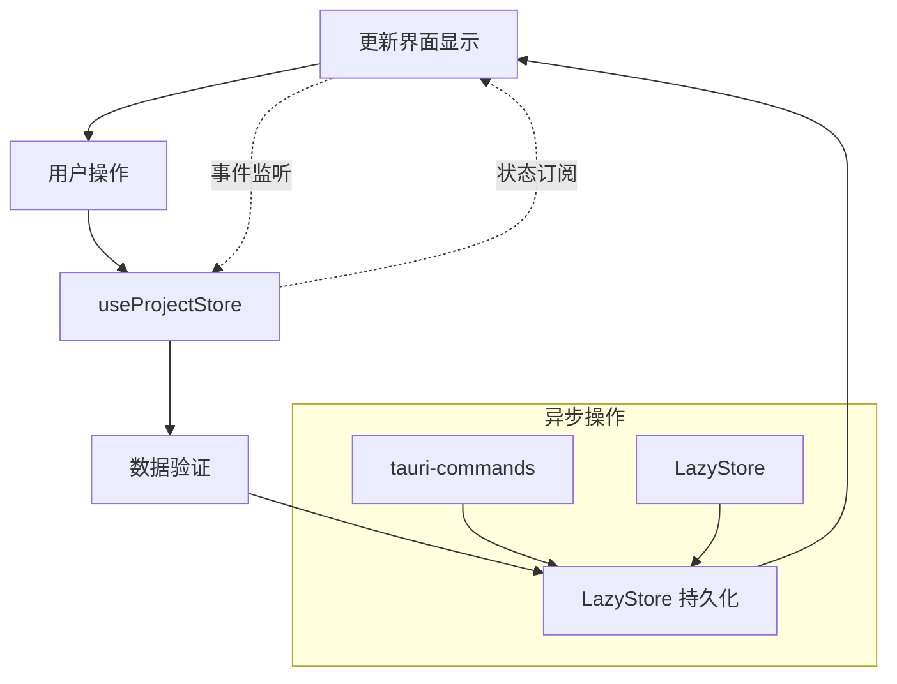

**图表来源**
- [useProjectStore.ts:20-28](file://src/stores/useProjectStore.ts#L20-L28)
- [storage.ts:19-21](file://src/lib/storage.ts#L19-L21)

## 性能考虑

项目管理模块在设计时充分考虑了性能优化，采用了多种策略来提升用户体验：

### 状态管理优化
- **选择性订阅**: 使用 Zustand 的选择器函数避免不必要的重渲染
- **批量更新**: 合理组织状态更新操作，减少组件重新渲染次数
- **内存管理**: 及时清理未使用的状态和事件监听器

### 数据处理优化
- **懒加载**: 项目数据采用懒加载策略，仅在需要时才从存储中读取
- **缓存机制**: 利用 LazyStore 的自动保存特性，减少频繁的磁盘 I/O 操作
- **计算优化**: 使用 useMemo 和 useCallback 优化复杂的计算和回调函数

### UI渲染优化
- **虚拟滚动**: 对于大量项目的情况，可以考虑实现虚拟滚动以提升渲染性能
- **防抖处理**: 搜索功能实现了防抖机制，避免频繁的搜索请求
- **渐进式加载**: 列表组件支持渐进式加载，提升大数据量场景下的响应速度

## 故障排除指南

### 常见问题及解决方案

#### 项目无法保存
**症状**: 添加或编辑项目后数据丢失
**可能原因**:
- LazyStore 写入失败
- 磁盘权限问题
- 应用崩溃导致状态未持久化

**解决步骤**:
1. 检查应用是否有写入权限
2. 验证项目路径的有效性
3. 重启应用后检查数据是否恢复
4. 查看应用日志获取详细错误信息

#### 项目打开失败
**症状**: 点击项目无法打开
**可能原因**:
- 默认工具配置错误
- 项目路径不存在
- 权限不足

**解决步骤**:
1. 检查项目路径是否正确
2. 验证默认工具配置
3. 确认应用具有必要的系统权限
4. 尝试手动选择其他工具打开

#### 搜索功能异常
**症状**: 搜索不到预期的项目
**可能原因**:
- 搜索索引未更新
- 特殊字符处理问题
- 大小写敏感性

**解决步骤**:
1. 清除搜索缓存并重新搜索
2. 尝试不同的搜索关键词
3. 检查项目标签是否正确设置
4. 验证项目名称和路径的拼写

### 错误处理机制

系统实现了多层次的错误处理机制：

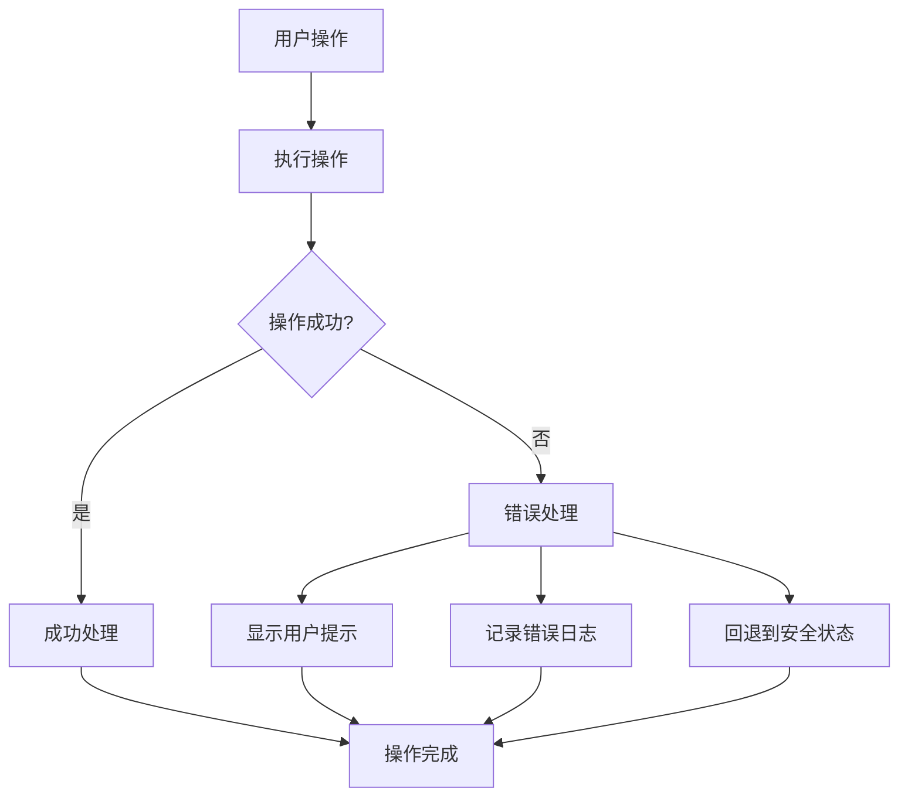

**图表来源**
- [ProjectFormDialog.tsx:84-134](file://src/components/project/ProjectFormDialog.tsx#L84-L134)
- [useOpenProject.ts:31-38](file://src/hooks/useOpenProject.ts#L31-L38)

**章节来源**
- [ProjectFormDialog.tsx:84-134](file://src/components/project/ProjectFormDialog.tsx#L84-L134)
- [useOpenProject.ts:31-38](file://src/hooks/useOpenProject.ts#L31-L38)

## 结论

项目管理模块展现了现代前端应用的最佳实践，通过合理的架构设计和精心的状态管理，实现了高效、可靠且用户友好的项目管理功能。模块的主要优势包括：

### 技术优势
- **清晰的架构分层**: 从界面到数据持久化的完整分层设计
- **高效的性能表现**: 通过多种优化策略确保流畅的用户体验
- **完善的错误处理**: 多层次的错误处理机制保障系统的稳定性
- **灵活的扩展性**: 模块化设计便于功能扩展和维护

### 功能特色
- **智能搜索过滤**: 支持多维度的搜索和标签筛选
- **直观的用户界面**: 响应式设计和友好的交互体验
- **强大的数据持久化**: 基于 LazyStore 的可靠数据存储
- **灵活的工具集成**: 支持多种开发工具的集成和切换

### 改进建议
1. **增加项目导入导出功能**，支持数据备份和迁移
2. **实现项目模板系统**，提升项目初始化效率
3. **添加项目历史记录**，追踪项目变更历史
4. **优化大项目集的性能**，考虑虚拟滚动等技术

该项目管理模块为开发者提供了一个坚实的基础，可以在此基础上进一步扩展更多高级功能，满足不同用户的需求。