# UI 状态管理

<cite>
**本文档引用的文件**
- [useUIStore.ts](file://src/stores/useUIStore.ts)
- [MainLayout.tsx](file://src/components/layout/MainLayout.tsx)
- [Sidebar.tsx](file://src/components/layout/Sidebar.tsx)
- [ProjectList.tsx](file://src/components/project/ProjectList.tsx)
- [ToolList.tsx](file://src/components/tool/ToolList.tsx)
- [useProjectStore.ts](file://src/stores/useProjectStore.ts)
- [useSettingsStore.ts](file://src/stores/useSettingsStore.ts)
- [useToolStore.ts](file://src/stores/useToolStore.ts)
- [storage.ts](file://src/lib/storage.ts)
- [constants.ts](file://src/lib/constants.ts)
- [index.ts](file://src/types/index.ts)
- [App.tsx](file://src/App.tsx)
- [useOpenProject.ts](file://src/hooks/useOpenProject.ts)
</cite>

## 目录
1. [简介](#简介)
2. [项目结构](#项目结构)
3. [核心组件](#核心组件)
4. [架构概览](#架构概览)
5. [详细组件分析](#详细组件分析)
6. [依赖关系分析](#依赖关系分析)
7. [性能考虑](#性能考虑)
8. [故障排除指南](#故障排除指南)
9. [结论](#结论)

## 简介

UI 状态管理模块是 LaunchPro 应用程序的核心组件之一，负责管理用户界面的状态和交互行为。该模块基于 Zustand 状态管理库构建，提供了轻量级且高效的全局状态管理解决方案。本文档深入解析 useUIStore 的实现原理、设计模式以及与应用程序其他部分的集成方式。

UI 状态管理涵盖了多个关键功能领域：
- **视图导航状态**：管理当前激活的视图（项目、工具、设置）
- **搜索过滤状态**：处理项目搜索查询和标签过滤
- **用户交互状态**：协调模态框显示、侧边栏状态等
- **状态同步机制**：确保 UI 状态与其他存储层的正确同步

## 项目结构

LaunchPro 的 UI 状态管理采用模块化的架构设计，主要由以下层次组成：

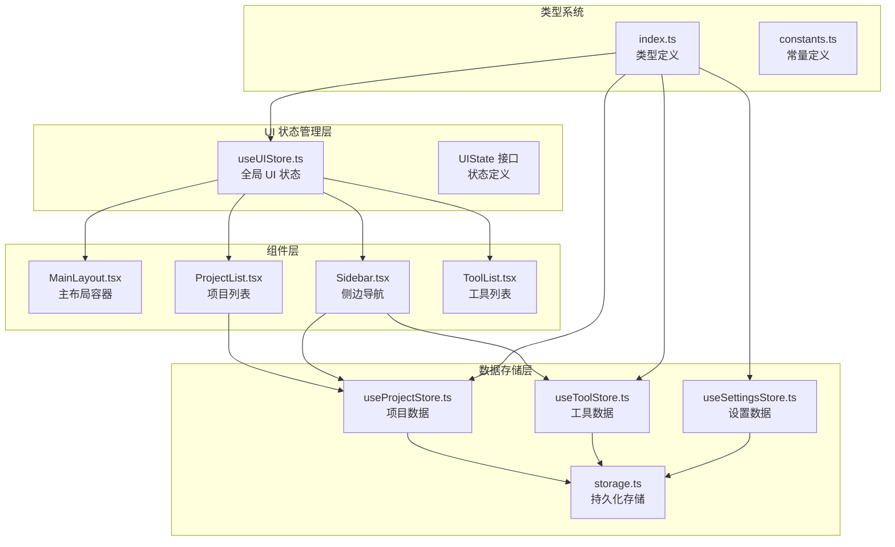

**图表来源**
- [useUIStore.ts:1-33](file://src/stores/useUIStore.ts#L1-L33)
- [MainLayout.tsx:1-21](file://src/components/layout/MainLayout.tsx#L1-L21)
- [Sidebar.tsx:1-80](file://src/components/layout/Sidebar.tsx#L1-L80)

**章节来源**
- [useUIStore.ts:1-33](file://src/stores/useUIStore.ts#L1-L33)
- [MainLayout.tsx:1-21](file://src/components/layout/MainLayout.tsx#L1-L21)
- [Sidebar.tsx:1-80](file://src/components/layout/Sidebar.tsx#L1-L80)

## 核心组件

### useUIStore - 全局 UI 状态管理器

useUIStore 是基于 Zustand 构建的全局状态管理器，负责维护和管理所有 UI 相关的状态。其核心设计遵循函数式状态管理模式，提供简洁而强大的状态更新机制。

#### 数据结构设计

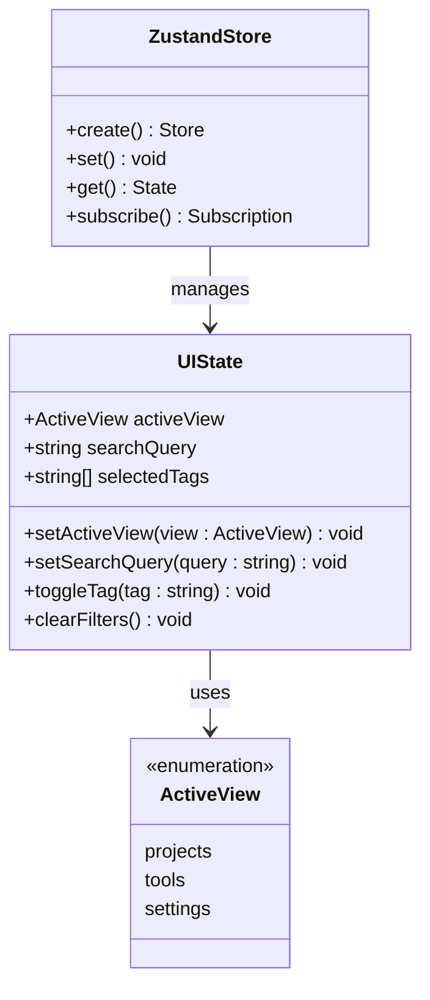

**图表来源**
- [useUIStore.ts:4-12](file://src/stores/useUIStore.ts#L4-L12)
- [index.ts:25](file://src/types/index.ts#L25)

#### 状态管理策略

useUIStore 采用了以下核心设计原则：

1. **单一职责原则**：专注于 UI 状态管理，不涉及业务逻辑
2. **不可变性**：通过状态替换而非直接修改来保证数据一致性
3. **函数式更新**：使用 set 函数进行状态更新，避免副作用
4. **选择性订阅**：组件只订阅需要的状态片段，提高性能

**章节来源**
- [useUIStore.ts:14-32](file://src/stores/useUIStore.ts#L14-L32)
- [index.ts:25](file://src/types/index.ts#L25)

## 架构概览

UI 状态管理系统采用分层架构设计，各层之间职责明确，耦合度低，便于维护和扩展。

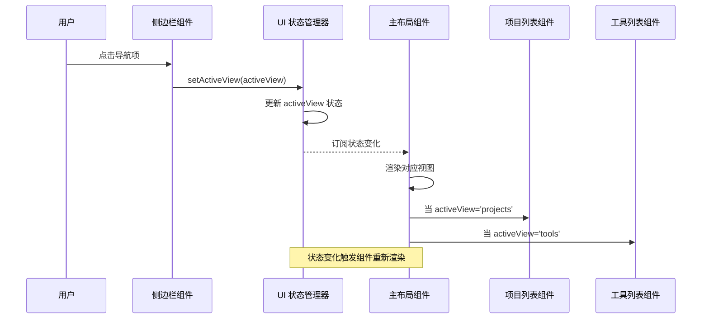

**图表来源**
- [Sidebar.tsx:17-18](file://src/components/layout/Sidebar.tsx#L17-L18)
- [useUIStore.ts:19](file://src/stores/useUIStore.ts#L19)
- [MainLayout.tsx:8](file://src/components/layout/MainLayout.tsx#L8)

### 状态流转机制

UI 状态管理器实现了完整的状态流转机制，包括状态初始化、更新和订阅：

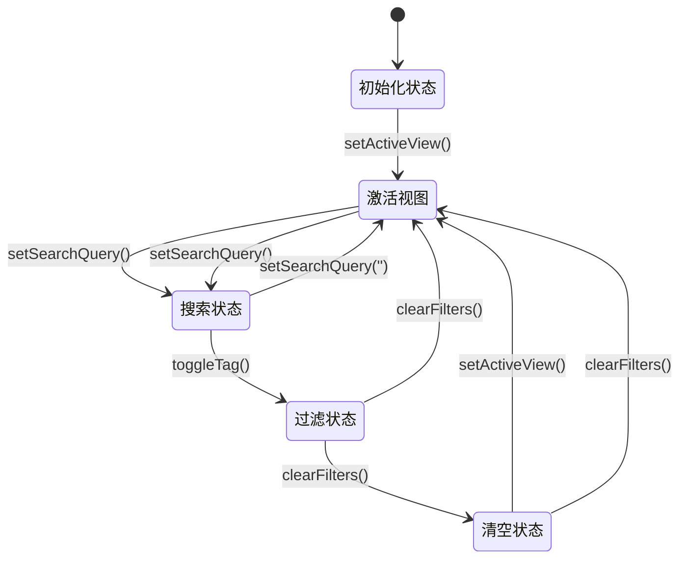

**图表来源**
- [useUIStore.ts:15-31](file://src/stores/useUIStore.ts#L15-L31)

## 详细组件分析

### 视图导航系统

#### Sidebar 组件 - 导航控制器

Sidebar 组件作为 UI 状态的主要入口点，负责处理用户导航交互并将状态变更传递给 useUIStore。

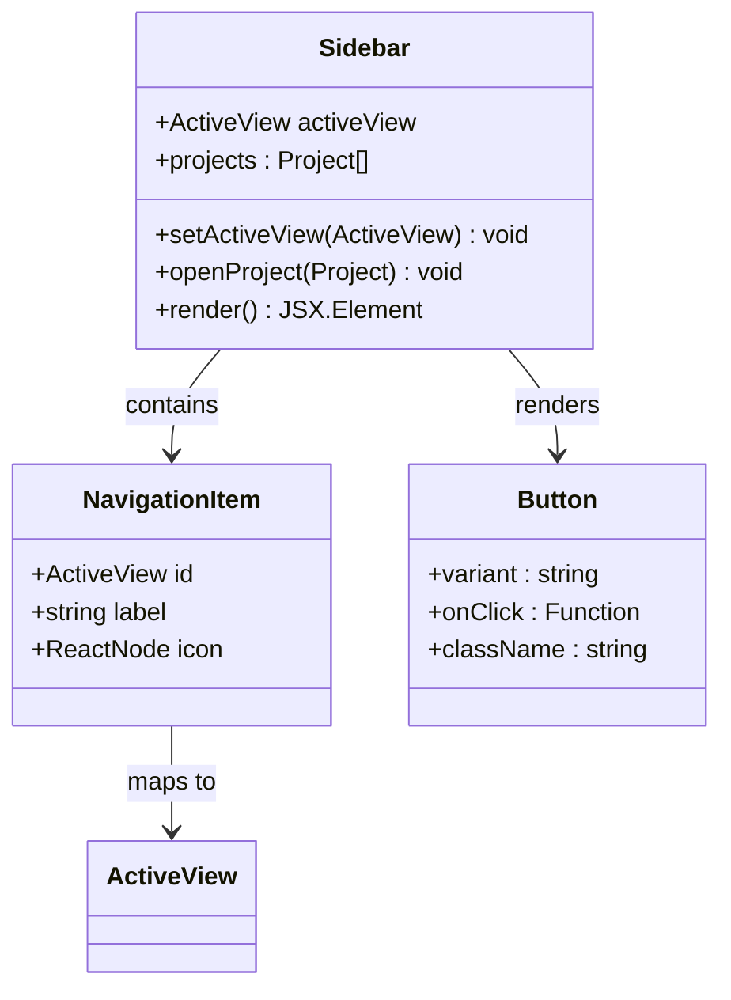

**图表来源**
- [Sidebar.tsx:10-14](file://src/components/layout/Sidebar.tsx#L10-L14)
- [Sidebar.tsx:17-18](file://src/components/layout/Sidebar.tsx#L17-L18)

#### MainLayout 组件 - 视图容器

MainLayout 组件根据当前激活的视图动态渲染相应的子组件，实现了视图级别的状态同步。

**章节来源**
- [Sidebar.tsx:16-79](file://src/components/layout/Sidebar.tsx#L16-L79)
- [MainLayout.tsx:7-20](file://src/components/layout/MainLayout.tsx#L7-L20)

### 搜索和过滤系统

#### ProjectList 组件 - 搜索过滤器

ProjectList 组件集成了完整的搜索和过滤功能，展示了 UI 状态在实际应用中的复杂交互模式。

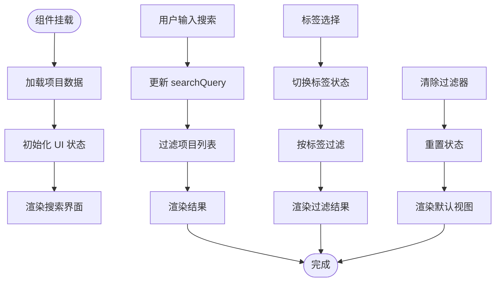

**图表来源**
- [ProjectList.tsx:15-19](file://src/components/project/ProjectList.tsx#L15-L19)
- [ProjectList.tsx:30-55](file://src/components/project/ProjectList.tsx#L30-L55)

#### 过滤算法实现

搜索和过滤功能采用了高效的算法设计：

1. **多条件过滤**：支持名称、路径、标签的组合搜索
2. **实时过滤**：用户输入时即时响应，提供流畅的用户体验
3. **智能排序**：优先显示最近打开的项目
4. **状态同步**：过滤状态与 UI 状态完全同步

**章节来源**
- [ProjectList.tsx:22-55](file://src/components/project/ProjectList.tsx#L22-L55)

### 状态同步机制

#### 组件间状态协调

UI 状态管理器通过以下机制确保组件间的状态同步：

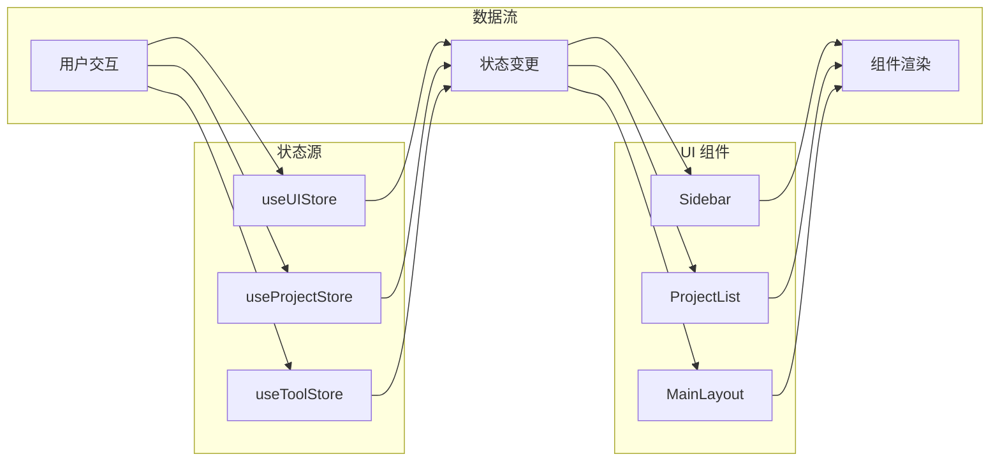

**图表来源**
- [useUIStore.ts:14-32](file://src/stores/useUIStore.ts#L14-L32)
- [Sidebar.tsx:17-18](file://src/components/layout/Sidebar.tsx#L17-L18)
- [ProjectList.tsx:15-19](file://src/components/project/ProjectList.tsx#L15-L19)

**章节来源**
- [useUIStore.ts:14-32](file://src/stores/useUIStore.ts#L14-L32)
- [Sidebar.tsx:17-18](file://src/components/layout/Sidebar.tsx#L17-L18)
- [ProjectList.tsx:15-19](file://src/components/project/ProjectList.tsx#L15-L19)

## 依赖关系分析

### 外部依赖

UI 状态管理模块依赖于以下关键外部库：

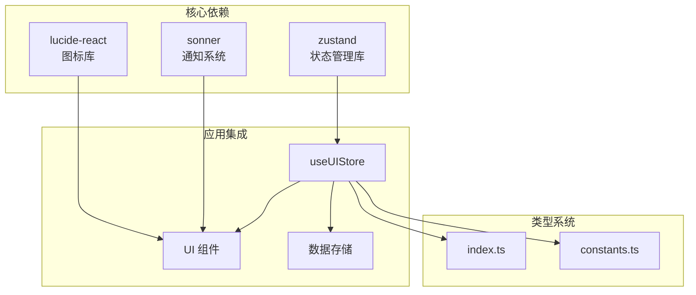

**图表来源**
- [useUIStore.ts:1](file://src/stores/useUIStore.ts#L1)
- [Sidebar.tsx:1](file://src/components/layout/Sidebar.tsx#L1)

### 内部依赖关系

UI 状态管理器与应用程序其他部分的依赖关系如下：

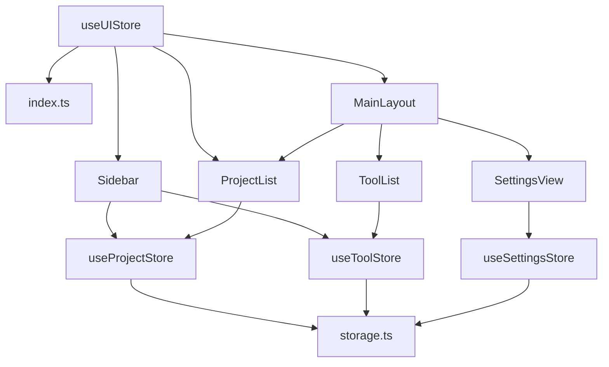

**图表来源**
- [useUIStore.ts:2](file://src/stores/useUIStore.ts#L2)
- [MainLayout.tsx:1-6](file://src/components/layout/MainLayout.tsx#L1-L6)

**章节来源**
- [useUIStore.ts:1-3](file://src/stores/useUIStore.ts#L1-L3)
- [MainLayout.tsx:1-6](file://src/components/layout/MainLayout.tsx#L1-L6)

## 性能考虑

### 状态最小化策略

UI 状态管理器采用了多项性能优化策略：

1. **选择性订阅**：组件只订阅需要的状态片段，减少不必要的重渲染
2. **状态分割**：将 UI 状态与业务数据分离，避免状态膨胀
3. **计算缓存**：使用 useMemo 缓存计算结果，避免重复计算
4. **异步加载**：项目数据异步加载，不影响 UI 响应性

### 渲染优化

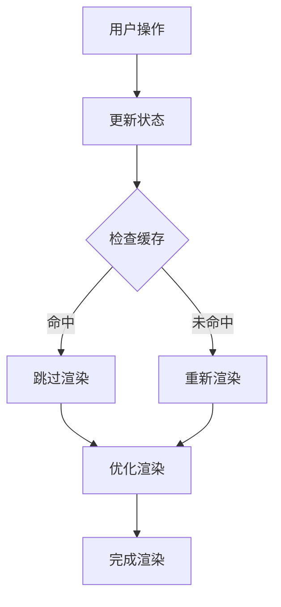

**图表来源**
- [ProjectList.tsx:22-27](file://src/components/project/ProjectList.tsx#L22-L27)
- [ProjectList.tsx:30-55](file://src/components/project/ProjectList.tsx#L30-L55)

### 内存管理

UI 状态管理器在内存管理方面采取了以下措施：

1. **状态清理**：组件卸载时自动清理订阅
2. **垃圾回收**：避免创建不必要的中间对象
3. **事件监听**：及时移除事件监听器
4. **资源释放**：确保临时资源得到及时释放

**章节来源**
- [ProjectList.tsx:22-55](file://src/components/project/ProjectList.tsx#L22-L55)

## 故障排除指南

### 常见问题诊断

#### 状态不同步问题

当出现 UI 状态不同步问题时，可以按照以下步骤进行诊断：

1. **检查状态订阅**：确认组件是否正确订阅了所需的状态
2. **验证状态更新**：确认状态更新函数是否被正确调用
3. **检查依赖关系**：确认组件间的依赖关系是否正确
4. **调试状态变化**：使用浏览器开发者工具监控状态变化

#### 渲染性能问题

如果遇到渲染性能问题，可以：

1. **分析渲染次数**：使用 React DevTools 分析组件渲染频率
2. **优化订阅范围**：减少不必要的状态订阅
3. **实施记忆化**：使用 useMemo 和 useCallback 优化性能
4. **检查数据结构**：确保数据结构适合当前的使用场景

### 调试技巧

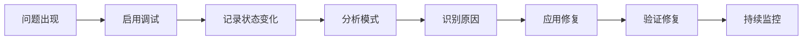

**图表来源**
- [useUIStore.ts:14-32](file://src/stores/useUIStore.ts#L14-L32)

**章节来源**
- [useUIStore.ts:14-32](file://src/stores/useUIStore.ts#L14-L32)

## 结论

UI 状态管理模块通过精心设计的架构和实现策略，成功地解决了现代前端应用中复杂的 UI 状态管理需求。该模块的主要优势包括：

### 设计优势

1. **简洁性**：基于 Zustand 的轻量级实现，代码简洁易懂
2. **可扩展性**：模块化设计便于功能扩展和维护
3. **性能优化**：采用多种优化策略确保良好的用户体验
4. **类型安全**：完整的 TypeScript 类型定义提供编译时安全保障

### 技术创新

1. **状态分离**：将 UI 状态与业务数据分离，提高了代码的内聚性
2. **响应式设计**：实现了完整的响应式状态管理机制
3. **组件解耦**：通过状态管理器实现了组件间的松耦合
4. **异步处理**：合理处理异步数据加载和状态更新

### 最佳实践

该模块体现了现代前端开发的最佳实践，包括：
- 单一职责原则的应用
- 不可变性状态管理
- 选择性订阅模式
- 性能优化策略
- 错误处理机制

UI 状态管理模块为 LaunchPro 提供了稳定可靠的状态管理基础，为后续的功能扩展和性能优化奠定了坚实的基础。