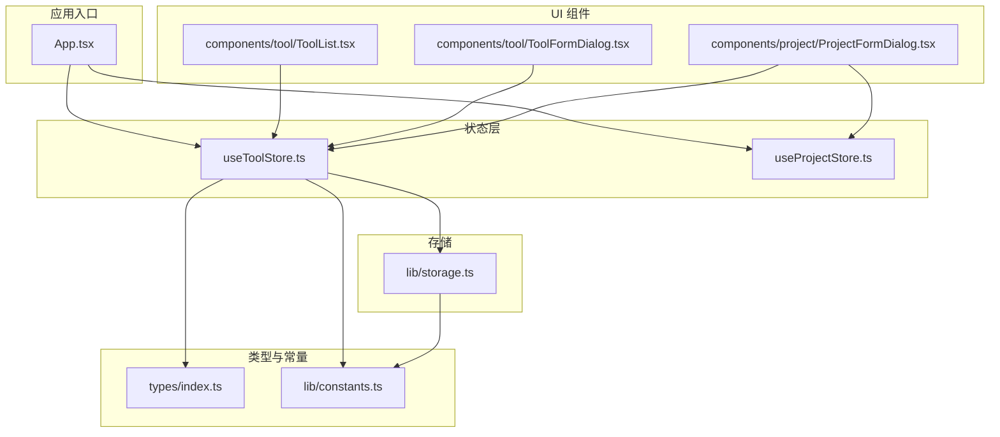
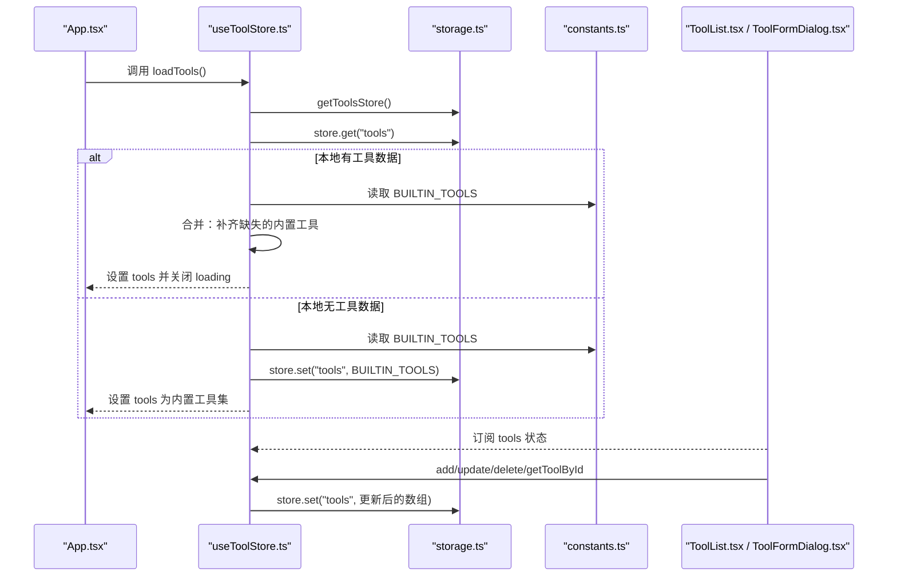
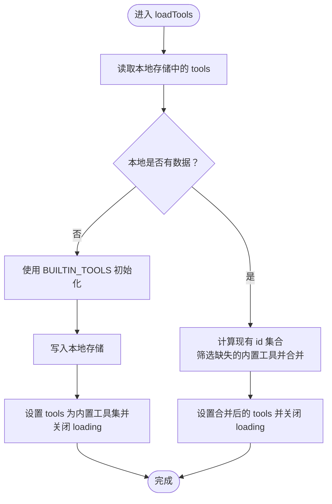
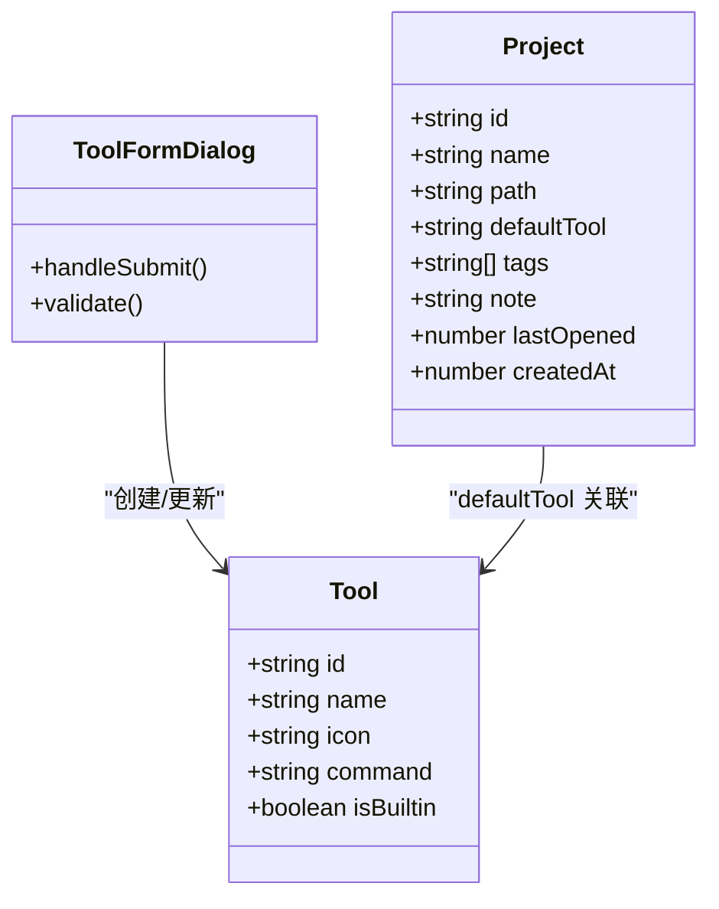
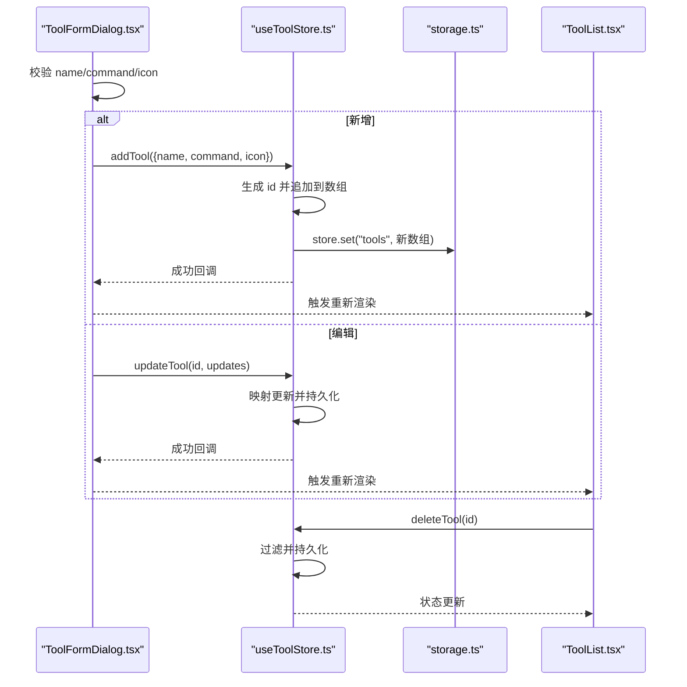
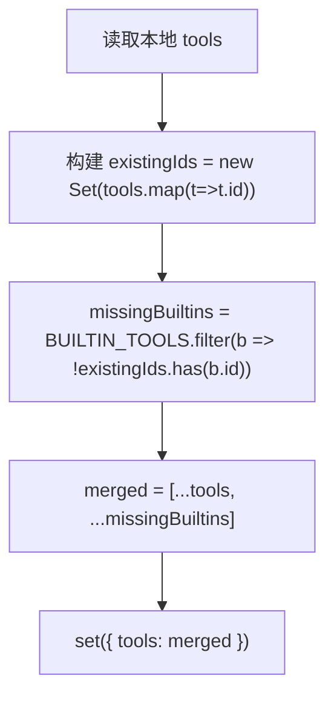
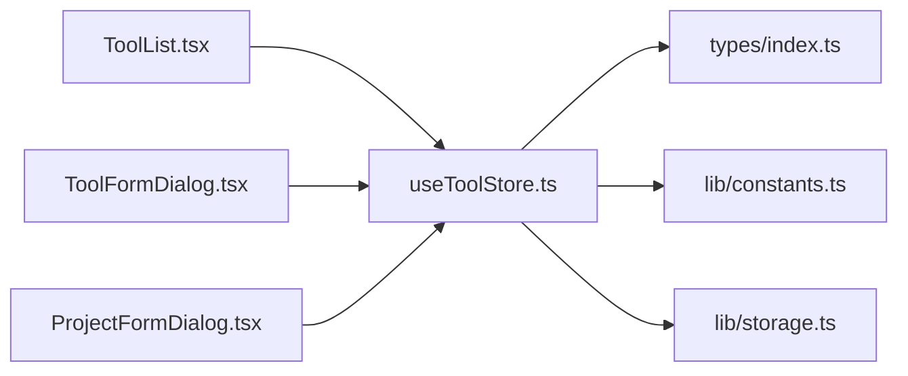

# 工具状态管理

<cite>
**本文档引用的文件**
- [useToolStore.ts](file://src/stores/useToolStore.ts)
- [index.ts](file://src/types/index.ts)
- [constants.ts](file://src/lib/constants.ts)
- [storage.ts](file://src/lib/storage.ts)
- [ToolFormDialog.tsx](file://src/components/tool/ToolFormDialog.tsx)
- [ToolList.tsx](file://src/components/tool/ToolList.tsx)
- [ProjectFormDialog.tsx](file://src/components/project/ProjectFormDialog.tsx)
- [useProjectStore.ts](file://src/stores/useProjectStore.ts)
- [App.tsx](file://src/App.tsx)
</cite>

## 目录
1. [简介](#简介)
2. [项目结构](#项目结构)
3. [核心组件](#核心组件)
4. [架构总览](#架构总览)
5. [详细组件分析](#详细组件分析)
6. [依赖关系分析](#依赖关系分析)
7. [性能考虑](#性能考虑)
8. [故障排除指南](#故障排除指南)
9. [结论](#结论)
10. [附录](#附录)

## 简介
本文件系统性地解析工具状态管理模块，重点围绕 useToolStore 的实现原理、设计模式与数据模型，阐述工具 CRUD 生命周期、内置工具与自定义工具的合并逻辑、命令模板机制、动态列表管理与状态更新策略，并给出工具配置的验证规则、默认值处理、使用示例与配置模式、工具与项目之间的关联关系及依赖管理，以及扩展性与自定义配置支持机制。目标是帮助开发者快速理解并正确使用该模块。

## 项目结构
工具状态管理模块位于前端状态层，采用 Zustand 状态管理库，结合 Tauri Store 进行本地持久化。主要文件分布如下：
- 状态层：src/stores/useToolStore.ts
- 类型定义：src/types/index.ts
- 常量与内置工具：src/lib/constants.ts
- 存储封装：src/lib/storage.ts
- UI 组件：src/components/tool/ToolList.tsx、src/components/tool/ToolFormDialog.tsx
- 项目集成：src/components/project/ProjectFormDialog.tsx、src/stores/useProjectStore.ts
- 应用入口：src/App.tsx

**图表来源**
- [useToolStore.ts:1-75](file://src/stores/useToolStore.ts#L1-L75)
- [useProjectStore.ts:1-67](file://src/stores/useProjectStore.ts#L1-L67)
- [index.ts:12-18](file://src/types/index.ts#L12-L18)
- [constants.ts:3-18](file://src/lib/constants.ts#L3-L18)
- [storage.ts:19-29](file://src/lib/storage.ts#L19-L29)
- [ToolList.tsx:12-81](file://src/components/tool/ToolList.tsx#L12-L81)
- [ToolFormDialog.tsx:21-134](file://src/components/tool/ToolFormDialog.tsx#L21-L134)
- [ProjectFormDialog.tsx:33-229](file://src/components/project/ProjectFormDialog.tsx#L33-L229)
- [App.tsx:21-39](file://src/App.tsx#L21-L39)

**章节来源**
- [useToolStore.ts:1-75](file://src/stores/useToolStore.ts#L1-L75)
- [index.ts:12-18](file://src/types/index.ts#L12-L18)
- [constants.ts:3-18](file://src/lib/constants.ts#L3-L18)
- [storage.ts:19-29](file://src/lib/storage.ts#L19-L29)
- [ToolList.tsx:12-81](file://src/components/tool/ToolList.tsx#L12-L81)
- [ToolFormDialog.tsx:21-134](file://src/components/tool/ToolFormDialog.tsx#L21-L134)
- [ProjectFormDialog.tsx:33-229](file://src/components/project/ProjectFormDialog.tsx#L33-L229)
- [App.tsx:21-39](file://src/App.tsx#L21-L39)

## 核心组件
- useToolStore：工具状态容器，负责工具的加载、增删改查、合并内置工具与用户自定义工具、持久化到本地存储。
- Tool 数据模型：包含 id、name、icon、command、isBuiltin 字段，用于描述工具的基本信息与行为。
- 内置工具常量：BUILTIN_TOOLS 定义了预置工具集合，作为初始数据与后续合并的基础。
- 存储封装：getToolsStore 提供 LazyStore 访问器，统一管理工具数据的读写与默认值。
- UI 组件：ToolList 展示工具列表（内置与自定义分组），ToolFormDialog 负责工具的新增与编辑表单校验与提交。

**章节来源**
- [useToolStore.ts:7-15](file://src/stores/useToolStore.ts#L7-L15)
- [index.ts:12-18](file://src/types/index.ts#L12-L18)
- [constants.ts:3-18](file://src/lib/constants.ts#L3-L18)
- [storage.ts:23-25](file://src/lib/storage.ts#L23-L25)
- [ToolList.tsx:12-81](file://src/components/tool/ToolList.tsx#L12-L81)
- [ToolFormDialog.tsx:21-134](file://src/components/tool/ToolFormDialog.tsx#L21-L134)

## 架构总览
工具状态管理采用“状态容器 + 类型约束 + 常量 + 存储”的分层设计。应用启动时，App 在副作用中调用 loadTools、loadProjects、loadSettings，确保工具与项目数据在 UI 渲染前就绪。useToolStore 负责：
- 初始化：若本地无工具数据，则以 BUILTIN_TOOLS 作为默认初始化；否则从本地存储读取。
- 合并策略：加载后检查本地工具是否缺失内置工具 ID，若有则补齐，保证内置工具始终存在。
- CRUD：提供 addTool、updateTool、deleteTool、getToolById 等方法，均同步更新内存状态与本地存储。
- UI 集成：ToolList 与 ToolFormDialog 通过 Zustand 的选择器订阅工具状态，实现响应式渲染与交互。

**图表来源**
- [App.tsx:26-30](file://src/App.tsx#L26-L30)
- [useToolStore.ts:21-39](file://src/stores/useToolStore.ts#L21-L39)
- [storage.ts:23-25](file://src/lib/storage.ts#L23-L25)
- [constants.ts:3-18](file://src/lib/constants.ts#L3-L18)
- [ToolList.tsx:12-81](file://src/components/tool/ToolList.tsx#L12-L81)
- [ToolFormDialog.tsx:44-78](file://src/components/tool/ToolFormDialog.tsx#L44-L78)

## 详细组件分析

### useToolStore 实现与设计模式
- 设计模式：基于 Zustand 的函数式状态管理，通过 create 创建状态切片，暴露纯函数式的操作接口，避免样板代码。
- 状态结构：包含 tools 数组、isLoading 标志，以及 loadTools、addTool、updateTool、deleteTool、getToolById 方法。
- 加载流程：优先从本地存储读取 tools；若为空则以 BUILTIN_TOOLS 初始化并写入存储；若非空则进行“内置工具补齐”合并。
- 合并逻辑：计算现有工具的 id 集合，筛选出不在其中的内置工具并拼接，确保内置工具始终存在且不重复。
- CRUD 行为：
  - 新增：生成唯一 id，标记为非内置，追加到数组并持久化。
  - 更新：映射原数组，匹配 id 的元素进行深合并，然后持久化。
  - 删除：禁止删除内置工具；过滤掉目标 id 并持久化。
  - 查询：按 id 查找工具对象。
- 错误处理：加载失败时回退到 BUILTIN_TOOLS，保证可用性。

**图表来源**
- [useToolStore.ts:21-39](file://src/stores/useToolStore.ts#L21-L39)
- [constants.ts:3-18](file://src/lib/constants.ts#L3-L18)

**章节来源**
- [useToolStore.ts:7-15](file://src/stores/useToolStore.ts#L7-L15)
- [useToolStore.ts:21-39](file://src/stores/useToolStore.ts#L21-L39)
- [useToolStore.ts:41-69](file://src/stores/useToolStore.ts#L41-L69)

### 工具数据模型与命令模板机制
- 数据模型：Tool 接口包含 id、name、icon、command、isBuiltin 字段，用于描述工具名称、图标、命令模板与是否内置。
- 命令模板：command 字段作为模板字符串，约定使用 {path} 占位符表示项目路径。UI 表单在提交时强制要求包含该占位符，否则拒绝保存。
- 图标默认值：若未提供 icon，表单会自动使用工具名首字母大写作为默认图标字符，限制长度为 1-2 个字符。
- 项目关联：Project 可选字段 defaultTool 与 Tool.id 关联，允许为项目指定默认工具；ProjectFormDialog 中的下拉框直接来源于工具列表，实现强关联。

**图表来源**
- [index.ts:12-18](file://src/types/index.ts#L12-L18)
- [index.ts:1-10](file://src/types/index.ts#L1-L10)
- [ToolFormDialog.tsx:44-78](file://src/components/tool/ToolFormDialog.tsx#L44-L78)
- [ProjectFormDialog.tsx:188-202](file://src/components/project/ProjectFormDialog.tsx#L188-L202)

**章节来源**
- [index.ts:12-18](file://src/types/index.ts#L12-L18)
- [ToolFormDialog.tsx:44-78](file://src/components/tool/ToolFormDialog.tsx#L44-L78)
- [ProjectFormDialog.tsx:188-202](file://src/components/project/ProjectFormDialog.tsx#L188-L202)

### 工具 CRUD 生命周期与 UI 集成
- 新增流程：ToolFormDialog 收集表单数据，校验必填项与命令模板占位符，调用 addTool，成功后提示并关闭对话框。
- 编辑流程：ToolFormDialog 以编辑模式打开，预填当前工具信息；提交时调用 updateTool，成功后提示并关闭对话框。
- 删除流程：ToolList 中的删除按钮触发 deleteTool；内置工具不可删除，自定义工具可删除。
- 列表展示：ToolList 将工具分为内置与自定义两组，分别渲染卡片，内置工具显示“built-in”徽章，自定义工具提供编辑与删除操作。

**图表来源**
- [ToolFormDialog.tsx:44-78](file://src/components/tool/ToolFormDialog.tsx#L44-L78)
- [useToolStore.ts:41-69](file://src/stores/useToolStore.ts#L41-L69)
- [storage.ts:23-25](file://src/lib/storage.ts#L23-L25)
- [ToolList.tsx:12-81](file://src/components/tool/ToolList.tsx#L12-L81)

**章节来源**
- [ToolFormDialog.tsx:21-134](file://src/components/tool/ToolFormDialog.tsx#L21-L134)
- [ToolList.tsx:12-81](file://src/components/tool/ToolList.tsx#L12-L81)
- [useToolStore.ts:41-69](file://src/stores/useToolStore.ts#L41-L69)

### 内置工具与自定义工具的合并逻辑
- 合并策略：加载完成后，遍历本地工具数组，构建已存在 id 集合；从 BUILTIN_TOOLS 中筛选出 id 不在集合内的工具，拼接到本地工具数组末尾。
- 语义保障：确保内置工具始终存在，且不会因用户删除或迁移而丢失；同时保留用户的自定义工具与个性化修改。
- 默认值处理：首次启动或本地无数据时，直接使用 BUILTIN_TOOLS 作为初始值并写入存储。

**图表来源**
- [useToolStore.ts:26-29](file://src/stores/useToolStore.ts#L26-L29)
- [constants.ts:3-18](file://src/lib/constants.ts#L3-L18)

**章节来源**
- [useToolStore.ts:21-39](file://src/stores/useToolStore.ts#L21-L39)
- [constants.ts:3-18](file://src/lib/constants.ts#L3-L18)

### 工具配置的验证规则与默认值处理
- 必填校验：工具名称与命令模板必须非空。
- 命令模板校验：命令必须包含 {path} 占位符，否则拒绝保存。
- 图标默认值：若未填写 icon，使用工具名首字母大写作为默认值，最大长度限制为 2。
- 内置工具保护：删除时禁止删除 isBuiltin 为 true 的工具，防止破坏系统默认能力。
- 存储默认值：LazyStore 在初始化时为 tools.json 提供默认值 BUILTIN_TOOLS，确保首次运行即有可用工具集。

**章节来源**
- [ToolFormDialog.tsx:44-78](file://src/components/tool/ToolFormDialog.tsx#L44-L78)
- [useToolStore.ts:62-69](file://src/stores/useToolStore.ts#L62-L69)
- [storage.ts:9-12](file://src/lib/storage.ts#L9-L12)

### 使用示例与配置模式
- 添加自定义工具
  - 打开“添加工具”对话框，输入名称与命令模板（必须包含 {path}），可选填写图标。
  - 点击“添加”，成功后工具出现在“自定义”分组中。
- 编辑工具
  - 在工具卡片上点击“编辑”，修改名称、命令或图标后保存。
- 删除自定义工具
  - 在工具卡片上点击“删除”，内置工具不可删除。
- 为项目设置默认工具
  - 在项目表单中选择“默认工具”，下拉选项来自工具列表；保存后项目打开时优先使用该工具。

**章节来源**
- [ToolFormDialog.tsx:44-78](file://src/components/tool/ToolFormDialog.tsx#L44-L78)
- [ToolList.tsx:12-81](file://src/components/tool/ToolList.tsx#L12-L81)
- [ProjectFormDialog.tsx:188-202](file://src/components/project/ProjectFormDialog.tsx#L188-L202)

### 工具与项目之间的关联关系与依赖管理
- 关联方式：Project.defaultTool 字段存储 Tool.id，形成一对一的外键式关联。
- 依赖管理：当工具被删除时，项目仍可保留其 defaultTool 字段，但 UI 与功能层不会显示该工具（因为工具列表不再包含它）。建议在删除工具前清理相关项目的 defaultTool 引用。
- 动态联动：ProjectFormDialog 下拉框直接绑定工具列表，确保项目只能选择存在的工具；当工具列表变化时，下拉框随之更新。

**章节来源**
- [index.ts:1-10](file://src/types/index.ts#L1-L10)
- [index.ts:12-18](file://src/types/index.ts#L12-L18)
- [ProjectFormDialog.tsx:188-202](file://src/components/project/ProjectFormDialog.tsx#L188-L202)
- [useToolStore.ts:62-69](file://src/stores/useToolStore.ts#L62-L69)

### 扩展性与自定义配置支持机制
- 内置工具扩展：通过 BUILTIN_TOOLS 常量集中维护，新增内置工具只需在此处添加条目，即可在加载时自动补齐。
- 自定义工具扩展：用户可自由添加、编辑、删除自定义工具，满足个性化需求。
- 命令模板扩展：命令模板支持任意可执行程序与参数，只要遵循 {path} 占位符约定即可。
- 存储扩展：LazyStore 支持默认值与自动保存，便于未来引入更多配置项（如工具分类、快捷键等）。

**章节来源**
- [constants.ts:3-18](file://src/lib/constants.ts#L3-L18)
- [storage.ts:9-12](file://src/lib/storage.ts#L9-L12)
- [ToolFormDialog.tsx:105-107](file://src/components/tool/ToolFormDialog.tsx#L105-L107)

## 依赖关系分析
- 组件耦合
  - ToolList 与 ToolFormDialog 通过 useToolStore 的选择器订阅状态，保持低耦合高内聚。
  - ProjectFormDialog 依赖工具列表进行默认工具选择，体现跨模块协作。
- 外部依赖
  - Zustand：提供轻量级状态管理。
  - Tauri Store：提供持久化存储，默认值与自动保存。
  - UUID：生成唯一 id。
  - UI 组件库：Dialog、Button、Input、Select 等。
- 潜在循环依赖
  - 当前模块间无循环导入，UI 组件仅通过状态容器间接访问数据，避免循环依赖风险。

**图表来源**
- [ToolList.tsx:8,13-14:8-14](file://src/components/tool/ToolList.tsx#L8-L14)
- [ToolFormDialog.tsx:11,22-23:11-23](file://src/components/tool/ToolFormDialog.tsx#L11-L23)
- [ProjectFormDialog.tsx:20-21,36:20-21](file://src/components/project/ProjectFormDialog.tsx#L20-L21)
- [useToolStore.ts:1-5](file://src/stores/useToolStore.ts#L1-L5)
- [index.ts:12-18](file://src/types/index.ts#L12-L18)
- [constants.ts:3-18](file://src/lib/constants.ts#L3-L18)
- [storage.ts:23-25](file://src/lib/storage.ts#L23-L25)

**章节来源**
- [ToolList.tsx:8,13-14:8-14](file://src/components/tool/ToolList.tsx#L8-L14)
- [ToolFormDialog.tsx:11,22-23:11-23](file://src/components/tool/ToolFormDialog.tsx#L11-L23)
- [ProjectFormDialog.tsx:20-21,36:20-21](file://src/components/project/ProjectFormDialog.tsx#L20-L21)
- [useToolStore.ts:1-5](file://src/stores/useToolStore.ts#L1-L5)

## 性能考虑
- 状态粒度：useToolStore 仅维护工具数组与加载状态，状态树较小，订阅成本低。
- 持久化策略：LazyStore 自动保存，减少手动调用次数；批量更新（如合并内置工具）只触发一次 set。
- 渲染优化：ToolList 使用选择器订阅 tools，避免无关组件重渲染；编辑/删除操作仅影响受影响的子树。
- 命令模板校验：在 UI 层尽早拦截无效输入，减少无效状态更新与存储写入。

[本节为通用性能建议，无需特定文件引用]

## 故障排除指南
- 工具列表为空
  - 检查本地存储是否损坏或被清空；loadTools 会在异常时回退到 BUILTIN_TOOLS。
  - 确认应用启动时已调用 loadTools。
- 无法删除工具
  - 若工具为内置工具，删除会被拒绝；请先切换为自定义工具再删除。
- 命令模板无效
  - 确保命令包含 {path} 占位符；表单会阻止提交。
- 项目默认工具不可见
  - 若对应工具已被删除，项目仍可能保留 defaultTool 字段；建议清理或更换默认工具。

**章节来源**
- [useToolStore.ts:36-38](file://src/stores/useToolStore.ts#L36-L38)
- [useToolStore.ts:62-69](file://src/stores/useToolStore.ts#L62-L69)
- [ToolFormDialog.tsx:44-78](file://src/components/tool/ToolFormDialog.tsx#L44-L78)
- [App.tsx:26-30](file://src/App.tsx#L26-L30)

## 结论
工具状态管理模块通过清晰的状态模型、稳健的加载与合并策略、严格的配置校验与默认值处理，实现了内置工具与自定义工具的和谐共存。配合 UI 组件的响应式渲染与项目模块的强关联，形成了完整的工具配置与使用闭环。模块具备良好的扩展性与自定义能力，适合在后续版本中进一步增强工具分类、快捷键、权限控制等功能。

[本节为总结性内容，无需特定文件引用]

## 附录
- 关键 API 一览
  - loadTools：加载并合并工具数据
  - addTool：新增自定义工具
  - updateTool：更新工具信息
  - deleteTool：删除自定义工具
  - getToolById：按 id 获取工具
- 常用配置要点
  - 命令模板必须包含 {path}
  - 图标长度限制为 1-2 个字符
  - 内置工具不可删除
  - 首次启动自动初始化内置工具集

[本节为概览性内容，无需特定文件引用]