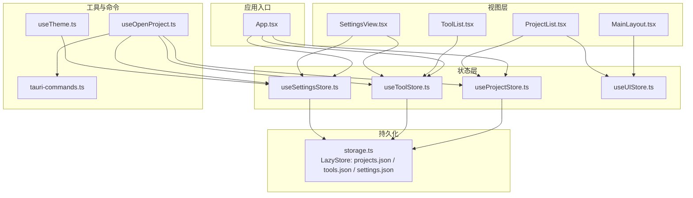
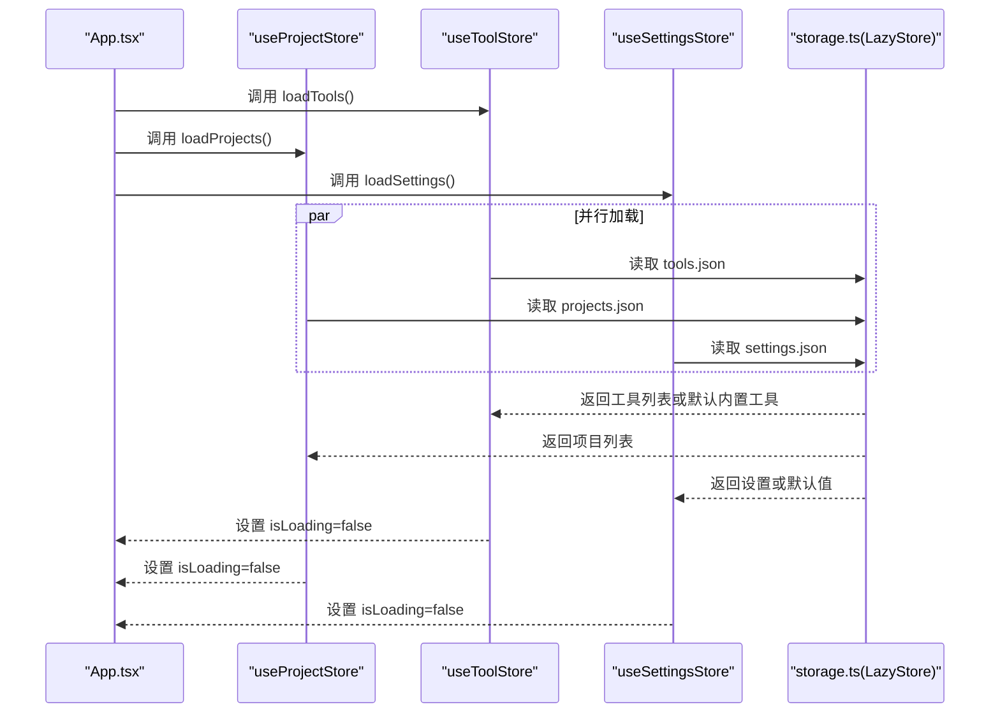
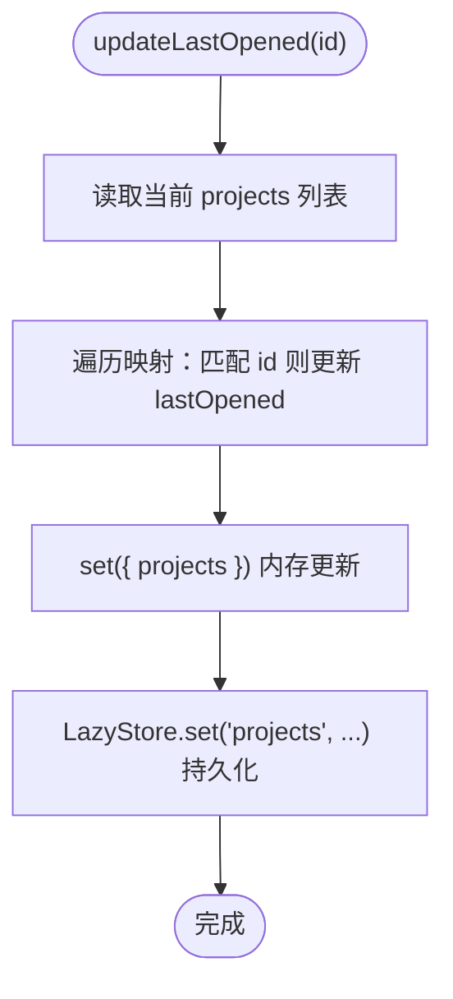
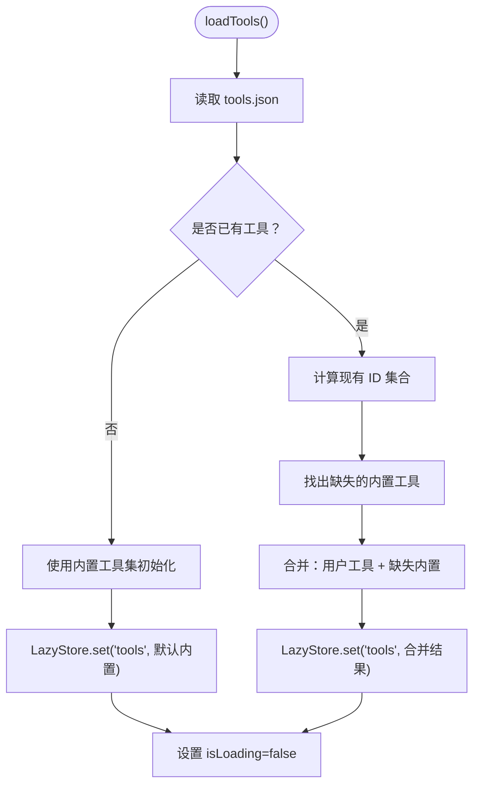
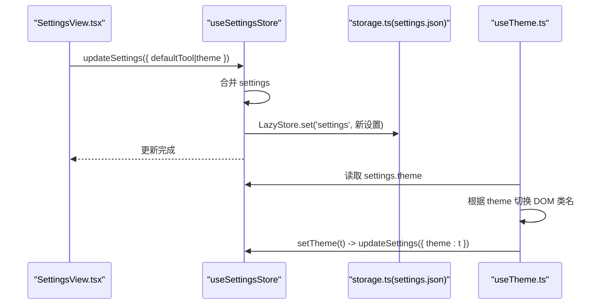
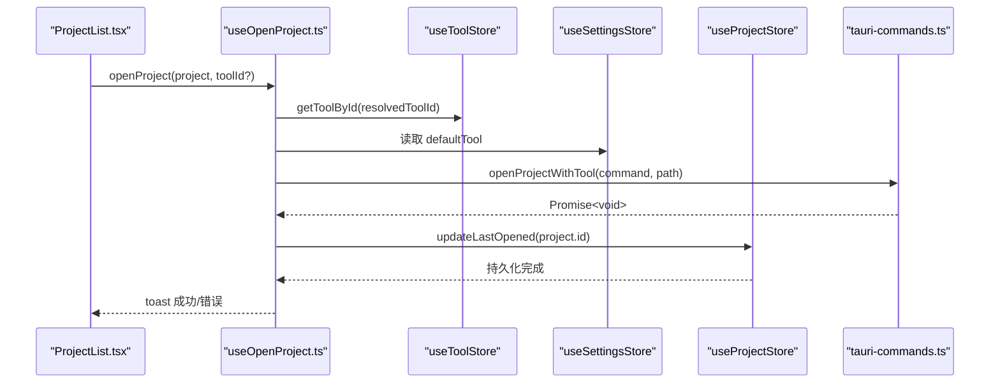
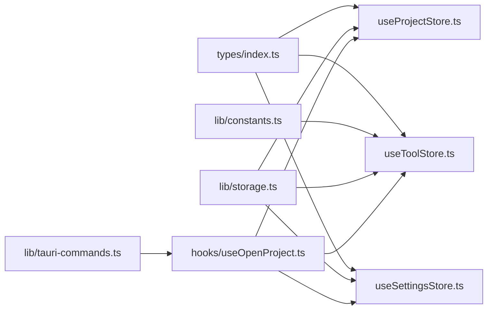

# 状态管理

<cite>
**本文引用的文件**
- [src/stores/useProjectStore.ts](file://src/stores/useProjectStore.ts)
- [src/stores/useToolStore.ts](file://src/stores/useToolStore.ts)
- [src/stores/useSettingsStore.ts](file://src/stores/useSettingsStore.ts)
- [src/stores/useUIStore.ts](file://src/stores/useUIStore.ts)
- [src/lib/storage.ts](file://src/lib/storage.ts)
- [src/types/index.ts](file://src/types/index.ts)
- [src/lib/constants.ts](file://src/lib/constants.ts)
- [src/App.tsx](file://src/App.tsx)
- [src/components/layout/MainLayout.tsx](file://src/components/layout/MainLayout.tsx)
- [src/components/project/ProjectList.tsx](file://src/components/project/ProjectList.tsx)
- [src/components/tool/ToolList.tsx](file://src/components/tool/ToolList.tsx)
- [src/components/settings/SettingsView.tsx](file://src/components/settings/SettingsView.tsx)
- [src/hooks/useOpenProject.ts](file://src/hooks/useOpenProject.ts)
- [src/hooks/useTheme.ts](file://src/hooks/useTheme.ts)
- [src/lib/tauri-commands.ts](file://src/lib/tauri-commands.ts)
</cite>

## 目录
1. [简介](#简介)
2. [项目结构](#项目结构)
3. [核心组件](#核心组件)
4. [架构总览](#架构总览)
5. [详细组件分析](#详细组件分析)
6. [依赖分析](#依赖分析)
7. [性能考量](#性能考量)
8. [故障排查指南](#故障排查指南)
9. [结论](#结论)
10. [附录](#附录)

## 简介
本文件系统性梳理 LaunchPro 的状态管理体系，围绕 Zustand 的使用模式与设计原则，文档化各 store 的职责边界、状态结构与数据流；详解项目状态、工具状态、设置状态与 UI 状态的管理策略；说明状态持久化与本地存储方案；总结状态更新最佳实践、性能优化技巧与调试方法，并给出可直接定位到源码的示例路径与使用模式。

## 项目结构
LaunchPro 的状态层采用按功能域划分的 store 组织方式：每个 store 负责单一领域（项目、工具、设置、UI），通过轻量的 Zustand 容器暴露读写接口与副作用逻辑，配合 Tauri Store 实现跨会话持久化。

图表来源
- [src/App.tsx:21-37](file://src/App.tsx#L21-L37)
- [src/stores/useProjectStore.ts:16-66](file://src/stores/useProjectStore.ts#L16-L66)
- [src/stores/useToolStore.ts:17-74](file://src/stores/useToolStore.ts#L17-L74)
- [src/stores/useSettingsStore.ts:13-33](file://src/stores/useSettingsStore.ts#L13-L33)
- [src/stores/useUIStore.ts:14-32](file://src/stores/useUIStore.ts#L14-L32)
- [src/lib/storage.ts:19-29](file://src/lib/storage.ts#L19-L29)
- [src/components/layout/MainLayout.tsx:7-20](file://src/components/layout/MainLayout.tsx#L7-L20)
- [src/components/project/ProjectList.tsx:12-55](file://src/components/project/ProjectList.tsx#L12-L55)
- [src/components/tool/ToolList.tsx:12-79](file://src/components/tool/ToolList.tsx#L12-L79)
- [src/components/settings/SettingsView.tsx:19-107](file://src/components/settings/SettingsView.tsx#L19-L107)
- [src/hooks/useOpenProject.ts:9-43](file://src/hooks/useOpenProject.ts#L9-L43)
- [src/hooks/useTheme.ts:4-36](file://src/hooks/useTheme.ts#L4-L36)
- [src/lib/tauri-commands.ts:3-8](file://src/lib/tauri-commands.ts#L3-L8)

章节来源
- [src/App.tsx:21-37](file://src/App.tsx#L21-L37)
- [src/stores/useProjectStore.ts:16-66](file://src/stores/useProjectStore.ts#L16-L66)
- [src/stores/useToolStore.ts:17-74](file://src/stores/useToolStore.ts#L17-L74)
- [src/stores/useSettingsStore.ts:13-33](file://src/stores/useSettingsStore.ts#L13-L33)
- [src/stores/useUIStore.ts:14-32](file://src/stores/useUIStore.ts#L14-L32)
- [src/lib/storage.ts:19-29](file://src/lib/storage.ts#L19-L29)

## 核心组件
- 项目状态（useProjectStore）
  - 职责：管理项目列表、加载状态、增删改查、最近打开时间更新；与项目持久化存储交互。
  - 关键动作：loadProjects、addProject、updateProject、deleteProject、updateLastOpened。
  - 数据来源：LazyStore projects.json，默认空数组。
- 工具状态（useToolStore）
  - 职责：管理工具列表、加载状态、增删改查、内置工具合并与保留用户自定义；提供按 ID 查询工具。
  - 关键动作：loadTools、addTool、updateTool、deleteTool、getToolById。
  - 数据来源：LazyStore tools.json，默认内置工具集合。
- 设置状态（useSettingsStore）
  - 职责：管理应用设置（如默认工具、主题）与加载状态；支持增量更新。
  - 关键动作：loadSettings、updateSettings。
  - 数据来源：LazyStore settings.json，默认系统主题。
- UI 状态（useUIStore）
  - 职责：管理当前活动视图、搜索查询、标签筛选等 UI 状态。
  - 关键动作：setActiveView、setSearchQuery、toggleTag、clearFilters。
  - 数据来源：内存态，不持久化。

章节来源
- [src/stores/useProjectStore.ts:6-14](file://src/stores/useProjectStore.ts#L6-L14)
- [src/stores/useToolStore.ts:7-15](file://src/stores/useToolStore.ts#L7-L15)
- [src/stores/useSettingsStore.ts:6-11](file://src/stores/useSettingsStore.ts#L6-L11)
- [src/stores/useUIStore.ts:4-12](file://src/stores/useUIStore.ts#L4-L12)

## 架构总览
Zustand store 作为“单点真相源”，通过选择器订阅最小范围的状态片段，避免无关重渲染。持久化由 LazyStore 提供，自动保存开启，确保状态变更即时落盘。应用启动时并行加载三大领域数据，UI 层通过 store 选择器进行读取与联动。

图表来源
- [src/App.tsx:26-30](file://src/App.tsx#L26-L30)
- [src/stores/useToolStore.ts:21-39](file://src/stores/useToolStore.ts#L21-L39)
- [src/stores/useProjectStore.ts:20-28](file://src/stores/useProjectStore.ts#L20-L28)
- [src/stores/useSettingsStore.ts:17-25](file://src/stores/useSettingsStore.ts#L17-L25)
- [src/lib/storage.ts:19-29](file://src/lib/storage.ts#L19-L29)

## 详细组件分析

### 项目状态（useProjectStore）
- 状态结构
  - projects: Project[]
  - isLoading: boolean
- 主要动作
  - loadProjects：从 LazyStore 读取 projects，失败时回退为空列表。
  - addProject：生成唯一 id 与创建时间，追加到内存并持久化。
  - updateProject：映射匹配项后替换，随后持久化。
  - deleteProject：过滤移除，随后持久化。
  - updateLastOpened：更新指定项目的最近打开时间，随后持久化。
- 持久化策略
  - 使用 LazyStore projects.json，autoSave=true，每次 set 自动落盘。
- 依赖关系
  - 依赖类型定义 Project，依赖 LazyStore。
- 典型调用链
  - 应用启动时由 App.tsx 触发 loadProjects。
  - 打开项目成功后由 useOpenProject 更新 lastOpened 并持久化。

图表来源
- [src/stores/useProjectStore.ts:58-65](file://src/stores/useProjectStore.ts#L58-L65)
- [src/lib/storage.ts:19-21](file://src/lib/storage.ts#L19-L21)

章节来源
- [src/stores/useProjectStore.ts:6-14](file://src/stores/useProjectStore.ts#L6-L14)
- [src/stores/useProjectStore.ts:16-66](file://src/stores/useProjectStore.ts#L16-L66)
- [src/lib/storage.ts:19-21](file://src/lib/storage.ts#L19-L21)
- [src/types/index.ts:1-10](file://src/types/index.ts#L1-L10)

### 工具状态（useToolStore）
- 状态结构
  - tools: Tool[]
  - isLoading: boolean
- 主要动作
  - loadTools：若已有工具则合并内置缺失项以保留用户自定义；否则初始化内置工具集。
  - addTool：生成唯一 id 与非内置标记，追加后持久化。
  - updateTool：映射更新后持久化。
  - deleteTool：禁止删除内置工具，其余可删除并持久化。
  - getToolById：按 id 查询工具。
- 持久化策略
  - LazyStore tools.json，默认内置工具集合，autoSave=true。
- 依赖关系
  - 依赖常量 BUILTIN_TOOLS，类型 Tool。
- 合并与去重策略
  - 首次加载或空列表时写入默认内置工具；后续加载若存在用户自定义，则仅补齐缺失的内置工具，保证内置能力始终可用且不丢失用户配置。

图表来源
- [src/stores/useToolStore.ts:21-39](file://src/stores/useToolStore.ts#L21-L39)
- [src/lib/constants.ts:3-18](file://src/lib/constants.ts#L3-L18)
- [src/lib/storage.ts:23-25](file://src/lib/storage.ts#L23-L25)

章节来源
- [src/stores/useToolStore.ts:7-15](file://src/stores/useToolStore.ts#L7-L15)
- [src/stores/useToolStore.ts:17-74](file://src/stores/useToolStore.ts#L17-L74)
- [src/lib/constants.ts:3-18](file://src/lib/constants.ts#L3-L18)
- [src/lib/storage.ts:23-25](file://src/lib/storage.ts#L23-L25)
- [src/types/index.ts:12-18](file://src/types/index.ts#L12-L18)

### 设置状态（useSettingsStore）
- 状态结构
  - settings: Settings
  - isLoading: boolean
- 主要动作
  - loadSettings：读取 settings.json 或回退默认设置（系统主题）。
  - updateSettings：浅合并增量更新并持久化。
- 持久化策略
  - LazyStore settings.json，默认系统主题，autoSave=true。
- 与主题联动
  - 通过 useTheme 钩子读取/更新 theme，并驱动 DOM 类名切换。

图表来源
- [src/stores/useSettingsStore.ts:17-32](file://src/stores/useSettingsStore.ts#L17-L32)
- [src/components/settings/SettingsView.tsx:20-33](file://src/components/settings/SettingsView.tsx#L20-L33)
- [src/hooks/useTheme.ts:4-36](file://src/hooks/useTheme.ts#L4-L36)
- [src/lib/storage.ts:27-29](file://src/lib/storage.ts#L27-L29)

章节来源
- [src/stores/useSettingsStore.ts:6-11](file://src/stores/useSettingsStore.ts#L6-L11)
- [src/stores/useSettingsStore.ts:13-33](file://src/stores/useSettingsStore.ts#L13-L33)
- [src/components/settings/SettingsView.tsx:19-107](file://src/components/settings/SettingsView.tsx#L19-L107)
- [src/hooks/useTheme.ts:4-36](file://src/hooks/useTheme.ts#L4-L36)
- [src/lib/storage.ts:27-29](file://src/lib/storage.ts#L27-L29)
- [src/types/index.ts:20-23](file://src/types/index.ts#L20-L23)

### UI 状态（useUIStore）
- 状态结构
  - activeView: 'projects' | 'tools' | 'settings'
  - searchQuery: string
  - selectedTags: string[]
- 主要动作
  - setActiveView、setSearchQuery、toggleTag、clearFilters。
- 设计要点
  - 仅管理 UI 表现态，不持久化；与项目列表筛选逻辑解耦，通过选择器在组件内消费。

章节来源
- [src/stores/useUIStore.ts:4-12](file://src/stores/useUIStore.ts#L4-L12)
- [src/stores/useUIStore.ts:14-32](file://src/stores/useUIStore.ts#L14-L32)
- [src/components/layout/MainLayout.tsx:7-20](file://src/components/layout/MainLayout.tsx#L7-L20)
- [src/components/project/ProjectList.tsx:12-55](file://src/components/project/ProjectList.tsx#L12-L55)

### 状态间依赖与同步机制
- 项目打开流程（useOpenProject）
  - 依赖：工具列表、默认工具、项目列表、Tauri 命令。
  - 流程：解析工具 id → 校验工具存在 → 调用命令打开 → 成功后更新项目最近打开时间并持久化。
- 主题同步（useTheme）
  - 依赖：设置 store 的 theme 字段；根据 light/dark/system 切换根元素类名。
- 视图路由（MainLayout）
  - 依赖：UI store 的 activeView，按视图渲染不同页面。

图表来源
- [src/components/project/ProjectList.tsx:15-38](file://src/components/project/ProjectList.tsx#L15-L38)
- [src/hooks/useOpenProject.ts:15-39](file://src/hooks/useOpenProject.ts#L15-L39)
- [src/stores/useToolStore.ts:71-73](file://src/stores/useToolStore.ts#L71-L73)
- [src/stores/useSettingsStore.ts:12](file://src/stores/useSettingsStore.ts#L12)
- [src/stores/useProjectStore.ts:58-65](file://src/stores/useProjectStore.ts#L58-L65)
- [src/lib/tauri-commands.ts:3-8](file://src/lib/tauri-commands.ts#L3-L8)

章节来源
- [src/hooks/useOpenProject.ts:9-43](file://src/hooks/useOpenProject.ts#L9-L43)
- [src/stores/useToolStore.ts:71-73](file://src/stores/useToolStore.ts#L71-L73)
- [src/stores/useSettingsStore.ts:12](file://src/stores/useSettingsStore.ts#L12)
- [src/stores/useProjectStore.ts:58-65](file://src/stores/useProjectStore.ts#L58-L65)
- [src/lib/tauri-commands.ts:3-8](file://src/lib/tauri-commands.ts#L3-L8)

## 依赖分析
- 组件耦合
  - 视图组件通过选择器订阅各自需要的 store 片段，降低耦合度。
  - 业务逻辑（如打开项目）封装在独立 hook，便于复用与测试。
- 外部依赖
  - LazyStore：提供 JSON 文件级持久化，autoSave=true，简化状态落盘。
  - Tauri 命令：用于执行系统命令与读取应用数据目录。
- 类型与常量
  - 类型定义集中于 types/index.ts，常量集中于 lib/constants.ts，确保 store 与 UI 的契约清晰。

图表来源
- [src/types/index.ts:1-26](file://src/types/index.ts#L1-L26)
- [src/lib/constants.ts:1-23](file://src/lib/constants.ts#L1-L23)
- [src/lib/storage.ts:19-29](file://src/lib/storage.ts#L19-L29)
- [src/hooks/useOpenProject.ts:1-8](file://src/hooks/useOpenProject.ts#L1-L8)
- [src/lib/tauri-commands.ts:1-17](file://src/lib/tauri-commands.ts#L1-L17)

章节来源
- [src/types/index.ts:1-26](file://src/types/index.ts#L1-L26)
- [src/lib/constants.ts:1-23](file://src/lib/constants.ts#L1-L23)
- [src/lib/storage.ts:19-29](file://src/lib/storage.ts#L19-L29)
- [src/hooks/useOpenProject.ts:1-8](file://src/hooks/useOpenProject.ts#L1-L8)
- [src/lib/tauri-commands.ts:1-17](file://src/lib/tauri-commands.ts#L1-L17)

## 性能考量
- 订阅最小化
  - 使用选择器仅订阅所需字段，避免不必要的组件重渲染。
- 计算缓存
  - 在组件内使用 useMemo 对筛选与排序逻辑进行缓存，减少重复计算。
- 并行初始化
  - 应用启动时并行触发三大 store 的 load* 动作，缩短首屏等待。
- 持久化粒度
  - LazyStore 每次 set 即 autoSave，建议批量更新时合并多次 set 以减少磁盘写入次数（当前实现已通过单次 set 达成）。
- 渲染优化
  - 使用虚拟滚动组件（如 ScrollArea）承载长列表，降低 DOM 节点数量。

章节来源
- [src/App.tsx:26-30](file://src/App.tsx#L26-L30)
- [src/components/project/ProjectList.tsx:22-55](file://src/components/project/ProjectList.tsx#L22-L55)

## 故障排查指南
- 加载失败回退
  - 任一 store 的 load* 方法均包含 try/catch 回退逻辑：读取失败时使用默认值并关闭加载态。
- 错误提示
  - 打开项目失败或工具不存在时，使用 toast 提示错误信息，便于用户感知。
- 数据一致性
  - update* 操作先更新内存状态再持久化，若持久化失败可结合回退逻辑恢复。
- 调试建议
  - 在浏览器开发者工具中观察 Zustand 状态变化；必要时在 store 内部增加日志（注意生产环境禁用）。
  - 检查 LazyStore 文件是否存在权限问题或被外部程序占用。

章节来源
- [src/stores/useProjectStore.ts:20-28](file://src/stores/useProjectStore.ts#L20-L28)
- [src/stores/useToolStore.ts:21-39](file://src/stores/useToolStore.ts#L21-L39)
- [src/stores/useSettingsStore.ts:17-25](file://src/stores/useSettingsStore.ts#L17-L25)
- [src/hooks/useOpenProject.ts:31-38](file://src/hooks/useOpenProject.ts#L31-L38)

## 结论
本项目采用轻量、直观的 Zustand 架构，按领域拆分 store，结合 LazyStore 实现稳定持久化。通过选择器订阅与并行初始化，兼顾易用性与性能。状态间通过 hook 解耦协作，形成清晰的职责边界与可维护性。建议在后续迭代中持续关注批量更新的持久化策略与更细粒度的调试手段。

## 附录
- 状态持久化文件
  - projects.json：项目列表
  - tools.json：工具列表（含内置与用户自定义）
  - settings.json：应用设置（主题、默认工具等）
- 常用操作示例路径（不含具体代码内容）
  - 初始化加载：[src/App.tsx:26-30](file://src/App.tsx#L26-L30)
  - 添加项目：[src/stores/useProjectStore.ts:30-40](file://src/stores/useProjectStore.ts#L30-L40)
  - 更新工具：[src/stores/useToolStore.ts:53-60](file://src/stores/useToolStore.ts#L53-L60)
  - 更新设置：[src/stores/useSettingsStore.ts:27-32](file://src/stores/useSettingsStore.ts#L27-L32)
  - 切换主题：[src/hooks/useTheme.ts:31-33](file://src/hooks/useTheme.ts#L31-L33)
  - 打开项目：[src/hooks/useOpenProject.ts:15-39](file://src/hooks/useOpenProject.ts#L15-L39)
  - 项目筛选与排序：[src/components/project/ProjectList.tsx:29-55](file://src/components/project/ProjectList.tsx#L29-L55)