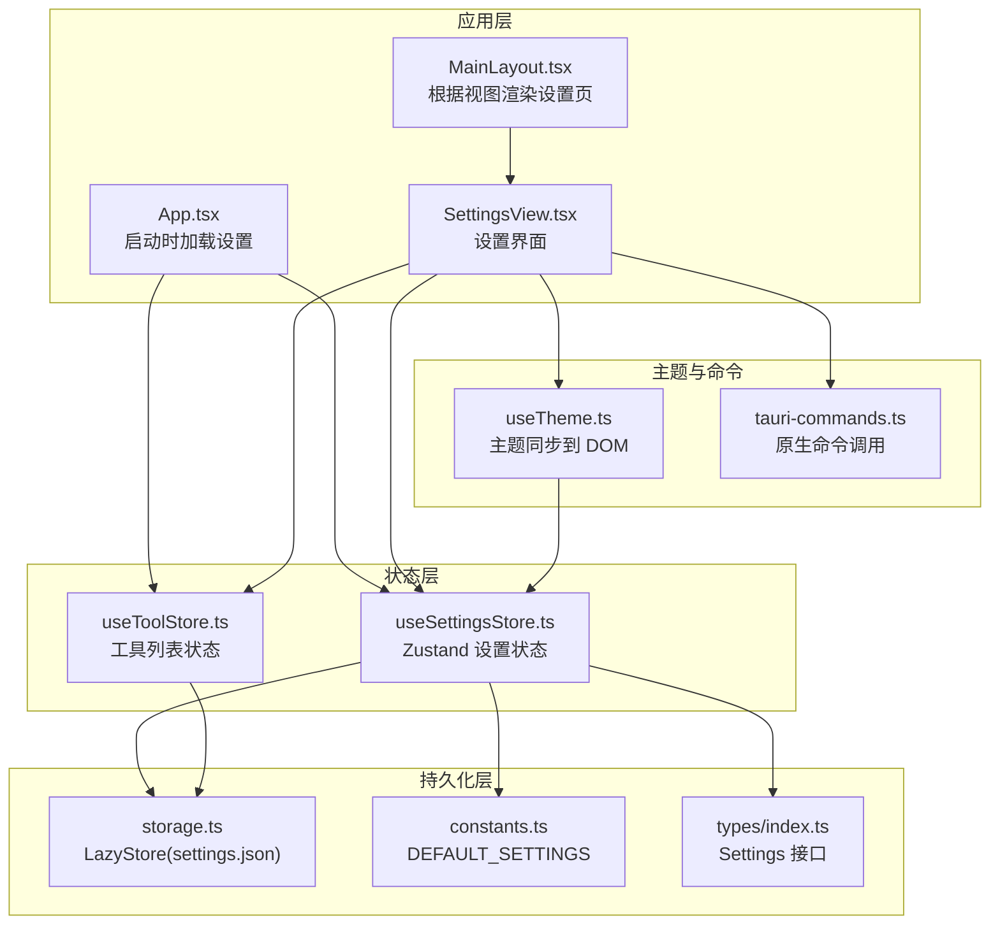
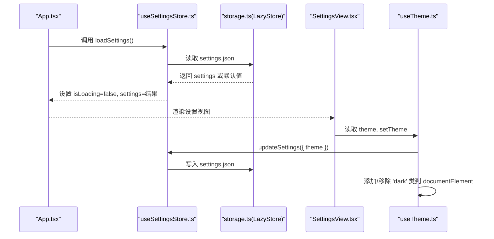
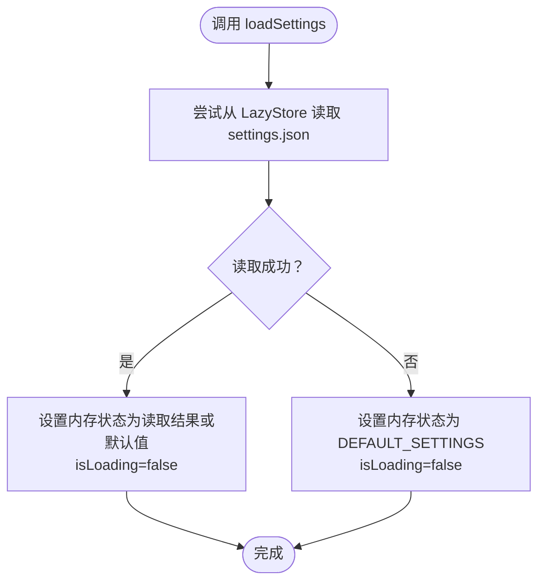
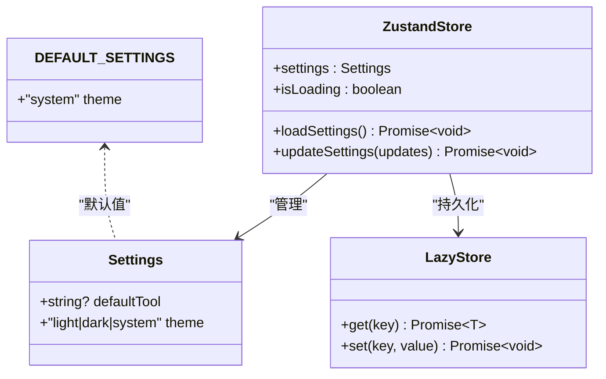
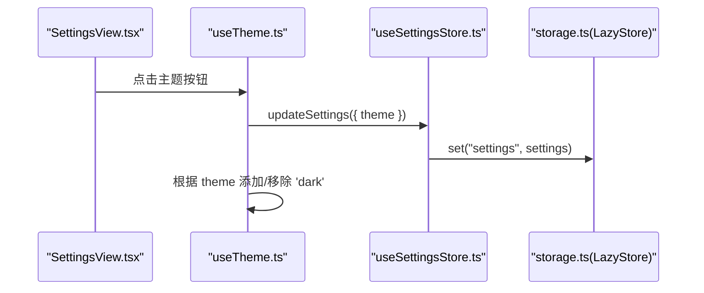
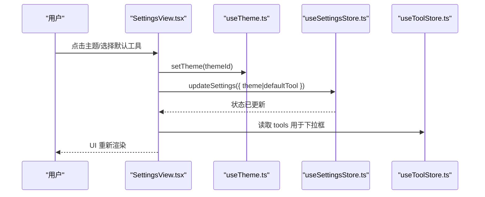
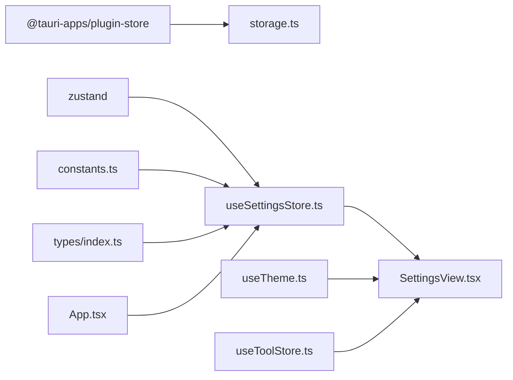

# 设置状态管理

<cite>
**本文引用的文件**
- [useSettingsStore.ts](file://src/stores/useSettingsStore.ts)
- [storage.ts](file://src/lib/storage.ts)
- [constants.ts](file://src/lib/constants.ts)
- [index.ts](file://src/types/index.ts)
- [SettingsView.tsx](file://src/components/settings/SettingsView.tsx)
- [useTheme.ts](file://src/hooks/useTheme.ts)
- [App.tsx](file://src/App.tsx)
- [useToolStore.ts](file://src/stores/useToolStore.ts)
- [tauri-commands.ts](file://src/lib/tauri-commands.ts)
- [MainLayout.tsx](file://src/components/layout/MainLayout.tsx)
- [package.json](file://package.json)
</cite>

## 目录
1. [简介](#简介)
2. [项目结构](#项目结构)
3. [核心组件](#核心组件)
4. [架构总览](#架构总览)
5. [详细组件分析](#详细组件分析)
6. [依赖分析](#依赖分析)
7. [性能考虑](#性能考虑)
8. [故障排除指南](#故障排除指南)
9. [结论](#结论)
10. [附录](#附录)

## 简介
本文件聚焦于设置状态管理模块，系统性阐述 useSettingsStore 的实现原理、数据模型与配置项管理方式，并详细说明主题切换、默认工具选择等配置的存储与同步机制。文档还覆盖默认值处理、版本兼容策略、设置变更的响应式更新与全局状态同步、设置与 UI 组件的绑定关系、数据流路径，以及导入导出与备份恢复的实践建议。

## 项目结构
设置状态管理涉及以下关键文件与职责划分：
- 状态定义与类型：types/index.ts 定义 Settings 接口；constants.ts 提供 DEFAULT_SETTINGS 默认值与内置工具列表。
- 状态存储与持久化：lib/storage.ts 基于 @tauri-apps/plugin-store 的 LazyStore 实现 settings.json 的读写，默认值注入与自动保存。
- 设置状态容器：stores/useSettingsStore.ts 使用 zustand 管理 settings 与加载/更新流程。
- 主题钩子：hooks/useTheme.ts 将设置中的 theme 同步到 DOM 根元素类名，实现主题切换。
- UI 视图：components/settings/SettingsView.tsx 展示设置界面，绑定主题与默认工具选择。
- 应用入口：App.tsx 在启动时并发加载工具、项目与设置，确保设置在 UI 渲染前可用。
- 工具存储：stores/useToolStore.ts 提供工具列表，用于设置中的默认工具下拉选项。
- Tauri 命令：lib/tauri-commands.ts 暴露与原生能力交互的接口（如获取应用数据目录）。

**图表来源**
- [App.tsx:21-30](file://src/App.tsx#L21-L30)
- [MainLayout.tsx:7-16](file://src/components/layout/MainLayout.tsx#L7-L16)
- [SettingsView.tsx:19-106](file://src/components/settings/SettingsView.tsx#L19-L106)
- [useSettingsStore.ts:13-33](file://src/stores/useSettingsStore.ts#L13-L33)
- [useToolStore.ts:17-74](file://src/stores/useToolStore.ts#L17-L74)
- [storage.ts:14-17](file://src/lib/storage.ts#L14-L17)
- [constants.ts:20-22](file://src/lib/constants.ts#L20-L22)
- [index.ts:20-23](file://src/types/index.ts#L20-L23)
- [useTheme.ts:4-36](file://src/hooks/useTheme.ts#L4-L36)
- [tauri-commands.ts:14-16](file://src/lib/tauri-commands.ts#L14-L16)

**章节来源**
- [App.tsx:21-30](file://src/App.tsx#L21-L30)
- [MainLayout.tsx:7-16](file://src/components/layout/MainLayout.tsx#L7-L16)
- [SettingsView.tsx:19-106](file://src/components/settings/SettingsView.tsx#L19-L106)
- [useSettingsStore.ts:13-33](file://src/stores/useSettingsStore.ts#L13-L33)
- [useToolStore.ts:17-74](file://src/stores/useToolStore.ts#L17-L74)
- [storage.ts:14-17](file://src/lib/storage.ts#L14-L17)
- [constants.ts:20-22](file://src/lib/constants.ts#L20-L22)
- [index.ts:20-23](file://src/types/index.ts#L20-L23)
- [useTheme.ts:4-36](file://src/hooks/useTheme.ts#L4-L36)
- [tauri-commands.ts:14-16](file://src/lib/tauri-commands.ts#L14-L16)

## 核心组件
- 设置状态容器 useSettingsStore
  - 职责：维护 settings 对象、isLoading 标志；提供 loadSettings 与 updateSettings 方法。
  - 数据源：通过 getSettingsStore() 获取 LazyStore 实例，从 settings.json 读取或回退默认值。
  - 更新策略：浅合并传入的更新对象，先更新内存状态，再异步写入持久化存储。
- 存储层 storage.ts
  - 以 LazyStore 初始化 settings.json，设置默认值为 DEFAULT_SETTINGS，开启自动保存。
- 类型与默认值 constants.ts & types/index.ts
  - Settings 接口包含 theme 字段与可选的 defaultTool。
  - DEFAULT_SETTINGS 初始 theme 为 'system'。
- 主题钩子 useTheme.ts
  - 订阅设置中的 theme，动态添加/移除 documentElement 上的 'dark' 类，实现主题切换。
- 设置视图 SettingsView.tsx
  - 绑定主题按钮组与默认工具下拉框，调用 updateSettings 写入持久化存储。
  - 提供显示应用数据目录的交互入口。
- 应用入口 App.tsx
  - 启动阶段并行加载工具、项目与设置，保证设置在 UI 渲染前完成初始化。

**章节来源**
- [useSettingsStore.ts:6-11](file://src/stores/useSettingsStore.ts#L6-L11)
- [useSettingsStore.ts:17-32](file://src/stores/useSettingsStore.ts#L17-L32)
- [storage.ts:14-17](file://src/lib/storage.ts#L14-L17)
- [constants.ts:20-22](file://src/lib/constants.ts#L20-L22)
- [index.ts:20-23](file://src/types/index.ts#L20-L23)
- [useTheme.ts:4-36](file://src/hooks/useTheme.ts#L4-L36)
- [SettingsView.tsx:19-106](file://src/components/settings/SettingsView.tsx#L19-L106)
- [App.tsx:21-30](file://src/App.tsx#L21-L30)

## 架构总览
设置状态管理采用“状态容器 + 持久化存储 + UI 绑定”的分层架构。Zustand 管理内存状态，LazyStore 负责 JSON 文件的读写与默认值注入；React 组件通过订阅状态进行响应式渲染；主题钩子负责将设置映射到 DOM 环境。

**图表来源**
- [App.tsx:21-30](file://src/App.tsx#L21-L30)
- [useSettingsStore.ts:17-32](file://src/stores/useSettingsStore.ts#L17-L32)
- [storage.ts:14-17](file://src/lib/storage.ts#L14-L17)
- [SettingsView.tsx:20-33](file://src/components/settings/SettingsView.tsx#L20-L33)
- [useTheme.ts:31-33](file://src/hooks/useTheme.ts#L31-L33)

## 详细组件分析

### useSettingsStore 实现与设计模式
- 设计模式
  - 状态容器模式：以函数式状态容器封装状态与派发逻辑，避免样板代码。
  - 命令模式：loadSettings 与 updateSettings 作为受控命令，统一数据来源与写入路径。
  - 模板方法：loadSettings 先尝试从存储读取，失败时回退默认值；updateSettings 先内存更新再持久化。
- 关键行为
  - 加载：首次进入时异步读取 settings.json；若不存在或读取异常则使用 DEFAULT_SETTINGS。
  - 更新：深拷贝当前 settings 与传入更新，合并后立即更新内存状态，随后异步写入 LazyStore。
  - 错误处理：读取失败时静默回退默认值，避免阻塞 UI。
- 复杂度
  - 加载：O(1) 读取单条记录；写入：O(n) 遍历序列化写入（由 LazyStore 行为决定）。
  - 内存占用：仅保存当前 settings 对象与 isLoading 标志。

**图表来源**
- [useSettingsStore.ts:17-25](file://src/stores/useSettingsStore.ts#L17-L25)
- [storage.ts:14-17](file://src/lib/storage.ts#L14-L17)
- [constants.ts:20-22](file://src/lib/constants.ts#L20-L22)

**章节来源**
- [useSettingsStore.ts:13-33](file://src/stores/useSettingsStore.ts#L13-L33)
- [storage.ts:14-17](file://src/lib/storage.ts#L14-L17)
- [constants.ts:20-22](file://src/lib/constants.ts#L20-L22)

### 数据结构与配置项管理
- Settings 接口
  - 字段：theme（'light' | 'dark' | 'system'）、defaultTool（可选字符串）。
- 默认值 DEFAULT_SETTINGS
  - theme 初始为 'system'，未设置 defaultTool。
- 版本兼容性
  - 新增字段时，LazyStore 默认值会注入缺失字段；读取时若字段缺失，使用默认值回填，保障向后兼容。
- 配置项管理
  - 主题：通过 useTheme 钩子与设置联动，实时反映到 DOM。
  - 默认工具：与工具列表关联，下拉框来源于 useToolStore 的 tools。

**图表来源**
- [index.ts:20-23](file://src/types/index.ts#L20-L23)
- [useSettingsStore.ts:6-11](file://src/stores/useSettingsStore.ts#L6-L11)
- [storage.ts:14-17](file://src/lib/storage.ts#L14-L17)
- [constants.ts:20-22](file://src/lib/constants.ts#L20-L22)

**章节来源**
- [index.ts:20-23](file://src/types/index.ts#L20-L23)
- [constants.ts:20-22](file://src/lib/constants.ts#L20-L22)
- [useSettingsStore.ts:6-11](file://src/stores/useSettingsStore.ts#L6-L11)

### 主题切换与窗口状态
- 主题切换
  - UI：SettingsView 中的主题按钮组触发 useTheme 的 setTheme。
  - 状态：setTheme 调用 updateSettings({ theme }) 写入 settings.json。
  - DOM：useTheme 在 effect 中监听 theme 变化，动态添加/移除 'dark' 类。
- 窗口状态
  - 当前仓库未提供窗口状态（如最大化、位置、大小）的持久化实现；如需扩展，可在 Settings 接口中新增字段，并在 useSettingsStore 中加入对应的 load/update 流程。

**图表来源**
- [SettingsView.tsx:46-62](file://src/components/settings/SettingsView.tsx#L46-L62)
- [useTheme.ts:31-33](file://src/hooks/useTheme.ts#L31-L33)
- [useSettingsStore.ts:27-32](file://src/stores/useSettingsStore.ts#L27-L32)
- [storage.ts:14-17](file://src/lib/storage.ts#L14-L17)

**章节来源**
- [SettingsView.tsx:46-62](file://src/components/settings/SettingsView.tsx#L46-L62)
- [useTheme.ts:4-36](file://src/hooks/useTheme.ts#L4-L36)
- [useSettingsStore.ts:27-32](file://src/stores/useSettingsStore.ts#L27-L32)

### 语言设置
- 当前实现未包含语言设置字段；如需支持，可在 Settings 接口中新增 locale 字段，并在 useSettingsStore 中完善加载/更新逻辑。
- 语言切换通常需要配合 i18n 库（如 react-i18next），在设置变更后重新初始化翻译资源。

**章节来源**
- [index.ts:20-23](file://src/types/index.ts#L20-L23)
- [useSettingsStore.ts:17-32](file://src/stores/useSettingsStore.ts#L17-L32)

### 设置的默认值处理与版本兼容
- 默认值注入：LazyStore 在初始化时为 settings.json 注入默认值 DEFAULT_SETTINGS，确保新安装或升级后字段齐全。
- 运行时回退：loadSettings 读取失败时回退 DEFAULT_SETTINGS，避免异常中断。
- 向后兼容：新增字段时，旧用户数据缺少该字段会被默认值补齐，无需迁移脚本。

**章节来源**
- [storage.ts:14-17](file://src/lib/storage.ts#L14-L17)
- [constants.ts:20-22](file://src/lib/constants.ts#L20-L22)
- [useSettingsStore.ts:17-25](file://src/stores/useSettingsStore.ts#L17-L25)

### 响应式更新与全局状态同步
- 响应式更新：SettingsView 通过选择器订阅 settings 中的特定字段（如 theme、defaultTool），仅在对应字段变化时重渲染。
- 全局同步：App.tsx 在启动时并行加载工具、项目与设置，确保设置在 UI 渲染前完成初始化，避免闪烁或不一致。

**章节来源**
- [SettingsView.tsx:20-23](file://src/components/settings/SettingsView.tsx#L20-L23)
- [App.tsx:21-30](file://src/App.tsx#L21-L30)

### 设置与 UI 组件的绑定关系与数据流
- 绑定关系
  - SettingsView 读取 theme 并通过 useTheme.setTheme 更新；读取 defaultTool 并通过 useSettingsStore.updateSettings 更新。
  - 默认工具下拉框的数据来源于 useToolStore 的 tools。
- 数据流
  - 输入：用户点击主题按钮或选择默认工具。
  - 处理：useTheme.setTheme -> updateSettings -> 写入 LazyStore。
  - 输出：DOM 类名变化；组件重新渲染；数据持久化。

**图表来源**
- [SettingsView.tsx:20-88](file://src/components/settings/SettingsView.tsx#L20-L88)
- [useTheme.ts:31-33](file://src/hooks/useTheme.ts#L31-L33)
- [useSettingsStore.ts:27-32](file://src/stores/useSettingsStore.ts#L27-L32)
- [useToolStore.ts:21-39](file://src/stores/useToolStore.ts#L21-L39)

**章节来源**
- [SettingsView.tsx:20-88](file://src/components/settings/SettingsView.tsx#L20-L88)
- [useTheme.ts:31-33](file://src/hooks/useTheme.ts#L31-L33)
- [useSettingsStore.ts:27-32](file://src/stores/useSettingsStore.ts#L27-L32)
- [useToolStore.ts:21-39](file://src/stores/useToolStore.ts#L21-L39)

### 导入导出与备份恢复
- 当前实现
  - settings.json 由 LazyStore 自动管理，未提供显式的导入/导出 UI。
- 建议方案
  - 导出：读取 settings.json 的内容，序列化为 JSON 文本，提供下载链接。
  - 导入：提供文件上传，校验 JSON 结构与字段类型，合并到当前设置（可选覆盖策略）。
  - 恢复：从备份文件恢复 settings.json，触发一次全量写入。
- 注意事项
  - 导入前进行字段兼容性检查，避免因版本差异导致的不兼容。
  - 导入后调用 updateSettings 以触发持久化与 UI 同步。

**章节来源**
- [storage.ts:14-17](file://src/lib/storage.ts#L14-L17)
- [useSettingsStore.ts:27-32](file://src/stores/useSettingsStore.ts#L27-L32)

## 依赖分析
- 外部依赖
  - @tauri-apps/plugin-store：提供 LazyStore，负责 settings.json 的读写与默认值注入。
  - zustand：轻量状态容器，提供简洁的状态管理 API。
  - lucide-react、sonner、next-themes：UI 图标、提示与主题库。
- 内部依赖
  - types/index.ts 与 constants.ts 为 useSettingsStore 提供类型与默认值。
  - storage.ts 为 useSettingsStore 提供持久化后端。
  - useTheme.ts 依赖 useSettingsStore 实现主题同步。
  - SettingsView.tsx 依赖 useSettingsStore、useToolStore、useTheme。

**图表来源**
- [package.json:13-28](file://package.json#L13-L28)
- [storage.ts:14-17](file://src/lib/storage.ts#L14-L17)
- [useSettingsStore.ts:13-33](file://src/stores/useSettingsStore.ts#L13-L33)
- [constants.ts:20-22](file://src/lib/constants.ts#L20-L22)
- [index.ts:20-23](file://src/types/index.ts#L20-L23)
- [SettingsView.tsx:12-14](file://src/components/settings/SettingsView.tsx#L12-L14)
- [useTheme.ts:2-6](file://src/hooks/useTheme.ts#L2-L6)
- [useToolStore.ts:3-5](file://src/stores/useToolStore.ts#L3-L5)
- [App.tsx:5-8](file://src/App.tsx#L5-L8)

**章节来源**
- [package.json:13-28](file://package.json#L13-L28)
- [storage.ts:14-17](file://src/lib/storage.ts#L14-L17)
- [useSettingsStore.ts:13-33](file://src/stores/useSettingsStore.ts#L13-L33)
- [constants.ts:20-22](file://src/lib/constants.ts#L20-L22)
- [index.ts:20-23](file://src/types/index.ts#L20-L23)
- [SettingsView.tsx:12-14](file://src/components/settings/SettingsView.tsx#L12-L14)
- [useTheme.ts:2-6](file://src/hooks/useTheme.ts#L2-L6)
- [useToolStore.ts:3-5](file://src/stores/useToolStore.ts#L3-L5)
- [App.tsx:5-8](file://src/App.tsx#L5-L8)

## 性能考虑
- LazyStore 自动保存：减少频繁写入带来的 I/O 开销，但可能造成内存与磁盘的短暂不一致。
- 合并策略：updateSettings 使用浅合并，避免深层拷贝成本；若 future 扩展复杂嵌套对象，可考虑深拷贝或分段更新。
- 并发加载：App.tsx 并行加载多个 store，缩短首屏等待时间。
- UI 选择器：SettingsView 使用选择器订阅特定字段，降低无关重渲染频率。

[本节为通用指导，无需列出具体文件来源]

## 故障排除指南
- 设置未生效
  - 检查 LazyStore 是否成功写入 settings.json；确认 updateSettings 是否被调用。
  - 确认 useTheme 的 effect 是否执行，DOM 是否存在 'dark' 类。
- 启动时设置未加载
  - 确保 App.tsx 在 mount 时调用了 loadSettings；检查 storage.ts 的 LazyStore 初始化是否成功。
- 默认值未注入
  - 确认 LazyStore 初始化时的默认值参数；检查 settings.json 是否为空或损坏。

**章节来源**
- [useSettingsStore.ts:17-32](file://src/stores/useSettingsStore.ts#L17-L32)
- [storage.ts:14-17](file://src/lib/storage.ts#L14-L17)
- [useTheme.ts:8-29](file://src/hooks/useTheme.ts#L8-L29)
- [App.tsx:26-30](file://src/App.tsx#L26-L30)

## 结论
设置状态管理模块以 zustand 为核心，结合 LazyStore 实现了简洁可靠的持久化方案。通过 useTheme 钩子与 UI 绑定，实现了主题的即时响应与持久化。DEFAULT_SETTINGS 与 LazyStore 默认值共同保障了版本兼容与首次体验。未来可按需扩展语言设置、窗口状态、导入导出与备份恢复能力，以满足更丰富的用户需求。

[本节为总结性内容，无需列出具体文件来源]

## 附录
- 配置示例与使用模式
  - 主题切换：在 SettingsView 中选择 light/dark/system，立即反映到 UI。
  - 默认工具：在下拉框中选择一个工具 ID，保存后作为默认打开工具。
  - 数据目录：点击按钮获取应用数据目录路径，便于手动备份。
- 相关文件路径
  - 设置状态容器：[useSettingsStore.ts](file://src/stores/useSettingsStore.ts)
  - 存储与默认值：[storage.ts](file://src/lib/storage.ts)、[constants.ts](file://src/lib/constants.ts)
  - 类型定义：[index.ts](file://src/types/index.ts)
  - 主题钩子：[useTheme.ts](file://src/hooks/useTheme.ts)
  - 设置视图：[SettingsView.tsx](file://src/components/settings/SettingsView.tsx)
  - 应用入口：[App.tsx](file://src/App.tsx)
  - 工具存储：[useToolStore.ts](file://src/stores/useToolStore.ts)
  - 原生命令：[tauri-commands.ts](file://src/lib/tauri-commands.ts)

**章节来源**
- [SettingsView.tsx:19-106](file://src/components/settings/SettingsView.tsx#L19-L106)
- [useTheme.ts:4-36](file://src/hooks/useTheme.ts#L4-L36)
- [useSettingsStore.ts:13-33](file://src/stores/useSettingsStore.ts#L13-L33)
- [storage.ts:14-17](file://src/lib/storage.ts#L14-L17)
- [constants.ts:20-22](file://src/lib/constants.ts#L20-L22)
- [index.ts:20-23](file://src/types/index.ts#L20-L23)
- [App.tsx:21-30](file://src/App.tsx#L21-L30)
- [useToolStore.ts:17-74](file://src/stores/useToolStore.ts#L17-L74)
- [tauri-commands.ts:14-16](file://src/lib/tauri-commands.ts#L14-L16)