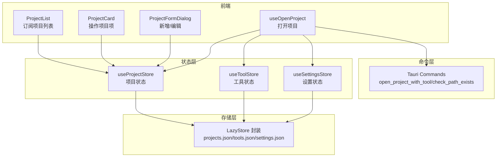
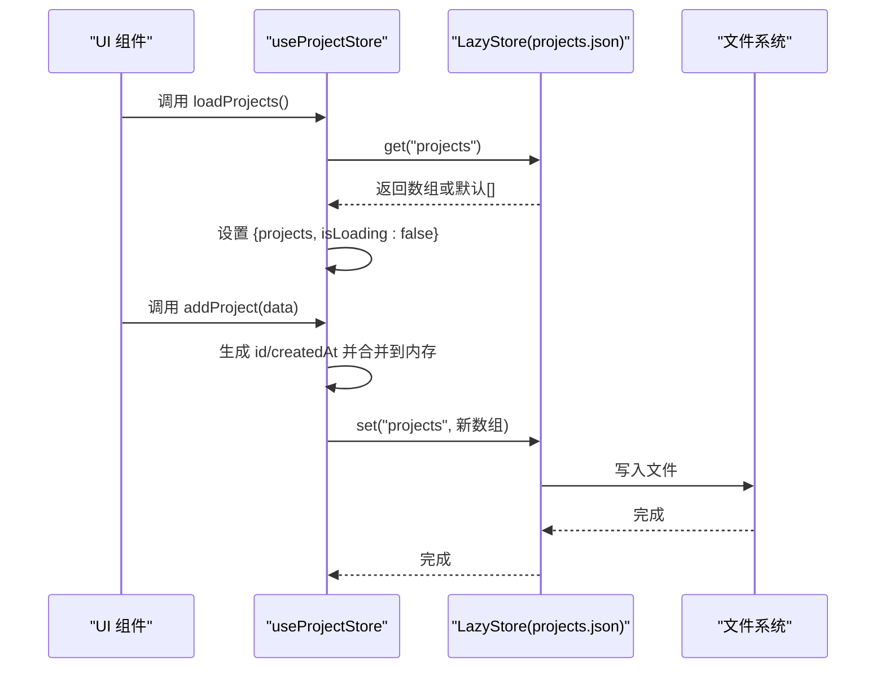
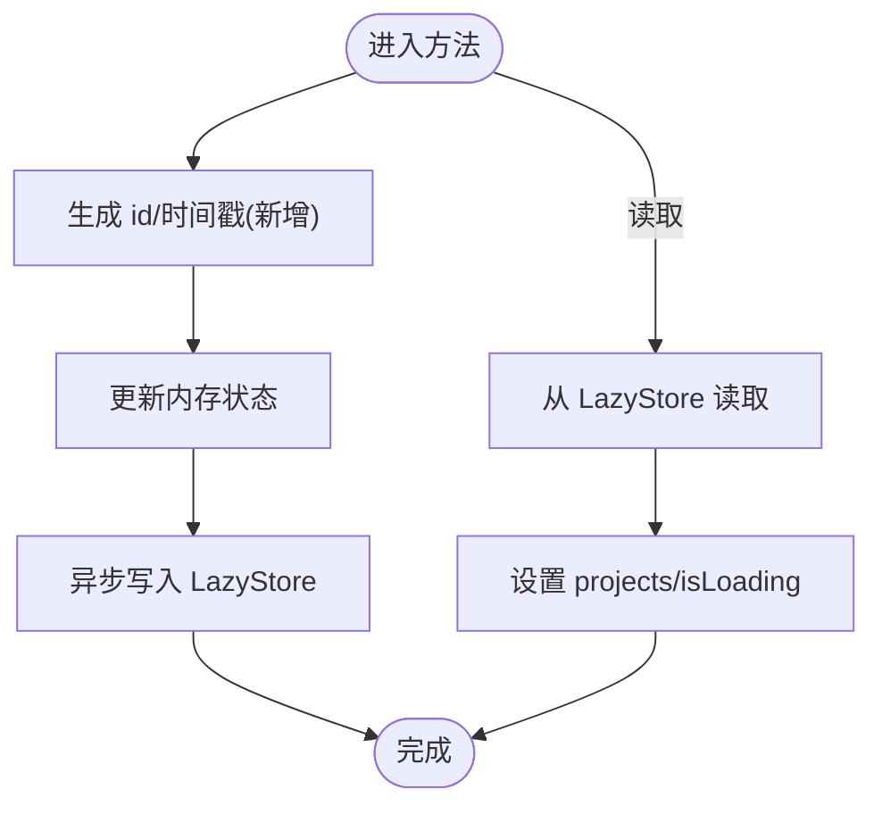
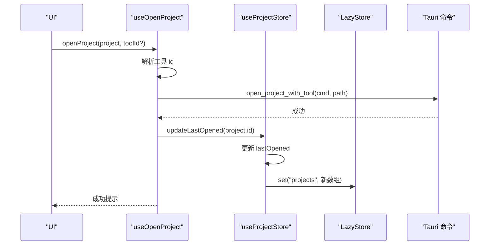
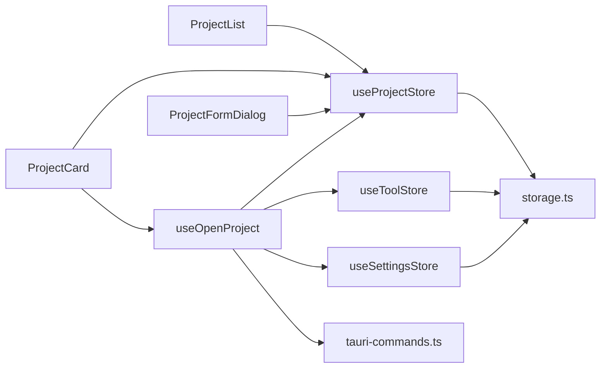

# 项目状态管理

<cite>
**本文引用的文件**
- [useProjectStore.ts](file://src/stores/useProjectStore.ts)
- [index.ts（类型定义）](file://src/types/index.ts)
- [storage.ts（存储封装）](file://src/lib/storage.ts)
- [constants.ts（常量）](file://src/lib/constants.ts)
- [ProjectList.tsx](file://src/components/project/ProjectList.tsx)
- [ProjectCard.tsx](file://src/components/project/ProjectCard.tsx)
- [ProjectFormDialog.tsx](file://src/components/project/ProjectFormDialog.tsx)
- [useOpenProject.ts](file://src/hooks/useOpenProject.ts)
- [App.tsx](file://src/App.tsx)
- [main.tsx](file://src/main.tsx)
- [useToolStore.ts](file://src/stores/useToolStore.ts)
- [useSettingsStore.ts](file://src/stores/useSettingsStore.ts)
- [tauri-commands.ts](file://src/lib/tauri-commands.ts)
</cite>

## 目录
1. [简介](#简介)
2. [项目结构](#项目结构)
3. [核心组件](#核心组件)
4. [架构总览](#架构总览)
5. [详细组件分析](#详细组件分析)
6. [依赖关系分析](#依赖关系分析)
7. [性能与内存考量](#性能与内存考量)
8. [故障排查指南](#故障排查指南)
9. [结论](#结论)
10. [附录：使用示例与最佳实践](#附录使用示例与最佳实践)

## 简介
本文件聚焦于项目状态管理模块，系统性解析 useProjectStore 的实现原理、设计模式与数据流，覆盖项目 CRUD 生命周期（加载、新增、更新、删除、最后打开时间更新），并说明数据模型结构、异步状态更新机制、错误处理策略、持久化存储与数据同步、UUID 与时间戳管理细节，以及性能优化与内存管理建议。同时提供可直接落地的使用示例与最佳实践。

## 项目结构
项目采用前端状态管理 + Tauri 插件存储的分层架构：
- 前端状态层：基于 Zustand 的 useProjectStore、useToolStore、useSettingsStore
- 数据模型层：统一在 types 中定义
- 存储层：基于 @tauri-apps/plugin-store 的 LazyStore 封装
- UI 层：React 组件通过 hooks 订阅状态并触发动作
- 命令层：通过 Tauri invoke 调用后端命令（如打开项目、路径校验）

图表来源
- [App.tsx:21-30](file://src/App.tsx#L21-L30)
- [useProjectStore.ts:16-66](file://src/stores/useProjectStore.ts#L16-L66)
- [useToolStore.ts:17-74](file://src/stores/useToolStore.ts#L17-L74)
- [useSettingsStore.ts:13-33](file://src/stores/useSettingsStore.ts#L13-L33)
- [storage.ts:19-29](file://src/lib/storage.ts#L19-L29)
- [tauri-commands.ts:3-12](file://src/lib/tauri-commands.ts#L3-L12)

章节来源
- [App.tsx:21-30](file://src/App.tsx#L21-L30)
- [main.tsx:1-11](file://src/main.tsx#L1-L11)

## 核心组件
- useProjectStore：负责项目集合的加载、新增、更新、删除、最后打开时间更新，并与 LazyStore 同步持久化
- 类型定义：Project、Tool、Settings 等统一在 types 中声明
- 存储封装：storage.ts 提供 getProjectsStore/getToolsStore/getSettingsStore，分别对应 projects.json、tools.json、settings.json
- 工具与设置：useToolStore、useSettingsStore 与 useProjectStore 协同工作
- 打开项目：useOpenProject 在 UI 中调用，执行命令并回写最后打开时间

章节来源
- [useProjectStore.ts:6-14](file://src/stores/useProjectStore.ts#L6-L14)
- [index.ts:1-26](file://src/types/index.ts#L1-L26)
- [storage.ts:19-29](file://src/lib/storage.ts#L19-L29)
- [useToolStore.ts:7-15](file://src/stores/useToolStore.ts#L7-L15)
- [useSettingsStore.ts:6-11](file://src/stores/useSettingsStore.ts#L6-L11)
- [useOpenProject.ts:9-43](file://src/hooks/useOpenProject.ts#L9-L43)

## 架构总览
useProjectStore 以函数式状态机的方式组织，内部维护 projects 数组与 isLoading 标志；所有变更均先更新内存状态，再异步写入 LazyStore，确保 UI 及时响应且持久化落盘。

图表来源
- [useProjectStore.ts:20-28](file://src/stores/useProjectStore.ts#L20-L28)
- [useProjectStore.ts:30-40](file://src/stores/useProjectStore.ts#L30-L40)
- [storage.ts:4-7](file://src/lib/storage.ts#L4-L7)

## 详细组件分析

### useProjectStore 实现与设计模式
- 设计模式：Zustand 函数式状态机 + LazyStore 异步持久化
- 关键方法：
  - loadProjects：从 LazyStore 读取 projects，失败时回退为空数组
  - addProject：生成唯一 id 与创建时间，更新内存与持久化
  - updateProject：映射更新并持久化
  - deleteProject：过滤删除并持久化
  - updateLastOpened：更新 lastOpened 并持久化
- 错误处理：所有异步读写包裹 try/catch，失败时仍保证状态稳定（空数组或当前值）
- 性能特性：内存状态即时更新，避免重复渲染；LazyStore 自动保存，减少手动调用

图表来源
- [useProjectStore.ts:30-40](file://src/stores/useProjectStore.ts#L30-L40)
- [useProjectStore.ts:42-49](file://src/stores/useProjectStore.ts#L42-L49)
- [useProjectStore.ts:51-56](file://src/stores/useProjectStore.ts#L51-L56)
- [useProjectStore.ts:58-65](file://src/stores/useProjectStore.ts#L58-L65)

章节来源
- [useProjectStore.ts:16-66](file://src/stores/useProjectStore.ts#L16-L66)

### 项目数据模型与字段语义
- Project 字段
  - id：字符串，全局唯一标识，用于更新/删除定位
  - name：字符串，项目名称
  - path：字符串，项目本地路径
  - defaultTool：可选字符串，项目默认工具 id
  - tags：字符串数组，项目标签
  - note：可选字符串，备注
  - lastOpened：可选数字，毫秒级时间戳，最近打开时间
  - createdAt：数字，毫秒级时间戳，创建时间
- 时间戳与排序
  - UI 层按 lastOpened 或 createdAt 降序排列，未设置 lastOpened 时回退到 createdAt

章节来源
- [index.ts:1-10](file://src/types/index.ts#L1-L10)
- [ProjectList.tsx:49-55](file://src/components/project/ProjectList.tsx#L49-L55)
- [ProjectCard.tsx:34-37](file://src/components/project/ProjectCard.tsx#L34-L37)

### CRUD 生命周期详解
- 加载（loadProjects）
  - 触发时机：应用启动时由 App 统一调用
  - 流程：读取 projects.json -> 更新内存 -> 关闭加载态
- 新增（addProject）
  - 输入：省略 id/createdAt 的项目数据
  - 处理：生成 id 与 createdAt -> 合并到内存 -> 写入 projects.json
- 更新（updateProject）
  - 输入：id 与部分字段更新
  - 处理：映射匹配项 -> 合并更新 -> 写入 projects.json
- 删除（deleteProject）
  - 输入：id
  - 处理：过滤掉该 id -> 写入 projects.json
- 最后打开时间更新（updateLastOpened）
  - 触发：用户点击“打开”后，成功调用后端命令后更新
  - 处理：更新对应项目的 lastOpened -> 写入 projects.json

图表来源
- [useOpenProject.ts:15-40](file://src/hooks/useOpenProject.ts#L15-L40)
- [useProjectStore.ts:58-65](file://src/stores/useProjectStore.ts#L58-L65)
- [tauri-commands.ts:3-8](file://src/lib/tauri-commands.ts#L3-L8)

章节来源
- [App.tsx:26-30](file://src/App.tsx#L26-L30)
- [useOpenProject.ts:15-40](file://src/hooks/useOpenProject.ts#L15-L40)
- [useProjectStore.ts:20-28](file://src/stores/useProjectStore.ts#L20-L28)
- [useProjectStore.ts:30-40](file://src/stores/useProjectStore.ts#L30-L40)
- [useProjectStore.ts:42-49](file://src/stores/useProjectStore.ts#L42-L49)
- [useProjectStore.ts:51-56](file://src/stores/useProjectStore.ts#L51-L56)
- [useProjectStore.ts:58-65](file://src/stores/useProjectStore.ts#L58-L65)

### 异步状态更新与错误处理
- 异步更新链路
  - 内存状态先变，UI 立即响应
  - 异步写入 LazyStore，自动保存
- 错误处理策略
  - 读取失败：返回空数组并关闭加载态
  - 写入失败：不阻断 UI，但可能丢失本次变更（建议上层重试或提示）
  - 打开项目失败：捕获异常并提示
- 建议
  - 对关键写入增加重试与本地回滚提示
  - 在 UI 层增加“保存中/失败”状态反馈

章节来源
- [useProjectStore.ts:20-28](file://src/stores/useProjectStore.ts#L20-L28)
- [useProjectStore.ts:30-40](file://src/stores/useProjectStore.ts#L30-L40)
- [useProjectStore.ts:42-49](file://src/stores/useProjectStore.ts#L42-L49)
- [useProjectStore.ts:51-56](file://src/stores/useProjectStore.ts#L51-L56)
- [useProjectStore.ts:58-65](file://src/stores/useProjectStore.ts#L58-L65)
- [useOpenProject.ts:31-37](file://src/hooks/useOpenProject.ts#L31-L37)

### 持久化存储与数据同步
- LazyStore 配置
  - projects.json：默认值为空数组，自动保存
  - tools.json：默认值为内置工具集，自动保存
  - settings.json：默认值为默认设置，自动保存
- 同步机制
  - 所有写入均通过 LazyStore.set 触发，autoSave=true 保证落盘
  - 读取通过 LazyStore.get 获取，失败回退默认值
- 注意事项
  - 首次启动会初始化 tools.json 与 settings.json
  - 项目数据仅在项目相关操作中写入 projects.json

章节来源
- [storage.ts:4-17](file://src/lib/storage.ts#L4-L17)
- [storage.ts:19-29](file://src/lib/storage.ts#L19-L29)
- [useToolStore.ts:21-39](file://src/stores/useToolStore.ts#L21-L39)
- [useSettingsStore.ts:17-25](file://src/stores/useSettingsStore.ts#L17-L25)

### UUID 生成与时间戳管理
- UUID
  - 使用 uuid 库生成 v4 唯一 id，用于项目与工具等实体
- 时间戳
  - 新增时写入 createdAt（毫秒）
  - 打开项目成功后写入 lastOpened（毫秒）
- UI 展示
  - 项目卡片将 lastOpened 格式化为相对时间字符串

章节来源
- [useProjectStore.ts:31-35](file://src/stores/useProjectStore.ts#L31-L35)
- [useProjectStore.ts:59-61](file://src/stores/useProjectStore.ts#L59-L61)
- [ProjectCard.tsx:163-173](file://src/components/project/ProjectCard.tsx#L163-L173)

### UI 与状态联动
- 列表筛选与排序
  - 支持搜索框与标签过滤，排序优先 lastOpened，其次 createdAt
- 表单交互
  - 新增/编辑对话框，路径选择与存在性校验
- 打开项目
  - 优先使用传入 toolId，其次项目默认，再次全局默认
  - 成功后调用 updateLastOpened

章节来源
- [ProjectList.tsx:29-55](file://src/components/project/ProjectList.tsx#L29-L55)
- [ProjectFormDialog.tsx:64-134](file://src/components/project/ProjectFormDialog.tsx#L64-L134)
- [useOpenProject.ts:15-40](file://src/hooks/useOpenProject.ts#L15-L40)

## 依赖关系分析
- 组件依赖
  - ProjectList 依赖 useProjectStore、useUIStore、useToolStore
  - ProjectCard 依赖 useProjectStore、useToolStore、useOpenProject
  - ProjectFormDialog 依赖 useProjectStore、useToolStore、tauri-commands
  - useOpenProject 依赖 useToolStore、useSettingsStore、useProjectStore、tauri-commands
- 状态依赖
  - useProjectStore 依赖 LazyStore 封装与 uuid
  - useToolStore 依赖 LazyStore 封装、uuid、constants
  - useSettingsStore 依赖 LazyStore 封装、constants
- 命令依赖
  - tauri-commands 提供 open_project_with_tool、check_path_exists、get_app_data_dir

图表来源
- [ProjectList.tsx:7-19](file://src/components/project/ProjectList.tsx#L7-L19)
- [ProjectCard.tsx:17-34](file://src/components/project/ProjectCard.tsx#L17-L34)
- [ProjectFormDialog.tsx:20-36](file://src/components/project/ProjectFormDialog.tsx#L20-L36)
- [useOpenProject.ts:9-43](file://src/hooks/useOpenProject.ts#L9-L43)
- [storage.ts:19-29](file://src/lib/storage.ts#L19-L29)
- [tauri-commands.ts:3-16](file://src/lib/tauri-commands.ts#L3-L16)

章节来源
- [ProjectList.tsx:7-19](file://src/components/project/ProjectList.tsx#L7-L19)
- [ProjectCard.tsx:17-34](file://src/components/project/ProjectCard.tsx#L17-L34)
- [ProjectFormDialog.tsx:20-36](file://src/components/project/ProjectFormDialog.tsx#L20-L36)
- [useOpenProject.ts:9-43](file://src/hooks/useOpenProject.ts#L9-L43)
- [storage.ts:19-29](file://src/lib/storage.ts#L19-L29)
- [tauri-commands.ts:3-16](file://src/lib/tauri-commands.ts#L3-L16)

## 性能与内存考量
- 渲染优化
  - ProjectList 使用 useMemo 进行标签收集与过滤，避免重复计算
  - 排序在内存中进行，复杂度 O(n log n)，n 为项目数
- 状态粒度
  - 项目列表一次性加载，适合中小规模项目集
  - 若项目数量增长，建议分页或懒加载
- 存储策略
  - LazyStore 自动保存，避免频繁手动调用
  - 大批量写入时可考虑合并写入，减少磁盘 IO
- 内存占用
  - 仅保留必要字段（id、name、path、tags、lastOpened、createdAt）
  - 避免在 UI 中缓存大型对象，保持轻量渲染

章节来源
- [ProjectList.tsx:22-55](file://src/components/project/ProjectList.tsx#L22-L55)
- [useProjectStore.ts:16-18](file://src/stores/useProjectStore.ts#L16-L18)

## 故障排查指南
- 无法加载项目
  - 检查 projects.json 是否损坏或权限问题
  - 确认 LazyStore 初始化是否成功
- 新增/更新无效
  - 确认 add/update/delete 方法被正确调用
  - 检查 LazyStore.set 是否抛错
- 打开项目失败
  - 检查工具命令模板与路径是否存在
  - 查看 useOpenProject 的错误提示
- 时间显示异常
  - 确认 lastOpened/createdAt 是否为毫秒时间戳
  - 检查格式化函数逻辑

章节来源
- [useProjectStore.ts:20-28](file://src/stores/useProjectStore.ts#L20-L28)
- [useProjectStore.ts:30-40](file://src/stores/useProjectStore.ts#L30-L40)
- [useProjectStore.ts:42-49](file://src/stores/useProjectStore.ts#L42-L49)
- [useProjectStore.ts:51-56](file://src/stores/useProjectStore.ts#L51-L56)
- [useProjectStore.ts:58-65](file://src/stores/useProjectStore.ts#L58-L65)
- [useOpenProject.ts:31-37](file://src/hooks/useOpenProject.ts#L31-L37)
- [ProjectCard.tsx:163-173](file://src/components/project/ProjectCard.tsx#L163-L173)

## 结论
useProjectStore 通过简洁的函数式状态机与 LazyStore 持久化，实现了项目数据的全生命周期管理。其设计强调即时响应与最终一致性，结合 UI 层的筛选与排序，提供了良好的用户体验。建议在大规模场景下引入分页与批量写入策略，并增强错误恢复与重试机制。

## 附录：使用示例与最佳实践
- 启动时加载
  - 在应用入口调用 loadProjects，确保 UI 与存储一致
- 新增项目
  - 通过 ProjectFormDialog 输入 name/path/tags 等，提交后自动写入
- 更新项目
  - 通过对话框编辑并提交，或在业务逻辑中调用 updateProject
- 删除项目
  - 通过 ProjectCard 的删除菜单确认后执行
- 打开项目
  - 通过 ProjectCard 或自定义按钮触发 useOpenProject，成功后自动更新 lastOpened
- 最佳实践
  - 保持字段最小化，避免冗余数据
  - 对外暴露只读视图，内部统一通过 store 方法修改
  - 对关键写入增加本地提示与重试
  - 对大列表使用虚拟滚动与分页

章节来源
- [App.tsx:26-30](file://src/App.tsx#L26-L30)
- [ProjectFormDialog.tsx:84-134](file://src/components/project/ProjectFormDialog.tsx#L84-L134)
- [ProjectCard.tsx:104-147](file://src/components/project/ProjectCard.tsx#L104-L147)
- [useOpenProject.ts:15-40](file://src/hooks/useOpenProject.ts#L15-L40)